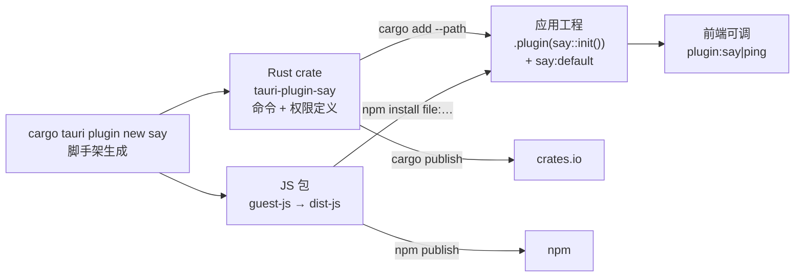

import { Canvas, Controls, Meta } from '@storybook/addon-docs/blocks';
import * as CustomPlugin from './custom-plugin.stories';

<Meta of={CustomPlugin} name="Docs" />

# 自定义插件

官方插件不够用时,Tauri 2 提供了和官方插件完全相同的自建通道:`tauri plugin new` 脚手架一次生成插件的全部骨架——Rust 核心 crate、前端 JS 包、权限定义、示例应用,填空即可交付。[插件体系](?path=/docs/plugin-system--docs)一课从消费侧讲过「四件套」(核心包、前端包、注册、授权),本课站到生产侧把这套东西从头造出来:核心判断是**自定义插件不是新知识,而是把四件套按固定结构生产一遍**。读完你能独立搭插件工程、把 Rust 命令封装成带类型的 JS API、用自动生成的权限接入 ACL,并发布到 npm 与 crates.io。

从脚手架到发布,一条插件的完整生命周期:



插件工程关键文件速查(本课的回查入口,按目录顺序):

| 文件 / 目录 | 职责 | 回查点 |
| --- | --- | --- |
| `src/commands.rs` | 插件命令(`#[tauri::command]`) | 命令名用 snake_case |
| `src/lib.rs` | `init()`:注册命令、初始化状态 | `Builder::new("<短名>")`、`invoke_handler` |
| `src/desktop.rs` / `src/mobile.rs` | 平台实现,`#[cfg]` 门控 | 扩展 trait `SayExt` 挂 `.say()` |
| `src/error.rs` / `src/models.rs` | 插件错误类型 / 共享结构 | 对外导出 `Error`、`Result` |
| `guest-js/` | JS API 源码 | 底层是 `invoke('plugin:<短名>\|<命令>')` |
| `dist-js/` | guest-js 的构建产物 | npm 包只发布它(`files` 字段) |
| `permissions/` | 权限文件(TOML/JSON) | `default.toml` 定义 default 权限集 |
| `build.rs` | 权限自动生成与命名约定校验 | `COMMANDS` 数组决定生成哪些 `allow-` / `deny-` |
| `Cargo.toml` / `package.json` | 两个包的清单 | crate 带 `links` 键;`build` 脚本 = `rollup -c` |
| `examples/` | 脚手架自带的示例应用 | `--no-example` 可跳过 |

## 快速上手

前提:已有[第一个应用](?path=/docs/first-app--docs)生成的 react-ts 工程。最小闭环:脚手架生成插件 → 以 path 依赖接入应用 → 调用模板自带的 `ping` 命令。

1. 生成插件工程(在应用工程根目录执行,生成同级子目录 `tauri-plugin-say/`):

```bash
cargo tauri plugin new say
# 等价写法:npx @tauri-apps/cli plugin new say
```

2. 构建 JS 包(guest-js 源码要先编译成 `dist-js`,npm 包的入口指向它):

```bash
cd tauri-plugin-say
npm install
npm run build   # rollup -c:guest-js → dist-js
cd ..
```

3. 以本地路径接入应用(发布前的标准调试方式,见「调试与发布」):

```bash
# Rust 侧:path 依赖
cd src-tauri
cargo add --path ../tauri-plugin-say
cd ..

# 前端侧:file 依赖(包名 tauri-plugin-say-api)
npm install ./tauri-plugin-say
```

4. 注册与授权——四件套的后两件:

```rust
// src-tauri/src/lib.rs
tauri::Builder::default()
    .plugin(tauri_plugin_say::init()) // 短名 say 对应 tauri_plugin_say
    .run(tauri::generate_context!())
    .expect("error while running tauri application");
```

```json
// src-tauri/capabilities/default.json —— say:default 由插件的 permissions/default.toml 提供
"permissions": ["core:default", "say:default"]
```

5. 前端调用(模板自带 `ping` 命令与对应封装):

```tsx
import { ping } from 'tauri-plugin-say-api';

const result = await ping('hi');
console.log(result); // 命令把 payload 原样返回
```

`npm run tauri dev` 运行,调用即通。dev 下改插件的 Rust 代码会自动重编译;改 guest-js 后要回到插件目录重新 `npm run build`(原因见「调试与发布」)。

## 脚手架:tauri plugin new

CLI 的 `tauri plugin` 命令族负责插件的创建与平台工程:`new` 初始化新工程,`init` 在已有目录初始化,`android` / `ios` 给插件补移动端工程。新工程从 `new` 开始:

```bash
cargo tauri plugin new say
```

生成 `tauri-plugin-say/` 目录,内含上方速查表的全部内容,外加一个可直接运行的示例应用。常用选项:

| 选项 | 作用 |
| --- | --- |
| `--no-api` | 不生成 JS API(`guest-js/`、`package.json` 都不要),做 Rust-only 插件 |
| `--no-example` | 不生成示例应用 |
| `--android` / `--ios` / `--mobile` | 同时初始化移动端插件工程(iOS 默认用 Swift Package Manager) |
| `--github-workflows` | 生成 GitHub Actions 工作流(构建、测试与两包发布) |
| `-d, --directory` | 指定生成目录 |
| `-a, --author` | 作者署名 |

### 命名约定:短名推导一切

脚手架只问你一个名字——插件短名 `<name>`,其余全部落点名都由它推导:

| 位置 | 通用形态 | say 示例 |
| --- | --- | --- |
| Rust crate | `tauri-plugin-<name>` | `tauri-plugin-say` |
| Rust 标识(注册用) | `tauri_plugin_<name>::init()` | `tauri_plugin_say::init()` |
| npm 包 | `tauri-plugin-<name>-api` 或 `@<scope>/plugin-<name>` | `tauri-plugin-say-api` |
| 权限前缀 | `<name>:` | `say:default`、`say:allow-ping` |
| 命令通道 | `plugin:<name>\|<命令>` | `plugin:say\|ping` |

这和[插件体系](?path=/docs/plugin-system--docs)一课的消费侧推导表是同一套规律——现在你是它的生产者。两条硬约束:

- **短名不能含下划线**(只能小写字母、数字、连字符):Rust 标识要转下划线,含混的名字会被构建期校验拒绝。
- **crate 名不可随手改**:`Cargo.toml` 的 `links` 键必须与 crate 名一致,这是构建期校验与 ACL 关联的锚点。

下面的实例把名字推导和命令调用链路做成可调的模拟:改短名与命令名,读数里六个落点同步重推;链路图展示一次前端调用如何经 ACL 路由到 Rust 命令,以及权限的自动生成来源:

<Canvas of={CustomPlugin.Interactive} />
<Controls of={CustomPlugin.Interactive} />

| 读者操作 | 可观察证据 |
| --- | --- |
| 改「插件短名」(如 `greeting`) | 六项读数与链路图内的 crate 名、npm 包、权限、通道全部同步重推 |
| 改「命令名」(如 `encode`) | ACL 框、虚线框与命令框同步变化,提示三处同步点 |
| 短名改成含下划线(如 `my_say`) | 标题与读数标红,提示短名约束 |
| 「前端包命名」切到 scoped | 读数「前端包」变为 `@your-scope/plugin-<短名>` |
| 打开 Show code | 看到该 Canvas 实际执行的 `plugin-derivation.ts` |

## 工程结构:两包一权限

插件工程同时是**两个包 + 一份权限定义**:

- **Rust crate(`src/` + `Cargo.toml`)**:发布到 crates.io 的部分。`commands.rs` 写命令,`lib.rs` 提供 `init()`,`error.rs` 定义插件的 `Error` / `Result`(命令签名统一走它),`models.rs` 放前后端共享的结构体。
- **JS 包(`guest-js/` → `dist-js/` + `package.json`)**:发布到 npm 的部分。`guest-js/` 是 TypeScript 源码,`dist-js/` 是 `rollup -c` 的构建产物;`package.json` 的 `exports` 与 `files` 只指向 `dist-js`,所以改了 guest-js 必须重新构建。
- **权限定义(`permissions/` + `build.rs`)**:不单独发布,随 crate 走。应用构建时,Tauri 读取各插件的权限文件编译出 ACL 权威表——[权限与能力](?path=/docs/capabilities--docs)一课里 `say:allow-ping` 这类权限名,源头就在插件的 `permissions/` 目录。

`build.rs` 只在构建期工作,本身不进任何产物:它声明插件命令、触发权限自动生成,并校验命名约定(短名、`links` 键)。细节在「权限」一节。

## Rust 侧:命令与注册

### 命令与命名空间

命令语法与应用命令完全相同([命令](?path=/docs/commands--docs)一课的 `#[tauri::command]`、参数、异步、错误处理都适用),差别只在注册位置与可见性:命令不进应用的 `generate_handler!`,而是进插件自己的 `invoke_handler`,前端通道随之带上 `plugin:<短名>|` 命名空间,并**默认拒绝**——ACL 授权后才放行。

```rust
// src/commands.rs —— 与应用命令语法相同,错误类型用插件自己的 Result
#[tauri::command]
pub(crate) fn encode(payload: String) -> Result<String, Error> {
    Ok(format!("<{payload}>"))
}
```

```ts
// 前端通道:命名空间 plugin:say|encode,参数由 guest-js 封装拼装
await invoke('plugin:say|encode', { payload: 'hi' });
```

### init、Builder 与扩展 trait

`lib.rs` 的 `init()` 是插件的注册入口,脚手架生成后基本只需维护 `invoke_handler` 列表:

```rust
// src/lib.rs —— 脚手架生成(节选)
use tauri::{
    plugin::{Builder, TauriPlugin},
    Manager, Runtime,
};

#[cfg(desktop)]
mod desktop;
#[cfg(mobile)]
mod mobile;
mod commands;
mod error;
mod models;

pub use error::{Error, Result};
#[cfg(desktop)]
pub use desktop::SayExt; // 扩展 trait:给 AppHandle / Window 挂 .say()

pub fn init<R: Runtime>() -> TauriPlugin<R> {
    Builder::new("say") // 短名在这里;命令通道与权限前缀都由它决定
        .invoke_handler(tauri::generate_handler![commands::ping])
        .setup(|app, api| {
            // 平台初始化:desktop / mobile 各自构造插件状态
            #[cfg(mobile)]
            let handle = mobile::init(app, api)?;
            #[cfg(desktop)]
            let handle = desktop::init(app, api)?;
            app.manage(handle); // 状态交给 Tauri 管理,扩展 trait 从这里取
            Ok(())
        })
        .build()
}
```

`Builder::new("say")` 的字符串就是短名——它与 crate 名、权限前缀的一致性由构建期校验兜底。扩展 trait 定义在 `desktop.rs`(移动端同名一份;Android / iOS 插件工程的完整开发归移动端阶段):

```rust
// src/desktop.rs(节选)—— 3.1 课里 DialogExt 挂 .dialog() 的规律,就是这里定义的
pub trait SayExt<R: Runtime> {
    fn say(&self) -> &Say<R>;
}

impl<R: Runtime, T: Manager<R>> SayExt<R> for T {
    fn say(&self) -> &Say<R> {
        self.state::<Say<R>>().inner() // 从 setup 里 manage 的状态取回
    }
}
```

注册后,Rust 侧就能 `use tauri_plugin_say::SayExt;` 然后 `app.say().…` 调用插件能力——没有 JS 包的 Rust-only 插件(`--no-api`),这就是唯一入口。Builder 链上还有这些生命周期钩子可按需挂载:`setup`(初始化状态)、`on_navigation`(页面导航)、`on_webview_ready`、`on_event`(窗口与应用事件)、`on_drop`(插件销毁)。

### 插件配置

[插件体系](?path=/docs/plugin-system--docs)一课讲过应用在 `tauri.conf.json > plugins > <短名>` 里写配置;插件侧只需要一个配置结构体,并把 `Builder` 的类型参数指定为它:

```rust
// 配置结构:应用配置会反序列化进来
#[derive(Debug, Deserialize)]
pub struct Config {
    pub prefix: Option<String>,
}

// 配置必填:Builder::<R, Config>::new("say")
// 配置可选:Builder::<R, Option<Config>>::new("say"),setup 里 unwrap_or_default
Builder::<R, Config>::new("say").setup(|app, api| {
    let config = api.config(); // 读取应用传入的配置
    // ...
})
```

## guest-js:JS API 封装

`guest-js/index.ts` 是插件的公开前端 API。封装原则:**薄封装**——每个函数就是一个带类型的 `invoke` 调用,负责类型签名与参数拼装,不藏业务逻辑:

```ts
// guest-js/index.ts —— 类型化签名 + 命令通道,模板的 ping 也是这个写法
import { invoke } from '@tauri-apps/api/core';

export async function encode(payload: string): Promise<string> {
  return await invoke('plugin:say|encode', { payload });
}
```

npm 包的发布形态由 `package.json` 的几个字段决定(脚手架已配好):

```json
// package.json(节选)
{
  "name": "tauri-plugin-say-api",
  "type": "module",
  "main": "./dist-js/index.cjs",
  "module": "./dist-js/index.js",
  "types": "./dist-js/index.d.ts",
  "files": ["dist-js", "README.md"],
  "scripts": {
    "build": "rollup -c"
  },
  "prepublishOnly": "pnpm build",
  "dependencies": {
    "@tauri-apps/api": "^2.0.0"
  }
}
```

两个要点:`files` 限定 npm 只发布 `dist-js` 与 README,`guest-js/` 源码不进包;`prepublishOnly` 在发布前自动构建,`dist-js` 不会忘更新。包名默认 `tauri-plugin-<短名>-api`,官方建议换成自己的 npm scope(如 `@your-scope/plugin-say`),改 `name` 字段即可。

## 权限:自动生成与 default 集

自定义插件也受 ACL 管辖:命令默认拒绝,权限定义是插件交付物的一部分。生成机制分两层——build.rs 按命令自动生成单项权限,`permissions/` 里的 TOML 把它们组织成权限集。

### 自动生成:build.rs 的 COMMANDS

```rust
// build.rs —— COMMANDS 里的每条命令,构建时自动生成 allow-<命令> 与 deny-<命令>
const COMMANDS: &[&str] = &["ping"];

fn main() {
    tauri_plugin::Builder::new(COMMANDS)
        .android_path("android") // 没有移动端工程就删掉这两行
        .ios_path("ios")
        .build();
}
```

`tauri_plugin::Builder::new(COMMANDS)` 在构建期做四件事:按 `COMMANDS` 自动生成 `allow-ping` / `deny-ping` 这样的成对权限;解析 `permissions/` 下的全部权限文件;生成 JSON schema(`permissions/schemas/`)与权限参考文档,应用的 capabilities 文件靠它获得自动补全;校验命名约定并链接移动端工程。**新增命令时把命令名加进 `COMMANDS`,不要手写同名单项权限**——两者标识符冲突。

### default 权限集与权限集

`permissions/default.toml` 定义 `<短名>:default` 权限集——应用 capabilities 里引用的就是它:

```toml
# permissions/default.toml —— 脚手架生成;新增命令后要把对应 allow- 加进来
"$schema" = "schemas/schema.json"

[default]
description = "say 插件的默认权限:演示命令"
permissions = ["allow-ping"]
```

应用侧 `"permissions": ["say:default"]` 之所以能调通 `ping`,靠的是这行 `allow-ping`。加了新命令却不把它收进任何权限集,调用就会以 not allowed 拒绝——这是自定义插件最高频的坑。权限文件也支持手写 `[[permission]]`(配 `commands.allow` / `commands.deny`)与 `[[set]]` 自定义权限集:

```toml
# permissions/sets.toml —— 把多条权限打包成一个可引用的名字
[[set]]
identifier = "say-full"
description = "say 插件全部命令"
permissions = ["allow-ping", "allow-encode"]
```

应用里引用 `say:say-full` 即可获得这两条命令。allow / deny 成对、deny 优先的规则与[权限与能力](?path=/docs/capabilities--docs)一课相同,插件侧同样适用。

### scope:资源范围

命令放行不等于资源全放行。给权限附带 scope,可以在命令之外再校验一层资源范围——比如限定命令允许操作的 URL、路径或参数前缀:

```toml
# permissions/encode.toml —— allow-encode 附带 scope:限定允许的前缀条目
[[permission]]
identifier = "allow-encode"
description = "允许 encode,scope 限定允许的前缀"
commands.allow = ["encode"]

[[permission.scope.allow]]
prefix = "safe-"
```

Rust 侧命令通过 `tauri::ipc::GlobalScope` / `CommandScope` 拿到 scope 条目,用 `allows()` / `denies()` 比对后再执行(完整签名见参考资料)。消费侧还能在 capability 文件里用对象形式给权限补充自己的 scope——写法见[权限与能力](?path=/docs/capabilities--docs)一课,两侧的判定汇成同一条规则:scope 不满足,即使命令权限已授权也拒绝。

## 调试与发布

### 本地调试:path 依赖

发布前的开发循环用本地路径依赖,不动 registry:

```toml
# src-tauri/Cargo.toml —— cargo add --path 的结果
[dependencies]
tauri-plugin-say = { path = "../tauri-plugin-say" }
```

```json
// package.json —— npm install ./tauri-plugin-say 的结果
{
  "dependencies": {
    "tauri-plugin-say-api": "file:tauri-plugin-say"
  }
}
```

dev 循环的两种改动走两条路:改插件 Rust 代码(命令、权限文件),应用侧 `tauri dev` 自动重编译;改 guest-js,`file:` 依赖不会自动跟踪源码变化,要回到插件目录 `npm run build` 重新产出 `dist-js`,再等应用重编译。调试中的授权与拒绝排查在[权限与能力](?path=/docs/capabilities--docs)一课。脚手架在 `examples/` 里生成的示例应用演示了完整接法,可对照参考。

### 发布:npm 与 crates.io

插件发布 = 两个包各发各的:

```bash
# JS 包:在插件根目录;prepublishOnly 会先跑 rollup 构建
npm publish

# Rust crate:同样在插件根目录
cargo publish
```

发布前的核对清单:两包版本号一起升(消费者要两侧同步升级);npm 包 `files` 确认只带 `dist-js` 与 README;crate 的 `Cargo.toml` 元数据(description、license、repository)补全。用 `--github-workflows` 生成的工作流可以自动完成两包的构建与发布,CI 配置的细化见[CI/CD](?path=/docs/ci-cd--docs)一课。发布后,应用侧把 path / file 依赖换回版本号即可回归正常安装(`cargo add tauri-plugin-say` + `npm install tauri-plugin-say-api`)。

## 最佳实践

- **先定短名,再让推导工作。** 短名决定 crate 名、Rust 标识、npm 包、权限前缀、命令通道五个落点,起名时避开下划线、预留扩展性;中途改名等于全链路返工。
- **default 集保持最小。** default 是消费者「顺手就开」的权限:低风险命令进 default,危险命令只留单项 `allow-<命令>`,让应用显式授权(收紧原则见[安全加固](?path=/docs/security--docs))。
- **前端包守住薄封装。** guest-js 只做类型签名与参数拼装,业务逻辑放应用或 Rust 侧;错误统一走插件的 `Error`,前端拿到的 reject 才可预期。
- **新命令按固定顺序三处同步。** `commands.rs` 定义 → `build.rs` 的 `COMMANDS` 登记 → `default.toml`(或自定义权限集)收编 → guest-js 导出,漏掉中间任意一步都表现为「命令不存在」或「not allowed」。
- **两包版本联动。** 命令、权限的变化必须 Rust 与 npm 两侧同时发版,CHANGELOG 注明新增命令与权限,消费者才能对齐升级。

## 常见问题

- 前端调用插件命令报 not allowed / denied
  最大嫌疑是新命令没进任何权限集:核对 `build.rs` 的 `COMMANDS` 是否登记了命令、`permissions/default.toml`(或自定义权限集)是否引用了对应 `allow-<命令>`,改完等应用重编译。排查思路与[权限与能力](?path=/docs/capabilities--docs)一课一致。
- 改了 guest-js,应用里 API 行为没变
  `file:` 依赖不会自动重新构建插件包。回插件目录跑 `npm run build` 重新产出 `dist-js`,再等应用重编译;只改了 Rust 侧则不需要这一步。
- 构建/发布报 crate 名或 `links` 校验错误
  短名混入了下划线或非法字符,或 `Cargo.toml` 的 `links` 键与 crate 名不一致。短名只允许小写字母、数字、连字符;`links = "tauri-plugin-<短名>"` 保持与 `name` 一致,不要手动改。
- 应用 capabilities 里报 unknown permission
  权限名拼错,或插件的权限 schema 还没生成。权限名遵循 `<短名>:allow-<命令>`;capability 文件头部的 `$schema` 指向 `../gen/schemas/`,由构建期自动生成,重启 `tauri dev` 让插件重新编译后再看补全。
- 发布的 npm 包里没有新函数
  `npm publish` 前忘了构建,或 `files` 字段漏配。`prepublishOnly: pnpm build` 是脚手架自带的兜底,手动发布流程先 `npm run build` 再 `npm publish`。

## 总结回顾

摘要:自定义插件把[插件体系](?path=/docs/plugin-system--docs)一课的四件套从消费侧翻到生产侧:`tauri plugin new` 一次生成 Rust crate(命令 + 权限定义)、JS 包(guest-js → dist-js)、权限骨架与示例应用,一切命名由插件短名推导,短名不能含下划线、crate 名受 `links` 键锚定。Rust 侧命令语法与应用命令相同,注册进插件自己的 `invoke_handler`,前端通道带 `plugin:<短名>|` 命名空间并默认拒绝;`init()` 与扩展 trait(如 `SayExt`)是 Rust 侧调用入口,配置结构体通过 `Builder` 的类型参数声明。guest-js 做薄封装,npm 包只发布构建出的 `dist-js`。权限分两层:`build.rs` 的 `COMMANDS` 自动生成 `allow-` / `deny-` 单项权限,`permissions/default.toml` 把它们收进 default 集,scope 再对命令做资源范围校验。开发期用 path / file 依赖调试,发布时 npm 与 crates.io 两包各自发布、版本联动。

一句话:

> 写自定义插件就是把「命令 + 权限 + 封装」填进脚手架的固定槽位:短名推导全部落点,COMMANDS 自动生成权限,default 集决定放行,两包各发各的。

知识要点:

- `tauri plugin new` 生成了哪些内容?常用选项各跳过什么?
- 插件短名推导出哪几个名字?两条命名硬约束是什么?
- 插件命令与应用命令在语法和注册上有何差异?为什么默认拒绝?
- `init()`、`Builder`、扩展 trait 各承担什么?Rust-only 插件靠什么使用?
- 插件配置在应用侧和插件侧各怎么写?
- guest-js 怎么变成 npm 包?哪些字段决定发布内容?
- `build.rs` 的 `COMMANDS` 自动生成什么?default 集怎么定义、怎么被应用引用?
- 新增一条命令要同步哪几处?漏了分别表现为什么?
- 开发期怎么接入插件?发布要发哪两个包?

## 参考资料

- [Plugin Development - Tauri 官方文档](https://tauri.app/develop/plugins/)
  命名约定、脚手架生成物、目录结构、插件配置、生命周期钩子、命令注册、guest-js 封装、权限定义、`[[permission]]` / `[[set]]` / scope 的 TOML 写法与 `tauri::ipc::GlobalScope` / `CommandScope` 消费方式的来源。
- [Tauri CLI 参考](https://tauri.app/reference/cli/)
  `tauri plugin new` 全部选项(`--no-api`、`--mobile`、`--github-workflows` 等)的来源。
- [tauri-plugin - docs.rs](https://docs.rs/tauri-plugin)
  构建期 crate 的职责:自动生成 `allow-` / `deny-` 权限、解析权限文件、生成 schema、命名约定(`links` 键、短名禁用下划线)校验的来源。
- [tauri-cli 插件模板 - GitHub](https://github.com/tauri-apps/tauri/tree/dev/crates/tauri-cli/templates/plugin)
  `tauri plugin new` 生成物的真源:`build.rs`、`lib.rs` 的 `init()` 与扩展 trait、`package.json` 的构建与发布字段、`prepublishOnly` 的来源。
