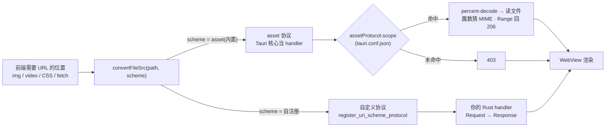

import { Canvas, Controls, Meta } from '@storybook/addon-docs/blocks';
import * as CustomProtocol from './custom-protocol.stories';

<Meta of={CustomProtocol} name="Docs" />

# 自定义协议

WebView 只认 URL:把磁盘上的文件喂给 ``、`<video>`、CSS 背景这类**必须给 URL 的位置**,`invoke` 和 fs 插件帮不上忙——它们能把数据读到 JS,却给不出一个可加载的地址。Tauri 的答案是把"资源"挂成协议(scheme):WebView 像请求网页一样发请求,请求落到 Rust 侧,响应以 HTTP Response 的形态回来。两条路:**内置 asset 协议**——配置即用,把磁盘路径映射成 URL,Tauri 核心当 handler;**自定义协议**——`register_uri_scheme_protocol` 自己写 handler,返回什么由代码决定。共同模型一句话:**前端永远用 `convertFileSrc(path, scheme)` 生成 URL,URL 形态随平台变,而 Rust 侧收到的 path 不变**。



本课用到的默认值与回查要点:

| 项 | 默认值 | 回查要点 |
| --- | --- | --- |
| `assetProtocol.enable` | `false` | tauri CLI 据此自动启用 `protocol-asset` Cargo feature;关掉则 asset 协议整体不可用 |
| `assetProtocol.scope` | `[]` | 空数组 = 不放行任何路径(全部 403) |
| 自定义协议 URL(macOS/Linux/iOS) | `{scheme}://localhost/{path}` | origin 直接以 scheme 开头 |
| 自定义协议 URL(Windows/Android) | `http://{scheme}.localhost/{path}` | 窗口配置 `useHttpsScheme: true` 时变 `https` |
| `convertFileSrc` 第二参数 | `'asset'` | 用自定义协议时传 scheme 名 |
| 协议注册时机 | `tauri::Builder` 构建期 | 必须在窗口创建前;没有运行时注册 API |
| asset 协议 Range 请求 | 支持(206) | 视频/音频可 seek;单次响应上限约 1MB |
| scope 未命中 / 文件不存在 | 403 / 404 | 先查 scope,再谈文件 |

## 快速上手

前提:已有[第一个应用](?path=/docs/first-app--docs)生成的 React 工程。最小闭环:把一张打包进安装包的图片显示到界面上。

1. 放入资源文件 `src-tauri/assets/logo.png`,并在 `tauri.conf.json` 声明打包与 asset 协议:

```json
{
  "bundle": {
    "resources": ["assets/*"]
  },
  "app": {
    "security": {
      "assetProtocol": {
        "enable": true,
        "scope": ["$RESOURCE/assets/*"]
      }
    }
  }
}
```

`bundle.resources` 只负责声明"哪些文件进安装包",映射与目录规则归[打包](?path=/docs/bundling--docs);开发期 tauri-build 会把它们拷到 `src-tauri/target/debug` 旁边,打包后放进安装包资源目录。

2. 前端两步:定位资源路径,再转成协议 URL:

```tsx
// src/App.tsx
import { useEffect, useState } from 'react';
import { resolveResource } from '@tauri-apps/api/path';
import { convertFileSrc } from '@tauri-apps/api/core';

export default function App() {
  const [src, setSrc] = useState('');
  useEffect(() => {
    // resolveResource → 资源目录内的绝对路径;$RESOURCE 变量指向它
    resolveResource('assets/logo.png').then((path) => {
      setSrc(convertFileSrc(path)); // → asset://localhost/…(Windows 为 http://asset.localhost/…)
    });
  }, []);
  return ;
}
```

3. `npm run tauri dev`:图片显示。链路是「`$RESOURCE` 解析出绝对路径 → `convertFileSrc` 生成 asset URL → Tauri 核心查 scope 放行 → 读文件回给 WebView」。不显示时先开 WebView 开发者工具看请求状态码:403 是 scope 没命中,404 是文件不在——排查见下方常见问题。

## 路径转 URL:convertFileSrc

`convertFileSrc(filePath, protocol)` 来自 `@tauri-apps/api/core`,把文件路径转换成 WebView 可加载的 URL;`protocol` 默认 `'asset'`,使用自定义协议时第二参数传 scheme 名。它做两件事:**整条路径 `encodeURIComponent`**(斜杠也变成 `%2F`,所以含空格、中文的路径照样可用),再**按平台拼前缀**:

| 平台 | URL 形态 | 示例(`convertFileSrc('/Users/me/photo.png')`) |
| --- | --- | --- |
| macOS / iOS / Linux | `{scheme}://localhost/{path}` | `asset://localhost/%2FUsers%2Fme%2Fphoto.png` |
| Windows / Android(默认) | `http://{scheme}.localhost/{path}` | `http://asset.localhost/%2FUsers%2Fme%2Fphoto.png` |
| Windows / Android + `useHttpsScheme` | `https://{scheme}.localhost/{path}` | `https://asset.localhost/%2FUsers%2Fme%2Fphoto.png` |

Rust 侧有等价物:`Webview::convert_file_src(path, None)`(第二参数 `Some("myproto")` 对应自定义协议),供 Rust 代码给 WebView 下发资源地址时使用。

`useHttpsScheme` 是窗口配置(`tauri.conf.json` 的 `app.windows[]`),把 Windows/Android 上的自定义协议(含 asset)与应用页面 origin 从 `http://` 换成 `https://`;官方警告:发布版本之间改动它会更换 IndexedDB、cookies 与 localStorage 的存储位置,旧数据读不到。https 形态下请求 http 端点会被当 mixed content 拦截,这一点与 macOS/Linux 的 `{scheme}://localhost` 行为不同。

为什么不能手拼 URL:形态随平台变,Windows 上手拼 `asset://localhost/…` 根本不会工作;编码规则(整条路径、含斜杠)手写容易漏。下面的实例可以逐项核对:切换协议、平台与资源路径,URL 变形而 Rust 侧收到的 path 不变。

<Canvas of={CustomProtocol.Interactive} />
<Controls of={CustomProtocol.Interactive} />

| 读者操作 | 可观察证据 |
| --- | --- |
| 「平台」在 macOS / Windows 间切换 | 生成 URL 在 `asset://localhost/…` 与 `http://asset.localhost/…` 间变形;`request.uri().path()` 读数不变 |
| 「协议」切到 myproto | URL 前缀变成自定义 scheme;处理器读数变成你注册的 handler |
| 「useHttpsScheme」打开(平台须为 Windows) | URL 变成 `https://myproto.localhost/…`;macOS/Linux 上无效果 |
| 「资源路径」选含空格中文的路径 | 整条路径被编码(空格 → `%20`),解码后路径还原 |
| 打开 Show code | 看到该 Canvas 实际执行的 `example.ts` |

## 内置 asset 协议

asset 是 Tauri 预注册好的 scheme,handler 由 Tauri 核心实现:`percent-decode` 路径 → 校验路径合法性 → 查 scope → 读文件 → 按**文件魔数**(前 8KB)推断 MIME → 处理 Range 请求。适合"把磁盘文件直接交给媒体标签"的场景,一行 Rust 都不用写;代价是只有"读原样文件"一种能力,想动态生成或加工内容就得用自定义协议。

开关与关卡都在 `tauri.conf.json` 的 `app.security.assetProtocol`(默认 `enable: false`、`scope: []`)。`enable: true` 的工作方式值得知道:tauri CLI 在编译时据此**自动启用 tauri crate 的 `protocol-asset` Cargo feature**——asset handler 与 Range 能力都编译在这个 feature 里;不经过 tauri CLI 的裸 `cargo build` 不会自动启用,见常见问题。scope 语义:

- **数组形式就是 allow 清单**;要精确排除时用对象形式 `{"allow": […], "deny": […]}`,**deny 命中优先于 allow**。
- 模式支持目录变量:`$RESOURCE`、`$HOME`、`$APPDATA` 等(与 path API 的变量同一套),`**` 跨层、`*` 只匹配一段;官方建议写 `**/*` 而不是裸 `**`。
- **判定对象是解析后的绝对路径**:用户主目录下的文件是 `/Users/me/…`,所以 `["*/**"]` 这类不带根的模式匹配不到——用 `$变量` 或以 `/` 开头的模式。
- Unix 上默认 `requireLiteralLeadingDot: true`:通配符不匹配 `.` 开头的段(`.cache` 之类),要放行得在模式里写字面量段或把该项设为 `false`。

scope 的关卡位置在 `tauri.conf.json`,**不在 capabilities**——asset 请求不是 IPC 命令,没有权限标识符可写,与 fs 插件的 `fs:scope`(写在 capabilities 里)是两回事。

响应行为回查表(排查"图片不显示"先看状态码):

| 现象 | 状态码 | 说明 |
| --- | --- | --- |
| 路径不在 scope / 路径非法 | 403 | 配置问题,不是文件问题 |
| scope 放行但文件读不到 | 404 | 路径拼写、平台目录差异 |
| 媒体 seek(Range 请求) | 206 | 单区间或多区间(`multipart/byteranges`),单次响应上限约 1MB,区间越界回 416 |
| MIME 推断 | — | 按内容魔数,不信任扩展名 |

两个边界:运行时由 dialog 选出的文件不在静态 scope 里,需要 `persisted-scope` 插件(开 `protocol-asset` feature,注册放在 `tauri_plugin_fs` 之后)把选择持久化进 scope;设置了 CSP 时要放行 `asset: http://asset.localhost`(见 [CSP](https://tauri.app/security/csp/),收紧策略见[安全加固](?path=/docs/security--docs))。

下面的实例重放核心的判定链:同一份 scope 配置,换一条请求路径就能看到 200 与 403 的分界。

<Canvas of={CustomProtocol.ScopeCheck} />
<Controls of={CustomProtocol.ScopeCheck} />

| 读者操作 | 可观察证据 |
| --- | --- |
| scope 预设切到 `empty` | 任何路径都 403——最常见的"图片不显示"原因 |
| `$RESOURCE/**/*` + `fonts/Inter.ttf` | 200;换 `$RESOURCE/assets/*` 后 403(单层模式放不下别的目录) |
| `$HOME/**/*` + `.cache/blob.dat`(Unix) | 403——dotfile 规则;「平台」切到 Windows 同一请求变 200 |
| `$HOME/**/*` + `secrets/key.pem` | allow 命中但 deny 命中,deny 优先 → 403 |
| 打开 Show code | 看到该 Canvas 实际执行的 `scope-check.ts` |

## 注册自定义协议

`tauri::Builder::register_uri_scheme_protocol(scheme, handler)` 把一个 scheme 注册给应用的所有 WebView:此后 WebView 对该 scheme 的**每个请求**都变成一次 handler 调用,收到 `http::Request<Vec<u8>>`,返回 `http::Response`——相当于 Rust 成了这个 scheme 的源站。底层按平台接在 WebView 的对应机制上(macOS `setURLSchemeHandler`、Windows `AddWebResourceRequestedFilter`、Linux `webkit-web-context-register-uri-scheme`)。两条硬边界:注册发生在 **Builder 构建期、窗口创建前**(2.x 没有 App/AppHandle 上的运行时注册);scheme 名要符合 URL scheme 语法——**字母开头,只能含字母、数字与 `+` `-` `.`**。

最小实现:返回一个动态生成的 SVG 徽章。响应头自己写,至少要有 `Content-Type`:

```rust
// src-tauri/src/lib.rs —— Builder 链上,必须在窗口创建前
use tauri::http;

tauri::Builder::default()
    .register_uri_scheme_protocol("myproto", |_ctx, request| {
        // path 形如 /构建通过:整体编码原样、带前导 "/",解码由处理器自己负责
        let name = request.uri().path().trim_start_matches('/');
        let badge = format!(
            "<svg xmlns='http://www.w3.org/2000/svg' width='120' height='40'>\
             <rect width='120' height='40' rx='6' fill='#4f7cff'/>\
             <text x='60' y='25' text-anchor='middle' fill='#fff' \
             font-family='sans-serif' font-size='14'>{}</text></svg>",
            name,
        );
        http::Response::builder()
            .header(http::header::CONTENT_TYPE, "image/svg+xml")
            .body(badge.into_bytes()) // Vec<u8> 满足 Into<Cow<'static, [u8]>>
            .unwrap()
    })
    .run(tauri::generate_context!())
    .expect("error while running tauri application");
```

前端照常由 `convertFileSrc` 生成 URL,第二参数传 scheme 名:

```ts
convertFileSrc('构建通过', 'myproto');
// macOS/Linux:myproto://localhost/%E6%9E%84%E5%BB%BA%E9%80%9A%E8%BF%87
// Windows:    http://myproto.localhost/%E6%9E%84%E5%BB%BA%E9%80%9A%E8%BF%87
```

请求侧的可回查要点:`request.uri().path()` 返回**编码原样、带前导斜杠**的路径(官方示例用 `path()[1..]` 去掉斜杠),含非 ASCII 或空格时要自己 percent-decode;查询串用 `request.uri().query()` 取。handler 的第一参数 `UriSchemeContext` 提供 `app_handle()`(拿应用句柄、发事件、访问状态)与 `webview_label()`(哪个 WebView 发起了这次请求)——请求来源可以区分,但注意:**自定义协议不是 IPC,不经过 capabilities/ACL**,放行谁、拒绝谁完全由 handler 代码决定。

### 同步与异步 handler

| | `register_uri_scheme_protocol` | `register_asynchronous_uri_scheme_protocol` |
| --- | --- | --- |
| handler 返回 | 直接返回 `Response` | 无返回值,交给 `UriSchemeResponder.respond(...)` |
| 执行方式 | 在 WebView 请求路径上同步执行 | 可转交线程,先返回后补响应 |
| 适用 | 内存中的小内容 | 大文件读取、慢渲染、查库 |

同步 handler 里做慢工作会拖住 WebView 的请求;大内容用异步版把工作放进线程:

```rust
tauri::Builder::default()
    .register_asynchronous_uri_scheme_protocol("myproto", |_ctx, request, responder| {
        std::thread::spawn(move || {
            let body = render_thumbnail(&request); // 慢工作放在别的线程
            responder.respond(
                http::Response::builder()
                    .header(http::header::CONTENT_TYPE, "image/png")
                    .body(body)
                    .unwrap(),
            );
        });
    })
    .run(tauri::generate_context!())
    .expect("error while running tauri application");
```

与 asset 协议的分界:内容是磁盘上的原样文件,asset 协议零代码;内容要**生成、转换、拼接或按请求动态决定**,才值得写自定义协议。选型取舍见最佳实践。

最后一个容易忽略的差异:从自定义协议加载的页面,其 **origin 在各平台不同**(`myproto://localhost` 与 `http://myproto.localhost` 是两个 origin)。这样的页面用浏览器 fetch 访问外部服务器时,服务器必须返回与之一致的 `Access-Control-Allow-Origin`(或 `*`),否则被 CORS 拦截;不需要跨域的纯资源加载(HTML 里引用)不受影响。

## 最佳实践

- **先问"URL 用在哪",再选通道。** 要"可加载的地址"(媒体标签、CSS、字体)才走协议;只要数据就用 `invoke` / fs 插件,别为读文本造 URL。资源是磁盘原样文件用 asset 协议;要动态生成、加工或精细控制再写自定义协议。
- **URL 一律 `convertFileSrc` 生成。** 平台形态与编码规则都在它里面;手拼在 Windows 上必踩 `asset://localhost` 的坑,含中文/空格的路径还会漏编码。
- **scope 最小化。** `$RESOURCE/assets/*` 优于 `$RESOURCE/**/*`,更优于 `$HOME/**/*`;敏感子目录用 deny 显式排除。asset 的关卡就是这份清单,写宽了等于没有。
- **自定义协议的 handler 把请求当不可信输入。** 解码后校验路径、钉死允许的根目录,防 `../` 逃逸——路径校验、scope 这些 asset 协议由核心代劳的事,自己的 handler 自己负责。
- **大内容走异步 handler,Content-Type 必须写对。** 同步 handler 的慢工作会拖住请求;类型错了 WebView 会按嗅探处理甚至拒渲染。Range 支持同理:视频/音频要可 seek,就得自己实现 206 + `Content-Range`,否则换 asset 协议。

## 常见问题

- 图片不显示,开发者工具里请求 403
  路径不在 `assetProtocol.scope` 内:检查 `enable` 是否为 `true`、模式是否能命中**解析后的绝对路径**——`["*/**"]` 匹配不到,要用 `$RESOURCE` 这类目录变量或以 `/` 开头的模式;Unix 上通配还不匹配 `.` 开头的段。改完重启 `tauri dev`。
- Windows 上手拼的 `asset://localhost/…` 加载失败
  Windows/Android 的形态是 `http(s)://{scheme}.localhost/{path}`,不是 `scheme://localhost`。这正是不手拼、统一走 `convertFileSrc` 的原因。
- 开发期图片正常,打包后 404 或找不到资源
  资源没有按声明进安装包,或路径经过了 `../`、绝对根被重映射成 `_up_`/`_root_`。前端始终用 `resolveResource` 定位、不要手拼资源目录;`bundle.resources` 的映射规则与产物结构见[打包](?path=/docs/bundling--docs)。
- 自定义协议 handler 完全没被调用
  依次核对:注册是否写在 `Builder` 链上且先于窗口创建;URL 是否由 `convertFileSrc(path, 'myproto')` 生成(拼成普通 `http://localhost` 不会路由到协议);scheme 名是否合法(字母开头,只能含字母数字与 `+` `-` `.`)。
- 视频/音频能播但不能拖进度
  asset 协议自带 Range 支持;自定义协议要自己解析 `Range` 头并回 `206` + `Content-Range`,只回 200 全量时 seek 会失效或每次从头加载。
- 自定义协议页面 fetch 外部接口被 CORS 拦
  协议页面的 origin 每个平台都不同,服务器返回的 `Access-Control-Allow-Origin` 必须与之精确一致(或 `*`);跨域请求改走 http 插件的 fetch 是另一条路,见[网络请求](?path=/docs/http--docs)。
- 配置里 `assetProtocol.enable` 明明是 `true`,直接 `cargo run` 跑 `src-tauri` 时 asset URL 却加载不了
  `enable` 是靠 tauri CLI 在编译时自动启用 `protocol-asset` Cargo feature 生效的,绕过 CLI 的裸 `cargo build` / `cargo run` 不会带这个 feature。手动加上:`tauri = { version = "2", features = ["protocol-asset"] }`(src-tauri/Cargo.toml),或统一用 `tauri dev` / `tauri build` 启动。

## 总结回顾

摘要:WebView 只认 URL,协议是把 Rust 侧内容变成可加载地址的机制:`convertFileSrc(path, scheme)` 把路径整体编码后按平台拼前缀(macOS/Linux 为 `{scheme}://localhost/`,Windows/Android 默认 `http://{scheme}.localhost/`、`useHttpsScheme` 换 https),所以 URL 永远由它生成。asset 协议由 Tauri 核心实现,开关与 scope 都在 `tauri.conf.json` 的 `app.security.assetProtocol`:scope 按解析后的绝对路径判定,支持目录变量、`**`/`*` 通配,Unix 上通配不匹配 dotfile 段,deny 命中优先;放行的文件按魔数猜 MIME、支持 Range(206)。自定义协议在 Builder 构建期注册、窗口创建前生效,每个请求变成一次 handler 调用(`Request<Vec<u8>>` → `Response`),路径解码与安全校验由 handler 自己负责,慢工作用异步版转交线程;它不经 capabilities/ACL,关卡就是 handler 代码,页面 origin 随平台不同。

一句话:

> 前端要 URL,Rust 给响应——asset 协议用配置圈定能读的磁盘,自定义协议用代码决定返回什么;URL 按平台变形,所以永远用 convertFileSrc 生成。

知识要点:

- 什么情况必须用协议 URL,什么情况 `invoke` / fs 插件就够?
- `convertFileSrc` 做了哪两件事?各平台生成的 URL 形态是什么?Windows 怎么切到 https、有什么代价?
- asset 协议怎么开启与授权?403 与 404 分别说明什么?
- `assetProtocol.scope` 怎么写?目录变量、通配、dotfile 规则与 deny 优先各自如何影响判定?
- 自定义协议在哪里注册、有什么硬边界?handler 的输入输出是什么?
- 同步与异步 handler 怎么选?asset 协议自带的响应行为,自定义协议要补哪些?
- 自定义协议页面的 origin 对 fetch 外部接口有什么影响?

## 参考资料

- [Asset Protocol Scope - Tauri 官方文档](https://tauri.app/security/asset-protocol/)
  `app.security.assetProtocol` 配置、scope 的数组/对象形式与语义、绝对路径判定、Unix dotfile 规则、persisted-scope 插件的来源。
- [core 模块 - Tauri JavaScript API 参考](https://tauri.app/reference/javascript/api/namespacecore/)
  `convertFileSrc` 签名与默认 `'asset'`、CSP 示例 `img-src 'self' asset: http://asset.localhost` 的来源。
- [Resources - Tauri 官方文档](https://tauri.app/develop/resources/)
  `bundle.resources` 声明、`resolveResource` / `BaseDirectory::Resource` 的重映射规则(`_up_`/`_root_`)、`$RESOURCE` 变量的来源。
- [Builder::register_uri_scheme_protocol - docs.rs](https://docs.rs/tauri/latest/tauri/struct.Builder.html)
  同步/异步 handler 签名、`Request<Vec<u8>>` / `Response` 类型、各平台 URL 形态与 origin 差异、CORS 警告、`path()[1..]` 示例的来源。
- [UriSchemeContext - docs.rs](https://docs.rs/tauri/latest/tauri/struct.UriSchemeContext.html)
  `app_handle()` 与 `webview_label()` 的来源。
- [WebviewBuilder::use_https_scheme - docs.rs](https://docs.rs/tauri/latest/tauri/webview/struct.WebviewBuilder.html)
  `https://{scheme}.localhost` 切换语义、mixed content 差异与 IndexedDB/cookies 警告的来源。
- [配置参考 - Tauri 官方文档](https://tauri.app/reference/config/)
  `assetProtocol`(默认 `false` / `[]`)、`useHttpsScheme` 等配置默认值的来源。
- [CSP - Tauri 官方文档](https://tauri.app/security/csp/)
  asset 来源的 CSP 放行写法(`'self' asset: http://asset.localhost`)的来源。
