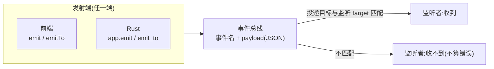

import { Canvas, Controls, Meta } from '@storybook/addon-docs/blocks';
import * as Events from './events.stories';

<Meta of={Events} name="Docs" />

# 事件

[命令](?path=/docs/commands--docs)一课讲的是「前端要答案」:`invoke` 出去,等一个返回值回来。本课是它的互补面——**事件是单向通知**:任何一端把「事件名 + payload」投上事件总线就算完成,不等待回应,所有匹配的监听者各自收到一份。前端可以发,Rust 可以发,一个窗口发给所有窗口。核心直觉:**发射方只负责投递,谁在听、处理成什么样,它一概不知道;需要「要答案」就回到命令。**

建立这个直觉后,你应该能预测:把 `emit` 换成 `emitTo('settings')`,main 窗口里的监听会全部收不到,只剩 settings 的监听和 Rust 的 `listen_any` 亮着;组件卸载时如果没退订,`listen` 注册的处理器会在下一次事件到达时照常执行。目标不匹配不是错误——只是没有监听者收到。



关键输入与默认行为:

| 项 | 默认 / 规则 | 回查要点 |
| --- | --- | --- |
| `listen` 返回值 | `Promise<UnlistenFn>` | 退订函数要等 Promise 兑现才拿到,React 清理要处理竞态 |
| 监听过滤 | `Options.target` 默认 `{ kind: 'Any' }` | 收所有投递;实例 `listen` 固定为本窗口 |
| 事件名 | 仅字母数字与 `- / : _` | 违规时前端调用 reject,Rust 侧 panic |
| payload | 全程 JSON 序列化 | Rust 侧要求 `Serialize + Clone`;前端 `event.payload` 已反序列化 |
| 权限 | `core:event:default` 默认已授 | `listen` / `unlisten` / `emit` / `emit-to` 无需额外配置 |
| Rust 退订 | `listen` 返回 `EventId` | `unlisten(id)` 按 id 退订 |

## 快速上手

前提:已有[第一个应用](?path=/docs/first-app--docs)生成的 react-ts 工程,命令的注册方式见命令课。最常见的事件用法是「命令启动任务,事件汇报过程」:前端 `invoke` 发起,Rust 在执行中把进度广播出来,前端订阅更新界面。三步跑通:

1. Rust 侧:命令发射进度事件:

```rust
use tauri::Emitter;

#[tauri::command]
fn scan(app: tauri::AppHandle) -> Result<u32, String> {
    let total = 5;
    for step in 1..=total {
        // 过程通知走事件:发了就走,没有返回值;实际项目中由耗时任务每完成一步发射一次
        app.emit("scan-progress", step).map_err(|e| e.to_string())?;
    }
    Ok(total)
}
```

2. 注册到路由表(沿用命令课的规则):

```rust
.invoke_handler(tauri::generate_handler![scan, /* 其余命令 */])
```

3. 前端组件:订阅进度,卸载时退订:

```tsx
// src/components/ScanPanel.tsx
import { useEffect, useState } from 'react';
import { invoke } from '@tauri-apps/api/core';
import { listen, type UnlistenFn } from '@tauri-apps/api/event';

export function ScanPanel() {
  const [progress, setProgress] = useState(0);

  useEffect(() => {
    // 标准订阅清理模式:disposed 标记处理「卸载先于订阅完成」的竞态,原理见 React 一节
    let disposed = false;
    let unlisten: UnlistenFn | undefined;

    listen<number>('scan-progress', (event) => {
      setProgress(event.payload); // 泛型只是 TS 标注,运行时是 JSON 反序列化结果
    }).then((fn) => {
      if (disposed) {
        fn(); // 组件已经卸载:立即退订,防止监听泄漏
      } else {
        unlisten = fn;
      }
    });

    return () => {
      disposed = true;
      unlisten?.();
    };
  }, []);

  return (
    <div>
      <button onClick={() => invoke('scan')}>开始扫描</button>
      <p>进度:{progress} / 5</p>
    </div>
  );
}
```

验证:`npm run tauri dev` 后点「开始扫描」,进度文本变为 5 / 5;把 `emit` 的值改成 `step * 10` 再触发,界面同步变化——Rust 到前端的单向链路已通。第 3 步的 `disposed` 标记不是仪式,它处理的是本课第一个真正的坑,展开见 React 一节。

## 事件与命令的分工

判断入口只有一句话:**要回应,用命令;只告知,用事件**。展开成表:

| 需求 | 用什么 | 原因 |
| --- | --- | --- |
| 前端要一个值(读配置、算结果) | 命令 | 要返回值,就是请求-响应 |
| 前端发起动作并关心成败 | 命令(返回 `Result`) | 成败就是「回应」 |
| Rust 主动告知(进度、完成、状态变化) | 事件 | 发起方在 Rust,单向通知 |
| 一条消息送达多个窗口(主题切换、登录态) | 事件 | 天然一对多,见[多窗口](?path=/docs/multi-window--docs)一课 |
| 高频流式数据(逐块下载、日志流) | Channel(命令课特殊参数表) | 事件每次投递都全量 JSON 序列化 |

两者不是二选一,最典型的分工是组合:**命令启动,事件汇报**。前端 `invoke('scan')` 拿最终结果(命令的返回值),过程中的每一步用事件广播——官方文档的下载示例就是这个结构:`download-started` / `download-progress` / `download-finished` 三个事件,配一个返回最终结果的命令。

事件的三条固有局限,判断「这活适不适合事件」时直接对照:

- **没有返回值。** 发射方不知道谁收到、处理结果如何;需要确认就让对端再发一条事件,或改用命令。
- **没有注册表。** 事件名是裸字符串,不像命令有 `generate_handler!` 集中注册;拼错的事件名静默丢失,两端都不会报错。
- **全量 JSON。** 每次投递都完整序列化,不适合二进制大块或逐帧高频数据。

## 订阅:listen 与 once

前端 API 来自 `@tauri-apps/api/event`:

```ts
import { listen, once } from '@tauri-apps/api/event';

// 持续订阅:返回退订函数的 Promise
const unlisten = await listen<number>('scan-progress', (event) => {
  console.log(event.event, event.payload, event.id);
});

// 收到第一条后自动退订,同样返回 Promise<UnlistenFn>
const unlistenOnce = await once('backend-ready', (event) => {
  // 适合只关心一次的通知,例如启动完成
});
```

处理器收到一个 `Event` 对象,三个字段:`event`(事件名)、`payload`(反序列化后的 JSON 值,类型 `T` 只靠自己标注)、`id`(事件实例标识)。`once` 是 `listen` 的自动退订版,React 中的清理模式与 `listen` 相同。

订阅放哪一级,决定要不要清理:

| 订阅位置 | 存活期 | 清理 |
| --- | --- | --- |
| 应用入口(`main.tsx` 模块顶层) | 该窗口 webview 的整个存活期 | 不需要,窗口关闭即消失 |
| React 组件内(`useEffect`) | 组件挂载期 | 必须退订,见 React 一节 |

同一套总线也承载 Tauri 内置的系统事件:名字带 `tauri://` 前缀,如 `tauri://resize`、`tauri://close-requested`、`tauri://drag-drop`,可以直接 `listen`。窗口属性类事件更推荐实例上的 `onResized` / `onCloseRequested` 等 helper——payload 已解码成对应类型(见[窗口](?path=/docs/window--docs)一课);完整清单见 JS API 参考页的 `TauriEvent` 枚举。

## 投递规则:target 决定谁收到

每个监听注册时声明一个 **target**(自己代表谁),每次投递携带一个**投递目标**——`emit` 是广播(不限目标),`emitTo` / `emit_to` 指定目标。路由规则只有一条:**投递目标与监听 target 匹配,监听者就收到一份。** 发射端在谁那里不影响这条规则——广播就是广播,定向就是定向。

监听 target 由注册方式决定:

| 注册方式 | 监听 target | 收到什么 |
| --- | --- | --- |
| `listen('ping')`(命名空间) | `{ kind: 'Any' }`(默认) | 所有投递 |
| `listen('ping', h, { target: 'main' })` | `{ kind: 'AnyLabel', label: 'main' }` | 广播 + 定向到 main |
| `getCurrentWebviewWindow().listen('ping')`(实例) | `{ kind: 'WebviewWindow', label: 'main' }` | 广播 + 定向到 main |
| Rust `app.listen('ping')` | `{ kind: 'App' }` | 仅广播(及 `emit_to(EventTarget::app())`) |
| Rust `app.listen_any('ping')` | `{ kind: 'Any' }` | 所有投递 |

发射端可用的投递目标:

| 发射 | 投递目标 |
| --- | --- |
| 前端 `emit` / Rust `app.emit` | 广播,所有 target |
| `emitTo('main', …)` / `app.emit_to("main", …)` | `AnyLabel{ main }`:label 为 main 的窗口 / webview,及同 label 的监听 |
| `emitTo({ kind: 'WebviewWindow', label: 'main' }, …)` | 只匹配 `WebviewWindow{ main }` 监听 |
| Rust `app.emit_filter(event, payload, 闭包)` | 按闭包筛选监听 target |

一次投递谁收到,由「投递目标 × 监听 target」共同决定。下面的 Canvas 模拟两个窗口(main、settings)加 Rust 侧的全部常见注册:用「发送方」选一次发射,观察总线按 target 过滤后的投递路径;「所关注监听」高亮其中一种注册,读数回答它收没收到。Canvas 是浏览器里的模拟,不运行 Tauri;要在本机用真实 Tauri 核对,按课程目录 `runtime-verification.md` 的最小步骤操作。

<Canvas of={Events.Interactive} />
<Controls of={Events.Interactive} />

| 读者操作 | 可观察证据 |
| --- | --- |
| 「发送方」选 frontend-emit(前端 emit 广播) | 六个监听全部点亮,读数「投递范围」显示「所有目标(广播)」 |
| 「发送方」选 frontend-emit-to(emitTo 定向 settings) | 只有 settings 的命名空间监听与 Rust listen_any 收到;main 的三个监听与 app.listen 均未收到 |
| 「发送方」选 rust-emit-to(app.emit_to 定向 main) | main 的三个监听收到,settings 未收到,app.listen 也未收到——定向投递不经过 App target |
| 「所关注监听」切换 | 对应行高亮,读数「所关注监听」显示收到 / 未收到 |
| 打开 Show code | 看到该 Canvas 实际执行的 `example.ts` |

官方文档特别提醒的一条:Rust 侧的「全局监听」(`app.listen`)收不到定向给某个窗口的事件,要监听一切用 `listen_any`——Canvas 里 `app.listen` 行与 `listen_any` 行的差异就是这个规则。本节聚焦事件语义本身;窗口的创建、管理与授权面见[多窗口](?path=/docs/multi-window--docs)一课。

Rust 侧两个 trait 分工:`Emitter` 管发射,`Listener` 管监听,`AppHandle`、`WebviewWindow` 等类型都实现它们,所以窗口实例也能 `window.emit(...)` 从自己广播:

```rust
use tauri::{Emitter, EventTarget, Listener};

// 发射:payload 需实现 Serialize + Clone
app.emit("theme-changed", payload)?;                  // 广播
app.emit_to("settings", "theme-changed", payload)?;   // 定向:字符串按 label 匹配
app.emit_filter("theme-changed", payload, |t| matches!(
    t,
    EventTarget::WebviewWindow { label } if label.starts_with("note-")
))?;                                                  // 按监听 target 筛选

// 监听:返回 EventId,用于退订
let id = app.listen("frontend-ping", |event| {
    let payload: &str = event.payload(); // 原始 JSON 字符串,需自行反序列化
});
app.once("init", |event| { /* 只触发一次 */ });
app.unlisten(id);
```

注意:Rust 监听者拿到的 payload 是 **JSON 字符串**,要用 `serde_json::from_str` 自己转——不像前端已经反序列化成值。`EventTarget` 的 kind 共六种(`Any` / `AnyLabel` / `App` / `Window` / `Webview` / `WebviewWindow`),`Window` 与 `Webview` 是更细的窗口形态,日常用 `WebviewWindow` 即可。

## React 中的订阅与清理

组件订阅的基本式已在快速上手给全:挂载订阅,卸载退订。真正的坑在时序——**`listen` 返回 Promise,而 React 的清理函数是同步执行的**。组件挂载后立刻卸载时(React 18 StrictMode 的开发模式就是这么做的:挂载 → 卸载 → 重新挂载),清理函数运行时 `unlisten` 还没兑现,直接 `unlisten?.()` 什么也没退订;等 Promise 兑现,监听已经泄漏。

```tsx
// 有竞态:快速卸载时 unlisten 还不存在,监听泄漏
useEffect(() => {
  listen<number>('scan-progress', (event) => {
    setProgress(event.payload);
  }).then((fn) => {
    unlisten = fn; // 清理可能已经执行过,存下来也没人用了
  });
  return () => {
    unlisten?.(); // 此时是 undefined,退订落空
  };
}, []);
```

修复只需要一个 `disposed` 标记(即快速上手的写法),两条路径都收口:

```tsx
useEffect(() => {
  let disposed = false;
  let unlisten: UnlistenFn | undefined;

  listen<number>('scan-progress', (event) => setProgress(event.payload))
    .then((fn) => {
      if (disposed) {
        fn(); // 兑现时组件已卸载:立即退订
      } else {
        unlisten = fn;
      }
    });

  return () => {
    disposed = true;
    unlisten?.();
  };
}, []);
```

两种写法在时序上的差异:

| 时序 | 忽略竞态的写法 | disposed 标记写法 |
| --- | --- | --- |
| 挂载,发起 `listen` | Promise 兑现中 | Promise 兑现中,`disposed = false` |
| 卸载(早于兑现),清理执行 | `unlisten` 是 undefined,退订落空 | `disposed = true`,`unlisten?.()` 跳过 |
| Promise 兑现 | `fn` 存进无人读取的变量,监听泄漏 | `disposed` 为 true,立即 `fn()` 退订 |
| 之后事件到达 | 处理器照常触发(泄漏) | 无事发生 |

泄漏的不只是内存:处理器还在对已卸载组件调用 `setProgress` 这类状态更新;StrictMode 或路由切换下反复挂载,同一条事件会触发 N 份处理器——「事件处理执行了两次」的报告多半来自这里。

依赖变化时重新订阅(依赖数组里放监听依赖的值,如某个 id)也是安全的:每次依赖变化先走一遍上面的清理,再订阅新的。竞态模式必须照写,否则快速切换时同样泄漏。

组件里直接写容易漏,收敛成一个 hook,竞态处理只写一次:

```ts
// src/hooks/useTauriEvent.ts
import { useEffect } from 'react';
import { listen, type EventName, type UnlistenFn } from '@tauri-apps/api/event';

export function useTauriEvent<T>(
  event: EventName,
  handler: (payload: T) => void,
) {
  useEffect(() => {
    let disposed = false;
    let unlisten: UnlistenFn | undefined;

    listen<T>(event, (e) => handler(e.payload)).then((fn) => {
      if (disposed) {
        fn();
      } else {
        unlisten = fn;
      }
    });

    return () => {
      disposed = true;
      unlisten?.();
    };
  }, [event, handler]); // handler 用 useCallback 稳定,否则每次渲染都会重订
}
```

一次性通知改用 `once`,清理模式与 `listen` 完全相同;应用级的一次性初始化监听(如等 `backend-ready`)放模块顶层即可,不用 hook。

## 最佳实践

- **先问「要不要回应」。** 要返回值或成败确认 → 命令;单向告知、一对多 → 事件;高频流式 → Channel。组合场景用「命令启动,事件汇报」,别用事件模拟请求-响应。
- **把事件名当契约管理。** 事件名没有注册表,拼错静默丢失:按域加前缀(如 `job:progress`),前端集中在一个模块导出名字与 payload 类型常量,发射端与监听端都引用它。
- **组件订阅一律走 `useTauriEvent` 这类封装。** 竞态处理只写一次;绕开封装直接写时,`disposed` 模式不可省略。
- **应用级订阅放模块顶层,组件级订阅必须清理。** 前者随窗口存活不用管;但每个窗口是独立 JS 上下文,多窗口下各窗口要各自注册需要的订阅。
- **Rust 监听选对变体。** 收一切用 `listen_any`;`app.listen` 只收广播。别把「收不到定向事件」误判为「事件没发出去」。

## 常见问题

- 组件卸载后处理器仍然触发,或同一事件触发两次
  先查订阅清理:直接 `listen` 而没有 `disposed` 模式时,快速挂载卸载(StrictMode、路由切换、条件渲染)会泄漏监听并叠加。改用 React 一节的标准模式或 `useTauriEvent` 封装。StrictMode 只在开发模式双挂载,但泄漏在两种模式下都存在。
- 前端注册了监听却收不到事件
  按链排查:监听注册方式是否过滤了目标(实例 `listen` / `{ target }` 只收广播与定向到该 label 的投递,见投递规则一节)→ 两端事件名是否逐字符一致(拼错静默丢失)→ 事件名是否含非法字符(仅字母数字与 `- / : _`)。
- Rust 侧 `app.listen` 收不到 `emit_to` 定向给窗口的事件
  不是 bug:`app.listen` 的 target 是 `App`,只收广播。监听一切用 `listen_any`,或用窗口实例自己的 `listen`;Canvas 里两行 Rust 监听的差异就是这个规则。
- Rust 监听里 `event.payload()` 拿到的是字符串,反序列化失败
  Rust 监听者拿到的是原始 JSON 字符串,不是反序列化后的值。用 `serde_json::from_str::<T>(event.payload())` 转成结构体,`T` 需实现 `Deserialize`。
- 前端收到的 payload 是「JSON 字符串」而不是对象
  Rust 侧把已经 `serde_json::to_string` 的字符串又当 payload 发了——`emit` 会把它再序列化一层。直接传结构体或 `serde_json::Value`,不要先 `to_string` 再 `emit`。
- 高频事件把界面或 IPC 拖卡了
  事件每次投递都全量 JSON 序列化,逐帧、逐块的推送不该走事件。改用 `tauri::ipc::Channel`(见命令课特殊参数表),或降低发射频率、在前端做聚合。

## 总结回顾

摘要:

事件与命令构成前后端通信的两半:命令是请求-响应,事件是单向通知——发射方把「事件名 + payload」投上总线就走,不等待回应。前端用 `listen` / `once` 订阅(返回退订函数的 Promise),`emit` 广播、`emitTo` 定向;Rust 侧对应 `Emitter` 的 `emit` / `emit_to` / `emit_filter` 与 `Listener` 的 `listen` / `listen_any` / `once`,payload 全程 JSON 序列化,Rust 监听者拿到的是需自行反序列化的 JSON 字符串。投递结果由「发射端的投递目标 × 监听端注册时的 target」决定:默认 `listen` 收一切,实例 `listen` 只收广播与定向到自己 label 的投递,`app.listen` 只收广播,`listen_any` 收一切。React 组件订阅必须清理,核心是 `disposed` 标记处理「卸载早于 Promise 兑现」的竞态——漏掉它,监听泄漏、处理器叠加、StrictMode 下事件触发两次。

一句话:

> 事件是单向通知:投递目标与监听 target 匹配谁就收到,发射方不等待回应——要回应,用命令。

知识要点:

- 事件与命令怎么选?什么场景下两者组合使用?
- `listen` / `once` 的返回值是什么?`Event` 对象有哪些字段?payload 的类型标注意味着什么?
- 五种常见监听注册方式各自的 target 与接收范围是什么?
- 为什么 `app.listen` 收不到定向给窗口的事件?用什么替代?
- Rust 监听者拿到的 payload 是什么形态?怎么反序列化?前端「payload 是 JSON 字符串」的坑出在哪一侧?
- React 中正确清理订阅的完整写法?竞态发生在哪个时序点?泄漏会造成什么现象?

## 参考资料

- [Calling the Frontend from Rust - Tauri 官方文档](https://tauri.app/develop/calling-frontend/)
  Emitter / Listener 用法、全局与定向投递语义、payload 需 `Serialize + Clone`、事件不适合大消息与高频(推荐 Channel)、`listen_any` 监听一切的官方来源。
- [event - Tauri JavaScript API](https://tauri.app/reference/javascript/api/namespaceevent/)
  `listen` / `once` / `emit` / `emitTo` 签名、`Options.target` 默认 `{ kind: 'Any' }`、事件名字符规则、`Event` 与 `UnlistenFn` 类型、内置 `tauri://` 事件清单(`TauriEvent`)、`core:event:default` 权限默认已授。
- [Emitter - docs.rs](https://docs.rs/tauri/latest/tauri/trait.Emitter.html)
  `emit` / `emit_to` / `emit_filter` 的签名、payload `Serialize + Clone` 约束、字符串 target 等价 `AnyLabel` 的匹配规则。
- [Listener - docs.rs](https://docs.rs/tauri/latest/tauri/trait.Listener.html)
  `listen` / `listen_any` / `once` / `unlisten(EventId)` 的语义、事件名违规 panic、`Event::payload()` 返回 JSON 字符串。
