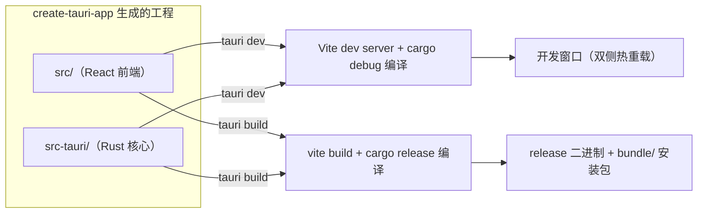

import { Canvas, Controls, Meta } from '@storybook/addon-docs/blocks';
import * as FirstApp from './first-app.stories';

<Meta of={FirstApp} name="Docs" />

# 第一个应用

本课用官方脚手架 create-tauri-app 生成一个 React + TypeScript 的 Tauri 2 工程，并跑通 `tauri dev` 与 `tauri build`。要建立的核心直觉：脚手架生成的不是一堆模板文件，而是一份**双目录工程**——`src/` 放前端，`src-tauri/` 放 Rust 核心；`tauri dev` 和 `tauri build` 只是驱动这同一份工程的两条流水线，一条面向日常开发，一条面向发布产物。



开场参考表：

| 命令 | 作用 | 直接结果 |
| --- | --- | --- |
| `npm create tauri-app@latest` | 按模板生成工程 | `src/` + `src-tauri/` 双目录工程 |
| `npm run tauri dev` | 开发模式运行 | 打开调试窗口，双侧热重载 |
| `npm run tauri build` | 发布构建 | release 二进制 + `bundle/` 安装包 |

## 快速上手

前提：Rust 工具链与系统依赖已按[安装](?path=/docs/installation--docs)一课就绪；本课产物路径以 macOS 为例。

```bash
# 1. 生成工程：按提示选择 项目名 tauri-app / 语言 TypeScript / 包管理器 npm / 模板 React
npm create tauri-app@latest

# 2. 安装依赖：脚手架只生成工程，不会自动安装
cd tauri-app
npm install

# 3. 开发模式：第一次会先编译全部 Rust 依赖，耗时数分钟，之后走缓存
npm run tauri dev
```

窗口出现即跑通。改一行 `src/App.tsx` 保存，窗口内容立即更新——这就是前端热重载。

```bash
# 4. 发布构建：产出可执行文件与安装包
npm run tauri build
```

可执行文件在 `src-tauri/target/release/`，安装包在 `src-tauri/target/release/bundle/`。

## 生成工程

create-tauri-app 的工作方式：按你选的**前端模板**生成 `src/` 与前端壳文件，再叠加一份所有模板共用的 `src-tauri/` 骨架。所以前端部分随模板变化，Rust 侧结构固定。生成的工程在 `package.json` 里带一个 `"tauri": "tauri"` 脚本，后续 `npm run tauri ...` 调用的就是模板 `devDependencies` 里的本地 `@tauri-apps/cli`。

<Canvas of={FirstApp.Interactive} />
<Controls of={FirstApp.Interactive} />

| 读者操作 | 可观察证据 |
| --- | --- |
| 调整「脚手架模板」 | 左侧 `src/` 内文件被替换，`src-tauri/` 骨架不变 |
| 切换「tauri 命令」 | 右侧流水线与读数中的产物位置在 dev / build 之间切换 |
| 打开 Show code | 看到该 Canvas 实际执行的 `example.ts` |

生成物速览：

| 位置 | 内容 | 随模板变化？ |
| --- | --- | --- |
| `index.html`、`package.json`、`vite.config.ts` | 前端壳、脚本与 Vite 配置 | 部分 |
| `src/` | 前端框架代码（react-ts 模板为 `main.tsx`、`App.tsx`） | 是 |
| `src-tauri/` | `Cargo.toml`、`tauri.conf.json`、`capabilities/`、`icons/`、`build.rs`、`src/main.rs`、`src/lib.rs` | 否 |

每个目录的职责划分、两个配置文件如何协作，见[工程结构](?path=/docs/project-structure--docs)一课。

### 交互式脚手架

直接运行不带参数，脚手架按顺序问四个问题：

```bash
npm create tauri-app@latest
```

| 提问 | 本课选择 | 影响 |
| --- | --- | --- |
| Project name | `tauri-app` | 工程目录名，也是默认 productName |
| 前端语言 | TypeScript | 决定用 `-ts` 模板还是 JS 模板 |
| Package manager | npm | 生成对应 lockfile 与安装命令 |
| 前端框架 | React | `src/` 内的框架代码与前端依赖 |

### 非交互一条命令

把项目名和模板直接写进命令，跳过提问：

```bash
npm create tauri-app@latest tauri-app -- --template react-ts
```

- npm 7+ 必须用 `--` 把后面的参数传给脚手架；pnpm / yarn / cargo 不需要。
- 常用模板值：`react-ts`、`vue-ts`、`svelte-ts`、`vanilla-ts` 等；完整列表见 create-tauri-app 仓库。
- 项目名写 `.` 表示在当前目录直接生成。

## 开发：tauri dev

`tauri dev` 是开发循环的驱动器，每次执行串起五步：

1. 执行 `build.beforeDevCommand`（模板默认 `npm run dev`），启动 Vite dev server；
2. 等待 `build.devUrl`（模板默认 `http://localhost:1420`）就绪；
3. cargo 以 debug 方案编译 Rust；
4. 打开应用窗口，加载 devUrl；
5. 持续监听：前端改动走 Vite HMR，秒级生效；`src-tauri/` 内改动触发 cargo 重编译并自动重启窗口。

第一次 `tauri dev` 明显偏慢：Cargo 要下载并编译全部 Rust 依赖，结果会被缓存，之后只重编你自己的代码。这条边界决定了两套热重载的体验差异——改前端几乎即时，改 Rust 至少等一次编译加重启。

常用 flag：

| flag | 用途 |
| --- | --- |
| `--no-watch` | 关闭 `src-tauri/` 文件监听 |
| `--release` | dev 也按 release 方案编译（少用） |
| `-c, --config <file>` | 叠加一份临时配置验证改动 |

## 构建：tauri build

`tauri build` 面向发布，串起三步：

1. 执行 `build.beforeBuildCommand`（模板默认 `npm run build`），前端产物写入 `build.frontendDist`（模板默认 `../dist`）；
2. cargo 以 release 方案编译，可执行文件落在 `src-tauri/target/release/`；
3. 按 bundler 配置打包，安装包落在 `src-tauri/target/release/bundle/` 下按格式分目录。

macOS 上会得到 `bundle/macos/` 下的 `.app` 与 `bundle/dmg/` 下的 `.dmg`；Windows、Linux 对应 `nsis/`、`msi/`、`deb/`、`rpm/`、`appimage/`。bundler 的完整配置与签名见[打包](?path=/docs/bundling--docs)一课。

常用 flag：

| flag | 用途 |
| --- | --- |
| `--debug` | 按 debug 方案构建并打包，用于复现「打包后才出现」的问题 |
| `--no-bundle` | 只做编译，跳过打包 |
| `-b, --bundles <格式>` | 只打指定格式，如 `dmg` |
| `-t, --target <triple>` | 指定目标三元组，如 `universal-apple-darwin` |

## 最佳实践

- **CLI 版本跟工程走。** 统一用 `npm run tauri ...`（模板 devDependencies 里的 `@tauri-apps/cli`），团队与 CI 用同一版本；只有 cargo 系模板才适合全局 `cargo tauri`。
- **按目的选构建方式。** 日常迭代用 `tauri dev`；复现打包后的问题用 `tauri build --debug`；只验证 release 编译用 `tauri build --no-bundle`；完整 `tauri build` 留给真正要产物的时候，release 编译最慢。
- **版本库提交 `Cargo.lock`，忽略 `target/`。** `src-tauri/Cargo.lock` 保证依赖版本可复现；`src-tauri/target/` 全部是构建产物，加入忽略不要提交。
- **发布前改掉默认 identifier。** 模板生成的 `com.tauri.dev` 是占位值，进入打包分发前在 `tauri.conf.json` 的 `identifier` 字段改成自己的反向域名。

## 常见问题

- 第一次 `tauri dev` 长时间停在 `Compiling ...`
  正常现象：首次要下载并编译全部 Rust 依赖，可能需要数分钟；只要没有 `error` 输出，继续等待即可。编译结果有缓存，第二次起只重编自己的代码，明显变快。
- `npm run tauri dev` 报 `Missing script: "tauri"` 或找不到工程
  先确认当前目录是工程根目录（存在 `package.json` 与 `src-tauri/`），并且已经执行过 `npm install`——脚手架只生成工程，不装依赖。
- 窗口打开是白屏，或启动时报端口被占用
  模板 devUrl 固定 `1420` 端口且 Vite 开了 `strictPort`，端口被占用时 dev server 直接失败。释放 1420 端口，或同时改 `vite.config.ts` 的 `server.port` 与 `tauri.conf.json` 的 `build.devUrl` 两处。
- 改前端瞬间生效，改 Rust 却要等很久
  这是两条热重载通道的正常边界：前端走 Vite HMR 不重启进程；`src-tauri/` 内任何文件变化都要重编译并重启窗口。觉得自动重启干扰调试时，用 `--no-watch` 关闭监听，手动控制重编译。

## 总结回顾

摘要：

create-tauri-app 按「前端模板 + 固定 src-tauri 骨架」生成双目录工程，四个交互提问（项目名、语言、包管理器、框架）都能换成一条非交互命令。`tauri dev` 串起 beforeDevCommand、devUrl 等待、debug 编译与窗口加载，前端与 Rust 各有热重载通道；`tauri build` 串起 beforeBuildCommand、release 编译与 bundle 打包，产物集中在 `src-tauri/target/release/`。CLI 版本、构建方式、版本库内容与 identifier 的取舍决定这套流程能否顺畅协作。

一句话：

> create-tauri-app 生成的是「前端 + Rust 核心」的双目录工程，`tauri dev` 与 `tauri build` 只是驱动它的两条流水线。

知识要点：

- create-tauri-app 交互式要回答哪四个问题？非交互时如何用一条命令指定模板？
- 生成的工程里哪些部分随前端模板变化，哪些固定不变？
- `tauri dev` 串起哪些步骤？前端与 Rust 的热重载边界在哪？
- `tauri build` 的可执行文件与安装包分别落在哪个目录？
- `--debug`、`--no-bundle`、`-b` 分别适合什么时机？

## 参考资料

- [Creating a Project - Tauri 官方文档](https://tauri.app/start/create-project/)
  create-tauri-app 各包管理器命令、交互提问与 `tauri dev` 启动步骤。
- [Tauri CLI Reference - Tauri 官方文档](https://tauri.app/reference/cli/)
  `tauri dev`、`tauri build` 的行为与 flag 定义。
- [Development - Tauri 官方文档](https://tauri.app/develop/)
  热重载行为、首次编译缓存、`Cargo.lock` 与 `target/` 的版本库约定。
- [create-tauri-app - GitHub](https://github.com/tauri-apps/create-tauri-app)
  模板列表、npm `--` 传参与非交互用法说明。
