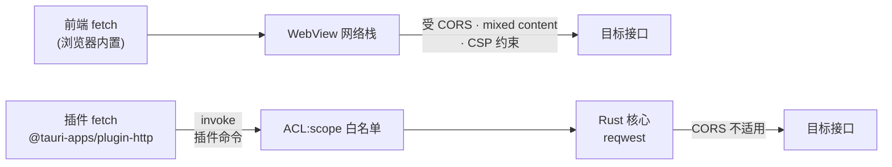

import { Canvas, Controls, Meta } from '@storybook/addon-docs/blocks';
import * as Http from './http.stories';

<Meta of={Http} name="Docs" />

# 网络请求

桌面应用几乎都要访问网络:拉取配置、调用自家 API、请求第三方服务。WebView 里的页面挂在一个自定义 origin 上(生产环境为 `tauri://localhost`,Windows/Android 默认是 `http://tauri.localhost`),对方服务器多半不认识它——响应不带 `Access-Control-Allow-Origin` 头时,浏览器 fetch 会直接把响应拦在门外。`http` 插件(`@tauri-apps/plugin-http` + `tauri-plugin-http`)给出第二条通道:导出一个**同名同签名**的 `fetch`,前端只负责组装请求,真正发请求的是 Rust 核心里的 reqwest,WebView 的 CORS 对它不适用;作为交换,URL 必须先写进 scope 白名单。

本课讲清两条通道的选型判断、插件 fetch 在前端与 Rust 两侧的用法、scope 的写法与匹配规则,以及默认关闭的扩展与危险选项。插件的安装流程与四件套见[插件体系](?path=/docs/plugin-system--docs),capabilities 文件格式与拒绝排查见[权限与能力](?path=/docs/capabilities--docs),本课直接使用。调节实例的「请求通道」与「目标接口」,你可以预测:浏览器通道在无 CORS 头的接口上失败,插件通道在白名单外的域名上被拒。

两条通道各有一道关卡:



本课用到的默认值与回查要点:

| 项 | 默认值 | 回查要点 |
| --- | --- | --- |
| `http:default` 权限集 | 放行全部 fetch 命令,不含任何 URL | 不配 scope 必被拒 |
| scope 匹配 | URLPattern 规则 | scheme、端口参与匹配;deny 优先 |
| `scopeRedirects`(`plugins > http`) | `false` | 重定向默认只查首次 URL |
| `useHttpsScheme`(窗口配置) | `false` | v1 的 `dangerousUseHttpScheme` 已移除 |
| forbidden headers | 忽略 | 需开启 `unsafe-headers` feature |
| Rust 侧入口 | `tauri_plugin_http::reqwest` | 再导出,无需单独添加依赖 |

## 快速上手

前提:沿用[第一个应用](?path=/docs/first-app--docs)生成的工程。以调用自己的 API 为例,最小闭环是「装插件 → 加 scope → fetch 调用 → 拿到响应」:

1. 一条命令安装(它替你写好核心包、前端包、注册与 default 权限,流程见[插件体系](?path=/docs/plugin-system--docs)):

```bash
npm run tauri add http
```

2. 把目标域名写进 scope。这是 http 插件与多数官方插件最大的不同:`http:default` 只放行命令,**不含任何 URL**,域名必须自己加:

```json
// src-tauri/capabilities/default.json —— tauri add 已写入字符串形式的 "http:default",改成对象形式
{
  "$schema": "../gen/schemas/desktop-schema.json",
  "identifier": "default",
  "windows": ["main"],
  "permissions": [
    "core:default",
    {
      "identifier": "http:default",
      "allow": [{ "url": "https://api.example.com" }]
    }
  ]
}
```

3. 前端调用。与浏览器 fetch 同名同签名,换的只是 import 来源:

```tsx
// src/App.tsx
import { fetch } from '@tauri-apps/plugin-http';

export default function App() {
  return (
    <button
      onClick={async () => {
        const response = await fetch('https://api.example.com/data.json');
        const data = await response.json();
        console.log(response.status, data); // 200 …
      }}
    >
      加载数据
    </button>
  );
}
```

4. `npm run tauri dev` 后点按钮:请求由 Rust 侧发出,即使 api.example.com 不返回任何 CORS 头,响应也完整回到前端。漏配 scope 时,调用以 `url not allowed` reject——先检查 capabilities,再怀疑代码。

## 两条请求通道

WebView 里同一个 `fetch`,背后可以是两套网络栈。选型一句话:**响应允许跨域(带 `Access-Control-Allow-Origin`)就用浏览器 fetch;不允许就换插件 fetch,并把这个域名写进 scope。** 两条通道的差别不在写法,在关卡:浏览器 fetch 的关卡是服务器配的 CORS,插件 fetch 的关卡是你配的 scope。

### 浏览器 fetch

WebView 内置的 fetch,行为与网页中完全一致:受 CORS 约束;受 mixed content 约束;受 CSP 的 `connect-src` 约束(见[安全加固](?path=/docs/security--docs))。调用公开 API、同源资源时零配置,依旧首选。

mixed content 由页面自己的 origin 决定。Windows/Android 上生产环境页面 origin 默认是 `http://tauri.localhost`;窗口级配置 `useHttpsScheme: true`(写在 `tauri.conf.json` 的 `app.windows[]`)把它换成 `https://tauri.localhost`——https origin 请求 http 接口会被当 mixed content 拦截。两点边界:此项只影响浏览器通道,插件 fetch 不经过 WebView 网络栈、不受它影响;Tauri 1.x 对应的选项叫 `dangerousUseHttpScheme`,2.x 已移除,由语义反转的 `useHttpsScheme` 取代(见[从 Tauri 1.0 迁移](https://tauri.app/start/migrate/from-tauri-1/))。

### 插件 fetch

机制:插件导出的 `fetch` 先在 WebView 里把参数组装成标准 `Request`,再 `invoke('plugin:http|fetch')` 把请求描述经 IPC 交给应用的 Rust 核心,由 reqwest 真正发出,响应体再经 IPC 分块回传。官方对这条通道的说明是:**请求由 Rust 后端而非 WebView 执行,因此不受 CORS 约束,但 URL 必须被插件 scope 允许**。CORS 检查根本不会发生——跨域限制是浏览器为页面设的规则,而这次请求的发起方是 Rust 进程;取而代之的关卡是 scope,写法见下一节。

<Canvas of={Http.Interactive} />
<Controls of={Http.Interactive} />

实例把同一批请求放进两条通道重放:左列是前端调用、通道机制与目标接口(含其 CORS 头与 scope 命中情况),右侧步骤卡重放该通道的判断链,读数给出各项检查结论与 Promise 结算。对照三组结果:

| 读者操作 | 可观察证据 |
| --- | --- |
| 切换「请求通道」「目标接口」 | 步骤卡按通道重放判断链;「CORS 检查」「scope 检查」「结算结果」读数同步变化 |
| 「internal.example.com」+ 浏览器通道 | 无 CORS 头 → CORS 检查失败,rejected: TypeError: Failed to fetch |
| 同一接口换插件通道 | CORS 检查显示「不适用」,Rust 侧发出请求,resolve(200) |
| 「api.other.com」+ 插件通道 | scope 检查拒绝,rejected: url not allowed(白名单里没有它) |
| 打开 Show code | 看到该 Canvas 实际执行的 example.ts |

三条结论:公开接口两条通道都能到;没有 CORS 头的自家接口只有插件通道能到;而插件通道也只到 scope 放行的地方——白名单既是关卡,也是你自己维护的清单。差异回查表:

| 维度 | 浏览器 fetch | 插件 fetch |
| --- | --- | --- |
| 请求发起方 | WebView 网络栈 | Rust 核心(reqwest) |
| CORS | 受约束,服务器决定 | 不适用 |
| URL 白名单 | 无 | scope 必须命中 |
| mixed content · CSP `connect-src` | 受约束 | 不适用 |
| init 选项 | 标准 | 标准 + `connectTimeout` 等扩展 |
| Response 行为 | 标准 | 尽可能贴近 Web API,status / json() / 流式读取照常 |

### 扩展选项

插件 fetch 的 init 在标准 fetch 选项之上,扩展了 Rust 客户端的配置:

```ts
import { fetch } from '@tauri-apps/plugin-http';

const response = await fetch('https://api.example.com/data', {
  connectTimeout: 5000, // 连接超时(毫秒)
  maxRedirections: 3, // 重定向上限,0 = 不跟随
  proxy: { all: 'http://127.0.0.1:7890' }, // 全部流量走代理
  signal: controller.signal, // 标准 AbortSignal,照常可用
});
```

| 选项 | 作用 | 边界 |
| --- | --- | --- |
| `connectTimeout` | 连接超时(毫秒) | 建议网络调用都配置 |
| `maxRedirections` | 最大重定向次数 | `0` 表示不跟随 |
| `proxy` | `all` / `http` / `https` 代理,支持 `basicAuth`、`noProxy` | 作用于 Rust 客户端 |
| `danger` | `acceptInvalidCerts` / `acceptInvalidHostnames`,跳过证书与主机名校验 | 默认关闭,见最佳实践 |
| `signal` | 中止请求(标准选项) | AbortSignal 照常可用 |

另有一处默认差异:浏览器禁用的 forbidden headers(如 `User-Agent`、`Origin`)默认被插件忽略,需要原样发送时开启 Cargo feature:

```toml
# src-tauri/Cargo.toml
tauri-plugin-http = { version = "2", features = ["unsafe-headers"] }
```

## 域名权限:scope

`http:default` 权限集包含 fetch 的全部命令(`fetch`、`fetch_send`、`fetch_read_body`、`fetch_cancel` 等),但「不显式允许任何 URL」——scope 就是这条权限上的 URL 白名单。白名单写在 capabilities 的权限对象里:

```json
// src-tauri/capabilities/default.json
{
  "identifier": "http:default",
  "allow": [{ "url": "https://*.example.com" }],
  "deny": [{ "url": "https://internal.example.com" }]
}
```

匹配按 URLPattern 规则逐段进行:

- **scheme、host、port 精确匹配:** `https://localhost:8080` 放行不了 `http://localhost:8080`,换个端口也不行。
- **不写路径 = 该 host 下任意路径;** 写了路径则精确到该路径(查询串任意),`https://api.example.com/v1/*` 匹配 v1 下的全部路径。
- **host 支持通配:** `https://*.example.com` 覆盖任意子域。
- **deny 优先于 allow:** 同时命中的 URL 按拒绝处理。

白名单按需写:精确到实际使用的域名与路径前缀,不要写 `https://*`——scope 是插件通道唯一的关卡,写宽了等于没有。

重定向默认只查首次请求的 URL:白名单内的服务器可以把请求重定向到白名单外,响应照样回传(典型如开放重定向把流量带向内网地址)。在 `tauri.conf.json` 里显式打开逐跳检查:

```json
// tauri.conf.json
{
  "plugins": {
    "http": { "scopeRedirects": true }
  }
}
```

开启后任何一跳落到 scope 外,请求直接以 `url not allowed` 失败;依赖域外重定向的流程会被打断,所以它是默认关闭的开关。

## Rust 侧请求

不经前端发起的请求(启动期拉配置、后台轮询、定时同步)自然落在 Rust 侧。插件 re-export 了 reqwest,直接使用即可:

```rust
// src-tauri/src/lib.rs 的命令或 setup 中
use tauri_plugin_http::reqwest;

#[tauri::command]
async fn fetch_config() -> Result<String, String> {
    let response = reqwest::get("https://api.example.com/config.json")
        .await
        .map_err(|e| e.to_string())?;
    response.text().await.map_err(|e| e.to_string())
}
```

需要连接复用、自定义请求头、超时等配置时,构建 Client:

```rust
use std::time::Duration;
use tauri_plugin_http::reqwest;

let client = reqwest::Client::builder()
    .connect_timeout(Duration::from_secs(5))
    .build()
    .map_err(|e| e.to_string())?;

let response = client
    .get("https://api.example.com/data.json")
    .header("Authorization", "Bearer <token>")
    .send()
    .await
    .map_err(|e| e.to_string())?;
```

两条通道的分工:**scope 约束的是 WebView 经 IPC 发起的插件命令;Rust 代码直接调用 reqwest 不经过 ACL**,不需要、也不能用 scope 管控——它的信任边界是应用自身代码。前端触发的简单请求用插件 fetch 更顺手;Rust 侧留给不经前端的生命周期。

## 最佳实践

- **通道选型按「服务器给不给 CORS 头」切。** 公开 API 用浏览器 fetch,零配置;自家或无 CORS 头的接口用插件 fetch,并把域名写进 scope。把「绕 CORS」当默认手段,会让每个域名都多一处配置,还要持续维护 scope。
- **scope 白名单最小化。** 域名与路径精确到实际使用的范围,过宽的通配(`https://*`、无必要的 `*.`)让关卡形同虚设;安全敏感的应用打开 `scopeRedirects`,补上重定向这一跳。
- **危险开关逐个过审。** `danger`(跳过证书校验)只留给内网自签名服务,尽量不进发布构建;`unsafe-headers` 仅在服务端确实需要 forbidden headers 时开启。每打开一个,失去的都是一道默认防线。
- **超时与错误分类前置。** 网络调用都配 `connectTimeout`(Rust 侧对应 `connect_timeout`);错误分两类处理——`url not allowed` 是 scope 配置问题,`TypeError: Failed to fetch` 等是网络或通道问题,处理路径完全不同。

## 常见问题

- 插件 fetch reject,报 `url not allowed on the configured scope`
  请求的 URL 没被 scope 放行:检查 capabilities 里 `http:default` 的 `allow` 是否覆盖该 URL——scheme、端口必须一致,通配符要能匹配到 host;改完重启 `tauri dev`。
- 浏览器 fetch 报 `TypeError: Failed to fetch`,插件 fetch 却能成功
  服务器没有返回允许该 origin 的 CORS 头,WebView 把响应拦下了,这是浏览器通道的正常行为而非 bug。要免 CORS 就换插件 fetch(域名加进 scope),或让服务端配置 `Access-Control-Allow-Origin`。
- 设置的自定义请求头(如 `User-Agent`)没有出现在请求里
  forbidden headers 默认被插件忽略。开启 `unsafe-headers` Cargo feature 后按原样发送;能改服务端就不开这个开关。
- 请求跟着重定向到了 scope 外的地址,竟然也成功了
  默认只对首次 URL 查 scope。在 `tauri.conf.json` 的 `plugins > http` 里设 `"scopeRedirects": true`,让每一跳都过白名单。
- 自签名证书的 https 接口请求失败(证书校验错误)
  Rust 客户端默认校验证书。临时方案是 init 里 `danger: { acceptInvalidCerts: true }`(Rust 侧对应 reqwest Client 的 `danger_accept_invalid_certs`);仅限内网调试,发布构建不要携带。

## 总结回顾

摘要:WebView 页面挂在自定义 origin 上,发请求有两条通道:浏览器 fetch 走 WebView 网络栈,受 CORS、mixed content 与 CSP 约束,适合公开接口;http 插件的 fetch 同名同签名,但请求经 IPC 交给 Rust 核心的 reqwest 执行,CORS 不适用,关卡换成 capabilities 里 `http:default` 的 scope 白名单。scope 按 URLPattern 规则匹配(scheme、host、port 精确,路径与 host 可通配,deny 优先),默认只查首次 URL,`scopeRedirects` 打开逐跳检查。前端 init 可扩展 `connectTimeout`、`maxRedirections`、`proxy` 与 `danger`;forbidden headers 需要 `unsafe-headers` feature。Rust 侧直接用插件 re-export 的 reqwest,不经 ACL。Windows/Android 的页面 origin 默认 `http://tauri.localhost`,窗口配置 `useHttpsScheme` 可换 https(v1 的 `dangerousUseHttpScheme` 已移除),它影响浏览器通道的 mixed content 判定,不影响插件通道。

一句话:

> 浏览器 fetch 的关卡在服务器,插件 fetch 的关卡在 scope——选通道,就是选你愿意维护哪道关卡。

知识要点:

- 同一个 `fetch`,两条通道的请求发起方与约束有什么不同?
- 插件 fetch 为什么不受 CORS 限制?它的关卡是什么?
- `http:default` 包含什么、不包含什么?scope 的 allow/deny 怎么写、URL 怎么匹配?
- 重定向默认为什么不查 scope?怎么打开逐跳检查?
- 插件 fetch 的 init 有哪些标准 fetch 没有的选项?
- Rust 侧怎么发请求?它受 scope 约束吗?
- `useHttpsScheme` 改变什么?与 v1 的 `dangerousUseHttpScheme` 是什么关系?

## 参考资料

- [HTTP Client 插件 - Tauri 官方文档](https://tauri.app/plugin/http-client/)
  安装命令、前端 fetch 与 Rust 侧 reqwest 示例、`http:default` 权限集内容、scope 的 allow/deny 写法、`unsafe-headers` feature、「尽可能贴近 fetch Web API」的定位。
- [Command Scopes - Tauri 官方文档](https://tauri.app/security/scope/)
  scope 过滤 URL 的职责与「deny 优先于 allow」的通用规则;URL 匹配细节以插件 scope 实现(URLPattern)为准。
- [从 Tauri 1.0 迁移 - Tauri 官方文档](https://tauri.app/start/migrate/from-tauri-1/)
  Windows 生产环境 origin 由 `https://tauri.localhost` 变为 `http://tauri.localhost`,v1 `dangerousUseHttpScheme` 与 v2 `useHttpsScheme` 的对应关系。
- [配置参考 - Tauri 官方文档](https://tauri.app/reference/config/)
  `useHttpsScheme`(窗口配置)的默认值、mixed content 行为与存储位置警告。
