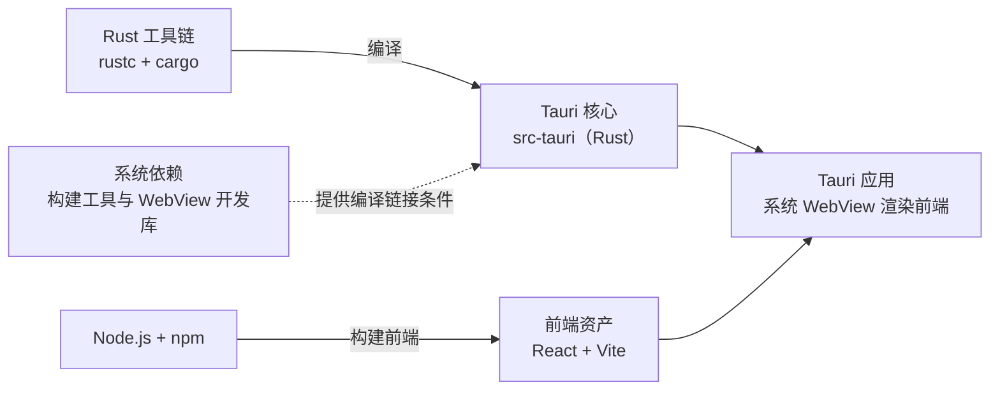

import { Meta } from '@storybook/addon-docs/blocks';

<Meta id="installation" title="上手/安装" name="Docs" />

# 安装

Tauri 应用由两部分拼成：Rust 写的核心（`src-tauri`）和运行在系统 WebView 里的前端页面。开发环境因此对应三类安装：编译 Rust 核心需要的 **Rust 工具链**，各平台构建工具与 WebView 开发库的**系统依赖**，以及构建前端（React + Vite）用的 **Node.js**；再配一个官方 VSCode 扩展提升配置体验。macOS 上最省事，Linux 的系统包最多，Windows 需要额外注意 MSVC 构建工具——本文按平台给全命令，最后一节用一组 `--version` 命令统一验证。



| 组件 | 作用 | 验证命令 |
| --- | --- | --- |
| rustup | Rust 工具链安装器与版本管理器 | `rustup --version` |
| rustc / cargo | Rust 编译器 / 构建与包管理工具 | `rustc --version`、`cargo --version` |
| 系统依赖 | 平台构建工具与 WebView 开发库 | 随平台，见「系统依赖」 |
| Node.js / npm | 前端构建工具链（React 示例需要） | `node -v`、`npm -v` |
| tauri-vscode 扩展 | `tauri.conf.json` 校验与常用命令 | VSCode 扩展面板 |

Tauri CLI 本身不在这份清单里：它随项目安装，属于《第一个应用》的内容；本课只装系统级环境。

## 快速上手

macOS（Apple Silicon）日常开发环境的最小闭环：

```bash
# 1. 安装 Command Line Tools（已装完整 Xcode 可跳过）
xcode-select --install

# 2. 安装 Rust 工具链，一条命令同时装好 rustc 与 cargo
curl --proto '=https' --tlsv1.2 https://sh.rustup.rs -sSf | sh

# 3. 让当前终端生效；或直接新开一个终端窗口
source "$HOME/.cargo/env"

# 4. 验证
rustc --version
cargo --version
```

预期输出以 `rustc 1.90.0` 或更高版本号开头。用 `rustup show` 可以确认默认工具链与主机三元组（如 `aarch64-apple-darwin`）。Windows 与 Linux 各有额外系统依赖，分别见「Windows 的 MSVC 工具链」「系统依赖」；全部装完后用「验证安装」的清单统一核对。

## Rust 工具链

Tauri 的核心是 Rust 工程，`tauri dev` 与 `tauri build` 都要靠 cargo 编译 `src-tauri`。Rust 官方的安装入口是 rustup：它同时装好 rustc（编译器）、cargo（构建与包管理）和标准库，并负责之后的版本切换与更新。不建议用系统包管理器装 Rust——发行版仓库里的 rustc 通常落后于 Tauri 要求的最低版本。

### 安装 rustup

macOS 与 Linux 用同一条命令：

```bash
curl --proto '=https' --tlsv1.2 https://sh.rustup.rs -sSf | sh
```

Windows 可用 winget，或到 Rust 官网下载图形安装器：

```powershell
winget install --id Rustlang.Rustup
```

rustup 把工具链放在 `$HOME/.cargo/bin`（Windows 为 `%USERPROFILE%\.cargo\bin`），安装时只写入当前终端的 PATH——新开终端，或执行 `source "$HOME/.cargo/env"` 后，`cargo` 才可用。

### Windows 的 MSVC 工具链

Windows 上 Tauri 默认用 MSVC 工具链编译链接，需要先装 [Microsoft C++ Build Tools](https://visualstudio.microsoft.com/visual-cpp-build-tools/)，安装时勾选 **Desktop development with C++**；再用 rustup 确认默认工具链：

```powershell
rustup default stable-msvc
```

Build Tools 提供的 MSVC 链接器是首次 `cargo build` 的硬前提，缺了它会直接链接失败。

### 版本要求与更新

Tauri 2.x 的最低 Rust 版本（MSRV）随小版本提升，当前稳定版 2.12 要求 rustc 1.90 或更高。rustup 默认跟踪 stable 频道，一条命令即可跟进：

```bash
rustup update
```

`cargo build` 报 `package requires rustc 1.90` 这类错误时，执行这条命令再重试即可，不需要重装 Rust。

## 系统依赖

前端页面由**系统自带 WebView** 渲染——macOS 用 WKWebView，Windows 用 WebView2（Edge），Linux 用 WebKitGTK。WebView 本体大多随系统存在，但编译 Tauri 核心还需要各平台的构建工具与 WebView 开发库，这部分差异最大，按平台处理。

### macOS

要求 macOS Catalina（10.15）及以上。桌面开发只需 Xcode Command Line Tools：

```bash
xcode-select --install
```

WKWebView 随系统提供，无需额外安装。完整版 Xcode 只在开发 iOS 应用时才需要（且安装后要启动一次完成组件设置），可以等到移动端阶段再装。

### Windows

需要两样：

1. **Microsoft C++ Build Tools**：安装时勾选 Desktop development with C++，为 cargo 提供 MSVC 链接器。
2. **WebView2 Runtime**：Windows 10（1803 起）及更高版本已预装，可跳过；更老的系统从微软官网下载 Evergreen Bootstrapper 安装。

另外构建 `.msi` 安装包依赖 VBSCRIPT 可选功能，多数系统默认启用；遇到报错时的处理见「常见问题」。

### Linux

核心依赖是 WebKitGTK 4.1（Tauri 2 使用 4.1 接口，老教程里的 4.0 包不适用）加上基础编译工具。包名随发行版不同，常用发行版的完整命令如下。

Debian / Ubuntu：

```bash
sudo apt update
sudo apt install libwebkit2gtk-4.1-dev \
  build-essential \
  curl \
  wget \
  file \
  libxdo-dev \
  libssl-dev \
  libayatana-appindicator3-dev \
  librsvg2-dev
```

Arch：

```bash
sudo pacman -Syu
sudo pacman -S --needed \
  webkit2gtk-4.1 \
  base-devel \
  curl \
  wget \
  file \
  openssl \
  appmenu-gtk-module \
  libappindicator-gtk3 \
  librsvg \
  xdotool
```

Fedora：

```bash
sudo dnf check-update
sudo dnf install webkit2gtk4.1-devel \
  openssl-devel \
  curl \
  wget \
  file \
  libappindicator-gtk3-devel \
  librsvg2-devel \
  libxdo-devel
sudo dnf group install "c-development"
```

openSUSE：

```bash
sudo zypper up
sudo zypper in webkit2gtk3-devel \
  libopenssl-devel \
  curl \
  wget \
  file \
  libappindicator3-1 \
  librsvg-devel
sudo zypper in -t pattern devel_basis
```

官方清单还覆盖 Gentoo、Alpine、rpm-ostree 原子更新系统与 NixOS，命令以前置要求页为准。

## Node.js

前端（React + Vite）的构建依赖 Node.js 与 npm。从 nodejs.org 下载 LTS 版本安装，或用系统包管理器均可；安装后需要重开终端让 PATH 生效。Tauri 对 Node 版本没有额外要求，项目脚手架与前端依赖的安装属于《第一个应用》的内容。

## VSCode 扩展

官方扩展 tauri-vscode（marketplace ID `tauri-apps.tauri-vscode`）做两件事：自动拉取最新配置 schema，为 `tauri.conf.json` 提供校验、文档提示与补全；在命令面板注册 `tauri init`、`tauri dev`、`tauri build` 等常用命令。在扩展面板搜索 Tauri 安装，或在命令面板执行：

```text
ext install tauri-apps.tauri-vscode
```

## 验证安装

全部装完后，用这组命令统一核对：

| 检查项 | 命令 | 通过标准 |
| --- | --- | --- |
| Rust 编译器 | `rustc --version` | 输出版本号，不低于当前 Tauri 的 MSRV（2.12 → 1.90） |
| Rust 构建工具 | `cargo --version` | 正常输出版本号 |
| rustup | `rustup --version` | 正常输出版本号；`rustup show` 可查看默认工具链 |
| Node.js | `node -v` | 正常输出版本号（建议当前 LTS） |
| npm | `npm -v` | 正常输出版本号 |

命令没有输出时，优先怀疑 PATH 未生效（重开终端）或对应组件未安装。系统依赖没有独立的版本命令，以包管理器安装成功为准，首次 `cargo build` 会做真实检验——WebKitGTK 缺失是 Linux 首次编译最常见的失败原因。

## 常见问题

- 装完 rustup，当前终端提示 `cargo: command not found`
  新开一个终端，或执行 `source "$HOME/.cargo/env"`。rustup 把工具链装在 `$HOME/.cargo/bin`，只修改了安装时那个终端的 PATH，已打开的其他终端不会自动生效。
- Windows 构建 `.msi` 安装包时报 `failed to run light.exe`
  启用 VBSCRIPT 可选功能：打开 Settings → Apps → Optional features → More Windows features，在列表中找到 VBSCRIPT 并勾选，按提示重启电脑。多数系统默认启用该功能，但微软正逐步弃用它，新系统可能默认关闭。
- Linux 编译时报找不到 webkit2gtk 或版本不符
  核对安装的是 4.1 系列包名（Debian 为 `libwebkit2gtk-4.1-dev`），而不是老教程中的 4.0；各发行版包名不同，对照「系统依赖」的清单或官方前置要求页重装。

## 总结回顾

摘要：

Tauri 开发环境由三块组成：rustup 安装的 Rust 工具链负责编译 `src-tauri` 核心，Windows 上要配合 Microsoft C++ Build Tools 并确认 `stable-msvc` 工具链；系统依赖提供各平台的构建工具与 WebView 开发库——macOS 只需 Command Line Tools，Windows 多数已预装 WebView2，Linux 按发行版安装 WebKitGTK 4.1 系列包；Node.js 支撑 React 前端构建。官方 VSCode 扩展为 `tauri.conf.json` 提供校验补全和常用命令。装完用 `rustc --version`、`cargo --version`、`node -v` 等命令核对；Tauri 2.12 要求 Rust 1.90 或更高，版本不足时 `rustup update` 跟进。

一句话：

> 装环境就是装三样——Rust 工具链、系统依赖、Node.js；macOS 两条命令，Windows 认准 MSVC，Linux 认准 webkit2gtk-4.1。

知识要点：

- 为什么 Tauri 环境必须装 Rust？
- macOS 桌面开发与 iOS 开发对 Xcode 的要求差异？
- Windows 上为什么要先装 Microsoft C++ Build Tools？
- Linux 上 Tauri 2 用的 WebKitGTK 版本与老教程有何不同？
- 装完后如何验证环境，Rust 版本不足时怎么更新？

## 参考资料

- [前置要求（Prerequisites）- Tauri 官方文档](https://tauri.app/start/prerequisites/)
  各平台系统依赖、Rust 安装命令与 WebView 要求的唯一来源，本文全部安装命令逐字对照自该页。
- [tauri-vscode - Tauri 官方仓库](https://github.com/tauri-apps/tauri-vscode)
  VSCode 扩展的 ID、安装方式与功能说明。
- [tauri-apps/tauri - Tauri 官方仓库](https://github.com/tauri-apps/tauri)
  用于核对 tauri 稳定版（2.12）Cargo.toml 中 `rust-version`（MSRV 1.90）的出处。
- [Install Rust - Rust 官网](https://www.rust-lang.org/tools/install)
  Windows 图形化安装器下载入口，Tauri 前置要求页指向的 Rust 官方安装页。
