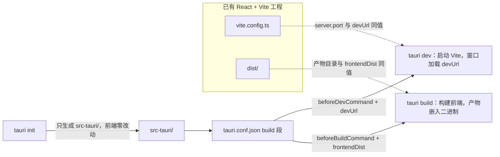

import { Canvas, Controls, Meta } from '@storybook/addon-docs/blocks';
import * as IntegrateFrontend from './integrate-frontend.stories';

<Meta of={IntegrateFrontend} name="Docs" />

# 集成已有前端

本课把一个已有的 React + TypeScript（Vite）工程接入 Tauri：不重建前端、不搬目录，`tauri init` 只往工程里放进一份 `src-tauri/` Rust 骨架，前端文件一个都不动。要建立的核心直觉：**Tauri 不接管前端构建，它只是包住现有前端**——开发时窗口加载你的 dev server，发布时把构建产物嵌进二进制。两侧只要在端口与产物路径上约定一致，接入就完成了。右侧交互实例里，切换 dev / build 可以看到两条命令各自消费的字段；把「Vite 端口」和「devUrl 端口」调成不同值，对接立即失败。



回查入口：`build` 段四个字段的分工——

| build 字段 | 回答的问题 | React/Vite 典型值 | 被谁消费 |
| --- | --- | --- | --- |
| `beforeDevCommand` | `tauri dev` 前先跑什么命令 | `npm run dev` | `tauri dev` |
| `devUrl` | 开发窗口加载哪个 URL | `http://localhost:1420` | `tauri dev` |
| `beforeBuildCommand` | `tauri build` 前先跑什么命令 | `npm run build` | `tauri build` |
| `frontendDist` | 发布时前端产物在哪 | `../dist`（相对 `src-tauri/`） | `tauri build` |

## 快速上手

前提：已有一个 `npm run dev` 能正常打开页面的 React + Vite 工程；Rust 工具链按[安装](?path=/docs/installation--docs)一课就绪。

```bash
# 1. 在已有工程根目录安装 Tauri CLI
npm install -D @tauri-apps/cli

# 2. 生成 src-tauri/：按提问回答（app name 与窗口标题自定；
#    web assets 填 ../dist、dev server 填 http://localhost:1420、
#    dev / build command 填 npm run dev 与 npm run build）
npx tauri init
```

```ts
// 3. vite.config.ts：固定端口、忽略 src-tauri（对齐项的完整说明见下文）
export default defineConfig({
  plugins: [react()],
  clearScreen: false,
  server: {
    port: 1420,
    strictPort: true,
    watch: { ignored: ['**/src-tauri/**'] },
  },
});
```

```jsonc
// 4. package.json：scripts 里加一条，后续统一走 npm run tauri ...
"scripts": {
  "dev": "vite",
  "build": "tsc && vite build",
  "tauri": "tauri"
}
```

```bash
# 5. 启动开发窗口
npm run tauri dev
```

窗口里加载的就是 Vite 页面，改 `src/` 即时热更新——接入完成。`tauri dev` 与 `tauri build` 两条流水线的完整行为见[第一个应用](?path=/docs/first-app--docs)。

## tauri init：加入 Rust 骨架

`tauri init` 只做一件事：在当前工程根目录生成一份 `src-tauri/`，前端文件零改动。它与 create-tauri-app 是同一份骨架的两个入口——create-tauri-app 生成前端模板 + 这份骨架（见[第一个应用](?path=/docs/first-app--docs)），官方文档把「往已有工程补骨架」这条路叫 Manual Setup (Tauri CLI)。

生成的文件清单：

| 生成的文件 / 目录 | 作用 |
| --- | --- |
| `src-tauri/tauri.conf.json` | Tauri 配置，本课的主角是其中的 `build` 段 |
| `src-tauri/Cargo.toml` | Rust 依赖与包信息 |
| `src-tauri/src/main.rs`、`lib.rs` | 应用入口，`tauri::Builder` 从这里启动 |
| `src-tauri/build.rs` | cargo 构建脚本 |
| `src-tauri/capabilities/` | 权限能力声明，见[权限与能力](?path=/docs/capabilities--docs) |
| `src-tauri/icons/` | 应用图标 |
| `src-tauri/.gitignore` | 忽略 `target/` 等构建产物 |

在工程根目录运行即可；`-d, --directory` 换目标目录，`-f, --force` 覆盖已有 `src-tauri/` 重新生成。

### 交互提问与落点

直接运行 `npx tauri init` 会依次问六个问题（引号内为官方原文），每个答案都作为初始值写入 `tauri.conf.json`：

| tauri init 提问 | 落到 tauri.conf.json | 本课取值 |
| --- | --- | --- |
| "What is your app name?" | `productName`（顶层字段） | `my-app` |
| "What should the window title be?" | `app.windows[].title` | `my-app` |
| "Where are your web assets located?" | `build.frontendDist` | `../dist` |
| "What is the url of your dev server?" | `build.devUrl` | `http://localhost:1420` |
| "What is your frontend dev command?" | `build.beforeDevCommand` | `npm run dev` |
| "What is your frontend build command?" | `build.beforeBuildCommand` | `npm run build` |

- web assets 的位置是相对将生成的 `src-tauri/` 而言：Vite 产物在工程根的 `dist/`，所以填 `../dist`。
- 官方示例的 devUrl 用的是 Vite 默认端口 5173；本课沿用 create-tauri-app 模板惯例的固定端口 1420。任何端口都可以，两侧一致即可。
- 答案只是初始值，写错了直接改 `tauri.conf.json`，一般不需要 `-f` 重跑。

### 非交互一条命令

```bash
npx tauri init --ci \
  --app-name my-app \
  --window-title my-app \
  --frontend-dist ../dist \
  --dev-url http://localhost:1420 \
  --before-dev-command "npm run dev" \
  --before-build-command "npm run build"
```

- `--ci` 跳过全部提问；未给出的选项用 CLI 内置默认值，六个值全部显式给出可保证团队成员与 CI 生成结果一致。
- 其余 flags 与提问一一对应：`-A/--app-name`、`-W/--window-title`、`-D/--frontend-dist`、`-P/--dev-url`。

## build 段：两侧对接的约定

`build` 段四个字段两两一组，分别被两条命令消费：dev 组由 `beforeDevCommand` 替你启动 Vite，`devUrl` 告诉窗口加载哪个地址；build 组由 `beforeBuildCommand` 替你执行前端构建，`frontendDist` 指明产物位置——相对 `src-tauri/`，官方定义也允许填远程 URL，本地前端工程一律用路径。两个 hook 缺省为空：不配置时 Tauri 不会替你跑任何前端命令，得自己先开终端起 dev server；配置后 `tauri dev` 会先执行 `beforeDevCommand`，再等 `devUrl` 可达才开窗口。

<Canvas of={IntegrateFrontend.Interactive} />
<Controls of={IntegrateFrontend.Interactive} />

| 读者操作 | 可观察证据 |
| --- | --- |
| 切换「tauri 命令」 | 右栏高亮的字段与中间连线在 dev / build 两组之间切换 |
| 改「Vite 端口」或「devUrl 端口」 | dev 下两侧同值时连线与状态条为绿；失配时变红并给出后果 |
| 切到 build 后再改端口 | 状态条不再变化——build 只认 `frontendDist`，与端口无关 |
| 打开 Show code | 看到该 Canvas 实际执行的 `example.ts` |

### vite.config.ts 对齐项

| 配置 | 本课取值 | 为什么 |
| --- | --- | --- |
| `server.port` + `server.strictPort` | `1420` + `true` | `devUrl` 必须能对上固定端口；不开 `strictPort`，端口被占时 Vite 会静默换号，`devUrl` 立即失配 |
| `server.watch.ignored` | `['**/src-tauri/**']` | Rust 变化由 cargo 负责重编译；不加这项，Vite 会因 `src-tauri/` 变化整页刷新 |
| `clearScreen` | `false` | 前端命令先跑，关闭清屏避免 Vite 输出盖住 Rust 报错 |

```ts
import { defineConfig } from 'vite';
import react from '@vitejs/plugin-react';

export default defineConfig({
  plugins: [react()],
  // 不清屏：Rust 报错不被 Vite 输出盖住
  clearScreen: false,
  server: {
    // Tauri 期望固定端口；被占用时直接失败，而不是换端口
    port: 1420,
    strictPort: true,
    watch: {
      // src-tauri/ 的变化交给 cargo，避免 Vite 整页刷新
      ignored: ['**/src-tauri/**'],
    },
  },
});
```

### package.json 改动

```jsonc
{
  "scripts": {
    "dev": "vite",
    "build": "tsc && vite build",
    "tauri": "tauri"
  },
  "devDependencies": {
    "@tauri-apps/cli": "^2"
  }
}
```

- 命令入口统一 `npm run tauri dev` / `npm run tauri build`，走工程内的本地 CLI，版本跟工程走。
- `@tauri-apps/api` 是另一回事：前端开始调用 `invoke`、事件等 IPC 能力时再 `npm install @tauri-apps/api`，纯页面接入不需要，见[命令](?path=/docs/commands--docs)。

## 最佳实践

- **两侧配置一处为真、成对修改。** `devUrl` 与 `server.port`、`frontendDist` 与 Vite 的 `build.outDir` 必须同值；改端口或产物目录时，`vite.config.ts` 与 `tauri.conf.json` 在同一次改动里一起改。`strictPort: true` 把端口冲突从「静默换号、窗口空白」变成「启动即报错」，更易排查。
- **hook 引用 npm script，不写死底层命令。** `beforeDevCommand` 填 `npm run dev` 而不是 `vite`：命令随 `package.json` 的 scripts 走，换 pnpm / bun 只改 scripts，`tauri.conf.json` 不动。
- **交互提问给人用，`--ci` 加全量 flags 给自动化用。** 手动接入直接答六个问题；脚手架与 CI 用 `--ci` 显式传值，保证每次生成一致。

## 常见问题

- 开发窗口一片空白，或 CLI 停在等待 dev server
  先比对 `build.devUrl` 与 Vite 实际监听的端口（Vite 启动输出里看得到）是否同值：`devUrl` 没人监听时 CLI 会一直等待，被别的服务占用时窗口加载到错误内容。把两侧改成同值再跑。
- 跟着旧教程写 `devPath` / `distDir`，字段不生效
  这是 Tauri 1.x 的字段名（工作区 `tester/` 旧工程即此写法）；2.x 改名为 `devUrl` / `frontendDist`，同时 1.x 的 `package.productName` 变成顶层 `productName`。迁移旧配置时对照 2.x 配置参考逐段改名。
- `tauri dev` 卡住不动且没有报错
  `beforeDevCommand` 执行失败时，Tauri 会一直等一个不会就绪的 `devUrl`。先单独运行该命令（如 `npm run dev`）确认能起来：常见原因是依赖没装、端口被占或脚本名不存在。
- 改 Rust 代码时页面整页刷新
  Vite 默认监听整个工程目录，`src-tauri/` 的变化也会触发 reload；在 `vite.config.ts` 加 `server.watch.ignored: ['**/src-tauri/**']`，Rust 重编译交给 cargo 管。

## 总结回顾

摘要：

接入已有前端不需要改造工程：`tauri init` 在根目录生成 `src-tauri/` 骨架（配置、Cargo 入口、capabilities、图标），六个交互提问的答案就是 `tauri.conf.json` 里 `productName`、窗口标题与 `build` 段四字段的初始值，之后一切以配置文件为准。`build` 段两侧对接的约定只有两组——`tauri dev` 消费 `beforeDevCommand` 与 `devUrl`，`tauri build` 消费 `beforeBuildCommand` 与 `frontendDist`；Vite 侧用固定端口加 `strictPort`、忽略 `src-tauri/` 监听、关闭清屏与之配合。端口失配只影响 dev 的窗口加载，build 只认产物路径。

一句话：

> Tauri 不接管前端构建：`tauri init` 只放入 Rust 骨架，真正的接入是 `build` 段的两组约定——dev 的命令与地址，build 的命令与产物路径。

知识要点：

- `tauri init` 生成哪些文件？它与 create-tauri-app 如何分工？
- `tauri init` 的六个提问分别落到 `tauri.conf.json` 的哪些字段？
- `tauri dev` 与 `tauri build` 各消费 `build` 段的哪两个字段？
- `frontendDist` 的路径相对哪个目录？除了路径还能填什么？
- Vite 侧哪三项配置要为 Tauri 对齐？各自防什么问题？
- Tauri 1.x 的 `devPath` / `distDir` 对应 2.x 的哪些字段？

## 参考资料

- [Creating a Project - Tauri 官方文档](https://tauri.app/start/create-project/)
  Manual Setup (Tauri CLI) 一节：`tauri init` 的六个提问、生成 `src-tauri/` 的行为与 Vite `watch.ignored` 建议。
- [Tauri CLI Reference - Tauri 官方文档](https://tauri.app/reference/cli/)
  `tauri init` 的 `--ci`、`-A`、`-W`、`-D`、`-P`、`--before-dev-command`、`--before-build-command`、`-f`、`-d` 参数与 `tauri dev` 的等待行为。
- [Configuration Reference - Tauri 官方文档](https://tauri.app/reference/config/)
  `build` 段四字段的定义、顶层 `productName` 与 `app.windows[].title` 的位置。
