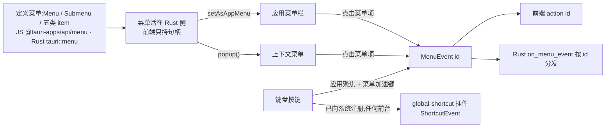

import { Canvas, Controls, Meta } from '@storybook/addon-docs/blocks';
import * as MenusShortcuts from './menus-shortcuts.stories';

<Meta of={MenusShortcuts} name="Docs" />

# 菜单与快捷键

菜单是桌面应用暴露命令的主入口:应用菜单栏常驻屏幕顶部或窗口栏,上下文菜单跟随右键出现,快捷键让命令离开鼠标。Tauri 2 把前两者做成**核心能力**——JS 侧 `@tauri-apps/api/menu`、Rust 侧 `tauri::menu`,不用装插件;全局快捷键则是官方插件 `global-shortcut`。共同模型一句话:**菜单活在 Rust 侧,前端只持句柄;任何一次菜单点击都变成带 id 的 `MenuEvent`,前端用 `action`、Rust 用 `on_menu_event` 按 id 分发**。快捷键有两条独立通道:加速键写在菜单项上、只认聚焦的应用;全局快捷键向操作系统注册、任何前台下都触发。

菜单与全局快捷键都是桌面能力,移动端没有对应 API。托盘图标及其菜单的组合见[系统托盘](?path=/docs/system-tray--docs);插件安装的通用模式见[插件体系](?path=/docs/plugin-system--docs),capabilities 授权排查见[权限与能力](?path=/docs/capabilities--docs)。下面的实例把菜单构建、右键接管与快捷键触发做成可操作的模拟:点菜单项看事件读数,右键看弹出的菜单,「按下 / 松开」看两条通道谁亮。



两条快捷键通道速查(本课最重要的对照,各节展开):

| | 菜单加速键 accelerator | 全局快捷键 global-shortcut |
| --- | --- | --- |
| 定义位置 | 菜单项的 `accelerator` 参数 | 插件 `register()` / Rust `register` |
| 依赖 | Tauri 核心,无需插件 | `tauri-plugin-global-shortcut` + capabilities 授权 |
| 生效条件 | 应用聚焦时(菜单系统处理) | 系统级,任何应用在前台都触发 |
| 事件形态 | `MenuEvent { id }` / `action(id)` | `ShortcutEvent { shortcut, id, state }` |
| 生命周期 | 随菜单创建与销毁 | `register` / `unregister` / `unregisterAll` |

## 快速上手

前提:已有[第一个应用](?path=/docs/first-app--docs)生成的 react-ts 工程,`@tauri-apps/api` 已内置;菜单命令权限随 `core:default` 启用,无需配置。最小闭环:装一份自定义菜单点一次,再注册一个全局快捷键,在应用**未聚焦**时按下它。

1. 定义并安装应用菜单:

```ts
// src/menu.ts —— 在 main.tsx 启动时调用 installMenu()
import { Menu, Submenu } from '@tauri-apps/api/menu';

export async function installMenu() {
  const file = await Submenu.new({
    text: '文件',
    items: [
      {
        id: 'open',
        text: '打开…',
        accelerator: 'CmdOrCtrl+O',
        action: (id) => console.log('action:', id), // 点击后收到 'open'
      },
      { item: 'Separator' },
      { item: 'Quit' }, // 预定义项:行为由系统实现
    ],
  });
  const menu = await Menu.new({ items: [file] });
  await menu.setAsAppMenu(); // 替换默认菜单,返回上一个菜单
}
```

2. `npm run tauri dev`:菜单栏变成自定义的「文件」。点「打开…」,控制台打印 `action: open`——点击变成了带 id 的事件,`action` 是前端通道。

3. 全局快捷键是官方插件,一条命令接入(会同时写 Rust 依赖、`.plugin(...)` 注册与 npm 包;手动安装时 Rust 注册要放在 `#[cfg(desktop)]` 下):

```bash
npm run tauri add global-shortcut
```

插件 default 权限集是**空集**(官方认为注册全局快捷键本身敏感),把权限手动加进 `src-tauri/capabilities/default.json`:

```json
"permissions": [
  "core:default",
  "global-shortcut:allow-register"
]
```

4. 注册组合键:

```ts
// src/shortcuts.ts —— 同样在启动时调用
import { register } from '@tauri-apps/plugin-global-shortcut';

await register('CommandOrControl+Shift+P', (event) => {
  if (event.state === 'Pressed') {
    console.log('全局触发:', event.shortcut);
  }
});
```

5. 验证通道边界:应用聚焦时按 `Cmd+O` → 打印 `action: open`;把窗口切到别的应用再按 `Cmd+Shift+P` → 仍然打印,全局快捷键不依赖焦点;而此时 `Cmd+O` 不再触发——加速键只认聚焦的应用。本机核对清单见本目录 `runtime-verification.md`。

## 菜单结构

共同模型:`Menu` 是容器——Windows/Linux 上渲染成窗口菜单栏,macOS 上渲染成屏幕顶部的全局菜单;`Submenu` 嵌套在 `Menu` 或其他 `Submenu` 里;叶子是四类 item。菜单活在 Rust 侧,JS 对象只是句柄,后续要 `get` / 修改的菜单应在模块层保持引用。

macOS 是本课最容易踩的结构约束:

- 顶层 `Menu` 只允许放 `Submenu`,顶层普通项**被忽略**——不渲染、点击无事件。
- 第一个子菜单会占据应用菜单区(about 区域),官方建议第一个放「About」或应用名子菜单。

默认菜单:不设置菜单时 Tauri 自动装一份默认菜单;`Menu.default()`(JS)/ `Menu::default(&app_handle)`(Rust)返回同一份,适合作为扩展起点——含 Edit(undo / redo / cut / copy / paste / select all)、Window、Help 子菜单,macOS 另有应用名子菜单和带全屏项的 View,Windows 另有带关闭与退出的 File。

五类成员速查:

| 成员 | JS 构造 | Rust 构造 | 用途与要点 |
| --- | --- | --- | --- |
| MenuItem | `MenuItem.new({ id, text, action })` | `MenuItem::with_id(manager, id, text, enabled, accelerator)` | 普通文本项,点击发出带 id 的事件 |
| CheckMenuItem | `CheckMenuItem.new({ checked })` | `CheckMenuItem::with_id(…, checked, accelerator)` | 勾选切换,点击自动翻转;`isChecked()` / `setChecked()` 读写 |
| IconMenuItem | `IconMenuItem.new({ icon })` | `IconMenuItem::with_id(…, Some(image), …)` | 图标项;需 `image-ico` / `image-png` Cargo feature |
| PredefinedMenuItem | `PredefinedMenuItem.new({ item: 'Copy' })` | `PredefinedMenuItem::separator(app)` 等 | 行为与文案归系统,不产生菜单事件 |
| Submenu | `Submenu.new({ text, items })` | `SubmenuBuilder::new(manager, text)` | 子菜单容器;macOS 顶层只允许它 |
| 分隔线 | `{ item: 'Separator' }` | `PredefinedMenuItem::separator(app)` | 预定义项的一种,不可点击 |

## 定义应用菜单

两条路线结构相同——JS 声明对象树,Rust 用 builder 链——选与命令实现同侧的一条:

```rust
// src-tauri/src/lib.rs 的 setup 中,app 为 &mut App
use tauri::menu::{MenuBuilder, MenuItem, SubmenuBuilder};

let file = SubmenuBuilder::new(app, "文件")
    .text("open", "打开…")
    .separator()
    .build()?;

// accelerator 是 with_id 的最后一个参数
let find = MenuItem::with_id(app, "find", "查找…", true, Some("CmdOrCtrl+F"))?;
file.append(&find)?;

let menu = MenuBuilder::new(app).item(&file).build()?;
app.set_menu(menu)?; // 替换默认菜单
```

安装归属:`setAsAppMenu()` / `app.set_menu()` 是应用级菜单,**所有没有显式菜单的窗口都会继承它**;`setAsWindowMenu(window)` / `window.set_menu()` 才是窗口级——Windows/Linux 可以每个窗口一套菜单,macOS 不支持(菜单是应用级的),配套的还有 `remove_menu` / `hide_menu` / `show_menu`。

`accelerator` 语法:零到多个修饰键 + 恰好一个键,`+` 连接。修饰键:`Shift`、`Control`(Ctrl)、`Alt`(Option)、`Command`(Cmd, Super),以及 `CmdOrCtrl` 家族——macOS 解析为 Command、其余平台解析为 Control,一份定义全平台可用。键支持字母数字、标点、`Enter` / `Space` / `Tab` / `Escape`、方向键、`F1`–`F24`、小键盘与媒体键。关键边界:**无法解析的 accelerator 会被静默忽略**——菜单项创建成功但没有快捷键,拼写必须对照官方清单(见参考资料)。

运行时修改:按 id 找到项再调 setter(`setText` / `setEnabled` / `setChecked` / `setAccelerator`),常用于解锁禁用项、同步状态文案:

```ts
const statusItem = await menu.get('status');
if (statusItem) await statusItem.setText('状态:就绪'); // 按 id 查找后修改
```

### 预定义项:行为由系统实现

`PredefinedMenuItem` 声明即用:行为与文案都由操作系统实现,应用不写处理代码,点击**不产生菜单事件**;`text` 仅用于覆盖平台默认文案(做本地化)。JS 用 `{ item: 'Copy' }` 或 `PredefinedMenuItem.new({ item, text })`,Rust 用 `PredefinedMenuItem::copy(app, Some("复制"))` 等构造函数。各值的平台支持(用前先对照,不支持的项会创建成功但在该平台不做事):

| item 值 | 行为 | 平台支持 |
| --- | --- | --- |
| `Separator` | 分隔线 | 全平台 |
| `Copy` / `Cut` / `Paste` / `SelectAll` | 聚焦文本框的剪贴板操作 | 全平台 |
| `Undo` / `Redo` | 撤销 / 重做 | 仅 macOS |
| `Minimize` / `Maximize` / `Hide` / `HideOthers` / `CloseWindow` / `Quit` | 窗口与应用级操作 | Windows / macOS,Linux 不支持 |
| `Fullscreen` / `ShowAll` / `Services` / `BringAllToFront` | macOS 专属窗口管理 | 仅 macOS |
| `{ About: … }` | 关于对话框 | 全平台;传 `null` 用 tauri.conf.json 的值 |

## 响应菜单点击

任何启用中的 MenuItem / CheckMenuItem 被点击,都会变成一个 `MenuEvent`,唯一负载就是定义时给的 `id`——id 是分发键。分隔线、禁用项与预定义项不产生事件。

JS 通道 `action`:创建时绑定,收到的参数就是 id 字符串,适合纯前端逻辑:

```ts
const edit = await Submenu.new({
  text: '编辑',
  items: [
    { id: 'find', text: '查找…', action: (id) => openSearch(id) }, // id === 'find'
  ],
});
```

Rust 通道 `on_menu_event`:按 id 分发,适合落在 Rust 侧的命令(窗口控制、状态读写、触发托盘行为):

```rust
app.on_menu_event(move |_app, event| {
    match event.id().as_ref() {
        "open" => { /* 打开文档 */ }
        "auto-save" => { /* 读取 / 写入勾选状态 */ }
        _ => {}
    }
});
```

窗口对象(`Window` / `WebviewWindow`)也有 `on_menu_event`,但它收到的是**所有**菜单事件——包括其他窗口乃至托盘菜单——且窗口关闭后监听失效;把它当作「这个窗口存活期间」的临时监听,而不是隔离手段。通道选择:前端建的菜单用 `action` 接点击,命令在 Rust 侧就用 `on_menu_event`;同一条命令挑一条通道实现,避免双份逻辑。

下面的实例演示构建与响应:点击菜单项,两条通道的读数同时给出 id;切换顶层结构可以复现 macOS 的忽略规则。

<Canvas of={MenusShortcuts.Interactive} />
<Controls of={MenusShortcuts.Interactive} />

| 读者操作 | 可观察证据 |
| --- | --- |
| 点「打开…」 | 菜单事件行显示 `id="open"`,action 与 on_menu_event 两行读数同时命中 |
| 点「自动保存」 | 事件之外,勾选状态在点击后自动翻转 |
| 点「退出 Tauri」或「复制」 | 无菜单事件——预定义项由系统执行 |
| 点「导出 PDF…」 | 禁用项不产生事件 |
| 「顶层结构」切到 flat | 顶层普通项被 macOS 忽略,点击无任何读数变化 |
| 打开 Show code | 看到该 Canvas 实际执行的 `example.ts` |

## 上下文菜单

应用菜单常驻,上下文菜单按需弹出——**同一个 `Menu` 对象调用 `popup()` 就变成右键菜单**。省略参数时贴着鼠标、弹在当前窗口;也可以传位置(相对窗口左上角)与目标窗口。`popup()` 的 promise 在菜单**显示时**立即 resolve,不等你选择——点击响应必须走菜单项的 `action`。

WebView 自带右键菜单,接管它的固定三步:监听 `contextmenu` → `preventDefault()` → `menu.popup()`:

```ts
import { Menu } from '@tauri-apps/api/menu';
import { LogicalPosition } from '@tauri-apps/api/dpi';

// menu 在启动时构建好并保持引用(见快速上手)
document.addEventListener('contextmenu', (event) => {
  event.preventDefault(); // 不拦,默认菜单照常弹出,popup 没有机会执行
  void menu.popup(new LogicalPosition(event.clientX, event.clientY));
});
```

Rust 侧对应 `ContextMenu` trait:`menu.popup(window)?` 在光标处弹出,`menu.popup_at(window, position)?` 在指定位置弹出。

实例把三个开关拆开验证:只有 `preventDefault` 与 `popup` 同时发生,右键才是自定义菜单。

<Canvas of={MenusShortcuts.ContextPopup} />
<Controls of={MenusShortcuts.ContextPopup} />

| 读者操作 | 可观察证据 |
| --- | --- |
| 两个开关全开,在文字上右键 | 自定义 Menu 弹出;popup 行显示 promise 已 resolve(未等选择) |
| 点弹出菜单里的「打开链接」 | 菜单点击行显示 `action("open-link")` |
| 关掉「调用 menu.popup()」再右键 | 默认菜单被拦但什么都不弹——preventDefault 只负责拦 |
| 关掉「拦截 contextmenu」再右键 | WebView 默认菜单照常(模拟示意),popup 永远不执行 |
| 打开 Show code | 看到该 Canvas 实际执行的 `context-menu.ts` |

## 全局快捷键

全局快捷键由官方插件 `tauri-plugin-global-shortcut` 提供:把组合键**注册到操作系统**,注册后无论我们的应用是否在前台,按键都送达 handler。JS 侧四个函数加一个事件对象:

```ts
import {
  isRegistered,
  register,
  unregister,
  unregisterAll,
} from '@tauri-apps/plugin-global-shortcut';

await register('CommandOrControl+Shift+P', (event) => {
  // ShortcutEvent { shortcut, id, state: 'Pressed' 或 'Released' }
  if (event.state === 'Pressed') {
    console.log('全局触发:', event.shortcut);
  }
});
await isRegistered('CommandOrControl+Shift+P'); // 只反映本应用的注册
await unregister('CommandOrControl+Shift+P');   // 解除单个
await unregisterAll();                          // 解除本应用全部
```

两个关键边界:

- **占用。** 组合键已被其他应用占用时,handler 不会触发(官方文档明确说明);`isRegistered` 只查本应用,查不到别人的占用——选键要足够独特。
- **权限。** 插件 default 权限集为空,按需声明 `allow-register` / `allow-unregister` / `allow-register-all` / `allow-unregister-all` / `allow-is-registered`。

Rust 侧在注册插件时挂全局 handler,运行时用 `global_shortcut()` 管理注册;`on_shortcut` 把「注册 + 监听」合成一步:

```rust
use tauri_plugin_global_shortcut::ShortcutState;

// 注册插件并挂 handler(手动安装时放在 #[cfg(desktop)] 下)
app.handle().plugin(
    tauri_plugin_global_shortcut::Builder::new()
        .with_handler(|_app, shortcut, event| {
            if event.state() == ShortcutState::Pressed {
                println!("{shortcut:?} pressed");
            }
        })
        .build(),
)?;

// 运行时注册 / 解除
app.global_shortcut().register("CommandOrControl+Shift+P")?;
app.global_shortcut().unregister("CommandOrControl+Shift+P")?;

// 一步到位:注册 + 监听
app.global_shortcut().on_shortcut("Alt+Space", |_app, _shortcut, event| {
    if event.state() == ShortcutState::Pressed {
        // ...
    }
})?;
```

`Builder` 还提供 `with_shortcuts` / `with_shortcut`,在插件 setup 阶段批量注册(返回 `Result`);需要结构化组合键时用 `Shortcut::new(Some(Modifiers::CONTROL), Code::KeyN)`。全局快捷键底层依赖运行中的事件循环,Tauri 运行时已满足这一前提。

与加速键的选择判断:选通道先问「按键时应用在前台吗」——只在聚焦时需要响应用加速键,任何时候都要响应用全局快捷键。两者可以挂在同一个组合键上,聚焦时两条通道都会触发(实例同时点亮两行),注意去重。

<Canvas of={MenusShortcuts.GlobalShortcuts} />
<Controls of={MenusShortcuts.GlobalShortcuts} />

| 读者操作 | 可观察证据 |
| --- | --- |
| 「应用聚焦」关掉后点「按下」 | 加速键行显示未触发;全局行(registered)显示 `ShortcutEvent state="Pressed"` |
| 「应用聚焦」打开再点「按下」 | 两行同时点亮——同一按键双通道命中,提示去重 |
| 「全局快捷键」切到 taken | 全局行显示被占用不触发,加速键不受影响 |
| 「全局快捷键」切到 unregistered | 全局行显示无事件,加速键照常 |
| 点「松开」 | 全局行变 `state="Released"`;加速键没有按下 / 松开之分 |
| 打开 Show code | 看到该 Canvas 实际执行的 `shortcuts.ts` |

## 最佳实践

- **命令只挑一条响应通道。** 前端建的菜单用 `action`,命令落在 Rust 侧用 `on_menu_event`;同一个 id 别在两条通道各写一份逻辑,否则一次点击执行两遍。
- **标准编辑行为交给 PredefinedMenuItem。** 复制 / 剪切 / 粘贴 / 全选用预定义项,系统负责文案、快捷键与行为并自动本地化;自己造 MenuItem 加 invoke 反而丢失「作用于聚焦输入」的行为。
- **accelerator 用 CmdOrCtrl 家族。** 别硬编码 `Cmd` 或 `Ctrl`;`CmdOrControl` 在 macOS 解析为 Command、其余平台解析为 Control,一份定义全平台可用。
- **全局快捷键要独特且可释放。** 挑不会与系统或常用软件冲突的组合;随窗口注册的快捷键在窗口关闭时 `unregister`,应用退出前 `unregisterAll`,把占用还给系统。
- **保持菜单句柄。** JS 侧菜单对象只是 Rust 侧资源的句柄;后续要 `get` / 修改的菜单存模块级变量,别让临时作用域丢掉引用。
- **macOS 把 About 放第一个子菜单。** 第一个子菜单占据应用菜单区,用「关于」开头才符合平台布局习惯。

## 常见问题

- 菜单建好了,项也显示了,但快捷键不出现、按下也没反应
  `accelerator` 无法解析时会被静默忽略——项创建成功但没有快捷键。逐字核对修饰键与键名(如 `CmdOrCtrl+Shift+K`、`F5`、`ArrowUp`),修饰键必须在键之前;也可以用 `setAccelerator` 动态补挂验证。
- `register` 调用成功,切到别的应用按键却没有反应
  组合键很可能已被其他应用占用——官方文档明确此时 handler 不会触发,而且 `isRegistered` 只查本应用、查不到别人的占用。换一个更独特的组合重试;占用关系无法从插件 API 里查到。
- macOS 上顶层放了普通 MenuItem,菜单栏里却看不到
  macOS 顶层只允许 Submenu,普通项被忽略(不渲染、无事件)。把它们分组进子菜单,并把第一个子菜单设计成 About 开头。
- 右键弹不出自定义菜单,WebView 默认菜单还在
  三步缺一不可:监听 `contextmenu`、`event.preventDefault()`、`menu.popup()`。只拦截不弹是空白右键;不拦截时默认菜单照常,popup 根本没有执行机会。
- `setAsWindowMenu` 在 macOS 上不生效
  macOS 的菜单是应用级的,窗口级 set / remove 菜单在 macOS 不支持;统一用 `setAsAppMenu`。「每窗口一套菜单」只在 Windows / Linux 可用。
- 调用菜单 API 报 not allowed
  菜单命令权限属于 `core:menu:default`,正常随 `core:default` 启用;报拒绝说明 capabilities 被收紧时漏掉了菜单权限,补回即可(排查见[权限与能力](?path=/docs/capabilities--docs))。

## 总结回顾

摘要:菜单是 Tauri 2 的核心能力:`Menu` 容器加 `Submenu` 与五类成员,菜单活在 Rust 侧、前端持句柄;应用菜单用 `setAsAppMenu` 安装并被所有没有显式菜单的窗口继承,macOS 顶层只允许子菜单且第一个子菜单占据 about 区。点击变成只带 id 的 `MenuEvent`,前端 `action` 与 Rust `on_menu_event` 按 id 分发;预定义项的行为与文案归系统、不产生事件,`CheckMenuItem` 点击自动翻转勾选状态。上下文菜单复用同一个 `Menu`:`popup()` 显示即 resolve,接管右键需要 preventDefault。快捷键两条通道:加速键挂在菜单项上、应用聚焦时生效、解析失败静默忽略;全局快捷键由 global-shortcut 插件注册,default 权限为空、需手动授权,组合被占用时 handler 不触发,`isRegistered` 只查本应用。

一句话:

> 菜单点击是带 id 的事件,快捷键分两条通道——加速键认聚焦的应用,全局快捷键认整个系统;选通道先问「按键时应用在前台吗」。

知识要点:

- 菜单由哪些对象组成?五类成员各自适合什么场景?
- 应用菜单怎么安装?哪些窗口会继承它?窗口级菜单在哪个平台受限?
- 一次菜单点击在 JS 与 Rust 两侧各以什么形态到达?
- 哪些菜单项点击不产生事件?为什么?
- 接管 WebView 右键菜单的固定三步是什么?`popup()` 的 promise 何时 resolve?
- `accelerator` 的语法规则是什么?解析失败时表现如何?
- 全局快捷键如何注册与释放?被占用时如何表现?

## 参考资料

- [Window Menu - Tauri 官方文档](https://tauri.app/learn/window-menu/)
  JS 与 Rust 菜单定义、MenuBuilder / SubmenuBuilder、`on_menu_event` 分发、macOS 顶层子菜单规则与 About 位置、子菜单图标自 Tauri 2.8.0、`setAsAppMenu` 归属行为的来源。
- [Global Shortcut 插件 - Tauri 官方文档](https://tauri.app/plugin/global-shortcut/)
  安装命令、`with_handler` / `ShortcutState` Rust 示例、权限表与「default 不启用任何功能」、组合被占用时 handler 不触发的来源。
- [Global Shortcut JavaScript API 参考 - Tauri 官方文档](https://tauri.app/reference/javascript/global-shortcut/)
  `register` / `unregister` / `unregisterAll` / `isRegistered` 签名与 `ShortcutEvent { shortcut, id, state }` 的来源。
- [tauri::menu 模块 - docs.rs](https://docs.rs/tauri/latest/tauri/menu/)
  Menu / Submenu / MenuItem / CheckMenuItem / IconMenuItem / PredefinedMenuItem 构造、`Menu::default`、`ContextMenu` trait 的 `popup` / `popup_at`、`MenuEvent.id` 的来源。
- [tauri-plugin-global-shortcut - docs.rs](https://docs.rs/tauri-plugin-global-shortcut/latest/tauri_plugin_global_shortcut/)
  `GlobalShortcut::on_shortcut` / `register` / `is_registered` 与 `Builder::with_shortcuts` / `with_handler` 签名、`ShortcutState` 的来源。
- [菜单模块源码 - tauri-apps/tauri](https://github.com/tauri-apps/tauri/tree/dev/packages/api/src/menu)
  accelerator 修饰键与键名清单、「无法解析即忽略」、预定义项平台支持矩阵、`core:menu:default` 权限说明的来源。
