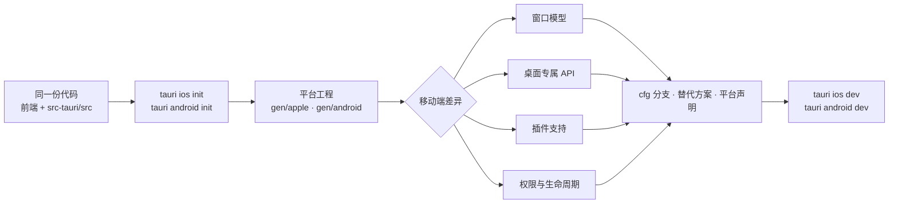

import { Canvas, Controls, Meta } from '@storybook/addon-docs/blocks';
import * as MobileAdaptation from './mobile-adaptation.stories';

<Meta of={MobileAdaptation} name="Docs" />

# 移动端差异

桌面版第一次跑进 iOS / Android 模拟器,马上会撞上一批「桌面成立、移动端不成立」的假设:窗口想开就开、菜单托盘常驻、插件装了就能用、文件随便读。本课把差异收敛成一张可查的清单——窗口模型、桌面专属 API、平台工程、权限声明、平台判定、生命周期——并给出对应的适配手段。读法与实例:下方的交互实例把「能力点 × 目标平台」的支持判定做成可调模拟,选一个桌面版在用的能力,读数直接给出移动端支持级别、平台备注与迁移对策。边界:环境搭建与模拟器运行归[移动端起步](?path=/docs/mobile-setup--docs),打包签名与商店发布归[移动端发布](?path=/docs/mobile-release--docs);本课只管「把桌面代码带到移动端要面对什么、怎么收口」。

一份代码变成四个构建目标的过程,以及差异出现的四个面:



差异速查(正文逐类展开,实例可逐条核对):

| 差异点 | 桌面 | 移动端 | 对策 |
| --- | --- | --- | --- |
| 新建窗口 | 想建就建 | 平板并排(Activity Embedding / UIScene),手机压栈或替换界面 | 运行时 `supportsMultipleWindows` 判定 |
| 窗口菜单 Menu | 支持 | 不支持("Available on desktop") | 页面内导航替代 |
| 系统托盘 | 支持 | 不支持 | 应用图标 + 通知承担常驻入口 |
| updater / single-instance / window-state / global-shortcut | 支持 | 插件矩阵标无支持 | 商店更新、删恢复逻辑、桌面分支编译 |
| fs | 按 scope 访问 | 默认限应用文件夹 | 数据落 `appDataDir`,用户文件经 dialog |
| clipboard | 富内容可用 | 仅纯文本 | 分享面板或落盘传递 |
| dialog | 文件 + 目录 | 无文件夹选择 | 移动端只选文件 |
| opener / shell | URL + 路径 | 仅 `open` 打开 URL | 本地文件走分享 |
| 系统权限 | 基本免申报 | AndroidManifest.xml / Info.plist 按平台申报 | 按插件 Setup 章节补声明 |
| 生命周期 | 进程常驻自管 | 系统启动、回收、再启动 | 初始化进 setup hook,监听系统事件 |

## 快速上手

前提:[移动端起步](?path=/docs/mobile-setup--docs)一课的环境(Xcode / Android Studio)已就绪,桌面版能正常 `tauri dev`。最小闭环:生成两个平台工程 → 移动端跑起来 → 写下第一个平台分支。

1. 生成平台工程,`src-tauri/gen/apple` 与 `src-tauri/gen/android` 出现(建议提交进版本库):

```bash
npm run tauri ios init
npm run tauri android init
```

2. 部署到模拟器或设备(前置条件见 6.1 课):

```bash
npm run tauri ios dev
npm run tauri android dev
```

3. 前端写下第一个平台判定,桌面分支照旧,移动分支先规避已知差异(菜单、托盘、多窗口入口)。先装 os 插件(`npm run tauri add os`,安装注册见[插件体系](?path=/docs/plugin-system--docs)):

```ts
import { type } from '@tauri-apps/plugin-os';

// type() 返回 'linux' | 'macos' | 'windows' | 'ios' | 'android'
export const isMobile = type() === 'ios' || type() === 'android';
```

4. Rust 侧同样有标准开关:入口标 `mobile_entry_point`,初始化放 `setup` hook(移动端不要在 Tauri 启动前执行代码):

```rust
#[cfg_attr(mobile, tauri::mobile_entry_point)]
pub fn run() {
    tauri::Builder::default()
        .setup(|app| {
            // 初始化放这里:别在 Tauri 启动前写代码
            Ok(())
        })
        .run(tauri::generate_context!())
        .expect("error while running tauri application");
}
```

这一步就是本课的日常:业务代码主体不变,差异以「分支 + 声明 + 替代方案」三种形态收口。逐类展开如下。

## 窗口模型

桌面端窗口是自由浮动的矩形(见[窗口](?path=/docs/window--docs)与[多窗口](?path=/docs/multi-window--docs));移动端的「窗口」落在系统原生结构上——Android 是 Activity,iOS 是 UIScene。官方文档确认 Tauri 支持移动端多窗口,但语义随设备形态变化,拿桌面直觉直接套用一定出错。

### 三种设备形态的真实语义

- **平板 / 大屏——真正并排。** Android 走 Activity Embedding(要求 Android 12L,API 32+),iOS 走 UIScene(要求 iOS 13+,配合 Stage Manager)。运行时用 `app.supportsMultipleWindows` 检查可用性。
- **手机——栈与替换。** 系统通常不并排:Android 上新建窗口仍会启动新的 Activity,但被压入 activity 返回栈,按 **Back 回到上一个窗口**,而不是像桌面那样关掉一个浮窗;iOS(尤其 iPhone)上打开新窗口常**直接替换当前界面**。
- **创建方式不变。** 仍是 Rust `WebviewWindowBuilder` 与 JS `WebviewWindow`;Android 可为窗口指定承载的 Activity(`activityName`,需继承 `TauriActivity`),iOS 端用户请求新窗口时应用收到 `RunEvent::SceneRequested` 事件再建窗;窗口对象上还能读 `activityName()` / `sceneIdentifier()` 拿平台标识。

```rust
// iOS:用户请求新窗口(iPad 长按图标等)时,按动态标签建窗
.run(move |app, event| {
    #[cfg(target_os = "ios")]
    if let tauri::RunEvent::SceneRequested { .. } = event {
        // 用自增标签 main-1、main-2… 调 WebviewWindowBuilder
    }
})
```

### capability、标签与路由

移动端多窗口的三条配套规则,全是 [权限与能力](?path=/docs/capabilities--docs)一课的 ACL 老朋友:前端建窗要放行 `core:webview:allow-create-webview-window`;动态标签(`main-1`、`detail-42`)必须被 `windows` 覆盖,习惯写通配 `"main-*"`;前端路由用 browser-history 型(如 React Router 的 `createBrowserRouter`)而不是 hash 型,每个窗口才能按 URL 路径导航到不同页面。

```json
{
  "windows": ["main", "main-*"],
  "permissions": ["core:default", "core:webview:allow-create-webview-window"]
}
```

## 桌面专属 API 与插件支持矩阵

### 菜单与托盘:Available on desktop

[菜单与快捷键](?path=/docs/menus-shortcuts--docs)、[系统托盘](?path=/docs/system-tray--docs)两课的产物是**桌面专属**:菜单文档开篇写明 "Available on desktop",托盘在官方支持矩阵里 android / ios 两列均无支持。代码层面把它们收进 `#[cfg(desktop)]` 分支,移动构建直接不编译这段。替代思路:菜单的「操作集」下沉为页面内 UI(底部导航、悬浮按钮、更多面板);托盘的「常驻入口」由应用图标与通知承担。

### 支持矩阵:三类结果与 * 脚注

官方[插件页](https://tauri.app/plugin/)维护一张支持矩阵,列是 android / ios / linux / macos / windows,格子是支持 / 部分支持(带 `*` 脚注)/ 不支持。装任何插件前先查表,结果只有三类:

| 类别 | 代表成员 | 迁移动作 |
| --- | --- | --- |
| 仅桌面 | autostart、cli、global-shortcut、localhost、positioner、process、single-instance、updater、window-state | `cfg(desktop)` 或 capability 的 `platforms` 圈住,移动端走替代方案 |
| 全平台但有 `*` | clipboard(仅纯文本)、dialog(无文件夹选择)、fs(默认限应用文件夹)、opener / shell(仅 `open` 打开 URL)、deep-link(必须配置注册) | 读脚注,按限制改写法 |
| 移动专属 | barcode-scanner、biometric、geolocation、haptics、nfc | 桌面端准备降级路径,移动端补平台声明 |

`*` 脚注是矩阵的信息量所在:同是「支持」,fs 在移动端默认只能访问应用文件夹,clipboard 只剩纯文本——行为差异全写在脚注里,只看勾叉会漏掉一半真相。

### 实例:能力点支持判定

下面的实例把窗口、核心 API 与高频插件统一成可查清单:左栏按分组列出能力点(色点 = 当前目标平台的支持级别),右栏给出桌面与目标平台的徽标、平台备注与迁移对策。切换「能力点」与「目标平台」,读数同步更新:

<Canvas of={MobileAdaptation.Interactive} />
<Controls of={MobileAdaptation.Interactive} />

| 读者操作 | 可观察证据 |
| --- | --- |
| 选 `core:tray`,目标 iOS | 移动端判定「不支持 · 仅桌面」,对策给出常驻入口替代 |
| 选 `api:multi-window`,目标 Android | 「部分支持」:平板并排,手机压入返回栈 |
| 选 `plugin:clipboard-manager\|write_text` | 「部分支持 · 仅纯文本」,富内容改走分享 |
| 选 `plugin:nfc\|scan`,目标 iOS | 完整支持,但备注要求补 Info.plist 用途说明 |
| 打开 Show code | 看到该 Canvas 实际执行的 `example.ts` |

## 平台工程:gen/apple 与 gen/android

### 生成与运行命令

`tauri ios init` / `tauri android init` 在 `src-tauri/gen/` 下生成真正的平台工程(Xcode 工程与 Android Studio 工程);`tauri ios dev` / `tauri android dev` 部署到模拟器或设备。`gen/` 不是临时产物——提交进版本库,团队共享同一份平台工程;构建与签名归[移动端发布](?path=/docs/mobile-release--docs)一课。

### 平台工程里改什么

桌面端 `tauri.conf.json` 几乎包办一切;移动端多一层「平台工程」要自己维护:

| 文件 | 用途 |
| --- | --- |
| `src-tauri/gen/android/app/src/main/AndroidManifest.xml` | 权限声明、Activity 注册、intent-filter |
| `src-tauri/gen/android/app/build.gradle.kts` | Android 依赖(如多窗口要加的 `androidx.window`) |
| `src-tauri/Info.ios.plist` | iOS Info.plist 的补充声明(如多窗口的 `UIApplicationSceneManifest`) |
| `src-tauri/gen/apple/<app-name>_iOS/<app-name>_iOS.entitlements` | iOS 能力(capability,如 NFC) |
| `src-tauri/gen/apple/<project>.xcodeproj/project.pbxproj` | 工程设置(部署目标等) |
| `src-tauri/gen/apple/Assets.xcassets/AppIcon.appiconset/` | iOS 图标 |

优先级:`tauri.conf.json` 能表达的先配置——比如 `bundle.fileAssociations` 会由 CLI 生成为 Android 的 intent-filter 与 iOS 的 document types;配置表达不了的(细粒度权限、依赖、工程设置)才手改平台工程,并留下「来自哪个插件文档 Setup 章节」的注释。

## 权限声明:AndroidManifest.xml 与 Info.plist

桌面端基本免系统权限申报;移动端多一层:调用手感、定位、通知等能力要先向**操作系统**申报,部分还要运行时请求。3.2 课的 ACL 管「前端能不能调」,这层管「系统能不能做」,两者都要过。桌面免申报 ≠ 移动免申报。

### Android:清单权限 + 运行时请求

静态声明写在 `src-tauri/gen/android/app/src/main/AndroidManifest.xml` 的 `manifest` 标签内(`<uses-permission>`);部分插件会自动添加所需权限(如 geolocation),也有插件要求手动补(如 fs 的文档列出要加进 manifest 的权限)。危险权限(通知、定位等)还要**运行时请求**:notification 插件的 `isPermissionGranted()` → `requestPermission()` 是标准动作;开发自定义插件时,移动端插件框架提供权限检查与请求的辅助 API(如 Android 的 `POST_NOTIFICATIONS`)。

### iOS:用途说明 + 能力 + 隐私清单

iOS 的申报分三处,以 NFC 插件的要求为例:

- **Info.plist 用途说明**:访问受控能力前声明用途文案(NFC 要求配置 usage description,缺失直接不可用);
- **entitlements**:能力开关,写进 `src-tauri/gen/apple/<app-name>_iOS/<app-name>_iOS.entitlements`;
- **PrivacyInfo.xcprivacy**:隐私清单,fs 插件要求放在 `src-tauri/gen/apple` 下。

习惯:装完插件先读它的 Setup 章节,把「Android 补 manifest、iOS 补 Info.plist / entitlements」照做一遍,再谈调用。

## 平台判定与条件编译

### 前端:plugin-os 的 type()

`@tauri-apps/plugin-os` 的 `type()` 返回粗粒度系统类型 `'linux' | 'macos' | 'windows' | 'ios' | 'android'`,是移动端判定的标准写法;要看更细用 `platform()`(编译期字符串:linux、macos、ios、android、windows、freebsd 等)。判定收敛到单一模块(如 `platform.ts`),业务组件只 import 语义化的布尔值,别让 `type() === 'android'` 散落各处。

### Rust:cfg 与移动入口

Rust 侧三件套,全是官方模板与文档的标准写法:

```rust
// 入口:移动端由系统拉起时注入引导
#[cfg_attr(mobile, tauri::mobile_entry_point)]
pub fn run() {
    /* … */
}

// 平台分支:只在桌面编译(菜单、托盘等)
#[cfg(desktop)]
fn setup_desktop_chrome(app: &tauri::App) { /* … */ }

// 平台分支:只在单一移动平台编译
#[cfg(target_os = "ios")]
if let tauri::RunEvent::SceneRequested { .. } = event { /* … */ }
```

差异更大时用官方插件模板的**双模块模式**:`desktop.rs` 用纯 Rust 实现,`mobile.rs` 把消息发给 Kotlin / Swift 原生代码,`lib.rs` 按 cfg 挂载;自定义插件的移动端开发见[自定义插件](?path=/docs/custom-plugin--docs)一课与官方 Mobile Plugin Development 文档。应用自己的命令同理:共用逻辑进 `lib.rs`,平台差异收进平台模块。

## 生命周期与事件差异

### 系统驱动,不由应用驱动

桌面应用进程常驻、`run` 循环自管;移动端应用由系统启动、随时可能被回收再重建:Android 的 Activity 会因配置变化或内存回收重建,Activity 再次启动时插件收到 `onNewIntent`;iOS 的新窗口(scene)请求以 `RunEvent::SceneRequested` 事件到达。两条直接推论:

- **初始化时机**:移动端不要在 Tauri 启动前执行代码(环境未就绪),初始化放 `setup` hook——官方 splashscreen 指南专门强调这一点;
- **常驻假设失效**:托盘保活、开机自启这类桌面手段没有移动对应物,后台行为受系统调度,关键状态及时持久化(store / fs,见[文件与持久化](?path=/docs/persistence--docs))。

### 插件的 load 与 onNewIntent

移动端插件有两个平台特定的生命周期钩子(`load` 在插件装进 webview 时触发,做初始化;`onNewIntent` 仅 Android,在 Activity 再次启动时触发——比如深链把已运行的应用再次拉起)。把「初始化一次就完事」的桌面假设,换成「移动端可能多次到达」。

## 最佳实践

- **装插件前查矩阵、读脚注。** /plugin/ 的支持表是唯一权威;`*` 脚注里的限制(fs 限应用目录、clipboard 仅纯文本)比「支持与否」更容易埋雷。
- **平台差异收敛到单一入口。** 前端一个 `platform.ts`,Rust 一个平台模块;业务代码只见语义化的 `isMobile` 与 `#[cfg(desktop)]`,不散落具体平台字符串。
- **按「单窗口可用」设计,平板并排当增强。** 用 `app.supportsMultipleWindows` 运行时判定再放多窗口入口;动态窗口标签预留 capability 通配。
- **gen/ 平台工程提交版本库,手改留痕。** 平台配置集中改、注明出处(哪个插件文档的 Setup 章节),重新 init 或升级模板时不丢来路。
- **权限最小化并写清用途。** 只申报用到的能力,iOS 用途说明一句话讲清场景;这些声明也是 6.3 商店审核要过的材料。

## 常见问题

- 桌面好好的菜单 / 托盘,在 iOS 上毫无踪影
  它们仅桌面:菜单文档标注 "Available on desktop",托盘矩阵 android / ios 无支持。把这类调用收进 `#[cfg(desktop)]` 分支,移动端用页面内 UI 提供同等操作。
- 手机上新建的「窗口」按返回键就回去了,或直接替换了当前页
  不是 bug,是设备形态语义:Android 手机上新窗口压入 activity 返回栈,iOS 手机上新场景常替换当前 UI;只有平板(Activity Embedding / UIScene)真正并排。多窗口入口先用 `app.supportsMultipleWindows` 判定。
- 前端建的新窗口调用全部被 ACL 拒绝
  动态标签没被 capability 覆盖:`windows` 加通配(如 `"main-*"`),并放行 `core:webview:allow-create-webview-window`;判定细节见[权限与能力](?path=/docs/capabilities--docs)。
- iOS 剪贴板写图片失败、dialog 选不了文件夹
  两者都是矩阵 `*` 脚注写明的移动端限制:clipboard 仅纯文本,dialog 不支持文件夹选择。按限制改写法——分享面板、应用内目录管理。
- 桌面能读的用户目录,移动端报不存在或拒绝
  fs 在移动端默认只开放应用文件夹。应用数据落 `appDataDir`;确需用户文件,经 dialog 让用户挑选。
- NFC 在 iOS 上不可用或没有系统弹窗
  缺 iOS 声明:Info.plist 的 usage description 与 NFC capability(entitlements),按 NFC 插件 Setup 章节补齐;Android 侧确认 manifest 权限。
- `lib.rs` 顶部的初始化代码在移动端没生效
  移动端不要在 Tauri 启动前执行代码;把初始化移进 `setup` hook,跨启动需要的状态及时持久化。
- 桌面依赖的插件在移动端直接不可用
  查支持矩阵:autostart、updater、single-instance、window-state、global-shortcut 等仅桌面。用 `cfg(desktop)` 或 capability 的 `platforms` 圈住,移动端走替代方案。

## 总结回顾

摘要:把桌面代码带到移动端,差异集中在六个面。窗口模型:平板并排(Activity Embedding / UIScene)、手机压栈或替换,创建方式不变,但要 `app.supportsMultipleWindows` 运行时判定、capability 覆盖动态标签、路由选 browser-history。桌面专属 API:菜单与托盘用 `#[cfg(desktop)]` 圈住,操作改页面内 UI。插件:装前查官方支持矩阵,仅桌面、全平台带 `*` 限制、移动专属三类结果决定「圈住、改写法还是补声明」。平台工程:gen/apple 与 gen/android 提交版本库,AndroidManifest.xml 与 Info.ios.plist / entitlements 承担系统权限申报,Android 还有通知等危险权限的运行时请求。平台判定:前端 plugin-os 的 `type()`,Rust 的 `cfg(mobile)` / `cfg(desktop)` 与 `mobile_entry_point`,差异大时上双模块。生命周期:由系统驱动,初始化放 setup hook,`onNewIntent`(Android)与 `SceneRequested`(iOS)是两个必须认识的平台事件。

一句话:

> 每条桌面假设的归宿只有两个——平台分支或替代方案;动手前先查支持矩阵,写代码时先想设备形态。

知识要点:

- 移动端「多窗口」在手机与平板上的语义分别是什么?运行时怎么判定?
- 哪些核心 API 与插件仅桌面?哪些是移动专属?矩阵的 `*` 脚注列出了哪些限制?
- gen/ 平台工程里,Android 与 iOS 各改哪些文件?和 `tauri.conf.json` 怎么分工?
- Android 与 iOS 的系统权限分别写在哪里?哪些还要运行时请求?
- 前端与 Rust 各用什么机制做平台判定与条件编译?
- 移动端初始化该放哪里?`onNewIntent` 与 `SceneRequested` 分别在什么时机到达?

## 参考资料

- [Multi-Window on Mobile - Tauri 官方文档](https://tauri.app/learn/mobile-multiwindow/)
  移动端窗口语义(Activity Embedding / UIScene)、Android 12L 与 iOS 13 要求、`app.supportsMultipleWindows`、capability 放行与动态标签、`RunEvent::SceneRequested` 的来源。
- [Plugins - Tauri 官方文档](https://tauri.app/plugin/)
  官方插件支持矩阵(android / ios / linux / macos / windows 列与 `*` 脚注),三类支持结果的判定来源。
- [Mobile Plugin Development - Tauri 官方文档](https://tauri.app/develop/plugins/develop-mobile/)
  `desktop.rs` / `mobile.rs` 双模块、`plugin android init` / `plugin ios init`、插件生命周期 `load` 与 Android 专属 `onNewIntent`、权限检查 / 请求辅助 API 的来源。
- [OS 插件 - Tauri 官方文档](https://tauri.app/plugin/os-info/)
  `platform()` 取值(含 ios / android)与 `type()` 平台判定用法的来源。
- [File System 插件 - Tauri 官方文档](https://tauri.app/plugin/file-system/)
  Android manifest 权限位置(`gen/android/app/src/main/AndroidManifest.xml`)与 iOS `PrivacyInfo.xcprivacy` 要求的来源。
- [NFC 插件 - Tauri 官方文档](https://tauri.app/plugin/nfc/)
  iOS Info.plist 用途说明、NFC capability(entitlements)与部署目标设置的来源。
- [Window Menu - Tauri 官方文档](https://tauri.app/learn/window-menu/)
  「Available on desktop」原文出处。
- [System Tray - Tauri 官方文档](https://tauri.app/learn/system-tray/)
  托盘功能入口;移动端无支持由官方插件支持矩阵确认。
- [Tauri CLI 参考 - Tauri 官方文档](https://tauri.app/reference/cli/)
  `ios init` / `android init` / `ios dev` / `android dev` 子命令的来源。
