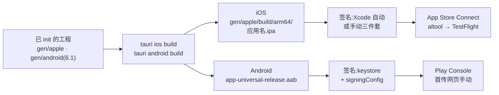

import { Canvas, Controls, Meta } from '@storybook/addon-docs/blocks';
import * as MobileRelease from './mobile-release.stories';

<Meta of={MobileRelease} name="Docs" />

# 移动端发布

桌面阶段的 `tauri build` 一条命令直出可分发安装包;移动端把这件事拆成三段:`tauri ios build` / `tauri android build` 负责把工程构建成平台发布物(.ipa 与 .aab / .apk),签名凭据由你提前备好、在构建时生效,最后的商店提交在 App Store Connect 与 Play Console 各自完成——**Tauri 的职责到「产出发布物」为止**。本课沿这条流水线回答四个问题:build 命令产出什么、两个平台各要准备什么签名凭据、版本号怎么涨、提交前要备齐什么。读法与实例:下方的流水线检查台把「平台 × 凭据 → build → 签名 → 商店提交」做成可勾选的模拟,勾掉任何一项凭据,流水线会直接显示在哪一步被拦、产物缺了什么。边界:环境与 init / dev 归[移动端起步](?path=/docs/mobile-setup--docs),平台工程文件与权限声明归[移动端差异](?path=/docs/mobile-adaptation--docs),macOS / Windows 的桌面签名归[代码签名](?path=/docs/code-signing--docs);商店控制台内部的表单与审核材料只给入口,不展开成控制台使用教程。



两个平台从构建到提交的总览(最常回查的一张表):

| | iOS | Android |
| --- | --- | --- |
| 构建命令 | `npm run tauri ios build` | `npm run tauri android build` |
| 发布物 | `.ipa`,在 `src-tauri/gen/apple/build/arm64/` | `.aab`(商店)与 `.apk`(测试),在 `src-tauri/gen/android/app/build/outputs/` |
| 签名材料 | Apple Developer 计划 + Xcode 账号(自动);CI 走证书 / profile 环境变量 | 自管 keystore:`keystore.properties` + `build.gradle.kts` 的 `signingConfig` |
| 版本来源 | `tauri.conf.json` 的 `version` → `CFBundleVersion` | 同一 `version` → `versionCode`(位权公式) |
| 提交入口 | `xcrun altool` 上传 → TestFlight | Play Console 网页首传 |
| 硬性前提 | Apple Developer 计划(99 美元/年),构建仅限 macOS | Play Console 开发者账号 |

## 快速上手

前提:[移动端起步](?path=/docs/mobile-setup--docs)一课的环境已就绪(`gen/` 平台工程已生成)。iOS 额外要求已加入 Apple Developer 计划,并在 Xcode > Settings > Accounts 登录账号(自动签名)。

1. iOS:构建并导出 App Store 包,产物是 ipa:

```bash
npm run tauri ios build -- --export-method app-store-connect
# 产物:src-tauri/gen/apple/build/arm64/<app-name>.ipa
```

2. iOS:上传 App Store Connect(API key 凭据见「iOS 签名」一节),通过 Apple 校验后进入 TestFlight:

```bash
xcrun altool --upload-app --type ios \
  --file "src-tauri/gen/apple/build/arm64/<app-name>.ipa" \
  --apiKey $APPLE_API_KEY_ID --apiIssuer $APPLE_API_ISSUER
```

3. Android:生成上传密钥(keytool 随 Android Studio 的 JDK 附带),接好签名配置(见「Android 签名」一节),然后构建 AAB:

```bash
keytool -genkey -v -keystore ~/upload-keystore.jks -keyalg RSA -keysize 2048 -validity 10000 -alias upload

npm run tauri android build -- --aab
# 产物:src-tauri/gen/android/app/build/outputs/bundle/universalRelease/app-universal-release.aab
```

4. Android:首次上传必须在 Play Console 网页手动完成——Google 借这一步核验应用签名与包名。

Storybook 内的实例是定性模拟,不运行 Xcode / Gradle;真实构建、签名与版本号的本机核对步骤见课程目录的 `mobile-release-verification.md`。

## 构建流水线

移动 build = 前端构建(`beforeBuildCommand`)→ Rust 交叉编译(6.1 装的 targets)→ 平台工程构建(Xcode Archive / Gradle release)→ 按导出方式产出发布物。与桌面 `tauri build` 的分工差异:桌面直出安装包;移动端产出的发布物必须过签名这道门,而签名材料不归 Tauri 管——两个平台对「缺签名材料」的反应截然相反,见后文两节。

常用参数(完整清单见 CLI 参考):

| 参数 | iOS | Android |
| --- | --- | --- |
| 架构 `--target` | 默认 `aarch64`;可选 `aarch64-sim`、`x86_64` | 默认全部 4 个:`aarch64`、`armv7`、`i686`、`x86_64` |
| 调试包 `--debug` | 支持 | 支持 |
| 交给原生 IDE `--open` | 打开 Xcode,Archive / Distribute 改在 IDE 里做 | 打开 Android Studio |
| 包格式 | `--export-method` 决定导出方式 | `--apk` / `--aab` / `--split-per-abi` |
| 版本附加 | `--build-number <n>` 追加构建号 | 用 `bundle > android > versionCode` 覆盖(见「版本号」)|

### iOS:export-method 与 ipa

`--export-method` 决定 Xcode 导出这份 archive 的方式,按渠道选:

| 取值 | 用途 |
| --- | --- |
| `app-store-connect` | 上架 App Store 或 TestFlight,商店渠道专用 |
| `release-testing` | ad hoc 分发到注册过的测试设备 |
| `debugging` | 本机调试 |

商店渠道必须 `app-store-connect`,产物固定落在 `src-tauri/gen/apple/build/arm64/<app-name>.ipa`。同一版本多次上传时用 `--build-number <n>` 换新构建号(商店要求 build 号唯一,见「版本号」)。不想用 CLI 时加 `--open` 打开 Xcode,由 Organizer 完成 Archive 与 Distribute——此后签名与上传交给 Xcode,Tauri 不再介入。

### Android:AAB 与 APK

商店渠道用 AAB(`--aab`,Play 官方推荐格式);APK(`--apk`)用于测试与商店外分发。默认一次构建全部 4 个架构,产物叫 universal;`--split-per-abi` 按架构拆出更小的包,但 Play 会自行处理架构,拆包只对测试或商店外分发有意义。AAB 产物固定在 `src-tauri/gen/android/app/build/outputs/bundle/universalRelease/app-universal-release.aab`。

### 实例:发布流水线检查台

下方实例把两个平台的发布流水线摆在一起:左栏按平台列出签名与提交凭据,右栏是 build → 签名 → 商店提交的流水线。勾掉任何一项,流水线直接显示哪一步被拦、产物少了什么;读数同步给出目标产物、签名路线、提交通道与缺失清单。

<Canvas of={MobileRelease.Interactive} />
<Controls of={MobileRelease.Interactive} />

| 读者操作 | 可观察证据 |
| --- | --- |
| iOS 勾齐 4 项 | 全绿流水线:自动签名 → ipa → altool 上传进 TestFlight |
| iOS 只去掉「App Store Connect API key」 | 构建签名照常、ipa 正常导出,上传环节变跳过:可改走 Xcode Organizer 手动上传 |
| iOS 去掉「Apple Developer 计划」 | 签名环节直接中断,Distribution 证书与 profile 无从谈起,后续全部未执行 |
| 平台切到 Android,只勾 3 项签名材料 | Gradle 照常出「未签名」AAB,上传环节中断 |
| 打开 Show code | 看到该 Canvas 实际执行的 `example.ts` |

检查台是定性模拟:只对照后文两节的签名配置判断,不运行 Xcode / Gradle,也不校验凭据真伪。

## iOS 签名

iOS 签名围绕三个对象:**证书**(证明发布者身份)、**App ID**(绑定 `tauri.conf.json` 的 `identifier`,必须一致)、**Provisioning Profile**(把证书、App ID 与分发许可系在一起的一份描述文件)。三样的前提是加入 **Apple Developer 计划**——免费账号只能做真机调试,签不出商店包。签名路线两条:

| 路线 | 需要准备 | 适用 |
| --- | --- | --- |
| 自动签名(默认) | Xcode > Settings > Accounts 登录 Apple 账号;Xcode 自动注册 Bundle ID、管理证书与 profile | 本机开发与提交 |
| 手动签名 | Certificates 页创建 Apple Distribution 证书并导入钥匙串;创建 Bundle ID 一致的 App ID;创建 App Store Connect 类型 profile;CI 环境变量三件套:`IOS_CERTIFICATE`(base64 证书)、`IOS_CERTIFICATE_PASSWORD`、`IOS_MOBILE_PROVISION`(base64 profile) | CI / 受控签名 |

CI 上还有一条「自动签名 + API key」路线:配 `APPLE_API_ISSUER`(Issuer ID)、`APPLE_API_KEY`(Key ID)、`APPLE_API_KEY_PATH`(.p8 私钥路径,只能下载一次;不设路径时在 `~/private_keys`、`~/.private_keys`、`~/.appstoreconnect/private_keys` 等目录找 `AuthKey_<KeyID>.p8`)。这套 App Store Connect API key 与桌面公证用的是同一套(见[代码签名](?path=/docs/code-signing--docs))。

关键边界:**iOS 签名发生在构建之内**——签名由 Xcode Archive 过程执行,证书过期、profile 不匹配、`identifier` 对不上都会让 `tauri ios build` 在签名 / 导出环节直接失败,不会产出「未签名的 ipa」。

## Android 签名

Android 的发布者身份完全自管:一个 keystore 文件就是身份本身,上传商店与后续更新都要用同一把钥匙签名。Gradle **不会**替 release 构建签名——不接 `signingConfig`,构建照样成功,产物是未签名包,上传商店必被拒。三步接好:

1. 生成 keystore(命令见快速上手);
2. 在 `src-tauri/gen/android/keystore.properties` 写入密钥信息(私密文件,不入版本库):

```properties
password=<keytool 时设置的密码>
keyAlias=upload
storeFile=/Users/you/upload-keystore.jks
```

3. 给 `src-tauri/gen/android/app/build.gradle.kts` 接上 `signingConfigs` 并挂到 release(工程里有多处 build.gradle.kts,认准带 `buildTypes` 块、位于 `app/` 目录的这份):

```kotlin
import java.io.FileInputStream
import java.util.Properties

signingConfigs {
    create("release") {
        val keystorePropertiesFile = rootProject.file("keystore.properties")
        val keystoreProperties = Properties()
        if (keystorePropertiesFile.exists()) {
            keystoreProperties.load(FileInputStream(keystorePropertiesFile))
        }
        keyAlias = keystoreProperties["keyAlias"] as String
        keyPassword = keystoreProperties["password"] as String
        storeFile = file(keystoreProperties["storeFile"] as String)
        storePassword = keystoreProperties["password"] as String
    }
}

buildTypes {
    getByName("release") {
        signingConfig = signingConfigs.getByName("release")
    }
}
```

之后 `tauri android build` 的 release 构建自动签名。CI 里把 keystore 转 base64 存进 secrets,构建前还原 .jks 并生成 `keystore.properties`(写法见参考资料官方文档)。

关键边界(与 iOS 相反):**Android 签名发生在构建之外**——签名配置缺失不拦构建,只产出上不了架的未签名包。排查方向因此不同:Android 出包后先验签名再谈上传;iOS 构建失败先查证书与 profile。

## 版本号

两个平台的版本都从 `tauri.conf.json` 的 `version` 派生,一处改、两端生效:

| 平台 | 派生规则 | 覆盖入口 |
| --- | --- | --- |
| iOS | `version` → `CFBundleVersion` | `bundle > iOS > bundleVersion`;构建期 `--build-number <n>` 追加构建号 |
| Android | `version` → `versionCode = major*1000000 + minor*1000 + patch` | `bundle > android > versionCode` |

商店的硬规则是**只涨不跌**:App Store Connect 要求同一 `version` 的每次上传 build 号不同(`--build-number` 解决),Google Play 要求新包 `versionCode` 严格大于线上已有值。发版流程因此固定成:改 `tauri.conf.json` 的 `version` → build → 提交;不要直接改平台工程里的版本,重新生成或同步后就会丢。

顺带:`bundle > android > minSdkVersion` 控制最低支持的 Android 版本,默认 SDK 24(Android 7.0),可按用户面需求调高。

## 商店提交

构建与签名只是备好材料;提交在两个商店控制台完成,Tauri 不代办。共同点:应用要先在控制台注册(包名即 `identifier`),准备图标(`tauri icon` 生成)与商店材料(截图、描述、隐私声明),然后走审核。控制台内部的表单与审核流程以官方控制台文档为准,不展开。

### App Store Connect 与 TestFlight

上传用 `xcrun altool`,凭据是 App Store Connect API key(在 App Store Connect 的 Integrations 页创建 Individual key:Issuer ID 填 `APPLE_API_ISSUER`,Key ID 填 `APPLE_API_KEY_ID`,.p8 私钥放进默认搜索目录):

```bash
xcrun altool --upload-app --type ios \
  --file "src-tauri/gen/apple/build/arm64/<app-name>.ipa" \
  --apiKey $APPLE_API_KEY_ID --apiIssuer $APPLE_API_ISSUER
```

Apple 校验通过后,构建出现在 **TestFlight**:内部测试走它,稳定后再提交商店审核。

### Google Play

Play Console 注册应用后,**首次上传必须在网页手动完成**——Google 在这一步核验应用签名与包名,自动化接口(Developer API)官方标注仍在完善中。上传 AAB 时启用 **Play App Signing**(Google 为商店分发提供的签名机制):upload keystore 由你保管、用于本地签名,商店侧密钥由 Google 托管——upload keystore 丢失时仍可申请重置,不至于断送更新能力。先用内部 / 封闭测试轨道验证,再全量发布。

## 最佳实践

- **keystore 当身份管理。** .jks 与 `keystore.properties` 永不入库,密钥备份进密码管理器;启用 Play App Signing,把「丢钥匙断更新」的风险交给托管机制兜底。
- **凭据全部进 CI secrets。** iOS 的 API key 三件套、Android 的 base64 keystore,构建前还原;本地与 CI 走同一套配置入口,少一套「本地能签 CI 不能签」的分支。
- **版本发布固定成一条流水。** 改 `version` → build → TestFlight / 内部轨道验证 → 正式提交;同版本重传用 `--build-number`,不手改平台工程。
- **先测试轨道后全量。** iOS 用 TestFlight,Android 用内部 / 封闭测试轨道;审核被打回的成本远高于多测一轮。
- **构建失败先进原生 IDE。** `--open` 把 Archive / Gradle 的完整报错交回 Xcode / Android Studio(6.1 的老规矩,发布阶段同样适用)。

## 常见问题

- `tauri ios build` 在签名或导出环节报错(找不到 signing certificate、profile 不匹配)
  iOS 签名失败会直接中断构建。依次核对:已加入付费 Apple Developer 计划;Xcode 已登录账号(或手动三件套环境变量齐全);App ID 的 Bundle ID 与 `identifier` 一致;profile 类型与导出方式匹配(商店包要 App Store Connect 类型 profile)。
- Android 构建成功,但产物是 unsigned,上传被拒
  `signingConfig` 没生效:确认改的是 `gen/android/app/build.gradle.kts`(工程里有多份 build.gradle.kts,认准带 `buildTypes` 的那份);`keystore.properties` 在 `gen/android/` 下且 `storeFile` 指向真实 .jks;`buildTypes.release` 已挂 `signingConfig`。
- `xcrun altool` 上传报认证失败
  API key 三件套不齐,或 .p8 不在默认搜索位置(`~/private_keys`、`~/.private_keys`、`~/.appstoreconnect/private_keys`、项目 `private_keys`);.p8 只能下载一次,丢失要重建 key。
- Play Console 提示 versionCode 已存在,App Store 提示 build 号重复
  商店要求版本只涨不跌:涨 `tauri.conf.json` 的 `version` 重新构建;同一版本重传时 iOS 用 `--build-number <n>` 换新构建号。
- upload keystore 丢了,应用还能更新吗
  未启用 Play App Signing 时不能——新包必须与线上一把钥匙签名,丢了就推不了更新;启用后可向 Google 申请重置 upload key。iOS 没有这个问题:Distribution 证书可吊销重建,profile 重新生成,商店身份绑定在 App ID 与开发者账号上,不在单张证书上。
- 免费 Apple 账号能发布 iOS 应用吗
  不能。免费账号只够真机调试(development 签名);商店导出、TestFlight 与上传都要付费的 Apple Developer 计划(99 美元/年)。

## 总结回顾

摘要:

移动端发布把桌面的一条 `tauri build` 拆成「构建 → 签名 → 提交」三段。构建由 `tauri ios build` / `tauri android build` 完成:前端构建、Rust 交叉编译、平台工程构建,iOS 用 `--export-method app-store-connect` 出商店 ipa,Android 用 `--aab` 出 Play 推荐的 AAB。签名材料各平台自备:iOS 围绕证书、App ID(`identifier` 必须一致)、Provisioning Profile 三个对象,本机走 Xcode 自动签名,CI 走手动三件套或 App Store Connect API key,签名失败会直接中断构建;Android 的身份是一把自管 keystore,`keystore.properties` + `signingConfig` 接好后 release 构建自动签名,缺配置只产出上不了架的未签名包。版本从 `tauri.conf.json` 的 `version` 派生(iOS `CFBundleVersion`,Android `versionCode` 位权公式),商店规则只涨不跌。提交在商店控制台完成:`altool` 上传 App Store Connect 进 TestFlight;Play Console 首传网页手动,并启用 Play App Signing 托管商店侧密钥。

一句话:

> iOS 签名是构建的前置,失败即中断;Android 签名是构建的后置,缺了出未签名包——而无论哪个平台,商店提交都发生在控制台,Tauri 不代办。

知识要点:

- `tauri ios build` 与 `tauri android build` 各产出什么文件、落在哪个路径?
- `--export-method` 的三个取值分别用于什么渠道?商店渠道必须用哪个?
- iOS 自动签名与手动签名各需要准备什么?CI 上有哪两条凭据路线?
- Android 的发布签名分哪三步接好?缺一步时产物是什么状态?
- 两个平台的版本号如何从 `tauri.conf.json` 派生、如何覆盖?商店对版本号有什么硬规则?
- iOS 与 Android 在「签名材料缺失」时的行为差异是什么?各怎么排查?
- 首次上传 Google Play 为什么必须手动?Play App Signing 解决什么问题?

## 参考资料

- [Distributing Your App - Tauri 官方文档](https://tauri.app/distribute/)
  构建、打包、签名、分发的总览;`build` / `android build` / `ios build` 的角色分工与各平台子页面入口。
- [App Store - Tauri 官方文档](https://tauri.app/distribute/app-store/)
  `ios build --export-method app-store-connect`、ipa 产物路径、`CFBundleVersion` 与 `bundleVersion` 覆盖、`xcrun altool` 上传命令与 App Store Connect API key 配置的来源。
- [Google Play - Tauri 官方文档](https://tauri.app/distribute/google-play/)
  `--aab` / `--apk` / `--split-per-abi` 与默认 4 架构、AAB 产物路径、versionCode 位权公式与 `versionCode` / `minSdkVersion` 覆盖、Play Console 首传手动的来源。
- [iOS Code Signing - Tauri 官方文档](https://tauri.app/distribute/sign/ios/)
  Apple Developer 计划要求、Xcode 自动签名、`IOS_CERTIFICATE` / `IOS_CERTIFICATE_PASSWORD` / `IOS_MOBILE_PROVISION` 手动路线、CI 自动签名 API key 环境变量的来源。
- [Android Code Signing - Tauri 官方文档](https://tauri.app/distribute/sign/android/)
  keytool 生成 keystore、`keystore.properties` 内容、`app/build.gradle.kts` 的 signingConfigs 接线与 CI secrets 写法的来源。
- [Tauri CLI 参考 - Tauri 官方文档](https://tauri.app/reference/cli/)
  `ios build` / `android build` 全部选项(`--export-method`、`--target`、`--apk` / `--aab`、`--split-per-abi`、`--build-number`、`--open`、`--debug`)的来源。
