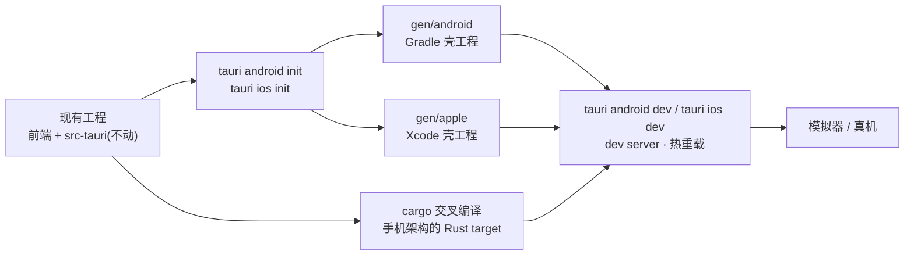

import { Canvas, Controls, Meta } from '@storybook/addon-docs/blocks';
import * as MobileSetup from './mobile-setup.stories';

<Meta of={MobileSetup} name="Docs" />

# 移动端起步

桌面课跑通的 Notes 工程不用改一行代码,就能长出 iOS 与 Android 目标:Tauri 的移动端就是「目标平台工具链 + 一条 init 命令生成的原生壳工程 + 对应的 dev 命令」三件事。`src-tauri` 与前端代码完全复用;`tauri android init` / `tauri ios init` 在工程根目录生成 `gen/android`(Gradle 工程)与 `gen/apple`(Xcode 工程)两份原生壳,负责装载 WebView;`tauri android dev` / `tauri ios dev` 把桌面 `tauri dev` 的体验(dev server、热重载)搬到模拟器与真机上。本课核心直觉:**移动端 = 交叉编译**——桌面直接编译本机 Rust target,移动端要为手机芯片交叉编译,环境清单里的 rustup targets、NDK、SDK 都由此而来。



最常回查的一张表——两个平台从环境到运行的总览(iOS 仅限 macOS;Android 工具链三平台都可装):

| 步骤 | iOS | Android |
| --- | --- | --- |
| 宿主系统 | 仅 macOS | macOS / Windows / Linux |
| 工具链 | 完整 Xcode、Cocoapods | Android Studio + SDK 组件与 NDK |
| 环境变量 | 无需额外配置 | `JAVA_HOME`、`ANDROID_HOME`、`NDK_HOME` |
| Rust targets | `aarch64-apple-ios`、`x86_64-apple-ios`、`aarch64-apple-ios-sim` | `aarch64-linux-android`、`armv7-linux-androideabi`、`i686-linux-android`、`x86_64-linux-android` |
| 初始化 | `tauri ios init` → `gen/apple` | `tauri android init` → `gen/android` |
| 开发运行 | `tauri ios dev` | `tauri android dev` |
| 原生 IDE | `--open` → Xcode | `--open` → Android Studio |

## 快速上手

前提:沿用[第一个应用](?path=/docs/first-app--docs)生成的 React 工程,本机 macOS(Apple Silicon)。以 iOS 为例,三步从桌面工程到模拟器:

```bash
# 1. 添加 iOS 交叉编译的 Rust targets(3 个)
rustup target add aarch64-apple-ios x86_64-apple-ios aarch64-apple-ios-sim

# 2. 初始化 iOS 目标:在工程根目录生成 gen/apple 壳工程
npm run tauri ios init

# 3. 开发运行:列出模拟器供选择,部署后支持热重载
npm run tauri ios dev
```

首次 `ios dev` 会编译全部 Rust 依赖并启动模拟器,耗时以分钟计,属正常现象;之后改前端代码立即热重载。Android 是同构流程:先把「环境要求」一节的三个环境变量配好,再按同样的 init → dev 顺序执行。

Storybook 内的实例是模拟,不运行 Xcode / Gradle;真实 init / dev 的预期输出与本机核对步骤见课程目录的 `mobile-setup-verification.md`。

## 环境要求

两套清单服务的都是「交叉编译」这一件事:rustup targets 让 cargo 能为手机芯片编译 Rust;Xcode 与 Android Studio 提供各自原生壳工程的构建、部署与模拟器;Cocoapods 与 NDK / SDK 是壳工程的原生依赖。桌面阶段没装完整 Xcode(见[安装](?path=/docs/installation--docs)一课的说明),进入本课就该补上了。

### iOS

iOS 开发只能在 macOS 上进行,且要求**完整版 Xcode**——只装 Command Line Tools 够桌面开发,不够 iOS:

| 要求 | 说明 |
| --- | --- |
| Xcode(完整版) | App Store 安装,首次启动完成组件设置;`xcodebuild` 与 iOS 模拟器随附 |
| Cocoapods | `brew install cocoapods`;`gen/apple` 壳工程用它管理原生依赖 |
| Rust targets | `rustup target add aarch64-apple-ios x86_64-apple-ios aarch64-apple-ios-sim` |

iOS 不需要额外环境变量,模拟器随 Xcode 附带。

### Android

| 要求 | 说明 |
| --- | --- |
| Android Studio | 官网安装;自带 JDK(JBR),模拟器经 Device Manager 创建 |
| SDK 组件 | 在 SDK Manager 勾选:Android SDK Platform、Platform-Tools、NDK (Side by side)、SDK Build-Tools、Command-line Tools |
| 环境变量 | `JAVA_HOME` 指向 Studio 自带 JDK;`ANDROID_HOME` 指向 SDK;`NDK_HOME` 指向 `$ANDROID_HOME/ndk/<版本>` |
| Rust targets | `rustup target add aarch64-linux-android armv7-linux-androideabi i686-linux-android x86_64-linux-android` |

macOS 的三个环境变量(写入 `~/.zshrc` 后 `source` 生效,路径以本机安装位置为准):

```bash
export JAVA_HOME="/Applications/Android Studio.app/Contents/jbr/Contents/Home"
export ANDROID_HOME="$HOME/Library/Android/sdk"
export NDK_HOME="$ANDROID_HOME/ndk/$(ls -1 $ANDROID_HOME/ndk)"
```

下方的起步检查台把环境判断放在一起:选择目标平台、勾选本机已装项,左栏给出缺失清单与修复命令,右栏预演 init 与 dev 流水线在哪一步被阻断。

<Canvas of={MobileSetup.Interactive} />
<Controls of={MobileSetup.Interactive} />

| 读者操作 | 可观察证据 |
| --- | --- |
| 平台在 iOS / Android 间切换 | 检查清单整体切换:iOS 3 项、Android 5 项 |
| 取消勾选已装项 | 该项标红并给出修复命令,右栏流水线对应步骤标红阻断 |
| 把当前平台勾齐 | 流水线全绿,读数给出下一步命令 |
| 打开 Show code | 看到该 Canvas 实际执行的 `example.ts` |

检查台是定性模拟:它只对照上面的清单判断,不探测本机真实安装状态;真实环境以 `tauri ios init` / `tauri android init` 能否走通为准。

## 初始化目标平台

`tauri android init` 与 `tauri ios init` 做同一件事:在工程根目录生成目标平台的**原生壳工程**——`gen/apple` 是 Xcode 工程(App 的 Info.plist、启动屏、图标载体),`gen/android` 是 Gradle 工程(AndroidManifest、Activity)。壳工程只负责装载 WebView 与对接系统;Rust 核心仍由 `src-tauri` 交叉编译后链入壳工程,桌面课配置的 `identifier`、窗口等继续生效。每个平台 init 一次即可,`gen/` 与 `src-tauri/` 平级;壳工程是生成产物而非手写代码,推倒重来时删除对应目录重新 init。

| 命令 | 生成内容 | 可用平台 |
| --- | --- | --- |
| `npm run tauri ios init` | `gen/apple` Xcode 工程,并安装 Pods 依赖 | 仅 macOS |
| `npm run tauri android init` | `gen/android` Gradle 工程 | macOS / Windows / Linux |

init 默认会检查并安装对应平台的 Rust targets(`--skip-targets-install` 可跳过)——所以 targets 缺失通常在这一步暴露,而不是等到 dev。注意 iOS 的两条命令都只在 macOS 上可用;Android 在三平台都可用,但模拟器与真机调试体验以 macOS / 真机为准。

## 模拟器与真机运行

`tauri android dev` / `tauri ios dev` 是桌面 `tauri dev` 的移动版:执行 `beforeDevCommand` 启动前端 dev server、交叉编译 Rust、把应用部署到模拟器或真机并保持热重载。常用参数见下表(官方文档的写法是直接跟在命令后,如 `npm run tauri ios dev --open`)。

| 场景 | 命令与行为 |
| --- | --- |
| 默认 | 优先用已连接的真机;没有则列出可用模拟器提示选择 |
| 指定设备 | `npm run tauri ios dev 'iPhone 15'`(设备名作位置参数,Android 同理) |
| 打开原生 IDE | `--open`:不直接部署,启动 Xcode / Android Studio;Tauri CLI 进程必须保持运行 |
| iOS 真机 | dev server 监听 `TAURI_DEV_HOST` 指向的地址;必要时配合 `--host` 与 `--force-ip-prompt` |

几个要点:

- **模拟器是零配置起点。** iOS 模拟器随 Xcode 附带;Android 在 Device Manager 里创建 AVD。模拟器与真机的 dev 流程相同,真机只是各多一次性设置(见下)。
- **iOS 真机多一层网络配置。** dev server 默认监听本机地址,真机要连它就得监听对外地址——官方模板的做法是 Vite 配置读取 `TAURI_DEV_HOST` 设置 `server.host`,create-tauri-app 生成的工程已内置这段,自建前端要照抄。连不上时用 `--force-ip-prompt` 手动选地址;首次 `tauri ios dev` 会弹「本地网络」权限,允许后重启一次 dev。
- **调试入口分平台。** iOS 用 Safari「开发」菜单连接检查器(真机先在 设置 > Safari > 高级 打开 Web Inspector);Android 用 `chrome://inspect`(模拟器默认开启,真机需开启开发者模式与 USB 调试)。WebView 调试的完整做法见[调试与日志](?path=/docs/debugging--docs)一课。

边界提醒:生命周期、平台权限声明与插件的移动端支持差异见[移动端差异](?path=/docs/mobile-adaptation--docs)一课;打包签名与商店发布见[移动端发布](?path=/docs/mobile-release--docs)一课——本课只负责让应用在移动设备上跑起来。

## 最佳实践

- **环境变量写进 shell 配置并逐个验证。** Android 的 `JAVA_HOME`、`ANDROID_HOME`、`NDK_HOME` 写入 `~/.zshrc`,新开终端 `echo $NDK_HOME` 确认非空再 init——这是 Android 环境问题的高发源。
- **先模拟器后真机。** 模拟器零配置、反馈快;真机调试要处理签名、网络与权限,留到功能基本可用后再接。
- **构建期报错用 `--open` 进原生 IDE 看。** Xcode 与 Android Studio 对构建失败的报错远比命令行完整,`--open` 让 CLI 保持运行、IDE 接管部署。
- **桌面先行再上移动端。** 前端与命令逻辑先在 `tauri dev` 验证通过,再进移动端排查交叉编译与壳工程问题,把变量分开。
- **两个平台一次配齐。** targets、`gen/` 两平台互不干扰,配齐后同一份代码可随时在任意目标上 dev,不必临时补环境。

## 常见问题

- `tauri ios dev` 报需要 Xcode 或 `xcodebuild` 不可用
  只装了 Command Line Tools。从 App Store 安装完整 Xcode,首次启动完成组件安装,再用 `sudo xcode-select -s /Applications/Xcode.app/Contents/Developer` 切换默认工具链。
- `tauri android dev` 在 Gradle 阶段报 SDK / NDK 找不到或版本问题
  依次核对:三个环境变量非空且指向真实目录(`echo` 逐个确认);SDK Manager 里 NDK (Side by side) 已勾选;`NDK_HOME` 指向 `$ANDROID_HOME/ndk/<版本>` 目录本身。环境变量改过后要重开终端。
- Xcode 构建阶段报找不到 node
  Xcode 的 build script 不读取 shell 配置,nvm 等版本管理器的 PATH 修改不生效。把 node 链接到固定路径(如 `sudo ln -s "$(which node)" /usr/local/bin/node`)或临时切用系统安装的 node,再重跑 dev。
- iOS 真机启动后白屏或连不上 dev server
  dev server 没有监听真机可达的地址:确认前端配置读取了 `TAURI_DEV_HOST`,必要时 `tauri ios dev --force-ip-prompt` 手动选 IP;再检查真机的「本地网络」权限是否允许、与 Mac 是否同一网络。
- Rust 依赖在移动端编译时报 `openssl-sys` 失败
  依赖链问题而非 Tauri 本身:某个依赖在用 OpenSSL 原生库。优先改用 rustls 后端的等价依赖;或给 `openssl` 加 `vendored` feature 随源码编译;macOS 本机也要 `brew install openssl@3` 供原生链接场景使用。

## 总结回顾

摘要:

移动端起步不新增工程,只新增目标:工具链层面,iOS 要求完整 Xcode 与 Cocoapods,Android 要求 Android Studio、SDK 组件与 NDK,并配好 `JAVA_HOME`、`ANDROID_HOME`、`NDK_HOME`;Rust 侧各自 `rustup target add` 一组手机架构 target(iOS 3 个、Android 4 个)。`tauri android init` / `tauri ios init` 在根目录生成 `gen/android` 与 `gen/apple` 原生壳工程,`src-tauri` 与前端不动;init 默认顺带安装 targets。`tauri android dev` / `tauri ios dev` 把桌面的 dev server 与热重载搬到模拟器与真机:默认真机优先、可指定设备名,`--open` 交由 Xcode / Android Studio 部署,iOS 真机靠 `TAURI_DEV_HOST` 打通网络,调试分别走 Safari 开发菜单与 `chrome://inspect`。环境缺失的定位路径固定:读报错或检查台读数 → 找到缺失项 → 执行对应修复命令。

一句话:

> 移动端起步三件事:平台工具链装齐、一次 init 生成原生壳工程、`tauri [android|ios] dev` 搬运桌面开发体验——工程代码本身一行不改。

知识要点:

- iOS 与 Android 各需要哪些工具链、环境变量与 Rust targets?哪些只在 macOS 可用?
- `tauri android init` / `tauri ios init` 生成什么、放在哪?`src-tauri` 动不动?targets 缺失在哪一步暴露?
- `tauri android dev` / `tauri ios dev` 与桌面 `tauri dev` 的行为异同是什么?
- 设备怎么选?`--open`、`TAURI_DEV_HOST`、`--force-ip-prompt` 各用于什么场景?
- 环境缺失时按什么顺序定位缺失项与修复命令?

## 参考资料

- [Prerequisites - Tauri 官方文档](https://tauri.app/start/prerequisites/)
  iOS / Android 环境要求、Rust targets 清单、`JAVA_HOME` / `ANDROID_HOME` / `NDK_HOME` 配置示例的来源。
- [Develop - Tauri 官方文档](https://tauri.app/develop/)
  `tauri android dev` / `tauri ios dev` 行为、`TAURI_DEV_HOST` 与 Vite 配置、设备选择、`--open`、Web Inspector、iOS 本地网络权限与 Xcode 构建脚本 PATH 问题的来源。
- [CLI 参考 - Tauri 官方文档](https://tauri.app/reference/cli/)
  `tauri android` / `tauri ios` 子命令(init / dev)与 `--open`、`--host`、`--force-ip-prompt`、`--skip-targets-install` 选项的来源。
