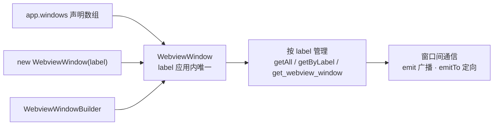

import { Canvas, Controls, Meta } from '@storybook/addon-docs/blocks';
import * as MultiWindow from './multi-window.stories';

<Meta of={MultiWindow} name="Docs" />

# 多窗口

Tauri 的多窗口没有引入新对象:每个窗口都是 `WebviewWindow`,以 **label** 为唯一身份。围绕这一个概念,本课回答三个问题——窗口从哪来(声明式配置与运行时构建器两个入口,产出没有区别)、怎么管理(查找、聚焦、关闭都按 label 索引)、窗口之间怎么通信(事件系统加一个 target 维度:`emit` 广播、`emitTo` 按 label 定向)。读完开场图和参考表,你应该能预测:再往 `app.windows` 数组里加一项,启动就会多出一个窗口;给新窗口发消息,只有 target 匹配的监听者会收到。



关键输入与默认值:

| 项 | 默认值 / 规则 |
| --- | --- |
| `app.windows` | `[]`;启动时逐项创建窗口 |
| `label` | 省略时为 `main`;应用内必须唯一;仅允许字母数字与 `- / : _` |
| 事件名 | 仅允许字母数字与 `- / : _` |
| 前端运行时创建 | 需要权限 `core:webview:allow-create-webview-window`(`core:default` 不含) |
| `listen` 默认投递范围 | `{ kind: 'Any' }`,收所有投递 |

## 快速上手

前提:已有[第一个应用](?path=/docs/first-app--docs)生成的工程。模板主窗口没写 `label`,即默认的 `main`。

1. 在 `src-tauri/tauri.conf.json` 的 `app.windows` 数组里加第二个窗口:

```json
"windows": [
  { "title": "tauri-app", "width": 800, "height": 600 },
  { "label": "settings", "title": "设置", "width": 480, "height": 380 }
]
```

2. 在 `src-tauri/capabilities/default.json` 把新窗口纳入授权——capability 的 `windows` 列表决定哪些窗口拿到权限,不在列表里的窗口没有任何权限:

```json
"windows": ["main", "settings"]
```

3. 运行 `npm run tauri dev`:两个窗口同时出现。在主窗口的前端代码里(如某个按钮回调)发一条定向消息:

```ts
import { emitTo } from '@tauri-apps/api/event';

await emitTo('settings', 'ping', { from: 'main' });
```

在 `settings` 窗口的代码里 `listen('ping', ...)` 后就能看到打印:定向消息只有它收到;把 `emitTo` 换成 `emit`,所有窗口都收到。运行时创建窗口的写法见下文。

## 创建窗口

两个入口产出同一种对象:声明式配置在启动时创建,运行时构建器在应用运行中创建。判断用哪个很简单——窗口在应用一启动就该存在(主窗口、常驻面板),用声明式;由用户操作触发(详情页、弹出的编辑器),用运行时。运行时创建最常见的失败原因是 **label 冲突**:同一 label 不能创建两个窗口。创建、关闭、投递三步的完整交互演示在下文「窗口间通信」一节的 Canvas 里。

### 声明式:app.windows

`app.windows` 数组里每一项在启动时创建一个窗口,只是创建时机在应用初始化:

```json
"app": {
  "windows": [
    { "label": "main", "title": "便签", "width": 900, "height": 620 },
    { "label": "settings", "title": "设置", "width": 480, "height": 380 }
  ]
}
```

想保留窗口定义、把创建时机交给 Rust(比如启动时按条件决定建不建):条目加 `"create": false`,再用 Rust 的 `WebviewWindowBuilder::from_config(&app, &config)` 取出这个 `WindowConfig` 构建。窗口的尺寸、装饰、透明等属性控制不在本课展开,见[窗口](?path=/docs/window--docs)一课。

### 运行时:前端 WebviewWindow

前端用 `@tauri-apps/api/webviewWindow` 的 `WebviewWindow` 构造函数,第一个参数就是 label。构造函数立即返回,**创建在后台异步进行**,结果通过 `tauri://created` / `tauri://error` 两个生命周期事件通知:

```ts
import { WebviewWindow } from '@tauri-apps/api/webviewWindow';

function openSettings() {
  const settings = new WebviewWindow('settings', {
    url: '/settings', // 应用内路径,按前端路由或静态文件解析
    title: '设置',
  });
  settings.once('tauri://created', () => {
    // 创建成功,之后才能拿到真实窗口句柄
  });
  settings.once('tauri://error', (e) => {
    // label 已存在、权限缺失都会走到这里
    console.error(e);
  });
}
```

前置条件:capability 的 `permissions` 含 `core:webview:allow-create-webview-window`(`core:default` 不含),新窗口的 label 也要加进 capability 的 `windows` 列表,缺一不可(排查见常见问题)。

### 运行时:Rust WebviewWindowBuilder

Rust 侧用 `WebviewWindowBuilder::new(manager, label, url)` 构建,`build()` 返回 `Result<WebviewWindow>`。典型位置是异步命令:

```rust
#[tauri::command]
async fn open_settings(app: tauri::AppHandle) -> Result<(), String> {
    if app.get_webview_window("settings").is_some() {
        return Ok(()); // 已存在,不重复创建
    }
    tauri::WebviewWindowBuilder::new(
        &app,
        "settings",
        tauri::WebviewUrl::App("index.html".into()),
    )
    .title("设置")
    .build()
    .map_err(|e| e.to_string())
}
```

贴着这个 API 的坑:Windows 上在同步 command 或事件处理器里创建窗口会死锁,命令要声明成 `async`,或放到独立线程执行。`WebviewUrl::App` 的路径相对应用资源解析,加载外部网址用 `WebviewUrl::External`。

## 管理窗口

管理 API 全部围绕 label:拿到窗口实例后就能调用窗口属性方法(见[窗口](?path=/docs/window--docs)一课);拿不到,说明 label 没对上或窗口已关闭。

| 需求 | 前端(`@tauri-apps/api`) | Rust(`tauri::Manager`) |
| --- | --- | --- |
| 列出全部窗口 | `WebviewWindow.getAll()` → `Promise<WebviewWindow[]>` | `app.webview_windows()` |
| 按 label 取窗口 | `WebviewWindow.getByLabel('settings')` → `Promise<WebviewWindow \| null>` | `app.get_webview_window("settings")` |
| 取当前窗口 | `WebviewWindow.getCurrent()` | command 里声明 `window: WebviewWindow` 参数 |

### 查找与遍历

`getAll()` 适合做窗口列表或全局状态;`getByLabel()` 是防重复创建的钥匙——**先查再建**的单例写法:

```ts
import { WebviewWindow } from '@tauri-apps/api/webviewWindow';

async function openSettings() {
  const existing = await WebviewWindow.getByLabel('settings');
  if (existing) {
    await existing.setFocus(); // 已存在就聚焦,不重复创建
    return;
  }
  new WebviewWindow('settings', { url: '/settings', title: '设置' });
}
```

窗口销毁时,它内部通过实例注册的事件监听器会随之自动移除;组件里用命名空间 `listen` 注册的订阅仍要按[事件](?path=/docs/events--docs)一课的方式在卸载时手动清理。

### 关闭与销毁

- `close()`:走关闭流程,先触发 `closeRequested` 事件,可以弹确认框拦截(比如"有未保存的修改")。
- `destroy()`:跳过确认直接销毁。
- 所有窗口都关闭后,应用默认跟着退出。想让进程常驻(托盘应用),构建 App 后在 `app.run` 回调里拦 `RunEvent::ExitRequested` 调 `api.prevent_exit()`,常驻组合方式见[系统托盘](?path=/docs/system-tray--docs)一课。

## 窗口间通信

窗口间通信复用事件系统:事件名 + payload + 投递范围(target)。`emit` 广播给所有监听者,`emitTo` 只投递给匹配 target 的监听者——直接传 label 字符串最常用。事件本身的语义与 React 订阅清理见[事件](?path=/docs/events--docs)一课,这里只讲多窗口带来的 target 维度。

下面的 Canvas 模拟一个桌面:左半边是窗口(点卡片右上角「×」关闭),右半边是窗口管理器(新建、发送)。先用 Controls 选择发送方式与目标 label,再点「发送消息」,观察哪个窗口的「收到」计数变了。Canvas 是浏览器里的模拟,不运行 Tauri;要在本机用真实窗口核对这些结论,按课程目录 `runtime-verification.md` 的最小步骤操作。

<Canvas of={MultiWindow.Interactive} />
<Controls of={MultiWindow.Interactive} />

| 读者操作 | 可观察证据 |
| --- | --- |
| 点「＋ 新建窗口」 | 桌面多出一张带「运行时」标签的卡片,读数「当前窗口」更新 |
| 点卡片右上角「×」 | 窗口消失,真实应用里对应 `close()` |
| 「发送方式」选 emit,点「发送消息」 | 所有窗口的「收到」计数都加一 |
| 「发送方式」选 emitTo,点「发送消息」 | 只有目标 label 的窗口计数加一 |
| 目标 label 改成不存在的值(如 ghost) | 面板与读数显示投递失败,无人收到 |
| 打开 Show code | 看到该 Canvas 实际执行的 `example.ts`,三个操作各对应哪类 Tauri API |

### emit 与 emitTo:广播与定向

`emit` 无条件投递给所有监听者(所有窗口 + Rust 侧监听者),适合真正全局的状态:主题切换、登录态。`emitTo` 的第一个参数是 target:传字符串即按 label 匹配,也可以传 `EventTarget` 对象精确到类别:

| target 写法 | 匹配范围 |
| --- | --- |
| `'settings'` | label 为 `settings` 的目标(等价 `{ kind: 'AnyLabel', label: 'settings' }`) |
| `{ kind: 'WebviewWindow', label: 'settings' }` | 只匹配 webview 窗口 |
| `{ kind: 'App' }` | 只匹配 Rust 侧 `App::listen` 注册的监听者 |
| `{ kind: 'Any' }` | 所有目标 |

`EventTarget` 的 kind 共六种:`Any`、`AnyLabel`、`App`、`Window`、`Webview`、`WebviewWindow`。常用写法:

```ts
import { emit, emitTo } from '@tauri-apps/api/event';

await emit('theme-changed', { theme: 'dark' });               // 广播:每个窗口都收到
await emitTo('settings', 'theme-changed', { theme: 'dark' }); // 定向:只有 settings 收到
```

### listen:接收端怎么过滤

投递范围由发射端决定,监听端也声明自己关心谁——注册方式决定收什么:

```ts
import { listen } from '@tauri-apps/api/event';
import { getCurrentWebviewWindow } from '@tauri-apps/api/webviewWindow';

// 命名空间 listen:默认 target 为 { kind: 'Any' },收所有投递
const unlistenAll = await listen('theme-changed', handler);

// 限定 label:只收广播与定向到 main 的投递
const unlistenMain = await listen('theme-changed', handler, { target: 'main' });

// 实例 listen:target 固定为本窗口,只收广播与定向到自己 label 的投递
await getCurrentWebviewWindow().listen('theme-changed', handler);
```

组织判断:窗口只处理与自己有关的消息时,用实例 `listen` 或 `{ target }` 过滤,避免每个窗口都跑一遍无关消息的处理器;真正全局的状态才让所有窗口都听。

### Rust 侧组织

Rust 侧用 `Emitter` trait 的三个方法表达同样的投递范围,`emit_to` 传字符串同样按 label 匹配:

```rust
use tauri::{Emitter, EventTarget};

app.emit("theme-changed", payload)?;               // 广播:所有窗口和 Rust 监听者
app.emit_to("settings", "theme-changed", payload)?; // 定向:label 为 settings 的监听者
app.emit_filter("theme-changed", payload, |t| matches!(
    t,
    EventTarget::WebviewWindow { label } if label.starts_with("note-")
))?; // 按条件筛选
```

窗口实例自己也是发射端:`window.emit(...)` 从该窗口广播,`window.emit_to(...)` 从它定向发出,不必都经过 `AppHandle`。

## 最佳实践

- **常驻窗口声明式,业务窗口运行时。** 应用骨架(主窗口)写进 `app.windows`;用户触发的窗口用构建器创建,并先用 `getByLabel` / `get_webview_window` 查重——已存在就聚焦,把"重复创建报错"变成"回到已有窗口"。
- **默认定向,广播留给真全局。** 多数消息只关心一个窗口,`emitTo(label)` 让投递可预期;`emit` 广播后每个窗口都要自己判断"这事与我有关吗",窗口多了就是负担。事件名按域加前缀(如 `theme:changed`)避免跨功能冲突。
- **新窗口的权限按窗口粒度授。** capability 的 `windows` 列表决定授权面:固定的新窗口逐个列出,动态生成的 label 用通配符(如 `"note-*"`);不要为了省事把所有权限授给所有窗口。
- **不跨窗口共享 JS 变量。** 每个窗口是独立的 JS 上下文,`main` 里存的模块变量、React 状态在 `settings` 里不存在;需要共享的状态用事件同步,或放 Rust 侧 `tauri::State` 统一管理(见[状态](?path=/docs/state--docs)一课)。

## 常见问题

- 前端 `new WebviewWindow` 创建失败,提示权限被拒
  capability 的 `permissions` 里加 `core:webview:allow-create-webview-window`——它不在 `core:default` 里,是前端创建窗口的第一道门槛。
- 新窗口能创建,但收不到事件、调用 API 报 not allowed
  capability 的 `windows` 列表没有包含新窗口的 label。把 label 加进去(动态 label 用通配符),新窗口才会拿到 `core:default` 等权限。
- 创建窗口报 label 已存在(前端收到 `tauri://error`,Rust 的 `build()` 返回 Err)
  同一 label 不能创建两个窗口。创建前用 `getByLabel` / `get_webview_window` 查重,或按业务生成不重复的 label(如 `detail-${id}`)。
- `emitTo` 发了,对方窗口没收到
  按链排查:目标 label 拼写是否一致 → 接收端注册方式(实例 `listen` 只收广播和定向到自己的;命名空间 `listen` 默认全收)→ 事件名是否含非法字符(仅允许字母数字与 `- / : _`)。
- 主窗口里存的变量,另一个窗口读不到
  每个窗口是独立的 JS 上下文,模块变量、React 状态互不可见。用事件同步,或把状态放 Rust 的 `tauri::State`。
- 关掉最后一个窗口应用直接退出了,想常驻后台
  默认行为就是所有窗口关闭即退出。在 `app.run` 回调里拦 `RunEvent::ExitRequested` 调 `api.prevent_exit()`,进程常驻后配合托盘图标提供再入口(见[系统托盘](?path=/docs/system-tray--docs)一课)。

## 总结回顾

摘要:

多窗口围绕 label 这一个概念展开。创建有两个入口——`app.windows` 在启动时逐项创建,`new WebviewWindow` 与 `WebviewWindowBuilder::new` 在运行中创建,产出是同一种对象;运行时创建要先过两道门:前端需要 `core:webview:allow-create-webview-window` 权限,label 必须唯一(先 `getByLabel` 查重,已存在就聚焦)。管理 API 按 label 索引:`getAll` 遍历、`getByLabel` 查找、`close` 走可拦截的关闭流程而 `destroy` 强制销毁,所有窗口关闭后应用默认退出。窗口间通信复用事件系统加 target 维度:`emit` 广播给所有监听者,`emitTo` 按 label 定向,监听端用实例 `listen` 或 `{ target }` 声明自己关心谁;跨窗口不共享 JS 变量,共享状态走事件或 Rust 侧 `tauri::State`。

一句话:

> 多窗口没有新机制:label 是窗口的唯一身份,创建、管理和通信都围绕它。

知识要点:

- 声明式与运行时创建各适合什么场景?产出有区别吗?
- `label` 的默认值、唯一性要求和字符限制是什么?
- 前端运行时创建窗口需要哪个权限?构造函数返回后创建就完成了吗?
- 新窗口收不到事件时,先检查 capability 的哪两个字段?
- "先查再建"的单例写法怎么写?前端和 Rust 各用什么 API 查重?
- `close()` 与 `destroy()` 的差异是什么?所有窗口关闭后应用默认怎么表现?
- `emit`、`emitTo`、实例 `listen`、默认 `listen` 各自的投递与接收范围是什么?
- 为什么不能跨窗口共享 JS 变量?两个替代方案是什么?

## 参考资料

- [配置参考 - Tauri 官方文档](https://tauri.app/reference/config/)
  `app.windows` 的默认值、`label` 默认 `main` 与唯一性、`create: false` 延迟创建。
- [WebviewWindow - Tauri JavaScript API](https://tauri.app/reference/javascript/api/namespacewebviewwindow/)
  构造函数与 `url` 写法、`tauri://created` / `tauri://error` 生命周期事件、实例 `listen` 的目标范围、创建所需权限。
- [window - Tauri JavaScript API](https://tauri.app/reference/javascript/api/namespacewindow/)
  `getAll` / `getByLabel` / `getCurrent` 的签名,`close` 与 `destroy` 的行为差异。
- [event - Tauri JavaScript API](https://tauri.app/reference/javascript/api/namespaceevent/)
  `emit` / `emitTo` / `listen` 的签名,`EventTarget` 六种 kind 与字符串简写规则。
- [WebviewWindowBuilder - docs.rs](https://docs.rs/tauri/latest/tauri/webview/struct.WebviewWindowBuilder.html)
  `new` / `from_config` 的签名、label 不能重复、Windows 同步命令死锁警告。
- [Emitter - docs.rs](https://docs.rs/tauri/latest/tauri/trait.Emitter.html)
  `emit` / `emit_to` / `emit_filter` 的投递范围与 `EventTarget` 匹配规则。
- [Multi-Window on Mobile - Tauri 官方文档](https://tauri.app/learn/mobile-multiwindow/)
  capability 中添加 `core:webview:allow-create-webview-window` 与 `windows` 列表(含通配符)的官方示例。
