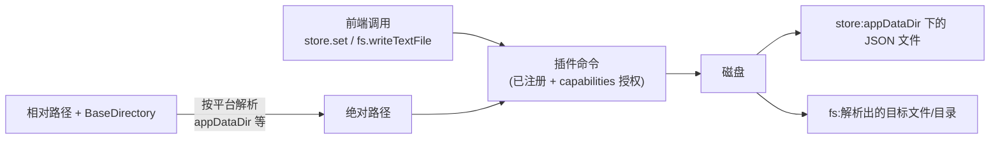

import { Canvas, Controls, Meta } from '@storybook/addon-docs/blocks';
import * as Persistence from './persistence.stories';

<Meta of={Persistence} name="Docs" />

# 文件与持久化

[状态](?path=/docs/state--docs)一课留下的尾巴:托管状态活在内存里,应用一退就没了。本课把数据写到磁盘。Tauri 2 里这是两个官方插件的分工:**store 插件管键值持久化**——一个 store 就是一个 JSON 文件,`set`/`get` 读写配置态,默认自动落盘;**fs 插件管任意文件**——日志、导出文件、用户目录里的任何文件都由它读写。两者共用同一套路径约定:调用时给「相对路径 + `BaseDirectory` 枚举」,插件按平台解析出应用数据目录下的真实位置,全程不手拼绝对路径。

插件怎么装、四件套落在哪,见[插件体系](?path=/docs/plugin-system--docs);capabilities 授权机制见[权限与能力](?path=/docs/capabilities--docs)。本课聚焦两个插件本身:数据写到哪、API 怎么用、权限有什么特殊之处。读完你应该能预测:快速上手里 `store.set` 写下的值,重启后从 `~/Library/Application Support/<bundle-identifier>/settings.json` 读回来。



先记选型一句话:**存「键 → 值」的配置态用 store,存「文件」用 fs**:

| 场景 | 用什么 |
| --- | --- |
| 配置项、开关、上次会话的状态(JSON 能表达的键值结构) | store |
| 日志、导出文件、任意格式的数据文件、用户目录里的文件 | fs |

关键输入与默认行为:

| 项 | 默认 / 规则 | 回查要点 |
| --- | --- | --- |
| 安装 | `npm run tauri add fs` / `npm run tauri add store` | 四件套见插件体系课 |
| store 文件位置 | 相对路径相对 `appDataDir` 解析 | macOS:`~/Library/Application Support/<identifier>/` |
| store autoSave | 默认开启,100ms 防抖后写盘 | `false` 关闭后,优雅退出时仍会保存 |
| store 权限 | `store:default` 放行全部读写命令 | 装完即可用 |
| fs 权限 | `fs:default` 只放行应用专属目录的读 | 写文件需 `fs:allow-*` + scope,见权限小节 |
| 路径写法 | 相对路径 + `baseDir` | 需要真实路径时用 `@tauri-apps/api/path` |

## 快速上手

前提:已有[第一个应用](?path=/docs/first-app--docs)生成的 react-ts 工程。用 store 插件让一个「主题偏好」重启后还在,三步:

1. 安装。`tauri add` 会自动把 `store:default` 权限写进 capabilities,装完即可调用:

```bash
npm run tauri add store
```

2. 前端读写:

```tsx
// src/App.tsx
import { useEffect, useState } from 'react';
import { LazyStore } from '@tauri-apps/plugin-store';

// 首次真正调用方法时才加载;文件是 appDataDir 下的 settings.json
const store = new LazyStore('settings.json');

export default function App() {
  const [theme, setTheme] = useState('light');

  useEffect(() => {
    // 启动时读回上次保存的值
    store.get<string>('theme').then((saved) => saved && setTheme(saved));
  }, []);

  return (
    <button
      onClick={async () => {
        const next = theme === 'light' ? 'dark' : 'light';
        setTheme(next);
        // 默认 100ms 防抖后自动写盘,不需要手动 save
        await store.set('theme', next);
      }}
    >
      当前主题:{theme}(切换后重启应用,主题保持)
    </button>
  );
}
```

3. `npm run tauri dev`,点几次按钮,然后完全退出再启动:主题保持。直接看磁盘文件,内容就是一段 JSON:

```bash
# bundle-identifier 换成 tauri.conf.json 里的 identifier
cat ~/Library/Application\ Support/<bundle-identifier>/settings.json
# {"theme":"dark"}
```

这个最小闭环演示了持久化的三要素:内容(store 的键值)、路径(`appDataDir`)、落盘时机(autoSave)。store 的细节见下一节;要落盘的是任意格式文件时,用 fs 插件,见再下一节。

## 路径约定与应用数据目录

fs 与 store 的路径参数都是「相对路径 + 基准目录」:`baseDir` 用 `BaseDirectory` 枚举指定一个平台相关的基准目录(成员与 `@tauri-apps/api/path` 的函数一一对应,如 `AppData` ↔ `path.appDataDir()`),插件把相对路径拼到它下面。应用专属的五个目录都挂在 **bundle identifier**(`tauri.conf.json` 的 `identifier`)之下:

| BaseDirectory | macOS | Windows | Linux |
| --- | --- | --- | --- |
| `AppData` | `~/Library/Application Support/<id>` | `%APPDATA%\<id>` | `~/.local/share/<id>`(或 `$XDG_DATA_HOME`) |
| `AppConfig` | 同 AppData | `%APPDATA%\<id>` | `~/.config/<id>` |
| `AppLocalData` | 同 AppData | `%LOCALAPPDATA%\<id>` | 同 AppData |
| `AppCache` | `~/Library/Caches/<id>` | `%LOCALAPPDATA%\<id>` | `~/.cache/<id>` |
| `AppLog` | `~/Library/Logs/<id>` | `%LOCALAPPDATA%\<id>\logs` | `~/.local/share/<id>/logs` |

两点直接可用的判断:

- **macOS 上 `AppData` / `AppConfig` / `AppLocalData` 是同一个目录**——macOS 的惯例就是「应用支持目录一份」;Windows 上才区分 Roaming(随用户漫游)与 Local(留在本机)。
- **选哪个目录按数据寿命**:配置用 `AppConfig`,一般数据与 store 文件用 `AppData`,可丢弃的缓存用 `AppCache`,日志用 `AppLog`。`Document` / `Download` / `Home` / `Temp` 等其余成员同样以枚举出现(完整清单见 [path 模块参考](https://tauri.app/reference/javascript/api/namespacepath/));让用户自己挑文件(打开/保存对话框)见[系统交互](?path=/docs/system-integration--docs)一课。

### path API:拿到真实路径

读写本身不需要先算出绝对路径;但要把路径展示给用户、写进日志,或传给 Rust / 第三方库时,用 `@tauri-apps/api/path` 解析和拼装(与 `BaseDirectory` 同一套解析规则):

```ts
import * as path from '@tauri-apps/api/path';

const appData = await path.appDataDir(); // macOS: ~/Library/Application Support/<id>
const full = await path.join(appData, 'logs', 'app.log');

await path.dirname(full); // …/logs
await path.basename(full); // app.log
await path.extname(full); // .log
```

除 `sep()` / `delimiter()` 外,函数都返回 `Promise`——解析结果依赖运行环境(平台、应用标识),由 Tauri 运行时计算。分隔符别自己拼:`path.join` 在 Windows 上会用 `\`。

## store:键值持久化

一个 store = 一个 JSON 文件 + 一张内存 KV 表:`load('settings.json')` 在 `appDataDir` 下创建或打开文件,把内容载入内存;`set`/`get` 操作的是内存表,何时写回磁盘由 autoSave 策略决定(见落盘时机一节)。前端与 Rust 侧可以打开同一个 store,读写的是同一份数据。值的类型是「JSON 能表达的都行」:字符串、数字、布尔、数组、嵌套对象。

### 创建与读写

```ts
import { load } from '@tauri-apps/plugin-store';

// 创建或加载;已存在时 options 被忽略(同一路径全局只有一份 store)
const store = await load('settings.json', {
  defaults: { theme: 'light', fontSize: 14 },
});

await store.set('theme', 'dark');
const theme = await store.get<string>('theme'); // 'dark'
await store.entries(); // [['theme', 'dark'], ['fontSize', 14], …]
await store.keys(); // ['theme', 'fontSize']
await store.delete('fontSize'); // 返回是否真的删除了
await store.clear(); // 清空;store.reset() 恢复为 defaults
```

几个易错点:

- **值必须可 JSON 序列化**。`Date`、`Map`、`Set` 存进去再读出来会变形;要存时间就存 ISO 字符串或时间戳。
- **`load` 同一路径永远返回同一份 store**,第二次调用传的 `defaults` / `autoSave` 不会生效——初始化配置收敛到一个模块里做一次。
- `defaults` 只在文件**不存在**时生效;磁盘上已有内容时以磁盘为准。

嫌 `load` 的 `await` 碍事(比如想在模块顶层建单例),用 2.1.0 起的惰性版 `LazyStore`,方法集与 `Store` 一致,只是首次调用方法时才真正加载:

```ts
import { LazyStore } from '@tauri-apps/plugin-store';

const store = new LazyStore('settings.json'); // 模块顶层直接 new
```

Rust 侧用 `StoreExt` 打开同一个 store(`StoreExt` 的规律见插件体系课):

```rust
use tauri_plugin_store::StoreExt;

// 与前端打开同一个 store,读写同一份数据
let store = app.store("settings.json")?;
store.set("theme", serde_json::json!("dark"));
```

Rust 侧的值必须在 `serde_json::Value` 类型体系里,否则与 JS 绑定对不上;确定不再使用时调 `store.close_resource()` 释放。

### 落盘时机:autoSave 与 save

默认(`autoSave` 不传或传数字):每次修改后**防抖 100ms** 自动写盘,连续修改合并成一次写入。传 `false` 关闭自动保存,修改只在两种时机落盘:显式 `store.save()`,或应用**优雅退出**时(插件退出前保存)——强杀进程不在此列。也就是说,内存与磁盘之间始终隔着一个「未落盘窗口」,autoSave 只决定窗口多宽。

把防抖放慢到能看清(演示用 1200ms,真实默认 100ms),对照几种操作下「内存」与「磁盘 store.json」两个状态何时一致:

<Canvas of={Persistence.StoreAutosave} />
<Controls of={Persistence.StoreAutosave} />

| 读者操作 | 可观察证据 |
| --- | --- |
| autoSave 保持 1200(放慢),操作选 set | 内存立即变 dark,磁盘进入「防抖中」倒计时,倒计时结束才「已落盘」 |
| 操作选 save() | set 后紧跟的 `store.save()` 立即写盘,挂起的防抖被取消 |
| autoSave 切到 false(关闭)再选 set | 磁盘停在「未落盘」;选 save() 或「退出(优雅)」才会写入 |
| 操作选「强杀再启动」(autoSave 1200) | 防抖窗口内被杀,重启后内存回到磁盘旧值——窗口内的修改丢失 |
| autoSave 切回 100(默认)再「强杀再启动」 | 100ms 防抖在强杀前早已落盘,数据保住——默认档位的丢失窗口很小 |
| 打开 Show code | 看到该 Canvas 实际执行的 `store-autosave.ts` |

落盘策略的判断:配置态用默认 autoSave;要求「每次修改必达磁盘」的数据,set 后紧跟 `await store.save()`;高频批量修改(拖动滑块、逐帧更新)先连续改内存、最后 `save()` 一次,比反复触发防抖更省 IO。

### 变更监听:onChange

```ts
const unlisten = await store.onKeyChange<string>('theme', (value) => {
  // value 是新值;键被删除时是 undefined
  setTheme(value ?? 'light');
});

// 不再需要时取消订阅
unlisten();
```

`onChange((key, value) => …)` 监听全部键,回调由**对这个 store 实例的修改**触发——同路径全局只有一份实例,所以任何持有它的代码触发的修改都会到达这里。用它把 store 变化持续同步进 React 状态,代替「启动时读一次」的单向拉取。

## fs:任意文件读写

fs 插件是文件系统调用的直接封装:读、写、建、删、改名、列目录各是一个独立函数,一次调用完成一个操作;路径同样是「相对路径 + baseDir」。与 store 的分工:store 只管它自己的 JSON 键值文件,fs 管其余一切——日志、导出文件、任意格式的数据文件、用户目录里的文件。

### 文件与目录操作

```ts
import {
  BaseDirectory,
  copyFile,
  exists,
  mkdir,
  readDir,
  readTextFile,
  readTextFileLines,
  remove,
  rename,
  writeTextFile,
} from '@tauri-apps/plugin-fs';

// 写:文件不存在则创建,已存在则整体覆盖(create 默认 true)
// 父目录不会被自动创建——先 mkdir(见下)
await writeTextFile('settings/theme.json', '{"theme":"dark"}', {
  baseDir: BaseDirectory.AppData,
});

// 追加日志:append 不清空原内容;要求「已存在则失败」用 createNew: true
await writeTextFile('logs/app.log', '启动完成\n', {
  baseDir: BaseDirectory.AppData,
  append: true,
});

// 读:UTF-8 字符串;大文件用 readTextFileLines 流式逐行读
const raw = await readTextFile('settings/theme.json', {
  baseDir: BaseDirectory.AppData,
});
const lines = await readTextFileLines('logs/app.log', {
  baseDir: BaseDirectory.AppData,
});
for await (const line of lines) {
  // 逐行处理,不整份载入内存
}

// 目录:create / remove 都有 recursive 选项
await mkdir('settings', { baseDir: BaseDirectory.AppData, recursive: true });
const has = await exists('settings/theme.json', { baseDir: BaseDirectory.AppData });
await remove('settings/theme.json', { baseDir: BaseDirectory.AppData });
await remove('settings', { baseDir: BaseDirectory.AppData, recursive: true }); // 非空目录必须 recursive

// 改名与复制:两端可分别指定基准目录
await rename('settings/theme.json', 'settings/theme.bak.json', {
  oldPathBaseDir: BaseDirectory.AppData,
  newPathBaseDir: BaseDirectory.AppData,
});
await copyFile('settings/theme.bak.json', 'settings/theme.json', {
  fromPathBaseDir: BaseDirectory.AppData,
  toPathBaseDir: BaseDirectory.AppData,
});

// 列目录:返回 name / isDirectory / isFile / isSymlink;没有 recursive 选项,逐层递归要自己写
const entries = await readDir('settings', { baseDir: BaseDirectory.AppData });
```

把一次调用拆开看,是三步:相对路径 + baseDir 解析成绝对路径 → 按 capabilities 做「命令 × 路径」判定 → 执行。下面的沙盒在浏览器里模拟这串过程,目录内容跨操作持续累积;按表格里的路径走一遍,让一次写操作先后撞上三种授权档位:

<Canvas of={Persistence.FsSandbox} />
<Controls of={Persistence.FsSandbox} />

| 读者操作 | 可观察证据 |
| --- | --- |
| 目标目录 AppData、授权档位「仅 fs:default」,操作选 writeTextFile | 被拒:not allowed——`fs:default` 不含写命令 |
| 授权档位切「+ 写命令(未配 scope)」 | 换成 forbidden path——命令声明了,但没配 scope 就不覆盖任何路径 |
| 档位切「+ 写/删命令 + scope」 | 写入成功,目录树出现 settings.json;readTextFile 能读回内容 |
| 授权档位「仅 fs:default」时操作选 mkdir | 仍被拒:default 的 scope 只允许创建应用目录本身,不含子目录 |
| 目标目录切到 Document(默认档位) | 连读操作也变成 forbidden path——`fs:default` 只覆盖应用专属目录 |
| 档位「+ 写/删命令 + scope」下:mkdir('logs') → 写入 'logs/app.log' → remove('logs') | 报 Directory not empty——非空目录要 `recursive: true` |
| 打开 Show code | 看到该 Canvas 实际执行的 `fs-sandbox.ts` |

### 权限与 scope:forbidden path

fs 的授权是**两个维度**:命令权限(允许调用哪个函数)+ 路径 scope(允许触碰哪些路径)。`fs:default` 的内容:应用专属目录(`AppConfig` / `AppData` / `AppLocalData` / `AppCache` / `AppLog`)的**读**访问(递归),外加允许用 `mkdir` 创建这些应用目录本身;写文件、删文件、应用目录以外的路径,默认统统不放行。于是装完 fs 就会撞上两种拒绝:

- 报错带 **not allowed**:命令权限没进 capabilities——`fs:default` 不含 write / remove 等命令,要补 `fs:allow-write-text-file` 这类单项。
- 报错带 **forbidden path**:命令放行了,但路径不在 scope 内。**权限 ≠ scope**:官方文档明确,只声明 `fs:allow-exists` 而不配 scope,等于不覆盖任何路径。

scope 与权限一起写在 capabilities,支持通配与 deny(deny 优先于 allow):

```json
// src-tauri/capabilities/default.json
{
  "identifier": "default",
  "windows": ["main"],
  "permissions": [
    "core:default",
    "fs:default",
    "fs:allow-write-text-file",
    {
      "identifier": "fs:scope",
      "allow": ["$APPDATA/**"],
      "deny": ["$APPDATA/secret.txt"]
    }
  ]
}
```

scope 条目里的 `$APPDATA` / `$APPCONFIG` / `$APPLOG` 等变量与 `BaseDirectory` 成员同源,解析规则一致;条目也可以写成对象形式 `{ "path": "$APPDATA/**" }`,配 `requireLiteralLeadingDot: false` 放行 Unix 点文件。更细的 scope 语法与拒绝排查见[权限与能力](?path=/docs/capabilities--docs)一课。另外 Windows 上 `fs:default` 默认拒绝 `$APPLOCALDATA/EBWebView`(WebView2 数据目录)——那是 WebView 自己的地盘,不要往 allow 里加。

## 最佳实践

- **KV 配置态走 store,任意文件走 fs。** 需要「键 → 值」读写、要自动落盘、数据量不大 → store;格式不是 JSON 键值(二进制、逐行日志、导出文件)、要精确控制文件位置与内容 → fs。两者可以混用:配置进 store,导出用 fs。
- **路径永远「相对 + baseDir」,要展示时才用 path API。** 手拼 `~/Library/...` 一到 Windows 就错;`BaseDirectory` 让同一段代码在三个平台各自正确,`path.join` 替你处理分隔符。
- **目录按数据寿命选。** 配置 `AppConfig`、一般数据 `AppData`、缓存 `AppCache`、日志 `AppLog`;写进 `Temp` 的东西不要指望它还在。
- **fs 权限按需最小化。** scope 指到具体子目录(`$APPDATA/**` 而非 `$HOME/**`),敏感文件用 deny 兜底;命令权限只加用得到的单项,不开一揽子。
- **落盘策略与数据价值匹配。** 配置态用默认 autoSave;必达数据 set 后紧跟 `save()`;批量高频修改攒一批最后 `save()` 一次。
- **首次使用先确保目录存在。** fs 不自动建父目录;初始化时 `mkdir(..., { recursive: true })` 一次,后面只管读写。

## 常见问题

- fs 调用 reject,报错带 not allowed 字样
  命令权限没进 capabilities:`fs:default` 只含应用专属目录的读与 mkdir 应用目录,写文件要加 `fs:allow-write-text-file`(删除是 `fs:allow-remove`)。改完 capabilities 重启 `tauri dev`。
- 权限已声明,调用还是 reject,报 forbidden path
  路径不在 scope 内:命令权限只解决「函数能调」,scope 决定「路径能碰」。用 `fs:scope` 的 allow 数组把目标路径(如 `$APPDATA/**`)盖住;deny 优先于 allow,先检查有没有 deny 条目挡住了它;Unix 上点开头的文件需要写全路径/glob,或加 `requireLiteralLeadingDot: false`。
- writeTextFile 报 No such file or directory
  父目录不存在——fs 不会自动创建父目录。先 `mkdir(path, { baseDir, recursive: true })` 再写;`mkdir` 的 recursive 默认是 false,逐级创建要开它。
- store 的修改没有出现在 JSON 文件里
  三种可能:`autoSave: false` 关了自动保存而没调 `save()`;修改还在 100ms 防抖窗口内(连续修改会不断重置计时);进程被强杀——优雅退出才会兜底保存。要确定性落盘,set 后紧跟 `await store.save()`。
- 第二次 `load` 传的 defaults / autoSave 没生效
  同一路径全局只有一份 store,重复 `load` 返回已有实例、忽略新 options。把 store 初始化收敛到一个模块(导出单例);确实要重建时用 `createNew: true`。
- 读出来的值字段丢失或类型不对(Date 变字符串、Map 变空对象)
  store 的值必须可 JSON 序列化。改存可序列化结构:时间用 ISO 字符串或时间戳,集合用数组;大二进制与大对象不适合 store,走 fs。

## 总结回顾

摘要:本课把[状态](?path=/docs/state--docs)课留下的「重启即丢」补上了。store 插件把键值数据存进 `appDataDir` 下的一个 JSON 文件:`load` / `LazyStore` 创建,`set` / `get` / `entries` / `delete` / `clear` 读写内存表,默认 100ms 防抖自动落盘、`save()` 立即落盘、优雅退出兜底——`autoSave: false` 或强杀进程都会拉开「内存已改、磁盘未写」的窗口;`onChange` / `onKeyChange` 把变化推回 React。fs 插件管任意文件:`writeTextFile` / `readTextFile` / `mkdir` / `remove` / `rename` / `copyFile` / `readDir` 一次一个操作,写不自动建父目录、删非空目录要 `recursive`、大文件用 `readTextFileLines` 流式读。两个插件共用「相对路径 + `BaseDirectory`」的路径约定,五个应用专属目录都挂在 bundle identifier 下(macOS 上 AppData / AppConfig / AppLocalData 同址);fs 的授权是「命令 × 路径」两维——`fs:default` 只放行应用专属目录的读,写文件要命令权限与 scope 双双到位,否则分别以 not allowed 与 forbidden path 拒绝。

一句话:

> 持久化 = 内容 × 路径 × 权限:store 管 JSON 键值并自动落盘,fs 管任意文件,但每一步都要命令权限与 scope 放行。

知识要点:

- store 文件默认落在哪个目录?macOS 上五个应用专属目录各在哪、哪些同址?
- store 的 autoSave 默认行为是什么?`false` 之后修改何时落盘?什么情况下会丢数据?
- 为什么第二次 `load` 的 options 不生效?`defaults` 何时起作用?
- `onChange` / `onKeyChange` 的回调签名是什么?由什么触发、如何取消?
- fs 的哪些操作被 `fs:default` 放行?写一个文件需要哪些权限与 scope 配置?
- not allowed 与 forbidden path 分别缺了哪一维?怎么补?
- `writeTextFile` 与 `mkdir` 的「不自动」边界各是什么?`remove` 非空目录要注意什么?

## 参考资料

- [File System 插件 - Tauri 官方文档](https://tauri.app/plugin/file-system/)
  安装命令、fs 全部 API 与 `BaseDirectory` 用法示例、`fs:default` 内容(应用专属目录只读 + mkdir 创建)、权限 ≠ scope 与 forbidden path、`fs:scope` 对象形式与 deny 优先、dotfiles、大文件 `readTextFileLines`、移动端限制。
- [Store 插件 - Tauri 官方文档](https://tauri.app/plugin/store/)
  安装命令、`load` / `LazyStore` 用法、autoSave 100ms 防抖与优雅退出保存、Rust 侧 `StoreExt`、`store:default` 权限集内容。
- [`path` 模块 - Tauri 官方 JS API 参考](https://tauri.app/reference/javascript/api/namespacepath/)
  `appDataDir` 等目录函数在三平台的解析规则、`BaseDirectory` 枚举成员、`join` / `dirname` / `basename` / `sep` 等路径运算函数。
- [`@tauri-apps/plugin-fs` - Tauri 官方 JS API 参考](https://tauri.app/reference/javascript/fs/)
  `create` 默认 true、`append` / `createNew` / `recursive` 默认值、`DirEntry` 字段、rename / copyFile 的双端 baseDir 选项。
- [`@tauri-apps/plugin-store` - Tauri 官方 JS API 参考](https://tauri.app/reference/javascript/store/)
  `load` 同路径忽略 options、StoreOptions(autoSave / defaults / createNew)、`save()` 取消挂起防抖、`onChange` / `onKeyChange` 回调签名、store 落盘在 app_data_dir。
