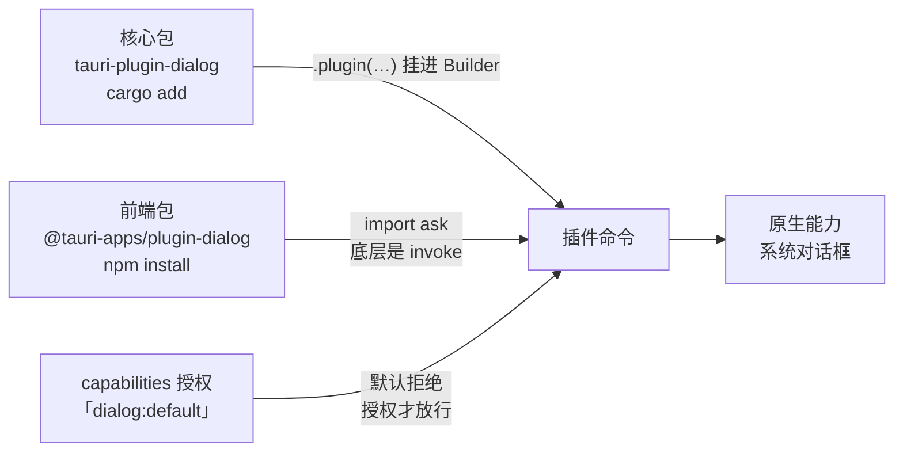

import { Canvas, Controls, Meta } from '@storybook/addon-docs/blocks';
import * as PluginSystem from './plugin-system.stories';

<Meta of={PluginSystem} name="Docs" />

# 插件体系

Tauri 2 对 1.x 做了一次结构性重组:1.x 里内置于核心的文件系统、对话框、HTTP、剪贴板、通知、全局快捷键、shell、updater 等能力,在 2.x 全部拆成了官方插件,由各插件独立发版;核心只保留窗口、事件、命令这类骨架。收益是核心更小、能力按需引入、权限粒度更细(1.x 的 allowlist 开关也换成了 capabilities 权限体系,见[权限与能力](?path=/docs/capabilities--docs)一课);代价是每种能力都要走一遍统一的引入流程——这正是本课要讲的东西。模型只有一个:**一个插件 = Rust 核心包(命令实现与权限定义)+ 前端包(JS API)+ Builder 注册一行 + capabilities 权限声明**。掌握这套「四件套」,面对任何官方或社区插件,你都能预测它要装哪几样、注册在哪、权限写哪里。

四件套怎么协作(以 dialog 为例,其余插件换名不换结构):



常用官方插件速览(完整清单见下方「官方插件地图」;具体用法在各课展开):

| 插件 | 作用 | 前端包 | 本手册落点 |
| --- | --- | --- | --- |
| dialog | 文件与消息对话框 | `@tauri-apps/plugin-dialog` | 本课、[系统交互](?path=/docs/system-integration--docs) |
| fs | 文件系统访问 | `@tauri-apps/plugin-fs` | [文件与持久化](?path=/docs/persistence--docs) |
| store | 键值持久化 | `@tauri-apps/plugin-store` | [文件与持久化](?path=/docs/persistence--docs) |
| http | Rust HTTP 客户端 | `@tauri-apps/plugin-http` | [网络请求](?path=/docs/http--docs) |
| opener | 用系统默认应用打开 URL/文件 | `@tauri-apps/plugin-opener` | [系统交互](?path=/docs/system-integration--docs) |
| clipboard-manager | 读写剪贴板 | `@tauri-apps/plugin-clipboard-manager` | [系统交互](?path=/docs/system-integration--docs) |
| notification | 系统通知 | `@tauri-apps/plugin-notification` | [系统交互](?path=/docs/system-integration--docs) |
| global-shortcut | 全局快捷键 | `@tauri-apps/plugin-global-shortcut` | [菜单与快捷键](?path=/docs/menus-shortcuts--docs) |
| log | 日志 | `@tauri-apps/plugin-log` | [调试与日志](?path=/docs/debugging--docs) |
| updater | 应用内更新 | `@tauri-apps/plugin-updater` | [自动更新](?path=/docs/updater--docs) |

## 快速上手

前提:已有[第一个应用](?path=/docs/first-app--docs)生成的 react-ts 工程。以 dialog 插件为例,最小闭环是「一条命令装好 → 前端调用 → 弹出系统对话框」:

1. 安装。`tauri add` 以插件短名作参数,一条命令装完:

```bash
npm run tauri add dialog
```

2. 前端调用:

```tsx
// src/App.tsx —— 在模板组件里加一个按钮
import { ask } from '@tauri-apps/plugin-dialog';

export default function App() {
  return (
    <button
      onClick={async () => {
        const confirmed = await ask('确定要删除吗?', {
          title: '确认删除',
          kind: 'warning',
        });
        console.log(confirmed); // 确认返回 true,取消返回 false
      }}
    >
      删除
    </button>
  );
}
```

3. `npm run tauri dev` 运行(已在运行时保存 Rust 侧改动会自动重编译),点按钮,弹出的是系统原生确认对话框,选择结果以布尔值回到前端。

这条命令背后做完了四件事:核心包进 `src-tauri/Cargo.toml`、前端包进 `package.json`、在 Builder 上补注册、把 default 权限写进 capabilities。每件事手动怎么做、各插件在这四步上有什么差异,是下面两节的内容。

## 插件模型

一个插件由两半组成,发布时对应两个包:

- **核心包(Rust crate):** 命令的真正实现,自带 `permissions/` 权限定义,命名 `tauri-plugin-<name>`。注册进应用后,插件命令挂到应用上,权限定义交给 ACL 使用。
- **前端包(npm 包):** 把插件命令封装成带类型的 JS 函数,官方插件统一命名 `@tauri-apps/plugin-<name>`。它只是薄封装——每个函数底层都是一次带命名空间的 invoke;没有前端包的插件照样能用(见「注册变体」的 Rust-only 插件)。

自己写插件时的内部结构(`commands.rs`、`permissions/`、`guest-js/` 等)在[自定义插件](?path=/docs/custom-plugin--docs)一课展开,本课只讲「用插件」这一侧。

### 命令与默认拒绝

插件命令有命名空间:`plugin:<插件名>|<命令名>`。前端包函数与裸 invoke 等价:

```ts
import { ask } from '@tauri-apps/plugin-dialog';
import { invoke } from '@tauri-apps/api/core';

await ask('确定要删除吗?');
// 等价写法:命令名 = plugin:<插件名>|<命令名>,参数由前端包负责拼装
await invoke('plugin:dialog|ask', { message: '确定要删除吗?' });
```

与[命令](?path=/docs/commands--docs)一课注册的应用命令不同,**插件命令默认拒绝**:ACL 没授权时,调用直接 reject。授权写在 `src-tauri/capabilities/*.json`:

```json
{
  "$schema": "../gen/schemas/desktop-schema.json",
  "identifier": "default",
  "windows": ["main"],
  "permissions": ["core:default", "dialog:default"]
}
```

`dialog:default` 是插件随包分发的**默认权限集**(dialog 的 default 集允许 open / save / message 三类命令)。多数官方插件都有 default 集;global-shortcut 没有,装完仍需逐项声明权限。单项权限、scope 细粒度控制与拒绝排查见[权限与能力](?path=/docs/capabilities--docs)一课。

### Rust 侧调用插件

注册后,插件通过 extension trait 给 `AppHandle` / `WebviewWindow` 挂方法;插件没有前端包时,这就是唯一入口:

```rust
use tauri_plugin_global_shortcut::GlobalShortcutExt;

// global-shortcut 插件注册后,GlobalShortcutExt 给应用挂上 global_shortcut() 方法
app.global_shortcut().register("CommandOrControl+Shift+C")?;
```

规律:Rust 侧 API 都以 `tauri_plugin_<name>::<Feature>Ext` 的形式导入,如 `DialogExt`、`FsExt`、`StoreExt`,导入后就能 `app.dialog()`、`app.store(...)` 这样调用。

### 插件配置

有配置项的插件,配置写在 `tauri.conf.json` 顶层 `plugins` 字段,插件初始化时读取:

```json
{
  "plugins": {
    "log": { "level": "info" }
  }
}
```

哪些插件吃配置、字段叫什么,以对应插件文档为准。

## 安装与注册

### 一步安装:tauri add

官方插件的推荐装法是一条命令:

```bash
npm run tauri add dialog   # npm 脚本形式
cargo tauri add dialog     # cargo 形式,等价
```

命令做完四件事:核心包进 `src-tauri/Cargo.toml`、前端包进 `package.json`、Builder 注册、default 权限写进 capabilities。装完即可 import 调用;无 default 权限集的插件(如 global-shortcut)权限仍要自己加。

### 手动安装:三步装 + 一处声明

理解模型、排查问题、写 CI 时需要手动执行。安装动作是三步,外加权限声明一处:

```bash
# 第 1 步:前端包(用到 JS API 才需要)
npm install @tauri-apps/plugin-dialog

# 第 2 步:核心包(在 src-tauri 目录下执行)
cd src-tauri
cargo add tauri-plugin-dialog
cd ..
```

```rust
// 第 3 步:src-tauri/src/lib.rs 的 Builder 链上加一行
tauri::Builder::default()
    .plugin(tauri_plugin_dialog::init())
    .run(tauri::generate_context!())
    .expect("error while running tauri application");
```

```json
// 第 4 件:src-tauri/capabilities/default.json 的 permissions 数组
"permissions": ["core:default", "dialog:default"]
```

四个位置共享同一个**插件短名** `<name>`,记住短名就能推出全部名字(以 clipboard-manager 为例,它的权限前缀是 `clipboard-manager:` 而不是 `clipboard:`):

| 位置 | 通用形态 | clipboard-manager 示例 |
| --- | --- | --- |
| 核心包 | `tauri-plugin-<name>` | `tauri-plugin-clipboard-manager` |
| 前端包 | `@tauri-apps/plugin-<name>` | `@tauri-apps/plugin-clipboard-manager` |
| 注册 | `tauri_plugin_<name>::init()`(连字符转下划线) | `tauri_plugin_clipboard_manager::init()` |
| 权限 | `<name>:default` / `<name>:allow-xxx` | `clipboard-manager:allow-write-text` |

下面的实例把十个常用官方插件的四件套并排对比:顶部是一键安装命令,下方四行对应四个落点。切换「演示插件」,重点核对三处差异——global-shortcut 的权限行(无 default 集)、single-instance 的前端包与权限行(Rust-only,两件不需要)、log 的注册行(Builder 形式):

<Canvas of={PluginSystem.Interactive} />
<Controls of={PluginSystem.Interactive} />

| 读者操作 | 可观察证据 |
| --- | --- |
| 切换「演示插件」 | 四行落点与四项读数同步变化;一键命令里只换插件短名 |
| 切到 global-shortcut | 权限行需逐项声明,读数「权限默认」变为「无 default」 |
| 切到 single-instance | 前端包与权限两行显示「不需要」,注册行带闭包并要求第一个注册 |
| 打开 Show code | 看到该 Canvas 实际执行的 `example.ts` |

### 注册变体

- **Builder 形式:** 需要配置或回调的插件提供 Builder——log 插件配置日志等级与输出目标时写 `tauri_plugin_log::Builder::new().build()`。`init()` 就是 Builder 的零配置简写,不需要配置时用 `init()`。
- **运行期注册:** 插件也可以在 `setup` 里用 `app.handle().plugin(...)` 注册。single-instance 的官方写法就是这种,`init()` 带一个闭包处理「第二次启动」事件,并且官方要求**第一个注册**。
- **桌面专用插件:** global-shortcut、window-state、single-instance、autostart 等只在桌面有意义。`cargo add` 时加 `--target` 把依赖限定到桌面平台,注册处用 `#[cfg(desktop)]` 门控,否则移动端构建会失败。
- **注册顺序:** Builder 链上的 `.plugin()` 按书写顺序初始化;有顺序要求的插件(single-instance 要求第一个)要放在链首。

## 官方插件地图

官方插件统一在官网插件索引维护,目前 30 余个,按用途分四类:

| 分组 | 插件 | 说明 |
| --- | --- | --- |
| 核心能力(1.x 内置拆出) | fs、dialog、http、opener、shell、clipboard-manager、notification、global-shortcut、updater、store、log、os、process | 1.x 的核心 API 与 allowlist 在 2.x 拆为「插件 + capabilities」;opener 负责「打开」,shell 负责「执行程序」 |
| 桌面增强 | window-state、single-instance、autostart、positioner、cli、localhost、persisted-scope | 窗口记忆、单实例、开机自启等桌面行为 |
| 生态与数据 | sql、websocket、stronghold、upload、deep-link | sqlx 数据库、加密存储、文件上传、URL 唤起 |
| 移动端 | barcode-scanner、biometric、geolocation、haptics、nfc | 随[移动端](?path=/docs/mobile-setup--docs)阶段使用 |

本手册各课的插件落点见开场参考表;ACL 权限体系在[权限与能力](?path=/docs/capabilities--docs)一课展开。

## 最佳实践

- **优先 `tauri add`,手动四步用来核对。** 一条命令不会漏;手动安装(review 代码、写 CI、排查)时按「前端包 / 核心包 / 注册 / 权限」四个位置逐一检查,四件套缺一不可。
- **按需引入。** 每个插件都增加二进制体积与攻击面:用不到的能力不装;装了的插件尽量用最小权限集,而不是把 default 之外的权限全部放开(收紧原则见[权限与能力](?path=/docs/capabilities--docs)与[安全加固](?path=/docs/security--docs))。
- **前端统一走官方 npm 包。** 不裸调 `plugin:<name>|<command>`:封装函数有类型、参数拼装不易错,官方调整内部实现时调用方不用改。
- **注册集中在一处。** 所有 `.plugin()` 收在 `lib.rs` 的同一个 Builder 链,顺序敏感的插件(single-instance)放最前,应用启用了哪些插件一眼可见。

## 常见问题

- 前端调用 reject,报错带 not allowed / denied / ACL 字样
  capabilities 里没有给这个插件授权——`tauri add` 会自动写 default 权限,手动安装最容易漏「第 4 件」。把对应权限(如 `dialog:default`)加进 `src-tauri/capabilities/default.json` 后重启 `tauri dev`;单项权限与排查见[权限与能力](?path=/docs/capabilities--docs)一课。
- 前端包装好了、import 也正常,调用却报命令不存在
  Rust 侧缺件:要么没 `cargo add` 核心包,要么 Builder 链上漏了 `.plugin(...)`。命令只有在「核心包 + 注册」齐了之后才存在,四件套缺一不可。
- single-instance 拦不住第二次启动
  它要求第一个注册,注册晚了回调不生效。核对 `lib.rs` 里 `tauri_plugin_single_instance::init(...)` 的位置是否在所有插件之前。

## 总结回顾

摘要:Tauri 2 把 1.x 内置的 fs、dialog、http 等核心能力拆成官方插件,引入任何插件都走同一套四件套:核心包(命令实现与权限定义,`tauri-plugin-<name>`)、前端包(JS 薄封装,`@tauri-apps/plugin-<name>`)、Builder 注册一行(`.plugin(…::init())`)、capabilities 声明权限(`<name>:default`)。插件命令带 `plugin:<name>|<command>` 命名空间,默认拒绝、授权才放行;一步安装用 `tauri add`,它会替你完成全部四件。变体有三类:要配置的插件用 Builder 注册并吃 `tauri.conf.json` 的 `plugins` 配置;桌面专用插件用 `--target` 与 `#[cfg(desktop)]` 门控;Rust-only 插件(如 single-instance)没有前端包与权限件,靠 extension trait 在 Rust 侧使用。

一句话:

> 插件是打包好的「命令 + 权限」:核心包与注册让命令存在,前端包让它好调,capabilities 让它放行——四个落点,缺一不可。

知识要点:

- 1.x 到 2.x,核心能力发生了什么结构变化?收益与代价各是什么?
- 一个插件由哪两半组成?在工程里落几个位置?各自的命名规律是什么?
- 插件命令的命名空间长什么样?默认策略与应用自建命令有何不同?
- `tauri add` 替你做了哪四件事?
- 哪类插件没有前端包?没有前端包时怎么用?
- 注册有哪些变体?哪个插件对注册顺序有要求?

## 参考资料

- [Plugin Development - Tauri 官方文档](https://tauri.app/develop/plugins/)
  插件构成(crate + 可选 npm 包)、Builder 注册与 extension trait、命令命名空间 `plugin:<name>|<command>`、命令默认拒绝与权限文件、`tauri.conf.json` 的 plugins 配置。
- [Plugins - Tauri 官方插件索引](https://tauri.app/plugin/)
  官方插件完整清单与分组,「官方插件地图」小节的来源。
- [Tauri CLI 参考](https://tauri.app/reference/cli/)
  `tauri add <PLUGIN>` 命令的定义。
- [Dialog 插件](https://tauri.app/plugin/dialog/)
  快速上手安装命令、`ask` 用法与 `dialog:default` 权限集内容的来源。
- [Opener 插件](https://tauri.app/plugin/opener/)
  `opener:default` 权限集内容与 JS API 示例的来源。
- [Global Shortcut 插件](https://tauri.app/plugin/global-shortcut/)
  「无 default 权限集」、桌面平台限制与 Rust 侧 `GlobalShortcutExt` 用法的来源。
- [Single Instance 插件](https://tauri.app/plugin/single-instance/)
  「无 JavaScript API」「必须第一个注册」与带闭包注册代码的来源。
