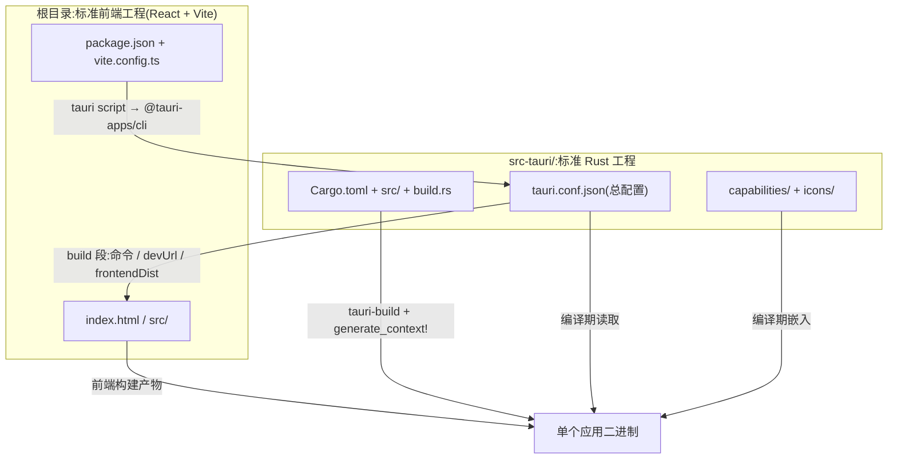

import { Canvas, Controls, Meta } from '@storybook/addon-docs/blocks';
import * as ProjectStructure from './project-structure.stories';

<Meta of={ProjectStructure} name="Docs" />

# 工程结构

本课拆解上一课生成的那份工程「谁负责什么」。核心判断:Tauri 工程是两个标准工程的组合——根目录是标准前端工程(React + Vite),`src-tauri/` 是标准 Rust 工程;两者靠 `package.json` 的 tauri script、`tauri.conf.json` 的 build 驱动段和编译期宏缝合。读完开场你应能预测:改界面动前端目录,改窗口与打包动 `tauri.conf.json`,加 Rust 依赖动 `Cargo.toml`,三者互不干扰。



开场参考表:

| 位置 | 归属 | 一句话职责 |
| --- | --- | --- |
| `index.html`、`src/`、`vite.config.ts`、`package.json` | 前端工程 | 界面与前端依赖,标准 SPA,Tauri 不侵入 |
| `src-tauri/tauri.conf.json` | Tauri 配置 | 窗口、打包、dev / build 驱动段;也是 CLI 定位 Rust 工程的标记 |
| `src-tauri/Cargo.toml`、`src-tauri/src/`、`src-tauri/build.rs` | Rust 工程 | 核心逻辑、命令注册与 Rust 依赖 |
| `src-tauri/capabilities/` | Tauri 配置(2.x 特有) | 把核心与插件权限授予窗口 |
| `src-tauri/gen/`、`src-tauri/target/`、`dist/` | 生成物 | 构建自动产出,不手改、不入库 |

## 快速上手

前提:上一课的 `tauri-app` 已生成,`npm run tauri dev` 正在运行。用两个改动验证职责边界:

```bash
# 1. 改前端:编辑 src/App.tsx 的任意文案并保存
#    → 窗口内容立刻更新(Vite HMR,不重启应用)

# 2. 改配置:编辑 src-tauri/tauri.conf.json 的窗口标题
#    → src-tauri/ 触发 Rust 重编译,窗口自动重启后新标题生效
```

窗口标题在 `tauri.conf.json` 的 `app.windows` 数组里:

```json
"app": {
  "windows": [
    { "title": "改这里", "width": 800, "height": 600 }
  ]
}
```

两条改动的响应速度差就是职责边界:前端目录归 Vite 管,秒级热替换;`src-tauri/` 归 cargo 管,任何文件变化都要重编译加重启。

## 工程树

回查入口:按文件名定位职责。下方实例画出了完整的工程树,选中任意条目,右侧给出它的职责说明,读数给出归属、读取者与版本库状态。

<Canvas of={ProjectStructure.Interactive} />
<Controls of={ProjectStructure.Interactive} />

| 读者操作 | 可观察证据 |
| --- | --- |
| 切换「选中文件」 | 树中高亮移动,右侧职责与读数同步更新 |
| 关闭「显示生成物」 | `dist/`、`src-tauri/gen/`、`src-tauri/target/` 从树上隐藏 |
| 打开 Show code | 看到该 Canvas 实际执行的 `example.ts` |

`dist/`、`gen/`、`target/` 三类生成物默认被 `.gitignore` 忽略——脚手架模板已在 `src-tauri/.gitignore` 写好 `/target/` 与 `/gen/schemas`;其余文件正常入库。

## 前端目录

根目录就是一份标准 React + Vite 工程:`index.html` 是入口,`src/` 是界面代码,`package.json` 管前端依赖与脚本。它与 Tauri 的全部接触面只有三处:

- **脚本入口:** `package.json` 的 `"tauri": "tauri"` 把命令转发给本地 `@tauri-apps/cli`,所以始终用 `npm run tauri ...` 调用;
- **驱动接口:** `tauri.conf.json` 的 `build` 段消费 Vite 提供的服务——`beforeDevCommand` 执行 `npm run dev`,`devUrl` 指向 `http://localhost:1420`;
- **运行时 API:** 前端代码通过 `@tauri-apps/api` 的 `invoke` / `listen` 与 Rust 核心通信,见[命令](?path=/docs/commands--docs)与[事件](?path=/docs/events--docs)两课。

脚手架在 `vite.config.ts` 里预置了三处专为 Tauri 准备的配置:

```ts
export default defineConfig(() => ({
  clearScreen: false, // 保留 cargo 报错,不被 Vite 清屏
  server: {
    port: 1420,
    strictPort: true, // 1420 被占用直接失败,与 devUrl 严格对齐
    watch: { ignored: ["**/src-tauri/**"] }, // Rust 改动不触发前端刷新
  },
}));
```

把 `src-tauri/` 整个拿掉,这份前端仍能 `npm run dev` 独立跑起来——这是判断「前端与 Rust 是否解耦」的试金石。把已有前端接进 Tauri 的完整步骤见[集成已有前端](?path=/docs/integrate-frontend--docs)一课。

## src-tauri:Rust 核心工程

`src-tauri/` 是一个标准 Cargo 工程,叠加了 Tauri 注入的三个构件(`build.rs`、`tauri.conf.json`、`capabilities/`)。每个文件的读取者不同,按读取时机回查:

| 文件 / 目录 | 读取者 | 时机 | 职责 |
| --- | --- | --- | --- |
| `Cargo.toml` | cargo | 每次编译 | Rust 依赖与库定义 |
| `src/main.rs` | cargo | 每次编译 | 桌面二进制入口 |
| `src/lib.rs` | cargo | 每次编译 | 应用主体:Builder、命令注册 |
| `build.rs` | cargo | 编译前 | 触发 tauri-build |
| `tauri.conf.json` | @tauri-apps/cli、tauri-build | 命令执行 / 编译期 | 应用总配置 |
| `capabilities/` | tauri-build | 编译期 | 权限授予 |
| `icons/` | tauri-build、bundler | 编译期 / 打包 | 应用图标 |
| `gen/`、`target/` | tauri-build、cargo | 自动生成 | schema 与编译产物 |

### Cargo.toml 与 Rust 源码

`Cargo.toml` 的依赖默认只有五项:`tauri`(核心)、`tauri-build`(构建依赖)、`serde` 与 `serde_json`(命令参数序列化)、`tauri-plugin-opener`(脚手架示例插件)。`[lib]` 段是理解文件分工的钥匙:

```toml
[lib]
# `_lib` 后缀避免 bin 与 lib 同名冲突(Windows)
name = "tauri_app_lib"
crate-type = ["staticlib", "cdylib", "rlib"] # 移动端把应用编译成库
```

**`main.rs` 不写逻辑。** 它只有桌面入口一句话,调用 `[lib] name` 指向的库,官方文档说明不建议改动它:

```rust
// 防止 Windows release 下出现额外控制台窗口
#![cfg_attr(not(debug_assertions), windows_subsystem = "windows")]

fn main() {
    tauri_app_lib::run()
}
```

**`lib.rs` 是应用主体。** 命令、插件、状态都写在这;`generate_context!()` 宏在编译期读取 `tauri.conf.json`、图标与 capabilities,并把前端产物嵌进二进制:

```rust
#[cfg_attr(mobile, tauri::mobile_entry_point)] // 移动端入口标记
pub fn run() {
    tauri::Builder::default()
        .plugin(tauri_plugin_opener::init())
        .invoke_handler(tauri::generate_handler![greet])
        .run(tauri::generate_context!())
        .expect("error while running tauri application");
}
```

`crate-type` 三个值各司其职:`rlib` 供桌面二进制链接,`staticlib` 与 `cdylib` 供移动端把 Rust 侧编译成系统库(iOS 静态库、Android 动态库)——这也是桌面与移动能共用同一份 `lib.rs` 的原因。

### 生成目录:gen/ 与 target/

两个目录都由工具自动生成,脚手架的 `.gitignore` 已默认忽略:

- **`gen/`(Tauri 2 新增):** `gen/schemas/` 由 tauri-build 在编译期生成,存放 `tauri.conf.json` 与 capabilities 的 JSON schema(`desktop-schema.json` / `mobile-schema.json`),编辑器靠它做字段与权限标识的补全校验;接入移动端后,`tauri ios init` / `tauri android init` 会在同一层生成 `gen/apple/`(Xcode 工程)与 `gen/android/`(Gradle 工程)。
- **`target/`:** cargo 的标准产物目录,`debug/` 与 `release/` 二进制都在这,打包产物再落到 `release/bundle/`。体积大且可再生,只忽略不提交。

## tauri.conf.json

官方对它的定位:主配置文件,「包含从应用标识到 dev server 地址的一切」;同时它还是 **Tauri CLI 定位 Rust 工程的标记**——CLI 找到 `tauri.conf.json`,就找到了要编译的 `src-tauri/`。文件开头用 `$schema` 指向官方 schema,编辑器据此校验字段:

```json
{
  "$schema": "https://schema.tauri.app/config/2",
  "productName": "tauri-app",
  "version": "0.1.0",
  "identifier": "com.tauri.dev"
}
```

顶层字段速查:

| 字段 | 管什么 | 关键影响 |
| --- | --- | --- |
| `productName` | 应用名 | 安装包名与进程名 |
| `version` | 应用版本 | 缺省时回落到 `Cargo.toml` 的版本 |
| `identifier` | 反向域名标识 | bundle ID 与 WebView 数据目录;默认值 `com.tauri.dev` 无法通过 `tauri build` |
| `build` | dev / build 驱动段 | 前端命令、`devUrl`、`frontendDist`(路径相对 `src-tauri/`) |
| `app` | 运行时行为 | 窗口列表、安全配置(如 CSP) |
| `bundle` | 打包 | 是否打包、目标格式、图标列表 |

字段的完整定义、schema 校验细节与平台覆盖配置(`tauri.macos.conf.json` 等)见[配置](?path=/docs/configuration--docs)一课;本课只关心它在工程里的角色。

## capabilities:权限目录

`src-tauri/capabilities/` 是 Tauri 2 新增的目录:能力(capability)文件把一组权限授予匹配的窗口。脚手架默认只有一份 `default.json`:

```json
{
  "$schema": "../gen/schemas/desktop-schema.json",
  "identifier": "default",
  "description": "Capability for the main window",
  "windows": ["main"],
  "permissions": ["core:default", "opener:default"]
}
```

- **`windows` 按标签匹配窗口**,`permissions` 列出授予的权限标识;`core:default` 是核心 API(事件、窗口等)的默认权限集,插件权限(如 `opener:default`)随插件安装追加;
- **`$schema` 直接指向 `../gen/schemas/`**,生成的 schema 让编辑器能补全权限标识;
- capabilities 由 tauri-build 在编译期处理,改动后与 `src-tauri/` 其他文件一样走 Rust 重编译通道。

前端调用未授权的 API 会被直接拒绝——权限模型、多窗口的授权组织与拒绝排查见[权限与能力](?path=/docs/capabilities--docs)一课。

## 配置协作

两个配置文件各管一半,一次 `tauri dev` 把它们串成一条链:

1. `npm run tauri dev` 调用 `@tauri-apps/cli`;
2. CLI 读 `src-tauri/tauri.conf.json`,执行 `build.beforeDevCommand`(`npm run dev`)启动 Vite,等待 `devUrl` 就绪;
3. CLI 调 cargo,由 `Cargo.toml` 决定 Rust 依赖,编译 `src-tauri/`;
4. 编译期 `build.rs` 触发 tauri-build,`generate_context!()` 把 `tauri.conf.json`、图标、capabilities 与前端产物一起嵌进二进制;
5. 窗口打开,加载 `devUrl`。

分工速查——「改什么,去哪个文件」:

| 想改什么 | 去哪个文件 |
| --- | --- |
| 界面文案、样式 | `src/`(前端) |
| 窗口标题、尺寸、CSP | `tauri.conf.json` 的 `app` 段 |
| 应用名、版本、图标、打包格式 | `tauri.conf.json` 的 `productName` / `version` / `bundle` |
| Rust 依赖、命令 | `src-tauri/Cargo.toml` 与 `src-tauri/src/` |
| 前端依赖、脚本 | `package.json` |

两个文件唯一直接交叠的是**版本号**:`tauri.conf.json` 的 `version` 缺省时回落到 `Cargo.toml` 的版本。官方建议在 Tauri 配置里管理版本——选定一处,避免两处漂移。`identifier` 只在 `tauri.conf.json` 里;`Cargo.toml` 的 `package.name` 只是 crate 名,与应用标识无关。

## 最佳实践

- **依赖严格归位。** 前端依赖进 `package.json`,Rust 依赖进 `src-tauri/Cargo.toml`;在 `package.json` 里装 Rust 侧需要的 crate 没有任何效果。
- **代码写进 lib.rs,main.rs 保持原样。** 桌面与移动共用入口的设计决定了所有逻辑(命令、插件、状态)集中在 `lib.rs`,官方文档说明不建议改 `main.rs`。
- **生成物只忽略不提交。** `.gitignore` 保持脚手架基线:`/target/`、`/gen/schemas` 与根目录 `dist/`;`src-tauri/Cargo.lock` 正常提交,保证依赖可复现。
- **版本号单源管理。** 在 `tauri.conf.json` 的 `version` 管理应用版本(官方推荐做法),删除字段才会回落 `Cargo.toml`;不要两边同时改。
- **保持 src-tauri/ 与 tauri.conf.json 的约定位置和文件名。** CLI 靠「目录里的 tauri.conf.json」定位 Rust 工程,改名或移走会让整套命令链失效。

## 常见问题

- 在工程根目录运行 `cargo build` / `cargo add` 失败
  Rust 工程在 `src-tauri/` 里而不是根目录,根目录没有 `Cargo.toml`。进入该目录执行,或加 `--manifest-path src-tauri/Cargo.toml`;在根目录执行的 cargo 命令碰不到 Rust 工程。
- `build.frontendDist` 填了 `dist`,打包时找不到前端产物
  `frontendDist` 的相对路径基准是 `tauri.conf.json` 所在目录(即 `src-tauri/`),不是工程根。脚手架默认值 `../dist` 指回根目录的 `dist/`;自己调整时按这个基准换算。
- 改了窗口标题、图标或 capabilities,运行中的窗口没有变化
  这些内容在编译期由 tauri-build 与 `generate_context!()` 嵌入二进制,不是运行时读取。`tauri dev` 下保存 `src-tauri/` 的改动会自动重编译并重启窗口,等编译完成即可;验证发布行为需要重新 `tauri build`。

## 总结回顾

摘要:

Tauri 工程由两个标准工程组合而成:根目录是标准 React + Vite 前端,`src-tauri/` 是标准 Cargo 工程,叠加 `build.rs`、`tauri.conf.json` 与 `capabilities/` 三个 Tauri 构件。`tauri.conf.json` 既是总配置(窗口、bundle、build 驱动段),也是 CLI 定位 Rust 工程的标记;`Cargo.toml` 管 Rust 依赖,`[lib]` 的 crate-type 三件套为移动端留好编译成库的通道。一次 `tauri dev` 把两者串成链:CLI 读 conf 驱动前端,cargo 读 Cargo.toml 编译核心,编译期宏把配置、图标、权限与前端产物嵌进同一个二进制。`gen/`(schema 与移动端工程)与 `target/` 是自动生成物,不手改、不入库。

一句话:

> 根目录管界面,`src-tauri/` 管核心;`tauri.conf.json` 与 `Cargo.toml` 各管一半,由 CLI 与编译期宏缝合。

知识要点:

- 前端目录与 `src-tauri/` 各自包含哪些文件,分别由谁读取?
- 为什么代码要写进 `lib.rs` 而不动 `main.rs`?`crate-type` 三个值各服务什么?
- `tauri.conf.json` 顶层字段各管什么?`version` 缺省时回落到哪?
- `capabilities/` 与 `gen/` 是 Tauri 2 的什么新结构,各自的内容从哪来?
- `build.frontendDist` 的相对路径以谁为基准?哪些内容是编译期嵌入的?

## 参考资料

- [Project Structure - Tauri 官方文档](https://tauri.app/start/project-structure/)
  工程双目录结构、`src-tauri/` 各文件职责、lib.rs 与 main.rs 的分工。
- [Configuration Reference - Tauri 官方文档](https://tauri.app/reference/config/)
  `tauri.conf.json` 顶层字段定义、version 回落规则、路径基准与默认值。
- [Capabilities - Tauri 官方文档](https://tauri.app/security/capabilities/)
  能力文件的位置、格式、字段与 gen/schemas schema 引用。
- [Configuration Files - Tauri 官方文档](https://tauri.app/develop/configuration-files/)
  平台覆盖配置的合并行为与 `--config` 扩展方式。
- [create-tauri-app - GitHub](https://github.com/tauri-apps/create-tauri-app)
  模板基线:工程树、`.gitignore`、`Cargo.toml` 与默认 `capabilities/default.json` 的真实内容。
