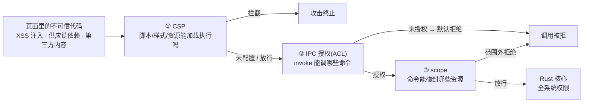

import { Canvas, Controls, Meta } from '@storybook/addon-docs/blocks';
import * as Security from './security.stories';

<Meta of={Security} name="Docs" />

# 安全加固

Tauri 的安全模型一句话就能立起来:**WebView 里跑的代码按不可信处理**——它唯一能触达系统的通道是 IPC,而 Rust 核心手握全系统权限。加固因此不是"找一个安全开关",而是把「页面 → 核心」之间的口子逐个收窄:**CSP** 管脚本与资源能不能加载执行,**IPC 授权(ACL)** 管 invoke 能调哪些命令,**scope** 管授权命令能碰到的资源范围。本课把散落在 `tauri.conf.json` 与 capabilities 里的安全配置串成一份加固清单:CSP 怎么写、能力按什么原则收、哪些暴露面最容易被顺手打开;下方的实例把「一份配置 × 一类攻击」做成可调模拟——切换 CSP 档位、勾开 withGlobalTauri,读数直接给出攻击停在哪道防线。

本课从"收紧"的视角引用相邻课程:ACL 的文件格式与匹配机制见[权限与能力](?path=/docs/capabilities--docs),http 的 URL scope 见[网络请求](?path=/docs/http--docs),asset 协议的 scope 与路径解析见[自定义协议](?path=/docs/custom-protocol--docs),这里不重复展开。

一次危险动作从页面到核心,要按顺序连过三道门——哪道先拦住,攻击就停在哪:



本课用到的默认值与回查要点(配置参考为准):

| 项 | 默认值 | 回查要点 |
| --- | --- | --- |
| `app.security.csp` | 不设(页面无策略) | 配了才启用;`connect-src` 必须含 `ipc: http://ipc.localhost` |
| `app.security.devCsp` | 不设(沿用 `csp`) | 只在页面经自定义协议加载的 dev 场景生效 |
| `dangerousDisableAssetCspModification` | `false` | 关掉 nonce/hash 自动注入 = 自废 CSP 主防线 |
| `app.withGlobalTauri` | `false` | 开启后全套 API 挂在 `window.__TAURI__` |
| `app.security.freezePrototype` | `false` | 冻结 `Object.prototype` 防原型链污染,可能破坏扩展内置原型的库 |
| `app.security.pattern` | `brownfield` | `isolation` 让 IPC 过沙箱 iframe 审计 |
| `assetProtocol` | `enable: false`、`scope: []` | 开了必须配 scope(细节见[自定义协议](?path=/docs/custom-protocol--docs)) |
| capability 的 `local` | `true` | 远程页面要显式 `remote.urls`(见[权限与能力](?path=/docs/capabilities--docs)) |

## 快速上手

前提:沿用[第一个应用](?path=/docs/first-app--docs)生成的工程。最小闭环:配一份收紧的 CSP,并知道去哪里确认它真的在拦。

1. 在 `tauri.conf.json` 里加上 CSP:

```json
{
  "app": {
    "security": {
      "csp": {
        "default-src": "'self'",
        "connect-src": "'self' ipc: http://ipc.localhost",
        "img-src": "'self' asset: http://asset.localhost data:",
        "style-src": "'self'"
      }
    }
  }
}
```

`connect-src` 里的 `ipc: http://ipc.localhost` 是 IPC 通道,漏掉它所有 invoke 直接失败;`asset:` / `http://asset.localhost` 是 asset 协议的来源,不用 asset 协议可以去掉。

2. 记住一个反直觉的事实:dev 下控制台**看不到** CSP 生效——`tauri dev` 的页面来自 devUrl(如 `http://localhost:1420`),由开发服务器直供,不经 Tauri 的自定义协议,注入不发生。CSP 的验证要用构建产物:`npm run tauri build -- --debug`,运行产物。

3. 在产物的 WebView 里打开 devtools(调试构建默认可开),在 console 里试一段注入:

```js
// 无 nonce 的内联脚本,应被 CSP 拦截
const s = document.createElement('script');
s.textContent = 'console.log("XSS 得手")';
document.head.appendChild(s);
```

预期:控制台报 `Refused to execute inline script because it violates the following Content Security Policy directive: "script-src …"`——自动注入的 nonce/hash 只放行打包脚本,注入脚本没有 nonce。这就是门 ① 的工作方式;其余防线各就各位后,一次真实攻击要连过三道门,见「攻击链判定」。真实运行时里逐项核对暴露面开关的步骤,见本目录 `runtime-verification.md`。

## CSP

CSP(Content Security Policy)回答门 ① 的问题:**允许这个页面从哪里加载、执行什么**。它写在 `app.security.csp`,值是一个对象(指令 → 来源列表)或一整串策略文本——不设就没有任何策略,页面与普通网页无异。这是本课清单里成本最低、收益最直接的一项:纯配置、零运行时代价,官方对 CSP 页的定位就是"帮你确保 WebView 被保护的关键配置"。

### 指令与最小策略

Tauri 应用最常打交道的指令:

| 指令 | 管什么 | Tauri 应用要点 |
| --- | --- | --- |
| `default-src` | 其余未列指令的兜底 | 一般给 `'self'` |
| `script-src` | 脚本加载与执行 | 收紧的核心;Tauri 自动追加 nonce/hash(见下一小节) |
| `style-src` | 样式 | UI 框架常注入内联样式,可酌情 `'unsafe-inline'`——只放开样式,别放开脚本 |
| `connect-src` | fetch / XHR / WebSocket / IPC | IPC 通道必须含 `ipc: http://ipc.localhost` |
| `img-src` | 图片 | 用 asset 协议需含 `asset: http://asset.localhost` |
| `font-src` | 字体 | 引外部字体才需要 |

来源语法与标准 CSP 一致(scheme、host、端口、路径逐段匹配)。官方 [Tauri api 示例](https://tauri.app/security/csp/)的策略可供对照:

```json
"csp": {
  "default-src": "'self' customprotocol: asset:",
  "connect-src": "ipc: http://ipc.localhost",
  "font-src": ["https://fonts.gstatic.com"],
  "img-src": "'self' asset: http://asset.localhost blob: data:",
  "style-src": "'unsafe-inline' 'self' https://fonts.googleapis.com"
}
```

两条官方警告直接决定策略的形状:**避免加载远程内容,尤其是 CDN 上的脚本**——每一个允许的脚本来源都是一条攻击通道(域被劫持、包被投毒,脚本就在你的页面里执行);策略要**收到尽可能紧**,只允许你信任、最好拥有的主机。确实需要 WebAssembly 时,给 `script-src` 加 `'wasm-unsafe-eval'`(这是官方认可的最小放开,等价于 `unsafe-eval` 的笼统放行不要用)。

### nonce/hash 自动注入

手写 CSP 最头疼的是"自家脚本怎么放行"。Tauri 替你做了:构建时解析前端产物,给打包脚本按内容算 hash、给脚本与样式标签注入 nonce,再把这些来源自动追加进策略,并保证 `'self'` 在场。结果是你只声明"允许哪些域",打包代码照常运行,来路不明的内联与外域脚本不执行——这正是快速上手第 3 步看到的效果。

三点边界:

- 自动注入只作用于 `script-src` 与 `style-src` 两个指令(源码中 `can_modify` 仅检查这两处)。
- `dangerousDisableAssetCspModification` 关闭它:布尔 `true` 全关,或给指令数组(如 `["script-src"]`)只关脚本注入。官方警告写在字段旁边:关掉后若没有手工配好等价策略,应用可能暴露于 XSS——它是与极少数动态内联脚本场景的逃生门,不是开关。
- 策略太紧与注入机制冲突(比如必须运行一段无法预测内容的内联脚本)时,优先把该脚本改成打包产物,其次才是动这个开关。

### dev 与生产

- `devCsp` 只作用于 dev;未设时沿用 `csp`。
- 但注入发生在 Tauri 处理、下发 HTML 的时候:dev 页面经 devUrl 由开发服务器直供,不经自定义协议,CSP 不生效。所以 **CSP 的验收以构建产物为准**,dev 控制台干净不代表策略没配错。

## 能力收紧原则

门 ② 的机制——capability 文件、权限命名、窗口匹配、拒绝排查——见[权限与能力](?path=/docs/capabilities--docs),这里只讲把已有授权"收紧"的三条原则。共同前提是 ACL 的默认拒绝:没有声明就是拒绝,所以收紧不是加锁,而是**减少已交出去的钥匙**。

1. **default 集起步,发布前收成显式条目。** `core:default`、`fs:default` 是官方安全基线,内容随插件版本演进;对外发布的应用把关键插件换成显式 `allow-<命令>` + scope 的对象形式,调用面可预测,升级插件时不被动。
2. **应用自建命令也在授权面上。** `generate_handler!` 注册的命令默认不经 ACL,所有本地窗口都能调;用 `tauri_build::AppManifest::new().commands(&["greet"])` 把敏感命令纳入管控——这是收紧时最容易漏的暴露面。
3. **scope 授权到资源,不只到命令。** 命令放行不等于资源可达:fs 用 `$APPDATA/**` 而不是 `$HOME/**`,http 白名单精确到域名与路径前缀,asset 协议 scope 只开资源目录。scope 写宽了,门 ② 只拦"错的命令",拦不住"对的命令碰到不该碰的资源"。

## 危险暴露面

下面这些配置默认关闭或收紧,但"顺手打开"的门槛很低——有的为了图省事,有的为了接一个第三方需求。认识它们,发布前逐个过一遍;每一项打开都写得出理由,才留得住。

### withGlobalTauri

`app.withGlobalTauri: true` 时,Tauri 把整套 API 注入 `window.__TAURI__`。不用打包器直接写 `<script>` 的项目靠它调 API;用了打包器的项目一律 `import { invoke } from '@tauri-apps/api/core'`,没有理由打开它。

为什么它算暴露面:注入后,页面里的**所有**代码——包括注入脚本与几百个 npm 传递依赖——都多了一条不需要任何打包器知识的调用捷径。注意边界:不开它并不等于"脚本调不到 IPC",IPC 桥本身对页面开放,ACL 才是真正的门;withGlobalTauri 的意义是**不主动降低利用门槛**。

### 远程内容:remote 授权与隔离模式

远程页面(iframe 或独立窗口加载的外域 URL)默认零授权:capability 的 `local` 默认 `true`,`remote.urls` 不写就不放行。确实要授权时(URL 收到具体子域或路径,权限只给必需命令):

```json
{
  "identifier": "partner",
  "windows": ["partner-*"],
  "remote": { "urls": ["https://partner.example"] },
  "permissions": ["core:default"]
}
```

另一条要记住的边界:Linux 与 Android 上 Tauri 无法区分 iframe 与页面本身的请求,嵌入第三方内容前先想清楚。需要更强隔离时用隔离模式——`app.security.pattern` 设为 `{"use": "isolation", "options": { "dir": "../dist-isolation" }}`:所有 IPC 消息先经过一个跑在沙箱 iframe 里、由你编写的隔离应用(`window.__TAURI_ISOLATION_HOOK__` 钩子可校验或拒绝消息),经 AES-GCM 加密转发到核心。代价是前端多一个构建产物;它的目标威胁正是"前端被第三方脚本污染"这类开发期风险,对供应链要求高的应用值得上。

### freezePrototype

`app.security.freezePrototype: true` 在每个 webview 的任何前端代码执行前运行 `Object.freeze(Object.prototype)`:脚本无法再增删改 `Object.prototype` 上的属性,原型链污染(前端攻击常见的跳板,被污染的对象可能一路污染到 Tauri API 依赖的内部对象)这条路被堵死。代价是会破坏扩展内置原型的库(polyfill、部分旧框架),它是全局开关、不能按窗口豁免——上线前全量回归。

### asset 与自定义协议的来源

asset 协议(`convertFileSrc`)与自定义协议把本地文件和内容暴露给页面,是两个容易漏配的口子:CSP 侧,对应指令(`img-src` 等)要放行 `asset: http://asset.localhost` 这类来源,否则资源加载被门 ① 拦截;scope 侧,`assetProtocol.enable` 默认 `false`、`scope` 默认空——开了协议就必须配 scope,不给协议默认拒绝。scope 的写法与路径解析见[自定义协议](?path=/docs/custom-protocol--docs)。

## 攻击链判定

三道门的判定顺序:**① CSP(加载执行)→ ② IPC 授权(ACL)→ ③ scope(资源范围)**。CSP 未配置时门 ① 直接敞开——这是它位列加固清单第一项的原因;脚本一旦执行,剩下的门只能限制伤害,拦不住执行本身。

下面的实例把判定做成可调模拟:左栏按开关画出 `tauri.conf.json` 与 capabilities 的关键片段,右栏按所选攻击重放它要过的门,读数给出结果与拦截层:

<Canvas of={Security.Interactive} />
<Controls of={Security.Interactive} />

| 读者操作 | 可观察证据 |
| --- | --- |
| 「内联脚本注入」,CSP 从「未配置」切到「收紧(仅 self)」 | ① CSP 从放行变拦截:打包脚本靠自动注入的 nonce/hash 放行,注入脚本没有 |
| 「CDN 脚本注入」+「宽松(带 CDN)」 | ① CSP 放行——域在 script-src 白名单里,防线移交给了那个域;换「收紧」立即拦截 |
| 脚本类攻击得手的状态下勾开 `withGlobalTauri` | ② 一行的依据与结论变化:注入脚本可直接拿到 `window.__TAURI__` 全套 API |
| 「远程页面调 IPC」+ 勾上「capability 授权 remote 域」 | ② ACL 从拦截(默认零授权)变放行,远程页面按权限并集拿到命令 |
| 「fs 越出应用目录」 | ② ACL 放行(`fs:default` 含该命令),③ scope 拦截(`path not allowed`)——命令授权不等于资源可达 |
| 打开 Show code | 看到该 Canvas 实际执行的 `example.ts` |

## 最佳实践

- **加固顺序按"越便宜越先"。** CSP 是纯配置、零运行时代价的一道门,先配上;再收 capabilities(default 集 → 显式 allow + scope);freezePrototype、isolation 这类有兼容或构建代价的项放最后,按需启用。
- **每个"允许"都要能回答"为什么"。** script-src 里的每个域、capabilities 里的每条权限、scope 里的每个路径——答不上来的就删。允许列表只会越加越宽,不会自己变窄,发布前逐项过一遍。
- **危险开关视为逃生门。** `dangerousDisableAssetCspModification`、`'unsafe-eval'`、remote 授权、`withGlobalTauri`……每一项打开前写一句理由,发布前再确认仍然必要——每打开一个,失去的都是一道默认防线。
- **依赖也是攻击面。** 前端几十上百个传递依赖最终都跑在能 invoke 的页面上;`npm audit` / `cargo audit` 进 CI、锁定版本,对供应链要求高的应用启用 isolation 模式。
- **分层验证,不混证据。** ACL 的放行与拒绝在 dev 下可直接验证(见[权限与能力](?path=/docs/capabilities--docs)的排查一节);CSP 只能以构建产物验证(本课「常见问题」)。dev 里的"一切正常"对这两类证据的含义完全不同。

## 常见问题

- 配了 CSP 后,console 报 `Refused to … violates Content Security Policy directive …`
  先看被拦的是哪个指令、哪个来源:自家打包脚本被拦,检查是否关了 `dangerousDisableAssetCspModification`(自动注入失效);第三方来源被拦,先评估它是否必要——必要就把来源加进对应指令,不必要就删。不要用 `'unsafe-inline'` / `'unsafe-eval'` 一刀切放行脚本,那等于把门 ① 拆了。
- dev 里一切正常,打包后功能被 CSP 拦截(或反之)
  预期行为:dev 页面经 devUrl 由开发服务器直供,不经 Tauri 的自定义协议,CSP 注入在 dev 不发生。CSP 只能以 `tauri build` 产物(可用 `--debug`)验证;`devCsp` 未设时沿用 `csp`,但它同样只在页面经自定义协议加载的 dev 场景下生效。
- CSP 配上之后,所有 invoke 都失败了
  `connect-src` 漏了 IPC 通道:补上 `ipc: http://ipc.localhost`(不确定平台写法时,直接照抄官方示例整段)。
- 前端要用 WebAssembly 或 eval
  WASM 前端在 `script-src` 加 `'wasm-unsafe-eval'`,这是官方认可的最小放开;`'unsafe-eval'` 会把脚本引擎整体敞开,尽量不进发布构建。
- freezePrototype 开了之后某个前端库坏了
  预期行为:该库在扩展内置原型(polyfill、部分旧框架)。处理:先看能否升级或替换;不能,就在"原型链防护"与"这个库"之间二选一——它是全局开关,不能按窗口豁免。

## 总结回顾

摘要:WebView 里的代码按不可信处理,加固就是把「页面 → 核心」之间的三道门逐个收窄。CSP 写在 `app.security.csp`,不设等于无策略;`connect-src` 必须含 IPC 通道,构建期自动注入的 nonce/hash 只放行自家脚本与样式,`dangerousDisableAssetCspModification` 是逃生门;dev 页面经 devUrl 直供、注入不发生,CSP 验收以构建产物为准。能力收紧三条:default 集发布前收成显式 allow + scope,应用自建命令用 `AppManifest` 纳入 ACL,scope 授权到资源层。危险暴露面各有默认关闭的开关——`withGlobalTauri`、remote 授权(与 isolation 模式)、`freezePrototype`、asset 协议 scope——每一项打开都该写得出理由。一次攻击要连过 CSP → ACL → scope,哪道先拦住就停在哪。

一句话:

> 页面里的代码按不可信处理:CSP 管它能不能跑,ACL 管它能调什么,scope 管它碰得到什么——三道门各自收紧,攻击才停在半路。

知识要点:

- `csp` 配在哪、默认是什么?为什么 `connect-src` 必须含 `ipc: http://ipc.localhost`?
- nonce/hash 自动注入做了什么?`dangerousDisableAssetCspModification` 关掉的是什么、代价是什么?
- 为什么 dev 控制台验证不了 CSP?正确的验收方式是什么?
- 能力收紧的三条原则是什么?应用自建命令默认受 ACL 管控吗?
- `withGlobalTauri`、remote 授权、`freezePrototype`、`assetProtocol` 各默认是什么、打开的代价是什么?
- 一次脚本注入要连过哪三道门?每道门分别拦什么?

## 参考资料

- [Security 概览 - Tauri 官方文档](https://tauri.app/security/)
  信任边界(WebView 不可信、IPC + capabilities 是唯一通道)、安全子页入口、"应用安全是自身与依赖之和"的来源。
- [CSP - Tauri 官方文档](https://tauri.app/security/csp/)
  `csp` 配置示例、`connect-src` 的 IPC 通道、nonce/hash 自动注入、`wasm-unsafe-eval`、"避免 CDN 脚本"警告的来源。
- [配置参考 - Tauri 官方文档](https://tauri.app/reference/config/)
  `csp` / `devCsp` 定义、`dangerousDisableAssetCspModification`、`freezePrototype`、`pattern`、`assetProtocol`、`withGlobalTauri` 的默认值与字段说明。
- [Capabilities - Tauri 官方文档](https://tauri.app/security/capabilities/)
  `local` / `remote` 字段与远程授权边界的来源(匹配机制细节归[权限与能力](?path=/docs/capabilities--docs)一课)。
- [Isolation Pattern - Tauri 官方文档](https://tauri.app/concept/inter-process-communication/isolation/)
  隔离模式的威胁模型、`pattern.use: "isolation"` 配置、`__TAURI_ISOLATION_HOOK__`、AES-GCM 通道与 Windows 限制的来源。
- [tauri 源码:tauri-utils/src/config.rs](https://github.com/tauri-apps/tauri/blob/dev/crates/tauri-utils/src/config.rs)
  `devCsp` 未设时 dev 沿用 `csp`、`DisabledCspModificationKind` 的布尔/指令列表取值、`freezePrototype` 行为注释的来源。
- [tauri 源码:crates/tauri/src/manager/mod.rs](https://github.com/tauri-apps/tauri/blob/dev/crates/tauri/src/manager/mod.rs)
  nonce/hash 注入只作用于 `script-src` / `style-src`、CSP 经自定义协议响应头下发的来源。
