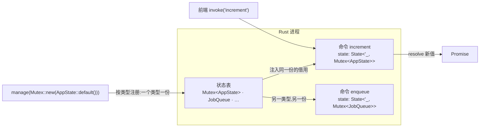

import { Canvas, Controls, Meta } from '@storybook/addon-docs/blocks';
import * as State from './state.stories';

<Meta of={State} name="Docs" />

# 状态

[命令](?path=/docs/commands--docs)一课讲了一次调用如何往返,但没讲**两次调用之间**:命令函数一返回,栈上的局部变量就销毁了,`let mut counter = 0u32;` 写在命令里永远存不下值。本课补上这一块——**托管状态(managed state)是按类型存放的应用级单例**:用 `manage` 注册一个值,Tauri 把它放进 Rust 进程内一张按类型索引的状态表,所有命令、以及 Rust 侧任何拿到应用句柄的地方,都能通过 `State<'_, T>` 拿到**同一份**的借用;要改它,得把数据包进 `Mutex` 这类容器,用锁换一次受控的写。

建立这个直觉后,你应该能预测:命令参数里的类型和注册的类型对不上,`invoke` 会在运行时被 reject(报 "state not managed");不包容器直接改状态,编译不过(Rust 不允许通过共享引用写数据);async 命令里拿 std 锁跨过 `.await`,同样编译不过——这些"不动手跑也知道结果"的判断,正是本课要建立的手感。



关键输入与默认行为:

| 项 | 默认 / 规则 | 回查要点 |
| --- | --- | --- |
| 注册 | `Builder::manage(...)` 或 `setup` 里 `app.manage(...)` | 同类型重复注册:Builder 上 panic,`app.manage` 返回 `false` 并保留原值 |
| 类型要求 | `T: Send + Sync + 'static` | 共享可变必须包 `Mutex` / `RwLock` / 原子类型 |
| 命令访问 | `state: State<'_, T>` 由 Tauri 注入,不占 invoke 参数 | `State` 可 Deref 到 `T`;类型与注册不符 → invoke reject |
| Rust 侧访问 | `app.state::<T>()` | 未注册时 panic;`try_state::<T>()` 返回 `Option` |
| `Arc` | 不需要自己包,Tauri 内部已包 | 要跨线程传的是 `AppHandle`,不是状态本身 |
| async 命令 | 参数含 `State<'_, T>` 时必须返回 `Result` | std 锁的 guard 不可跨 `.await`;跨 await 用 `async_runtime::Mutex` |
| 生命周期 | 从注册到应用退出 | 窗口刷新不重置;应用退出即丢,落盘见[文件与持久化](?path=/docs/persistence--docs) |

## 快速上手

前提:已有[第一个应用](?path=/docs/first-app--docs)生成的 react-ts 工程,命令的定义与注册规则见命令课。让一条计数器跨调用存活,共两步:

1. 定义状态结构与命令,注册到 Builder(`src-tauri/src/lib.rs`)——`Mutex` 让共享数据可变,本节先用后讲(见容器一节):

```rust
use std::sync::Mutex;
use tauri::State;

#[derive(Default)]
struct AppState {
    counter: u32,
}

#[tauri::command]
fn increment(state: State<'_, Mutex<AppState>>) -> u32 {
    let mut app = state.lock().unwrap(); // 拿锁;guard 出作用域时自动解锁
    app.counter += 1;
    app.counter
}

// 在模板 run 函数的 Builder 链上加两处:manage 注册 + generate_handler 收录
tauri::Builder::default()
    // 注册:这个类型从此有且只有这一份,放进程级状态表里
    .manage(Mutex::new(AppState::default()))
    .invoke_handler(tauri::generate_handler![increment])
    .run(tauri::generate_context!())
    .expect("error while running tauri application");
```

2. 前端调用——`State` 参数不占 invoke 参数,调用时什么都不用传:

```tsx
// src/App.tsx(节选)
import { useState } from 'react';
import { invoke } from '@tauri-apps/api/core';

export default function App() {
  const [counter, setCounter] = useState(0);

  return (
    <button onClick={async () => setCounter(await invoke<number>('increment'))}>
      计数:{counter}
    </button>
  );
}
```

验证:`npm run tauri dev` 后连点按钮,数字逐次累加——`counter` 活在两次调用之间。在窗口里刷新前端(Cmd+R 或菜单「重新加载」),数字**不归零**:它存在 Rust 进程里,不在前端;重启应用后归零——托管状态是内存态,不落盘。这两个现象就是托管状态生命周期(注册到退出)的直接证据。

## 注册:manage 与类型槽

「类型槽」是理解托管状态的模型:状态表是一排按**类型**索引的槽,`manage(T)` 把一个值放进 `T` 对应的槽,`State<'_, T>` 按同样的类型来取——所以一个类型只有一份,想注册第二个同类型值,就得造一个新类型(见下文 newtype)。

注册有两个惯用位置,效果相同:

```rust
// 位置一:Builder 链式,build/run 之前;注册固定值或无需应用信息的结构
tauri::Builder::default()
    .manage(Mutex::new(AppState::default()))
    .run(tauri::generate_context!())
    .expect("error while running tauri application");

// 位置二:setup 里注册;需要先读应用配置、路径等再初始化状态时用
.setup(|app| {
    app.manage(AppData {
        version: app.config().version.clone(),
    });
    Ok(())
})
```

围绕「一个类型一份」的几条硬规则:

- **重复注册不报错的位置差异**:`Builder::manage` 遇到同类型已注册会 **panic**(`state of type ... is already being managed`);运行中的 `app.manage(...)` 不 panic,返回 `bool`——已有该类型时返回 `false` 且保留原值,新值被丢弃。
- **Rust 侧访问**:`app.state::<T>()` 返回 `State<'_, T>`,任何实现 `Manager` 的对象(`App`、`AppHandle`、`WebviewWindow`)都能调;**类型未注册时 panic**。不确定就先用 `try_state::<T>()`,拿到 `Option`。`AppHandle` 廉价可克隆,把状态逻辑搬进普通线程或任务时,传 `AppHandle` 再 `state()` 取状态即可,不需要 `Arc`。
- **想删掉已注册的状态?** `unmanage` 自 2.3.0 起已弃用——移除会让还在使用的 `State` 引用悬空。需要"清空"语义时,把状态定义成 `Mutex<Option<T>>`,用 `Option::take` 置空。
- **注册时机**:命令首次被调用前完成即可;惯例是在 Builder 链或 `setup` 里,和 `invoke_handler` 放在一起,一眼可查。

同一类型的多个实例用 newtype 各占一槽:

```rust
struct PrimaryDb(Mutex<Connection>);   // State<'_, PrimaryDb>
struct ReplicaDb(Mutex<Connection>);   // State<'_, ReplicaDb> —— 与上面互不相干
```

## 命令内访问 State

命令参数表里放一个 `State<'_, T>`,Tauri 就在分发命令时按 `T` 查槽,把那份状态的借用注入进来——和 `AppHandle` 一样属于注入参数,前端 `invoke` 的参数对象里没有它,类型对不上也与它无关。

访问方式是直接 Deref(`State` 实现了 `Deref<Target = T>`),`state.inner()` 也能拿到 `&T`,但通常不需要:

```rust
#[tauri::command]
fn increment(state: State<'_, Mutex<AppState>>) -> u32 {
    let mut app = state.lock().unwrap();
    app.counter += 1;
    app.counter
}
```

两条签名规则:

- **async 命令返回 `Result`**:`State<'_, T>` 是借用类型,放进 `async fn` 签名后必须把返回值包进 `Result`(命令课「异步命令」一节讲过的通用规则),返回时 `Ok(...)` 包住。
- **类型必须与注册的逐字一致**:注册的是 `Mutex<AppState>`,命令就得写 `State<'_, Mutex<AppState>>`——写成 `State<'_, AppState>` 差了这层 `Mutex` 包装,就是**另一个类型**,槽里查不到。

对不上不是编译错误:两端隔着 IPC,Rust 侧的 `State<AppState>` 本身是合法类型,编译照过;问题在**运行时**暴露——invoke 被 reject,错误信息形如 `state not managed for field state on command increment. You must call .manage() before using this command`。

下面的实例把一次调用拆开演:左边是前端面板和状态表的两个类型槽(槽内数值跨场景累积,模拟「状态一直活着」),右边是命令的执行步骤。用「演示命令」切换四种调用,观察槽查找、锁的占用与释放、Promise 的结算。Canvas 是浏览器里的模拟,不运行 Tauri;要在本机用真实 Tauri 核对,按课程目录 `runtime-verification.md` 的最小步骤操作:

<Canvas of={State.Interactive} />
<Controls of={State.Interactive} />

| 读者操作 | 可观察证据 |
| --- | --- |
| 「演示命令」选 increment | `Mutex<AppState>` 槽的锁行短暂点亮为「increment 持有」,counter +1,Promise resolve 新值 |
| 切到 add-item 再切回 increment | counter 在上次结果上**继续累加**——两次调用之间状态一直存活 |
| 选 add-item | 同一个槽的另一字段 items +1,counter 不变——两个命令共享同一份 `AppState` |
| 选 wrong-type | 命令签名里的类型没有对应槽,Promise rejected,读数显示 "state not managed…",状态值不变 |
| 选 slow-job | `JobQueue` 槽的锁被 start_job 跨 await 持有,enqueue 排队等待、锁释放后才获锁;`AppState` 槽的锁全程空闲 |
| 打开 Show code | 看到该 Canvas 实际执行的 `example.ts` |

## 容器:Mutex、RwLock 与原子类型

`State<'_, T>` 给命令的是 `&T`——一份共享的不可变借用,而且 `T` 必须 `Send + Sync`。想通过 `&T` 直接写字段,Rust 编译器直接拒绝:多个线程同时共享一个值时,裸写会造成数据竞争,这是所有权规则在挡,不是 Tauri 在挡。出路是**内部可变性**:把可变的部分包进容器,容器在共享引用之上提供受控的写。选哪个容器:

| 容器 | 适用 | 关键点 |
| --- | --- | --- |
| `std::sync::Mutex<T>` | 一般共享可变数据 | 独占;`lock()` 返回 `Result`(毒化);guard 出作用域自动释放 |
| `std::sync::RwLock<T>` | 读多写少 | `read()` 可多路并发,`write()` 独占 |
| 原子类型(`AtomicU32` 等) | 单个数值的计数、标志 | 无锁,不毒化,最轻 |
| `tauri::async_runtime::Mutex<T>` | async 命令要**跨 await 持锁** | `lock().await`;guard 可跨 await;不毒化(见锁与 async 一节) |

### Mutex:独占写

最常用的选择。`lock()` 拿到的 guard 存活多久,锁就占多久——guard 掉出作用域,锁自动释放,没有「忘记解锁」这回事:

```rust
use std::sync::Mutex;

#[tauri::command]
fn increment(state: State<'_, Mutex<AppState>>) -> u32 {
    let mut app = state.lock().unwrap(); // 临界区开始:同一时刻只有这一个命令能进来
    app.counter += 1;
    app.counter
} // guard 在这里出作用域,锁自动释放
```

`lock()` 返回 `Result` 的原因是**毒化**:持锁的命令 panic 过,锁会被标记有毒,后续 `lock()` 返回 `Err`。小应用直接 `.unwrap()` 即可;不想让一次 panic 污染后续所有调用,用 `.unwrap_or_else(|e| e.into_inner())` 绕过标记继续拿数据。

### RwLock:读多写少

读操作彼此不打架,写操作独占——适合状态大部分时间在被读、偶尔被写:

```rust
use std::sync::RwLock;

#[tauri::command]
fn stats(state: State<'_, RwLock<AppState>>) -> u32 {
    let app = state.read().unwrap(); // 共享读:多个命令可同时持有
    app.counter
}

#[tauri::command]
fn bump(state: State<'_, RwLock<AppState>>) -> u32 {
    let mut app = state.write().unwrap(); // 独占写:等所有读者离开
    app.counter += 1;
    app.counter
}
```

判断:写频繁或临界区极短时,RwLock 相比 Mutex 没有优势甚至更慢;确认读多写少再换,不为直觉买单。

### 原子类型:计数与标志

状态只是单个数值时,连容器都可以省——原子类型在共享引用上直接做加减,无锁无毒化无死锁:

```rust
use std::sync::atomic::{AtomicU32, Ordering};

#[derive(Default)]
struct Stats {
    requests: AtomicU32,
}

#[tauri::command]
fn bump(state: State<'_, Stats>) -> u32 {
    state.requests.fetch_add(1, Ordering::Relaxed) + 1
}
```

复杂结构才需要 `Mutex`;整份状态里只有一个计数器,原子类型是最短路径。

## 锁与 async 命令

判断点只有一个:**临界区里有没有 `.await`**。

std `Mutex` 的 guard(`MutexGuard`)不是 `Send`,而 async 命令的 future 会被 `async_runtime` 派发到异步执行器——future 必须 `Send`。guard 一旦跨过 `.await`,future 就带着它变成了 `!Send`,编译报 `future cannot be sent between threads safely`:

```rust
// 编译不过:guard 跨过了 .await
#[tauri::command]
async fn slow_increment(state: State<'_, Mutex<AppState>>) -> Result<u32, ()> {
    let mut app = state.lock().unwrap();
    tokio::time::sleep(std::time::Duration::from_secs(1)).await; // ← 锁在这里跨过 await
    app.counter += 1;
    Ok(app.counter)
}
```

两种解法,按需选择:

- **解法一:临界区收窄,guard 不跨 await。** 官方文档引用 Tokio 的结论:异步代码里用 std `Mutex` 处理纯数据通常没问题且更推荐——只要同步块内拿锁、改完就放,再做 await 的活:

```rust
#[tauri::command]
async fn increment(state: State<'_, Mutex<AppState>>) -> Result<u32, ()> {
    // 同步块内拿锁、改完立刻释放,锁不会被 await 拖住
    let value = {
        let mut app = state.lock().unwrap();
        app.counter += 1;
        app.counter
    };
    save_to_disk(value).await; // 锁已释放,其他命令不被阻塞
    Ok(value)
}
```

- **解法二:确实需要跨 await 持锁时,用异步锁。** `tauri::async_runtime::Mutex` 就是 tokio `sync::Mutex` 的再导出:`lock()` 是 async 方法,guard 设计上可以跨 await;等待锁的其他任务按先来后到排队,不会被饿死:

```rust
use tauri::async_runtime::Mutex;

#[tauri::command]
async fn enqueue(state: State<'_, Mutex<JobQueue>>) -> Result<usize, ()> {
    let mut queue = state.lock().await; // async 锁:guard 可以跨 await
    queue.jobs.push(next_job());
    Ok(queue.jobs.len())
} // guard 出作用域释放;持有期间其他 lock().await 一直排队
```

异步锁的代价与边界:比 std 锁慢;**跨 await 持锁意味着整个 await 期间锁被占着**,其他命令全部排队——所以只有「持锁的活本身就是 await 的活」(如持锁写文件、独占一个连接)才值得用它。另外它不毒化:持锁的任务 panic 只会释放锁,不会标记。异步锁主要面向共享 IO 资源的场景;数据库连接这类资源,官方建议再包一层带非 async 方法的结构。

实例核对:切到 slow-job 场景,`start_job` 在 await(写文件)期间锁行一直显示「start_job 持有(await)」;`enqueue` 的 `lock().await` 排队,锁释放后才获锁并 `jobs += 1`。同一时刻 `AppState` 槽的锁全程空闲——**不同类型槽是不同的锁**,这正是「按域拆状态」能减小锁争用的原因。

## 与 React 状态的分工

托管状态不是把前端状态搬进 Rust 的理由。判断入口:**这份数据活在哪、被谁用**:

| 数据 | 放哪 | 原因 |
| --- | --- | --- |
| 表单草稿、选中项、折叠展开等 UI 态 | React(`useState`) | 只活在当前窗口的 JS 上下文里 |
| 跨窗口共享的(任务队列、登录态、后台进度) | Rust 托管状态 | 每个窗口是独立 JS 上下文,前端状态天然不互通 |
| 与系统能力绑定的(连接池、下载任务、硬件句柄) | Rust | 资源与生命周期都在 Rust 侧 |
| 重启后还要在的 | 先入托管状态,再落盘 | 托管状态是内存态;持久化见[文件与持久化](?path=/docs/persistence--docs) |

前端呈现托管状态的标准模式:**操作 → 返回新值 → setState**。让命令在修改后返回最新值(或整份快照),前端拿到什么显示什么,不需要额外的一致性协议:

```tsx
const [items, setItems] = useState<string[]>([]);

const addItem = async (title: string) => {
  // 命令 push 后返回最新的列表,前端用它同步界面
  setItems(await invoke<string[]>('add_item', { title }));
};
```

两条边界:

- **Rust 改了状态,界面不会自己变。** 命令返回值只覆盖「前端发起的修改」;Rust 侧自发的变化(后台任务推进、另一窗口的修改)要靠 `emit` 事件广播,前端订阅更新——见[事件](?path=/docs/events--docs)一课。
- **初值要么拉,要么预填。** 组件挂载时 `invoke` 拉一次;或者干脆在 `setup` 里注册状态前把初始值算好,第一条命令被调用时数据已经就位。

## 最佳实践

- **容器选择照表执行,别凭感觉升级。** 单个数值用原子类型;一般共享数据用 `std::sync::Mutex`;确认读多写少才换 `RwLock`;只有跨 await 持锁的真实需求才引入 `async_runtime::Mutex`。全用最强的锁,代价(更慢、更难排查)是全量付的。
- **临界区越短越好。** 锁内只做读写内存,不做 IO、不 `await`、不调用会再次拿锁的函数;需要的数据先 clone 出锁外再处理。实例 slow-job 场景里 enqueue 的排队时间,就是 start_job 临界区长度的直接代价。
- **用 type alias 固定注册类型。** 状态的实际类型多层包装(`Mutex<AppState>`),手写两遍容易差一层。集中定义一次,注册与命令两端共用:

```rust
type AppStateRef = Mutex<AppState>;

// 注册:类型名只在这里展开一次
tauri::Builder::default()
    .manage(AppStateRef::default())
    .invoke_handler(tauri::generate_handler![increment])
    .run(tauri::generate_context!())
    .expect("error while running tauri application");

#[tauri::command]
fn increment(state: State<'_, AppStateRef>) -> u32 { /* … */ }
```

  注意 alias 只解决「写错拼不上」,别把 `Mutex` 包两层(`Mutex<Mutex<T>>`)——那会编译出另一种拿不到锁的错。
- **按域拆类型,缩小锁的覆盖面。** 不相干的数据拆成几个槽(如 `Mutex<AppState>` 与 `async_runtime::Mutex<JobQueue>`),各用各的锁,互不阻塞;塞进一份大状态 + 一把大锁,所有命令都在排队。
- **注册位置统一一种。** Builder 链或 `setup` 二选一,团队内固定;`app.manage` 返回的 `bool` 可在测试里断言注册成功,不需要额外机制。

## 常见问题

- `invoke` reject,报错含 `state not managed for field` 字样
  状态没注册,或命令参数类型与注册类型不一致。核对两处:`manage(...)` 是否注册了该类型;命令签名是否写了注册时的**完整类型**(注册 `Mutex<AppState>` 就得写 `State<'_, Mutex<AppState>>`,差一层包装就是查不到)。实例 wrong-type 场景复现了这个报错。
- 在 `setup` 或窗口事件里调 `app.state::<T>()` 直接 panic
  Rust 侧 `state()` 对未注册类型是 panic(错误信息 `state not found for type ...`),与命令路径的 reject 不同。防御性访问用 `try_state::<T>()` 拿 `Option`;命令参数写法的「未注册」只表现为 invoke reject,不会 panic 进程。
- async 命令里 `state.lock().unwrap()` 后编译报 `future cannot be sent between threads safely`
  std 锁的 guard 跨过了 `.await`。把拿锁改写进同步块、guard 用完即弃(解法一),或换 `tauri::async_runtime::Mutex` 用 `lock().await`(解法二)。
- 应用启动就 panic,报 `already being managed`
  `Builder::manage` 对同一类型注册了两次。删除多余的那次;确实要注册多个同基础类型的值,用 newtype 各占一槽(见注册一节)。
- 改了 Rust 状态,界面没更新
  托管状态不推送。前端发起的修改让命令返回新值并 `setState`;Rust 侧自发的变化用 `emit` 广播、前端订阅(见事件课)。两者都需要显式代码,没有自动同步。
- 某条命令卡住一直不返回
  锁死锁。常见两种:同一调用链里对同一把 `Mutex` 二次 `lock`(std 锁不可重入,自己等自己);两个锁以不同顺序获取。排查路径:看卡住的命令在持锁期间调用了什么——命令调用命令、锁内调锁,都是典型构造。
- 开发热重载或窗口刷新后计数没归零,重启才归零(或反过来,想要的数据重启丢了)
  托管状态活在 Rust 进程:窗口刷新不影响它,应用退出即销毁。前者是正常行为;后者要落盘,走[文件与持久化](?path=/docs/persistence--docs)一课的 `store` / `fs` 插件。

## 总结回顾

摘要:

托管状态解决了「命令之间数据怎么活」:用 `manage` 把值按类型注册进 Rust 进程内的状态表,一个类型一份、从注册存活到应用退出;命令用 `State<'_, T>` 参数拿到同一份的借用(注入参数,不占 invoke 参数),Rust 侧随时可用 `app.state::<T>()` / `try_state::<T>()` 访问。可变共享靠内部可变性:单个数值用原子类型,一般数据用 `std::sync::Mutex`(独占、毒化、guard 出作用域即释放),读多写少换 `RwLock`;async 命令里 std 锁的 guard 不能跨 `.await`——临界区收窄先放锁,或换 `tauri::async_runtime::Mutex`(`lock().await`、可跨 await、排队公平、不毒化)。类型对不上是运行时错误:命令参数里的类型必须与注册类型逐字一致,否则 invoke reject 报 "state not managed"。与 React 的分工按「数据活在哪」判断:UI 态留前端,跨窗口与系统能力绑定的进托管状态,前端用「操作 → 返回新值 → setState」呈现。

一句话:

> 托管状态按类型共享:`manage` 注册一份,`State<'_, T>` 借用访问,可变交给容器锁——std 锁不跨 await,跨 await 用 `async_runtime::Mutex`。

知识要点:

- 托管状态按什么索引?同一类型注册两次,`Builder::manage` 与 `app.manage` 各是什么行为?
- 命令怎么拿到共享状态?`State<'_, T>` 占不占 invoke 参数?类型写错时前端看到什么、Rust 侧 `state()` 又是什么表现?
- 为什么共享状态必须包容器?`Mutex` / `RwLock` / 原子类型 / `async_runtime::Mutex` 各自的适用场景与关键差异?
- async 命令里持 std 锁为什么编译不过?两种解法分别怎么做、怎么选?
- 异步锁跨 await 持锁的代价是什么?实例 slow-job 场景里谁在等谁?
- 哪些数据放 Rust、哪些放 React?托管状态在窗口刷新与应用重启后各是什么表现?

## 参考资料

- [State Management - Tauri 官方文档](https://tauri.app/develop/state-management/)
  注册方式、`State` 访问、`Mutex` 与内部可变性、"不需要 Arc"、async 命令需返回 `Result`、类型不符是运行时错误("state not managed")的官方来源。
- [`State` - docs.rs](https://docs.rs/tauri/latest/tauri/struct.State.html)
  `State<'r, T>` 的定义、`Deref<Target = T>` 与 `inner()`、命令参数注入的约束(`T: Send + Sync + 'static`)。
- [`Manager` - docs.rs](https://docs.rs/tauri/latest/tauri/trait.Manager.html)
  `manage` 返回 `bool` 的行为、`state()` 未注册时 panic、`try_state` 返回 `Option`、`unmanage` 自 2.3.0 弃用及原因。
- [`Builder` - docs.rs](https://docs.rs/tauri/latest/tauri/struct.Builder.html)
  `Builder::manage` 链式签名与「同类型重复注册 panic」的权威定义。
- [`async_runtime::Mutex` - docs.rs](https://docs.rs/tauri/latest/tauri/async_runtime/struct.Mutex.html)
  tokio `sync::Mutex` 再导出、`lock()` 为 async 且 guard 可跨 await、FIFO 公平、不毒化。
