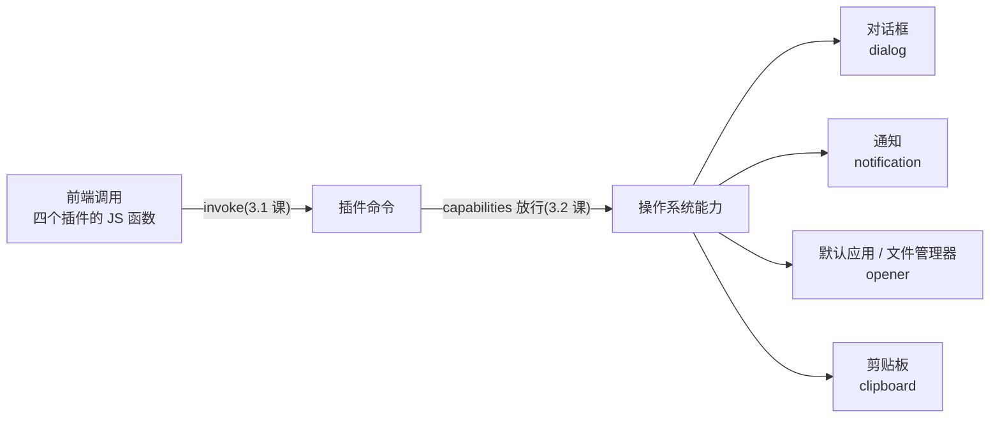

import { Canvas, Controls, Meta } from '@storybook/addon-docs/blocks';
import * as SystemIntegration from './system-integration.stories';

<Meta of={SystemIntegration} name="Docs" />

# 系统交互

网页里的按钮只能改 DOM,而桌面应用经常要「跨出窗口」:让用户选一个文件、发一条系统通知、用默认浏览器打开链接、往剪贴板写一段文本。Tauri 2 把这四件事分给四个官方插件——`dialog`、`notification`、`opener`、`clipboard-manager`,它们是应用与操作系统的四个接口面。四件套安装注册的通用模式见[插件体系](?path=/docs/plugin-system--docs),capabilities 授权见[权限与能力](?path=/docs/capabilities--docs)一课;本课聚焦每个插件的 API 面、选型判断与组合使用。共同模型一句话:**前端包函数 → 插件命令 → 系统能力**,返回值由「用户在系统界面上做了什么」决定——先判返回值,再走下一步。



四插件速查(授权列是本课最容易踩的差异,各小节展开):

| 插件 | 前端包 | 核心函数 | `tauri add` 后的授权 |
| --- | --- | --- | --- |
| dialog | `@tauri-apps/plugin-dialog` | `open` / `save` / `message` | `dialog:default` 覆盖全部 |
| notification | `@tauri-apps/plugin-notification` | `sendNotification`(配 `isPermissionGranted` / `requestPermission`) | ACL 覆盖;系统通知权限另算 |
| opener | `@tauri-apps/plugin-opener` | `openUrl` / `openPath` / `revealItemInDir` | `opener:default` 不含 `openPath` |
| clipboard-manager | `@tauri-apps/plugin-clipboard-manager` | `writeText` / `readText` | default 是空集,全部手动声明 |

## 快速上手

前提:已有[第一个应用](?path=/docs/first-app--docs)生成的 react-ts 工程。最小闭环:装四个插件,点一次按钮,连续看到三次系统响应(保存面板 → 剪贴板写入 → 通知横幅)。

1. 一条命令装一个,四个都装:

```bash
npm run tauri add dialog
npm run tauri add notification
npm run tauri add opener
npm run tauri add clipboard-manager
```

2. 补剪贴板权限。`tauri add` 写入的 default 权限集覆盖面不同:`dialog:default`、`notification:default`、`opener:default` 已够用,而 `clipboard-manager:default` 是**空权限集**——把写权限手动加进 `src-tauri/capabilities/default.json`:

```json
"permissions": [
  "core:default",
  "dialog:default",
  "notification:default",
  "opener:default",
  "clipboard-manager:allow-write-text"
]
```

3. 前端调用:

```tsx
// src/App.tsx —— 在模板组件里加一个按钮
import { save } from '@tauri-apps/plugin-dialog';
import { sendNotification } from '@tauri-apps/plugin-notification';
import { writeText } from '@tauri-apps/plugin-clipboard-manager';

export default function App() {
  return (
    <button
      onClick={async () => {
        const path = await save({
          title: '导出报告',
          filters: [{ name: 'PDF', extensions: ['pdf'] }],
        });
        if (!path) return; // 用户取消返回 null,不是错误
        await writeText(path); // 路径进剪贴板,方便粘贴
        await sendNotification({ title: '导出完成', body: path });
      }}
    >
      导出报告
    </button>
  );
}
```

4. `npm run tauri dev`,点按钮:先弹出系统保存面板,确认后通知横幅出现,剪贴板里已经是所选路径。任何一步报 not allowed,先查 capabilities(排查见[权限与能力](?path=/docs/capabilities--docs));四个插件的真实系统响应与本机核对清单见本目录 `runtime-verification.md`。

## 调用模型

四个插件 API 各不相同,但调用行为共享三条判断,先建立它们,后面的 API 才有落点:

- **一跳直达系统能力。** 前端包函数就是带命名空间 invoke 的薄封装(`plugin:<name>|<command>`),ACL 放行后命令直达系统能力,全程不需要写 Rust;Rust 侧入口(extension trait)在各小节附带。
- **结果由用户决定。** 文件对话框返回哪条路径、消息框返回哪个按钮标签,取决于用户在系统界面上的操作;「取消」以 `null` 或布尔值表达,是正常路径而不是异常。
- **授权分两层。** 第一层是 ACL(capabilities 静态声明,构建时编译),第二层是系统能力自身的权限——通知最典型:ACL 放行 `notify` 命令后,系统通知权限仍由操作系统管理。

下面的实例把四个插件的一次调用做成可调的模拟:切场景看系统界面与返回值形态,切授权看调用在哪一层断掉:

<Canvas of={SystemIntegration.Interactive} />
<Controls of={SystemIntegration.Interactive} />

| 读者操作 | 可观察证据 |
| --- | --- |
| 切换「演示场景」 | 链路条、系统界面模拟与读数(调用 / 授权 / 响应 / 返回值)同步变化 |
| 对话框场景把「用户动作」切到 cancel | 系统界面仍在,返回值从路径或按钮标签变为 `null` |
| 把「授权状态」切到未授权 | 调用在授权节点断开,系统界面不出现,读数给出 dev 构建下的拒绝报错形态 |
| 通知场景切到未授权 | 走 `isPermissionGranted` → `requestPermission` 流程,而不是 ACL 拒绝 |
| 打开 Show code | 看到该 Canvas 实际执行的 `example.ts` |

## dialog:对话框

dialog 提供两类原生对话框:**文件类**(`open` / `save`)与**消息类**(`message` 家族)。共同点:样式由操作系统决定,应用只能通过 options 描述内容;返回值由用户操作决定。`dialog:default` 含 `allow-open` / `allow-save` / `allow-message`,覆盖本节全部调用。

### 文件选择:open 与 save

`open` 让用户挑已有文件或目录,`save` 让用户确认保存位置(文件此时可以还不存在,拿到路径后由应用写入)。两者取消时都返回 `null`:

```ts
import { open, save } from '@tauri-apps/plugin-dialog';

// 选择单个文本文件:取消得到 null
const file = await open({
  multiple: false,
  filters: [{ name: '文本', extensions: ['txt', 'md'] }], // 扩展名不带点
});

// 确认保存位置:拿到路径后再写入内容
const target = await save({
  title: '导出报告',
  defaultPath: 'report.pdf',
  filters: [{ name: 'PDF', extensions: ['pdf'] }],
});
```

常用选项与返回值形态回查:

| 选项 | 类型 | 作用 |
| --- | --- | --- |
| `multiple` | boolean | 多选;返回值从 `string` 变 `string[]` |
| `directory` | boolean | 选目录而非文件;仅桌面支持 |
| `filters` | `{ name, extensions }[]` | 扩展名过滤,`extensions` 不带点(如 `'pdf'`) |
| `defaultPath` | string | 初始目录或文件名 |
| `title` | string | 面板标题,仅桌面生效 |

返回值:`open` 单选返回 `string`、多选返回 `string[]`、取消返回 `null`;`save` 返回 `string | null`。边界:移动端没有目录选择器(`directory` 不可用);路径格式有平台差异——iOS 返回 `file://` URI、Android 返回 content URI,fs 插件可统一处理(见[文件与持久化](?path=/docs/persistence--docs))。

### 消息对话框:message 家族

`message` 是消息对话框的统一入口:`kind` 选图标(`'info'` / `'warning'` / `'error'`,默认 info),`buttons` 选按钮组(2.4.0 起支持 `'Ok'` / `'OkCancel'` / `'YesNo'` / `'YesNoCancel'` 或自定义标签),返回值是被点按钮的标签字符串:

```ts
import { message } from '@tauri-apps/plugin-dialog';

const choice = await message('要保存更改吗?', {
  title: '编辑器',
  kind: 'warning',
  buttons: 'YesNoCancel',
});
// choice: 'Yes' | 'No' | 'Cancel'
```

`ask()` 与 `confirm()` 是布尔快捷方式(YesNo / OkCancel,返回 `boolean`),底层已并入 `message` 命令——所以 `dialog:default` 直接覆盖它们;但权限表里的 `dialog:allow-ask` / `dialog:allow-confirm` 已标记弃用,将在 v3 移除。新代码直接用 `message` + `buttons`,面向未来不用改。

## notification:通知

官方推荐的三步流程——查权限、必要时请求、再发送:

```ts
import {
  isPermissionGranted,
  requestPermission,
  sendNotification,
} from '@tauri-apps/plugin-notification';

let granted = await isPermissionGranted();
if (!granted) {
  granted = (await requestPermission()) === 'granted';
}
if (granted) {
  await sendNotification({ title: '下载完成', body: 'report.pdf 已保存' });
}
```

要点:

- **入参两态:** `sendNotification` 接字符串(只当 body)或对象(`title` / `body`);移动端还有 `attachments`、`channelId` 等选项。
- **两层授权:** ACL 由 `notification:default` 覆盖(`tauri add` 自动写入);系统通知权限由操作系统管理,桌面端首次发送时系统自行处理授权,流程里的前两步通常一次通过。
- **桌面差异:** Windows 只对已安装(打包)的应用发通知,dev 模式下通知会挂 powershell 的名称与图标——验收通知样式要先 `tauri build` 安装。
- **移动端扩展:** 动作按钮(`registerActionTypes` / `onAction`)与 Android 通知渠道(`createChannel`——必须先建渠道再引用,否则通知不显示),随[移动端](?path=/docs/mobile-setup--docs)阶段使用。

Rust 侧通过 `NotificationExt` 调用,常用于 setup 或命令中:

```rust
use tauri_plugin_notification::NotificationExt;

app.notification().builder()
    .title("Tauri")
    .body("Tauri is awesome")
    .show()?;
```

## opener:打开文件与 URL

opener 负责「把内容交给系统」:三个函数各管一种交接方式。

| 函数 | 做什么 | 典型场景 |
| --- | --- | --- |
| `openUrl(url)` | 交给系统默认的 URL 处理应用 | 打开官网、帮助文档、`mailto:` |
| `openPath(path, withProgram?)` | 用默认应用打开文件或目录;`withProgram` 可指定程序(如 Windows 上的 `'vlc'`) | 用默认 PDF 阅读器打开下载的文件 |
| `revealItemInDir(path)` | 打开文件管理器并定位、高亮该文件 | 「在文件夹中显示」 |

```ts
import { openUrl, openPath, revealItemInDir } from '@tauri-apps/plugin-opener';

await openUrl('https://tauri.app');
await openPath('/Users/me/Downloads/report.pdf');
await revealItemInDir('/Users/me/Downloads/report.pdf');
```

授权是 opener 的重点:`opener:default` 含 `allow-open-url`、`allow-default-urls`(`http` / `https` / `mailto:` / `tel:` 交默认应用)与 `allow-reveal-item-in-dir`,**不含 `open-path`**——打开任意路径等于把文件交给系统应用处理,必须显式授权并用 scope 收紧范围:

```json
{
  "identifier": "opener:allow-open-path",
  "allow": [{ "path": "$APPDATA/exports/**" }]
}
```

`open-url` 也可以用对象形式配 `url` scope(如 `"https://*.tauri.app"`)。边界:移动端只支持 `openUrl`;「打开」与「执行程序」是两件事——opener 只负责打开,执行外部程序归 shell 插件(见[插件体系](?path=/docs/plugin-system--docs)的官方插件地图)。

## clipboard:剪贴板

`writeText` / `readText` 是核心一对:写不需要返回值,读返回剪贴板当前文本:

```ts
import { readText, writeText } from '@tauri-apps/plugin-clipboard-manager';

await writeText('Tauri is awesome!'); // 需 allow-write-text
const text = await readText();        // 需 allow-read-text
```

权限是 clipboard 的重点,两条规则:

- **default 集为空。** 官方的态度是「剪贴板天然可能危险」,`clipboard-manager:default` 不启用任何功能——`tauri add` 之后每个命令都要手动声明。
- **读写分离。** 读(`allow-read-text`、`allow-read-image`)与写(`allow-write-text`、`allow-write-html`、`allow-write-image`)是独立权限,`allow-clear` 单独一条;按需申请,只要写就别顺手加读。

桌面端还有富格式扩展:`writeHtml(html, altText?)` 写入 HTML(`altText` 作纯文本回退)、`writeImage` / `readImage` 读写图片、`clear` 清空剪贴板。注意没有 `readHtml`——HTML 写进去读不回来,取文本内容用 `readText`。移动端只支持纯文本。Rust 侧通过 `ClipboardExt`:`app.clipboard().write_text(...)` / `read_text()`。

## 组合使用

四个插件最常以流水线形式协作。「导出报告」的标准链路——dialog 拿路径,fs 写内容,clipboard 分享路径,opener 定位产物,notification 报告完成:

| 步骤 | 调用 | 职责 |
| --- | --- | --- |
| 1 | `save()` | dialog:确定导出位置(用户取消即中断) |
| 2 | fs 插件写入 | 把报告内容写进路径(见[文件与持久化](?path=/docs/persistence--docs)) |
| 3 | `writeText(path)` | clipboard:路径进剪贴板,方便粘贴分享 |
| 4 | `revealItemInDir(path)` | opener:文件管理器中定位产物 |
| 5 | `sendNotification(…)` | notification:通知完成 |

实例按步推进这条流水线;勾选「用户取消保存」可以看到第一步的中断分支——`save()` 返回 `null` 后所有后续步骤跳过,这正是组合使用要设的第一道检查:

<Canvas of={SystemIntegration.Pipeline} />
<Controls of={SystemIntegration.Pipeline} />

| 读者操作 | 可观察证据 |
| --- | --- |
| 打开「运行流水线」 | 五个节点依次点亮,读数逐步给出每步的调用结果 |
| 勾选「用户取消保存」 | save 节点变红,读数显示返回 `null`,其余步骤跳过 |
| 关闭「运行流水线」 | 全部节点重置 |
| 打开 Show code | 看到该 Canvas 实际执行的 `pipeline.ts` |

## 最佳实践

- **对话框返回值先判 `null` 再使用。** 用户取消是正常路径:`open` / `save` 返回 `null` 时直接 return,把 `null` 当路径传给下一步是最常见的崩溃来源。
- **用户决策用 `message`,单向告知用 `sendNotification`。** 消息框保证返回被点按钮;通知不承载用户决策、不保证返回结果,拿通知当确认弹窗用会拿不到答案。
- **opener 授权最小化。** `openUrl` 已被 default 覆盖常用协议;`openPath` 必须显式授权,且 scope 精确到应用真正会打开的目录,别把整个文件系统交给系统应用。
- **剪贴板读写分开申请。** 复制类功能只申请 `allow-write-text`;要读剪贴板再单独加 `allow-read-text`,减小暴露面(收紧原则见[安全加固](?path=/docs/security--docs))。
- **通知的验收放在打包之后。** dev 下的通知行为(Windows 显示 powershell 名称)不代表生产行为;调整样式或文案后先 `tauri build` 安装再确认。

## 常见问题

- 装完 clipboard-manager 就调 `writeText`,报 not allowed
  `clipboard-manager:default` 是空权限集,官方有意不默认启用任何剪贴板功能。把 `clipboard-manager:allow-write-text`(需要读再加 `allow-read-text`)写进 capabilities 后等重编译。
- `tauri add opener` 之后 `openPath` 报 not allowed,`openUrl` 却正常
  `opener:default` 只含 `open-url`、`default-urls`、`reveal-item-in-dir`,不含 `open-path`。加 `opener:allow-open-path`,并用对象形式配 `path` scope 收紧可打开的范围。
- `filters` 里写了 `extensions: ['.pdf']`,对话框的文件过滤不生效
  `DialogFilter` 的 `extensions` 不带点:写 `'pdf'` 而不是 `'.pdf'`。另外 Android 不支持扩展名过滤(值可为 MIME 类型)。
- dev 模式下通知显示 powershell 的名称与图标,通知样式没法验收
  Windows 通知只对已安装(打包)的应用生效,dev 进程不是安装应用。用 `tauri build` 生成安装包、装好后验证;macOS 上首次发通知由系统弹授权询问,拒绝后需到系统设置里打开。

## 总结回顾

摘要:四个系统交互插件把前端调用接到操作系统能力上——dialog 提供 `open` / `save` 文件对话框(取消返回 `null`,移动端无目录选择)与 `message` 消息框(`kind` 选图标、`buttons` 选按钮组,返回按钮标签;`ask` / `confirm` 是并入 message 的布尔快捷方式);notification 走「查权限 → 请求 → 发送」三步,授权分 ACL 与系统权限两层,Windows 只对已安装应用发通知;opener 的 `openUrl` / `openPath` / `revealItemInDir` 分别交给默认应用、指定应用与文件管理器,`opener:default` 不含 open-path,必须显式授权加 scope;clipboard-manager 的 default 集为空,读写权限分离申请,桌面端另有 HTML、图片与清空。组合时它们串成流水线:dialog 拿路径、fs 写内容、clipboard 分享、opener 定位、notification 收尾,第一步取消即中断。

一句话:

> 系统交互的返回值由用户决定——文件对话框可能给 `null`,消息框给按钮标签,通知与 opener 只承诺「交给系统」;先判返回值,再走下一步。

知识要点:

- 四个插件分别解决什么问题?核心函数各是什么?
- `open` / `save` 的返回值有哪些形态?用户取消时返回什么?
- `message` 的 `buttons` 选项与 `ask` / `confirm` 是什么关系?
- 通知的授权分哪两层?官方推荐的三步流程是什么?
- opener 三个函数怎么分工?`opener:default` 覆盖哪些、漏了哪个?
- `clipboard-manager:default` 为什么是空集?读写权限怎么申请?
- 导出流水线中四个插件如何衔接?中断点在哪一步?

## 参考资料

- [Dialog 插件 - Tauri 官方文档](https://tauri.app/plugin/dialog/)
  安装命令、`dialog:default` 内容与 `ask` / `confirm` 权限弃用说明、Rust 侧 `DialogExt` 用法、移动端目录选择器限制与路径格式差异的来源。
- [Dialog JavaScript API 参考 - Tauri 官方文档](https://tauri.app/reference/javascript/dialog/)
  `open` / `save` / `message` 签名、`OpenDialogOptions` / `SaveDialogOptions` / `MessageDialogOptions` 字段、`buttons`(Since 2.4.0)与返回值类型、`DialogFilter` 扩展名不带点的来源。
- [Notification 插件 - Tauri 官方文档](https://tauri.app/plugin/notification/)
  三步权限流程、`sendNotification` 选项、`notification:default` 内容、Rust 侧 `NotificationExt`、Windows 仅对已安装应用生效与 dev 下 powershell 图标、Android 渠道与移动端 actions 的来源。
- [Opener 插件 - Tauri 官方文档](https://tauri.app/plugin/opener/)
  `openUrl` / `openPath` / `revealItemInDir` 分工、`opener:default` 权限集内容、path / url scope 写法、移动端仅支持 openUrl、Rust 侧 `OpenerExt` 的来源。
- [Clipboard Manager 插件 - Tauri 官方文档](https://tauri.app/plugin/clipboard/)
  `writeText` / `readText` 用法、权限表(读写分离、`allow-clear` 等)、「默认不启用任何功能」的空 default 集、移动端仅纯文本、Rust 侧 `ClipboardExt` 的来源。
