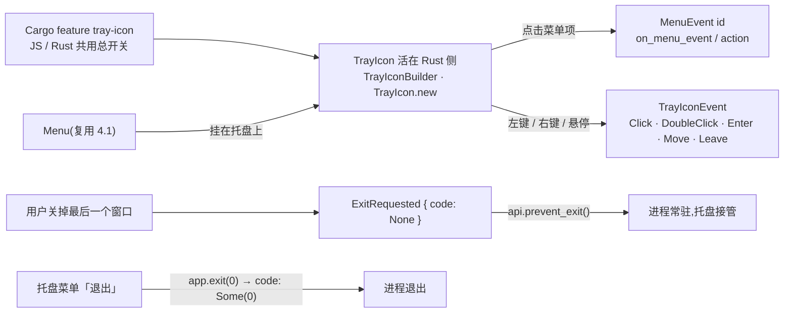

import { Canvas, Controls, Meta } from '@storybook/addon-docs/blocks';
import * as SystemTray from './system-tray.stories';

<Meta of={SystemTray} name="Docs" />

# 系统托盘

托盘图标是常驻系统通知区(macOS 菜单栏右端、Windows/Linux 托盘区)的小图标,让应用在关掉所有窗口后仍然可见、可操作——下载器、播放器、VPN 客户端都靠它常驻后台。Tauri 2 把托盘做成了**核心能力,但默认关闭**:`tray-icon` Cargo feature 是总开关,打开后 JS 与 Rust 两侧共享同一份托盘对象。核心模型一句话:**托盘图标活在 Rust 侧,前端只持句柄;交互走两条独立通道——托盘菜单是[菜单与快捷键](?path=/docs/menus-shortcuts--docs)里 `Menu` 的复用,点击走 `MenuEvent`;图标自身的鼠标动作走 `TrayIconEvent`**。而「关窗常驻」不是托盘的内置开关,是托盘 + `RunEvent::ExitRequested` 拦截的组合:关窗发出的退出请求被拦下,退出改由托盘菜单发起。

菜单结构、五类菜单成员与 id 分发的通用模式见[菜单与快捷键](?path=/docs/menus-shortcuts--docs);托盘不是插件,开 Cargo feature 即启用,插件安装的通用模式见[插件体系](?path=/docs/plugin-system--docs)。本课的两个实例把托盘交互与关窗常驻做成可操作的模拟:点托盘图标看两条通道的读数,点窗口关闭按钮看进程为什么还在。



关键输入的默认值与平台边界速查(各节展开):

| 项 | 默认值 / 写法 | 平台边界 |
| --- | --- | --- |
| Cargo feature | `tauri = { features = ["tray-icon"] }` | JS 与 Rust 两侧共用的总开关 |
| 左键弹菜单 `showMenuOnLeftClick` | `true` | Linux 不支持 |
| 菜单模板图标 `iconAsTemplate` | `false` | 仅 macOS |
| 悬停提示 `tooltip` | 不设则无 | Linux 不支持 |
| 图标旁文字 `title` | 不设则无 | Windows 不支持;Linux 需有图标才显示 |
| 托盘事件 `TrayIconEvent` | 五种,均需监听 | Linux 一律不发出;`DoubleClick` 仅 Windows |
| JS 权限 | `core:tray:default` 随 `core:default` 启用 | 仅 JS 侧调用涉及 |

## 快速上手

前提:已有[第一个应用](?path=/docs/first-app--docs)生成的 react-ts 工程。最小闭环:开 feature → setup 建托盘 → run 拦截退出请求 → 验证「关窗不退、托盘恢复、菜单退出」。

1. 在 `src-tauri/Cargo.toml` 打开 feature:

```toml
[dependencies]
tauri = { version = "2", features = ["tray-icon"] }
```

2. 改写 `src-tauri/src/lib.rs` 的 `run()`——这是托盘常驻应用的完整骨架:

```rust
use tauri::{
    menu::{Menu, MenuItem},
    tray::{MouseButton, MouseButtonState, TrayIconBuilder, TrayIconEvent},
    Manager, RunEvent,
};

pub fn run() {
    tauri::Builder::default()
        .setup(|app| {
            // 托盘菜单就是 4.1 的 Menu:MenuItem + id
            let show = MenuItem::with_id(app, "show", "显示主窗口", true, None::<&str>)?;
            let quit = MenuItem::with_id(app, "quit", "退出 Tauri", true, None::<&str>)?;
            let menu = Menu::with_items(app, &[&show, &quit])?;

            TrayIconBuilder::with_id("main")
                .icon(app.default_window_icon().unwrap().clone()) // 复用应用图标
                .tooltip("Tauri 托盘")
                .menu(&menu)
                .show_menu_on_left_click(false) // 左键留给托盘事件
                .on_menu_event(|app, event| match event.id().as_ref() {
                    "show" => {
                        if let Some(window) = app.get_webview_window("main") {
                            let _ = window.show();
                            let _ = window.set_focus();
                        }
                    }
                    "quit" => app.exit(0), // 程序化退出,code = Some(0)
                    _ => {}
                })
                .on_tray_icon_event(|tray, event| {
                    // 左键松开:显示并聚焦主窗口
                    if let TrayIconEvent::Click {
                        button: MouseButton::Left,
                        button_state: MouseButtonState::Up,
                        ..
                    } = event
                    {
                        let app = tray.app_handle();
                        if let Some(window) = app.get_webview_window("main") {
                            let _ = window.unminimize();
                            let _ = window.show();
                            let _ = window.set_focus();
                        }
                    }
                })
                .build(app)?;
            Ok(())
        })
        .build(tauri::generate_context!())
        .expect("build tauri app 失败")
        .run(|_app, event| match event {
            // 用户关掉最后一个窗口 → code = None 的退出请求:拦下,进程常驻
            RunEvent::ExitRequested { code, api, .. } => {
                if code.is_none() {
                    api.prevent_exit();
                }
            }
            _ => {}
        });
}
```

3. `npm run tauri dev`,依次验证:
   - 菜单栏出现应用图标;点窗口关闭按钮,窗口消失但应用没退,图标还在。
   - 点托盘图标左键,主窗口重新出现并聚焦。
   - 右键托盘 → 点「退出 Tauri」,进程真正结束。

   注意 `build(...)` + `run(...)` 两段式:`Builder::run(context)` 是不带事件回调的 shorthand,要拦退出请求必须先 `build` 再 `run`。

JS 侧创建同样的托盘(仍然需要同一个 Cargo feature):

```ts
// src/tray.ts —— 前端启动时调用
import { defaultWindowIcon } from '@tauri-apps/api/app';
import { TrayIcon } from '@tauri-apps/api/tray';

const tray = await TrayIcon.new({
  icon: (await defaultWindowIcon()) ?? undefined,
  tooltip: 'Tauri 托盘',
});
```

本机核对清单见本目录 `runtime-verification.md`。

## 创建托盘图标

创建在两侧各一条路,选与命令逻辑同侧的一条(Rust 侧拿得到 `app` 句柄、配得到 `RunEvent`,前端适合图标行为纯 UI 的场景)。共同点:托盘对象活在 Rust 侧,JS 对象只是句柄;后续要 `setXxx` 的托盘应保持引用,或创建时给稳定 `id`。

Rust 在 `setup` 里用 `TrayIconBuilder`:builder 方法直接跟参数名(`.icon()` `.menu()` `.tooltip()`),只有 `with_id` 带 with 前缀;`build(app)?` 完成创建:

```rust
// src-tauri/src/lib.rs 的 setup 中
use tauri::tray::TrayIconBuilder;

let tray = TrayIconBuilder::with_id("main") // 不指定则分配随机 id
    .icon(app.default_window_icon().unwrap().clone())
    .build(app)?;
```

JS 用 `TrayIcon.new(options)`,配套静态方法 `getById` / `removeById`:

```ts
import { TrayIcon } from '@tauri-apps/api/tray';

const tray = await TrayIcon.new({ id: 'main' }); // 不指定则分配随机 id
await TrayIcon.getById('main'); // → TrayIcon | null
await TrayIcon.removeById('main'); // 从托盘区移除
```

图标来源:不设 `icon` 就建托盘,会得到一个"看不见"的托盘。最省事的是复用应用图标——Rust `app.default_window_icon()`(读 `tauri.conf.json` 的 bundle icon),JS `defaultWindowIcon()`;自定义 bytes/path 图标需要补 `image-png` / `image-ico` Cargo feature。托盘实例是引用计数的资源,丢弃最后一个引用(或 JS 侧 `close()`)即从托盘区移除。

## 托盘菜单

托盘菜单就是[菜单与快捷键](?path=/docs/menus-shortcuts--docs)里的 `Menu`:构造方式、五类成员、id 分发完全一致,本节只讲挂到托盘上之后的差异。

挂载:创建时 `.menu(&menu)`(Rust)/ `menu: menu`(JS),或运行时 `setMenu()` 更换。托盘菜单没有应用菜单那种「所有窗口继承」的归属问题,一个托盘挂一个菜单。

显示时机由 `showMenuOnLeftClick` 控制(默认 `true`):左键右键都弹菜单;设为 `false` 后左键不弹,留给 `TrayIconEvent` 处理(见下一节),右键照常弹——这是「左键显示窗口、右键出菜单」主流形态的做法。左键弹菜单时 `Click` 事件照常发出,菜单显示与事件监听互不影响。

响应:Rust 的 `on_menu_event`(Builder 上或 `TrayIcon` 实例上)与 4.1 的 `app.on_menu_event` 一样收到**所有**菜单事件——包括应用菜单的,不区分事件来自哪个菜单,按 `event.id()` 分发;JS 侧仍是菜单项的 `action`。

Linux 的两条硬边界:菜单一经设置就不能移除(`set_menu(None)` 无效,只能改内容);没有菜单时图标可能不显示,建一个空 `Menu` 挂上也能满足显示条件。

## 托盘事件

`TrayIconEvent` 是图标自身的鼠标事件,与菜单事件是两条通道。五种:

| 事件 | 负载 | 平台 |
| --- | --- | --- |
| `Click` | `button` + `button_state` + `position` + `rect` | macOS / Windows |
| `DoubleClick` | 同 `Click`,无 `button_state` | 仅 Windows |
| `Enter` / `Move` / `Leave` | `position` + `rect` | macOS / Windows |

`Click` 的典型匹配:左键**松开**(`MouseButton::Left` + `MouseButtonState::Up`)时显示窗口——`button_state` 区分按下与松开,等 `Up` 再动作可避免与菜单显示打架。JS 侧在创建选项里传 `action` 回调,用 `event.type` 区分五种,点击事件带 `button` / `buttonState`;`DoubleClick` 只在 Windows 有意义。Rust 的 `TrayIconEvent` 是 non-exhaustive 枚举,`match` 要留 `_ => {}`。

平台边界:L**inux 一律不发出托盘事件**——图标照常显示,右键菜单由系统弹出,交互只能依赖托盘菜单;macOS 与 Windows 的事件完整可用(见开场参考表)。

下面的实例是托盘区模拟:悬停看 Enter / Move / Leave,左键看 Click 读数与菜单是否弹出,切到 Linux 复现「事件不发、菜单照弹」。

<Canvas of={SystemTray.Interactive} />
<Controls of={SystemTray.Interactive} />

| 读者操作 | 可观察证据 |
| --- | --- |
| 鼠标移到托盘图标上再移开 | TrayIconEvent 行依次显示 Enter → Move → Leave |
| 左键点托盘图标 | TrayIconEvent 行显示 `Click { button: Left, button_state: Up }`;「左键弹菜单」开着时菜单同时弹出 |
| 关掉「左键弹菜单」再左键 | 菜单不再弹出,Click 读数照常——左键行为交给 on_tray_icon_event |
| 右键托盘图标 | 弹出托盘菜单;点「显示主窗口」,读数给出 `id="show"` 与两条响应通道 |
| 「平台」切到 linux | 悬停与点击都不更新 TrayIconEvent 行;点图标菜单照常弹出,菜单点击读数正常 |
| 打开 Show code | 看到该 Canvas 实际执行的 `example.ts` |

## 图标与属性

托盘的显示属性都有对应的运行时 setter,常驻应用常用它们做状态提示。回查表(JS / Rust 名称与平台边界):

| 属性 | JS | Rust | 边界 |
| --- | --- | --- | --- |
| 图标 icon | `setIcon(icon / null)` | `set_icon(Option<Image>)` | `null` 移除图标;bytes/path 需 image 特性 |
| 模板图标 iconAsTemplate | `setIconAsTemplate(bool)` | `set_icon_as_template(bool)` | 仅 macOS;单色图随系统明暗变色 |
| 文字 title | `setTitle(str / null)` | `set_title(Option<S>)` | Windows 不支持;Linux 需有图标才显示 |
| 悬停提示 tooltip | `setTooltip(str / null)` | `set_tooltip(Option<S>)` | Linux 不支持;JS 方法名只有一个 T |
| 可见性 visible | `setVisible(bool)` | `set_visible(bool)` | 隐藏 / 显示图标本身 |
| 菜单 menu | `setMenu(menu / null)` | `set_menu(Option<M>)` | Linux 设置后不可移除 |
| 左键弹菜单 showMenuOnLeftClick | `setShowMenuOnLeftClick(bool)` | `set_show_menu_on_left_click(bool)` | Linux 不支持 |
| 临时目录 tempDirPath | `setTempDirPath(path / null)` | `set_temp_dir_path(Option<P>)` | 仅 Linux;图标缓存目录 |

图标与模板标志要同时更换时,用原子版本 `setIconWithAsTemplate` / `set_icon_with_as_template`,避免两次调用之间闪烁;Rust 的 `rect()` 返回图标当前的位置与尺寸(Linux 恒为 `None`),可用于把弹窗对齐到托盘。

## 关窗常驻

默认行为:用户关掉最后一个窗口,运行时会发出一次**用户退出请求**并结束进程。托盘常驻 = 把这次请求拦下,让进程活着、托盘接管;真正的退出改由托盘菜单发起。

拦截点在事件循环:`RunEvent::ExitRequested { code, api }`。`code` 区分两种来源——`None` 是用户交互(关窗)触发的,`Some(n)` 是程序化退出(`app.exit(n)`,托盘菜单「退出」走这条);`api.prevent_exit()` 让事件循环继续跑。事件回调要挂在 `App::run` 的闭包上,所以必须 `build(...)` + `run(...)` 两段式:

```rust
// src-tauri/src/lib.rs
.build(tauri::generate_context!())
.expect("build tauri app 失败")
.run(|_app, event| match event {
    RunEvent::ExitRequested { code, api, .. } => {
        if code.is_none() {
            api.prevent_exit(); // 只拦用户关窗,放行 app.exit()
        }
    }
    _ => {}
});
```

`code.is_none()` 不是可省的风格偏好:`prevent_exit()` 对程序化退出**同样生效**(唯一例外是 `restart()`),不加判断会把托盘菜单的 `app.exit(0)` 一起拦死——常驻应用从此退不出去。

拦下退出请求时,最后一个窗口**已经销毁**:之后点托盘「显示主窗口」,`get_webview_window("main")` 返回 `None`,需要重建 `WebviewWindow`。想保留窗口实例,就改用**窗口级拦截**:监听 `WindowEvent::CloseRequested`,调 `api.prevent_close()` 再 `window.hide()`——窗口还在,托盘事件里 `show()` + `set_focus()` 就能恢复。JS 侧等价写法是 `onCloseRequested` + `event.preventDefault()`(必须在 `await` 之前调用);纯前端工程拿不到 Rust 事件回调,窗口级是唯一选择。窗口对象与事件的细节见[窗口](?path=/docs/window--docs)。

两条路线的取舍:

| | app 级 `ExitRequested` | 窗口级 `CloseRequested` |
| --- | --- | --- |
| 拦截点 | 事件循环(进程) | 单个窗口的关闭请求 |
| 窗口状态 | 已销毁,恢复需重建 | 仍存在,`hide` / `show` 即可 |
| 生效范围 | 所有窗口都关完才触发 | 每个窗口各自拦截 |
| JS 可用 | 否(仅 Rust 事件循环) | 是(`onCloseRequested`) |
| 适用 | Rust 集中管理、单一主窗口 | 多窗口、恢复逻辑在前端 |

实例把关窗后的状态机做成模拟:点窗口关闭按钮对比三种行为,常驻后点托盘看两条路线恢复窗口的差异,托盘菜单「退出」演示 `code = Some(0)` 如何绕过拦截。

<Canvas of={SystemTray.Resident} />
<Controls of={SystemTray.Resident} />

| 读者操作 | 可观察证据 |
| --- | --- |
| 「关窗行为」= exit-requested,点窗口左上角红点 | 「窗口状态」显示已销毁,「退出 / 关闭请求」行显示 `code: None → prevent_exit()`,进程保持运行 |
| 此后左键点托盘 | 「托盘动作」行提示 `get_webview_window = None`:窗口已销毁,需重建 |
| 「关窗行为」改 close-requested,重置后关窗 | 窗口变为隐藏(非销毁);左键托盘,窗口 `show() + set_focus()` 恢复 |
| 「关窗行为」选 none,重置后关窗 | 无拦截:窗口销毁后进程直接退出,托盘一并消失 |
| 任何行为下右键托盘 → 「退出 Tauri」 | 「退出 / 关闭请求」行显示 `code: Some(0)`,不被拦截,进程退出 |
| 打开 Show code | 看到该 Canvas 实际执行的 `close-resident.ts` |

## 最佳实践

- **先定左键行为,再建托盘。** `show_menu_on_left_click(false)` + 左键 `Click` 显示窗口是托盘应用的主流形态;保留默认(`true`)等于放弃左键事件,适合纯菜单操作的小工具。左键的行为差异应在 tooltip 里给用户预期。
- **`code.is_none()` 守住退出边界。** 用户关窗(`None`)拦,`app.exit(code)`(`Some`)放行;常驻应用必须保留一条可达的退出路径,「退出」统一走托盘菜单的 `app.exit(0)`。
- **给托盘一个稳定 id 并保持句柄。** 后续要 `setXxx` 的托盘,JS 存模块级引用,Rust 保住 `TrayIconBuilder::build` 返回的实例,或 `with_id("main")` + `getById` 找回——托盘是引用计数资源,句柄全丢图标就没了。
- **Linux 兜底:建托盘就带菜单。** 没菜单时图标可能不显示、事件也不发,空 `Menu` 也要挂上,交互全部走菜单项。
- **macOS 用模板图标。** `iconAsTemplate: true` 的单色图标随明暗主题自动变色,是 macOS 菜单栏的视觉惯例;彩色品牌图标则保持 `false`。
- **常驻要有存在感。** 窗口隐藏后用 tooltip(如「仍在后台运行」)和「显示主窗口」菜单项告诉用户应用还活着;只藏不说的托盘最容易被当成泄漏。

## 常见问题

- 点了窗口关闭按钮,应用直接退出,托盘图标也消失
  退出请求没被拦截。确认两件事:`RunEvent::ExitRequested { .. } => api.prevent_exit()` 写在 `run` 的回调闭包里;用的是 `build(...)` + `run(...)` 两段式——`Builder::run(context)` 不接受事件回调,拦截代码写在里面不会执行。
- 托盘菜单「退出」点了没反应,进程退不出去
  `prevent_exit()` 把 `code = Some(0)` 的程序化退出也拦下了(它对 `app.exit()` 同样生效)。给拦截加 `code.is_none()` 判断,只拦用户关窗;托盘菜单的退出用 `app.exit(0)`。
- 托盘图标建了但看不见(Linux)
  先确认设了 `icon`;再确认挂了菜单——Linux 上没有菜单时图标可能不显示,建一个空 `Menu` 挂上即可;必要时用 `temp_dir_path` 给图标缓存换一个可写目录。
- 悬停、点击托盘都没有事件读数(Linux)
  平台限制:Linux 不发出任何 `TrayIconEvent`(Click、Enter、Move、Leave 都不发)。交互只能走托盘菜单——右键菜单由系统弹出、菜单点击事件照常。
- JS 调 `TrayIcon.new` 报命令不存在或 not allowed
  先查 `tray-icon` Cargo feature 是否打开——JS 调用走的是同一套 Rust 命令,feature 不开哪一侧都用不了;再查 capabilities 里的托盘权限,`core:tray:default` 随 `core:default` 启用,收紧过权限的项目要补回(排查见[权限与能力](?path=/docs/capabilities--docs))。
- `onCloseRequested` 里先 `await` 再 `preventDefault()`,窗口还是关了
  `preventDefault()` 必须在 handler 返回前调用,`await` 之后的调用不生效。需要异步确认时先同步 `preventDefault()`,确认结果出来后再手动 `close()` 或保持隐藏。
- 窗口销毁后点托盘「显示主窗口」没反应
  `get_webview_window("main")` 返回 `None`——app 级拦截下窗口已销毁。改用窗口级拦截(`prevent_close()` + `hide()`)保留实例,或在托盘事件里重建 `WebviewWindow`。

## 总结回顾

摘要:托盘是核心能力但默认关闭,`tray-icon` Cargo feature 是 JS 与 Rust 共用的总开关。托盘图标活在 Rust 侧:Rust 用 `TrayIconBuilder` 在 `setup` 里 `build`,JS 用 `TrayIcon.new` 持句柄,图标默认复用应用图标,不设图标等于看不见。交互两条通道:托盘菜单是 4.1 `Menu` 的复用,`showMenuOnLeftClick`(默认 `true`)决定左键是否弹菜单,点击走按 id 分发的 `MenuEvent`;图标自身的鼠标动作走 `TrayIconEvent` 五种,「左键松开显示窗口」是主流模式,Linux 不发任何托盘事件且菜单不可移除。显示属性全部有运行时 setter,平台边界明显:tooltip 不支持 Linux,title 不支持 Windows,`iconAsTemplate` 仅 macOS。关窗常驻 = 托盘 + `RunEvent::ExitRequested` 拦截:两段式 `build().run()`,`code.is_none()` 只拦用户关窗、放行 `app.exit(0)`;想保留窗口实例就改用窗口级 `CloseRequested` 拦截 + `hide()`。

一句话:

> 托盘常驻不是托盘的内置开关,而是「托盘 + 拦截 code 为 None 的退出请求」的组合;退出路径由托盘菜单的 `app.exit(0)` 提供。

知识要点:

- `tray-icon` feature 管什么?JS 侧创建托盘需要它吗?
- Rust 与 JS 各怎么创建托盘?图标从哪来?不设图标会怎样?
- 托盘菜单和应用菜单共用什么?左键弹菜单由哪个参数控制?Linux 上有哪两条硬边界?
- `TrayIconEvent` 有哪五种?`Click` 的 `button` 与 `button_state` 各表示什么?哪些平台不发出?
- `RunEvent::ExitRequested` 的 `code` 如何区分用户关窗与程序化退出?为什么拦截要加 `code.is_none()`?
- app 级与窗口级拦截在窗口状态上有什么差异?各自适合什么场景?
- 托盘的显示属性有哪些平台边界?换图标+模板标志的原子写法是什么?

## 参考资料

- [System Tray - Tauri 官方文档](https://tauri.app/learn/system-tray/)
  feature 开启、JS / Rust 创建方式、`defaultWindowIcon` 图标来源、菜单挂载与 `menuOnLeftClick`、托盘事件类型与 Linux 限制的来源。
- [TrayIcon JavaScript API 参考 - Tauri 官方文档](https://tauri.app/reference/javascript/api/namespacetray/)
  `TrayIconOptions` 各项默认值(`showMenuOnLeftClick` 默认 true、`iconAsTemplate` 默认 false)、`TrayIcon` setter 清单、JS `TrayIconEvent` 负载、`core:tray:default` 权限的来源。
- [tauri::tray 模块 - docs.rs](https://docs.rs/tauri/latest/tauri/tray/index.html)
  模块成员总览与「desktop + tray-icon feature」可用性的来源。
- [tauri::tray::TrayIconBuilder - docs.rs](https://docs.rs/tauri/latest/tauri/tray/struct.TrayIconBuilder.html)
  builder 方法签名、`show_menu_on_left_click` 默认 true、Linux / macOS / Windows 各平台注记的来源。
- [tauri::tray::TrayIcon - docs.rs](https://docs.rs/tauri/latest/tauri/tray/struct.TrayIcon.html)
  运行时 setter 签名、`on_menu_event` 收到所有菜单事件、Linux 菜单不可移除与 `rect()` 为 `None` 的来源。
- [tauri::tray::TrayIconEvent - docs.rs](https://docs.rs/tauri/latest/tauri/tray/enum.TrayIconEvent.html)
  五种事件的字段、`DoubleClick` 仅 Windows、Linux 不发出事件的来源。
- [tauri::RunEvent - docs.rs](https://docs.rs/tauri/latest/tauri/enum.RunEvent.html)
  `ExitRequested { code, api }` 中 code 的语义(`None` 用户交互 / `Some` 程序化)的来源。
- [tauri::ExitRequestApi - docs.rs](https://docs.rs/tauri/latest/tauri/struct.ExitRequestApi.html)
  `prevent_exit()` 的行为与「`restart()` 时被忽略」的来源。
- [tauri::Builder - docs.rs](https://docs.rs/tauri/latest/tauri/struct.Builder.html)
  `Builder::run(context)` 为 shorthand、事件回调需 `build` + `App::run` 两段式的来源。
- [tauri::WindowEvent - docs.rs](https://docs.rs/tauri/latest/tauri/enum.WindowEvent.html)
  `CloseRequested { api }` 与窗口级拦截入口的来源。
