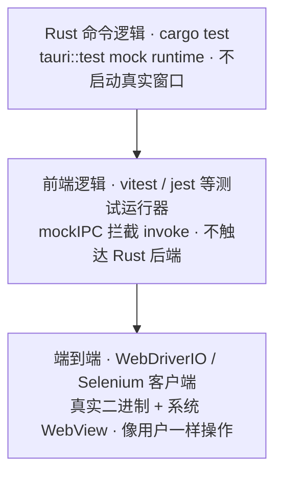

import { Canvas, Controls, Meta } from '@storybook/addon-docs/blocks';
import * as Testing from './testing.stories';

<Meta of={Testing} name="Docs" />

# 自动化测试

Tauri 的自动化测试分三层,各管一段:**Rust 命令逻辑**用 `tauri::test` 的 mock runtime 跑 `cargo test`,不启动真实窗口就能调用命令并断言返回;**前端逻辑**用 `@tauri-apps/api/mocks` 拦截 `invoke` 做单元测试,不触达 Rust 后端;**端到端**则把构建出的真实二进制当黑盒,由 WebDriver 协议像用户一样操作界面。本课的重点是第三层的配置与用例编写(路线主线),同时给出一、二层的最小写法。读完应能预测:一个测试该交给 `cargo test` 还是测试运行器,以及一条端到端会话要凑齐哪几样东西。

三层自上而下越来越接近真实运行,也越来越慢;能用上层验证的不推到下层:



| 层级 | 运行方式 | 需要准备 | 验证对象 |
| --- | --- | --- | --- |
| Rust 命令逻辑 | `cargo test` | dev-dependencies 加 tauri `test` feature(mock runtime) | 命令的核心逻辑 |
| 前端逻辑 | vitest / jest 等测试运行器 | `@tauri-apps/api/mocks` | invoke 结果返回后的前端行为 |
| 端到端 | WebDriverIO / Selenium 客户端 | WebDriver 驱动 + 构建好的应用二进制 | 真实 UI 流程 |

人工排查的手段见[调试与日志](?path=/docs/debugging--docs)一课;测试在 CI 里的多平台执行见[CI/CD](?path=/docs/ci-cd--docs)一课,本课只覆盖本机运行。

## 快速上手

前提:已有可构建的 Tauri 工程(如[第一个应用](?path=/docs/first-app--docs)生成的 react-ts 工程)。官方推荐用 `@wdio/tauri-service`:它把驱动管理整个包掉,任何平台都不需要外部驱动。四步跑通第一条端到端用例:

1. 在工程根目录脚手架,按提示选择 Desktop Testing,框架选 Tauri:

```bash
npm create wdio@latest ./
```

2. 应用内安装驱动插件:必装 `tauri-plugin-wdio-webdriver`(嵌入式 WebDriver 服务器);可选装 `tauri-plugin-wdio`(提供 `browser.tauri.execute()`、IPC mock 与日志捕获)。安装与注册步骤按脚手架提示和 webdriver.io 的 Plugin Setup 文档完成。
3. 在 `wdio.conf.ts` 的 `services` 里指向应用二进制:

```ts
export const config: WebdriverIO.Config = {
  services: [
    [
      'tauri',
      {
        appBinaryPath: './src-tauri/target/release/my-tauri-app',
        driverProvider: 'embedded',
      },
    ],
  ],
};
```

`appBinaryPath` 指向 `tauri build` 的产物,写一条最小 spec:

```ts
describe('Hello Tauri', () => {
  it('标题以 Hello 开头', async () => {
    const header = await $('body > h1');
    const text = await header.getText();
    expect(text).toMatch(/^[hH]ello/);
  });
});
```

4. 构建二进制并运行测试:

```bash
npm run tauri build   # 产出 appBinaryPath 指向的二进制
npm test              # wdio run wdio.conf.ts
```

验证:通过时输出 passing 统计,会话的浏览器名显示为 `wry`(Tauri 的 WebView 抽象层),不是 chrome 或 firefox。

## 端到端测试

一条端到端会话由五个环节组成:测试 spec → WebDriver 客户端 → 驱动层 → 应用二进制 → 系统 WebView。官方两条路线的差异**只在驱动层**:服务路线把 WebDriver 服务器以内嵌插件的形式塞进应用,随二进制一起启动;手动路线用独立的 `tauri-driver` 二进制,再配对平台原生驱动。无论哪条路线,被测对象都是构建产物(`tauri build` 的输出),不是 dev 服务器。

下面的实例把流水线逐段画出来。切换「测试方案」观察驱动层链路与安装要求;切换「运行平台」观察原生驱动与 WebView 的配对——把手动路线切到 macOS,驱动段会断开:

<Canvas of={Testing.Interactive} />
<Controls of={Testing.Interactive} />

| 读者操作 | 可观察证据 |
| --- | --- |
| 切换「测试方案」 | 驱动层段落与「驱动链路」「macOS 支持」「应用内插件」读数同步变化 |
| 切换「运行平台」 | 第⑤段系统 WebView 变化;手动路线切到 macOS 时驱动段变红断开,「会话结果」读数显示失败 |
| 打开 Show code | 看到该 Canvas 实际执行的 `example.ts` |

### 服务路线:@wdio/tauri-service

官方推荐路线,也是 macOS 上唯一可直接用的方案。原理:`tauri-plugin-wdio-webdriver` 在应用内部起一个 WebDriver 服务器,测试客户端连应用自身,因此「默认在任何平台都无需外部驱动」——macOS 不存在桌面 WebDriver 工具的限制被绕开了。要点:

- 脚手架 `npm create wdio@latest ./` 走 Desktop Testing → Tauri 即可生成全部配置;手工核对时,`driverProvider: 'embedded'` 是默认且推荐的取值。
- `tauri-plugin-wdio` 是可选增强:提供 `browser.tauri.execute()` 直接调后端、IPC mock(拦截命令)、日志捕获,写深层用例时再加。
- 代价:应用要为测试引入两个插件并注册——它们会进最终产物,介意时可改用手动路线。

### 手动路线:tauri-driver

不改应用代码的路线:`tauri-driver` 作为独立 WebDriver 服务,把协议翻译给平台原生驱动。先装工具:

```bash
cargo install tauri-driver --locked
```

平台配对是这条路线的核心,各平台差异全部落在原生驱动上:

| 平台 | 原生 WebDriver | 准备工作 |
| --- | --- | --- |
| Windows | msedgedriver | 版本须与 Edge/WebView2 一致(不一致时测试会卡在连接)。`cargo install --git https://github.com/chippers/msedgedriver-tool` 后运行它下载匹配版本,放进 PATH 或用 `--native-driver` 指定 |
| Linux | WebKitWebDriver | 先 `which WebKitWebDriver` 检查是否随 WebKit 包附带;部分发行版单独安装,Debian 系包名 `webkit2gtk-driver` |
| macOS | 无 | 桌面端没有可用的 WKWebView 驱动工具,`tauri-driver` 不可用;改用服务路线,或 CrabNebula 维护的跨平台 fork(macOS 需付费 API key) |

接线以官方 `tauri-apps/webdriver-example` 的 WebdriverIO 配置为例,生命周期写进配置钩子:

```js
// e2e-tests/wdio.conf.js(节选)
export const config = {
  host: '127.0.0.1',
  port: 4444,
  maxInstances: 1,
  capabilities: [
    {
      'tauri:options': { application: '../src-tauri/target/debug/tauri-app' },
    },
  ],
  framework: 'mocha',
  onPrepare: () => {
    // 测试前构建出被测二进制;--no-bundle 跳过安装包打包(非 npm 用户去掉 --)
    spawnSync('npm', ['run', 'tauri', 'build', '--', '--debug', '--no-bundle'], {
      stdio: 'inherit',
    });
  },
  beforeSession: () => {
    // 启动 tauri-driver(默认监听 127.0.0.1:4444),异常时直接退出测试进程
    tauriDriver = spawn(join(os.homedir(), '.cargo', 'bin', 'tauri-driver'));
    tauriDriver.on('error', () => process.exit(1));
    tauriDriver.on('exit', () => process.exit(1));
  },
  afterSession: () => {
    tauriDriver?.kill();
  },
};
```

三个关键写法:

- **被测对象是构建产物**:`tauri build --debug --no-bundle` 产出 `src-tauri/target/debug/<productName>`,`--no-bundle` 只跳过 DMG/MSI 等安装包打包。
- **capabilities 指向二进制**:`'tauri:options': { application: '<路径>' }`。Selenium 客户端没有 Tauri 专用 Options 类,用通用 `Capabilities` 设 `tauri:options` 并 `setBrowserName('wry')`,再用 `usingServer('http://127.0.0.1:4444/')` 连到 tauri-driver。
- **信号兜底**:官方示例在 onShutdown 辅助函数里处理 exit/SIGINT/SIGTERM/SIGHUP/SIGBREAK,保证 tauri-driver 被清理。

移动端边界:iOS/Android 可经 Appium 2 驱动,但官方明说流程尚未打磨,桌面优先时不必碰。

### 用例编写

用例就是普通的浏览器自动化脚本:选择器落在真实 WebView 渲染出的 DOM 上。官方示例的三条用例覆盖文本断言与样式断言:

```js
// calculates the luma from a hex color `#abcdef`
function luma(hex) {
  if (hex.startsWith('#')) {
    hex = hex.substring(1);
  }
  const rgb = parseInt(hex, 16);
  const r = (rgb >> 16) & 0xff;
  const g = (rgb >> 8) & 0xff;
  const b = (rgb >> 0) & 0xff;
  return 0.2126 * r + 0.7152 * g + 0.0722 * b;
}

describe('Hello Tauri', () => {
  it('标题以 Hello 开头', async () => {
    const header = await $('body > h1');
    const text = await header.getText();
    expect(text).toMatch(/^[hH]ello/);
  });

  it('标题以感叹号收尾', async () => {
    const header = await $('body > h1');
    const text = await header.getText();
    expect(text).toMatch(/!$/);
  });

  it('背景是浅色主题', async () => {
    const body = await $('body');
    const backgroundColor = await body.getCSSProperty('background-color');
    expect(luma(backgroundColor.parsed.hex)).toBeLessThan(100);
  });
});
```

要点:

- `$()` 接 CSS 选择器,与 DevTools 里写的一致;`getText()`、`getCSSProperty()` 等是 WebdriverIO 内置 API,断言用内置 `expect`(Selenium 无断言库,官方示例配 chai)。
- 第三条用例演示了从页面读样式做计算断言(亮度 luma < 100)——能断言的不只是文本。
- 用例里 `await` 一路到底:每条命令都真实穿越 IPC 与渲染,这也是端到端测试慢的原因。

### 纯浏览器模式

不开 WebView 的变体:前端跑在普通 Chrome + Vite dev server 上,无需 Tauri 二进制、驱动或插件,还能拦截 `invoke()` mock 命令结果。适合纯前端交互的快速回归;代价是测不到窗口、真实 IPC 往返等桌面行为——它验证不了本课标题里的「端到端」。

## Rust 命令的单元测试

`tauri::test` 模块提供 mock runtime:`mock_builder()` 代替 `Builder::default()` 构建应用,不加载真实前端资源、不执行真实 WebView,IPC 请求由测试手工构造后直接进入命令路由。命令的编写与注册见[命令](?path=/docs/commands--docs)一课;这里验证的正是那些命令的核心逻辑。`test` feature 只有测试需要,放进 dev-dependencies:

```toml
[dev-dependencies]
tauri = { version = "2", features = ["test"] }
```

完整算例(沿用官方文档的 `ping` → `pong` 形态):

```rust
#[cfg(test)]
mod tests {
    use tauri::test::{assert_ipc_response, mock_builder, INVOKE_KEY};

    // 被测命令:与 lib.rs 中注册的同一个
    #[tauri::command]
    fn ping() -> &'static str {
        "pong"
    }

    fn create_app() -> tauri::App<tauri::test::MockRuntime> {
        mock_builder()
            .invoke_handler(tauri::generate_handler![ping])
            .build(tauri::generate_context!())
            .expect("failed to build app")
    }

    #[test]
    fn ping_command_works() {
        let app = create_app();
        // mock runtime 下照样能建窗口对象,只是它背后没有真实 WebView
        let webview = tauri::WebviewWindowBuilder::new(&app, "main", Default::default())
            .build()
            .unwrap();

        // 手工构造一次 IPC 请求,直接走命令路由;invoke_key 必须用测试专用值
        let request = tauri::webview::InvokeRequest {
            cmd: "ping".into(),
            callback: tauri::ipc::CallbackFn(0),
            error: tauri::ipc::CallbackFn(1),
            url: "http://tauri.localhost".parse().unwrap(),
            body: tauri::ipc::InvokeBody::default(),
            headers: Default::default(),
            invoke_key: INVOKE_KEY.to_string(),
        };
        // expected 的类型是 Result<T, T>:断言 Err 形态时传 Err(...)
        assert_ipc_response(&webview, request, Ok("pong"));
    }
}
```

`cargo test` 直接运行,无需窗口环境。边界与变体:

- `tauri::test` 被官方标注为 unstable,API 可能随版本变化;升级 tauri 后以 docs.rs 对应版本页面为准。
- mock 上下文的资源是空的(`NoopAsset`):加载不了真实页面,所以调用方式是手工构造 `InvokeRequest`(`get_ipc_response` 返回响应自行断言,`assert_ipc_response` 一步到位)。
- 命令是 `async fn` 时,用 `#[tokio::test]` 或 `tauri::async_runtime::block_on` 驱动断言。
- 想切回真实运行时,把 `mock_builder()` 换成 `Builder::default()` 即可,但那就需要真实窗口环境了——多数命令逻辑测试不需要。

## 前端 invoke 的 mock

`@tauri-apps/api/mocks` 在测试运行器(vitest/jest)里伪造 `invoke`:不运行真实 WebView,也不触达 Rust 后端。适合测「拿到命令结果之后前端怎么表现」:

```ts
import { invoke } from '@tauri-apps/api/core';
import { clearMocks, mockIPC } from '@tauri-apps/api/mocks';

// 拦截名为 add 的命令,直接返回伪造结果,没有真实 IPC 往返
mockIPC((cmd, args) => {
  if (cmd === 'add') {
    return args.a + args.b;
  }
});

const sum = await invoke<number>('add', { a: 2, b: 3 }); // 5
```

要点:

- 每个测试结束后调用 `clearMocks()`,避免拦截串到下一个用例。
- `mockWindows()` 只伪造窗口标签的存在,不伪造窗口属性。
- 事件模拟为部分支持(2.7.0 起可通过选项开启),`emitTo` 与 `emit_filter` 尚不支持——依赖这两种事件的逻辑别在这层测。

## 最佳实践

- **分层消费测试预算。** 命令逻辑交给 `cargo test`(秒级、无窗口);前端分支交给 mockIPC(不起应用);只有「UI → IPC → Rust → 回显」的完整流程才上 WebDriver。端到端要构建二进制、管理驱动进程,是最慢也最脆的一层,留给真正需要它的用例。
- **E2E 用 `--debug --no-bundle` 构建被测二进制。** 构建快、产物路径固定在 `src-tauri/target/debug/`;release 构建只在验证打包产物本身时才需要。
- **驱动进程的生命周期写进配置钩子。** onPrepare 构建、beforeSession 启动、afterSession kill,再配上信号兜底——官方示例在 onShutdown 里处理了 exit/SIGINT/SIGTERM 等信号;半途而废的清理会留下失控的 tauri-driver 进程。
- **选择器贴近用户可见的结构。** 官方示例直接断言 `body > h1` 的文本与 `body` 的背景色;断言落在用户看到的东西上,而不是实现细节上,用例才能在界面重构下存活。

## 常见问题

- Windows 上测试套件卡在连接阶段
  msedgedriver 与本机 Edge/WebView2 版本不匹配——官方明确说会导致套件在 trying to connect 时挂起。用 msedgedriver-tool 下载与 Edge 版本一致的驱动,确认它在 PATH 里(或用 `--native-driver` 指定路径)。
- macOS 上 `tauri-driver` 跑不了
  桌面端 macOS 没有 WKWebView 驱动工具,手动路线不可用。改用 `@wdio/tauri-service`(嵌入式服务器,全平台可用),或 CrabNebula 的跨平台 fork(macOS 需付费 API key)。
- 从 Tauri 1 的资料迁移:要不要在 `tauri.conf.json` 里开 `withGlobalTauri`?
  2.x 不需要:官方 webdriver-example 的 v2 配置没有开启它,当前文档也未要求;v1 时代的要求已过时。
- E2E 测试跑的是 `tauri dev` 吗?
  不是。WebDriver 驱动的是 `tauri build` 的产物(官方示例统一用 `--debug --no-bundle`),dev 服务器的热更新对自动化测试没有意义;官方示例在 onPrepare 钩子里先构建再测。
- `cargo test` 编译失败,报找不到前端产物
  `generate_context!` 在编译期读取 `tauri.conf.json` 并嵌入 `frontendDist` 指向的产物,目录不存在时测试根本编不过。先跑一次前端构建(或 `tauri build`),再执行 `cargo test`。

## 总结回顾

摘要:

Tauri 的自动化测试按层组织。Rust 侧用 `tauri::test` 的 mock runtime(`mock_builder()` + `MockRuntime`)在 `cargo test` 里验证命令逻辑:手工构造 `InvokeRequest`(`invoke_key` 用 `INVOKE_KEY`)直接进命令路由,`assert_ipc_response` 断言结果,不启动真实窗口、不加载前端资源。前端用 `@tauri-apps/api/mocks` 的 `mockIPC` 拦截 invoke、`clearMocks()` 清理,验证纯前端行为。端到端把构建出的真实二进制交给 WebDriver 协议:官方推荐 `@wdio/tauri-service`,驱动以插件形式内嵌进应用(`tauri-plugin-wdio-webdriver`),全平台可用、无需外部驱动;手动路线用 `tauri-driver` 配对平台原生驱动——Windows 用 msedgedriver(版本须与 Edge 对齐)、Linux 用 WebKitWebDriver,macOS 没有可用驱动。用例用 WebdriverIO 或 Selenium 编写,选择器落在真实 WebView 渲染的 DOM 上,生命周期由配置钩子管理。

一句话:

> 端到端会话 = 客户端 + 驱动 + 构建好的二进制:换平台换的是原生驱动,换方案换的是驱动层的组织方式——优先用官方服务路线,macOS 只有它能直接测。

知识要点:

- 三层测试各由什么工具承载、分别验证什么、成本如何排布?
- 一条端到端会话由哪五个环节组成?哪一段随方案与平台变化?
- `@wdio/tauri-service` 与 `tauri-driver` 手动路线在驱动层有何差异?各需要装什么?
- Windows 与 Linux 各配哪个原生 WebDriver?版本不匹配的典型现象是什么?
- mock runtime 下怎么调用命令并断言返回?`tauri::test` 有哪些边界(unstable、空资源、async 驱动)?
- `mockIPC` 解决什么问题?清理方式与事件支持的限制是什么?

## 参考资料

- [Testing - Tauri 官方文档](https://tauri.app/develop/tests/)
  测试方式总览:mock runtime 与 WebDriver 两条线、平台支持范围、CI 前提。
- [WebDriver - Tauri 官方文档](https://tauri.app/develop/tests/webdriver/)
  服务路线与手动路线的选择、`@wdio/tauri-service` 配置(`appBinaryPath`、`driverProvider`)与两个插件分工、纯浏览器模式。
- [WebDriver Manual setup - Tauri 官方文档](https://tauri.app/develop/tests/webdriver/manual-setup/)
  `tauri-driver` 安装命令、Windows msedgedriver 与 Linux WebKitWebDriver 配对、macOS 限制与 CrabNebula fork。
- [WebdriverIO 示例 - Tauri 官方文档](https://tauri.app/develop/tests/webdriver/example/webdriverio/)
  `wdio.conf.js` 会话生命周期(onPrepare/beforeSession/afterSession)与 spec 写法的官方原文。
- [Selenium 示例 - Tauri 官方文档](https://tauri.app/develop/tests/webdriver/example/selenium/)
  Selenium 客户端接线:`tauri:options`、浏览器名 `wry`、`usingServer('http://127.0.0.1:4444/')` 与清理函数。
- [Mock Tauri APIs - Tauri 官方文档](https://tauri.app/develop/tests/mocking/)
  `mockIPC`、`mockWindows`、`clearMocks` 与事件模拟支持边界的权威说明。
- [tauri::test - docs.rs](https://docs.rs/tauri/latest/tauri/test/index.html)
  `mock_builder`、`assert_ipc_response`/`get_ipc_response`、`INVOKE_KEY` 与 `test` feature 的准确定义。
- [tauri-apps/webdriver-example - GitHub](https://github.com/tauri-apps/webdriver-example)
  官方可运行的 WebDriver 示例工程(v1/v2)。
