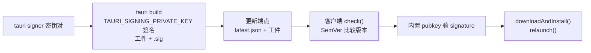

import { Canvas, Controls, Meta } from '@storybook/addon-docs/blocks';
import * as Updater from './updater.stories';

<Meta of={Updater} name="Docs" />

# 自动更新

Tauri 应用发布给用户之后,新版本要送达已安装的机器,靠的是 `tauri-plugin-updater` 插件。整条链路是:发布方用 `tauri signer` 生成一对 minisign 密钥,公钥写进应用配置、私钥在构建时给更新工件签名;工件和一份「版本 → 下载地址 + 签名」的更新清单(静态 `latest.json` 或动态接口)一起发布到更新端点;客户端 `check()` 拉取清单、按 SemVer 比较版本,再用配置里内置的公钥验证签名,通过后 `downloadAndInstall()` 下载安装、`relaunch()` 重启——任何一环对不上,更新就地终止。

注意区分两套签名体系:更新签名(本课)用 Tauri 自己的密钥对,验证「下载到的更新工件没有被篡改」;安装包代码签名(macOS 公证、Windows 证书,见[代码签名](?path=/docs/code-signing--docs))是给操作系统与 Gatekeeper 看的另一套体系,二者互不替代。CI 里的自动化发布与清单自动生成在[CI/CD](?path=/docs/ci-cd--docs)课展开,本课讲清手动发布的每一步。



本课最常回查的一张表——发布一次更新,每环节的关键输入:

| 环节 | 关键项 | 值与要求 |
| --- | --- | --- |
| 密钥 | `tauri signer generate -w ~/.tauri/myapp.key` | 产出私钥与 `.pub`;公钥内容写进配置 |
| 构建 | `TAURI_SIGNING_PRIVATE_KEY`(可选 `…_PASSWORD`) | 必须是构建进程的真实环境变量,`.env` 不生效 |
| 工件 | `bundle.createUpdaterArtifacts: true` | 生成更新工件及同名 `.sig` 签名文件 |
| 配置 | `plugins.updater.pubkey` | 公钥**内容**(官方强调"不能是文件路径") |
| 配置 | `plugins.updater.endpoints` | URL 数组;生产模式强制 HTTPS |
| 权限 | `updater:default`、`process:default` | 写进 capabilities;重启来自 process 插件 |
| 清单 | `version`、`platforms.<os-arch>.url` / `.signature` | 必填;`signature` 是 `.sig` 文件的内容 |

## 快速上手

前提:沿用[第一个应用](?path=/docs/first-app--docs)生成的 React 工程。最小闭环:装插件 → 配公钥与端点 → 写客户端检查代码 → 端点放一份清单。

1. 安装插件。自动方式一次装齐 Rust crate、JS 包并写入权限;重启功能顺带装 process 插件:

```bash
npm run tauri add updater
npm run tauri add process
```

手工等价:`cargo add tauri-plugin-updater` + `npm install @tauri-apps/plugin-updater`,并在 `lib.rs` 的 `setup` 里注册(插件只在桌面端可用):

```rust
tauri::Builder::default()
    .setup(|app| {
        #[cfg(desktop)]
        app.handle().plugin(tauri_plugin_updater::Builder::new().build())?;
        Ok(())
    })
    .run(tauri::generate_context!())
    .expect("error while running tauri application");
```

2. 生成密钥对(公钥进配置,私钥保管好):

```bash
npm run tauri signer generate -- -w ~/.tauri/myapp.key
```

3. 配置 `src-tauri/tauri.conf.json`,并确认 capabilities 里有 `"updater:default"` 与 `"process:default"`(`tauri add` 会写入):

```json
{
  "bundle": {
    "createUpdaterArtifacts": true
  },
  "plugins": {
    "updater": {
      "pubkey": "myapp.key.pub 的内容,整段粘贴,不是文件路径",
      "endpoints": ["https://releases.example.com/myapp/latest.json"]
    }
  }
}
```

4. 前端检查与安装(如启动时调用一次):

```tsx
import { check } from '@tauri-apps/plugin-updater';
import { relaunch } from '@tauri-apps/plugin-process';

async function checkForUpdates(): Promise<void> {
  const update = await check(); // Update | null
  if (!update) return;
  await update.downloadAndInstall((event) => {
    switch (event.event) {
      case 'Started':
        console.log(`开始下载 ${event.data.contentLength} 字节`);
        break;
      case 'Progress':
        console.log(`下载中,本块 ${event.data.chunkLength} 字节`);
        break;
      case 'Finished':
        console.log('下载完成');
        break;
    }
  });
  await relaunch();
}
```

5. 构建并发布:带签名环境变量构建,把更新工件与 `latest.json` 传到端点(清单写法见「静态 latest.json」一节):

```bash
export TAURI_SIGNING_PRIVATE_KEY=~/.tauri/myapp.key
npm run tauri build
```

## 一次更新的完整链路

把链路压成一个判断序列,排查更新问题就是定位它停在哪一步:

1. **发布方:** 构建签名工件(`tauri build` 注入 `TAURI_SIGNING_PRIVATE_KEY` → 工件 + `.sig`),把工件与清单发布到端点。
2. **`check()`:** 拉取清单,比较「清单 `version` 是否比本机新」——不是,就地返回 `null`,后面全部不发生。
3. **验签:** 客户端拿配置里内置的 `pubkey` 校验清单里的 `signature`——不配对,拒绝安装。
4. **下载安装:** `downloadAndInstall()` 按 `Started` / `Progress` / `Finished` 报进度,安装后按需 `relaunch()`。

下面的实例把这条链路做成可拨动的模拟:顶部流水线按示意节奏推进,中部是客户端画面(询问框或下载进度),底部同时展示端点清单与内置公钥的配对关系;左下读数给出每一步的结论:

<Canvas of={Updater.Flow} />
<Controls of={Updater.Flow} />

| 读者操作 | 可观察证据 |
| --- | --- |
| 保持默认输入(本机 1.0.0,清单 1.0.2) | 链路走满:check 显示 `1.0.0 → 1.0.2`,询问框弹出,确认后进度条到 100%,结局读数为"已安装并重启,当前运行 1.0.2" |
| 「清单 version」切到 `1.0.0` | 流水线停在 check():清单不比本机新就没有更新,清单预览里的 version 行标红注记 |
| 「清单 signature」切到「私钥不匹配(演示)」 | 验签一步变红并终止:结局读数为"更新终止于验签,未下载未安装" |
| 「更新策略」切到「静默安装」 | 不再出现询问框,验签通过后直接下载安装 |
| 「更新策略」切到「询问后取消」 | 弹出带更新说明的询问框,「稍后」高亮,链路停在确认步 |
| 打开 Show code | 看到该 Canvas 实际执行的 `update-flow.ts` |

模拟的时序与字节数为示意;三个就地终止点(端点非 2XX、版本不新、验签失败)与官方文档描述的判定顺序一致。

## 发布方:密钥与签名工件

发布方的全部职责是三件事互相配套:保管私钥、产出签名工件、维护端点清单——客户端能不能更新,取决于这三件事是否一致。

### 生成密钥对

```bash
npm run tauri signer generate -- -w ~/.tauri/myapp.key
```

- 产出两个文件:`myapp.key`(私钥)与 `myapp.key.pub`(公钥)。执行时提示设置密码,可选,留空回车即可。
- 公钥文件的**内容整段**填进 `plugins.updater.pubkey`——官方配置文档特别强调"不能是文件路径"。
- 私钥就是更新能力本身:丢失后无法再给已装用户签发更新(他们只能重新安装),泄露则别人可以推送伪造更新。不进仓库、不进镜像,CI 里用 secret 注入。

构建时签名,`tauri build` 自动完成,不需要手动调用 `tauri signer sign`(后者用于手动签独立文件,吃同一组环境变量):

```bash
export TAURI_SIGNING_PRIVATE_KEY=~/.tauri/myapp.key   # 路径或内容均可
export TAURI_SIGNING_PRIVATE_KEY_PASSWORD=...          # 生成密钥时设过密码才需要
npm run tauri build
```

两个已知的坑:必须是构建进程拿得到的真实环境变量,官方文档明确 **`.env` 文件不生效**;PowerShell 用 `$env:TAURI_SIGNING_PRIVATE_KEY="..."` 设置。

### 签名工件与版本号

`bundle.createUpdaterArtifacts: true` 让 `tauri build` 在常规安装包之外产出更新工件与签名:

| 平台 | 更新工件 | 签名文件 |
| --- | --- | --- |
| macOS | `myapp.app.tar.gz` | `myapp.app.tar.gz.sig` |
| Linux | 复用安装包 `myapp.AppImage` | `myapp.AppImage.sig` |
| Windows | 复用安装包 `myapp-setup.exe`(NSIS)/ `myapp.msi` | 同名 `.sig` |

两条边界:`"v1Compatible"` 是为仍在 v1 更新链上的旧用户准备的归档格式(如 `AppImage.tar.gz`、`setup.nsis.zip`),官方说明将在 v3 移除,用户全量迁到 v2 后改回 `true`;Linux 只有 AppImage 这一条更新通道,deb/rpm 没有对应更新工件。

版本号来自 `tauri.conf.json` 顶层的 `version`——它就是客户端 check 时的"本机版本"。每次发布必须递增;CI 里常直接用 `--config` 合并注入,避免手改文件:

```bash
npm run tauri build -- --config '{"version":"1.0.2"}'
```

## 更新清单与端点

端点只需要回答一个问题:当前最新版本是什么、各平台去哪下载、怎么验。两种形态——静态 JSON 文件(直接放 CDN 或 GitHub Releases)与动态接口(按请求计算)。URL 必须是数组,生产模式强制 HTTPS,前一个端点返回非 2XX 才会尝试下一个。

### 静态 latest.json

```json
{
  "version": "1.0.2",
  "notes": "修复自动更新与窗口还原问题",
  "pub_date": "2026-10-07T08:00:00Z",
  "platforms": {
    "darwin-aarch64": {
      "signature": "myapp.app.tar.gz.sig 文件的内容",
      "url": "https://releases.example.com/myapp/1.0.2/myapp.app.tar.gz"
    },
    "linux-x86_64": {
      "signature": "myapp.AppImage.sig 文件的内容",
      "url": "https://releases.example.com/myapp/1.0.2/myapp.AppImage"
    },
    "windows-x86_64": {
      "signature": "myapp-setup.exe.sig 文件的内容",
      "url": "https://releases.example.com/myapp/1.0.2/myapp-setup.exe"
    }
  }
}
```

| 字段 | 必填 | 说明 |
| --- | --- | --- |
| `version` | 是 | 合法 SemVer(前导 `v` 可选);唯一参与「有没有更新」比较的字段 |
| `platforms.<os-arch>.url` | 是 | 平台键为 `OS-ARCH`,如 `darwin-aarch64`、`windows-x86_64` |
| `platforms.<os-arch>.signature` | 是 | **`.sig` 文件的内容**(整段),不是路径也不是 URL |
| `notes` | 否 | 更新说明,客户端从 `update.body` 读出,适合展示给用户 |
| `pub_date` | 否 | RFC 3339 时间,如 `2026-10-07T08:00:00Z`;对应 `update.date` |

两条最容易踩的规则:官方文档说明**整份清单先校验、再比较版本**——任何一个平台键拼错、缺 `url`/`signature`,整份清单作废,所有平台一起收不到更新;发布顺序永远是先把工件传到 `url` 指向的位置、再更新清单,反过来用户会拿到 404。

### 动态接口

端点 URL 里的占位符把客户端状态带给服务器(不支持自定义变量):

| 占位符 | 展开为 |
| --- | --- |
| `{{current_version}}` | 本机版本,如 `1.0.0` |
| `{{target}}` | `linux` / `windows` / `darwin` |
| `{{arch}}` | `x86_64` / `i686` / `aarch64` / `armv7` |

服务器按需响应:没有更新回 `204 No Content`;有更新回 `200`,JSON 只需要单平台三件套:

```json
{
  "version": "1.0.2",
  "pub_date": "2026-10-07T08:00:00Z",
  "url": "https://releases.example.com/myapp/1.0.2/myapp.app.tar.gz",
  "signature": "…"
}
```

动态接口的典型用途:按平台路由到不同下载源、灰度放量、用请求头鉴权(`check()` 可传 `headers`,见下一节)。一个边界:在 Rust 代码里用 `format!` 写这类 URL 时花括号要双写转义(`{{{{target}}}}`),写在配置文件里不用。

## 客户端:检查与安装

客户端的全部职责:在合适的时机 `check()`,拿到 `Update` 对象后决定「问不问用户」,然后下载安装、按需重启。JS 与 Rust 各有一套等价 API。

### check() 与 Update 对象

```ts
import { check } from '@tauri-apps/plugin-updater';

const update = await check(); // Update | null
if (update) {
  console.log(update.version);        // 清单里的新版本
  console.log(update.currentVersion); // 本机版本
  console.log(update.body);           // 清单 notes
  console.log(update.date);           // 清单 pub_date
}
```

- 返回 `Update | null`:`null` 就是没有更新——端点回了 204,或清单 `version` 不比本机新。
- `check()` 可带选项:`headers`(如 `Authorization` 鉴权)、`timeout`(毫秒)、`proxy`、`target`(覆盖默认的 `OS-ARCH` 目标,例如 universal 构建传 `'macos-universal'`)。
- `Update` 还有分步方法 `download()` 与 `install()`,以及释放已下载字节的 `close()`;日常直接用合并的 `downloadAndInstall()`。
- 调用时机由应用决定:启动时检查一次,或常驻场景定时检查。`check()` 是网络请求,别放在启动热路径上同步等它。

### 下载安装与重启

进度事件三个:`Started`(带 `contentLength`)、`Progress`(带 `chunkLength`)、`Finished`。React 里接一个进度读数:

```tsx
let downloaded = 0;
let contentLength = 0;
await update.downloadAndInstall((event) => {
  switch (event.event) {
    case 'Started':
      contentLength = event.data.contentLength ?? 0;
      break;
    case 'Progress':
      downloaded += event.data.chunkLength;
      setProgress(contentLength ? downloaded / contentLength : 0);
      break;
    case 'Finished':
      setReady(true);
      break;
  }
});
```

两条收尾规则:

- **重启不是必须的。** 官方明确「安装后立即重启不是必须的」,可以只提示用户「下次启动将是新版本」。要立即重启,用 process 插件的 `relaunch()`(权限 `process:default` 含 `allow-restart`)。
- **Windows 上执行安装这一步时应用会自动退出**——安装器的限制,属预期行为。需要在退出前收尾(保存状态等),用 Rust 侧的 `on_before_exit` 钩子。

### 静默更新与用户确认

更新到手后「问不问用户」完全由客户端决定,updater 不内置对话框:

- **静默安装:** check 到更新直接 `downloadAndInstall()`,不打扰用户。适合安全修复、后台工具型应用;代价是用户在不知情时消耗流量,Windows 上还可能突然退出应用。
- **询问后更新:** 用 `update.version` + `update.body` 自建一个对话框,确认后再下载。适合功能更新——`body` 写清楚这次更新有什么,用户的选择才有意义。
- **常见折中:** 启动静默 check → 发现更新只弹提示条,用户点「立即更新」才下载;或退出时提示「下次启动将更新」。

Windows 的安装器界面由 `plugins.updater.windows.installMode` 控制:

| 取值 | 行为 | 官方建议 |
| --- | --- | --- |
| `passive`(默认) | 显示进度条,无需交互 | 一般推荐 |
| `basicUi` | 基础安装向导,需要用户操作 | 需要交互时才用 |
| `quiet` | 完全无界面 | 一般不推荐;无法自我提权,只适合按用户安装 |

macOS / Linux 是替换应用文件,没有这一层安装器 UI。

### Rust 侧等价写法

检查与安装不经过前端(如希望在 Rust 侧统一处理)时:

```rust
use tauri_plugin_updater::UpdaterExt;

async fn check_and_install(app: tauri::AppHandle) -> tauri::Result<()> {
    if let Some(update) = app.updater()?.check().await? {
        update
            .download_and_install(
                |chunk, total| { /* 进度:本次块大小 / 可选总大小 */ },
                || { /* 下载完成 */ },
            )
            .await?;
        app.restart()?; // 也可以不重启,留给用户下次启动生效
    }
    Ok(())
}
```

`UpdaterBuilder`(`app.updater_builder()`)还提供一批运行时入口:覆盖 `endpoints` / `pubkey` / 请求头(配置里的值作为兜底)、`on_before_exit` 收尾钩子、`version_comparator` 自定义版本比较——默认只认「清单更新」,想让客户端能降级到指定版本要靠它。签名密钥轮换这类低频运维入口也在这一层。

## 最佳实践

- **发布顺序固定:工件先行,清单殿后。** 清单一上端点,旧客户端立刻会来下载——先确认各平台 `url` 指向的工件都传完,再更新 `latest.json`。
- **把清单当发布产物,别手写出错。** 整份清单先校验再比较:平台键、`url`、`signature` 任何一处错,所有平台一起哑火。用脚本从构建产物生成清单,`signature` 直接读 `.sig` 文件内容;或者交给 CI/CD 课的 tauri-action 自动生成。
- **私钥即更新能力,备份与保密并重。** 丢失 = 已装用户永远收不到更新;泄露 = 别人能推伪造更新。仓库、镜像、日志都不该出现它,CI 用 secret 注入环境变量。
- **版本号纪律:每次发布必须递增。** 客户端只比较 SemVer;忘改 `version` 的发布对用户不可见,用 `--config` 注入可以避免。
- **静默与询问按更新性质选。** 安全修复倾向静默 + 安装后提示重启;功能更新倾向先询问,`notes` 写清收益;常驻应用加「退出时生效」的折中。
- **端点容灾,别关 HTTPS。** `endpoints` 数组把稳定源放前面(非 2XX 才轮到下一个);生产模式强制 TLS,`dangerousInsecureTransportProtocol` 只留给本地联调。

## 常见问题

- `check()` 一直返回 `null`,明明发布了新版本
  按链路顺序核对:直接 curl 端点确认返回 200(非 2XX 会跳到下一个端点,没有下一个就当作无更新);清单 `version` 是否真的比本机大——忘改 `version` 是头号原因,`pub_date` 不参与比较;`pubkey` / `endpoints` 的改动是否随新构建发出去了(插件配置编译期打进应用,只改服务器不重发客户端,检查行为不会变)。
- 报签名验证失败(signature verification failed)
  更新终止在验签步:清单里的 `signature` 与客户端内置 `pubkey` 不配对。常见原因:换过密钥但清单还挂旧 `.sig`、复制了别的构建或别的平台的 `.sig`、`pubkey` 与构建私钥本就不是一对。确认 `.sig` 是本次构建用 `TAURI_SIGNING_PRIVATE_KEY` 产出的,且 `pubkey` 来自同一对密钥。
- 手改 latest.json 后,所有平台都收不到更新
  清单是先整份校验、再比较版本——一个平台键拼错(如把 `darwin-aarch64` 写成 `macos-aarch64`)或缺 `url` / `signature`,整份作废。对照「静态 latest.json」的字段表逐项检查,平台键用 `OS-ARCH`。
- Windows 上 `downloadAndInstall()` 后应用直接退出了
  预期行为:Windows 安装器的限制,执行安装时应用自动退出。需要保存状态用 Rust 侧 `on_before_exit`;想在退出前给用户知情权,把安装安排在用户确认之后(「询问后更新」)。
- `TAURI_SIGNING_PRIVATE_KEY` 明明设置了,构建却没有 `.sig`
  `.env` 文件不会被 `tauri build` 读取,必须是构建进程的真实环境变量(shell `export` 或 PowerShell `$env:`);CI 里确认 secret 注入到了构建步骤。路径形式还要确认构建机上存在该文件,或直接改放密钥内容。
- 想让客户端退回旧版本
  默认比较只认升级:清单 `version` 不比本机新就是「无更新」。降级需要 Rust 侧 `updater_builder().version_comparator()` 自定义比较逻辑,JS API 没有这个入口。

## 总结回顾

摘要:

自动更新是三方协作的一条链。发布方用 `tauri signer` 生成的 minisign 密钥对给更新工件签名——`TAURI_SIGNING_PRIVATE_KEY` 注入 `tauri build`,配 `bundle.createUpdaterArtifacts: true` 产出 `.sig`,私钥丢失或泄露的代价都极高;端点上是「版本 → 工件 URL + 签名」的更新清单,静态 `latest.json` 或带占位符的动态接口,整份清单先校验再比较。客户端用 `check()` 拉清单、按 SemVer 比较版本、用内置 `pubkey` 验证 `signature`,通过后 `downloadAndInstall()` 下载安装(`Started` / `Progress` / `Finished` 三个进度事件),重启交给 process 插件的 `relaunch()`,Windows 上安装即退出是预期行为。问不问用户由客户端自定——静默安装、询问后更新或退出时生效,Windows 安装器界面用 `windows.installMode` 调。

一句话:

> 客户端只信内置公钥:版本比清单、签名对密钥,任何一环对不上,更新就地终止。

知识要点:

- 自动更新的完整链路有哪几步?哪三个点会让更新就地终止?
- `tauri signer generate` 产出什么?私钥丢失与泄露的后果分别是什么?
- `TAURI_SIGNING_PRIVATE_KEY` 怎么设置才生效?为什么 `.env` 不行?
- `bundle.createUpdaterArtifacts` 在各平台产出什么?版本号从哪来、怎么临时覆盖?
- 静态 `latest.json` 哪些字段必填?`signature` 放什么?「先校验再比较」意味着什么?
- 动态接口的三个占位符是什么?没有更新时服务器回什么?
- `check()` 的返回值与 `Update` 对象的字段、下载进度事件分别是什么?
- 为什么更新签名与安装包代码签名是两套体系、互不替代?

## 参考资料

- [Updater 插件 - Tauri 官方文档](https://tauri.app/plugin/updater/)
  插件安装与注册、`plugins.updater` 配置、签名流程与密钥环境变量、清单格式(静态与动态端点)、JS 与 Rust API、平台注记(`on_before_exit`、`windows.installMode`)的来源。
- [Tauri CLI 参考 - signer](https://tauri.app/reference/cli/)
  `tauri signer generate` / `tauri signer sign` 的参数与 `TAURI_SIGNING_PRIVATE_KEY(_PASSWORD)` 环境变量、`.env` 不生效说明的来源。
- [Process 插件 - Tauri 官方文档](https://tauri.app/plugin/process/)
  `relaunch()` 用法与 `process:default`(含 `allow-restart`)权限的来源。
- [tauri-plugin-updater - docs.rs](https://docs.rs/tauri-plugin-updater)
  Rust 侧 `Updater` / `UpdaterBuilder`(`version_comparator`、`on_before_exit` 等)的 API 回查入口。
