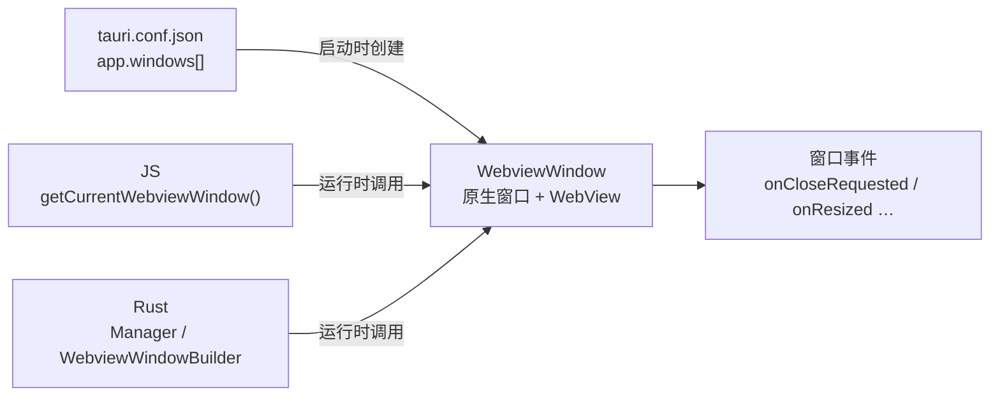

import { Canvas, Controls, Meta } from '@storybook/addon-docs/blocks';
import * as Window from './window.stories';

<Meta of={Window} name="Docs" />

# 窗口

Tauri 2 里的一个窗口,是一个原生操作系统窗口加上里面承载前端的 WebView,常用类型叫 `WebviewWindow`。控制它有两条路径:**声明式配置**——`tauri.conf.json` 的 `app.windows[]` 里每个字段对应一个外观或行为面,决定窗口启动时是什么样;**编程式 API**——前端的 `getCurrentWebviewWindow()`、Rust 侧的 `Manager` / `WebviewWindowBuilder`,决定窗口运行中怎么变。本课的核心直觉:改配置要重启才生效(开发时 `tauri dev` 会自动重编译重启),调 API 立即生效;配置字段与运行时方法一一对应,记一套概念就够。上一课([配置](?path=/docs/configuration--docs))只交代了 `app.windows` 这个入口,本课把每个字段展开。



`app.windows[]` 常用字段(默认值来自官方 schema,单位除特别说明外均为逻辑像素):

| 字段 | 默认值 | 控制什么 |
| --- | --- | --- |
| `label` | `"main"` | 窗口标识;多窗口时必须唯一(见[多窗口](?path=/docs/multi-window--docs)一课) |
| `url` | `"index.html"` | 窗口加载的前端地址 |
| `title` | `"Tauri App"` | 标题栏文字 |
| `width` / `height` | `800` / `600` | 尺寸(逻辑像素) |
| `minWidth` / `minHeight`、`maxWidth` / `maxHeight` | 无 | 尺寸上下限(逻辑像素) |
| `x` / `y` | 无 | 左上角坐标(逻辑像素) |
| `center` | `false` | 启动时居中 |
| `resizable` | `true` | 能否拖拽缩放;`false` 同时禁用最大化按钮 |
| `decorations` | `true` | 系统边框与标题栏 |
| `visible` | `true` | 启动时是否可见 |
| `focus` | `true` | 启动时是否抢焦点 |
| `fullscreen` / `maximized` | `false` | 启动时全屏 / 最大化 |
| `alwaysOnTop` / `alwaysOnBottom` | `false` | 常驻最上层 / 最下层 |
| `skipTaskbar` | `false` | 隐藏任务栏图标(Windows/Linux) |
| `transparent` | `false` | 窗口背景透明(macOS 需 `macOSPrivateApi`) |
| `shadow` | `true` | 窗口阴影 |
| `theme` | 跟随系统 | 初始主题:`light` / `dark` |
| `dragDropEnabled` | `true` | Tauri 接管文件拖放并发出 DragDrop 事件;`false` 时拖放交还页面 HTML5 事件 |

## 快速上手

前提:已有[第一个应用](?path=/docs/first-app--docs)生成的工程。

1. 声明式:改 `src-tauri/tauri.conf.json` 里的 `app.windows[0]`(节选,其余保持模板值):

```json
"app": {
  "windows": [{ "title": "我的便签", "width": 800, "height": 600, "center": true }]
}
```

2. 编程式:在前端代码里执行(如 `src/App.tsx`),运行中改标题:

```ts
import { getCurrentWebviewWindow } from '@tauri-apps/api/webviewWindow';

await getCurrentWebviewWindow().setTitle('运行中改的标题');
```

这一行需要授权。在 `src-tauri/capabilities/default.json` 的 `permissions` 数组里补一项(与已有的 `core:default` 并列):

```json
"permissions": ["core:default", "core:window:allow-set-title"]
```

3. 运行 `npm run tauri dev`:窗口以 800×600 居中打开,标题栏先显示「我的便签」,前端代码执行后变成「运行中改的标题」。配置里的字段重启时生效,`setTitle` 立即生效——两条路径的生效时机差异就是本课主线。

## 声明式配置

`app.windows` 数组的每一项是一个 WindowConfig,启动时逐项创建窗口;不写 `label` 默认叫 `main`。它属于 app 节、编译期嵌入二进制、由 Rust 运行时读取——改任何字段都要重启,机制在[配置](?path=/docs/configuration--docs)一课已讲清,这里不再重复。字段按「管哪一面」分三组:尺寸与位置、装饰与标题、层级与可见性。下面的实例把字段接到模拟窗口上——切换 Controls,左下角读数同步给出逻辑/物理尺寸换算:

<Canvas of={Window.Interactive} />
<Controls of={Window.Interactive} />

| 读者操作 | 可观察证据 |
| --- | --- |
| 调整「width」「height」 | 模拟窗口大小变化,底部逻辑 → 物理换算读数同步更新 |
| 切换「scaleFactor」 | 逻辑尺寸不变,物理读数翻倍——配置单位与屏幕像素的关系 |
| 关闭「decorations」 | 标题栏与红绿灯消失,窗口顶部出现自建拖拽区虚线框 |
| 切换「center」 | 窗口在居中参考线与 `x, y` 默认位置之间移动 |
| 关闭「resizable」 | 右下角缩放手柄消失,读数显示「否」 |
| 打开 Show code | 看到该 Canvas 实际执行的 `example.ts` |

### 尺寸与位置

`width`、`height`、`minWidth`、`maxHeight`、`x`、`y`、`center`、`resizable` 全部以**逻辑像素**为单位:受系统缩放(DPR)影响的屏上像素是**物理像素**,两者差一个 `scaleFactor`(2x 屏上 1 逻辑像素 = 2 物理像素)。规则只有一条:配置和设置用逻辑像素,读取拿到的往往是物理像素:

```ts
import { getCurrentWebviewWindow } from '@tauri-apps/api/webviewWindow';
import { LogicalSize } from '@tauri-apps/api/dpi';

const appWindow = getCurrentWebviewWindow();

await appWindow.setSize(new LogicalSize(800, 600)); // 逻辑像素,与配置同单位
await appWindow.center(); // 移到屏幕中央

const physical = await appWindow.innerSize(); // PhysicalSize:@2x 屏上是 1600 × 1200
physical.toLogical(await appWindow.scaleFactor()); // 换回逻辑像素再参与计算
```

`minWidth` / `minHeight` 约束用户拖拽的下限,`maxWidth` / `maxHeight` 约束上限;`x` / `y` 指定左上角坐标,`center: true` 则交给系统居中——两者都描述「启动位置」,同时设置时以平台实际行为为准。实例里切 `scaleFactor` 可以看到:配置没变,物理读数翻了倍,这正是逻辑像素存在的意义——同一份配置在普通屏和 retina 屏上物理大小一致。

### 装饰与标题

`decorations: true`(默认)是系统边框加标题栏,`title` 管标题文字,`maximizable`、`minimizable`、`closable` 分别管三个原生按钮是否可用。`decorations: false` 关掉全部装饰后,三件事要一次补齐,缺一不可:

- **拖拽区**:给充当标题栏的元素加 `data-tauri-drag-region`。它只作用于直接施加的元素,子元素(按钮、输入框)不会继承——这是刻意设计,保证交互元素能正常点击:

```html
<div data-tauri-drag-region>我的便签</div>
```

- **窗口按钮**:关闭、最小化、最大化自己画,调用对应方法:

```ts
await appWindow.close(); // 同类: minimize() / toggleMaximize()
```

- **权限**:自建按钮和拖拽用到的调用同样要授权:`core:window:allow-start-dragging`、`core:window:allow-close`、`core:window:allow-minimize`、`core:window:allow-toggle-maximize`。

macOS 另有三个专属字段:`hiddenTitle: true` 保留红绿灯但隐藏标题文字;`titleBarStyle: 'Overlay'` 让内容延伸到标题栏下方(实现沉浸式头部);`transparent: true` 开透明窗口——macOS 上必须同时打开顶层配置 `app.macOSPrivateApi`,并且网页根元素(`html` / `body`)背景也要设为透明,缺一处都是白底。`shadow: false` 去掉窗口阴影(无边框窗口常配合使用),`theme: 'dark'` 指定初始主题,默认跟随系统。

### 层级、可见性与启动状态

这一组字段决定窗口「以什么姿态出现在桌面」,运行时都有同名 API:

- `alwaysOnTop`:常驻最上层(悬浮工具、画中画),运行时 `setAlwaysOnTop(true)`。
- `alwaysOnBottom`:垫在最下层,桌面挂件类应用使用。
- `skipTaskbar`:Windows/Linux 上不显示任务栏图标,配合常驻应用。
- `visible: false`:启动时先隐藏,前端渲染完成再 `show()`——避免用户看到一个白屏窗口,是最常用的启动优化。
- `focus: false`:后台启动,不抢用户焦点(如随应用顺带打开的窗口)。
- `fullscreen: true` / `maximized: true`:启动即全屏 / 最大化,运行时对应 `setFullscreen()` / `maximize()`。

`visible`、`focus` 是启动时刻的语义:窗口创建时它们只生效一次,之后想再改变状态就走运行时 API(`hide()` / `show()` / `setFocus()`)。

## 运行时控制

前端入口在 2.x 有两个,返回的句柄类型不同:

```ts
import { getCurrentWindow } from '@tauri-apps/api/window';
import { getCurrentWebviewWindow } from '@tauri-apps/api/webviewWindow';
```

2.x 把原生窗口(Window)与 WebView 解耦了:`WebviewWindow` 是「一个窗口 + 一个 WebView」的组合,同时暴露两组方法,单窗口场景一律用它;`getCurrentWindow()` 只拿到窗口层,在多 WebView 布局才有必要区分(见[多窗口](?path=/docs/multi-window--docs)一课)。从 Tauri 1.x 迁移的读者对照:

| Tauri 1.x | Tauri 2.x |
| --- | --- |
| `import { appWindow } from '@tauri-apps/api/window'` | `getCurrentWebviewWindow()` |
| `@tauri-apps/api/window` 里的 `WebviewWindow` 类 | 移到 `@tauri-apps/api/webviewWindow` |
| `tauri.windows`(配置) | `app.windows` |

常用方法与声明式字段一一对应(配置管启动值,方法管运行中变化):

| 目的 | JS(`WebviewWindow`) | Rust(`WebviewWindow`) |
| --- | --- | --- |
| 改标题 | `setTitle('…')` | `set_title("…")` |
| 改尺寸 | `setSize(new LogicalSize(w, h))` | `set_size(LogicalSize::new(w, h))` |
| 最小尺寸 | `setMinSize(new LogicalSize(w, h))` | `set_min_size(Some(LogicalSize::new(w, h)))` |
| 改位置 | `setPosition(new LogicalPosition(x, y))` | `set_position(LogicalPosition::new(x, y))` |
| 居中 | `center()` | `center()` |
| 开关装饰 | `setDecorations(b)` | `set_decorations(b)` |
| 开关缩放 | `setResizable(b)` | `set_resizable(b)` |
| 置顶 | `setAlwaysOnTop(b)` | `set_always_on_top(b)` |
| 最大化 / 还原 | `maximize()` / `unmaximize()` | `maximize()` / `unmaximize()` |
| 全屏 | `setFullscreen(b)` | `set_fullscreen(b)` |
| 显示 / 隐藏 | `show()` / `hide()` | `show()` / `hide()` |
| 抢焦点 | `setFocus()` | `set_focus()` |
| 关闭 | `close()` / `destroy()` | `close()` / `destroy()` |
| 手动拖拽 | `startDragging()` | `start_dragging()` |

`close()` 与 `destroy()` 的区别:`close()` 走关闭流程(会触发下文的 `onCloseRequested`,可被拦截),`destroy()` 强制关闭、不发事件。`startDragging()` 配合无边框窗口的自建标题栏使用。

Rust 侧入口:`Manager` trait 提供 `get_webview_window`(按 label 取已有窗口句柄),新窗口用 `WebviewWindowBuilder` 创建——创建与组织多个窗口是[多窗口](?path=/docs/multi-window--docs)一课的主题,这里只看「拿到句柄后怎么用」:

```rust
use tauri::{Manager, WebviewUrl, WebviewWindowBuilder};

// 运行中按 label 取已有窗口(不返回权限错误,不受 ACL 限制)
if let Some(win) = app.get_webview_window("main") {
    win.set_title("新标题")?;
}

// setup 钩子里用代码创建窗口
WebviewWindowBuilder::new(app, "editor", WebviewUrl::default())
    .title("编辑器")
    .inner_size(480.0, 320.0)
    .center()
    .build()?;
```

### 权限:前端能调哪些

`core:default` 带的 `core:window:default` 只包含**查询类**方法(`allow-title`、`allow-inner-size`、`allow-is-resizable`、`allow-scale-factor` 等);上表里所有「改状态」的方法都要在能力文件里显式加 `core:window:allow-*`:

```json
{
  "windows": ["main"],
  "permissions": [
    "core:default",
    "core:window:allow-set-title",
    "core:window:allow-set-size"
  ]
}
```

判断点:前端报「not allowed / 未授权」时,先查这份清单,再怀疑 API 用法。Rust 侧调用不走 ACL,不受这些权限约束;`"windows": ["main"]` 圈定授权范围,多窗口时每个窗口单独圈(见[权限与能力](?path=/docs/capabilities--docs)一课)。

### 窗口事件

窗口生命周期变化通过事件拿到,前端是 `on*` 系列方法(`onResized`、`onMoved`、`onFocusChanged`、`onScaleChanged`、`onThemeChanged` 等),最常拦截的是关闭:

```ts
const appWindow = getCurrentWebviewWindow();

// 拦截关闭:确认通过才放行,否则挡下这次关闭
const unlistenClose = await appWindow.onCloseRequested((event) => {
  if (!window.confirm('确认退出?')) {
    event.preventDefault();
  }
});

// 尺寸变化(PhysicalSize 单位)
const unlistenResize = await appWindow.onResized(() => {
  console.log('窗口尺寸变了');
});

// 两个调用各返回一个取消函数,组件卸载时执行;
// React 里的订阅与清理写法见「事件」一课
```

同样的拦截在 Rust 侧是 `on_window_event`:

```rust
.on_window_event(|window, event| {
    if let tauri::WindowEvent::CloseRequested { api, .. } = event {
        api.prevent_close();
    }
})
```

## 最佳实践

- **两条路径按时机选,不混用。** 启动时的静态外观进配置(可评审、可平台覆盖、随二进制分发);响应用户操作的动态变化走 API(立即生效)。用配置模拟运行时状态要反复重启,用 API 摆启动默认值则多绕一层。
- **单位以逻辑像素为准。** 配置、`setSize`、`setMinSize`、`x` / `y` 全用逻辑像素;只在读取(`innerSize()` / `outerSize()`)或画物理坐标时用 `scaleFactor` 换算。UI 内部状态不要存物理像素——换一块屏读数就作废。
- **无边框窗口一次补齐三件事。** 拖拽区(`data-tauri-drag-region`)、自建按钮(`close()` 等)、对应权限(`allow-start-dragging` 等)。只关 `decorations` 其余不动,窗口既拖不动也关不掉。
- **复杂首帧用 `visible: false` + `show()`。** 前端渲染完成再显示窗口,避免白屏或闪烁;再配合 `focus: false` 可实现完全后台启动。
- **权限按需加,不为省事全开。** 用到哪个方法加哪个 `allow-*`,发布前对照[权限与能力](?path=/docs/capabilities--docs)一课收紧能力范围。

## 常见问题

- 前端调用 `setTitle` / `setSize` 报「not allowed」或未授权错误
  在 `src-tauri/capabilities/` 的能力文件里加对应权限,如 `core:window:allow-set-title`。`core:window:default` 只包含查询类方法,所有改状态的调用都要显式授权(见上文权限小节)。
- `setSize(800, 600)` 之后窗口大小或 `innerSize()` 读数和传入值对不上
  单位混用了:配置和 `LogicalSize` 是逻辑像素,`innerSize()` 返回物理像素。传参统一用 `LogicalSize`,读数除以 `scaleFactor` 换回逻辑像素再比对。
- `transparent: true` 背景还是白色
  透明要三处同时成立:窗口配置 `transparent: true`、网页根元素(`html` / `body`)背景设为 `transparent`、macOS 上顶层配置 `app.macOSPrivateApi: true`。缺任何一处,看到的都是白底。
- `decorations: false` 后窗口拖不动,也没有关闭按钮
  无边框窗口的系统装饰被整体移除,拖拽与按钮要自建:标题栏元素加 `data-tauri-drag-region`(只对直接施加的元素生效),按钮调用 `close()` / `minimize()` / `toggleMaximize()`,并在能力里加 `core:window:allow-start-dragging` 等权限。
- 改了 `app.windows` 里的字段,运行中的应用没变化
  声明式配置不是热重载:`tauri dev` 检测到 `src-tauri/` 变更会重编译并重启窗口;没在 dev 时改的,下次启动生效。运行中想变,走 `WebviewWindow` 的对应方法(机制见[配置](?path=/docs/configuration--docs)一课)。
- 从 Tauri 1.x 迁移后,窗口相关 API 全部找不到
  `appWindow` 常量换成 `getCurrentWebviewWindow()`;`WebviewWindow` 类从 `@tauri-apps/api/window` 移到了 `@tauri-apps/api/webviewWindow`;配置里 `tauri.windows` 改为 `app.windows`(完整对照见[配置](?path=/docs/configuration--docs)一课)。

## 总结回顾

摘要:

Tauri 2 的窗口由 `app.windows[]`(WindowConfig)声明启动形态,由 `WebviewWindow` API 控制运行中行为,配置字段与方法一一对应。尺寸与位置(`width` / `height`、`minWidth`、`x` / `y`、`center`、`resizable`)统一用逻辑像素,`innerSize()` 等读取返回物理像素,换算靠 `scaleFactor`;`decorations` 关掉后要自建拖拽区(`data-tauri-drag-region`)、窗口按钮和对应权限,macOS 另有 `hiddenTitle`、`titleBarStyle` 和透明窗口的 `macOSPrivateApi` 门槛;层级与可见性(`alwaysOnTop`、`skipTaskbar`、`visible`、`focus`)决定窗口在桌面上的存在方式,启动语义只生效一次,之后走运行时 API。前端调用任何「改状态」的方法都要在 capabilities 里显式加 `core:window:allow-*`,`core:window:default` 只放行查询;关闭等生命周期事件用 `onCloseRequested` / `on_window_event` 监听并可拦截。从 1.x 迁移:`appWindow` 换成 `getCurrentWebviewWindow()`,`WebviewWindow` 类移到 `@tauri-apps/api/webviewWindow`。

一句话:

> 声明式配置决定窗口启动时是什么样,`WebviewWindow` API 决定运行中怎么变——先分清时机,再对齐单位与权限。

知识要点:

- 控制窗口的两条路径分别在哪定义、什么时候生效?
- `app.windows[0]` 的尺寸字段用什么单位?`innerSize()` 返回什么单位?
- `getCurrentWindow()` 与 `getCurrentWebviewWindow()` 各返回什么?常规场景用哪个?
- `decorations: false` 之后必须补齐哪三件事?
- 前端调用 `setTitle` 报未授权,该加什么?`core:window:default` 里有什么?
- 怎么拦截窗口关闭,确认后如何继续关闭?

## 参考资料

- [Window Customization - Tauri 官方文档](https://tauri.app/learn/window-customization/)
  无边框窗口、`data-tauri-drag-region`(只作用于直接元素的说明与手动 `startDragging`)、macOS 标题栏样式与所需权限。
- [配置参考 - Tauri 官方文档](https://tauri.app/reference/config/)
  `app.windows[]` 各字段(WindowConfig)的定义、默认值与 `macOSPrivateApi` 说明。
- [WebviewWindow - @tauri-apps/api JS API 参考](https://tauri.app/reference/javascript/api/namespacewebviewwindow/)
  `getCurrentWebviewWindow()` 与 `setSize` / `center` / `setDecorations` / `onCloseRequested` 等方法清单。
- [Window - @tauri-apps/api JS API 参考](https://tauri.app/reference/javascript/api/namespacewindow/)
  `getCurrentWindow()` 与窗口层 API,`Window` 与 `WebviewWindow` 的职责分界。
- [Tauri 核心权限 - Tauri 官方文档](https://tauri.app/reference/acl/core-permissions/)
  `core:window:default` 的构成(仅查询类)与 `allow-set-title` 等设置类权限清单。
- [WebviewWindow - docs.rs](https://docs.rs/tauri/latest/tauri/webview/struct.WebviewWindow.html)
  Rust 侧 `WebviewWindow` 结构体与 `set_title` / `center` 等方法;`Manager` 与 `WebviewWindowBuilder` 见 crate 总览入口。
