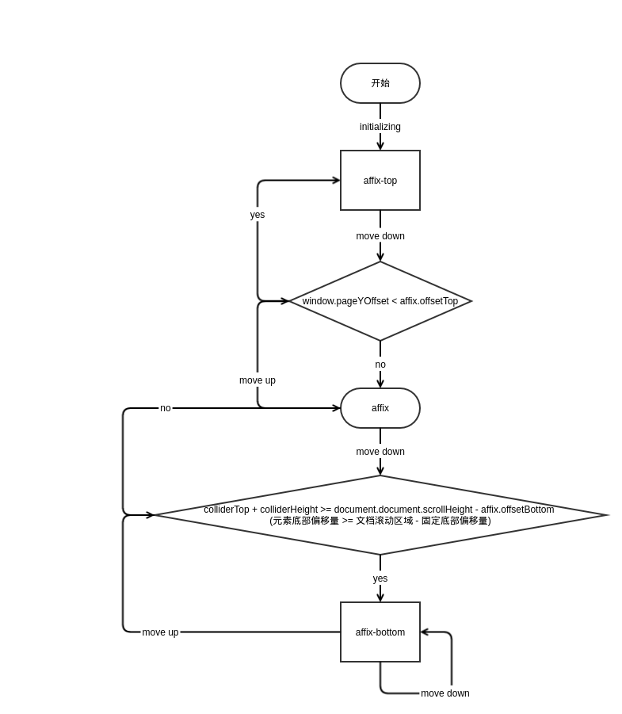

Affix（粘条或自动定位浮标或固定定位），可以实现固定侧边导航条，即：

- 在顶部的时候侧边导航条可以一起向上滚动；
- 页面滚动到一定高度的时候侧边导航条位置固定不变；
- 页面滚动到底部时侧边导航条继续一起向上滚动（避免与底部 footer 重叠）；

# 用法
1. 位置设置

    需要设置距离顶部多少距离开始固定和距离底部多少距离开始继续滚动。Bootstrap 支持两种位置设置方式：Data Attributes 和 JavaScript。Data Attributes 方式在网页加载完成后 Bootstrap 自动查找匹配 `[data-spy="affix"]` 的元素，并处理这些元素（添加一些监听事件）。JavaScript 是指通过 Bootstrap 提供的 jQuery 插件接口手动处理元素。

    - Data Attributes

    ```html
    <div data-spy="affix" data-offset-top="60" data-offset-bottom="200">
        ...
    </div>
    ```

    - JavaScript

    ```javascript
    $('#sidebar').affix({
      offset: {
        top: 60,
        bottom: function () {
        return (this.bottom = $('.footer').outerHeight(true));
        },
      },
    });
    ```

2. 样式设置

    根据元素固定位置的设定和当前页面滚动位置，元素可处于三种状态：`affix`，`affix-top` 和 `affix-bottom`，相对应的设置给元素设置类名称。

    Bootstrap 默认只给 `.affix` 设置了 样式：`{position: fixed}`，顶部和底部状态可以根据需要来覆盖样式。

# 源码



`less/utilities.less`

```less
.affix {
  position: fixed;
}
```

`js/affix.js`

```javascript
var Affix = function (element, options) {
  // ...
}
Affix.VERSION  = '3.3.7'
Affix.RESET    = 'affix affix-top affix-bottom'
Affix.DEFAULTS = {
  offset: 0,
  target: window
}
Affix.prototype.getState = function (scrollHeight, height, offsetTop, offsetBottom) {
  // ...
}
Affix.prototype.getPinnedOffset = function () {
  // ...
}
Affix.prototype.checkPositionWithEventLoop = function () {
  // ...
}
Affix.prototype.checkPosition = function () {
  // ...
}
function Plugin(option) {
  // ...
}
$.fn.affix = Plugin;
$.fn.affix.Constructor = Affix;
$.fn.affix.noConflict = function () {
  // ...
}
$(window).on('load', function () {
  // ...
})
```

# 应用
- 导航条
- 侧边栏
- 返回顶部

# 参考文献
- [Understanding Bootstrap’s Affix and ScrollSpy plugins](https://www.sitepoint.com/understanding-bootstraps-affix-scrollspy-plugins/)

