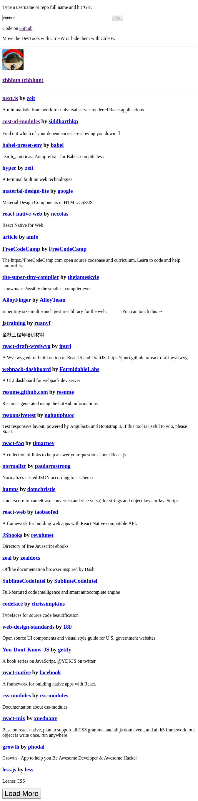
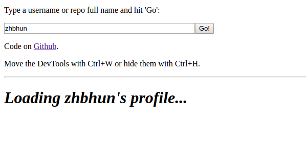
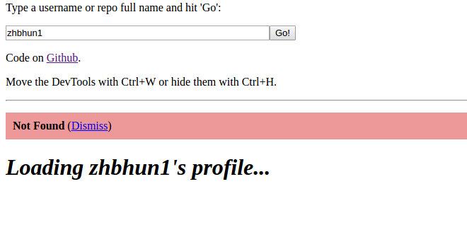
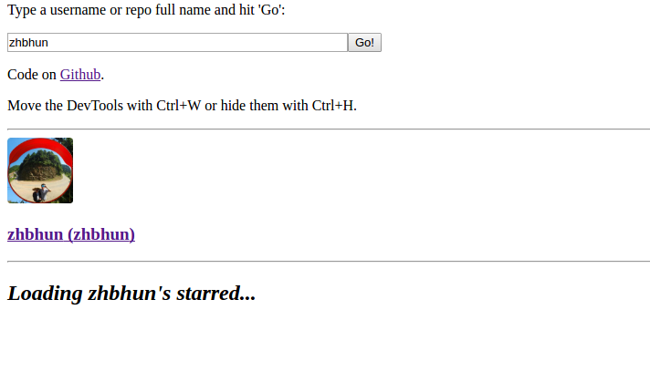
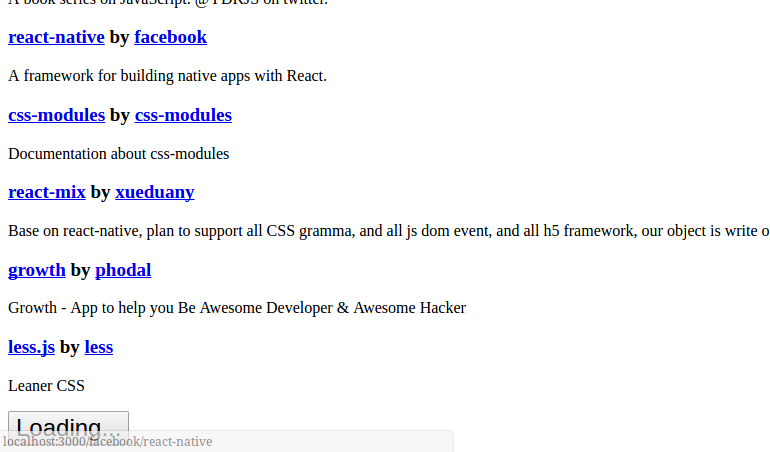
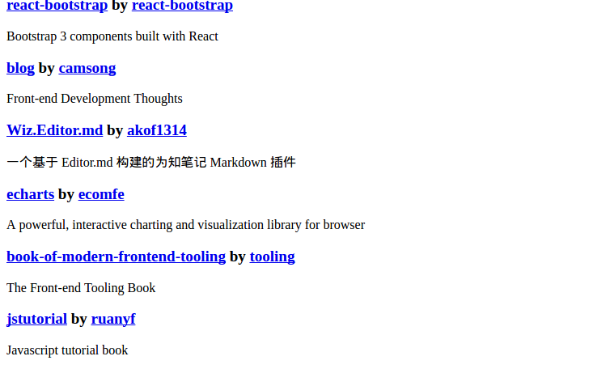

# 技术栈
- humps
- lodash
- normalizr
- react + react-dom + react-router
- redux + react-redux + redux-thunk + react-router-redux

# 需求分析
## 功能列表
- 首页
- 用户页面
- 仓库页面

## 原型设计
- 首页
- 用户页面

    - 正常：用户信息 + 加星仓库列表 + 列表分页加载按钮

        

    - 加载用户信息中

        

    - 用户信息没有找到

        
        
    - 加星仓库列表初始化中

        

    - 加星仓库列表为空

        

    - 加星仓库列表分页加载中

        

    - 加星仓库列表分页加载完（没有更多数据了）
    
        

- 仓库页面

    - 正常：仓库信息 + 用户列表 + 列表分页加载 
    - 加载仓库信息中
    - 仓库信息没有找到
    - 加星仓库的用户列表初始化中
    - 加星仓库的用户列表分页加载中
    - 加星仓库的用户列表加载完（没有更多数据了）

# 概要设计
略

# 详细设计
## 动作
略

## 状态
```javascript
{
  entities: {
    users: {
      [user_key]: {user}
    },
    repos: {
      [repos_key]: {repo}
    },
  },
  pagination: {
    starredByUser: {
      [user_key]: {
        isFetching: Boolean,
        nextPageUrl: String,
        pageCount: Number,
        ids: [repos_key]
      }
    },
    stargazersByRepo: {
      [repos_key]: {
        isFetching: Boolean,
        nextPageUrl: String,
        pageCount: Number,
        ids: [user_key]
      }
    },
  },
  errorMessage: String,
  routing,
}
```

## 展示组件
略

## 容器组件
略
