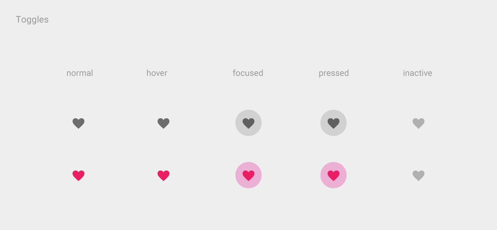
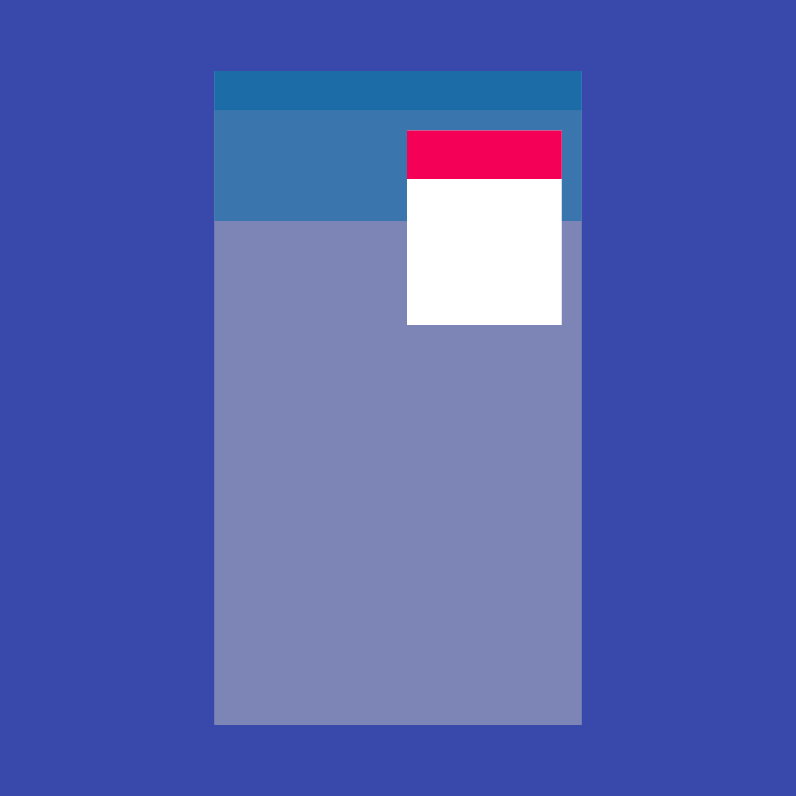

# 基础组件

## 图表

- [Materials Icon](https://material.io/resources/icons/)

## 按钮

基础组件

- [MaterialButton](https://api.flutter.dev/flutter/material/MaterialButton-class.html) - A utility class for building Material buttons that depend on the ambient ButtonTheme and Theme.
- [CupertinoButton](https://api.flutter.dev/flutter/cupertino/CupertinoButton-class.html) - An iOS-style button.

Material

- [IconButton](https://api.flutter.dev/flutter/material/IconButton-class.html) - An icon button is a picture printed on a Material widget that reacts to touches by filling with color (ink).

    

    - [BackButton](https://api.flutter.dev/flutter/material/BackButton-class.html) - A material design back button.
    - [CloseButton](https://api.flutter.dev/flutter/material/CloseButton-class.html) - A material design close button.

- [FlatButton](https://api.flutter.dev/flutter/material/FlatButton-class.html) - A flat button is a section printed on a Material Components widget that reacts to touches by filling with color.

    

- [OutlineButton](https://api.flutter.dev/flutter/material/OutlineButton-class.html) - A medium-emphasis button for secondary actions that are important but are not the primary action in an app.

    

- [RaisedButton](https://api.flutter.dev/flutter/material/RaisedButton-class.html) - A Material Design raised button. A raised button consists of a rectangular piece of material that hovers over the interface.

    

- [FloatingActionButton](https://api.flutter.dev/flutter/material/FloatingActionButton-class.html) - A floating action button is a circular icon button that hovers over content to promote a primary action in the application. Floating action buttons are most commonly used in the Scaffold.floatingActionButton field.

    

- [PopupMenuButton](https://api.flutter.dev/flutter/material/PopupMenuButton-class.html) - Displays a menu when pressed and calls onSelected when the menu is dismissed because an item was selected.

    

- [DropdownButton](https://api.flutter.dev/flutter/material/DropdownButton-class.html) - Shows the currently selected item and an arrow that opens a menu for selecting another item.

    

- [ButtonBar](https://flutter.dev/docs/development/ui/widgets/material) - A horizontal arrangement of buttons.

    

### 常见问题

- 如何让按钮匹配父组件大小

    - [Button Width Match Parent : Flutter](https://stackoverflow.com/questions/50014342/button-width-match-parent-flutter)
