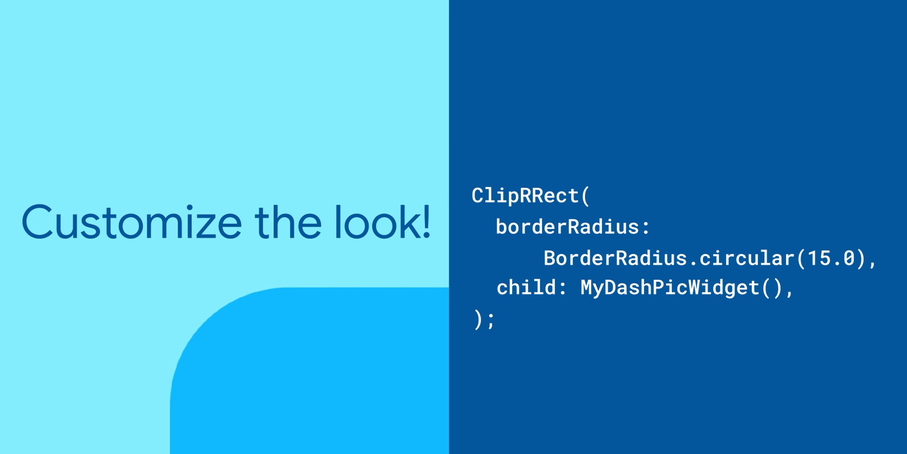
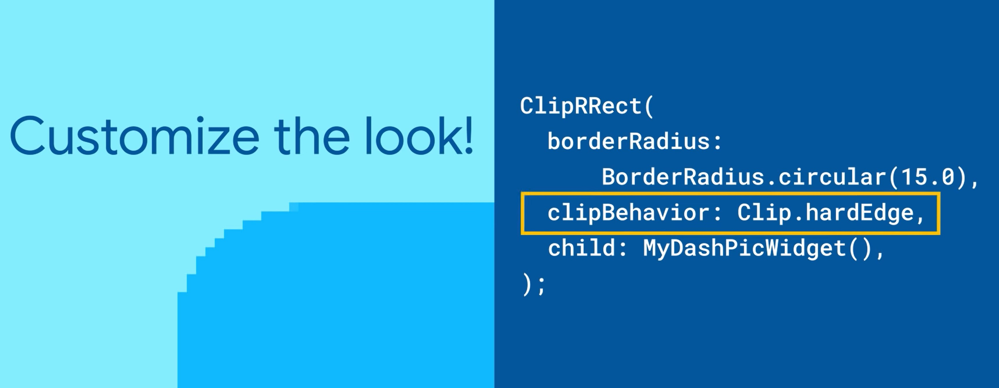
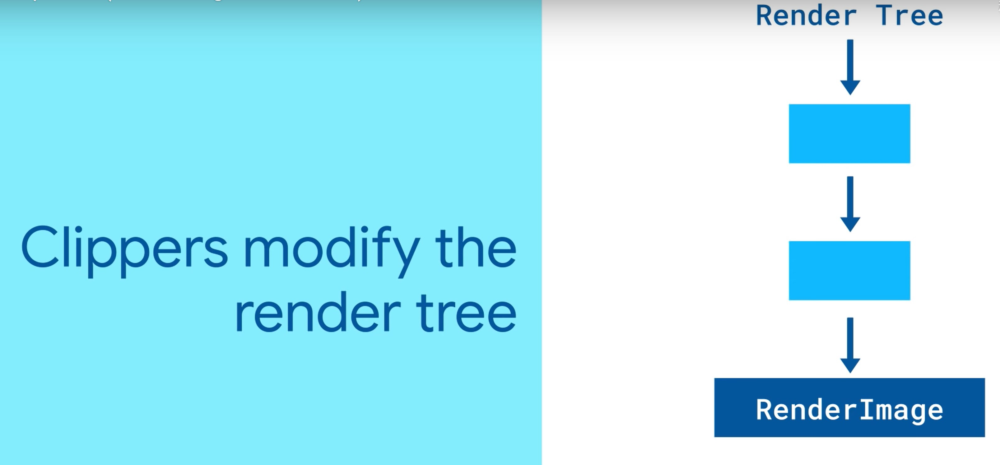
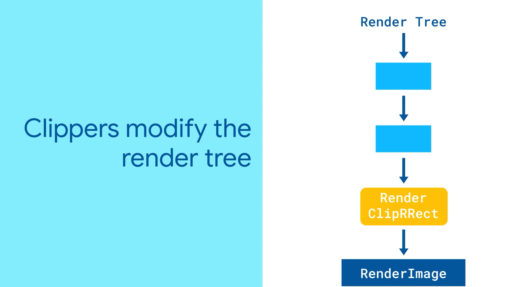
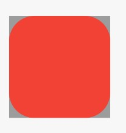
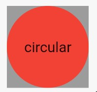
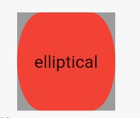
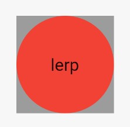
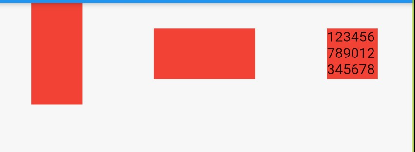
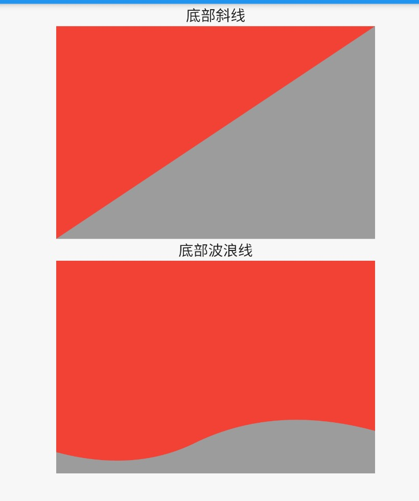

# 裁剪

裁剪方式

1. 圆角：将子组件裁剪为圆角矩形
2. 矩形：剪裁子组件到实际占用的矩形大小（溢出部分剪裁）
3. 路径：按路径裁剪子组件

裁剪行为

1. Clip.antiAlias：抗锯齿 —— 性能中等，效果可接受

	

2. Clip.antiAliasWithSaveLayer：不仅支持抗锯齿，而且分配了屏幕外缓冲区，所有后续的绘画都在该缓冲区上执行，然后最终被裁剪并重新合成。—— 这种方式性能最慢
3. Clip.hardEdge：裁剪但不支持抗锯齿 —— 性能最好，但是裁剪边缘会出现锯齿

	



1



## 圆角 - ClipRRect / ClipOval

### 用法

ClipRRect 实现圆角裁剪，ClipOval 实现椭圆裁剪。ClipRRect 也可以实现 ClipOval 效果，但是 ClipRRect 需要自己计算椭圆半径，而 ClipOval 自动计算实现椭圆裁剪，所以在实现椭圆裁剪时优先使用 ClipOval。

1. 圆角矩形

	

	```dart
    ClipRRect({
      Key key,
      BorderRadius borderRadius: BorderRadius.zero, // 边框角度
      CustomClipper<RRect> clipper, // 定制裁剪
      Clip clipBehavior: Clip.antiAlias, // 裁剪行为
      Widget child // 子组件
    })
	```

2. 椭圆

	

    ```dart
    ClipOval({
      Key key,
      CustomClipper<Rect> clipper, // 定制裁剪
      Clip clipBehavior: Clip.antiAlias, // 裁剪行为
      Widget child // 子组件
    })
    ```


### 圆角计算

1. 圆形

	```dart
	Container(
      color: Colors.grey,
      child: ClipRRect(
        borderRadius: BorderRadius.all(Radius.circular(40)),
        child: Container(
          width: 80,
          height: 80,
          color: Colors.red,
          alignment: Alignment.center,
          child: Text('circular'),
        ),
      ),
    );
	```
	
	
	
2. 椭圆

    ```dart
    Container(
      color: Colors.grey,
      child: ClipRRect(
        borderRadius: BorderRadius.all(Radius.elliptical(20, 40)),
        child: Container(
          width: 80,
          height: 80,
          alignment: Alignment.center,
          color: Colors.red,
          child: Text('elliptical'),
        ),
      ),
    );
    ```

	
	
3. 插值椭圆

    ```dart
    Container(
      color: Colors.grey,
      child: ClipRRect(
        borderRadius: BorderRadius.all(
          Radius.lerp(
            Radius.circular(10),
            Radius.circular(40),
            1,
          ),
        ),
        child: Container(
          width: 80,
          height: 80,
          alignment: Alignment.center,
          color: Colors.red,
          child: Text('lerp'),
        ),
      ),
    );
    ```

	

	```dart
    static Radius lerp(Radius a, Radius b, double t) {
      assert(t != null);
      if (a == null && b == null)
        return null;
      if (a == null)
        return Radius.elliptical(b.x * t, b.y * t);
      if (b == null) {
        final double k = 1.0 - t;
        return Radius.elliptical(a.x * k, a.y * k);
      }
      return Radius.elliptical(
        lerpDouble(a.x, b.x, t),
        lerpDouble(a.y, b.y, t),
      );
    }

    T lerp(double t) {
      assert(begin != null);
      assert(end != null);
      return begin + (end - begin) * t;
    }
	```
    

### 四角配置

1. `BorderRadius.only({Radius topLeft: Radius.zero, Radius topRight: Radius.zero, Radius bottomLeft: Radius.zero, Radius bottomRight: Radius.zero })`：只设定某个角
2. `BorderRadius.all(Radius radius)`：统一设定所有角
3. `BorderRadius.circular(double radius)`：统一设定圆角
4. `BorderRadius.vertical({Radius top: Radius.zero, Radius bottom: Radius.zero })`：按垂直方向设定
5. `BorderRadius.circular(double radius)`：按水平方向设定
6. `BorderRadius.lerp(BorderRadius a, BorderRadius b, double t)`：插值

## 矩形 - ClipRect

用法

```dart
ClipRect({
  Key key,
  CustomClipper<Rect> clipper, // 定制裁剪
  Clip clipBehavior: Clip.hardEdge, // 裁剪行为
  Widget child // 裁剪组件
})
```

示例

```dart
Container(
  width: 50,
  color: Colors.grey,
  child: ClipRect(
    child: Container(
      width: 100,
      height: 100,
      color: Colors.red,
    ),
  ),
);
Container(
  height: 50,
  color: Colors.grey,
  child: ClipRect(
    child: Container(
      width: 100,
      height: 100,
      color: Colors.red,
    ),
  ),
);
Container(
  width: 50,
  height: 50,
  color: Colors.grey,
  child: ClipRect(
    child: Container(
      width: 100,
      height: 100,
      color: Colors.red,
      child: Text('123456789012345678901234567890'),
    ),
  ),
);
```




## 路径 - ClipPath

用法

```dart
ClipPath({
  Key key
  CustomClipper<Path> clipper, // 定制裁剪路径
  Clip clipBehavior: Clip.antiAlias, // 裁剪行为
  Widget child // 裁剪组件
})
```

示例

```dart
import 'package:flutter/material.dart';
import 'package:flutter_tester/ExampleLists.dart';

class ClipPathExamples extends StatelessWidget {
  static final example =
      ExampleItem(title: 'ClipPath', widget: () => ClipPathExamples());

  @override
  Widget build(BuildContext context) {
    return Scaffold(
      appBar: AppBar(title: Text('ClipPath')),
      body: Column(
        children: <Widget>[
          Text('底部斜线'),
          Row(
            mainAxisAlignment: MainAxisAlignment.spaceAround,
            children: <Widget>[
              Container(
                color: Colors.grey,
                child: ClipPath(
                  clipper: _BottomSlashClipper(),
                  child: Container(
                    width: 300,
                    height: 200,
                    color: Colors.red,
                  ),
                ),
              ),
            ],
          ),
          Text('底部波浪线'),
          Row(
            mainAxisAlignment: MainAxisAlignment.spaceAround,
            children: <Widget>[
              Container(
                color: Colors.grey,
                child: ClipPath(
                  clipper: _BottomWaveClipper(),
                  child: Container(
                    width: 300,
                    height: 200,
                    color: Colors.red,
                  ),
                ),
              ),
            ],
          ),
        ],
      ),
    );
  }
}

class _BottomSlashClipper extends CustomClipper<Path> {
  @override
  Path getClip(Size size) {
    var path = Path();

    // Draw a straight line from current point to the bottom left corner.
    path.lineTo(0.0, size.height);

    // Draw a straight line from current point to the top right corner.
    path.lineTo(size.width, 0.0);

    // Draws a straight line from current point to the first point of the path.
    // In this case (0, 0), since that's where the paths start by default.
    path.close();
    return path;
  }

  @override
  bool shouldReclip(CustomClipper<Path> oldClipper) => false;
}


class _BottomWaveClipper extends CustomClipper<Path> {
  @override
  Path getClip(Size size) {
    var path = new Path();
    path.lineTo(0.0, size.height - 20);

    var firstControlPoint = Offset(size.width / 4, size.height);
    var firstEndPoint = Offset(size.width / 2.25, size.height - 30.0);
    path.quadraticBezierTo(firstControlPoint.dx, firstControlPoint.dy,
        firstEndPoint.dx, firstEndPoint.dy);

    var secondControlPoint =
    Offset(size.width - (size.width / 3.25), size.height - 65);
    var secondEndPoint = Offset(size.width, size.height - 40);
    path.quadraticBezierTo(secondControlPoint.dx, secondControlPoint.dy,
        secondEndPoint.dx, secondEndPoint.dy);

    path.lineTo(size.width, size.height - 40);
    path.lineTo(size.width, 0.0);
    path.close();

    return path;
  }

  @override
  bool shouldReclip(CustomClipper<Path> oldClipper) => false;
}
```

