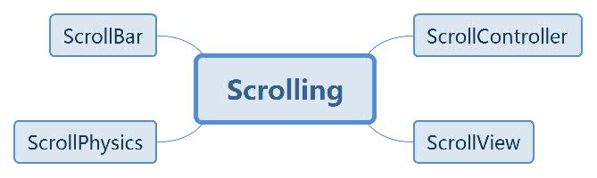
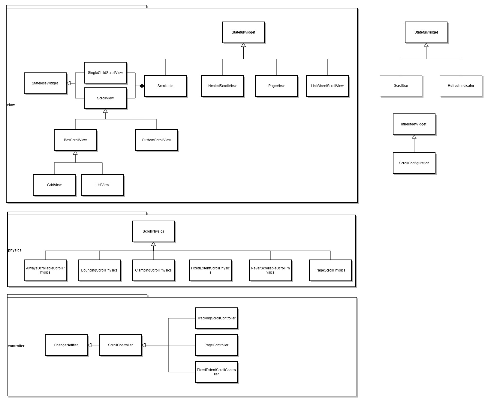

# 滚动





- view：滚动视图，不同滚动视图子组件渲染机制不一样，例如 SingleChildScrollView 的子组件只有一个，ListView 的子组件是一个列表，GridView 的子组件是一个网格
- direction：滚动方向，可选值是水平或垂直。
- bar：滚动条，指示当前的滚动位置
- refresh：下拉刷新，一种刷新滚动内容的交互方式
- controller：控制器，控制和监听股东你位置
- physics：物理效果，控制滚动组件响应用户操作的效果，例如 iOS 的弹性拖动

## 滚动视图

- controller：此属性接受一个 [ScrollController](https://api.flutter.dev/flutter/widgets/ScrollController-class.html) 对象。ScrollController 的主要作用是控制滚动位置和监听滚动事件。默认情况下，Widget 树中会有一个默认的 PrimaryScrollController，如果子树中的可滚动组件没有显式的指定 controller，并且 primary 属性值为true时（默认就为true），可滚动组件会使用这个默认的 PrimaryScrollController。这种机制带来的好处是父组件可以控制子树中可滚动组件的滚动行为，例如，Scaffold 正是使用这种机制在 iOS 中实现了点击导航栏回到顶部的功能。
- physics：此属性接受一个 [ScrollPhysics](https://api.flutter.dev/flutter/widgets/ScrollPhysics-class.html) 类型的对象，它决定可滚动组件如何响应用户操作，比如用户滑动完抬起手指后，继续执行动画，或者滑动到边界时，如何显示。默认情况下，Flutter 会根据具体平台分别使用不同的 ScrollPhysics 对象，应用不同的显示效果，如当滑动到边界时，继续拖动的话，在 iOS 上会出现弹性效果，而在 Android 上会出现微光效果。如果你想在所有平台下使用同一种效果，可以显式指定一个固定的   ScrollPhysics，Flutter SDK 中包含了两个 ScrollPhysics 的子类，他们可以直接使用：

    - ClampingScrollPhysics：Android下微光效果。
    - BouncingScrollPhysics：iOS下弹性效果。

- scrollDirection：滚动方向。

### [SingleChildScrollView](https://api.flutter.dev/flutter/widgets/SingleChildScrollView-class.html)

**配置：**

- reverse：是否按照阅读方向相反的方向滑动，如：scrollDirection 值为 Axis.horizontal，如果阅读方向是从左到右(取决于语言环境，阿拉伯语就是从右到左)。reverse 为 true 时，那么滑动方向就是从右往左。其实此属性本质上是决定可滚动组件的初始滚动位置。
- primary：指是否使用 widget 树中默认的 PrimaryScrollController；当滑动方向为垂直方向并且没有指定 controller 时，primary 默认为 true。
- padding：内边距

**应用：**

1. 配合 Column 使用，处理空间不足的情况，例如：考虑适配小屏设备、横屏模式或小窗模式。
2. ...

**参考：**

- [SingleChildScrollView](https://book.flutterchina.club/chapter6/single_child_scrollview.html)

### TODO

- [可滚动组件简介](https://book.flutterchina.club/chapter6/intro.html)
- [ListView](https://book.flutterchina.club/chapter6/listview.html)
- [GridView](https://book.flutterchina.club/chapter6/gridview.html)
- [CustomScrollView](https://book.flutterchina.club/chapter6/custom_scrollview.html)

## 滚动监听

**用法：**

- initialScrollOffset：设置初始化滚动位置 —— `ScrollController(initialScrollOffset: 100)`
- keepScrollOffset：是否保存滚动位置，如果设置为 true 且配置了 PageStorageKey，那么即使滚动组件销毁再重建也可以恢复滚动位置

    ps：一个路由中包含多个可滚动组件时，如果要分别跟踪它们的滚动位置，并非一定就得给他们分别提供 PageStorageKey。这是因为 Scrollable 本身是一个 StatefulWidget，它的状态中也会保存当前滚动位置，所以，只要可滚动组件本身没有被从树上 detach 掉，那么其 State 就不会销毁(dispose)，滚动位置就不会丢失。只有当 Widget 发生结构变化，导致可滚动组件的 State 销毁或重新构建时才会丢失状态，这种情况就需要显式指定 PageStorageKey，通过 PageStorage 来存储滚动位置，一个典型的场景是在使用 TabBarView 时，在 Tab 发生切换时，Tab 页中的可滚动组件的 State 就会销毁，这时如果想恢复滚动位置就需要指定 PageStorageKey。

- jumpTo：滚动到指定位置
- animateTo：带动画地滚动到指定位置
- addListener：滚动监听，在滚动位置变化时触发调用回调函数
- offset：获取当前滚动偏移量，通常在 addEventListener 回调函数里访问
- positions：一个 ScrollController 对象可以同时被多个可滚动组件使用，ScrollController会为每一个可滚动组件创建一个 ScrollPosition 对象，这些 ScrollPosition 保存在 ScrollController 的 positions 属性中（List<ScrollPosition>）。ScrollPosition是真正保存滑动位置信息的对象，offset只是一个便捷属性：`double get offset => position.pixels;`。

    ps：一个 ScrollController 虽然可以对应多个可滚动组件，但是有一些操作，如读取滚动位置offset，则需要一对一！但是我们仍然可以在一对多的情况下，通过其它方法读取滚动位置，举个例子，假设一个 ScrollController 同时被两个可滚动组件使用，那么我们可以通过如下方式分别读取他们的滚动位置：

    ```dart
    // ...
    controller.positions.elementAt(0).pixels
    controller.positions.elementAt(1).pixels
    // ...
    ```

    我们可以通过 controller.positions.length 来确定 controller 被几个可滚动组件使用。

**原理**

当 ScrollController 和可滚动组件关联时，可滚动组件首先会调用 ScrollController 的 createScrollPosition() 方法来创建一个 ScrollPosition 来存储滚动位置信息，接着，可滚动组件会调用 attach() 方法，将创建的 ScrollPosition 添加到 ScrollController 的 positions 属性中，这一步称为“注册位置”，只有注册后 animateTo() 和 jumpTo() 才可以被调用。

当可滚动组件销毁时，会调用 ScrollController 的 detach() 方法，将其 ScrollPosition 对象从 ScrollController 的 positions 属性中移除，这一步称为“注销位置”，注销后 animateTo() 和 jumpTo() 将不能再被调用。

需要注意的是，ScrollController的animateTo() 和 jumpTo() 内部会调用所有 ScrollPosition 的 animateTo() 和 jumpTo()，以实现所有和该 ScrollController 关联的可滚动组件都滚动到指定的位置。

**应用：**

1. 置顶按钮
2. 加载更多

**参考：**

- [滚动监听及控制](https://book.flutterchina.club/chapter6/scroll_controller.html)

## 参考文献

- [Scrolling widgets](https://flutter.dev/docs/development/ui/widgets/scrolling)

## TODO

- [LayoutBuilder](https://api.flutter.dev/flutter/widgets/LayoutBuilder-class.html)
- [IntrinsicHeight](https://api.flutter.dev/flutter/widgets/IntrinsicHeight-class.html)
- [Notification](https://api.flutter.dev/flutter/widgets/Notification-class.html) / [NotificationListener](https://api.flutter.dev/flutter/widgets/NotificationListener-class.html) / [ScrollNotification](https://api.flutter.dev/flutter/widgets/ScrollNotification-class.html)
