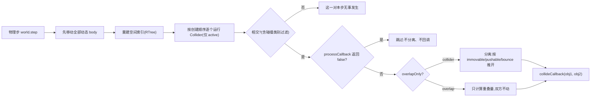

import { Canvas, Controls, Meta } from '@storybook/addon-docs/blocks';
import * as ArcadeCollision from './arcade-collision.stories';

<Meta of={ArcadeCollision} name="Docs" />

# Arcade 碰撞

本课讲 Arcade 物理的碰撞侧:`collider` 与 `overlap` 如何检测、分离和通知,分组碰撞怎么组织,以及推挤、调试渲染与暂停物理。核心判断先行:Arcade 的碰撞不是「撞上」一个动作,而是每个物理步内「检测相交 → (可选)分离 → 回调通知」三段流程;`collider` 与 `overlap` 共用同一套相交检测,差别只在中间那段——`collider` 会把重叠的双方推开(分离),`overlap` 只计算重叠量并触发回调,双方纹丝不动。理解了这一点,「选哪个」「为什么没反应」「为什么被弹飞」都有直接答案。

| 关键输入 | 默认值 | 回查要点 |
| --- | --- | --- |
| `physics.add.collider(obj1, obj2, cb)` | — | 检测 + 分离 + 回调;返回 `Collider` 句柄 |
| `physics.add.overlap(obj1, obj2, cb)` | — | 仅检测 + 回调,不分离;同样返回 `Collider` 句柄 |
| 回调签名 | `(object1, object2) => void` | 参数是游戏对象,顺序与注册时 `obj1`/`obj2` 对应;每对每步最多一次 |
| `processCallback` | `undefined` | 返回 `false` 则该对跳过:分离与回调都不发生 |
| `body.immovable` | `false`(静态体恒 `true`) | 完全不参与移动与分离;只当「墙」 |
| `body.pushable` | `true` | `false` 时不被推走,把速度全数反弹给对方 |
| `body.bounce` | `(0, 0)` | 各自缩放自己的反弹;0 表示分离后停住 |
| `body.mass` | `1` | 双方都可推时按质量分配速度交换 |
| `body.friction` | `(1, 0)` | immovable 移动平台的「带动」比例:骑乘者水平跟随 |
| `physics: { arcade: { debug } }` | `false` | 开启后画 body 描边(品红)、静态体(蓝)、速度线(绿) |
| `world.pause()` / `isPaused` | 运行中 | 暂停后 body 与 collider 全部停跑,手动检测仍可用 |

## 快速上手

最小闭环是两个对象、两行注册:实体之间用 `collider`(会推开),触发式交互用 `overlap`(不推开)。

```ts
// 实体碰撞:玩家落在平台上(检测 + 分离 + 回调)
this.physics.add.collider(player, platforms);

// 触发判定:玩家吃到星星(只检测 + 回调,双方不动)
this.physics.add.overlap(player, stars, (_player, star) => {
  (star as Phaser.Physics.Arcade.Image).destroy();
});
```

两类注册的完整行为差异、参数组合与回调语义见下节。先把本课的完整范例跑起来——它是「玩家 + 平台 + 收集物 + 危险物」的经典组合,Controls 覆盖本课全部可变机制。

<Canvas of={ArcadeCollision.CollisionLab} />
<Controls of={ArcadeCollision.CollisionLab} />

| 读者操作 | 可观察证据 |
| --- | --- |
| 初始加载 | debug 绘制默认开启:品红描边是动态 body,蓝色是静态 body,绿线是速度向量 |
| 按 `←`/`→` 走向箱子 | 箱子判定事件递增,最近回调对变 `player ↔ crate1`;箱子被推走后因 drag 停下 |
| 「箱子判定」切到 `overlap` | 玩家直接穿过箱子;判定事件仍在递增——检测照跑,只是不再分离 |
| 「箱子 immovable」勾上 | 玩家撞箱被挡住或弹开,箱子原地不动(推挤语义消失) |
| 「玩家 bounce」调到 `0.8` | 落地与撞箱后明显回弹;调回 `0` 落地即停 |
| 跳上橙色移动平台站立 | 玩家 touching 显示 `down`;「玩家 x」随平台往返同步变化(默认带动 1) |
| 「平台带动」调到 `0` | 平台照常移动,玩家原地不动地从平台侧面滑落 |
| 吃到黄圆 / 碰到红三角 | 收集数 +1 并 1.6s 后补生成;命中数 +1 且玩家被弹开(overlap 里手写的击退) |
| 关闭「debug 绘制」 | 描边与速度线消失,游戏行为不变 |
| 勾选「暂停物理」 | 全场冻结,物理状态变 `paused`;取消勾选恢复 |
| 打开 Show code | 看到该 Canvas 实际执行的 `collision-lab.ts` 全文 |

实例滚出视口或页面切到后台时会整体休眠以省资源,回到视口自动恢复;readout 冻结只说明循环暂停,不代表游戏状态变化。

## collider 与 overlap

`physics.add.collider` 与 `physics.add.overlap` 都在工厂里创建一个 `Collider` 对象交给物理世界,之后**每个物理步**自动执行,不需要在 `update` 里手动调用。两者唯一的构造差异是一个 `overlapOnly` 标志,它决定检测到相交后走不走「分离」:



三个直接推论:

- **「检测」与「响应」是两件事。**`overlap` 不分离,但检测、过滤、回调一应俱全——收集、命中、触发器都该用它;反过来,把「捡东西」写成 `collider` 会让角色被道具撞来撞去。
- **回调发生在分离之后。**`collider` 的回调里读到的坐标已经是推开后的位置;`body.touching` 也是分离时写上的,所以回调里可以直接用它判断碰撞方向。
- **执行顺序 = 注册顺序。**多个 Collider 按创建顺序依次运行,前者分离出的位置变化对后者立即可见;这也是「先落地再捡道具」这类顺序敏感逻辑的依据。

`overlap` 的一点补充:`overlapOnly` 模式下重叠量照常写进 `body.embedded` / `touching`,所以 overlap 也会更新 touching——但它不会改任何一方的速度或位置。

### 参数组合

`object1` / `object2` 的类型是 `ArcadeColliderType`:单个游戏对象、物理 body、`Group` / `StaticGroup`、`TilemapLayer`,或它们组成的数组。常见组合与展开语义:

| 组合 | 写法 | 展开语义 |
| --- | --- | --- |
| 对象 - 对象 | `collider(player, crate)` | 一对一,最廉价 |
| 对象 - 组 | `collider(player, crates)` | player 对组内每个成员逐一检测 |
| 组 - 组 | `collider(bullets, enemies)` | 每颗子弹对每个敌人,两两检测 |
| 组 - 自身 | `collider(crates, crates)` | 组内成员互撞(自己那对会被跳过);运行时省略 `object2` 写 `collider(crates)` 等效 |
| 数组 | `collider([a, b], c)` | 数组展开,等价于逐个对 `c` 注册 |

静态与动态可以自由混用:静态体天然 `immovable`,分离时永远只有动态一侧被推开。两个静态体互相注册没有意义——双方都不会动,检测虽能跑但没有可观察结果;组 - 图块地图的碰撞属 [5.2 地图碰撞与交互](?path=/docs/tilemap-collision--docs)。

判定是「按对注册、每步全量」的:`collider(a, b)` 与 `collider(b, a)` 检测同一批对,只是回调参数顺序对调;已注册的对象后来加进组里,下一帧自动纳入检测,不需要重新注册。

### 回调与 processCallback

两个回调共用一个签名类型 `ArcadePhysicsCallback`,第 5 个参数是回调执行的 `this`:

```ts
this.physics.add.collider(
  player, crates,
  // collideCallback:每检测到一对相交(且未被 processCallback 否决)调用一次
  (obj1, obj2) => { /* ... */ },
  // processCallback:相交后先问它;返回 false 则这一对本步既不分离也不回调
  (obj1, obj2) => obj1.name !== 'ghost',
  this, // callbackContext:前两个回调里的 this
);
```

- **参数是游戏对象,不是 body。**传入顺序与注册时 `object1` / `object2` 对应;要物理量就再取 `.body`。组 - 组检测时,组侧参数是该对里具体的那个成员。
- **每对每步最多一次。**一对相交的物体在一个物理步里只触发一次回调;持续重叠就每步各来一次。范例里「箱子判定事件」在贴着箱子站时会每帧 +1,就是这个语义。
- **`processCallback` 返回 `false` 跳过的是整段响应。**不只是不回调——分离也被跳过,双方像互相不存在。用 `collisionCategory` / `setCollidesWith` 能做同类过滤,但 per-pair 的一次性判断(无敌帧、单向平台)用 processCallback 最直接。

一个与帧率相关的细节:物理世界默认 `fixedStep: true`、`fps: 60`。渲染帧率与物理步率不一致时,一个渲染帧可能补跑多个物理步(`world.stepsLastFrame` 可查),回调也随之多触发几次;而回调里写逻辑时通常不需要关心——按「每步」理解即可,频率敏感的计数(如范例的命中冷却)要自己加时间窗。

### Collider 句柄

`collider` / `overlap` 返回 `Phaser.Physics.Arcade.Collider` 句柄,后续控制都落在它身上:

```ts
const crateCollider = this.physics.add.collider(player, crates, onPair);
crateCollider.name = 'player-vs-crates'; // 仅作标注,Phaser 不使用
crateCollider.active = false;            // 暂停这一对判定:检测与回调全部停跑
crateCollider.destroy();                 // 彻底移除并释放
this.physics.world.removeCollider(crateCollider); // 只摘除不销毁
this.physics.world.colliders.add(crateCollider);  // 摘除过的可重新挂回
```

- **`active` 是最常用的开关。**范例用同一对对象注册了 `collider` 与 `overlap` 各一个,靠 `active` 二选一——readout 的「活动 collider」随之在 5/6 与 4/6 间切换(总共 6 个注册)。
- **`destroy()` 会自动从世界摘除**;`removeCollider` 只摘不毁,适合成对开关的场景。
- **暂停整个世界是另一档开关。**`world.pause()` 后所有 Collider 停跑(见[调试、观测与暂停](#调试观测与暂停)),`active` 只关一对,粒度不同。

注:Phaser 4(4.2.1)中该句柄类就是 `Phaser.Physics.Arcade.Collider`,不存在 `ArcadeColliderProxy` 一类的包装类型,以上属性即全部公开控制面。

## 分离与推挤

`collider` 检测到相交后的分离不是「弹开」一个动作,而是一组按 body 属性分配位移和速度的规则。四个属性决定结果,全部可逐 body 设置:

| 属性 | 默认 | 语义 |
| --- | --- | --- |
| `immovable` | `false` | 永不移动、永不被分离;分离位移全部给对方(静态体恒 `true`) |
| `pushable` | `true` | `false` 时不被推走,把收到的速度全数反弹给对方 |
| `bounce` | `(0, 0)` | 各自缩放**自己**的反弹速度;0 表示分离后速度归零 |
| `mass` | `1` | 双方都可推时,按质量分配分离后的速度交换 |

判断顺序从强到弱:

- **一方 `immovable`**:它纹丝不动,另一方被推出重叠区。动态体 + `setImmovable(true)` 是「会移动但推不动」的配方(移动平台、电梯);静态体是「根本不动」的墙体——区别在静态体不参与每帧运动积分,大量摆放时代价更低。
- **双方都可推(`pushable: true`)**:重叠区对半分,速度按质量加权交换——重物把轻物撞得更远。
- **一方 `pushable: false`**:它不动,但**不是** immovable:自己仍可被玩家直接控制移动,只是碰撞给它的速度会原样反弹给对方。两个 `pushable: false` 相撞时,分离量与速度交换对半分摊。
- **两个 `immovable`(或两个静态体)相撞**:不分离,但检测照常——回调仍会触发,这是「触发器用 collider 注册」时要注意的边界。

`bounce` 没有继承关系:每个 body 只用自己的 `bounce` 缩放自己的反弹。范例里「玩家 bounce」调到 0.8,被撞的箱子(仍是 0)不会跟着弹——想让它也弹要给它自己 `setBounce`。分离的轴序也有规则:默认先把重力更大的轴分开(通常是竖直),`world.forceX: true` 可强制先水平。

另一组容易混淆的对照:`pushable: false` 与 `immovable: true`。前者「不接收碰撞速度,但保留自身运动能力」;后者「彻底钉死」。挡板、墙选 immovable;「可以走动但撞不动」的 NPC 选 pushable。

## 分组与静态体

碰撞的大多数注册发生在「组」上。`physics.add.group(config)` 创建动态物理组:组工厂 `create()` 出来的每个成员自动带动态 body,且 config 里的物理字段会作为**组内默认值**套给每个新成员——新建成员时统一给属性,比逐个 `set` 更不容易漏:

```ts
const bullets = this.physics.add.group({
  allowGravity: false,  // 组内默认:不吃重力
  bounceX: 0.5,         // 撞墙弹一下
  immovable: false,     // 可被推动(默认)
  // 完整清单:collideWorldBounds、velocityX/Y、dragX/Y、maxVelocity、mass……
});
```

可配置字段与 `Body` 的同名 setter 一一对应(`PhysicsGroupConfig`);Group 本身的组织能力(遍历、`get`/`getFirstDead` 复用、数量)属 [2.2.4 容器与分组](?path=/docs/containers-groups--docs),运行时生销复用对象池的做法属 [6.1.1 性能优化](?path=/docs/performance--docs)。

`physics.add.staticGroup()` 创建静态组,成员全部是静态 body。静态体的 body 在创建时锚定位置,**手动改了游戏对象坐标后 body 不会跟着走**,需要同步:

```ts
const walls = this.physics.add.staticGroup();
walls.create(360, 300, 'wall');
// 之后挪动了某个成员:
wall.x += 40;
walls.refresh();          // 全组刷新:body 对齐到游戏对象当前位置
// 单个成员对齐用 wall.refreshBody()(还可改尺寸)
```

`createMultiple` 批量创建后组会自动调一次 `refresh`,所以「先批量摆位再批量刷新」是常见顺序;`refresh` 只同步位置,不改 body 尺寸。组的 `runChildUpdate: true` 会让组内每个成员的 `update()` 被场景自动调用(普通 Group 与物理组同款,属 [2.2.4](?path=/docs/containers-groups--docs))。

## 移动平台与摩擦

「会动的平台,站上去被带着走」在 Arcade 里是一套专门的机制,不是自然推挤的结果:平台的 `friction` 表示**它每帧位移传给骑乘者的比例**。前提有两个——平台是**动态体 + immovable**(会动、推不动),且双方用 `collider` 注册(分离才会走到摩擦传递)。

```ts
// 动态体 + immovable + 速度巡逻 = 可骑乘的移动平台
const mover = this.physics.add.image(x, y, 'mover')
  .setImmovable(true)
  .setVelocityX(90);        // update 里到端点反向

this.physics.add.collider(player, mover); // 必须 collider,overlap 不分离

mover.setFriction(1);       // 默认 (1, 0):骑乘者水平 100% 跟随,竖直 0
```

- `friction.x` 在**竖直分离**时生效(平台上下表面驮着人走),`friction.y` 在水平分离时生效(电梯侧面带人)。默认 `(1, 0)`:水平全带动、竖直不带动,恰好是横移平台的常态。
- 调到 `0` 就是「脚踩传送带却原地打滑」:平台从玩家脚下平移出去,玩家不动,直到失去支撑掉落——范例「平台带动」滑到 0 可直接观察。
- 静态体不会动,`friction` 对它无意义;它也没法当移动平台用,这正是「动态 immovable」存在的理由。

## 调试、观测与暂停

碰撞问题多半出在「body 和你看到的不一样」或「判定根本没注册」。三套工具分别对应:debug 绘制看形状,body 标志量看接触状态,暂停与步进控制看时机。

### debug 绘制

game config 的 `physics.arcade.debug` 打开后,世界自动创建一个 `Graphics`(`world.debugGraphic`),每帧把所有 body 画在上面:

```ts
physics: {
  default: 'arcade',
  arcade: {
    debug: true,                    // 总开关
    debugShowBody: true,            // 动态体描边(默认 true)
    debugShowStaticBody: true,      // 静态体描边(默认 true)
    debugShowVelocity: true,        // 速度向量线(默认 true)
    debugBodyColor: 0xff00ff,       // 动态体:品红(默认)
    debugStaticBodyColor: 0x0000ff, // 静态体:蓝(默认)
    debugVelocityColor: 0x00ff00,   // 速度线:绿(默认)
  },
},
```

两层开关:`world.drawDebug` 控制是否重画,`world.debugGraphic.setVisible()` 控制是否显示(范例的开关落在后者,只是隐藏、不再渲染)。`world.defaults` 里的值是**新 body 的默认**——创建后想单点某个 body:`body.debugShowBody = false` 或换 `body.debugBodyColor`。调试图形默认排在显示列表较早的位置,常被精灵盖住,`world.debugGraphic.setDepth(高值)` 提到最上层。

### touching 与 blocked

body 每步维护两组接触标志,是「落地了吗」「贴墙了吗」这类判定的权威数据源:

- **`body.touching`**——本步与**另一个 body**接触的面:`up` / `down` / `left` / `right` / `none`。分离时写入,回调里读到的已是本步结果。
- **`body.blocked`**——本步被**世界边界或图块**挡住的面,字段同上。范例的跳跃条件 `blocked.down || touching.down` 两个都查,因为站在静态平台上是 touching,压到世界底边是 blocked(世界边界的配置与碰撞属 [3.1 Arcade 物理](?path=/docs/arcade-physics--docs))。
- **`body.wasTouching`**——上一步的 touching,「刚离开」类判断用。
- **`body.embedded`**——完全陷入另一个 body 内部时为 `true`(高速穿透的信号,常配合 `world.OVERLAP_BIAS` 排查)。

落地跳的惯用写法就是范例那句:`body.blocked.down || body.touching.down`。

### 暂停与步进

- **`world.pause()` / `resume()`**:暂停后 body 不再积分、Collider 不再运行,`isPaused` 可查;范例勾选「暂停物理」即冻结全场。暂停期间**手动**调 `world.collide()` / `world.overlap()` 仍能跑一次性检测——做暂停菜单里的命中判定有用。
- **每帧时机**:场景 UPDATE 事件驱动 `world.update` → 先移动所有动态 body → 重建空间索引 → 按注册顺序跑所有 active 的 Collider → 发出 `WORLD_STEP` 事件;随后才执行你的 `Scene.update()`;最后 POST_UPDATE 事件里 `world.postUpdate` 把 body 位置写回游戏对象并画 debug。因此 `Scene.update` 里读到的 `touching` 是**本帧刚完成那一步**的结果,但游戏对象的 `x`/`y` 此刻尚未写回——要最新位置读 `body.position`。
- **步率**:`fixedStep: true`(默认)+ `fps: 60`(默认)下物理按固定步长推进,渲染帧率波动时用 `world.stepsLastFrame` 可查当帧补了几步;`world.timeScale` 缩放物理速率。要完全自管时机:`physics.disableUpdate()` 后自己调 `world.update(time, delta)`。

## 最佳实践

- **按「要不要分离」选注册方式,不按「要不要回调」。**两种注册都带回调;区别只在分离。收集、命中、触发器一律 `overlap`;只有需要互相挡住、推开、骑乘才用 `collider`——把触发器写成 collider 是「角色被道具撞飞」的第一原因。
- **能进组属性的不逐个 set。**一类物体的 bounce、allowGravity、immovable 收进 `physics.add.group(config)`,新建成员自动继承,扩量不漏配;只有个体差异(BOSS 专属质量)才逐个覆盖。
- **一次性开关用 `Collider.active`,成对增删用句柄,全局停跑用 `world.pause()`。**三档粒度从细到粗,别用销毁重注册去表达「暂时关闭」。
- **debug 绘制留在手边。**config 常备 `debug: false`,排查碰撞问题时运行时 `world.drawDebug = true` 或直接显示常驻 debugGraphic;配合 per-body 颜色区分某一类物体,比对着坐标猜 body 形状快得多。
- **回调里只做轻逻辑与状态变更。**回调每对每步触发,持续接触就是每帧执行;破坏性操作(销毁)没问题——Phaser 把销毁排队到步后处理——但每帧分配对象、递归触发新碰撞这类重活应移出去。

## 常见问题

- **注册了 collider,对象互相穿过去了。**
  先查四件事:某一方 `body.enable` 为 `false`(或 `checkCollision.none` 为 `true`);一方被 `setImmovable(true)` 后**双方都** immovable/静态(不分离);processCallback 对这对返回了 `false`;速度过快当步位移大于厚度(调大 `world.OVERLAP_BIAS` 或降低速度、加厚 body)。
- **对象「撞上了」但回调没进。**
  collider 的回调只在「检测到相交」时触发——若双方都 immovable 且恰好不重叠,检测不通过;另外检查是不是把回调写在了 processCallback 参数位上(第 4 参才是 processCallback,签名相同极易写错)。
- **回调疯狂触发,计数每帧暴涨。**
  这是「每对每步一次」的正常语义:持续接触期间每步都回调。要「一次碰撞算一次」就加时间窗冷却(范例的命中冷却 600ms),或用 `touching`/`wasTouching` 判断接触沿的变化。
- **站在 immovable 平台上还是会缓慢滑下去或抖动。**
  多个 Collider 的分离互相打架(Arcade 是投影法分离,堆叠场景本身不稳)。排查注册顺序、考虑 `body.setBounce(0)`、必要时换 Matter 物理(见 [3.3 Matter 物理](?path=/docs/matter-physics--docs))。
- **手动挪了静态组里的对象,碰撞还在老位置。**
  静态 body 只在创建时对齐位置。改完坐标调 `staticGroup.refresh()`(全组)或 `member.refreshBody()`(单个);只改尺寸时也用 `refreshBody`。动态体无此问题(每步自动同步)。
- **移动平台上站不住,平台从脚下滑走。**
  平台必须是**动态体 + immovable**且用 `collider` 注册;`friction` 默认 `(1, 0)` 已是全带动,若被调低或设 0 就会打滑——把 `mover.setFriction(1)` 调回。用 tween 直接改平台坐标则不会产生摩擦带动,必须让速度驱动(或开 `setDirectControl`)。

## 总结回顾

摘要:

Arcade 的碰撞是每个物理步里「检测相交 → 可选分离 → 回调通知」的流程:`collider` 与 `overlap` 共用检测与回调,差别只在 `overlapOnly` 决定是否分离,因此触发式交互用 overlap、实体阻挡用 collider。注册双方可以是对象、组、数组与图块层的任意组合,按对每步检测、回调参数与注册顺序对应;processCallback 返回 false 会跳过整段响应。分离结果由 body 属性分配:immovable 完全不动、pushable 反弹速度、bounce 各自缩放自己的反弹、mass 分配速度交换;动态 immovable 平台靠 friction 把位移传给骑乘者。组配置统一成员物理默认值,静态组挪位后要 refresh;debug 绘制品红/蓝/绿三色描出 body 与速度,touching/blocked 是接触状态的权威数据源;collider 句柄的 active 控制单对开关,world.pause() 停全场;物理按 fixedStep 60fps 推进、先于 Scene.update 执行,位置写回发生在 POST_UPDATE。

一句话:

> collider 分离、overlap 只报信;推挤结果由 immovable / pushable / bounce / mass 分配,检测每对每步都在跑。

知识要点:

- `collider` 与 `overlap` 的机制差异是什么?各自适合哪类交互?
- 注册参数有哪些组合?组 - 自身、数组分别怎么展开?
- 回调的参数是什么、顺序由什么决定?「每对每步一次」在持续接触时表现为什么?processCallback 返回 false 跳过哪些环节?
- Collider 句柄有哪些控制面?`active`、`removeCollider`、`destroy`、`world.pause()` 各是什么粒度?
- immovable、pushable、bounce、mass 分别如何影响分离结果?bounce 会从对方「继承」吗?
- 移动平台为什么必须是动态体 + immovable?friction 默认值与语义是什么?
- 静态组手动挪位后必须做什么?debug 绘制三种颜色各画什么?touching 与 blocked 的区别?
- 物理步与渲染帧是什么关系?Scene.update 里读到的 touching 是哪一步的结果?

## 参考资料

- [Phaser 官方文档](https://docs.phaser.io/):`Factory.collider` / `Factory.overlap`、`Collider`、`World`、`Body#friction`、`ArcadeWorldConfig` 的 debug 字段等 API 核对。
- [官方示例库](https://phaser.io/examples/):Arcade Physics 类目下碰撞、分组、移动平台与调试渲染的可运行示例。
- [Phaser 4 Labs 示例浏览器](https://labs.phaser.io/phaser4-index.html):Phaser 4 专用示例,按主题检索 collider / overlap / debug 用法。
- [phaserjs/phaser 仓库](https://github.com/phaserjs/phaser):`src/physics/arcade/` 下的 `World.js`、`ProcessX/ProcessY.js`、`SeparateX/SeparateY.js` 源码,分离与摩擦的逐行语义。
