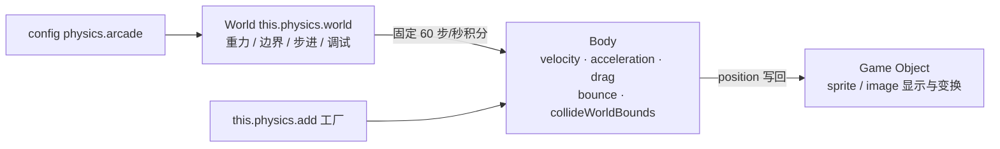

import { Canvas, Controls, Meta } from '@storybook/addon-docs/blocks';
import * as ArcadePhysics from './arcade-physics.stories';

<Meta of={ArcadePhysics} name="Docs" />

# Arcade 物理

Arcade 是 Phaser 内置的轻量物理引擎:它给每个对象一个**轴对齐的矩形(或圆形)碰撞盒**,每步按**速度(px/s)+ 加速度 / 重力 / 阻力(px/s²)**积分出位置——盒子互不穿透、边界可以反弹,但不处理旋转刚体、杠杆或堆叠。理解它只需三层:**config 启用** `physics: { default: 'arcade' }` 之后,场景获得 `this.physics` 工厂;工厂创建的动态体自带一个 **Body**,Body 上的速度、加速度、重力、反弹共同决定运动;所有 Body 由 **World**(`this.physics.world`)以固定 60 步/秒推进,世界边界、调试绘制也挂在它身上。本课按「启用 → 速度、加速度与阻力 → 重力 → 世界边界与反弹 → 碰撞盒 → 静态体」展开,用一个抛射弹球实验台串起全部证据;刚体之间的 collider / overlap 属 [3.2 Arcade 碰撞](?path=/docs/arcade-collision--docs),旋转刚体与约束的 Matter 属 [3.3 Matter 物理](?path=/docs/matter-physics--docs)。

关键 API 的默认值(以下经 phaser@4.2.1 类型与源码核实):

| API / 属性 | 默认值 | 回查要点 |
| --- | --- | --- |
| `physics: { default: 'arcade' }` | 不启用 | 不配置则 `this.physics` 为 `undefined` |
| `arcade.gravity` | `{ x: 0, y: 0 }` | 世界重力,px/s²;影响所有 `allowGravity` 的动态体 |
| `arcade.fps` / `fixedStep` / `timeScale` | `60 / true / 1` | 固定步长 1/60 s;`timeScale > 1` 模拟变慢 |
| `arcade.debug` | `false` | 画碰撞盒(品红)、静态体(蓝)、速度矢量(绿) |
| World bounds | 游戏画布尺寸 | `world.setBounds(x, y, w, h)` 修改,四边可单独关 |
| `body.velocity` | `(0, 0)` | 单位 px/s;`setVelocity` / `setVelocityX` / `setVelocityY` |
| `body.acceleration` / `body.drag` | `(0, 0)` | 单位 px/s²;该轴有加速度时阻力不生效 |
| `body.bounce` | `(0, 0)` | 0 贴墙停死,1 完全弹性,可大于 1 |
| `body.maxVelocity` | `(10000, 10000)` | 每轴速度钳制上限 |
| `collideWorldBounds` | `false` | `true` 才与世界边界碰撞并反弹 |
| `allowGravity` | `true` | `body.setAllowGravity(false)` 悬浮(自机、子弹常用;该方法只在 Body 上) |
| `blocked` / `touching` | 每步重置 | `blocked` = 边界与静态体;`touching` = 动态体之间(3.2) |
| `onWorldBounds` | `false` | 置 `true` 才随反弹发 `worldbounds` 事件 |
| 碰撞盒形状 | 跟随纹理帧尺寸的矩形 | `setCircle` 换圆形;`setSize` / `setOffset` 手调 |

## 快速上手

「启用物理 → 给对象一个 Body → 用速度和边界驱动它」的最小闭环:

```ts
// 1. game config 启用 Arcade(全局一次)
new Phaser.Game({
  // ...尺寸、场景等
  physics: { default: 'arcade', arcade: { gravity: { x: 0, y: 300 } } },
});

// 2. 场景里用工厂创建动态体,而不是 this.add.sprite
create() {
  const ball = this.physics.add.sprite(360, 60, 'ball');
  ball.setVelocity(200, -150);        // 初速度,单位 px/s
  ball.setBounce(0.8);                // 反弹系数 0–1
  ball.setCollideWorldBounds(true);   // 撞到游戏边界弹回来
}
```

这段代码就能得到一枚在画布里反复弹跳的小球——[1.5 第一个小游戏](?path=/docs/first-game--docs)用恒定速度下落时也走过同一个工厂。把 `gravity.y`、`setVelocity`、`setBounce` 换成不同值会怎样,就是本课实验台(见「世界边界与反弹」一节)回答的问题。

## 启用物理

物理在 game config 里启用,`default` 指定默认引擎,`arcade` 子对象是物理世界的初始配置:

```ts
new Phaser.Game({
  physics: {
    default: 'arcade',
    arcade: {
      gravity: { x: 0, y: 300 }, // 世界重力(px/s²),两轴都要写
      debug: false,              // true 时绘制碰撞盒与速度矢量
      fps: 60,                   // 物理步进频率(默认 60)
      fixedStep: true,           // 固定步长(默认 true)
      timeScale: 1,              // 时间缩放(默认 1)
    },
  },
});
```

配置之后**每个场景**都注入 `this.physics`(场景级插件);漏配它而直接用 `this.physics.add` 是第一高频报错。`gravity` 只写 `y` 时 `x` 为 `undefined` 会塌成 NaN,两轴都要给值(通常 `x: 0`)。

### 工厂:this.physics.add

启用后不要再用裸的 `this.add.sprite` 创建需要运动的对象,改用 `this.physics.add.*`,工厂返回「显示对象 + Body」:

| 工厂方法 | 产物 | 用途 |
| --- | --- | --- |
| `sprite(x, y, key, frame?)` | 带动态 Body 的 Sprite | 需要动画 / 旋转的动态体 |
| `image(x, y, texture, frame?)` | 带动态 Body 的 Image | 不需要动画的动态体,更轻 |
| `staticImage(x, y, texture)` | 带静态 Body 的 Image | 永不移动的平台、地面(见「静态体」) |
| `group(config?)` | 物理 Group | 批量生成同类动态体,config 直接下发 Body 属性 |
| `staticGroup(...)` | StaticGroup | 批量静态体 |
| `existing(gameObject, isStatic?)` | 给已创建的对象补一个 Body | 改造现有对象 / 自定义类 |

物理 Group 的 config 除了 [2.2.4 容器与分组](?path=/docs/containers-groups--docs)的分组选项,还能直接写 Body 属性:`this.physics.add.group({ allowGravity: false })` 生成的每个成员都自动关重力——[1.5 第一个小游戏](?path=/docs/first-game--docs)的下落物就是这么做的。反过来,拿到任何对象都能用 `obj.body` 访问它的 Body(类型上即 `SpriteWithDynamicBody` / `ImageWithStaticBody` 等带 Body 的变体)。

### World 与步进

所有 Body 归 `this.physics.world` 管。它不是跟着渲染帧跑,而是**固定步长的累加器**:默认每 1/60 秒推进一步,渲染帧攒下的时间够一步就步进一步、够两步就两步(掉帧时物理会追赶,不会变慢):

```text
每步(默认 delta = 1/60 s):
  若 allowGravity:velocity += (世界重力 + body.gravity) × delta
  velocity += acceleration × delta
  若该轴加速度为 0 且设了 drag:velocity 向 0 靠拢 drag × delta
  velocity 被每轴 maxVelocity 钳制
  position += velocity × delta
```

由此记住三条:

- **一切物理量的单位都是「每秒」**:速度 px/s,加速度 / 重力 / 阻力 px/s²。`setVelocityY(300)` 是「每秒向下 300 像素」,不是每帧 300 像素。
- 位置由物理每步写回显示对象,`update` 里读到的 `x` / `y` 是上一步的结果;直接手改 `x` 会在下一步被覆盖,要瞬移用 `body.reset(x, y)`。
- 三个调度开关都在 World 上:`setFPS(n)` 改步频;`fixedStep: false` 改为按真实帧时长积分(步长不再固定);`timeScale` 缩放步进间隔,`2` = 模拟减半速、`0.5` = 加倍速。另有 `world.pause()` / `resume()`(或 config `isPaused`)整体停走。



## 速度、加速度与阻力

驱动一个动态体有三种叠加的力,回答「怎么动起来」的三个不同问题:

| 手段 | 单位 | 语义 | 适合 |
| --- | --- | --- | --- |
| `setVelocity(x, y?)` / `setVelocityX` / `setVelocityY` | px/s | 立即改速度,永不过期 | 子弹、恒速下落、跳起瞬间的初速度 |
| `setAcceleration(x, y?)` / `setAccelerationX/Y` | px/s² | 每步累加,持续生效直到清零 | 推进器、按键持续加速、摩擦感 |
| `setDrag(x, y?)` / `setDragX/Y` | px/s² | 该轴**加速度为 0 时**才生效,把速度拉向 0 | 松手滑行减速、上限速度 |

三者的取舍就是手感模型:恒定速度最可控(接物类游戏);加速度 + 阻力有惯性(平台跳跃);跳起用 `setVelocityY(-jump)` 一次,下落交给重力。注意加速度和阻力是 **else-if 关系**——某轴设了加速度,该轴的阻力当步不参与,且默认线性阻力是恒定减速度(不随速度变小),「推进 + 阻力」并存时净加速不变、仍会一路加速;想要「加速后自动滑到某个巡航速度」,用 `setMaxVelocity` 封顶,或切到下文的 `useDamping` 比例衰减。

配套的两个钳制与一个开关:

- `setMaxVelocity(x, y?)`(默认 10000):每轴速度上限,加速度累加也不越过;另有 `setAngularVelocity(value)` 驱动旋转,上限 `maxAngular`(默认 1000)。
- `useDamping`(默认 `false`):阻力语义切换。默认线性(px/s²,匀减速);置 `true` 后 `drag` 变成比例衰减(0–1 的比例因子,速度按 `drag^delta` 衰减),适合「永远刹不住的冰面 vs 指数衰减的空气感」两类手感。
- `body.stop()` 把速度、加速度与角速度全部清零;`body.reset(x, y)` 归位并顺带执行 `stop()`,是「瞬移到某点重新出发」的标准入口。

### 运动辅助:moveTo 家族

不想手算三角,`this.physics` 上挂了一组「朝目标出发」的辅助函数(注意是 **`this.physics`**,不是 `physics.add` 或 `physics.world`):

```ts
// 以 240 px/s 朝 (600, 200) 出发;返回弧度角可直接喂给 setRotation
const angle = this.physics.moveTo(ship, 600, 200, 240);
ship.setRotation(angle);

// 一发加速:朝目标持续加速 300 px/s²,速度封顶 500(需每帧调用才会持续追踪)
this.physics.accelerateTo(ship, target.x, target.y, 300, 500, 500);

// 角度 → 速度向量:角度是度、顺时针为正(0 = 右,-90 = 上);第三参可直接写进目标向量
this.physics.velocityFromAngle(-45, 300, ship.body.velocity);
this.physics.velocityFromRotation(rad, speed); // 同款,入参是弧度
```

必须知道的行为边界(源码注释与实现明示):`moveTo` / `moveToObject(gameObject, destination, speed?, maxTime?)` 是**一次性设速度**,目标移动后不会自动改航向,到达后也不停下,且**不算你另设的 acceleration / maxVelocity / drag**(阻力设太大时物体可能根本不动);`accelerateTo` 一次性写 `acceleration`,由于「有加速度时阻力不生效」的规则,它不会被 drag 拖住;它的 `xSpeedMax` / `ySpeedMax` 参数(默认 500)会**直接覆写** `body.maxVelocity`,已手动设过上限的要注意;`maxTime` 参数(默认 0)给定时,速度会按「恰好在时限内到达」反推。Phaser 3 的 `moveToXY` 在 Phaser 4 已移除,统一用 `moveTo` / `moveToObject`。近邻查询 `closest` / `furthest` 也在这层,3.2 处理追踪 AI 时再用。

## 重力

重力在 Arcade 里只是「写在两处的默认加速度」,没有特殊地位:世界重力来自 config 或 `world.gravity`,局部重力挂在 `body.gravity`,两者**相加**后按 `allowGravity` 决定是否参与积分。

```ts
// 世界级:config 里配初始值,运行时直接改 Vector2
physics: { default: 'arcade', arcade: { gravity: { x: 0, y: 300 } } }
this.physics.world.gravity.y = 600; // 运行时改,立即生效

// 局部级:单个 Body 附加的重力(px/s²),叠加在世界重力之上
balloon.setGravityY(-320);          // 世界 300 + 局部 -320 = 净 -20,气球上飘
ghost.body.setAllowGravity(false);  // 完全不受重力,悬浮(注意:此方法只在 Body 上)
```

三条判断:

- **生效条件是 `allowGravity`(默认 true)**,每步叠加 `世界重力 + body.gravity` 两项;`body.setAllowGravity(false)` 只关重力,速度、加速度、边界反弹照常——[1.5 第一个小游戏](?path=/docs/first-game--docs)里恒速下落物用的就是它。
- 世界重力是**全局手感参数**(月球关、水关改这里),局部重力用来造**个体差异**(气球、羽毛);负 `y` 是向上。
- 重力与 `setAccelerationY` 效果同源,但语义分开:持续全场的用重力,玩家可控 / 会清零的用加速度,混用会让调参变难。

## 世界边界与反弹

物理世界有一个不可见的矩形边界,默认等于游戏画布尺寸,`world.setBounds(x, y, width, height)` 重新设置,后四个可选参数还能单独开关四边是否检测(`world.setBoundsCollision(left, right, up, down)` 或 config `checkCollision` 同名子项,默认全开)。它**只拦开启了 `collideWorldBounds` 的 Body**,与摄像机边界(限制镜头,见 [2.5.1 摄像机控制](?path=/docs/camera-control--docs))是两套系统。

单个动态体与世界边界的关系由三个属性决定:

- **`setCollideWorldBounds(true)`**(默认 false):开启后越界的轴被钳回边界内,速度按反弹系数翻转;不开就径直飞出画布。
- **`setBounce(x, y?)`**(默认 0):反弹系数。`0` 撞墙瞬间速度清零、贴墙停死;`1` 完全弹性、永不衰减;`0.8` 每次反弹保留 80% 速度。可以大于 1(越弹越快),两轴可分离。
- **`worldBounce`**:只作用于世界边界的专属反弹,`null`(默认)时回落到 `bounce`;`setCollideWorldBounds(true, 0.5, 0.5)` 的后两个参数写的就是它——「墙皮弹一点,互相碰撞正常弹」时用。

撞没撞、撞的哪边,读 Body 上两个每步重置的状态对象(结构都是 `{ none, up, down, left, right }`):

- **`body.blocked`**:本步是否被**世界边界、静态体或瓦片**挡住。小球停在地面时 `blocked.down` 每步都为 true——这是判断「落地」最便宜的方式。
- **`body.touching`**:与**其他动态体**的接触面(本课只有一个刚体,恒为 none,3.2 展开);`wasTouching` 是上一步的 `touching`。

要在反弹瞬间执行逻辑(音效、粒子),把 `body.onWorldBounds = true` 打开,World 会发 `worldbounds` 事件:

```ts
ball.body.onWorldBounds = true; // 默认 false,不开不发
this.physics.world.on('worldbounds', (body, up, down, left, right) => {
  if (body.gameObject === this.ball) this.cameras.main.shake(80, 0.004);
});
```

下面是本课主范例:**点击画布**从左下发射台射出一枚小球(圆形 Body),Controls 的八个参数全部实时生效:重力、初速度与发射角决定抛物线;`bounce`、`drag`、`allowGravity`、`collideWorldBounds` 改变撞边后的行为;`debug` 叠加官方调试绘制。橙色残影是飞行轨迹,绿色箭头是当前速度矢量,readout 给出全部派生证据。

<Canvas of={ArcadePhysics.ProjectileLab} />
<Controls of={ArcadePhysics.ProjectileLab} />

| 读者操作 | 可观察证据 |
| --- | --- |
| 点击画布发射(默认:重力 300、速度 260、角 -45°、bounce 0.6) | 小球划出抛物线:上升段 `vy` 从负值被重力每步拉向 0 再转正,残影弧线对称;顶点处 `vy = 0` |
| readout 对照步进模型 | 「本帧位移」与 `velocity` 同号且成正比,60Hz 屏上 ≈ `velocity ÷ 60`(固定步长的积分证据);位置随之累加 |
| 把「重力 y」调到 0 | 抛物线消失,小球以恒定速度直线飞行(速度两轴保持不变) |
| 把「重力 y」调成负值 | 小球一路向上,撞天花板 `blocked.up = true` 后反弹回来 |
| 关闭「allowGravity」 | readout「生效重力」变为 0,`vy` 不再被改变,与重力 0 表现一致——重力只通过该开关参与积分 |
| 把「bounce」调到 0 | 首次触地即贴地停死:`velocity` 归零、`blocked.down = true` 常亮 |
| 把「bounce」调到 1 | 反弹计数持续增长,每次触地 `vy` 等值翻转,永不衰减 |
| 把「drag」调到 120 | 残影间距逐渐收窄,`speed` 持续下降;水平速度也被拖慢(阻力两轴独立但范例同值) |
| 关闭「collideWorldBounds」 | 小球飞出画布不再回来;出界较远后自动回到发射台静止,readout 位置读数归位 |
| 改「发射角」与「初速度」后再次点击 | 发射台旁的方向指示线先变,点击后按新角度出发;`velocity` 初值等于 `velocityFromAngle` 的换算结果 |
| 打开「debug 绘制」 | 品红圆环即 `setCircle(12)` 的真实碰撞盒(比贴图圆略大),绿色速度线与范例箭头重合 |
| 打开 Show code | 看到该 Canvas 实际执行的 `projectile-lab.ts` 全文 |

实例滚出视口或页面切到后台时会整体休眠以省资源,回到视口自动恢复。

## 碰撞盒与调试绘制

默认碰撞盒是一个**跟随纹理帧「真实尺寸」**(`frame.realWidth` / `realHeight`)的矩形,居中于对象;纹理里的透明边会让盒子比目测的大。三件工具手调:

```ts
const player = this.physics.add.sprite(100, 100, 'player');

// 1. 直接改盒宽高(第三参 center 默认 true,保持居中;false 则左上角不动)
player.body.setSize(24, 32);

// 2. 盒子在对象坐标系里的偏移(贴图脚底留空、头顶留头饰时用)
player.body.setOffset(4, 8);

// 3. 换圆形盒:半径 + 可选偏移;body.isCircle 变 true,宽高即直径
ball.body.setCircle(12);
```

判定的坐标系要记住:**Body 的 `position` 是盒子左上角**,`body.x` / `body.y` 与精灵的 `x` / `y`(原点默认中心)不同;做精确对齐读 `body.center` 或继续用对象坐标。若对象会被 `setScale` 缩放,盒子默认只随 `setSize` 时的缩放换算,持续同步要开 `body.syncBounds = true`(按显示边界重算,代价更高)。

调试绘制回答「物理眼里到底是什么形状」。config `arcade.debug: true` 全局开启,或运行时补建:

```ts
const world = this.physics.world;
world.createDebugGraphic(); // 首次开启:建一个置顶的 Graphics 并置 drawDebug = true
world.drawDebug = false;    // 之后随时开关绘制,不用销毁
```

三种颜色对应三类信息:`0xff00ff` 品红描动态盒、`0x0000ff` 蓝描静态盒、`0x00ff00` 绿描速度矢量。单项开关与配色在 `world.defaults`(`debugShowBody` / `debugShowVelocity` / `bodyDebugColor` 等,config 同名可初始化),单个 Body 也能 `body.debugShowVelocity = false` 单独关。调试图形是运行时叠加,不参与碰撞,发布时关掉即可(留着也只是每帧画线)。

## 静态体

静态体是「世界的一部分」:由 `this.physics.add.staticImage(x, y, texture)`(或 `staticGroup` / `existing(obj, true)`)创建,Body 类型为 StaticBody——**不参与速度、重力、阻力的积分**,永远不动,动态体撞上会被挡住、按 `blocked` 标记方向。地面、平台、墙壁都用它:

```ts
const ground = this.physics.add.staticImage(360, 395, 'ground');
// 静态体没有 setVelocity 一族;改位置后必须刷新碰撞数据
ground.x = 500;
ground.body.updateFromGameObject(); // 让 Body 跟上对象的新位置 / 缩放
```

两个容易踩的差异:

- **移动静态体是反模式**:它没有速度语义,「移动平台」要么用 `moves: false` 的动态体,要么每帧移动后 `body.updateFromGameObject()` 重算。静态体改尺寸用 `body.setSize` / `setCircle` 后同样要刷新。
- `immovable` 是**动态体**的属性(`setImmovable(true)`,默认 false):让碰撞分离时它纹丝不动([1.5 第一个小游戏](?path=/docs/first-game--docs)的挡板),但它仍保留速度、重力等全部积分行为;静态体则是彻底退出积分。与之配套的 `setPushable(false)`(默认 true)只挡「被撞时被推走」,不挡分离。

动态体与静态体、动态体与动态体的**碰撞检测、推挤与回调**(collider / overlap / 分离逻辑)是 [3.2 Arcade 碰撞](?path=/docs/arcade-collision--docs)的主题;需要旋转刚体、堆叠、约束时换 [3.3 Matter 物理](?path=/docs/matter-physics--docs)。

## 最佳实践

- **运动手感三选一后再调参:**恒速(`setVelocity` + `allowGravity: false`)适合可控节奏;重力 + 初速度适合抛物线;加速度 + 阻力 / `maxVelocity` 适合惯性载具。混用三种来源前先想清楚「每个速度变化来自谁」,否则调参互相打架。
- **跳跃不要用加速度抵消重力:**起跳 `setVelocityY(-jumpSpeed)` 一次 + 重力接管,是最便宜稳定的抛物线;持续抵消重力会出现「悬浮段」,难以调出固定手感。
- **世界边界只兜底,关卡边界用静态体:**`collideWorldBounds` 拦的是物理世界矩形,关卡里真正的墙、地面用 staticImage 铺(3.2 的 collider 接上),世界边界留给「掉出即死亡」这类兜底判定。
- **落地判定用 `blocked.down`,别盯速度:**速度为 0 可能是恰好到顶点;`blocked.down` 为 true 才是被地面 / 边界托住。注意它每步重置,要在 `update` 里每帧读。
- **先开 debug 再调碰撞:**碰撞盒偏移、贴图透明边、圆形盒半径这类问题,肉眼看贴图永远猜不出来,`debug: true` 一开就现形。

## 常见问题

- **`this.physics` 是 `undefined`,或 `obj.setVelocity is not a function`。**
  game config 没配 `physics: { default: 'arcade' }`,或对象是用 `this.add.sprite` 建的(没有 Body)。前者补 config,后者换 `this.physics.add.sprite` / `existing`。
- **对象纹丝不动,速度设了也没用。**
  依次排查:`body.enable` 是否被置 false;`body.moves` 是否为 false(退出积分);同轴 `drag` 是否大到吃掉速度增量;`setAcceleration` 设了却期望立即运动(加速度是逐秒累加的)。
- **`gravity: { y: 300 }` 之后物体朝错误方向飞 / 坐标变 NaN。**
  config 里只写 `y` 时 `x` 为 `undefined`,积分被污染。重力要写全两轴:`gravity: { x: 0, y: 300 }`。正 `y` 向下。
- **球贴着地面时 `velocity.y` 一直在小数字间跳动,停不下来。**
  反弹是「速度乘 -bounce」,`bounce` 不为 0 时永不严格归零,视觉上已被钳住不动。要彻底静止用 `bounce: 0`,或在反弹回调里速度小于阈值时手动 `body.stop()`。
- **撞到世界边界没有触发 `worldbounds` 事件。**
  两个前提:`body.onWorldBounds = true`(默认 false)且 `collideWorldBounds` 开着。回调参数是 `(body, up, down, left, right)`,不是游戏对象。
- **改了 `world.setBounds` / 移动了静态体,碰撞检测还在老位置。**
  静态体移动或缩放后必须 `body.updateFromGameObject()`;`setBounds` 本身立即生效,但只影响开启了 `collideWorldBounds` 的 Body,先确认开关。
- **在 `update` 里改了对象的 `x`,下一帧又弹回去。**
  只要 `body.moves` 为 true,位置每步由 Body 写回。瞬移用 `body.reset(x, y)`(同时清速度),持续手动控制则 `body.moves = false` 或 `body.setAllowGravity(false)` + 自管速度。

## 总结回顾

摘要:

Arcade 物理由 config 启用,场景获得 `this.physics` 工厂与 `this.physics.world`。工厂创建的动态体自带 Body,World 以固定 60 步/秒把「速度 + (世界重力 + 局部重力 + 加速度) × delta、无加速度时阻力拉向 0、`maxVelocity` 钳制」积分成位置并写回对象,一切单位以每秒计(px/s、px/s²),`fps` / `fixedStep` / `timeScale` 控制步进节奏。重力只是两处可加的默认加速度,`allowGravity` 决定参与与否;运动辅助 `moveTo` / `accelerateTo` / `velocityFromAngle` 是一次性设速 / 设加速的三角工具。世界边界默认等于画布,`collideWorldBounds` + `bounce` 决定反弹,`blocked` 标记每步的接触方向,`onWorldBounds` 开启后有反弹事件;碰撞盒默认跟随纹理帧,`setSize` / `setOffset` / `setCircle` 手调,`debug` 绘制品红盒、蓝静态盒、绿速度矢量。静态体退出积分、永不移动,动态体的 `immovable` / `pushable` 是碰撞分离开关。

一句话:

> Arcade 每步只做一件事——把「速度 += 力 × delta,位置 += 速度 × delta」积分到矩形(或圆形)碰撞盒上,重力、反弹、边界、调试全都围绕这个模型叠加。

知识要点:

- 启用物理要配什么?漏配时最先看到什么报错?
- 工厂家族有哪些?`sprite` / `staticImage` / `existing` 各自返回什么?
- 物理步进模型是怎样的?`fps`、`fixedStep`、`timeScale` 分别改变什么?
- 速度、加速度、阻力三者的单位与生效关系?什么情况下阻力不生效?
- 世界重力与局部重力如何合成?`allowGravity: false` 关掉的是什么?
- `collideWorldBounds` + `bounce` 组合出哪几种边界行为?`bounce: 0` 与 `1` 各是什么表现?
- `blocked` 与 `touching` 各报告谁的接触?落地判断读哪个?
- 碰撞盒默认怎么来?`setSize` / `setOffset` / `setCircle` 分别改什么?调试绘制三种颜色各画什么?
- 静态体与 `immovable` 动态体的差别?移动静态体后必须做什么?

## 参考资料

- [@官方@Phaser 官方文档](https://docs.phaser.io/) — Arcade Physics 的 World / Body / Factory API 页与物理指南
- [@官方@官方示例库](https://phaser.io/examples/) — arcade physics 分类下的可运行示例
- [@官方@Phaser 4 Labs 示例浏览器](https://labs.phaser.io/phaser4-index.html) — Phaser 4 专用示例,含 Arcade 物理部分
