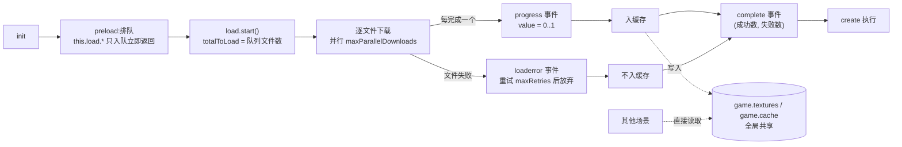

import { Canvas, Controls, Meta } from '@storybook/addon-docs/blocks';
import * as AssetLoader from './asset-loader.stories';

<Meta of={AssetLoader} name="Docs" />

# 资源加载器

`this.load` 是每个场景自带的资源加载器(`Phaser.Loader.LoaderPlugin`):在 `preload` 里声明文件,Phaser 负责下载、解码并放进两处仓库——纹理类进纹理管理器 `this.textures`,数据与媒体类进分类缓存 `this.cache.*`。本课讲清这条管线:队列如何排队、进度事件何时触发、每类文件落在哪个缓存、`preload` 之外如何手动加载、失败的文件去哪了,以及「加载一次,全局可用」的跨场景共享。图集切帧与制作属于「纹理图集」一课,音频播放属于「音频」一课,这里只做加载与缓存层。



| 高频方法 | 落点 | 回查要点 |
| --- | --- | --- |
| `this.load.image(key, url)` | `this.textures` | url 缺省为 `<key>.png` |
| `this.load.spritesheet(key, url, { frameWidth })` | `this.textures`(自动切帧) | `frameWidth` 必填;`frameHeight` 缺省同宽 |
| `this.load.atlas(key, pngUrl, jsonUrl)` | `this.textures`(帧名索引) | 图集 json 被消费进纹理,不进 `cache.json` |
| `this.load.svg(key, url, { width, height })` | `this.textures` | 不传尺寸则按 svg 原始宽高 |
| `this.load.audio(key, urls)` | `this.cache.audio` | Web Audio 设备上解码为 `AudioBuffer` |
| `this.load.json(key, url, dataKey?)` | `this.cache.json` | 传 `dataKey` 只缓存 json 的子对象 |
| `this.load.bitmapFont(key, pngUrl, fntUrl)` | `this.cache.bitmapFont` + 纹理 | 字形数据要求 XML 格式 fnt |

加载器默认值:并行下载数 `maxParallelDownloads` 默认 32(Android 6);失败重试 `maxRetries` 默认 2;`progress` 值域 0..1;url 以 `data:`、`blob:`、`http(s)://`、`//` 开头时原样直通,相对 url 则先拼 `path` / `prefix` 再拼 `baseURL`。

## 快速上手

`preload` 声明、`create` 使用,中间用 `progress` 事件画一根进度条——这是本课的最小闭环。加载器在 `preload` 返回后才启动,所以监听器在排队前注册即可,进度条这类显示对象可以直接在 `preload` 里创建。

```ts
import Phaser from 'phaser';

class BootScene extends Phaser.Scene {
  private bar!: Phaser.GameObjects.Graphics;

  preload() {
    this.bar = this.add.graphics(); // LOADING 状态下显示列表已可用
    this.load.on(Phaser.Loader.Events.PROGRESS, (value: number) => {
      this.bar.clear();
      this.bar.fillStyle(0x4cc9f0, 1);
      this.bar.fillRect(40, 180, 400 * value, 12); // value 为 0..1
    });

    this.load.image('hero', 'assets/hero.png'); // 只排队,立即返回
  }

  create() {
    // 走到这里时队列已 complete,hero 一定可用
    this.add.image(400, 300, 'hero');
  }
}
```

`preload` 里可以安全创建显示对象:场景此时处于 `LOADING` 状态,显示列表与渲染循环都在运行,只是 `create` 还没执行。

## 队列与进度事件

加载器是一台「先排队、后批量执行」的机器。场景启动时 SceneManager 的执行顺序是:`init` → 加载器 `reset()` → `preload()` → 注册一次性的 complete 接线 → `load.start()`。因此 `preload` 里所有 `this.load.*` 只是把文件描述符放进队列(`this.load.list`),方法立即返回;`start()` 把队列长度固化为 `totalToLoad`,再按 `maxParallelDownloads` 并发下载。

每个文件完成后的进度是算出来的:`progress = 1 - (list.size + inflight.size) / totalToLoad`,也就是说 `progress` 事件按「完成文件数」跳跃,不跟踪单个文件的下载字节(单文件字节进度是单独的 `fileprogress` 事件,且依赖浏览器提供 `lengthComputable`)。

全部事件在 `this.load` 上监听,常量定义在 `Phaser.Loader.Events`:

| 事件常量 | 监听名 | 参数 | 触发时机 |
| --- | --- | --- | --- |
| `START` | `'start'` | `(loader)` | 加载器启动,进度为 0(空队列也会触发) |
| `PROGRESS` | `'progress'` | `(value: 0..1)` | 每完成一个文件 |
| `FILE_COMPLETE` | `'filecomplete'` | `(key, type, data)` | 队列里任何文件完成 |
| `FILE_KEY_COMPLETE` | `'filecomplete-<type>-<key>'` | `(key, type, data)` | 指定文件完成,如 `filecomplete-image-hero` |
| `FILE_LOAD` | `'load'` | `(file)` | 文件下载完成、入缓存之前 |
| `FILE_PROGRESS` | `'fileprogress'` | `(file, percent)` | 单文件下载进度(浏览器支持时) |
| `FILE_LOAD_ERROR` | `'loaderror'` | `(file)` | 文件重试 `maxRetries` 次后仍失败 |
| `POST_PROCESS` | `'postprocess'` | 无 | 队列全部处理完、清列表之前 |
| `COMPLETE` | `'complete'` | `(loader, totalComplete, totalFailed)` | 一轮加载结束;`preload` 场景随后进入 `create` |

两个容易忽略的行为:

- **图集、位图字体是多文件。** `atlas` 排入图片与 json 两个文件,`bitmapFont` 排入纹理与 fnt 两个文件,`totalToLoad` 按文件数计,一个 `atlas` 就是 2。
- **监听器跨场景重启保留。** LoaderPlugin 随场景实例存活,`scene.restart()` 后旧的 `on` 监听器还在,会在下一轮重复触发。重启前用 `this.load.removeAllListeners()` 清掉再重新注册,或只注册一次并从回调里读状态。

下面的实例把整条管线变成可核对读数:preload 一次排队 7 个文件(image、spritesheet、atlas、audio、json),事件日志逐条记录,完成后逐 key 检查缓存。素材是课程目录里的真实文件,经 Vite `?url` 导入后由加载器发起真实 HTTP 请求。

<Canvas of={AssetLoader.LoadProgress} />
<Controls of={AssetLoader.LoadProgress} />

| 读者操作 | 可观察证据 |
| --- | --- |
| 初始加载 | 进度从 0% 走到 100%,本轮完成文件 `7/7`,最近完成文件逐个出现(`beach-r0(image)`、`digits-r0(spritesheet)`…) |
| create 后 | 缓存命中 `6/6`:4 个纹理 key 在 `this.textures`,json 与 audio 各自在 `this.cache`(图集的 json 文件被消费进纹理,不单独占 key) |
| 「加载轮次」加一 | 场景 restart,新 key(`-r1` 后缀)重新走一遍真实加载:进度重新从低值爬升,事件日志重新出现 |
| 加一到二之后 | 「第 1 轮 key 仍在缓存」保持 `6/6` 命中——旧轮资源不被清除,这就是重启场景不重复下载的原因 |

本课每个 Canvas 里的 Phaser 实例在滚出视口或页面切到后台时会整体休眠省资源,不影响加载读数。

## 文件类型与缓存归属

所有加载方法共享同一套约定:**key 是缓存里的唯一标识**,与文件名无关;url 缺省按 `<key>.<默认扩展名>` 推导(`image` 是 `<key>.png`,`json` 是 `<key>.json`);每个方法既接受 `(key, url, ...)` 参数形式,也接受单个配置对象形式(`this.load.image({ key, url })`),且都支持传数组一次排多个。落点只有两类:

**纹理类**——进纹理管理器 `this.textures`(即 `game.textures`),用 `exists(key)` 检查、`get(key)` 取纹理、`getFrame(key, frame)` 取帧,显示对象直接按 key 引用。

**数据与媒体类**——进 `this.cache` 下按类型命名的 `BaseCache`(统一接口 `exists(key)` / `get(key)` / `remove(key)` / `getKeys()`)。

| 方法 | 落点 | 读取方式 |
| --- | --- | --- |
| `image(key, url)` | `this.textures` | `this.add.image(x, y, key)` |
| `spritesheet(key, url, { frameWidth, frameHeight, margin, spacing, startFrame, endFrame })` | `this.textures`(按帧号切帧) | `this.add.image(x, y, key, 2)` |
| `atlas(key, textureURL, atlasURL)` | `this.textures`(按帧名索引) | `this.add.image(x, y, key, 'gull')` |
| `atlasXML` / `multiatlas` / `aseprite` / `unityAtlas` / `atlasPCT` | `this.textures` | 同上,格式不同 |
| `svg(key, url, { width, height })` | `this.textures` | 同 `image`;传尺寸则在光栅化时缩放 |
| `bitmapFont(key, textureURL, fontDataURL)` | `this.cache.bitmapFont` + `this.textures` | `this.add.bitmapText(x, y, key, '102')` |
| `audio(key, urls, config?)` | `this.cache.audio` | `this.cache.audio.get(key)` / `this.sound.add(key)`(见「音频」课) |
| `audioSprite(key, jsonURL, audioURLs)` | `this.cache.audio` + json | 按标记播放,见「音频」课 |
| `json(key, url, dataKey?)` | `this.cache.json` | `this.cache.json.get(key)`;传 `dataKey` 只缓存该子对象 |
| `text` / `xml` / `html` / `binary` / `css` / `shader(glsl)` | 对应 `this.cache.*` | 同 `BaseCache` 接口 |
| `font(key, url, format?, descriptors?)` | 注册进 `document.fonts` | 走 CSS 字体,配 `Text` 使用(见「文本」课) |
| `tilemapTiledJSON` / `tilemapCSV` | `this.cache.tilemap` | 见「瓦片地图」阶段 |
| `video(key, urls)` | `this.cache.video` | 见官方文档 |
| `script` / `scenePlugin` / `plugin` | 动态注入脚本与插件 | 低频,见官方文档 |
| `pack(key, url)` | 按 pack 文件内容再排队 | 一个 json 描述整批文件,见官方文档 |

三类高频细节:

- **audio 的两种形态。** 设备支持 Web Audio 且未在 config 禁用时,`load.audio` 下载后把文件解码为 `AudioBuffer` 存入 `cache.audio`;否则回退为 HTML5 Audio 标签方案。`urls` 传数组(`['coin.ogg', 'coin.mp3']`)时加载器选第一个该设备能播放的格式。播放、循环、解锁属于「音频」课。
- **json 的 dataKey。** `this.load.json('cfg', 'cfg.json', 'levels')` 只缓存 `data.levels`,适合大配置文件只需要一段的场景。
- **图集 json 不进 `cache.json`。** `atlas` 的 json 数据在处理阶段被消费成纹理的帧,`cache.json.exists(atlasKey)` 是 `false`;要保留原始 json 就用独立的 `load.json` 再加载一次。

URL 拼接规则(源码 `Phaser.Loader.GetURL`):以 `data:`、`blob:`、`http://`、`https://`、`//`、`file://`、`capacitor://` 开头的 url 原样使用——所以 data URI 可以直接交给 `load.image`;其余相对 url 先拼 `path` 与 `prefix`,再拼 `baseURL`。三者可以全局设(`config` 的 `loader.path` 等),也可以按场景设在场景 config 的 `loader` 字段,场景每次启动时会重新套用:

```ts
new Phaser.Scene({
  key: 'Game',
  loader: { path: 'assets/game/' }, // 本场景相对 url 都以此为前缀
});
```

## 手动加载与错误处理

自动启动只发生在 `preload` 里:`preload` 方法返回后 SceneManager 才调 `load.start()`。在其他任何地方(`create`、输入回调、运行中)排队都不会自动开始,必须手动 `this.load.start()`,并自己等 `complete`(或 `filecomplete-<type>-<key>`)再使用资源:

```ts
create() {
  const startNextLevel = () => {
    this.add.image(400, 300, 'level2'); // complete 之后才安全
  };

  this.load.image('level2', 'assets/level2.png');
  this.load.once(Phaser.Loader.Events.COMPLETE, startNextLevel);
  this.load.start(); // 不调用就永远不下载
}
```

**失败不会卡住流程。** 文件下载失败先按 `maxRetries`(默认 2)重试,仍失败则触发 `loaderror`(参数是 file 对象,读 `file.key`、`file.src`、`file.type`),该文件不进任何缓存;整轮照样触发 `complete` 并进入 `create`。所以判断「这一轮有没有丢文件」要看 `complete` 回调的 `totalFailed` 参数,而不是等它报错停下来。使用缺失 key 创建显示对象时,Phaser 回退到 `__MISSING` 纹理并输出控制台警告——画面上会出现绿色占位块,而不是崩溃。

**重复 key 会被静默跳过。** 排队时加载器检查同名同类型 key 是否已在缓存、待处理队列或下载中队列(`keyExists`),命中即跳过该文件:不下载、不覆盖缓存里已有的内容,也没有报错。想强制重新加载,先 `this.textures.remove(key)` / `this.cache.json.remove(key)` 腾出 key,或换一个新 key。

下面的实例没有 `preload`,`create` 之后全靠 Controls 手动触发四种情况:svg(带尺寸重栅格化)、位图字体(png + fnt 两个文件)、必然 404 的 url、同一 key 排队两次。

<Canvas of={AssetLoader.ManualLoad} />
<Controls of={AssetLoader.ManualLoad} />

| 读者操作 | 可观察证据 |
| --- | --- |
| 选「svg 图标」 | 入队 1 个文件(svg 是单文件),完成后 `flag 纹理` 读数变为 `命中 48×48px`:svgConfig 的 `width/height` 在加载时生效 |
| 选「位图字体」 | 入队 2 个文件(纹理 png + fnt),完成后画面用 `add.bitmapText` 渲染出 `102` 三个字形,`digits 位图字体` 读数命中 `cache.bitmapFont` |
| 选「缺失 url(404)」 | 事件日志出现 `loaderror ghost(image)`,`ghost 纹理` 保持「不在缓存」,本轮结果 `成功 0 / 失败 1`,complete 仍触发 |
| 选「重复 key ×2」 | 入队 `1` 个而非 2 个:第二次排队命中队列冲突被跳过;若先做过「svg 图标」,则入队 0 个(命中缓存冲突) |
| 对同一项重复选择 | 第二次入队 0 个、无下载发生——key 已在缓存,这就是「重复加载不生效」的直接证据 |

## 跨场景共享

缓存不属于场景。纹理管理器与各类缓存都挂在 `game` 上(`game.textures`、`game.cache`),场景里的 `this.textures` / `this.cache` 只是对同一实例的引用;每个场景有自己独立的 LoaderPlugin 实例,但下载结果全部写进全局仓库。推论:**任何场景加载过的资源,所有场景都能直接用**——常见组织方式是做一个 Boot 场景集中加载公共资源,之后所有场景零加载直接引用;反过来,每个场景各自加载同名 key 会第二次命中「重复 key 跳过」,不会重复下载。

下面的实例注册两个场景:`LoaderSide` 在 preload 里加载 3 个资源;`ConsumerSide` 完全没有 preload,靠 Controls 启动。关键读数:ConsumerSide 尚未启动(状态 `PENDING`)时,它视角下的缓存检查就已经命中,且三方(`两个场景 + game`)的 `textures` 是同一实例。

<Canvas of={AssetLoader.CrossScene} />
<Controls of={AssetLoader.CrossScene} />

| 读者操作 | 可观察证据 |
| --- | --- |
| 初始加载 | `LoaderSide 缓存` 为 `3/3 已入缓存`;`ConsumerSide 状态` 为 `PENDING (0)`,但 `Consumer 看到纹理` 已是 `true(命中)`——缓存查询不要求场景启动 |
| 选「launch 启动 Consumer」 | 画面叠加一个无 preload 的场景,直接画出 `shared-crab` 并读出 json 数据;状态变为 `RUNNING (5)` |
| `textures 同一实例` 读数 | 全程为「是,同一 TextureManager」:场景只是引用,资源归属 game |
| 选「stop 停止 Consumer」 | 叠加画面消失、状态 `SHUTDOWN (8)`,但缓存读数不变——停止场景不清缓存 |

## 最佳实践

- **加载时机按资源生命周期分层。** 全局资源(公共 UI、音效、字体)放在 Boot 场景一次性集中加载;关卡资源在关卡场景的 preload 里声明,切换关卡时随场景重启自然重新排队;运行时才确定的资源(玩家皮肤、DLC)才走手动 `load.start()`。手动加载每多一处,就多一处「等 complete」的状态要管。
- **key 用「资源语义」命名并全局唯一。** key 是跨场景共享缓存的主键,`button`、`hero-idle` 这类语义名比 `img1` 可维护;同一 key 换内容必须显式 `remove`,否则新文件被静默跳过,表现为「改了素材但画面没变」。
- **相对路径统一交给 `path`,不要拼字符串。** 场景 config 的 `loader.path` / `loader.baseURL` 让每个 `this.load.*` 只写文件名,迁移目录只改一处;`?url`、data URI 这类绝对地址则完全绕过 path,两者不要混用同一批 key。
- **进度条读 `progress` 事件,不要数文件。** `progress` 已经按 `totalToLoad` 归一为 0..1,自己用 `filecomplete` 计数会漏掉多文件类型(atlas 一个 key 两个文件)的口径。
- **每轮加载前清理事件监听。** 场景可能重启时,`this.load.removeAllListeners()` 后重新注册,或只用 `once`;常驻的 `on` 监听器叠加会在日志和回调里出现重复执行。

## 常见问题

- **`preload` 里 `this.load.image(...)` 之后立刻 `this.add.image(..., key)` 报纹理不存在。**
  `preload` 只排队,方法返回时文件还没下载。创建代码属于 `create`(或 `filecomplete` / `complete` 回调),那里资源才保证就绪。
- **在 `create` / 回调里 `this.load.image(...)` 后文件一直不下载。**
  自动 `start()` 只对 `preload` 生效。`preload` 之外必须手动 `this.load.start()`,并在 `complete` 回调里使用资源。
- **改了素材文件重新发布,画面仍是旧图。**
  key 已在纹理管理器里,新排队被 `keyExists` 静默跳过。先 `this.textures.remove(key)` 再加载,或换 key;浏览器 HTTP 缓存也可能保留旧文件,加载器层面无能为力。
- **资源 404 了,游戏却没有停,画面上出现绿色占位块。**
  失败文件触发 `loaderror` 后不进缓存,`complete` 与 `create` 照常执行;用到缺失 key 的显示对象回退到 `__MISSING` 纹理。丢没丢文件要看 `complete` 的 `totalFailed` 参数或在 `loaderror` 里记日志。
- **场景 `restart` 后,加载相关的回调执行了两遍(日志、进度条异常)。**
  LoaderPlugin 与它的监听器随场景实例保留。重启流程里先 `this.load.removeAllListeners()` 再重新注册,或把监听器注册挪到只执行一次的位置。
- **`progress` 事件只收到一次 1,看不到中间值。**
  本地小文件在极少帧内全部完成,中间值一闪而过属正常;文件越多、网络越慢,阶梯越明显。若一批文件全部被缓存跳过(`totalToLoad` 为 0),则只有 `start` 与 `complete`。

## 总结回顾

摘要:

`this.load` 按「排队 → start → 并行下载 → 入缓存 → complete」运转:`preload` 只排队、返回后才自动 start,`create` 在 complete 之后执行,所以那里资源必然就绪。纹理类(image、spritesheet、atlas、svg)进全局的 `this.textures`,数据媒体类(audio、json、bitmapFont 等)进 `this.cache.*`,两处都挂在 game 上、跨场景共享,重复 key 排队会被静默跳过。preload 之外要手动 `load.start()` 并等 complete;失败文件触发 `loaderror`、不进缓存、不阻塞流程;进度用 `progress` 事件的 0..1 值驱动,多文件类型按文件数计入 `totalToLoad`。

一句话:

> key 是缓存的唯一主键:进过缓存就全局可用、重复排队就被跳过——加载问题先查 key 在不在缓存,再查下载有没有 start。

知识要点:

- `preload`、`load.start()`、`complete`、`create` 之间的先后关系是什么?
- `progress` 事件的值域与计算口径是什么?按文件还是按字节推进?
- image / spritesheet / atlas / audio / json / bitmapFont / svg 各自落进哪个缓存?分别怎么读取?
- 图集的 json 文件为什么不在 `cache.json` 里?
- preload 之外手动加载的标准写法是什么?失败文件会阻塞 complete 吗?
- 重复 key 排队时发生什么?想强制重新加载该怎么做?
- 为什么一个场景加载的资源其他场景能直接用?

## 参考资料

- [Phaser 官方文档(Phaser 4 API 与指南总入口)](https://docs.phaser.io/)
- [Phaser 4 API:Phaser.Loader.LoaderPlugin(this.load 全部方法与属性)](https://docs.phaser.io/api-documentation/class/loader-loaderplugin)
- [Phaser 4 API:Phaser.Loader.File(单个文件的下载与处理生命周期)](https://docs.phaser.io/api-documentation/class/loader-file)
- [Phaser 4 API:Phaser.Cache.CacheManager(this.cache 各分类缓存)](https://docs.phaser.io/api-documentation/class/cache-cachemanager)
- [Phaser 4 API:Phaser.Textures.TextureManager(this.textures 与 exists/get/getFrame)](https://docs.phaser.io/api-documentation/class/textures-texturemanager)
- [官方示例库(loader 类目:进度条、加载事件、各类文件的可运行示例)](https://phaser.io/examples)
- [Phaser 4 Labs 示例浏览器](https://labs.phaser.io/phaser4-index.html)
