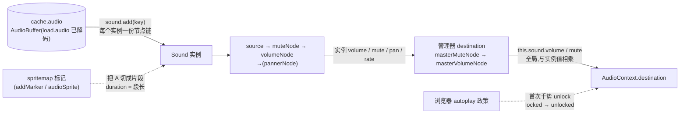

import { Canvas, Controls, Meta } from '@storybook/addon-docs/blocks';
import * as AudioStories from './audio.stories';

<Meta of={AudioStories} name="Docs" />

# 音频

Phaser 的声音分两层:**Sound Manager**(`this.sound`,全局唯一,挂在 game 上)管理 AudioContext、全局音量与全部实例;**Sound 实例**(`this.sound.add(key)` 的返回值)承载一次可控制的播放——音量、循环、速率、进度、标记都挂在实例上。素材层是 `cache.audio` 里的 `AudioBuffer`:`load.audio` 在加载阶段下载并解码(见「资源加载器」一课),实例只是同一份 buffer 的一个"播放口"。一个 key 可以建任意多个实例,叠加播放靠多实例,不靠重复调 `play`。本课讲播放、实例管理、标记(audio sprite)与移动端解锁、失焦暂停这些 sound 侧行为;加载与缓存细节见 2.1.1,与游戏输入的联动只在范例里以"点按钮发声"做最小示例。

Web Audio 是默认通路;设备不支持 Web Audio 时回退 HTML5 Audio(`audio` 标签池),`audio: { noAudio: true }` 时是全静默的 NoAudio 桩——三套实现共享同一套 `BaseSoundManager` / `BaseSound` 接口,本课 API 通用,行为差异处会单独标注。Phaser 4.2.1 仍保留这三路架构(本地源码核实)。



| 高频成员 | 所属 | 回查要点 |
| --- | --- | --- |
| `sound.play(markerName?, config?)` | 实例 | 总是从头播(含标记起点);`config.seek` 可改起点;返回是否成功 |
| `sound.pause()` / `resume()` / `stop()` | 实例 | 返回布尔;`delay` 等待期内 pause/resume 返回 `false` |
| `sound.isPlaying` / `sound.isPaused` | 实例 | 属性名是 `isPaused`,不是 `paused` |
| `sound.duration` / `totalDuration` | 实例 | 播标记时 `duration` = 段长,`totalDuration` = 整段 |
| `sound.volume` / `mute` / `loop` / `pan` | 实例 | 0..1 / 布尔 / 布尔 / -1..1(Safari 无 pan 返回 0) |
| `sound.rate` / `detune` | 实例 | 合成 `totalRate = rate × 管理器.rate × 2^(detune/1200)`;变速同时变调 |
| `sound.seek` | 实例 | 读 = 实时位置(播放中/暂停断点/停止 0);写 = 跳转,停止态写入无效 |
| `this.sound.add(key, config?)` | 管理器 | 每次返回新实例;key 不在 cache 直接 throw |
| `this.sound.play(key)` | 管理器 | 一次性:add + play + 完播自动 destroy |
| `this.sound.getAll(key?)` / `get(key)` | 管理器 | 按 key 过滤实例列表;`get` 取第一个匹配 |
| `this.sound.stopAll()` / `removeAll()` | 管理器 | 停止全部 / 销毁并移除全部实例 |
| `this.sound.volume` / `mute` | 管理器 | 全局,与实例值相乘生效 |
| `this.sound.locked` | 管理器 | 只读;等待首次手势解锁时为 `true` |

SoundConfig 默认值(`add` 与 `play` 的 config 通用):`volume` 1、`mute` false、`rate` 1、`detune` 0、`seek` 0、`loop` false、`delay` 0、`pan` 0。管理器默认:`volume` 1、`mute` false、`pauseOnBlur` true、`rate` 1、`detune` 0。


## 快速上手

`preload` 加载、`create` 建实例并播放,顺手设好音量与循环——这是本课的最小闭环。浏览器要求首次出声前有一次用户手势,点击画布本身就是手势,所以正常玩法流程不会遇到问题。

```ts
import Phaser from 'phaser';

class AudioScene extends Phaser.Scene {
  preload() {
    this.load.audio('coin', 'assets/coin.wav'); // 下载 + 解码 → cache.audio
  }

  create() {
    // 一次性音效:一行完事,播完自动销毁
    this.sound.play('coin', { volume: 0.6 });

    // 长驻背景音乐:自己持有实例,随时调 pause / volume
    const music = this.sound.add('bgm', { loop: true, volume: 0.35 });
    music.play();
  }
}
```

两种起播方式覆盖绝大多数场景:`this.sound.play(key)` 给短音效,`this.sound.add(key)` 给需要持续控制的音乐与语音。


## 播放控制

一个 Sound 实例就是一条"传输控制线":`play` 起播、`pause` 冻结在断点、`resume` 从断点继续、`stop` 彻底停下并清零进度。四个方法都返回布尔表示是否真的切换了状态,状态读 `isPlaying` / `isPaused`(注意属性名,不是 `paused`)。三条容易踩的语义:

- **`play` 永远从头开始。** 不管之前播到哪、停没停,再次 `play` 都重新起播(想改起点用 config 的 `seek`,如 `music.play({ seek: 1.6 })`)。同一实例快速连按 `play` 听到的是"重播",不是叠加——叠加要靠多实例,见下一节。
- **`pause` 把断点存进内部 seek。** Web Audio 实现销毁底层 source、把当前位置记进 `currentConfig.seek`,`resume` 重建 source 从该点继续;`stop` 则把进度清零。
- **`delay` 等待期内 pause/resume 会返回 `false`。** `play({ delay: 2 })` 后的两秒内,实例处于"已排定未开播"状态,此期间 `pause()` / `resume()` 直接拒绝。

位置与时长没有 `currentTime` 属性——实时位置读 `seek` 属性:播放中它返回 `getCurrentTime()` 的实时值(秒,按实际速率折算),暂停时返回冻结的断点,停止时返回 0;写入 `seek` 则立即跳转(clamp 到当前片段内),停止态写入无效。`getCurrentTime()` 也可以直接调,但 `.d.ts` 把它标成返回 `void`(类型缺口,取值需断言),且只适合播放态调用——暂停 / 停止后内部时钟已清零,返回值会随墙上时钟虚增,读位置统一走 `seek`。`duration` 是"当前有效片段"的时长:整段播放时等于 `totalDuration`,播标记时等于标记段长。

<Canvas of={AudioStories.SoundConsole} />
<Controls of={AudioStories.SoundConsole} />

| 读者操作 | 可观察证据 |
| --- | --- |
| 首次点击「播放」 | 手势同时解锁音频:`音频锁` 从 `locked` 变 `unlocked`,`AudioContext.state` 从 `suspended` 变 `running`;旋律第一音(A4)响起,进度条从 0 推进 |
| 播放中点「暂停」 | `状态` 变 `已暂停`,`currentTime` 冻结在断点数字;再点「继续」从同一数字继续,事件序列出现 `play → pause → resume` |
| 点「重播(同实例)」 | `play 计数 +1`、进度条立即归零重来——同一实例重复 play 是从头重播,不是叠加 |
| 播放中点「seek 1.6s(第三音)」 | `currentTime` 跳到约 1.60s,听到的是第三音(E5),事件序列出现 `seek` |
| 点「停止」后再点「播放」 | 停止把进度清零,重新播放从 0.00s 开始 |
| Controls 拉「实例音量 volume」 | `实际音量` 左侧的实例值实时跟随,无需重建实例;拉到 0 即静音 |
| Controls 开「循环 loop」 | 当前进度走完后旋律无缝从头继续,`loop` 读数出现「已循环 N 次」,事件序列出现 `looped` |
| Controls 拉「播放速率 rate」到 2 | `totalRate` 变 2.00,旋律快一倍且高一个八度——变速同时变调;进度条推进速度翻倍 |
| Controls 拉「音分微调 detune」到 1200 | `totalRate` 变 2.00(1200 音分 = 2 倍速),效果与 rate 2 相同,只是换了记法 |
| 播放中点击浏览器其他窗口再切回 | `pauseOnBlur` 生效:切走时 currentTime 冻结(isPlaying 仍为播放中),切回后从断点继续 |

本课每个 Canvas 里的 Phaser 实例在滚出视口或页面切到后台时会整体休眠省资源,不影响声音播放与读数。


### 音量与变速

音量走乘法链:每个实例自带 `muteNode → volumeNode →(pannerNode)` 节点链,再接管理器的 `masterMuteNode → masterVolumeNode`。所以**实际听到的音量 = 实例 `volume`(0..1)× 管理器 `volume`(0..1)**,两处 `mute` 任一为 `true` 即静音。实例属性(`setVolume` / `setMute` / `setPan`)在播放中即时生效,不需要重建实例;管理器的 `this.sound.volume` / `mute` 则影响所有声音,适合做全局音量滑杆与静音开关。`pan`(-1..1)是立体声偏移,Safari / iOS 不支持 StereoPannerNode,读回恒为 0。

变速有两个入口,最终合成同一个系数:

```text
totalRate = 实例 rate × 管理器 rate × 2^((实例 detune + 管理器 detune) / 1200)
```

`rate`(默认 1,0.5 半速、2 双倍速)是直观倍速;`detune`(-1200..1200 音分)是音乐记法,1200 音分 = 高一个八度 = 2 倍速,±100 音分 = 半音。两者都映射到 Web Audio 的 `playbackRate`,**变速同时变调**——想要"慢放但音调不变" Phaser 没有内置支持。播放中调整即时生效,`getCurrentTime()` 与 `seek` 读数也按实际速率折算,进度条推进速度与听感一致。


## 实例与管理器

管理器持有全部实例(`this.sound.sounds`),两条加入路径的生命周期完全不同:

- **`this.sound.play(key, extra?)`——一次性播放。** 内部就是 `add(key)` + `play()` + `once('complete', destroy)`:新建实例、播放、完播自动销毁,不用持有引用。连点三次就是三个实例同时响,天然叠加,是音效的标准写法。`extra` 传 config(`{ volume: 0.6 }`)或 marker(`{ name, start, duration }`,内部临时 addMarker)。
- **`this.sound.add(key, config?)`——长驻实例。** 实例一直留在管理器里,直到 `destroy()` / `remove()` / `removeAll()`。音乐、需要暂停恢复的语音、需要随时调速率的都走这条路。同一 key 想同时播两路受控声音,就 `add` 两次拿两个实例。

查询与批量操作(都在 `this.sound` 上):

| 方法 | 行为 |
| --- | --- |
| `get(key)` | 第一个匹配 key 的实例,无则 `null` |
| `getAll(key?)` | 全部实例,可按 key 过滤 |
| `getAllPlaying()` | 所有 `isPlaying` 的实例 |
| `isPlaying(key?)` | 按 key 或任意声音是否在播 |
| `remove(sound)` / `removeByKey(key)` | 销毁并移除指定实例 / 同 key 全部,返回是否成功 / 个数 |
| `removeAll()` | 销毁并清空全部实例 |
| `pauseAll()` / `resumeAll()` | 批量暂停 / 恢复(发 `pauseall` / `resumeall` 事件) |
| `stopAll()` / `stopByKey(key)` | 批量停止 / 按 key 停止 |

HTML5 Audio 回退通路的叠加语义不同:它靠 `audio` 标签池,标签耗尽时按 `HTML5AudioSoundManager.override`(默认 `true`)决定——默认抢走同 key 中播放进度最深的实例;`override` 为 `false` 时抢不到标签的这次播放直接失败。目标设备若走这条通路,叠加数量上限受标签池大小约束。

<Canvas of={AudioStories.SoundInstances} />
<Controls of={AudioStories.SoundInstances} />

| 读者操作 | 可观察证据 |
| --- | --- |
| 点「fire-and-forget play(key)」×3 份 | 立刻听到三声叠加的 ping;`ping 活动实例数` 瞬间 +3(画布圆点 +3),0.3s 内随完播自毁逐个回落 |
| 点「同实例连播 held.play()」×3 份 | 只听到一声(最后一次重播盖掉前两次);实例数恒为 1,`同实例重播累计 +3`——同一实例 play 是重播不是叠加 |
| 连续快速混点两种按钮 | fire-and-forget 每次都新建实例叠加;长驻实例始终只有那一个 |
| 点「stopAll 停止全部」 | 正在播放的实例全部停下(`正在播放数` 归零),实例仍在管理器里(实例数不变) |
| 点「removeAll 移除并销毁」 | `管理器全部实例` 归零、圆点消失;长驻实例随之销毁,再点连播按钮会自动重新 add |
| Controls 调「批量份数」 | 下一次点击按新份数叠加,实例数变化幅度随之改变 |


## 标记与音频精灵

标记(marker)把一份音频按时间切片:一个 name + start + duration 的组合,`play(markerName)` 只播该片段。一堆短音效(跳、击中、拾取)合进一个文件、一次请求全部带走,是移动端省请求的常用手段。

```ts
const fx = this.sound.add('sfx');
fx.addMarker({ name: 'jump', start: 0, duration: 0.3 });
fx.addMarker({ name: 'hit', start: 0.5, duration: 0.25 }); // start 起 0.25s

fx.play('jump');                    // 只播 jump 段
fx.play('jump', { volume: 0.5 });   // 标记也吃 config
```

要点:`duration` 缺省 = `totalDuration - start`(播到文件尾);重名标记 `addMarker` 打 `console.error` 并返回 `false`;标记播放时实例的 `duration` 切换为段长、`currentMarker` 指向该标记,`seek` 也被 clamp 在段内;`updateMarker(marker)` 改值、`removeMarker(name)` 删除;标记 config 可单独设 `loop`,只循环该段。

**音频精灵(audio sprite)= 标记的 json 化。** 用 audiosprite 工具(或手写)生成一份 spritemap json,`load.audioSprite` 一次加载音频 + json,之后 `playAudioSprite` 直接按名字播:

```ts
preload() {
  // json 与音频共用同一个 key('sfx'),标记来自 json 的 spritemap
  this.load.audioSprite('sfx', 'assets/sfx.json', 'assets/sfx.wav');
}

create() {
  this.sound.playAudioSprite('sfx', 'hit'); // 一次性 + 标记
  const spr = this.sound.addAudioSprite('sfx'); // 长驻版,可 pause / 调速率
  spr.play('jump');
}
```

json 格式(audiosprite 工具标准):`{ "resources": [...], "spritemap": { "hit": { "start": 0.5, "end": 0.75, "loop": false } } }`,`addAudioSprite` 内部就是按 `end - start` 逐个 `addMarker`,两种方式等价,sprite 的好处是标记定义跟着素材文件走。

<Canvas of={AudioStories.SoundMarkers} />
<Controls of={AudioStories.SoundMarkers} />

| 读者操作 | 可观察证据 |
| --- | --- |
| 点「low C4」 | 只听到第一个音;`currentMarker` = `m-low(start 0s)`,`duration` 显示 0.50s 而 `totalDuration` 仍 1.60s,进度条只推进第一格 |
| 依次点 low / mid / high | 三个不同音高对应三段区间;进度条的点亮区间随标记移动 |
| 点「整段播放(不指定标记)」 | `currentMarker` 变 `null(整段)`,duration 恢复 1.60s,三音连播 |
| Controls 切「audioSprite(json)」再点标记按钮 | 走 `playAudioSprite('chime-sprite', 'low')`,效果相同;`audioSprite 实例数` 每次 +1、完播归零——它是一次性实例 |
| 对比两种模式 | 手动标记是长驻实例可反复 pause;audioSprite 每次新建完播即毁,听感无差别 |


## 解锁与失焦

**解码分两段。** 常规路径:`load.audio` 下载后在加载阶段用 `context.decodeAudioData` 解码成 `AudioBuffer` 进 `cache.audio`(见 2.1.1),`complete` 时已就绪。运行时拿到原始数据(base64 字符串、data URI 或 ArrayBuffer)时走 `this.sound.decodeAudio(key, data)`(或传 `DecodeAudioConfig[]` 数组),异步解码后仍写入 `cache.audio`,每完成一个发 `decoded` 事件,全部完成发 `decodedall`——给"代码生成 / 网络下发音频"的场景用。

**解锁是浏览器 autoplay 政策的要求。** AudioContext 以 `suspended` 状态创建,首次用户手势前出不了声。Phaser 的处理:管理器发现 context 挂起时 `locked` 为 `true`,并在 `document.body` 上挂 `touchstart` / `touchend` / `mousedown` / `mouseup` / `keydown` 一次性监听;任一手势触发 `context.resume()`,成功后下一帧 `locked` 变 `false` 并在管理器上发 `unlocked` 事件。两点实务:

- **锁定期间 `play()` 不报错。** 底层 source 照常排定,context 恢复后自动出声;所以"点开始按钮 → 播放背景音乐"的常规流程天然没问题,不必手动检测。要主动等解锁就 `this.sound.once('unlocked', ...)` 或读 `this.sound.locked`。
- **手势必须发生在游戏所在文档上。** 嵌入 iframe 的页面(包括本手册的 Storybook 范例)要点画布内的按钮;点外层页面的控件解锁不了 iframe 里的 context。

**失焦暂停由 `pauseOnBlur`(默认 `true`)控制。** Phaser 把 `window.onblur` 转成 game 的 `blur` 事件、`window.onfocus` 转成 `focus`;`pauseOnBlur` 为 `true` 时管理器在两者间自动暂停 / 恢复:

| 通路 | blur 时 | focus 时 |
| --- | --- | --- |
| Web Audio(默认) | `context.suspend()`:时钟整体冻结,实例 `isPlaying` 不变,`seek` / `getCurrentTime()` 停走,恢复后从断点继续 | `context.resume()`(state 为 `suspended` / `interrupted` 时) |
| HTML5 Audio | 逐个暂停正在播的实例(记入待恢复列表) | 逐个从断点恢复播放 |

切标签页(visibilitychange)走的是 `hidden` / `visible`,与 blur 是两条事件线;Phaser 4 还内置了 iOS 17/18 的恢复补丁:页面重新可见时对 context 做一次 `suspend()` + `resume()`(延时 100ms),修复隐藏后声音哑掉的问题。不想要失焦暂停就把 `this.sound.pauseOnBlur = false`(创建后随时可改)——比如纯解谜游戏希望切走时音乐继续。

game config 的 `audio` 字段一共三项:`noAudio`(全静默 NoAudio 桩,省掉一切音频开销)、`disableWebAudio`(强制 HTML5 通路)、`context`(复用外部已建的 AudioContext,SPA 内重复创建/销毁游戏时避免超出浏览器 AudioContext 数量上限)。


## 最佳实践

- **按生命周期选加入方式。** 短音效用 `this.sound.play(key)`:一行、可叠加、完播自毁,不占引用;背景音乐与语音用 `add` 长驻并持有引用,场景关闭时随 `game.destroy` 一并销毁。混用反面模式是"全部 add 但从不销毁"——实例会无限累积。
- **首屏安排一次手势。** "点击开始"的标题画面顺带完成解锁;不要依赖声音做首屏反馈(锁定中无声且不报错),也不要在玩家第一次交互前 `play` 长音乐。
- **全局音量与静音只动管理器。** 设置面板的音量滑杆写 `this.sound.volume`,静音写 `this.sound.mute`,实例级 `volume` 留给混音(脚步 0.3、枪声 1.0);两层相乘,互不干扰。
- **变速需求先确认可接受变调。** `rate` / `detune` 都映射 `playbackRate`,慢放必降调;"音调不变的慢放"要么换素材(预录慢速版),要么接 Web Audio 自定义节点。
- **短音效合文件 + 标记。** 一次请求加载整包音效,`playAudioSprite` 按名播放;标记时长维护进 json(工具生成),不要在代码里手写 magic number 式的 start / duration。
- **目标含老设备时验证叠加行为。** Web Audio 通路叠加只受性能约束;HTML5 回退受 `override` 与标签池语义影响,关键音效在目标设备实测连点表现。


## 常见问题

- **调了 `play()` 却没有声音,也没报错。**
  多半是音频仍锁定。读 `this.sound.locked`(`true` = 等待首次手势)或 `AudioContext.state`(`suspended`);在游戏画布上点击 / 触摸 / 按任意键后再播。嵌入 iframe 时手势必须点在 iframe 内部。
- **`this.sound.add(key)` 直接抛 `Audio key "xxx" not found in cache`。**
  key 没加载或拼错;`add` 不做容错,构造实例时立即抛。加载未完成时把 `add` 挪到 `create` / `complete` 回调之后(见 2.1.1 的队列语义)。
- **快速连点同一实例 / 同一个 `get(key)`,听不到叠加。**
  同一实例的 `play` 是从头重播。叠加要么每次 `this.sound.play(key)`(新实例),要么对同一 key 多次 `add` 各自持有。
- **`sound.rate = 0.5` 后声音变低沉,想不变调。**
  `rate` / `detune` 都作用于 `playbackRate`,变速必变调,Phaser 无内置的保调变速。
- **读不到播放进度,`sound.currentTime` 是 `undefined`。**
  没有这个属性。读 `sound.seek`:播放中返回实时位置、暂停返回冻结断点、停止返回 0。Web Audio 实例的 `getCurrentTime()` 只适合播放态(暂停 / 停止后内部时钟已清零,返回值不可用),且 `.d.ts` 误标返回 `void`。
- **切到别的窗口再切回来,音乐从断点继续而不是重播,或期望它继续播却停了。**
  这是 `pauseOnBlur`(默认 `true`):blur 时 Web Audio 挂起整个 context(时钟冻结、`isPlaying` 不变),focus 时恢复续播。想让失焦时继续播就设 `this.sound.pauseOnBlur = false`。
- **`addMarker` 后 `play('名字')` 没反应,控制台有 `Marker: xxx missing` 或 `already exists`。**
  前者是名字拼错(播放时找不到标记);后者是重复添加同名标记(返回 `false`,旧的生效)。标记列表读 `sound.markers` 核对。
- **`stop()` 之后写 `seek` 没效果。**
  `seek` 写入只对播放 / 暂停态生效;停止态要指定起点就 `play({ seek: 秒 })`。


## 总结回顾

摘要:

`this.sound` 是全局唯一的 Sound Manager,持有 AudioContext、全局 `volume` / `mute` / `rate` / `detune` 与全部实例;实例由 `add(key)` 创建、共享 `cache.audio` 里的同一份 `AudioBuffer`,自带 play / pause / resume / stop、`isPlaying` / `isPaused`、`seek`(读实时位置、写跳转)、音量与变速。`this.sound.play(key)` 是一次性封装(完播自毁、天然叠加),长驻控制用 `add` 持有;同一实例重复 `play` 是从头重播。标记(addMarker / audioSprite)把一份文件切成多个可播放片段,`duration` 随之切换。变速的 `rate` 与 `detune` 合成 `totalRate`,都映射 `playbackRate`,变速同时变调。autoplay 政策由管理器自动解锁(首次手势 → `unlocked` 事件,锁定期间 play 不报错);`pauseOnBlur` 默认在失焦时挂起整个 context、回焦点续播。

一句话:

> 一个 key 多个实例:叠加靠新实例,重播靠同实例——先用 add 还是 play 决定生命周期,其余控制都挂在实例上。

知识要点:

- `this.sound.play(key)` 与 `this.sound.add(key)` 各自的生命周期是什么?什么时候用哪个?
- 同一实例连续 `play()` 发生什么?想要同时出声该怎么做?
- `pause` / `resume` / `stop` 分别把进度留在哪?`seek` 属性读和写各返回 / 触发什么?
- 实际听到的音量由哪几个值决定?全局静音和实例静音分别设哪里?
- `rate` 与 `detune` 如何合成 `totalRate`?变速能否不变调?
- 标记播放时 `duration` / `currentMarker` 如何变化?audioSprite 的标记定义从哪来?
- `locked` 何时为 `true`?解锁依赖什么?锁定期间 `play()` 会怎样?
- `pauseOnBlur` 在 Web Audio 与 HTML5 两条通路上分别怎么暂停?怎么关闭?
- 哪三种 game config 选项会改变音频通路的选型?

## 参考资料

- [Phaser 官方文档(Phaser 4 API 与指南总入口)](https://docs.phaser.io/)
- [Phaser 4 API:Phaser.Sound.BaseSoundManager(this.sound 的通用方法与属性)](https://docs.phaser.io/api-documentation/class/sound-basesoundmanager)
- [Phaser 4 API:Phaser.Sound.WebAudioSound(Web Audio 实例:seek / rate / detune / getCurrentTime)](https://docs.phaser.io/api-documentation/class/sound-webaudiosound)
- [Phaser 4 API:Phaser.Sound.WebAudioSoundManager(context、解锁与 decodeAudio)](https://docs.phaser.io/api-documentation/class/sound-webaudiosoundmanager)
- [Phaser 4 API:Phaser.Types.Sound.SoundConfig / SoundMarker(add / play 的配置字段)](https://docs.phaser.io/api-documentation/namespace/types-sound)
- [Phaser 4 API:Phaser.Loader.LoaderPlugin.audioSprite(音频精灵加载)](https://docs.phaser.io/api-documentation/class/loader-loaderplugin)
- [官方示例库(audio / audio sprite 类目:播放、标记、解锁的可运行示例)](https://phaser.io/examples)
- [Phaser 4 Labs 示例浏览器](https://labs.phaser.io/phaser4-index.html)

