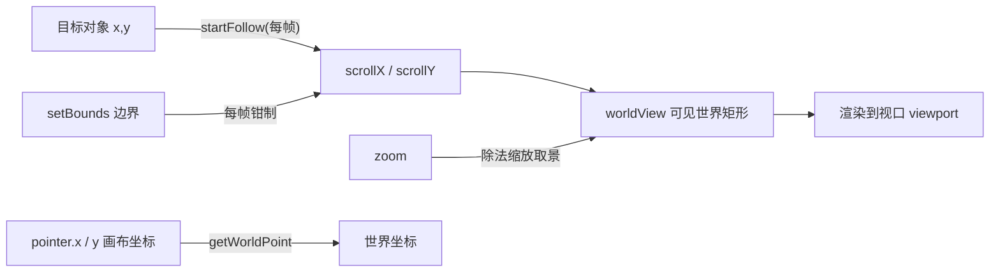

import { Canvas, Controls, Meta } from '@storybook/addon-docs/blocks';
import * as CameraControl from './camera-control.stories';

<Meta of={CameraControl} name="Docs" />

# 摄像机控制

Phaser 里一切画面都经过摄像机渲染:每个场景自带一台主摄像机 `this.cameras.main`。理解摄像机只需两个要素——**视口**(viewport)是它在画布上的取景窗口,位置与大小用 `setViewport` 调整;**滚动**(scroll)决定这个窗口对准世界的哪里,用 `scrollX` / `scrollY` 移动。在此之上有三件事:**边界** `setBounds` 把滚动钳制在世界内;**跟随** `startFollow` 让滚动每帧自动追踪目标(用 `lerp` 平滑、`deadzone` 留出不动区);**缩放** `zoom` 在不改变分辨率的前提下放大或缩小取景。最后,屏幕坐标与世界坐标的互算(`getWorldPoint`、`pointer.worldX`)也挂在摄像机上——它正是 [2.4.2 指针与交互](?path=/docs/pointer-input--docs) 里拖拽能对准对象的原理。本课按「滚动 → 边界 → 跟随 → 缩放 → 坐标换算 → 视口」展开。

shake / flash / fade 等效果与多摄像机分屏、HUD 层(`camera.ignore`、`setScrollFactor`)属于 [2.5.2 摄像机效果](?path=/docs/camera-effects--docs);物理世界的 world bounds(限制刚体而非镜头)属于 [3.1 Arcade 物理](?path=/docs/arcade-physics--docs)。



关键 API 的默认值(以下经 phaser@4.2.1 类型与源码核实):

| API / 属性 | 默认值 | 回查要点 |
| --- | --- | --- |
| `this.cameras.main` | 场景第一台摄像机 | `cameras.add(..., makeMain)` 可另立主摄像机 |
| `scrollX` / `scrollY` | `0` | 视口左上角对齐的世界坐标;直接赋值或 `setScroll(x, y)` |
| `centerOn(x, y)` | — | 设 scroll 使某点居中;`useBounds` 时被钳制,越界点居不了中 |
| `setBounds(x, y, w, h, centerOn)` | `centerOn = false` | 自动置 `useBounds = true`;只钳制滚动,不管对象与视口 |
| `useBounds` | `false` | 直接置 `false` 临时关;`removeBounds()` 彻底清 |
| `startFollow(target, roundPixels, lerpX, lerpY, offsetX, offsetY)` | `false / 1 / 1 / 0 / 0` | 任意带 `x` / `y` 的对象都能当目标 |
| `lerp` | `(1, 1)` | 每帧线性插值比例;1 瞬移、0 关闭该轴跟踪;不随帧率归一 |
| `followOffset` | `(0, 0)` | 从目标坐标里减去的偏移;`setFollowOffset(x, y)` |
| `deadzone` | `null` | `setDeadzone(w, h)` 设置、无参清除;仅跟随时生效 |
| `zoom` / `zoomX` / `zoomY` | `1` | 纯显示缩放;`setZoom(x, y)` 最小 0.001,两轴可分离 |
| `displayWidth` / `displayHeight` | 视口 ÷ zoom | 只读;zoom 后实际可见的世界尺寸 |
| `worldView` | 每帧更新的矩形 | 可见世界范围,做剔除与相交判断 |
| `getWorldPoint(x, y)` | — | 画布坐标 → 世界坐标;zoom = 1 时即 `屏幕 + scroll` |
| `setViewport(x, y, w, h)` | 视口 = 游戏尺寸 | 画布上的取景窗口;轴对齐,不能旋转 |

## 快速上手

「大世界 + 镜头跟着角色走」的最小闭环只要两行:

```ts
create() {
  const cam = this.cameras.main;
  cam.setBounds(0, 0, 2000, 1200); // 世界范围:滚动被钳制在内
  cam.startFollow(this.player);    // 每帧自动滚动,保持目标居中
}
```

默认 `lerp = 1` 是瞬移跟随;要平滑,第三个参数给个小值:`startFollow(this.player, false, 0.1)`。把 `setBounds` 的宽高改成比游戏画布更大,角色移动时镜头就会滚动——这就是本课范例(见「跟随」一节)做的事。

## 滚动:scrollX 与 centerOn

`scrollX` / `scrollY` 的语义只有一句:**视口左上角当前对齐的世界坐标**。zoom 为 1 时,一个对象出现在屏幕上的位置就是 `对象坐标 - scroll`——`scrollX` 增大,画面朝世界的另一侧移动。scroll 与视口完全无关:改视口不动 scroll,改 scroll 不动视口。

移动镜头的入口分两类:

```ts
const cam = this.cameras.main;

// 一类:直接操作 scroll(视口左上角对齐到世界坐标 x, y)
cam.scrollX = 400;          // 直接赋值,与 setScroll 等价
cam.setScroll(400, 200);    // y 省略时取 x

// 二类:按"注视点"操作(把某个世界坐标放到视口正中)
cam.centerOn(720, 405);     // scrollX = x - width / 2,scrollY 同理
cam.centerOnX(720);         // 只动水平,不碰 scrollY
cam.centerToBounds();       // 对准边界中心,useBounds 时才有意义
```

两个只读换算工具:

- `cam.midPoint`:镜头正中央当前对准的世界坐标(= scroll + 半个视口),读它回答「我现在看着哪里」。
- `cam.getScroll(x, y)`:**不移动镜头**,只回答「要把 (x, y) 放到正中,scroll 该是多少」;`useBounds` 时返回值已按边界钳制。适合「先算再决定要不要移」的场合。

同族还有一个 `centerToSize()`:视口尺寸变化后把 scroll 重设为视口的一半,让 (0, 0) 回到画面左上角,多在自定义 resize 逻辑里用。

`centerOn` 传一个离边界太近的点会发生什么?`useBounds` 为真时目标 scroll 被钳制,镜头只能「尽量」居中——注意 `centerToBounds` 在未开边界时是空操作。这些钳制规则的细节见下节。

## 边界:setBounds

`setBounds(x, y, width, height, centerOn?)` 定义一个轴对齐的世界矩形,并自动把 `useBounds` 置为 `true`。此后**每一帧渲染前**,无论 scroll 来自手动赋值、`centerOn` 还是跟随,都会被钳制到合法区间——所以开着边界时给 `scrollX` 赋越界值,下一帧就会被「弹回」。

合法区间按可见尺寸推导(zoom 为 1 时就是视口尺寸):

```text
scrollX ∈ [bounds.x, bounds.x + bounds.width - displayWidth]
scrollY ∈ [bounds.y, bounds.y + bounds.height - displayHeight]
```

由这个区间直接得到两个高频结论:

- **边界不拦对象,只拦镜头。**游戏对象照样可以放在边界外,只是镜头追不过去(跟随目标出界时,目标会走出画面边缘而不是把镜头拖出去)。
- **bounds 小于可见范围时,滚动被锁死。**区间两端相等,scroll 固定为 `bounds.x + (displayWidth - width) / 2`,画面停在边界居中的位置——范例里 zoom 调到 0.5 时可见范围恰好等于世界,即可观察到锁死。

管理入口:`removeBounds()` 彻底清除;直接置 `cam.useBounds = false` 临时关闭(矩形还在,随时置回 `true`);`getBounds(out?)` 拿到边界矩形的拷贝;`centerOn: true` 让 `setBounds` 顺带把镜头对准边界中心。

边界矩形可以从任意坐标起算:想让世界坐标 (0, 0) 在正中心,`setBounds(-1024, -1024, 2048, 2048)` 即可。最后注意区分:这里的 bounds 属于摄像机,限制刚体活动的物理 `world bounds` 是另一套系统,见 [3.1 Arcade 物理](?path=/docs/arcade-physics--docs)。

## 跟随:startFollow

`startFollow(target, roundPixels?, lerpX?, lerpY?, offsetX?, offsetY?)` 让镜头每帧自动滚动,把目标(减去 `followOffset` 后)保持在视口中心。它不是事件,而是每帧渲染前的固定动作:**目标坐标 − 偏移 → 算出理想 scroll → 按 `lerp` 插值 → 按边界钳制**。

- **目标要求极低:**类型是 `GameObject | object`,任何带 `x` / `y` 的对象(包括普通 `{ x, y }` 字面量与 Vector2)都能跟,不要求是显示对象;跟随期间改对象的 `x` / `y` 即可带动镜头。
- **`stopFollow()` 后 scroll 停在原地**,不会跳回原位;再次 `startFollow` 则从当前位置继续。
- **偏移 `followOffset`**(或 `setFollowOffset(x, y)`,或 `startFollow` 的最后两个参数):从目标坐标里减去的量。正值把注视点移向目标的左上方,常用于「角色偏下、前方留更多视野」的构图。
- **`roundPixels` 参数**(第二个,默认 `false`):把镜头 scroll 取整到整像素,消除跟随快速移动目标时的亚像素抖动;但非整数 zoom 会破坏它,像素风游戏保持整数 zoom。

跟随与 `centerOn` 不冲突:`stopFollow` 之后用 `centerOn` 手动接管,是「切镜头看剧情点再切回来」的常见组合。

### 平滑与死区:lerp 与 setDeadzone

**`lerp` 是「每帧向理想 scroll 靠近的比例」**,0–1 之间,`setLerp(x, y)` 可两轴分离:

- `1`(默认):立刻到达理想值,瞬移跟随;`0`:该轴完全不跟踪(镜头在这个轴上静止)。
- 中间值如 `0.1`:每帧只补上差距的 10%,镜头拖出一条平滑的追赶曲线;目标停下后镜头会渐近贴合,不会停在半路。
- 两个必须知道的边界:插值**不随帧率归一**——同一个 0.1 在 120Hz 下平滑速度是 60Hz 的两倍(4.2.1 源码为固定比例的 `Linear`),要帧率无关需自行按 delta 换算;`lerp` 只在跟随时生效,`stopFollow` 后无作用。

**`deadzone` 是镜头中心一块「目标在里面就不滚动」的矩形**,`setDeadzone(w, h)` 设置、无参调用(或置 `null`)清除,仅跟随时生效:

- 矩形每帧重新对中于镜头中心,可以拿 `cam.deadzone` 直接做 `Rectangle.Contains` 之类的判定(范例 readout 的「目标在死区内」就是这么来的);改它的 `width` / `height` 即时生效,但位置别手改——每帧都会被重定心。
- 判定按轴独立:目标只在水平方向越界,就只滚水平;越界的那一侧按「超出量」追赶,且同样乘 `lerp`。
- 与纯 lerp 的取舍:lerp 小值是「永远慢半拍地跟着」;deadzone 是「目标小范围活动时镜头纹丝不动,出界才动」——平台跳跃、俯视探索类通常更喜欢后者。

下面是本课主范例:**世界 1440×810 是视口 720×405 的两倍**,网格上标着世界坐标;菱形目标沿蓝色虚线框自动巡航,可以按住拖到任意位置。Controls 直接映射本课的五个开关,readout 给出 scroll、worldView、镜头中心、目标坐标、死区判定与指针坐标换算。

<Canvas of={CameraControl.CameraLab} />
<Controls of={CameraControl.CameraLab} />

| 读者操作 | 可观察证据 |
| --- | --- |
| 目标自动巡航(默认跟随、lerp = 1、开边界) | `midPoint` 始终约等于目标世界坐标;`scrollX / scrollY` 随之反向变化;网格与坐标标记滚动,zoom = 1 时 `worldView` 左上角 = scroll |
| 把「lerp 平滑」调到 0.1 | 镜头拖出追赶曲线:`midPoint` 持续落后于目标坐标,目标停住的瞬间差值最大,随后渐近贴合 |
| 关闭「跟随目标」 | `scrollX / scrollY` 与 `worldView` 立即冻结,目标自己跑出画面;重新打开后从当前位置继续追 |
| 打开「deadzone 死区」 | 画布出现橙色矩形(每帧对中镜头);目标在区内时读数为「是(该轴不滚动)」且 scroll 不动,越出哪边哪边才滚 |
| 拖拽菱形目标到世界角点(开边界) | `scrollX / scrollY` 停在 `(720, 405)` 不再增大——世界 1440×810 减视口 720×405,正是可滚区间的上限 |
| 关闭「bounds 边界」后把目标拖到角点 | scroll 继续越界变为负值/超上限,`worldView` 移出世界,画面边缘露出画布底色 |
| 把「zoom 缩放」调到 2 | `worldView` 尺寸变为 `360×203`(视口 ÷ zoom),同样的 720 宽画布只显示一半世界;每个网格单元看起来变成两倍大 |
| 把「zoom 缩放」调到 0.5 | `worldView` 变为 `1440×810` 恰好看满世界;可滚区间退化为一个点,scroll 锁定在 `(360, 203)`,怎么移动目标都不动 |
| 把指针移到画布上 | 「指针 screen x,y → worldX」随指针更新;`getWorldPoint(指针)` 一行始终与 `worldX` 相等;zoom ≠ 1 时换算不再是简单相加 |
| 打开 Show code | 看到该 Canvas 实际执行的 `camera-lab.ts` 全文 |

实例滚出视口或页面切到后台时会整体休眠以省资源,回到视口自动恢复;休眠期间目标暂停巡航,恢复后继续。

## 缩放:zoom

`zoom`(`setZoom(x, y?)`,最小 0.001)是**纯显示缩放**:渲染时先把世界坐标减去 scroll,再围绕视口中心乘上 zoom。它不改变 config 的游戏尺寸、不触发 Scale Manager 的任何适配,也不影响纹理分辨率——2 就是「每个世界像素画成 2 个屏幕像素」,0.5 就是「看到两倍大的范围」。

zoom 与分辨率无关,但三个派生量跟着变:

| 读取 | 关系 | 说明 |
| --- | --- | --- |
| `displayWidth` / `displayHeight` | 视口 ÷ zoom | zoom 后实际可见的世界尺寸;zoom 2 时 720 宽的视口只显示 360 世界单位 |
| `worldView` | 中心 = `midPoint`,尺寸 = displayWidth × displayHeight | 可见世界矩形随之缩放(上节表格可核对) |
| 可滚区间长度 | `bounds 宽 − displayWidth` | 边界钳制用 `displayWidth` 推导:zoom in 后可滚范围变大(scroll 甚至可为负),zoom out 到「看得比世界还大」时滚动锁死 |

要点与坑:

- **缩放围绕视口中心**,不是左上角:屏幕中点始终对应 `midPoint`,zoom 前后注视点不变。
- 两轴可分离:`zoomX` / `zoomY` 独立,`setZoom(2, 1)` 拉伸画面。
- **像素风慎用非整数 zoom:**镜头的 `roundPixels` 取整只在 zoom 为整数时才真正生效(渲染器按 `renderRoundPixels` 判断),1.5 倍的 zoom 既会有亚像素采样抖动,也会破坏跟随取整。
- 想要「平滑变焦到某档位」用 `cam.zoomTo(zoom, duration, ease)`(属于效果家族,见 [2.5.2 摄像机效果](?path=/docs/camera-effects--docs));想适配不同屏幕尺寸,该调的是 Scale Manager,不是 zoom,见 [1.2 创建游戏](?path=/docs/game-config--docs)。

## 世界与屏幕坐标

镜头一动,「同一个点」就有了两套坐标:**世界坐标**(对象身上的 `x` / `y`)与**画布坐标**(它显示在画布的哪里)。三件工具负责互算与查询:

- **`cam.worldView`**:只读矩形,每帧渲染前由 scroll 与 zoom 推导,即当前可见的世界范围。高频用途是剔除与相交判断,例如只更新 `worldView` 范围内的敌人、只在进入 `worldView` 时激活对象;判定「某对象是否在画面里」用它,别自己拼 scroll 公式。
- **`cam.getWorldPoint(x, y, out?)`**:画布坐标 → 世界坐标,经摄像机矩阵逆变换,自动处理视口偏移、scroll、zoom 与旋转。zoom 为 1 且无旋转时就是 `世界 = 画布 + scroll`;zoom ≠ 1 时围绕视口中心换算——上节范例里把指针换算读数调到 zoom 2 即可看到差值。
- **`cam.midPoint`**:镜头正中的世界坐标,即 `worldView` 的中心。

指针坐标就是这套换算的最大用户,呼应 [2.4.2 指针与交互](?path=/docs/pointer-input--docs):

- `pointer.x` / `pointer.y` 是画布坐标(Scale Manager 已把 CSS 尺寸换算回游戏尺寸);
- **`pointer.worldX` / `worldY` 是输入系统在命中测试时用指针下方的摄像机做 `getWorldPoint` 后的缓存**——源码上就是同一函数逐摄像机写入,所以范例 readout 里两行读数始终相等;
- 只有一台摄像机时它就是唯一答案;多台摄像机重叠时想指定某台换算,用 `cam.getWorldPoint(pointer.x, pointer.y)` 明确目标;
- 拖拽同理:`drag` 事件的 `dragX` / `dragY` 已经是按拖拽起始摄像机换算好的世界坐标,直接赋给对象即可——范例里拖着目标穿过缩放中的画面也不会错位,靠的就是这层换算。

反方向(世界 → 画布)没有专门的便捷方法,把对象 `x` / `y` 减 scroll、除 zoom 自己算,或用于 UI 定位时改用固定摄像机(见 [2.5.2 摄像机效果](?path=/docs/camera-effects--docs))。

## 视口与多台摄像机

视口(viewport)是摄像机在画布上的取景窗口,由 `x` / `y` / `width` / `height` 四个属性描述,默认与游戏同尺寸、铺满画布。`setViewport(x, y, width, height)` 一次设齐,`setPosition` 与 `setSize` 分开调整。

- 视口**不随镜头旋转**(轴对齐矩形),也不受 scroll / zoom 影响——它只管「画布上的哪块区域归这台摄像机渲染」。
- 缩小视口即得「迷你地图」式的画中画;但类型文档提示:视口变化时滤镜与遮罩可能错位,复杂场景更可靠的做法是渲染到 `DynamicTexture` 再当贴图用。
- 输入命中测试只对「指针下方」的摄像机生效;`cameras.getCamerasBelowPointer(pointer)` 返回按层级排序的结果。
- 摄像机还有三个整帧级视觉开关:`setBackgroundColor`(默认透明,取本摄像机自己的底色)、`setAlpha`(整帧不透明度,可用来整体淡入淡出)、`setVisible(false)` 连渲染与输入一起跳过。

每台摄像机都是独立的取景器:各有一套 scroll / zoom / bounds / follow / 背景色。场景默认只有 `main` 一台;`this.cameras.add(x, y, width, height, makeMain?, name?)` 再添一台(最多约 31 台能参与对象排除),返回的摄像机用法与 `main` 完全相同。用它做分屏对战、小地图与不受滚动影响的 HUD 层(配合 `camera.ignore` 与 `setScrollFactor`)属于 [2.5.2 摄像机效果](?path=/docs/camera-effects--docs),在那里展开。

## 最佳实践

- **bounds 覆盖最大可见范围:**可滚区间按 `displayWidth` 推导,允许玩家 zoom out 时要保证 `bounds ≥ 视口 ÷ 最小 zoom`,否则缩小时滚动被锁死;动态 zoom 的游戏可在 zoom 变化后重设 bounds。
- **跟随默认是瞬移:**`startFollow` 不传 lerp 就是硬跟随;要电影感给 `0.05–0.2`,要「小范围活动不晃屏」改用 deadzone,两者可叠加(越界追赶也吃 lerp)。像素风游戏配 `roundPixels: true` + 整数 zoom。
- **构图用 followOffset,别每帧改 scroll:**想让角色偏屏幕下方,`setFollowOffset(0, 60)` 一次即可;在 `update` 里手动混合 scroll 与 follow 会互相打架(跟随每帧都会覆盖 scroll)。
- **坐标换算一律走 API:**判断对象是否上屏用 `worldView`,指针落地用 `getWorldPoint` / `pointer.worldX`,不手写 `+ scrollX` 公式——zoom 与旋转一旦介入,手写公式必然出错。

## 常见问题

- **`setBounds` 之后镜头一动不动。**
  可滚区间两端相等就会锁死:bounds 不大于可见范围(视口宽高,或 zoom out 后的 `displayWidth` / `displayHeight`)即触发。检查 bounds 是否写成了游戏画布尺寸(和视口一样大),或 zoom 是否小于 1;范例里 zoom 0.5 可复现。
- **给 `scrollX` 赋值,下一帧又被弹回原值。**
  `useBounds` 为真时每帧渲染前都会钳制 scroll,越界赋值留不住。要临时越界,置 `cam.useBounds = false` 或 `removeBounds()`;要移动镜头,用落在边界内的目标值。
- **`centerOn(x, y)` 之后 `midPoint` 不等于 (x, y)。**
  目标点离边界不足半个视口,scroll 被钳制,镜头只能「尽量」居中。这是设计内行为;确实要看边界外就用无边界摄像机或 `camera.ignore` 组合方案(2.5.2)。
- **跟随的目标快速移动时画面发抖 / 有毛边。**
  亚像素抖动:`startFollow(target, true)` 开整像素取整,并保持整数 zoom(非整数 zoom 会让取整失效);lerp 极小值 + 高速目标也会表现为「追不上」,适当调大。
- **`pointer.worldX` 和我手算的 `pointer.x + scrollX` 对不上。**
  zoom ≠ 1 时换算围绕视口中心而非左上角,还有视口偏移与旋转参与。直接用 `cam.getWorldPoint(pointer.x, pointer.y)`;多摄像机时 `pointer.worldX` 来自指针下最上层那台,换算前先确认目标摄像机。
- **lerp 的平滑手感在不同设备上不一样。**
  lerp 是每帧固定比例插值,不随帧率归一(4.2.1 源码),帧率越高平滑越快。要一致手感,按 `1 - (1 - lerp) ^ (delta / 16.67)` 逐帧换算后经 `setLerp` 写入,或接受差异只用小值。

## 总结回顾

摘要:

摄像机由「视口 + 滚动」两个要素构成:视口用 `setViewport` 决定画布上的取景窗口,scroll(`scrollX` / `scrollY` 或 `setScroll` / `centerOn`)决定窗口对准世界的哪里,两者互不影响。`setBounds` 开启后每帧把任何来源的 scroll 钳制在 `bounds − 可见尺寸` 的区间内,bounds 小于可见范围则滚动锁死。`startFollow` 每帧按「目标 − 偏移 → 理想 scroll → lerp 插值 → 边界钳制」驱动镜头,lerp 是不随帧率归一的每帧追赶比例,deadzone 则让目标在镜头中心矩形内活动时该轴完全不滚。zoom 是围绕视口中心的纯显示缩放,只改 `displayWidth` 等派生量与渲染采样,不改分辨率。坐标互算靠 `worldView`(可见世界矩形)、`midPoint`(注视点)与 `getWorldPoint`(画布 → 世界),`pointer.worldX` 与拖拽坐标都由它换算而来;多摄像机用 `cameras.add` 增加,分屏与 HUD 属 2.5.2。

一句话:

> 镜头看哪里由 scroll 决定、画在哪里由视口决定——bounds 钳制 scroll,跟随每帧写 scroll,缩放只改显示,一切坐标换算都回到这台摄像机的 transform。

知识要点:

- 视口与 scroll 各管什么?改动其中一个会影响另一个吗?
- `setScroll`、`centerOn`、`getScroll` 分别以什么为基准设置或换算 scroll?
- `setBounds` 之后 scroll 的合法区间怎么算?bounds 小于可见范围时会发生什么?
- `startFollow` 的六个参数默认值是什么?`stopFollow` 之后镜头停在哪?
- lerp 的插值语义是什么?为什么不随帧率归一?deadzone 按什么规则决定滚不滚?
- zoom 改变与不改变哪些量?`displayWidth`、`worldView`、可滚区间各自怎么变?
- `worldView`、`midPoint`、`getWorldPoint` 各回答什么问题?`pointer.worldX` 从哪来?
- 怎么再加一台摄像机?视口能旋转吗?

## 参考资料

- [@官方@Phaser 官方文档](https://docs.phaser.io/) — Camera / CameraManager 的 API 页与摄像机指南
- [@官方@官方示例库](https://phaser.io/examples/) — camera 分类下的可运行示例
- [@官方@Phaser 4 Labs 示例浏览器](https://labs.phaser.io/phaser4-index.html) — Phaser 4 专用示例,含摄像机部分
