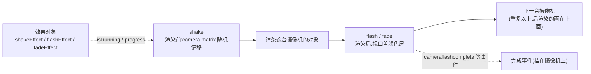

import { Canvas, Controls, Meta } from '@storybook/addon-docs/blocks';
import * as CameraEffects from './camera-effects.stories';

<Meta of={CameraEffects} name="Docs" />

# 摄像机效果

Phaser 把「镜头演出」内置在摄像机上:`shake` 震动、`flash` 闪光、`fade` 淡入淡出是三个过程型效果,`pan` / `rotateTo` / `zoomTo` 是三个位运动效果。理解它们只需三句话:**效果不是场景对象,而是摄像机的渲染状态**——fade / flash 是渲染收尾时盖在视口上的颜色层,shake 是渲染矩阵的随机偏移,世界里的对象一概不动;**效果是异步过程**——有 `isRunning` / `progress` 和挂在摄像机上的完成事件;**每台摄像机一份**——效果只属于被调用的那台,这正好与多摄像机能力衔接:`cameras.add` 增加独立取景器,`camera.ignore` 决定对象归属,HUD 层与分屏由此实现。本课按「效果共同模型 → shake / flash / fade → 多摄像机 → HUD → 分屏」展开;视口、scroll、bounds 与跟随是前置知识,见 [2.5.1 摄像机控制](?path=/docs/camera-control--docs)。



关键 API 的默认值(以下经 phaser@4.2.1 类型与源码核实):

| API / 属性 | 默认值 | 回查要点 |
| --- | --- | --- |
| `shake(duration, intensity, force?)` | `100 / 0.05 / false` | intensity 是视口比例,可传 `Vector2` 分轴;偏移乘 zoom,不改 scroll |
| `flash(duration, r, g, b, force?)` | `250 / 255 / 255 / 255 / false` | 先满色覆盖再衰减到透明 |
| `fadeIn(duration, r, g, b)` | `1000 / 0 / 0 / 0` | 颜色 → 透明;内部恒 `force = true` |
| `fadeOut(duration, r, g, b)` | `1000 / 0 / 0 / 0` | 透明 → 颜色;完成后**保持覆盖**直到反向 fade 或 reset |
| `fade` / `fadeFrom` | 同 fadeOut / fadeIn | 与之方向相同,但带 `force` 参数 |
| 效果对象 `shakeEffect` 等 | 每台摄像机一份 | `isRunning`、`progress`(0–1);fade 另有 `isComplete`、`direction` |
| 完成事件 | 挂在摄像机上 | `'camerashakecomplete'`、`'cameraflashcomplete'`、`'camerafadeoutcomplete'` 等 |
| `callback` 参数 | — | 每帧调用的 onUpdate,`(camera, progress)`;**不是**完成回调 |
| `this.cameras.add(x, y, w, h, makeMain?, name?)` | `0 / 0 / 游戏尺寸 / false / ''` | 最多约 31 台;`id` 是 2 的幂(ignore 的位掩码) |
| `camera.ignore(entries)` | — | 对象 / 数组 / Group / Container;本质 `obj.cameraFilter \|= camera.id` |
| `setScrollFactor(0)` | `scrollFactor = 1` | 位置不随滚动;但不隔离多摄像机归属,也不抗 zoom |

## 快速上手

两个最高频的闭环:受击震动一行;「淡出 → 切场景 → 淡入」三步。

```ts
// 受击反馈:短促震动(强度是视口比例,小值起步)
this.cameras.main.shake(150, 0.01);

// 过场换场景:淡出,完成后在事件里切换,新场景开场淡入
this.cameras.main.fadeOut(600);
this.cameras.main.once('camerafadeoutcomplete', () => {
  this.scene.start('NextScene');
});
// NextScene 的 create() 里:
this.cameras.main.fadeIn(600);
```

要点都在注释里:完成时机靠事件拿(`once` 避免重复监听);`fadeIn` / `fadeOut` 从不排队,随时可打断重开。参数与机制的细节见下文。

## 效果的共同模型

六个效果共享同一套运行机制,先把它讲清,每个成员就只剩参数差异。

**效果挂在摄像机上,不进场景。**调用 `cam.shake(...)` 后,摄像机内部的 `shakeEffect` 对象进入运行态;每帧渲染这台摄像机时,先在 `preRender` 里应用 shake 的矩阵偏移,渲染完所有对象后再由渲染器在视口上叠出 flash / fade 的颜色层(所以 shake 位移对象、fade / flash 不碰对象,只盖颜色)。整个流程不产生任何游戏对象,也不改世界坐标。

**运行状态与进度。**每个效果对象暴露 `isRunning`(是否运行中)与 `progress`(0–1 的进度,每帧按 `elapsed / duration` 推进),可以直接读:

```ts
const cam = this.cameras.main;
cam.fadeOut(1000);
cam.fadeEffect.isRunning;  // true
cam.fadeEffect.progress;   // 0 → 1 渐进,可直接拿去做 UI 进度条
cam.fadeEffect.direction;  // true = fade out(透明→颜色)
```

**同类互斥,异类叠加。**效果对象每台摄像机每种只有一个:`shake` 运行中再调 `shake` 会被静默忽略,除非传 `force: true`(重启该效果)——`fadeIn` / `fadeOut` 内部就是恒 `force = true` 的方向化快捷方式。不同类型之间完全独立,shake 与 fade 可以同时进行(画面边抖边黑)。

**两个回调位,别混。**方法签名里的 `callback` 是**每帧 onUpdate**,收到 `(camera, progress)`;效果「结束时」做什么要监听事件——开始与完成事件都挂在这台摄像机上:

| 效果 | 开始 / 完成事件 |
| --- | --- |
| shake | `'camerashakestart'` / `'camerashakecomplete'` |
| flash | `'cameraflashstart'` / `'cameraflashcomplete'` |
| fade | `'camerafadeoutstart'` / `'camerafadeoutcomplete'`;`'camerafadeinstart'` / `'camerafadeincomplete'` |
| pan / rotateTo / zoomTo | `'camerapanstart'` / `'camerapancomplete'` 等,同规则 |

事件常量也可从 `Phaser.Cameras.Scene2D.Events` 取(如 `SHAKE_COMPLETE`)。此外每个效果对象都有 `reset()`:立即停止、回到空闲,且**不**触发完成事件。

**位运动三兄弟(回查)。**`pan(x, y, duration, ease, force?)` 平滑滚动镜头到注视点、`rotateTo(angle, shortestPath, duration, ease, force?)` 旋转、`zoomTo(zoom, duration, ease, force?)` 变焦(2.5.1 的范例里点 zoom 滑杆就是直改 `zoom`,要平滑过渡用它)。它们与 shake / flash / fade 共用 force / progress / 事件规则,只是作用对象是 scroll / rotation / zoom 这些真实属性,结束后数值停在目标处。

下面三个小节按「机制 → 参数 → 证据」展开三个演出效果;位运动的参数细节在 2.5.1 已有基础。

### shake

`shake(duration, intensity?, force?, callback?, context?)` 让镜头震动。它的实现方式决定了三个特性:每帧随机偏移量是 `±intensity × 视口尺寸 × zoom`,在 `preRender` 里直接 `camera.matrix.translate`——**改的是渲染矩阵,不是 `scrollX` / `scrollY`**,跟随、边界、坐标换算一概不受影响,效果结束偏移归零,不留痕迹。

- **intensity 是视口比例,不是像素。**`0.05` 表示水平最大偏移约 5% 视口宽。手感从 `0.005–0.01` 的「轻微受击」起步,`0.05` 已是相当剧烈;过大值会把画面甩出可视区边缘露出底色。
- **可分轴、可热调。**传 `Phaser.Math.Vector2` 只震一个方向:`cam.shake(300, new Phaser.Math.Vector2(0, 0.02))` 是纯垂直震动(横版受击常用)。运行中直接改 `cam.shakeEffect.intensity` 立即生效,可做「衰减余震」。
- **zoom 会放大震动。**偏移乘的是 `camera.zoom`,zoom 2 的画面抖动幅度也是两倍——放大镜头时记得把强度调小。
- `roundPixels` 开启时偏移取整,像素风下不会出现半像素撕裂。

事件 `'camerashakestart'` / `'camerashakecomplete'` 都在摄像机上;连点按钮想重起震动就传 `force: true`(`cam.shake(600, 0.05, true)`),否则运行中的第二次调用被忽略。

### flash

`flash(duration?, r?, g?, b?, force?, callback?, context?)` 让视口闪一下色:效果一开始就以**不透明度 1** 的给定颜色盖满整个视口,然后 alpha 按 `1 − progress` 衰减,结束时视口完全恢复透明。对象本身的颜色不变——被「闪白」的只是摄像机画面,这也是它和 tint(改对象颜色,见 [2.2.5 深度与视觉状态](?path=/docs/depth--docs))的本质区别。

- 默认 `250ms` 白色,即经典的受击白闪;换 `flash(300, 255, 60, 60)` 是红闪,适合受伤 / 警报。
- flash 与 fade 是两层独立的颜色层,可以同帧叠加(视觉上颜色混合);flash 与 shake 也互不干扰。
- 同摄像机运行中再调 `flash` 默认被忽略,`force: true` 重闪。

事件 `'cameraflashstart'` / `'cameraflashcomplete'`;效果对象 `cam.flashEffect` 上还能读 `alpha`(当前颜色层不透明度,从 1 走向 0)。

### fade

fade 有四个入口,但底层都是同一个 `fadeEffect.start(direction, ...)`,方向只有两种:**`direction = true`(fade out)= 透明 → 颜色,画面渐暗**;**`false`(fade in)= 颜色 → 透明,画面渐亮**。四个入口只是方向与 force 的组合:

| 入口 | 方向 | force | 典型用途 |
| --- | --- | --- | --- |
| `fadeIn(duration, r, g, b)` | 颜色 → 透明 | 恒 `true` | 场景开场从黑幕亮起 |
| `fadeOut(duration, r, g, b)` | 透明 → 颜色 | 恒 `true` | 结束 / 切场景前压暗 |
| `fade(duration, r, g, b, force?)` | 透明 → 颜色 | 可选 | 同 fadeOut,要排队语义时用 |
| `fadeFrom(duration, r, g, b, force?)` | 颜色 → 透明 | 可选 | 同 fadeIn,要排队语义时用 |

最重要的一个行为:**fadeOut 完成后,颜色层不消失**。`fadeEffect.isComplete` 置为 `true` 且 alpha 停在 1,渲染器继续把这层颜色画在视口上——画面保持全黑(或所给颜色),直到你 `fadeIn` / `fadeFrom`、`fadeEffect.reset()` 或切换场景(场景切换会销毁摄像机)。这是「过场黑屏」能成立的原因,也是「为什么我画面一直黑」的头号来源。`isComplete` 与 `isRunning` 的分工:运行中 `isRunning = true`;结束后 `isRunning = false` 但 `isComplete` 保持 `true`,直到被 reset 或再次启动。

- 颜色默认黑色 `(0, 0, 0)`,三个通道参数取 0–255;`fadeOut(600, 255, 255, 255)` 是白化过场。
- fade 只盖调用它的那台摄像机;游戏逻辑照常运行(目标照常移动、输入照常响应)。
- 事件按方向分四个:`'camerafadeoutstart'` / `'camerafadeoutcomplete'` / `'camerafadeinstart'` / `'camerafadeincomplete'`,切场景逻辑挂在 `camerafadeoutcomplete` 上。
- 与 `cam.setAlpha`(整台摄像机不透明度,2.5.1)的区别:setAlpha 是可 tween 的静态属性,fade 是带进度与完成事件的过程效果;做「多摄像机一起淡入」时给每台各自 `fadeIn` 即可。

下面是本课主范例:世界 1440×810、主摄像机平滑跟随巡航目标,右上角可开一台画中画小地图,画布底部三个按钮在**主摄像机**上触发 shake / flash / fade,Controls 调强度、颜色、时长、方向,再切换 HUD 的两种实现方案。readout 给出三种效果的 `isRunning` / `progress`、最近效果事件、摄像机数量与 id、各台 scroll。

<Canvas of={CameraEffects.EffectsLab} />
<Controls of={CameraEffects.EffectsLab} />

| 读者操作 | 可观察证据 |
| --- | --- |
| 点击 SHAKE | 画面震动;readout「shake 效果」进入「运行中 N%」且进度单调走完;`scrollX / scrollY` 读数全程不动——震动是矩阵偏移,不是滚动;结束后「最近效果事件」变成 `camerashakecomplete` |
| 把「shake 强度」调到 0.1 再点 SHAKE | 震幅明显变大(最大偏移约 10% 视口宽);调回 0.01 变成轻微颤动 |
| SHAKE 运行中快速连点按钮 | 进度不回退、时长不重置——同类效果默认互斥(`force = false`),第二次调用被忽略 |
| 点击 FLASH(默认白色) | 视口满白后快速衰减;「flash 效果」运行中 N% |
| 把「flash 颜色」改成 `#ff3355` 再点 | 红闪——颜色层来自 Controls 的 r / g / b |
| 点击 FADE OUT | 画面渐黑;完成后 readout 显示「已完成(fade out 保持颜色覆盖)」,画面停在黑色,而「目标世界坐标」仍在变化——效果不暂停游戏逻辑 |
| 把方向切到 in、时长调到 2000,再点 FADE | 从黑幕缓慢亮起;「最近效果事件」先后出现 `camerafadeinstart` → `camerafadeincomplete` |
| 关闭再打开「小地图」 | 「摄像机数量」1 ↔ 2;小地图以 zoom ≈ 0.144 看满世界,青色框实时框出主摄像机的 worldView;主摄像机 SHAKE 时小地图画面稳定——效果按摄像机独立 |
| SHAKE 时观察 HUD(默认 scrollFactor 方案) | HUD 面板跟着画面一起抖——它仍由主摄像机渲染,矩阵偏移对 scrollFactor 0 的对象同样生效 |
| 小地图开启时看小地图左上角 | 有一块缩小的 HUD 残影:`setScrollFactor(0)` 只固定屏幕位置,不隔离对象归属,小地图摄像机把 HUD 也渲染了一遍 |
| 把「HUD 方案」切到 ignore | 摄像机数量变 3(新增 `ui#id…`);HUD 只出现一次、小地图残影消失;再点 SHAKE,世界抖而 HUD 纹丝不动;FADE OUT 完成后 HUD 仍浮在黑幕上——后渲染的摄像机整帧盖在前一台的效果层之上 |
| 把「HUD 方案」切到 off | HUD 消失但摄像机数量不变——off 只是 `setVisible(false)`,与归属无关 |
| 打开 Show code | 看到该 Canvas 实际执行的 `effects-lab.ts` 全文 |

实例滚出视口或页面切到后台时会整体休眠以省资源,回到视口自动恢复;休眠期间目标暂停巡航,恢复后继续,进行中的效果暂停在当前进度。

## 多摄像机

场景默认只有 `main` 一台摄像机;`this.cameras.add(x, y, width, height, makeMain?, name?)` 再添一台,最多约 31 台。每台都是完整的取景器:各自的视口、scroll、zoom、bounds、背景色,以及**各自的一份效果**——`main.shake(200, 0.01)` 只震 main,这正是分屏游戏里「一个玩家挨打只抖自己半屏」的实现方式。

管理入口:

- `this.cameras.getTotal()` 数量;`this.cameras.cameras` 是清单(渲染顺序 = 数组顺序,**后 `add` 的后渲染,画面盖在前面之上**,效果层也按这个顺序叠加)。
- `getCamera('name')` 按名字取(没起名返回 `null`),给特定摄像机触发效果时用它定位。
- `remove(camera, runDestroy?)` 移除,默认连摄像机一起销毁;移除的是 `main` 时,`main` 自动重置为数组第 0 台。要复用实例传 `runDestroy: false`。
- 新摄像机的 `id` 是 2 的幂(1、2、4…),它是对象排除的位掩码来源;makeMain 只是让 `cameras.main` 指向它,原摄像机仍在渲染。

**对象归属:`camera.ignore(entries)`。**默认每台摄像机渲染场景里所有对象;`ignore` 让一台摄像机跳过某些对象,`entries` 支持单个对象、数组、Group 与 Container(容器会连全部子对象一起排除)。机制只有一行:它把对象的 `cameraFilter` 位掩码按位或上 `camera.id`,渲染时 `cameraFilter & camera.id` 非零即跳过。因此:

- **没有官方「撤销 ignore」。**要撤销,直接改对象属性:`obj.cameraFilter = 0` 清掉全部排除,或 `obj.cameraFilter &= ~camera.id` 只解除一台;摄像机被销毁后残留的位无副作用。
- 归属关系多变时,「先把相关对象的 `cameraFilter` 清零,再按当前状态重新分配」比增量维护可靠——本课范例的 `syncCameras` 就是这么做的。

输入侧的配套事实(2.5.1 已讲):命中测试只对指针下方的摄像机生效,`getCamerasBelowPointer(pointer)` 返回按层级排序的结果——HUD 对象做交互时,注意它实际归属哪台摄像机。

### HUD 层

血条、分数、按钮这些「固定在屏幕上」的 UI 有两种实现,范例里用开关直接对照。

**方案一:`setScrollFactor(0)`(单摄像机)。**scrollFactor 把对象位置对滚动的敏感度乘一个系数,`0` 即完全免疫滚动——对象按「屏幕坐标」摆放,世界怎么滚它都钉在原地:

```ts
const hud = this.add.text(16, 12, 'HP 100').setScrollFactor(0);
```

简单、零额外成本,但有三个边界:它仍然由这台摄像机渲染,所以 **shake 时跟着抖、fadeOut 时跟着黑**(范例证据表可复现);多摄像机时**任何一台都会渲染它**(小地图残影的来源);zoom ≠ 1 时对象仍会被缩放推移——scrollFactor 只抵消 scroll,不抵消 zoom。适合原型、调试信息与单摄像机小游戏。

**方案二:`camera.ignore` + 独立 UI 摄像机。**加一台铺满画布、只渲染 HUD 的摄像机,让主摄像机忽略 HUD、UI 摄像机忽略世界:

```ts
create() {
  // 世界对象照常创建;HUD 用普通坐标摆放
  this.hpText = this.add.text(16, 12, 'HP 100').setDepth(100);

  this.uiCam = this.cameras.add(0, 0, 720, 405, false, 'ui');
  this.uiCam.ignore(this.worldList);   // 数组 / Group / Container 均可
  this.cameras.main.ignore([this.hpText /* , 其余 HUD 对象 */]);
}
```

HUD 从此与主摄像机**完全隔离**:主摄像机 shake、fade、zoom、滚动都碰不到它,而且 UI 摄像机排在最后渲染,HUD 永远盖在世界与主摄像机的效果层之上(fade 黑幕盖不住 HUD,菜单天然浮顶)。代价是要维护两侧的 ignore 清单:新加世界对象忘了补进 `uiCam.ignore`,它就会穿透到 HUD 层;更省心的做法是把世界对象收进一个 Group / Container,一次 ignore 整组。

两案的取舍收敛在「最佳实践」;正式 UI 选方案二,理由是隔离性而非「高级」。

### 分屏与画中画

多摄像机的两个经典形态都用「视口划分 + ignore 分配」完成。

**分屏:**每台摄像机占画布的一半,再让各自的摄像机忽略对方的角色:

```ts
const camA = this.cameras.add(0, 0, 360, 405, false, 'p1');          // 左半屏
const camB = this.cameras.add(360, 0, 360, 405, false, 'p2');        // 右半屏
this.cameras.main.setVisible(false);            // 默认全屏摄像机退出
camA.ignore(this.playerB);                      // 各自只见自己的角色与 HUD
camB.ignore(this.playerA);
camA.startFollow(this.playerA);
camB.startFollow(this.playerB);
```

效果也随摄像机独立:`camA.shake(200, 0.01)` 只抖左半屏。共享元素(中央计时条)可以留在第三台小摄像机里,或让 A、B 都渲染它(不 ignore 即可)。

**画中画 / 小地图(范例实现):**小视口 + `zoom < 1` 一次看满世界,再用一个**世界坐标的 Graphics** 画主摄像机的 `worldView` 框,小地图里就出现了「主摄像机正在看哪里」的实时指示:

```ts
const pip = this.cameras.add(504, 8, 208, 117, false, 'pip');
pip.setBackgroundColor('#0d1526');
pip.setZoom(208 / 1440);                 // 视口宽 / 世界宽 = 看满全世界
pip.centerOn(720, 405);                  // 对准世界中心
pip.ignore([this.hudPanel, this.buttons]); // HUD 与按钮不进小地图

// update() 里每帧:用世界坐标画出主摄像机的可见范围(只让 pip 渲染它)
const v = this.cameras.main.worldView;
this.viewOutline.clear().lineStyle(2, 0x22d3ee, 0.9)
  .strokeRect(v.x, v.y, v.width, v.height);
this.cameras.main.ignore(this.viewOutline);
```

两个已知边界:视口重叠时后渲染的摄像机整帧盖住前者——画中画正是利用这一点「贴」在主画面上;摄像机视口变化时滤镜与遮罩可能错位(2.5.1 提过),复杂的小地图可改为渲染到 `DynamicTexture` 再当贴图用。

## 最佳实践

- **效果参数从保守起步:**shake 用 `0.005–0.02` 的人情味震动,`0.05` 以上留给爆炸;flash 默认 250ms 白闪已够,受伤红闪换色不换时长;fade 过场 400–800ms,再长会让玩家等。强度是视口比例且乘 zoom,改视口或 zoom 后要重调。
- **同类效果要「顶掉」就显式传 force:**连点按钮想要「重起震动」用 `cam.shake(600, 0.02, true)`;fade 方向化入口(`fadeIn` / `fadeOut`)已内置 force,可直接覆盖进行中的 fade。
- **切场景的 fade 三步走:**`fadeOut` → `once('camerafadeoutcomplete', () => this.scene.start(...))` → 新场景 `create` 里 `fadeIn`。期间用标志位锁输入,避免黑幕后仍可点击。
- **HUD 方案按隔离需求选:**临时调试信息、单摄像机小游戏用 `setScrollFactor(0)`;正式 UI(血条 / 菜单 / 摇杆)用 UI 摄像机 + `ignore`——尤其项目里会出现 shake、fade 或 zoom 时,方案一的三处破绽(抖、黑、缩放推移)都会现形。
- **ignore 清单收进 Group / Container:**世界对象和 HUD 各归一组,`uiCam.ignore(worldGroup)`、`main.ignore(hudGroup)` 两行解决,新增对象零维护;归属需要切换时「清零 `cameraFilter` 再重分配」比增量 ignore 可靠,重建摄像机(先 `remove` 再 `add`)则比撤销更简单。

## 常见问题

- **`fadeOut` 之后画面一直黑,游戏却还在跑。**
  这是设计内行为:fade out 完成后 `fadeEffect.isComplete = true` 且 alpha 停在 1,颜色层持续盖着视口。要恢复画面就 `fadeIn(...)` / `fadeEffect.reset()`;若发生在切场景时,检查 `scene.start` 是否真的执行(黑幕后逻辑照常运行,不易察觉)。
- **效果方法的 callback 里写的「结束时逻辑」没执行。**
  签名里的 `callback` 是每帧 onUpdate(收 `(camera, progress)`),不是完成回调。结束时做的事挂事件:`cam.once('camerashakecomplete', ...)`,fade 按 start / complete 与方向共四个事件名。
- **连点触发按钮,效果时长「没反应」或进度不重置。**
  同类效果默认互斥:运行中的 `shake` / `flash` / `fade`(`force = false`)会忽略再次调用。要允许打断重起,传 `force: true`,或 fade 直接用恒 force 的 `fadeIn` / `fadeOut`。
- **加了第二台摄像机后,HUD / 精灵在小地图里又出现了一遍(或残影)。**
  摄像机默认渲染一切对象,`setScrollFactor(0)` 只固定位置、不分配归属。给不该看到它的摄像机调 `camera.ignore(hudObjects)`;世界坐标对象被重复渲染同理。
- **`ignore` 之后想让对象回来,找不到取消 API。**
  ignore 是对象上的 `cameraFilter` 位掩码。`obj.cameraFilter = 0` 清掉全部排除,`obj.cameraFilter &= ~cam.id` 只解除一台;归属经常变化的,按「清零后重分配」或重建摄像机处理。
- **镜头 zoom 变大后 shake 抖得过头 / HUD 位置飘了。**
  shake 偏移乘 zoom,放大镜头要同步调小强度;`setScrollFactor(0)` 不抵消 zoom,对象仍会被缩放推移——固定 UI 换独立 UI 摄像机方案。
- **多台摄像机都 fade 了,画面却只有一台变黑 / 顺序不对。**
  fade 只盖调用它的那台;多摄像机一起淡入要逐台调用(可遍历 `this.cameras.cameras`)。叠放顺序按渲染顺序,后 `add` 的摄像机及其效果层盖在上面,HUD 摄像机应最后添加。

## 总结回顾

摘要:

摄像机效果是挂在摄像机上的渲染状态:shake 在 preRender 里偏移渲染矩阵(强度是视口比例、乘 zoom、不改 scroll),flash / fade 在渲染收尾时往视口盖颜色层(前者满色衰减、后者按方向在透明与颜色间过渡),世界对象一概不动。效果对象每台摄像机各一份,`isRunning` / `progress` 描述过程,`isRunning` 之外 fade 还有完成后保持 `true` 的 `isComplete`——所以 fadeOut 后画面停在颜色上,直到反向 fade 或 reset。同类效果默认互斥,`force` 与恒 force 的 `fadeIn` / `fadeOut` 负责打断重起;开始与完成事件挂在摄像机上,方法签名的 callback 只是每帧 onUpdate。多摄像机由 `cameras.add` 增加(上限约 31 台,后加的后渲染、画面在上),每台独立 scroll / zoom / 效果;对象归属用 `camera.ignore`(置对象 `cameraFilter` 位)分配,无官方撤销。HUD 的两方案:`setScrollFactor(0)` 简单但随摄像机抖 / 黑 / 缩放;UI 摄像机 + ignore 完全隔离且永远浮顶。分屏与画中画 = 视口划分 + ignore 分配,效果天然按摄像机独立。

一句话:

> 效果是「这台摄像机怎么画这一帧」的临时状态,fade / flash 盖色层、shake 偏矩阵;想隔离就换一台摄像机,归属由 ignore 说了算。

知识要点:

- shake / flash / fade 各自在渲染流程的哪一步起作用?哪些量会变、哪些不会?
- 三个效果的默认参数是什么?intensity 的单位是什么、受什么放大?
- fade 四个入口的方向与 force 语义各是什么?fadeOut 完成后画面与 `isComplete` 处于什么状态?
- 同类效果重复调用会怎样?`force` 与 `fadeIn` / `fadeOut` 的关系是什么?
- 效果的 callback 与完成事件分别何时触发?事件名有哪些、挂在哪个对象上?
- `cameras.add` 的参数与默认值?摄像机渲染顺序怎么定?上限为什么是 31 台?
- `camera.ignore` 的机制是什么?怎么撤销?支持哪些入参形态?
- HUD 两种方案各自的三处边界是什么?什么时候必须换 UI 摄像机方案?

## 参考资料

- [@官方@Phaser 官方文档](https://docs.phaser.io/) — Camera 的 shake / flash / fade 与 Camera Effects、CameraManager / camera.ignore 的 API 页
- [@官方@官方示例库](https://phaser.io/examples/) — camera 分类下的效果与多摄像机可运行示例
- [@官方@Phaser 4 Labs 示例浏览器](https://labs.phaser.io/phaser4-index.html) — Phaser 4 专用示例,含摄像机效果部分
