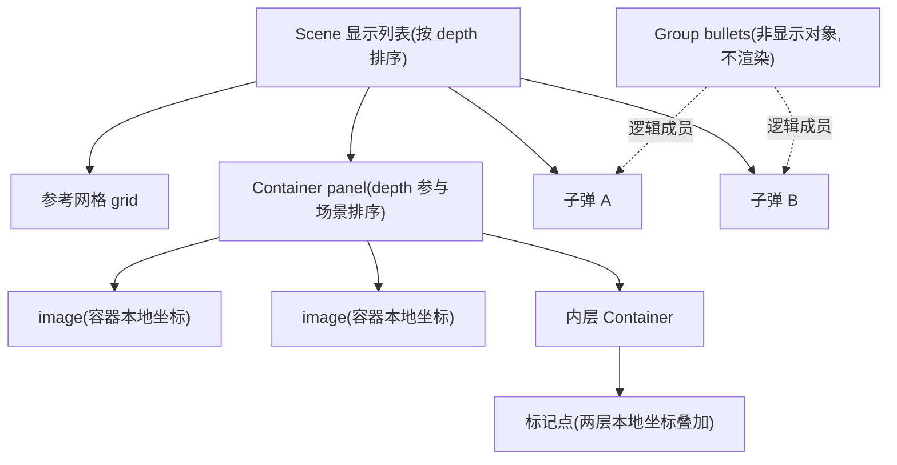

import { Canvas, Controls, Meta } from '@storybook/addon-docs/blocks';
import * as ContainersGroups from './containers-groups.stories';

<Meta of={ContainersGroups} name="Docs" />

# 容器与分组

对象一多,就需要"把它们当成一个整体来管"。Phaser 给了两个名字很像、职责完全不同的工具:**Container 是显示对象**,把子对象收进自己的变换树,父动子动、父隐子隐;**Group 不是显示对象**,只是成员对象的集合,负责批量创建、批量设值和对象池。本课建立一条主线判断:**要"跟随父级一起动"用 Container,要"逻辑上成批管理"用 Group,两者可以叠加**(同一批对象既在容器里,又在分组里)。显示对象本身的定位与变换见 [2.2.1 精灵与图像](?path=/docs/sprites--docs);深度排序细节见 [2.2.5 深度与视觉状态](?path=/docs/depth--docs)。

先看两者在场景里的位置关系——Container 站在渲染树里,Group 不在这棵树上,只是旁边的成员名册:



两者的关键事实对照(默认值与回查要点):

| 事实 | Container | Group |
| --- | --- | --- |
| 是什么 | 显示对象,渲染在场景里 | 非 显示对象,自己不渲染 |
| 成员容器 | `list`(有序数组,渲染顺序即数组顺序) | `children`(Set,只保证插入序遍历) |
| 创建 | `this.add.container(x?, y?, children?)` | `this.add.group(children?, config?)` |
| 加入成员 | `add` / `addAt(child, index = 0)` | `add(child, addToScene = false)` / `addMultiple` |
| 移除成员 | `remove` / `removeAt(index)` / `removeAll` | `remove(child, removeFromScene?, destroyChild?)` / `clear` |
| 成员数量 | `length`(只读) | `getLength()` |
| 成员坐标 | 子对象坐标是**容器本地坐标** | 成员坐标各自独立,就是世界坐标 |
| 父级变换 | x / y / rotation / scale / alpha 自动传播给子对象 | 不存在"父级变换",批量改动靠显式调用 `setX` / `setAlpha` 等 |
| 渲染顺序 | 按 `list` 数组顺序,子对象自身 `depth` 不参与排序 | 不管渲染;成员各自按场景 depth / 加入顺序渲染 |
| 成员归属 | 默认**排他**(`exclusive = true`):加入即从场景显示列表移除,`parentContainer` 指向容器 | 不改变成员归属:成员照常留在显示列表,一个对象可同时在多个 Group |
| 包围盒 | `getBounds()` = 全部子对象包围盒的并集矩形 | 没有 `getBounds` |
| 生成成员 | 无(子对象自己 `add.image` 再 `container.add`) | `create` / `createMultiple`(工厂 + 池) |

## 快速上手

两个最小闭环,各自回答"怎么用起来":

```ts
// 闭环一:Container——三个对象组成一个整体,父级一动全跟随
const panel = this.add.container(360, 200);      // 容器原点即本地 (0, 0)
const bg = this.add.image(0, 0, 'panel');         // 子对象用本地坐标:相对容器原点摆放
const icon = this.add.image(-40, 0, 'icon');
const label = this.add.text(10, -6, '背包');
panel.add([bg, icon, label]);                     // 加入即从场景显示列表移除(exclusive)
panel.setRotation(0.3).setAlpha(0.9);             // 子对象整体跟随旋转、变透明

// 闭环二:Group——一批同类对象的创建与批量设值
const enemies = this.add.group({
  classType: Phaser.GameObjects.Image,            // create() 用哪个类造对象,默认 Sprite
  defaultKey: 'enemy',                            // create() 缺省纹理
  maxSize: 20,                                    // 池上限,-1 不限
});
enemies.createMultiple({ key: 'enemy', quantity: 6, setXY: { x: 60, y: 80, stepX: 100 } });
enemies.setAlpha(0.75);                           // 批量设值:每个成员 alpha = 0.75
enemies.setDepth(5);                              // 批量深度:成员各自 depth = 5
```

一句话分辨:`panel` 自己会出现在画面上(带子对象一起),`enemies` 自己永远不可见,你看到的是它管理的六个成员。

## Container:变换承载

Container 是一个真正的显示对象:它实现了 Transform、AlphaSingle、Depth、Visible 组件,自己会出现在场景里——只是它没有纹理,画出来的是"把子对象按自己的变换整体渲染"。它对子对象做两件事:**接管渲染**(子对象从场景显示列表移除,由容器代为绘制)与**传播变换**(容器的 x / y / rotation / scale / alpha 自动作用于全部子对象)。

### 创建与增删子对象

```ts
// 三个参数都可省:container() 默认在 (0, 0),不预置子对象
const panel = this.add.container(360, 200, [bg, icon, label]);

panel.add(another);              // 追加到 list 末尾(渲染最上层)
panel.addAt(another, 0);         // 插到指定位置,原有子对象后移(index 默认 0)
panel.remove(icon);              // 移出容器:icon 回到场景显示列表顶层,parentContainer 置空
panel.removeAt(0);               // 按下标移出;两者都可传第二参 true 连同 destroy
panel.removeAll();               // 清空容器;removeBetween(1, 3) 按区间清
```

加入容器的那一刻发生三件事,这是理解 Container 的关键:

- 子对象从场景显示列表**移除**(`parentContainer` 指向容器)。默认排他(`exclusive = true`):一个对象不能同时属于两个容器,也不出现在场景显示列表;`remove` 则把它送回显示列表顶层。
- 子对象坐标语义切换为**容器本地坐标**(下一小节)。
- 容器接听子对象的销毁事件:子对象 `destroy()` 会自动从容器移除,不会留下悬空引用。

边界:`setExclusive(false)` 可解除排他,子对象可以被多个容器"复制渲染",但会失去输入事件与物理 body 支持,只用于特殊图形效果。往 Container 里 `add` 一个 Layer 会直接抛错。

顺序与检索类方法速查(都作用于 `list` 数组,`length` 是当前子对象数):

| 方法 | 用途 |
| --- | --- |
| `getAt(index)` / `getIndex(child)` / `exists(child)` | 按下标取 / 查下标 / 是否**直接**子对象(不递归嵌套层) |
| `bringToTop(child)` / `sendToBack(child)` | 置顶 / 垫底(改的是 list 顺序) |
| `moveUp(child)` / `moveDown(child)` / `swap(a, b)` | 上移一层 / 下移一层 / 交换两层 |
| `moveTo(child, index)` / `moveAbove(a, b)` / `moveBelow(a, b)` | 精确重排 |
| `reverse()` / `shuffle()` | 整体倒序 / Fisher-Yates 洗牌 |
| `sort('alpha')` | 按子对象某属性排序 |
| `getByName(name)` / `getFirst(prop, value)` / `getAll(...)` / `count(...)` | 按名 / 属性检索 |
| `setAll(prop, value)` / `each(fn)` / `iterate(fn)` | 批量设值 / 遍历(iterate 不防遍历中改列表) |
| `first` / `last` / `next` / `previous` | 游标式逐个访问 |

### 本地坐标与变换传播

子对象的 `x` / `y` 从加入容器起就是**本地坐标**:相对容器原点(即容器的 position)计算,官方建议把容器原点当作组合体的中心,子对象围绕 `0, 0` 正负摆放。容器自己的 `x` / `y` 是它在场景(或上层容器)里的坐标——两套坐标在渲染时叠加。

```ts
const panel = this.add.container(360, 200);   // 原点在场景 (360, 200)
panel.add(this.add.image(-40, 0, 'icon'));    // 本地 (-40, 0) → 渲染在世界 (320, 200)
panel.setRotation(0.5);                        // 整组绕 (360, 200) 转,子对象相对位置不变
panel.setScale(1.5);                           // 整组放大,子对象间距同步拉开 1.5 倍
panel.setAlpha(0.8);                           // 渲染时与每个子对象自身 alpha 相乘
```

容器没有可设置的 origin(`originX` / `originY` 是内部固定值,变换原点永远是本地 `0, 0`),也没有 flip——要翻转组合体用负 scale 或翻转每个子对象。

坐标换算最容易踩坑,四个入口的行为不同:

| 入口 | 坐标系 | 要点 |
| --- | --- | --- |
| `child.x / y` | 容器本地 | 不随父级变换变;分组模式下就是世界坐标 |
| `child.getBounds()` | 世界 | **自动包含**父容器及全部祖先的变换 |
| `child.getCenter(p)` / `getTopLeft(p)` 等派生点 | 本地 | 默认**不含**父容器;传第二参 `includeParent = true` 才换算到世界 |
| `container.pointToContainer(worldPoint)` | 世界 → 该容器本地 | 含全部嵌套祖先;做"点击命中容器内容"用它 |

下面是本课的对比实验台:三个半透明色块 + 一个嵌套标记点,Controls 改父级 x / 角度 / 缩放 / 透明度。默认「容器模式」验证本节结论;切到「分组模式」验证后文的职责差异。

<Canvas of={ContainersGroups.CompareLab} />
<Controls of={ContainersGroups.CompareLab} />

| 读者操作 | 可观察证据 |
| --- | --- |
| 初始加载(容器模式) | 三块围绕画布中心叠放,「黄块本地坐标」 `(0, 10)`;红框(黄块世界包围盒)中心 `(360, 212.5)`;白框嵌套点在 `(456, 150.5)` |
| 「父级横移」调到 120 | 三块 + 嵌套点整体右移两格,黄块本地坐标仍是 `(0, 10)`,红框中心变为 `(480, 212.5)` |
| 「父级角度」调到 90 | 整组绕画布中心(容器原点)顺时针转 90°,嵌套点白框从中心右上方转到右下方;黄块本地坐标不变 |
| 「父级缩放」调到 1.5 | 三块变大且彼此拉开 1.5 倍,`container.getBounds` 的 w / h 同步放大 |
| 「父级不透明度」调到 0.3 | 三块整体变淡(与子对象自身纹理透明度相乘),网格等场景对象不受影响 |
| 打开「子对象设不同 depth」 | 画面**毫无变化**,「画面最上层色块」仍是品红(list 顺序渲染,depth 不参与) |
| 「组织方式」切到 group | 三块回到初始摆位(独立成员,世界坐标);再调 x / 角度 / 缩放 / 透明度,一个像素都不动,readout 显示「Group 没有这些属性」 |
| 分组模式下打开「子对象设不同 depth」 | 叠放立即反转:蓝块(depth 3)盖到最上,「画面最上层色块」变蓝——成员在场景显示列表里,depth 生效 |
| 打开 Show code | 看到该 Canvas 实际执行的 `containers-vs-groups.ts` 全文 |

实例滚出视口或页面切到后台时会整体休眠以省资源,回到视口自动恢复;readout 冻结只说明循环暂停,不代表对象状态变化。

### 渲染顺序与嵌套

**容器内部按 `list` 数组顺序渲染:后加入的画在上面,子对象自身的 `depth` 不参与排序。**这是容器与顶层显示列表最大的规则差异——顶层对象按 depth 排序(见 [2.2.5 深度与视觉状态](?path=/docs/depth--docs)),容器内部只有列表顺序。要调整容器内的遮盖关系,用 `bringToTop` / `moveTo` / `addAt` 等列表操作;实验台里「子对象设不同 depth」在容器模式下毫无反应,切到分组模式立刻生效,就是这条规则的直接证据。容器自己有 `depth`,作为一个整体参与场景排序,但那是"整个容器 vs 场景里其他对象"的层级,管不到内部。

**容器可以嵌套,变换逐级传播。**内层容器既是外层的子对象,又是自己子对象的父级;`getBounds()` 沿链合并所有祖先矩阵,`pointToContainer()` 也会递归到最外层;实验台里的白框嵌套点藏在内层容器中,外层一动它跟着动。嵌套的代价是真实的:官方明确提示容器给每个子对象增加处理开销,嵌套越深开销越大(输入事件尤甚),并会让你失去容器内子对象的 depth 排序能力——**别为了"归类"而滥用容器**,归类交给 Group。

摄像机方面一句话:`container.setScrollFactor(x)` 默认只改容器自身,要传播给子对象需传第三参 `updateChildren = true`,详见 [2.5.1 摄像机控制](?path=/docs/camera-control--docs)。

## Group:逻辑组织

### 创建与批量生成

Group 是纯逻辑对象:不是显示对象、没有坐标与变换、自己不渲染,`this.add.group()` 只是"登记一本成员名册"。它的两个核心能力:**工厂**(批量创建成员)与**池**(以 `active` 标志循环复用)。成员照常留在场景显示列表里——分组不改变渲染归属,这正是"同一批对象既能在容器里、又能在分组里"的原因。

```ts
const enemies = this.add.group({
  classType: Phaser.GameObjects.Image, // get/create 用哪个类造对象,默认 Sprite
  defaultKey: 'enemy',                 // create() 缺省纹理
  maxSize: 20,                         // 池上限,-1 不限(默认)
  runChildUpdate: false,               // true 时组内成员的 update 会被调用
  createCallback: (member) => {},      // 每次有成员入组时回调
});
```

`GroupConfig` 其余字段:`name`(开发者自用,Phaser 永不填充)、`active`、`defaultFrame`、`removeCallback`、`createMultipleCallback`。已有对象入组用 `add(child, addToScene = false)` / `addMultiple(children, addToScene)`——注意 `addToScene` 默认 `false`:入组**不会**顺带把对象放进场景,要场景可见需自加或传 `true`。一个对象可以同时属于多个 Group(成员销毁时会自动从所有组移除)。

两类工厂:

```ts
// create:造一个,参数与 classType 构造签名一致;满员(isFull)时返回 null
const e1 = enemies.create(120, 80);            // 用 defaultKey 纹理
const e2 = enemies.create(200, 80, 'enemy', 0); // 指定纹理与帧

// createMultiple:一次造一批,key 必填(defaultKey 不生效)
enemies.createMultiple({
  key: 'enemy',
  quantity: 6,                                  // 总数也可由 repeat / frameQuantity 推出
  setXY: { x: 60, y: 80, stepX: 100 },          // 创建时套用 Actions.SetXY
  gridAlign: { width: 3, cellWidth: 96, cellHeight: 64 }, // 或网格对齐
});
```

`createMultiple` 的数量公式是 `key 数 × frame 数 × frameQuantity × (yoyo ? 2 : 1) × (1 + repeat)`,`quantity` 直接覆盖 `frameQuantity`;`max` 非零时封顶。`randomKey` / `randomFrame` / `yoyo` 控制纹理与帧的组合方式,`setScale` / `setAlpha` / `setDepth` / `setRotation` 等子对象可在创建时一并初始化。

> Phaser 4 变化:3.x 的 `Group.getClosestTo` / `getFurthestFrom`(按距离找最近 / 最远成员)在 Phaser 4 中已移除。等价做法是 `group.getChildren()` 自己按 `Phaser.Math.Distance.Between` 排序。

### 批量操作与成员检索

批量操作是"一次性把值写进每个成员自身",不是建立持续绑定——这一点与容器的变换传播本质不同:

```ts
enemies.setAlpha(0.75);            // 每个成员 alpha = 0.75(成员自身属性被改写)
enemies.setDepth(5, 1);            // 每个成员 depth = 5,步进 1:5, 6, 7, ...
enemies.incX(10);                  // 每个成员 x += 10
enemies.angle(5);                  // 每个成员 angle += 5(度)
enemies.rotate(0.1);               // 每个成员 rotation += 0.1(弧度)
enemies.setVisible(false);         // 全部隐藏;toggleVisible() 全部翻转
enemies.propertyValueSet('scale', 2, 0.5); // 任意数值属性:2, 2.5, 3, ...
```

成员检索按"状态 + 位置"两个维度:

| 方法 | 检索什么 |
| --- | --- |
| `getChildren()` / `getLength()` / `contains(child)` | 全体成员(数组快照)/ 数量 / 是否在组 |
| `getMatching(prop, value)` | 按属性严格相等筛成员 |
| `getFirst(state)` / `getLast(state)` / `getFirstNth(n, state)` | 第一个 / 最后一个 / 第 n 个 `active === state` 的成员 |
| `get(x, y)` | 第一个 `active === false` 的成员并赋值 x / y,没有则 create(池入口) |
| `getFirstAlive(...)` / `getFirstDead(...)` | 第一个 active 为 true / false 的成员 |
| `countActive(value)` / `getTotalUsed()` / `getTotalFree()` | 计数:active 匹配数 / active 数 / `maxSize - active` |
| `isFull()` | 成员**总数**(不是 active 数)是否已达 `maxSize` |

对象池的闭环是 `get()` 取、`killAndHide()` 还:`get(x, y)` 优先取回 inactive 成员并赋新坐标(是否重新激活由你决定,通常紧跟 `setActive(true).setVisible(true)`),找不到才走 create;`killAndHide(member)` 把成员 `setActive(false)` + `setVisible(false)` 归还池。`kill(member)` 只失活不隐藏。批量播放组内成员动画用 `playAnimation(key)`,动画本身的创建与控制见 [2.3.1 帧动画](?path=/docs/frame-animations--docs);给整组挂物理 body 与碰撞属于物理分组(`this.physics.add.group(...)`),见 [3.1 Arcade 物理](?path=/docs/arcade-physics--docs)。

下面的对象池实验台验证这条闭环:

<Canvas of={ContainersGroups.PoolLab} />
<Controls of={ContainersGroups.PoolLab} />

| 读者操作 | 可观察证据 |
| --- | --- |
| 初始加载(发射 + 回收都开) | 子弹从底部持续升起,`children 总数` 缓慢爬升后稳定;「最近一次发射」在「新建」与「复用」间切换 |
| 等子弹飞出画面 | `active` 回落、`inactive` 上升,`getTotalFree` 恢复——子弹被 killAndHide 归还 |
| 关闭「飞出回收」 | 子弹飞出后保持 active,`active` 一路爬到 12,`getTotalFree` 归零,`isFull` 变 true |
| 池满后继续观察 | 画面不再出现新子弹,「最近一次发射」显示「池满,create 返回 null」 |
| 重新打开「飞出回收」 | 停在画面外的子弹在下一帧被回收,`active` 立刻掉到 0,发射恢复 |
| 关闭「持续发射」 | 停止取弹,已飞出的子弹继续独立飞行(运动写在成员自身,不依赖组) |
| 打开 Show code | 看到该 Canvas 实际执行的 `group-pool.ts` 全文 |

## Container 与 Group 的取舍

选型只问一个问题:**改动是"成批跟随"还是"成批施加"?**

- **要一个父级,之后所有的动、转、缩放、变透明都自动跟随** → Container。UI 面板、组合角色部件、弹窗、需整体 `getBounds()` 的复合体。代价:子对象离开显示列表(失去 depth 排序与独立渲染归属),每个子对象都有变换叠加开销。
- **要一个名册,批量造、批量设值、按状态检索、循环复用** → Group。敌群、子弹池、收集品。成员保持独立:坐标就是世界坐标、depth 照常生效、可同时在多个组。代价:没有"父级"概念,`group.setX(100)` 是把每个成员都设成 100,而不是"整体挪到 100";想让一组成员"围绕某点整体旋转"必须自己算每个成员的新坐标。
- **两者叠加是常态**:角色部件装进 Container 做整体变换,所有 Container(或独立敌人)再进 Group 做池化管理与批量操作——容器管视觉层级,分组管逻辑组织,职责不冲突。

横向证据就用上面的对比实验台:同一批色块、同一组 Controls,容器模式父动子动,分组模式纹丝不动;`childDepth` 一开,容器内毫无反应、显示列表里立刻重排——两条规则差异一张实验台全部覆盖。另外,`Phaser.Actions` 系列(`GridAlign` / `PlaceOnCircle` / `Angle` / `SetXY` 等)吃任意对象数组:容器传 `container.list`,分组传 `group.getChildren()`,两边都能做批量布局。

## 最佳实践

- **按职责选工具,不按对象数量。**"这些对象要一起动"才上 Container;只是"这批同类对象要统一管理"用 Group。两者叠加不受限;只因为对象多就把它们塞进容器,是白付变换开销还丢掉 depth 排序。
- **容器内定位围绕本地 `(0, 0)` 正负摆放,别继承世界坐标。**组合体的"中心"就是容器原点;子对象用小数值本地坐标,容器再用 x / y 摆进世界。把原来的世界坐标直接当本地坐标用,画面会整体偏移一个容器位置。
- **容器内改遮盖顺序用列表操作,顶层才用 depth。**`bringToTop` / `moveTo` / `addAt` 是容器内的顺序语言;子对象 `setDepth` 在容器内无效。需要 depth 排序的对象(如大量动态 y-sort 的角色)留在显示列表顶层,或先看 [2.2.5 深度与视觉状态](?path=/docs/depth--docs) 的排序方案再决定要不要装容器。
- **池化三件套:`maxSize` 限容、`get()` 取、`killAndHide()` 还。**运行时反复 create / destroy 是最常见的卡顿来源;池成员只做 active / visible 翻转,数量爬到 maxSize 后终身复用。判断池是否还有余量用 `getTotalFree()`(active 口径),判断"还能不能造新的"用 `isFull()`(总成员口径)。
- **嵌套容器控制在两三层内,输入密集的 UI 慎用深嵌套。**每层嵌套给每个子对象叠加矩阵计算,输入事件的代价随深度上涨;官方建议围绕"少用容器"组织结构,而不是"多用容器归堆"。

## 常见问题

- **对象 `container.add()` 之后"消失"了。**
  排他语义把子对象从场景显示列表移除了,渲染改由容器负责;对象如果落在容器本地坐标远离原点的位置,或容器本身还在 `(0, 0)`,画面上就找不到了。用 `container.getBounds()` 查整组实际位置,或临时 `container.add(this.add.rectangle(...))` 圈出原点。
- **子对象加入容器后位置整体偏了一截。**
  它的 `x` / `y` 已是容器本地坐标:渲染位置 = 容器 position + 本地坐标(再叠旋转缩放)。要么把子对象坐标改成本地小坐标,要么把容器放在 `(0, 0)` 让本地坐标暂时等于世界坐标(不推荐,旋转缩放的原点会跑掉)。
- **容器里 `setDepth` 没有任何反应。**
  容器内部按 list 顺序渲染,子对象 depth 不参与;用 `bringToTop` / `sendToBack` / `moveTo` / `addAt` 调整。depth 只对容器自身(相对场景其他对象)和不在容器里的对象生效。
- **`child.getCenter()` 读数和画面上的位置对不上。**
  派生点方法默认返回**本地坐标**,不含父容器变换;传第二参 `includeParent = true`,或直接用 `getBounds()`(自动含全部祖先)。
- **给 Group 设置 `group.x = 100` 或 `group.setAlpha(0.5)` 报错 / 无效。**
  Group 不是显示对象,没有这些属性;批量等价物是 `setX(100)`、`setAlpha(0.5)` 等组方法,且语义是"把每个成员都设成该值"。想让成员围绕某点整体旋转,没有现成入口,需按成员逐个计算(或改用 Container)。
- **`group.get()` 有时返回 null。**
  池里没有 inactive 成员且 `isFull()`(成员总数达 `maxSize`)时,create 路径返回 null。检查是否有成员飞出后忘了 `killAndHide` 回收;或在调用处判空。
- **同一个对象加进两个容器,第二个 `add` 看起来"抢走"了它。**
  默认排他:加入新容器会自动从原容器移除(`parentContainer` 改指)。确实需要一处对象多处渲染时用 `setExclusive(false)`,但成员会失去输入与物理支持。

## 总结回顾

摘要:

Container 是显示对象:子对象加入后从场景显示列表移除(默认排他,`exclusive = true`),坐标切换为容器本地坐标,渲染由容器按 `list` 数组顺序代为完成;容器的 x / y / rotation / scale / alpha 自动传播给全部子对象,alpha 在渲染时与子对象相乘,嵌套时逐级传播。世界坐标换算里 `child.getBounds()` 自动含父链,`getCenter()` 等派生点默认不含(需 `includeParent`),`pointToContainer()` 把世界点换算进容器本地;容器内排序只认列表顺序(`bringToTop` / `moveTo` / `addAt`),子对象 depth 无效,`getBounds()` 是全部子对象包围盒的并集。Group 不是显示对象:成员照常留在显示列表、可同属多组,它提供工厂(`create` / `createMultiple` 配 `classType` / `defaultKey`)、批量设值(`setX` / `setAlpha` / `setDepth` 等,一次性写值非持续绑定)与对象池(`get()` 取回 inactive 成员、`killAndHide()` 归还、`maxSize` 限容、`isFull` 按总数 / `getTotalFree` 按 active)。选型:跟随变换用容器,逻辑成批管理用分组,两者可叠加;Phaser 4 移除了 `getClosestTo` / `getFurthestFrom`,按距离检索需自行排序。

一句话:

> Container 把子对象接进自己的变换树,父动子动;Group 只是一份成员名册,批量造、批量改、按状态取还——组织视觉层级用前者,组织逻辑与池用后者。

知识要点:

- `add.container` 与 `add.group` 各创建什么?两者的成员容器分别是什么数据结构、有序性如何?
- 子对象加入容器时发生哪三件事?`exclusive` 默认值是什么,`setExclusive(false)` 失去什么?
- 子对象的 `x` / `y` 在容器内是什么坐标系?容器 alpha 如何作用到子对象?
- `child.getBounds()` 与 `child.getCenter()` 在包含父容器变换上有什么差异?世界点换算进容器用哪个方法?
- 容器内部按什么顺序渲染?子对象 `setDepth` 在容器内为什么无效?该用什么调整遮盖顺序?
- `group.create` / `createMultiple` 的关键配置有哪些?`get()` 的取用顺序是什么?
- `killAndHide` 做了什么?`isFull` 与 `getTotalFree` 的统计口径差在哪?
- "整体旋转一组成员"为什么 Group 做不到,Container 可以?

## 参考资料

- [Phaser 官方文档](https://docs.phaser.io/):`GameObjects.Container` 与 `GameObjects.Group` 及 `Types.GameObjects.Group.GroupConfig` / `GroupCreateConfig` 的 API 核对。
- [官方示例库](https://phaser.io/examples/):Game Object 类目下 Container 与 Group 的嵌套、变换、批量创建、对象池可运行示例。
- [Phaser 4 Labs 示例浏览器](https://labs.phaser.io/phaser4-index.html):Phaser 4 专用示例,按主题检索容器与分组用法。
