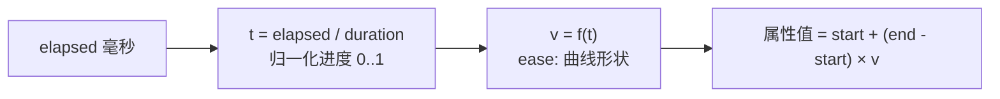

import { Canvas, Controls, Meta } from '@storybook/addon-docs/blocks';
import * as Easing from './easing.stories';

<Meta of={Easing} name="Docs" />

# 缓动

缓动(easing)决定补间「怎么走」:同样的 `duration`,属性可以匀速走完,也可以先慢后快、冲过终点再弹回来。数学上它只是一个函数——把归一化进度 `t`(0..1)做非线性映射得到缓动值 `v = f(t)`,再由插值公式换算成属性值。补间的 `ease` 参数接受 EaseMap 字符串(如 `'Cubic.easeOut'`)、`Phaser.Math.Easing` 里的现成函数,或任何自写的 `(v: number) => number`。本课聚焦 ease 这一维度:曲线的数学定位、各缓动家族的视觉差异、字符串的解析规则,以及参数化缓动(`Stepped` 阶梯、`Back` 过冲、`Elastic` 弹簧)与自定义函数。补间 API 本体(duration / repeat / yoyo / 事件)见 [2.3.2 补间](?path=/docs/tweens--docs),本课把它们当作固定输入。



关键默认值与回查要点(以下经 phaser@4.2.1 类型与源码核实):

| 输入 / 概念 | 默认值 / 规则 | 回查要点 |
| --- | --- | --- |
| tween 的 `ease` | `'Power0'` | 即 Linear 恒等映射;不写 ease 就是匀速 |
| `ease` 接受的类型 | 字符串 \| 函数 | 字符串走 EaseMap 解析;函数直接每帧调用 |
| 裸家族名 `'Cubic'` | 解析为 `.Out` 变体 | `'Cubic'` = `'Cubic.easeOut'`;`'Stepped'` 例外,指向 Stepped 函数本身 |
| `Power0` – `Power4` | Linear / 二至五次方 `.Out` | `Power1`=Quad.Out、`Power2`=Cubic.Out、`Power3`=Quart.Out、`Power4`=Quint.Out |
| 简写 `'cubic.out'` | 等价 `'Cubic.easeOut'` | 方向 `in` / `out` / `inout` 不分大小写;家族首字母会被大写 |
| 无法解析的字符串 | 静默回退 `Power0` | 不报警告——拼写错误表现为「匀速直线」,见常见问题 |
| `easeParams` | `undefined`(不转发) | 数组,每次调用追加传给缓动函数 |
| `Stepped` 的 `steps` | `1` | `easeParams: [steps]`;`1` 时 0..1 之间恒为 1(一步跳到底) |
| `Back` 的 `overshoot` | `1.70158` | 过冲幅度;输出会越过 1(或低于 0),补间不裁剪 |
| `Elastic` 的 `amplitude` / `period` | `0.1` / `0.1` | 弹簧振幅与松紧;输出最高约 1.7 |
| `Phaser.Math.Easing` 命名空间 | 全名单词 | `Quadratic` / `Circular` / `Quartic` / `Quintic`;字符串短名 `Quad` / `Circ` 只存在于 EaseMap |

## 快速上手

最小闭环:同一组 `targets` 与 `duration`,只换 `ease` 一个字符串,运动手感立刻不同。

```ts
this.tweens.add({
  targets: ball,
  x: 600,                    // 起点取创建时的 x,终点 600
  duration: 1000,            // 横轴总长:毫秒
  ease: 'Cubic.easeOut',     // 曲线形状:快速出发,越接近终点越慢
});
```

换成 `'Back.easeOut'` 会冲过 600 再弹回来;换成 `'Stepped'`(配 `easeParams: [4]`)会分四格跳过去;传函数 `ease: (v) => v * v` 则完全由你的公式决定。下面两节讲清这条曲线到底在哪里起作用、所有可选曲线长什么样。

## 缓动是什么:进度到值的映射

补间每一帧的更新链只有三步(以 phaser@4.2.1 源码 `TweenData.js` 为准):

1. **归一化进度:**`t = clamp(elapsed / duration, 0, 1)`。`elapsed` 是本程已播放的毫秒,`duration` 是单程时长;`yoyo` 折返程内每帧用 `1 - t` 传入缓动,所以回程把同一条曲线反过来走。
2. **曲线映射:**`v = ease(t)`。ease 就是 `v = f(t)`:输入 0..1,输出通常也在 0..1 附近——`f(0) = 0`、`f(1) = 1` 是约定,保证动画从起点出发、到终点收尾;中间的形状决定节奏。Linear 是恒等 `f(t) = t`(匀速);`Cubic.Out` 是 `1 - (1-t)³`(先快后慢)。
3. **线性插值:**`属性值 = start + (end - start) × v`。v 是「走完了全程的百分之多少」,再按起点终点展开成真实属性值。

三个直接推论:

- **duration 管横轴,ease 管形状,两者正交。**改 duration 不改曲线形状,只改走完曲线的时间;改 ease 不改总时长,只改时间分配。
- **曲线值可以出界。**`Back` / `Elastic` 的 `f(t)` 会超过 1 或低于 0,插值出的属性值同样越过终点甚至起点;补间不做裁剪,值域敏感的属性(如 alpha 的 0..1)要注意回落位置。
- **每条属性补间各自持有一个 ease。**`ease` 写在顶层作用于全部属性,写成每属性对象 `{ value, ease }` 则单独覆盖——这是 2.3.2 已讲过的属性级配置,在本课视角下就是「每条插值曲线独立」。

下面的曲线画廊把这条数学链摆到眼前:左侧用 Graphics 画出当前 `f(t)` 的完整图像(0..1 网格,超出框的部分是曲线真实的出界段);右侧四条水平轨道上的点全部用**同一条缓动**驱动,只是依次错开启动,肉眼对照「曲线形状 ↔ 运动节奏」;曲线上的亮点与第一条轨道同步,readout 报告它此刻的 `t` 与 `f(t)`。

<Canvas of={Easing.CurveGallery} />
<Controls of={Easing.CurveGallery} />

| 读者操作 | 可观察证据 |
| --- | --- |
| 切换「缓动家族」 | 曲线整条换形;四条轨道的节奏同步改变——如 Sine 家族全程柔和,Expo 家族两端近乎停顿、中段疾冲 |
| 切到 back 或 elastic | 曲线画出框外:back 的 Out 尾部冲过 1 再回落,elastic 的 Out 在收尾大幅振荡(In 变体移到开头);轨道点同样冲过终点弹回——出界是真实的,不是画图误差 |
| 切到 bounce | 曲线呈三段递减的弹跳波形,Out 变体下轨道点像落地弹跳般逐步逼近终点 |
| 切换「变体」 | 同一家族三种相位:easeIn 慢起快收(曲线贴着底边)、easeOut 快起慢收(曲线贴着顶边)、easeInOut 两端缓中段快(S 形) |
| 拖「时长」 | 曲线不变,四条轨道整体变慢 / 变快——duration 与 ease 正交的直接证据 |
| 观察 readout | 「当前 t」匀速增长(它是 elapsed/duration),「缓动值 f(t)」按曲线忽快忽慢——两者分离就是缓动的全部含义 |
| 打开 Show code | 看到该 Canvas 实际执行的 `curve-gallery.ts` 全文 |

实例滚出视口或页面切到后台时会整体休眠以省资源,回到视口自动恢复。

## 缓动家族

`Phaser.Math.Easing` 下共十个家族加两个独立函数(家族 = 有 In / InOut / Out 三个变体的命名空间;Linear 与 Stepped 是独立函数,Linear 无变体可言,Stepped 自带 steps 参数):

| 家族(字符串短名) | 命名空间全名 | 曲线性格 | 典型用途 |
| --- | --- | --- | --- |
| `Linear` | `Easing.Linear` | 恒等直线,匀速 | 机械运动、进度条、与 `Power0` 同义 |
| `Quad` | `Easing.Quadratic` | 二次方,轻微加速 / 减速 | 默认级 UI 微动效,最含蓄的一档 |
| `Cubic` | `Easing.Cubic` | 三次方,标准缓动 | 通用入场出场;`Power2` 同曲线 |
| `Quart` | `Easing.Quartic` | 四次方,两端更陡 | 需要更明确的「起步 / 刹车」感 |
| `Quint` | `Easing.Quintic` | 五次方,五档中最强 | 强调性动效;`Power4` 同曲线 |
| `Sine` | `Easing.Sine` | 正弦,最圆润柔和 | 淡入淡出、呼吸、镜头缓移 |
| `Expo` | `Easing.Expo` | 指数,两端近乎停顿 | 戏剧化急速切换、UI 滑入 |
| `Circ` | `Easing.Circular` | 圆弧,介于 Cubic 与 Expo | 干脆的加减速,无弹性副作用 |
| `Back` | `Easing.Back` | 先回拉 / 后过冲 | 弹性感入场(`Back.easeOut` 最常用) |
| `Elastic` | `Easing.Elastic` | 弹簧振荡,大幅越过边界 | 活泼的强调动效,慎用于位移大的场景 |
| `Bounce` | `Easing.Bounce` | 落地弹跳,三段递减 | 球体落地、分数跳动的「重量感」 |
| `Stepped`(独立函数) | `Easing.Stepped` | 阶梯,离散跳变 | 像素风、逐格步进、血条扣血 |
| —— | `Power0` – `Power4` | EaseMap 别名 | `Power1..4` = Quad..Quint 的 `.Out` |

横向规律:Quad → Cubic → Quart → Quint 是同一形状(幂函数)逐级加陡,选择时先定「要几档力量」;Sine / Circ / Expo 是「柔和 → 顿挫 → 极端」的另一条轴;Back / Elastic / Bounce 引入越界与振荡,带来物理感但也最抢戏。变体决定相位:

- **easeIn:**`f(t)` 贴底——慢启动,越来越快。适合「离场」:加速消失。
- **easeOut:**`f(t)` 贴顶——快启动,减速停靠。适合「入场」:元素快速出现后柔和就位,最常用。
- **easeInOut:**S 形——两端缓、中段快。适合位移、镜头等「从这里到那里」的全程动效。

参数化家族在调用时收第二个及以后的参数(默认值见开场参考表):`Back.In(v, overshoot)`、`Elastic.Out(v, amplitude, period)`、`Stepped(v, steps)`。在 tween 里不能直接给 `ease: 'Back.easeOut'` 传参——字符串只解析出函数本身,参数要走 `easeParams: [2.2]` 数组,每次调用转发。

## ease 的写法与解析

`ease` 接受三种形态,殊途同归——最终都是一个每帧被调用的 `(v: number) => number`:

```ts
// 形态一:字符串(EaseMap 键或简写)
this.tweens.add({ targets: ball, x: 600, ease: 'Cubic.easeOut' });
this.tweens.add({ targets: ball, x: 600, ease: 'cubic.out' });   // 等价简写
this.tweens.add({ targets: ball, x: 600, ease: 'Cubic' });       // 裸家族名 = .Out

// 形态二:现成函数引用(命名空间是全名单词)
this.tweens.add({ targets: ball, x: 600, ease: Phaser.Math.Easing.Cubic.Out });

// 形态三:自写函数 —— 任何 (v: number) => number
this.tweens.add({ targets: ball, x: 600, ease: (v) => v * v * (3 - 2 * v) });

// 参数化缓动:字符串 + easeParams 转发
this.tweens.add({
  targets: ball,
  x: 600,
  ease: 'Stepped',
  easeParams: [4],          // Stepped(v, 4):四格阶梯
});
```

字符串的解析规则(`Phaser.Tweens.Builders.GetEaseFunction` 源码):

1. **精确匹配 EaseMap 键**:`'Power2'`、`'Quad.easeIn'`、`'Bounce.easeInOut'`、`'Stepped'` 等直接命中。完整键表:每个家族的 `easeIn` / `easeOut` / `easeInOut` 三键、裸家族名(指向 `.Out`,Linear 与 Stepped 指向自身)、`Power0`–`Power4`。
2. **未命中才做简写改写**:按 `.` 切开,方向 `in` / `out` / `inout`(不分大小写)改写成 `easeIn` / `easeOut` / `easeInOut`,家族首字母大写,再查一次——所以 `'quad.in'`、`'SINE.out'` 的方向都能解析(家族名本身其余字母须与键一致)。
3. **仍不命中则静默回退 `Power0`**(Linear):不抛错、不警告,动画变成匀速直线。
4. **传函数则直接采用**;配 `easeParams` 时返回一个包装函数,把 `v` 与参数一起转发——`GetEaseFunction('Back.easeOut', [2.5])` 也可以在补间之外单独调用,用来取函数、预览或复用。

下面的实例把三种形态放进同一个画布:Stepped 走「字符串 + `easeParams`」的真实转发路径,custom 直接传自写的 smoothstep 函数,Linear 作匀速参照。

<Canvas of={Easing.SteppedCustom} />
<Controls of={Easing.SteppedCustom} />

| 读者操作 | 可观察证据 |
| --- | --- |
| 保持「Stepped 阶梯」拖「阶梯数」 | 曲线变成 N 格楼梯,轨道点逐格瞬移;readout「所在档」按 `((steps×t)|0)+1 / steps` 跳档——跳变发生在每格**开头**,第一帧之后 v 就不在 0 上 |
| 「阶梯数」拖到 1 | 曲线只剩一步:0..1 区间恒为 1,轨道点启动即瞬移到终点再等 yoyo——steps=1 等于瞬移的证据 |
| 切到「自定义函数」 | smoothstep 的 S 形曲线,两端平缓、中段较陡;「ease 写法」readout 显示 `ease: (v) => v * v * (3 - 2 * v)`,函数形态直接生效,无需任何注册 |
| 切到「Linear 匀速对照」 | 曲线与灰色的 Linear 参考对角线完全重合;轨道点匀速往返 |
| 观察「当前 t」与「缓动值 f(t)」 | Stepped 模式下 t 匀速增长而 f(t) 长时间不动、整档跳变——阶梯就是「进度连续、输出离散」 |
| 打开 Show code | 看到该 Canvas 实际执行的 `stepped-custom.ts` 全文 |

## 最佳实践

- **入场 easeOut,离场 easeIn,位移 easeInOut。**这是多数 UI 动效的默认选择;幂函数档位(Quad 到 Quint)定力量,一般 Cubic 起步,需要更「刹得住」再升档。
- **物理感家族控制戏份。**Back / Elastic / Bounce 视觉强烈,一处画面只用一个;大面积同时弹跳会互相打架。位移大时 Elastic 的越界会明显冲出目标区域,改用 Back 或 Bounce 更可控。
- **像素风与离散进度用 Stepped + easeParams。**`ease: 'Stepped', easeParams: [steps]`;steps 要与语义档位一致(血条 10 格、步进移动 8 格),别用 steps = 1(0..1 区间恒为 1,一步到底,等于瞬移)。
- **自定义函数优先写纯函数。**`(v) => ...` 每帧每属性都会调用,别在里面做查找或分配;两端尽量满足 `f(0)=0`、`f(1)=1`,否则动画会从半路开始或停在半路。
- **怀疑曲线没生效时,先核对字符串拼写。**解析失败是静默的:拼写错误、大小写不一致、家族名不在表里,统统回退匀速。快速自检:把同一段动效的 ease 临时改成 `'Linear'`,若与原效果一模一样,基本可判定原字符串未命中。

## 常见问题

- **写完 ease 动画还是匀速直线。**
  字符串没有命中 EaseMap 且简写改写也失败,静默回退 `Power0`。检查拼写与大小写:`'Cubic.easyOut'`(拼错)、`'circ.out'`(家族名其余字母须是 `Circ` 而非小写全词——`'circ'` 改写后是 `'Circ'`,可命中;但 `'circular.out'` 改写成 `'Circular'` 后不在键表,回退)。注意 `'quad.in'` 合法而 `'QUAD.in'` 不合法(只大写首字母,其余须原样)。
- **字符串 `'Circ.easeOut'` 能用,代码里 `Phaser.Math.Easing.Circ` 却不存在。**
  命名空间用全名单词:`Easing.Circular`、`Easing.Quadratic`、`Easing.Quartic`、`Easing.Quintic`;短名 `Circ` / `Quad` / `Quart` / `Quint` 只是 EaseMap 的字符串键。混用两套写法时按这张对照翻译。
- **`easeParams` 传了参数,曲线没变化。**
  两个常见原因:目标函数不是参数化家族——Sine、Cubic 等只收 `v`,多余参数被静默忽略;或字符串未命中已回退 Linear,参数自然无从生效。参数化家族只有 Stepped(steps)、Back(overshoot)、Elastic(amplitude、period)三个。
- **Elastic / Back 动画把 alpha 补成负数或超过 1。**
  缓动值出界是数学事实,插值不裁剪;alpha 这类值域受限的属性在振荡段会写出界。给显示层留回落余量,或对敏感属性改用不出界的家族(Quad 到 Circ),或自写 `f` 后手动 clamp。
- **Stepped 动画一步就到底,没有阶梯感。**
  `steps` 默认 `1`,此时 `(0,1)` 区间输出恒为 1。必须 `easeParams: [steps]` 给出档数;另外 Stepped 的跳变发生在每格**开头**(`(((steps*v)|0)+1)/steps`),第一帧之后就不在 0 上,做逐格对齐时要按这个相位取整。

## 总结回顾

摘要:

补间的缓动是一个 `v = f(t)` 函数:每帧由 `elapsed / duration` 得到归一化进度 `t`(yoyo 折返程用 `1 - t`),经 `f` 映射为缓动值,再按 `start + (end - start) × v` 插值;duration 管横轴、ease 管形状,两者正交。tween 的 `ease` 默认 `'Power0'`(Linear 匀速),接受字符串、函数引用或自写 `(v) => number`;字符串先精确匹配 EaseMap(家族 × easeIn/easeOut/easeInOut、裸家族名 = `.Out`、`Power0`–`Power4` 别名),未命中再做 `.` 简写改写(`'quad.in'` → `'Quad.easeIn'`),仍不命中静默回退 Linear。十个家族中 Quad→Quint 是幂次逐陡的同形曲线,Sine/Circ/Expo 是柔和到极端的加减速轴,Back/Elastic/Bounce 带来越界与物理感;Stepped 是独立函数,配 `easeParams: [steps]` 输出离散阶梯,跳变发生在每格开头。命名空间用全名单词(Quadratic/Circular),短名只在字符串键里。参数化缓动的附加参数一律走 `easeParams` 数组转发,也可用 `GetEaseFunction(ease, easeParams)` 在补间外取函数。

一句话:

> duration 决定横轴多长,ease 决定曲线怎么弯——缓动就是把匀速的进度 t 弯成你想要的节奏 v = f(t)。

知识要点:

- 缓动函数在补间更新链的哪一步介入?`t`、`v`、最终属性值三者的换算公式是什么?
- yoyo 折返程里传入 ease 的进度是什么?为什么说回程「把同一条曲线反过来走」?
- tween 不写 `ease` 时用什么曲线?`Power1`–`Power4` 分别等价于哪些家族的哪个变体?
- 字符串 ease 的解析分几步?未命中时的行为是什么,怎么快速自检?
- 裸家族名 `'Cubic'` 解析到什么?`'Stepped'` 为什么是例外?
- 缓动家族按曲线性格怎么分组?easeIn / easeOut / easeInOut 各适合什么场景?
- Back / Elastic 的参数叫什么、默认值多少、通过什么途径传给 tween?
- Stepped 的输出公式是什么?跳变发生在每格的开头还是结尾?steps = 1 是什么效果?
- 字符串短名与 `Phaser.Math.Easing` 命名空间在命名上有哪些不一致?

## 参考资料

- [Phaser 官方文档](https://docs.phaser.io/):`Phaser.Math.Easing` 各家族、`Types.Tweens.TweenBuilderConfig` 的 `ease` / `easeParams` 与 `Phaser.Tweens.Builders.GetEaseFunction` 的 API 核对。
- [官方示例库](https://phaser.io/examples/):Tweens 与 Easing 类目下各缓动曲线的可运行示例。
- [Phaser 4 Labs 示例浏览器](https://labs.phaser.io/phaser4-index.html):Phaser 4 专用示例,按主题检索缓动用法。
- [phaserjs/phaser 仓库](https://github.com/phaserjs/phaser):`src/math/easing/EaseMap.js`、`src/tweens/builders/GetEaseFunction.js`、`src/tweens/tween/TweenData.js` 源码,本文键表、解析规则、默认值与插值链以 phaser@4.2.1 源码核实。
