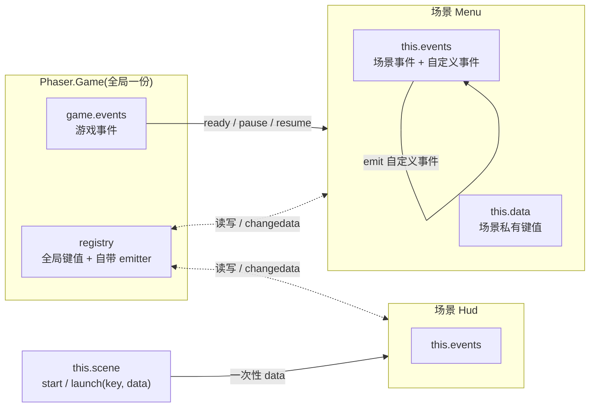

import { Canvas, Controls, Meta } from '@storybook/addon-docs/blocks';
import * as Events from './events.stories';

<Meta of={Events} name="Docs" />

# 事件与场景通信

Phaser 内建一套发布/订阅模型:游戏里几乎所有可通信的部件——`Phaser.Game`、每个 `Phaser.Scene`、显示对象、加载器、输入系统——都自带一个 `Phaser.Events.EventEmitter`,同一套 `on` / `emit` / `off` API。本课讲清三件事:EventEmitter 本身的用法;两条事件总线(`this.events` 场景事件、`game.events` 游戏事件)上各有哪些事件、何时发出、参数是什么;以及场景之间怎么传数据——`start(key, data)` 启动参数、`this.registry` 全局键值、`this.data` 场景私有键值三条通道各管什么。



| 通信入口 | 是什么 | 事件常量 | 典型用途 |
| --- | --- | --- | --- |
| `this.events` | 场景的 EventEmitter | `Phaser.Scenes.Events` | 生命周期、每帧、场景内自定义事件 |
| `game.events` | 游戏的 EventEmitter | `Phaser.Core.Events` | 全局 ready、页面可见性、每帧统计 |
| `this.registry`(= `game.registry`) | 游戏级 DataManager | `Phaser.Data.Events`(发在 `registry.events`) | 跨场景共享:分数、设置 |
| `this.data` | 场景私有 DataManagerPlugin | `Phaser.Data.Events`(发在 `this.events`) | 场景内组件解耦 |
| `this.scene.start(key, data)` | 启动时的第二参数 | 无(不是事件) | 切换/并行启动时一次性交接 |

## 快速上手

最小闭环:场景里 `emit` 一个自定义事件,再用 `on` 接住它。事件名随意,参数随 `emit` 透传。

```ts
import Phaser from 'phaser';

class MainScene extends Phaser.Scene {
  private score = 0;

  constructor() {
    super({ key: 'Main' });
  }

  create() {
    // 监听自定义事件:this.events 就是本场景的 EventEmitter
    this.events.on('score-change', (delta: number) => {
      this.score += delta;
      console.log('当前分数', this.score);
    });

    // 发射事件:参数原样到达监听器
    this.events.emit('score-change', 10); // 当前分数 10
    this.events.emit('score-change', 5); // 当前分数 15
  }
}

new Phaser.Game({
  type: Phaser.AUTO,
  width: 720,
  height: 405,
  backgroundColor: '#141a26',
  scene: [MainScene],
});
```

打开控制台能看到两次输出。这一套 `on` / `emit` / `off` 也适用于 `game.events`、显示对象和 Phaser 的各个子系统——学一次,处处可用。

## EventEmitter

`Phaser.Events.EventEmitter` 是 Phaser 全家共用的发布/订阅实现。每个自带 emitter 的对象用法完全一致:注册监听器,等事件到达,不再需要时移除。`emit` 是**同步调用**——`emit(...)` 返回前,所有匹配的监听器已经执行完;没有监听器时 `emit` 返回 `false`,不报错。

| 方法 | 作用 | 返回 |
| --- | --- | --- |
| `on(event, fn, context?)` | 注册监听器,`context` 作为回调里的 `this` | `this`(可链式) |
| `addListener(...)` | `on` 的别名 | `this` |
| `once(event, fn, context?)` | 注册一次性监听器,触发一次后自动移除 | `this` |
| `emit(event, ...args)` | 同步调用该事件的全部监听器,`args` 原样透传 | `boolean`(是否有监听器) |
| `off(event, fn?, context?, once?)` | 移除监听器;不传 `fn` 则移除该事件全部监听 | `this` |
| `removeListener(...)` | `off` 的别名 | `this` |
| `removeAllListeners(event?)` | 清空指定事件或全部监听 | `this` |
| `listenerCount(event)` / `listeners(event)` / `eventNames()` | 查询监听器数量 / 列表 / 事件名 | 数值 / 数组 |

事件名是普通字符串(或 symbol),同一个 emitter 上自定义事件与系统事件共用一个命名空间——避免与内置事件名(如 `'update'`、`'shutdown'`)撞名。

下面的实例把 `emit` 的同步调用过程变成可见日志:场景注册一个 `on` 监听和一个 `once` 监听,每加一「发射次数」就 `emit` 一次带参数的自定义事件;日志的先后顺序就是执行顺序——`on` / `once` 先收到,`emit` 的返回值最后才记录。

<Canvas of={Events.CustomEvents} />
<Controls of={Events.CustomEvents} />

| 读者操作 | 可观察证据 |
| --- | --- |
| 「发射次数」加一 | 日志先出现 `on 收到` 与 `once 收到`(带同一参数),再出现 `emit 返回 true`;金币闪动一次 |
| 第一次发射后再加一 | `on 收到` 继续累加,`once 收到` 停在 1——`once` 触发后自动移除,`listenerCount` 从 2 变 1 |
| 选「off 移除 on」 | `listenerCount` 变 0 或 1(视 once 是否已触发);此后 emit 时 `on 收到` 不再增长 |
| 选「removeAllListeners」后再发射 | `listenerCount` 为 0,日志只有 `emit 返回 false(无监听)`,金币不再闪动 |

### on / once / emit

`on(event, fn, context)`:同一事件可以注册多个监听器,按注册顺序依次调用。`context` 改变回调里的 `this`,之后 `off` 时要传**同一个 context** 才能匹配上。`emit` 的参数数量不限、原样透传,监听器签名自己负责对应:

```ts
this.events.on('collect-coin', (payload: { n: number }) => { /* ... */ }, this);
this.events.emit('collect-coin', { n: 1 }); // 参数就是一个对象
```

`once` 适合"只等一次"的场景:首次进入决赛、第一次加载完成、只消费一次的开场引导。它触发后自动移除,不需要手动 `off`。

### off 与移除

`off` 按"函数引用 + context + once 标志"精确匹配。要移除 `on` 注册的方法监听,必须传同一个函数引用——类方法或存到字段里的箭头函数都可以,内联函数做不到。不传 `fn` 时 `off(event)` 移除该事件的全部监听,`removeAllListeners()` 连事件带监听一起清空:

```ts
// 注册与移除必须用同一个引用
this.events.on('tick', this.handleTick, this);
this.events.off('tick', this.handleTick, this);
```

移除时机与场景生命周期相关:`this.events` 上的监听器**跨 shutdown 保留**(场景可能再次启动),场景 `destroy` 时才全部清空。因此重复启动的场景里把 `on` 写进 `create` 会叠加注册,监听自己场景之外的 emitter(`registry.events`、`game.events`、别的场景)更要在 shutdown 时手动摘除——这两条都是高频坑,详见「常见问题」。

## 场景事件

每个场景的 `this.events` 是一条场景私有总线,`Phaser.Scenes.Events` 命名空间里是全部事件名常量(值即表中小写字符串,代码里直接写字符串也有效)。高频事件按帧发出,低频事件跟随生命周期:

| 事件 | 监听器参数 | 何时发出 |
| --- | --- | --- |
| `boot` | `(sys)` | 场景注册进游戏时,每实例仅一次 |
| `start` | `(sys)` | 每次启动流程开始,主要给插件用 |
| `ready` | `(sys, data)` | `start` 之后、`init` 之前,业务代码推荐入口 |
| `create` | `(scene)` | `create` 方法执行完之后 |
| `preupdate` / `update` / `postupdate` | `(time, delta)` | 每帧一组,顺序如下;场景须 active |
| `prerender` / `render` | `(renderer)` | 渲染前后;场景须 visible |
| `pause` / `resume` | `(sys, data)` | `pause()` / `resume()` 生效时,`data` 是调用第二参数 |
| `sleep` / `wake` | `(sys, data)` | `sleep()` / `wake()` 生效时 |
| `shutdown` | `(sys, data)` | 停止/切换场景,显示列表即将清空 |
| `destroy` | `(sys)` | 场景被 `remove`,不可再启动 |
| `transitionstart` / `transitioninit` / `transitionout` / `transitioncomplete` / `transitionwake` | 各不相同 | 场景过渡(`scene.transition`)期间,本课不展开 |

两条顺序值得记住:

- **启动顺序**:`start → ready → init() 方法 → create() 方法 → create 事件`。`start` / `ready` 在 `init` **之前**发出,所以想在第一时间挂监听,注册点要早于 `init`(见「常见问题」第 3 条)。
- **每帧顺序**:`preupdate → update 事件 → update 方法 → postupdate → prerender → render`。`update` 事件与 `update` 方法是同一时刻的两个入口,二选一即可。

下面的实例把低频事件记成日志、`update` 事件单独计数。场景本身**没有 `update` 方法**——`update` 事件帧号照样增长,证明事件与方法是并行的两个入口;`stop` 后计数冻结,`start` 重启时 `start → ready → create` 重走一遍而 `boot` 不再出现。

<Canvas of={Events.SceneEvents} />
<Controls of={Events.SceneEvents} />

| 读者操作 | 可观察证据 |
| --- | --- |
| 初始加载 | 日志为 `boot → start → ready → create`,`update` 事件帧号持续增长 |
| 选「暂停 pause」 | 日志追加 `pause(reason=来自控件)`,`data` 参数就是 `pause()` 的第二参数;update 帧号冻结 |
| 暂停后选「恢复 resume」 | 日志追加 `resume(reason=来自控件)`,帧号继续增长 |
| 选「停止 stop」 | 日志追加 `shutdown`,帧号冻结;场景内容清空 |
| 停止后选「重新启动 start」 | 日志追加 `start → ready → create`,update 帧号从冻结处继续累计(实例复用,字段未清);`boot` 不再出现(每实例一次) |

## 游戏事件

`game.events` 是游戏级总线(`Phaser.Core.Events`),在场景之外也能用——`this.game.events` 从任意场景访问。它回答两类问题:游戏实例自身何时就绪/销毁,浏览器页面何时失去可见性。

| 事件 | 监听器参数 | 何时发出 |
| --- | --- | --- |
| `boot` | 无 | 游戏完成引导,全局系统开始建立 |
| `ready` | 无 | 一切就绪、开始运行前,全局初始化的推荐入口 |
| `hidden` / `visible` | 无 | 页面标签页隐藏 / 重新可见 |
| `blur` / `focus` | 无 | 窗口失焦 / 聚焦 |
| `pause` / `resume` | `resume` 带 `pauseDuration`(毫秒) | 页面隐藏触发自动暂停 / 恢复运行 |
| `prestep` / `step` / `poststep` | `(time, delta)` | 每帧主循环各阶段 |
| `prerender` / `postrender` | `(renderer, time, delta)` | 每帧渲染前后 |
| `destroy` | 无 | `game.destroy()` |
| `contextlost` | 无 | WebGL 上下文丢失,渲染器停摆 |

最常用的一个是 `ready`:做与单个场景无关的一次性初始化时挂它,比在首个场景的 `create` 里写更稳——不依赖"哪个场景第一个启动"。

```ts
const game = new Phaser.Game(config);

game.events.once('ready', () => {
  console.log('游戏就绪,当前场景:', game.scene.getScenes(true));
});
```

页面可见性(`hidden` / `pause` / `resume`)是浏览器切标签页时自动触发的:Phaser 检测到页面隐藏会让主循环休眠并发 `pause`,回到前台发 `resume` 并带上停摆时长。适合在这里暂停音乐或对时间敏感的逻辑。切标签页无法在 Storybook 实例里稳定复现,正文不配 Canvas;要亲手验证,在「快速上手」的代码里加一行 `game.events.on('pause', () => console.log('自动暂停'))`,然后切换标签页即可。

## 场景间传数据

三条通道各有分工,先按问题选通道,再写代码:

| 问题 | 通道 | 特征 |
| --- | --- | --- |
| 切换/启动场景时交接一次参数 | `this.scene.start(key, data)` / `launch(key, data)` | 一次性,随生命周期进入 `init(data)` / `create(data)` |
| 任意时刻、任意场景读写的全局状态 | `this.registry`(即 `game.registry`) | 游戏级键值,变化沿 `changedata` 事件通知 |
| 场景内部组件之间解耦的私有状态 | `this.data` | 场景级键值,事件发在本场景 `this.events` 上 |

下面的实例同时演示三条通道:`Menu` 场景常驻,`Hud` 场景按需启动。「分数」写入 registry(注意它与 Hud 是否运行无关);「场景操作」演示 `start`(让位切换)与 `launch`(并行叠加)如何把 data 送进 `Hud.init`,以及停止后重新启动。

<Canvas of={Events.SceneData} />
<Controls of={Events.SceneData} />

| 读者操作 | 可观察证据 |
| --- | --- |
| 拖动「分数」 | `registry score` 读数立即变化;`Menu` 画面同步(Hud 未运行,它的画面不动)——registry 全局即时生效 |
| 选「launch 并行并传 data」 | `Menu 状态` 保持 RUNNING,`Hud` 从 PENDING 进入 RUNNING;`Hud init data` 读数出现 `{score, level}`,日志记录 `Hud init 收到 data` |
| Hud 运行中再拖「分数」 | 日志出现 `registry changedata → Hud scene.data changedata` 链条,Hud 画面分数同步 |
| 选「start 切换并传 data」 | `Menu 状态` 变 SHUTDOWN(画面清空),Hud 完整启动并收到此刻的 data——`start` 对发起场景是让位 |
| 选「stop 停止 Hud」 | Hud 状态变 SHUTDOWN;`Hud data score` 读数仍保留(见 scene.data 一节);再 launch 又从头启动 |

### 启动参数

`this.scene.start(key, data)` 与 `this.scene.launch(key, data)` 的第二参数会成为目标场景的 `settings.data`,先后交给 `init(data)` 与 `create(data)`,之后仍可用 `this.sys.getData()` 取回。`restart(data)` / `run(key, data)` 同理。数据是一次性交接,目标场景收到后自己决定存哪:

```ts
// 发起方:带着本关数据切换
this.scene.start('GameScene', { level: 3, seed: 12345 });

// 接收方:init 拿到同一份对象
init(data: { level: number; seed: number }) {
  this.level = data.level;
  this.rng = new Phaser.Math.RandomDataGenerator([String(data.seed)]);
}
```

两个细节:`data` 不传时不会覆盖目标场景已有的 `settings.data`;参数对象是引用传递,接收方修改会波及发起方持有的对象,交接后尽量只读。

### registry

`this.registry` 就是 `game.registry`:一个游戏级的 `Phaser.Data.DataManager`,所有场景共用同一实例。分数、通关进度、音量设置这类"任何场景都可能读写的状态"放这里:

```ts
this.registry.set('score', 100); // 任意场景写入
this.registry.get('score'); // 任意场景读取
this.registry.inc('score', 10); // 数值键便捷自增(不存在则从 0 建)
this.registry.values.score += 5; // 直接访问也合法,同样发 changedata
```

变化通知是 registry 的核心价值:它自带一个独立 emitter(`registry.events`,不在 `game.events` 上),首次 `set` 发 `setdata`,修改已有键发 `changedata`,删除发 `removedata`:

```ts
// 任何场景都能监听全局分数变化
this.registry.events.on('changedata', (parent, key, value, previous) => {
  if (key === 'score') this.scoreText.setText(String(value));
});
```

监听 registry 是"监听别人的 emitter":场景 shutdown 不会自动摘除它,必须在 `shutdown` 事件里 `off`,否则场景停止后监听器仍在(见「常见问题」第 2 条)。

### scene.data

`this.data` 是场景私有的 DataManagerPlugin,API 与 registry 完全一致(`get` / `set` / `inc` / `toggle` / `merge` / `remove` / `has` / `values`),适合"本场景内多个组件要共享、但别的场景不该碰"的状态——比如 HUD 各部件共用的本关血量。区别在通知出口:**scene.data 的 `setdata` / `changedata` 直接发在本场景的 `this.events` 上**(不是独立的 `this.data.events`),所以用熟悉的方式接:

```ts
// 场景内任意位置写
this.data.set('hp', 5);

// 同一场景内监听;也可以只听某个键:'changedata-hp'
this.events.on('changedata', (parent, key, value) => {
  if (key === 'hp') this.hpText.setText(`HP ${value}`);
});
```

两个容易忽略的事实:键首次创建发 `setdata`、修改才发 `changedata`(想两个都接就分别注册);scene.data 的内容**跨 shutdown 保留**,场景 `destroy` 才清空——上面范例里 `stop 停止 Hud` 后 `Hud data score` 读数仍在,就是这条机制的直接证据,不要把它当作"每次启动都是干净状态"。

## 最佳实践

- **通知用事件,状态用数据。** "发生了什么"(捡到硬币、倒计时结束)用 `emit` 广播,不带持久状态;"现在是什么"(分数、血量、音量)写进 data/registry,订阅者读当下值。把状态塞进事件参数,后加入的监听器就永远错过了。
- **按通道选型,不混用。** 一次性交接用 `start(key, data)`;全局共享用 registry;场景内组件解耦用 `this.data`;别在 scene.data 里存全局状态再手工同步到各场景。
- **监听别人的 emitter,配对自己的清理。** registry、game.events、其他场景的 events 不会随你的场景 shutdown 自动摘除监听器——注册处成对写 `this.events.once('shutdown', () => ...off(...))`。
- **重复启动的场景,监听注册点前移。** `this.events` 的监听器跨 shutdown 保留,`create` 里 `on` 会叠加;每实例一次的监听放构造函数(经 `this.sys.events`)或用 `once`。
- **高频事件里别分配。** `update` / `preupdate` 每帧执行,闭包、临时对象会加重 GC;监听器引用用稳定字段,既省内存也方便 `off`。
- **`update` 事件与 `update` 方法二选一。** 两者每帧都会触发,同一份逐帧逻辑不要两边重复写;事件形式适合插件式挂载,方法形式适合主逻辑。

## 常见问题

- **场景重启后,同一个事件的回调执行了两次甚至多次。**
  `create` 里 `this.events.on(...)` 每次启动都会注册一遍,而 shutdown 不清场景自身 events 的监听器。把"每实例一次"的监听移到构造函数(`this.sys.events`,与注入后的 `this.events` 同一实例),或在注册前 `off` 一次。
- **场景已经 stop,里面注册的 registry 监听还在触发,画面出现"幽灵更新"。**
  registry 是游戏级对象,你的场景停止不会带走挂在 `registry.events` 上的监听器,下次启动又叠加一份。在 `this.events.once('shutdown', ...)` 里成对 `off`;对 `game.events`、其他场景的 events 同理。
- **在 `init` / `create` 里注册,却收不到 `start` / `ready` 事件。**
  启动顺序是 `start → ready → init() → create()`,`start` / `ready` 在你的方法之前就发完了。想捕获每次启动的这两个事件,在构造函数里用 `this.sys.events.on(...)` 注册(注入前唯一可用入口);`create` 事件在 `create()` 之后发出,`create` 里注册来得及。
- **`emit` 之后监听器没收到,也没报错。**
  先确认总线挂对了:场景生命周期/自定义事件在 `this.events`,游戏级事件在 `game.events`,registry 变化在 `this.registry.events`,scene.data 变化在本场景 `this.events`。再核对事件名字符串——`changedata-<key>` 是连写(如 `'changedata-score'`)。
- **对已运行的场景 `launch`,没有出现两层并行画面。**
  `launch` 对正在运行的场景等于"先 shutdown 再带 data 重启",不会叠加第二份实例。需要确认目标状态时先 `this.scene.isActive(key)` 判断;真正的并行层保持运行即可,不必重复 launch。
- **`start(key, data)` 传的参数,目标场景读出来是 `undefined`。**
  data 只进入 `init(data)` / `create(data)` / `this.sys.getData()`;读取时机太早(构造函数、模块顶层)拿不到——data 要到 `init` 才到位。另外确认没有把 data 传错位置(签名是 `start(key, data)`,data 是第二参数)。

## 总结回顾

摘要:

Phaser 的通信建立在统一的 `Phaser.Events.EventEmitter` 上:`on` / `once` 注册、`emit` 同步分发、`off` 按引用精确移除,`this.events`(场景事件)与 `game.events`(游戏事件)是两条互不串扰的总线,前者承载 `start → ready → create` 的启动顺序与 `preupdate → update → postupdate` 的每帧顺序,后者承载全局 `ready` 与页面可见性。跨场景传数据按问题选通道:一次性交接走 `start(key, data)` 进入目标场景的 `init` / `create`;全局状态走 `registry`(自带 `registry.events` 的 `setdata` / `changedata` 通知);场景内私有状态走 `this.data`(事件直接发在本场景 `this.events` 上)。监听别人的 emitter 或在重复启动的场景里注册,都要注意 shutdown 不清 `this.events` 监听器这一机制。

一句话:

> 事件回答"谁在何时被通知",数据回答"状态放在谁能读到的地方"——先选对通道,再写监听与清理。

知识要点:

- `on` / `once` / `emit` / `off` / `removeAllListeners` 各自的行为与返回值是什么?
- 场景的启动事件顺序是怎样的,`start` / `ready` 为什么在 `init` 之前?
- `update` 事件与 `update` 方法的关系是什么?每帧事件组的顺序呢?
- `game.events` 上有哪些事件?页面隐藏时自动触发了什么?
- `start(key, data)` 的 data 从哪里读?registry 与 scene.data 的事件分别发在哪个 emitter 上?
- shutdown 时哪些监听器会被清除,哪些不会?"幽灵更新"和重复注册怎么排查?

## 参考资料

- [Phaser 官方文档](https://docs.phaser.io/)
- [Phaser 4 API:Phaser.Events.EventEmitter](https://docs.phaser.io/api-documentation/class/events-eventemitter)
- [Phaser 4 API:Phaser.Data.DataManager(registry 与 scene.data 的共同基类)](https://docs.phaser.io/api-documentation/class/data-datamanager)
- [Phaser 4 API:Phaser.Scenes.Systems(场景事件的发出方)](https://docs.phaser.io/api-documentation/class/scenes-systems)
- [Phaser 4 API:Phaser.Scenes.ScenePlugin(start / launch 传递 data)](https://docs.phaser.io/api-documentation/class/scenes-sceneplugin)
- [官方示例库(按 event / scene 类目检索可运行示例)](https://phaser.io/examples)
- [Phaser 4 Labs 示例浏览器](https://labs.phaser.io/phaser4-index.html)
