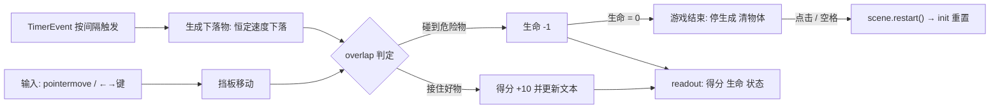

import { Canvas, Controls, Meta } from '@storybook/addon-docs/blocks';
import * as FirstGame from './first-game.stories';

<Meta of={FirstGame} name="Docs" />

# 第一个小游戏

本课是一节整合课:把前四课的安装、Game config、场景生命周期与事件整合起来,再对尚未开讲的主题(物理、输入、计时器、文本)做够用的最小使用,拼出第一个完整可玩的游戏——「接住下落物」。玩法:移动指针或按 `←`/`→` 操控挡板,接住黄色圆形得 10 分,碰到红色方块扣 1 条生命,3 条生命耗尽游戏结束,点击画布或按空格重开。本课的重心不是某个新 API,而是「一个最小可玩的游戏由哪几块构成、每块代码放在哪个生命周期方法里」——这五块拼上,闭环就成立,之后任何 Phaser 游戏都是在这五块上加厚。



五块部件各用到的最小 API 与负责深入讲解的后续课程:

| 部件 | 本课最小实现 | 深入课程 |
| --- | --- | --- |
| 素材 | `Graphics` + `generateTexture` 程序生成纹理 | [2.1.1 资源加载器](?path=/docs/asset-loader--docs)、[2.2.2 图形绘制](?path=/docs/graphics--docs) |
| 输入(挡板) | `pointermove` 事件 + `createCursorKeys()` | [2.4.1 键盘](?path=/docs/keyboard-input--docs)、[2.4.2 指针与交互](?path=/docs/pointer-input--docs) |
| 生成节奏 | `time.addEvent` 循环 `TimerEvent` | [2.3.4 时钟与计时器](?path=/docs/timers--docs) |
| 下落运动 | Arcade 物理 `setVelocityY` 恒定速度 | [3.1 Arcade 物理](?path=/docs/arcade-physics--docs) |
| 接住判定 | `physics.add.overlap` 回调 | [3.2 Arcade 碰撞](?path=/docs/arcade-collision--docs) |
| 得分与生命 | `add.text` + `setText` | [2.2.3 文本](?path=/docs/text--docs) |
| 状态与重开 | `scene.restart()` + `init` 重置 | [1.3 场景生命周期](?path=/docs/scene-lifecycle--docs) |

## 快速上手

先把游戏玩起来,再回头拆解它是怎么搭的。下面是本课工作区内真实的 Phaser 4 实例:「下落速度」控制下落物的恒定速度(px/s),「生成间隔」控制新下落物出现的密度(ms),两个参数运行中随时调整、立即生效。

<Canvas of={FirstGame.CatchGame} />
<Controls of={FirstGame.CatchGame} />

| 读者操作 | 可观察证据 |
| --- | --- |
| 初始加载 | 得分 0、剩余生命 3、游戏状态 `playing`;下落物按默认难度出现并下落 |
| 移动指针或按 `←`/`→` | 挡板跟随移动;接住黄色圆形,得分 +10 并同步到 readout |
| 挡板碰到红色方块 | 剩余生命 -1,该方块消失 |
| 连续碰到 3 个方块 | 游戏状态变 `over`,场上物体清零,画面中央出现重开提示 |
| 点击画布或按空格 | 得分归 0、生命回 3、状态回 `playing`,重新开始下落 |
| 调大「下落速度」 | 已在场上的物体立即加速下落 |
| 调小「生成间隔」 | 新物体出现更密,「场上物体」读数随之升高 |
| 打开 Show code | 看到该 Canvas 实际执行的 `catch-game.ts` 全文 |

实例滚出视口或页面切到后台时会整体休眠以省资源,回到视口自动恢复;readout 冻结只说明循环暂停,不代表游戏状态变化。

## 游戏闭环

任何最小可玩的游戏都由五块部件构成,本课的实现一一对应:

- **素材**——挡板、好物、危险物三张纹理,`Graphics` 画完用 `generateTexture` 烘焙,不依赖外部文件。
- **输入**——读指针与键盘,驱动挡板这一唯一可控对象。
- **生成**——一个循环 `TimerEvent` 按间隔产出下落物,把「难度」变成参数。
- **运动与判定**——下落物以恒定速度下落,`overlap` 判定与挡板相遇,回调里按纹理分好坏、加分扣命。
- **状态**——`playing` / `over` 两个状态与得分、生命,生命归零进 `over`,重开走 `scene.restart()`。

五块部件的代码严格按生命周期方法归位,这正是 [1.3 场景生命周期](?path=/docs/scene-lifecycle--docs)建立的职责分工在本课的落地:

| 生命周期方法 | 放什么 |
| --- | --- |
| `init()` | 逐轮状态归零:得分、生命、游戏状态(场景实例被 restart 复用,不重置就会带脏值) |
| `preload()` | `makeTextures()` 生成纹理,让素材在 `create` 前就绪 |
| `create()` | 创建挡板、物理组、HUD 文本;注册 `overlap`、生成定时器、指针与键盘监听 |
| `update()` | 键盘读键改挡板速度;下落物出界回收;节流上报 readout |

游戏状态机只有两条边:`playing` 下生命归零进入 `over`(`spawner.remove()` 停生成、`items.clear(true, true)` 清场);`over` 下点击或空格触发 `scene.restart()`,实例复用、`init` 重置、显示列表重建。

## 搭建步骤

以下五步按依赖顺序搭建,正文只节选各步的关键片段;完整可运行代码就是上面实例的 `catch-game.ts`(Show code 可见全文)。

### 自包含纹理

没有美术素材时,用 `Graphics` 现画现烘:`generateTexture(key, w, h)` 把画好的图形烘焙成以 `key` 命名的普通纹理,之后 `add.image` / `group.create` 像使用加载的图片一样使用它。

```ts
preload() {
  const good = this.make.graphics();
  good.fillStyle(0xfacc15, 1);
  good.fillCircle(14, 14, 14);
  good.generateTexture('good', 28, 28); // 烘焙后 good.destroy() 释放画笔
  good.destroy();
}
```

放在 `preload()` 是为了与真实资源同一条时间线:纹理在 `create` 之前就绪。真实项目里素材来自图片、图集文件,走 `this.load.*` 加载管线,见 [2.1.1 资源加载器](?path=/docs/asset-loader--docs);Graphics 本身的绘制能力见 [2.2.2 图形绘制](?path=/docs/graphics--docs)。

### 挡板与输入

挡板是一个 Arcade 物理对象,`setImmovable(true)` 让它被撞时纹丝不动。两套输入并存:指针直设坐标,键盘用速度驱动,后触发者生效。

```ts
this.paddle = this.physics.add
  .image(GAME_WIDTH / 2, GAME_HEIGHT - 36, 'paddle')
  .setImmovable(true);

// 指针跟随:worldX 已换算到世界坐标,并夹在边界内
this.input.on('pointermove', (pointer: Phaser.Input.Pointer) => {
  this.paddle.x = Phaser.Math.Clamp(pointer.worldX, 60, GAME_WIDTH - 60);
});

// 键盘:cursorKeys 是持续轮询的按键状态对象,在 update 里逐帧读取
this.cursors = this.input.keyboard?.createCursorKeys();
```

```ts
override update() {
  if (this.cursors.left.isDown) {
    this.paddle.setVelocityX(-PADDLE_SPEED); // 速度驱动,物理每帧推进
  } else if (this.cursors.right.isDown) {
    this.paddle.setVelocityX(PADDLE_SPEED);
  } else {
    this.paddle.setVelocityX(0);
  }
}
```

直接改 `x` 与用 `setVelocityX` 可以混用:Arcade 动态体的位置每帧从游戏对象同步。事件与轮询的取舍、指针的完整能力见 [2.4.1 键盘](?path=/docs/keyboard-input--docs)与 [2.4.2 指针与交互](?path=/docs/pointer-input--docs)。

### 下落物与生成

下落物统一放进一个物理组,`allowGravity: false` 关掉重力,每个物体用恒定速度下落——「下落速度」这个难度参数因此能直接映射成 `setVelocityY`。

```ts
// game config:启用 Arcade;重力设 0,下落节奏完全由参数控制
physics: { default: 'arcade', arcade: { gravity: { x: 0, y: 0 } } }

this.items = this.physics.add.group({ allowGravity: false });

// 循环 TimerEvent:生成节奏本身就是难度参数
this.spawner = this.time.addEvent({
  delay: this.difficulty.spawnDelay,
  loop: true,
  callback: this.spawnItem,
  callbackScope: this,
});
```

```ts
private spawnItem() {
  const key = Math.random() < 0.3 ? 'bad' : 'good';
  const x = Phaser.Math.Between(36, GAME_WIDTH - 36);
  const item = this.items.create(x, -18, key) as Phaser.Physics.Arcade.Image;
  item.setVelocityY(this.difficulty.fallSpeed);
}
```

漏接不扣分:物体落出屏幕下沿后在 `update` 里销毁。想要自然加速的坠落感就改用重力驱动(配置 `gravity.y` 后不设速度),见 [3.1 Arcade 物理](?path=/docs/arcade-physics--docs);定时器的暂停、时间缩放等能力见 [2.3.4 时钟与计时器](?path=/docs/timers--docs)。

### 判定与计分

接住判定用 `overlap` 而不是 `collide`:`overlap` 只检测相交并触发回调,不产生物理推挤,适合「接住 / 捡到 / 命中」这类触发式交互。

```ts
this.physics.add.overlap(this.paddle, this.items, this.handleCatch, undefined, this);
```

```ts
private handleCatch: Phaser.Types.Physics.Arcade.ArcadePhysicsCallback = (
  _paddle,
  item,
) => {
  const caught = item as Phaser.Physics.Arcade.Image;
  if (caught.texture.key === 'good') {
    this.score += 10; // 好物:得分并刷新 HUD
  } else {
    this.lives -= 1;  // 危险物:扣生命,归零即结束
  }
  caught.destroy();    // 回调里销毁被接住的对象是安全模式
  this.refreshHud();   // setText 更新,不重建 Text
};
```

回调两个参数与注册时 `object1` / `object2` 的顺序对应;用官方回调类型声明字段,参数类型自动推断为并集。得分与生命显示在两个 `Text` 上,只在数值变化时 `setText`。`collider` 的推挤、分组碰撞与调试渲染见 [3.2 Arcade 碰撞](?path=/docs/arcade-collision--docs),文本样式细节见 [2.2.3 文本](?path=/docs/text--docs)。

### 结束与重开

游戏结束是「停生成、清场面、给重开入口」三件事;重开交给 `scene.restart()`,逐轮状态在 `init` 归零。

```ts
private gameOver() {
  this.state = 'over';
  this.spawner?.remove();          // 停掉循环定时器
  this.items?.clear(true, true);   // 移出场景并销毁全部下落物
  this.input.once('pointerdown', this.requestRestart, this);
  this.input.keyboard?.once('keydown-SPACE', this.requestRestart, this);
}

private requestRestart() {
  if (this.state === 'over') {
    this.scene.restart(); // 实例复用:init 重走,显示列表重建
  }
}
```

两个执行要点都来自 [1.3 场景生命周期](?path=/docs/scene-lifecycle--docs):场景实例被 `restart` 复用,所以得分、生命、状态必须在 `init` 显式归零,否则带着上一局的脏值开局;`shutdown` 自动清空显示列表、场景定时器与场景内输入监听,所以重开监听用 `once` 注册在 `gameOver` 里即可,不需要手动摘除。

## 最佳实践

- **难度集中成参数对象。** 把下落速度、生成间隔、好坏比例收进一个 `difficulty` 对象并暴露统一的更新入口,Controls 或关卡表改一处生效;散落的魔数在调难度时会漏改。注意 `TimerEvent.delay` 是只读的,运行时改间隔要 `remove()` 后按新 `delay` 重建。
- **逐轮状态全部在 `init` 重置。** 场景实例跨 `restart` 复用,`constructor` 只放跨轮保留的常量;凡「每轮应为初始值」的字段都在 `init` 赋值,这是重开不脏档的唯一保证。
- **运动方式按手感选。** 接物类游戏要可控节奏,恒定速度(`allowGravity: false` + `setVelocityY`)最直观;要自然加速的坠落感用重力(`gravity.y`),难度改用初速度或重力系数表达,见 [3.1 Arcade 物理](?path=/docs/arcade-physics--docs)。
- **HUD 事件驱动更新。** 得分、生命只在变化时 `setText`,不要在 `update` 里无条件刷新;每帧重建 `Text` 对象更是大忌,见 [6.1.1 性能优化](?path=/docs/performance--docs)。
- **低频生成直接 `destroy`,高频生成再考虑复用。** 本课每秒生成一两个物体,出界即 `destroy` 足够;每帧大量生消时改用 `group.get()` 复用死亡对象(对象池),见 [6.1.1 性能优化](?path=/docs/performance--docs)。

## 常见问题

- **挡板被下落物撞得移动或弹开。**
  挡板没设 `setImmovable(true)`,动态体之间会互相推挤。挡板、地面这类「只参与判定、不受力」的对象都要设 immovable;若连推挤都不想要,用 `overlap` 代替 `collide`,见 [3.2 Arcade 碰撞](?path=/docs/arcade-collision--docs)。
- **`this.physics` 是 `undefined`,报 `Cannot read properties of undefined`。**
  game config 没配 `physics: { default: 'arcade' }`,物理插件没有注入场景。本课只在 config 里配一次,每个场景的 `this.physics` 就绪可用,见 [3.1 Arcade 物理](?path=/docs/arcade-physics--docs)。
- **指针控制挡板,画面滚动后位置对不上。**
  `pointer.x` 是屏幕坐标,相机滚动后要用 `pointer.worldX`(世界坐标)。本课相机不动、两者恰好相等,但写成 `worldX` 才在滚动相机下依然正确,见 [2.4.2 指针与交互](?path=/docs/pointer-input--docs)。
- **`restart()` 重开后,得分还是上一局的值。**
  场景实例被复用,`shutdown` 不清实例字段。把逐轮状态放进 `init` 显式归零,`create` 只做创建;这是「实例复用」机制的固定代价,见 [1.3 场景生命周期](?path=/docs/scene-lifecycle--docs)。
- **改了「生成间隔」参数,物体出现节奏没变。**
  `TimerEvent.delay` 是只读属性,直接赋值无效。正确做法是 `spawner.remove()` 后用新 `delay` 重新 `time.addEvent`,范例的 `updateDifficulty` 就是这么做的。

## 总结回顾

摘要:

一个最小可玩的游戏由素材、输入、生成、运动与判定、状态五块部件构成:Graphics 烘焙出自包含纹理;指针与键盘双输入驱动 immovable 挡板;循环 TimerEvent 按间隔从物理组生成下落物,恒定速度下落;`overlap` 回调按纹理分好坏,加分扣命并 `setText` 刷新 HUD;生命归零进入结束态,停定时器、清场面,点击或空格走 `scene.restart()`,逐轮状态由 `init` 归零。五块代码严格落在 `init` / `preload` / `create` / `update` 各自的职责里,难度集中成参数对象、定时器只读所以运行时重建——这套骨架可以直接往任何方向加厚。

一句话:

> 五块部件各就各位放在正确的生命周期方法里,一个完整可玩的游戏闭环就成立了。

知识要点:

- 最小可玩游戏的五块部件分别是什么、各自的最小实现用了哪些 API?
- 挡板为什么要 `setImmovable(true)`,判定为什么选 `overlap` 而不是 `collide`?
- 指针控制该读 `pointer.x` 还是 `pointer.worldX`,区别在哪里?
- 「下落速度」与「生成间隔」两个难度参数分别如何作用?运行时改间隔为什么必须重建 TimerEvent?
- 重开游戏走什么方法?得分、生命这些逐轮状态为什么必须放在 `init` 重置?

## 参考资料

- [Phaser 官方文档](https://docs.phaser.io/):`Phaser.Types.Core.PhysicsConfig`、`TimerEvent`、`Factory.overlap`、`Group` 等 API 核对。
- [官方示例库](https://phaser.io/examples/):完整小游戏与输入、物理类目下的可运行示例。
- [Phaser 4 Labs 示例浏览器](https://labs.phaser.io/phaser4-index.html):Phaser 4 专用示例,按主题检索小游戏实现。
- [官方教程集](https://phaser.io/tutorials/):官方入门教程中的完整小游戏走法。
