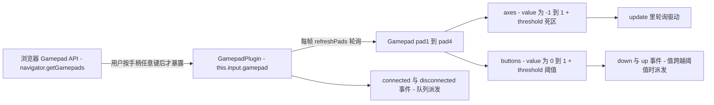

import { Canvas, Controls, Meta } from '@storybook/addon-docs/blocks';
import * as GamepadInput from './gamepad-input.stories';

<Meta of={GamepadInput} name="Docs" />

# 游戏手柄

Phaser 的手柄输入集中在场景级插件 `this.input.gamepad`(`GamepadPlugin`,类型 `GamepadPlugin | null`——不开就取不到)。与键盘相比有两个关键差异:一是**插件默认关闭**,必须在 Game config 写 `input: { gamepad: true }` 才会创建实例;二是**浏览器的权限模型**,手柄插着不代表能读到,用户按手柄任意键后浏览器才会通过 `navigator.getGamepads()` 暴露它。消费模型以**每帧轮询为主**:游戏每步刷新各 pad 的按钮与轴值,你在 `update` 里读快照(移动、瞄准);`connected` / `disconnected` / `down` / `up` 四个事件是边沿补充(插拔、跳跃、开火);振动通过 `pad.vibration` 直接使用原生 `GamepadHapticActuator`,Phaser 4 没有自己的包装方法。本课按「连接与启用 → 轴与死区 → 按钮 → 事件与轮询 → 振动」展开。键盘在 [2.4.1 键盘](?path=/docs/keyboard-input--docs),指针与拖拽在 [2.4.2 指针与交互](?path=/docs/pointer-input--docs);范例沿用直接改坐标的驱动写法,物理驱动见 [3.1 Arcade 物理](?path=/docs/arcade-physics--docs)。

**操作前提:浏览器要用户先与手柄交互(按任意键或推摇杆)才暴露手柄数据**;页面已受信时可能直接可见。本页 Canvas 是 iframe,不影响手柄激活;没有实体手柄时,用范例 Controls 的「模拟轴」滑块走同一套驱动链路。

手柄数据从浏览器到你的代码只有一条主链:



关键 API 的默认值(以下经 phaser@4.2.1 类型与源码核实):

| API / 属性 | 默认值 | 回查要点 |
| --- | --- | --- |
| config `input.gamepad` | `false` | 不开启连插件实例都不创建,`this.input.gamepad` 为 `null` |
| config `input.gamepad.target` | `window` | `connected` / `disconnected` 的监听目标 |
| `Axis.threshold` / `getValue()` | `0.1` | 硬截断:`\|value\|` 小于阈值归零;超出后从原值起步,不重映射 |
| `Button.threshold` | `1` | 数字键按满才算按下;模拟扳机要降阈值才有 `down` 事件 |
| `pad.leftStick` / `rightStick` | `Vector2(0, 0)` | 每帧由各轴 `getValue()` 合成,已过死区 |
| 事件 `connected` / `disconnected` | — | `(pad, event)`;需要用户先按手柄 |
| 事件(插件)`down` / `up` | — | `(pad, button, value)`;覆盖所有已连接手柄 |
| 事件(单柄)`down` / `up` | — | `(index, value, button)`;挂在 pad 实例上 |
| `pad.vibration` | 多数设备为 `undefined` | 原生 `GamepadHapticActuator`;`playEffect` 返回 Promise |

## 快速上手

最小闭环:config 开启手柄、监听 `connected`、`update` 里轮询左摇杆驱动移动。

```ts
// 1. 手柄插件默认关闭,必须在 config 显式开启
new Phaser.Game({
  input: { gamepad: true },
  scene: MainScene,
});

class MainScene extends Phaser.Scene {
  private player?: Phaser.GameObjects.Image;
  private pad?: Phaser.Input.Gamepad.Gamepad;

  create() {
    this.player = this.add.image(360, 200, 'player');
    const gamepad = this.input.gamepad;
    if (!gamepad) {
      return; // config 没开 input.gamepad,或浏览器不支持
    }
    // 页面可能早已受信:手柄已可见时 connected 不会再触发,create 时先查一次
    this.pad = gamepad.pad1;
    gamepad.on('connected', (pad) => (this.pad = pad));
    gamepad.on('disconnected', () => (this.pad = gamepad.pad1));
  }

  override update(_time: number, delta: number) {
    // 2. 轮询:leftStick 已过 threshold 死区,松手后的摇杆漂移被吃掉
    const { x, y } = this.pad?.leftStick ?? Phaser.Math.Vector2.ZERO;
    const step = 240 * (delta / 1000);
    this.player?.x += x * step;
    this.player?.y += y * step;
  }
}
```

这条闭环跑通的前提是浏览器已暴露手柄——**插着手柄后按任意键**(权限模型见下节)。移动写法与 [2.4.1 键盘](?path=/docs/keyboard-input--docs)的轮询同构:都是「每帧读状态 → 乘 `delta` 改坐标」,只是输入来源从 `Key.isDown` 换成模拟量轴值。

## 连接与启用

### 启用:input.gamepad 默认是关的

键盘插件默认就在,手柄插件不是:config 不写 `input.gamepad`,`this.input.gamepad` 直接是 `null`,连插件实例都不创建。两处开启入口:

```ts
// Game config:全局开启(推荐)
new Phaser.Game({ input: { gamepad: true }, scene: MainScene });

// 或 Scene config:只给这个场景开(super({ key: 'Main', input: { gamepad: true } }))
```

开启后还要浏览器本身支持(`game.device.input.gamepads` 为 `true`):不支持时实例存在但 `enabled` 为 `false`,一切读数停在初始值。Chrome 自 2020 年 9 月起还要求**安全上下文**——页面须在 `https://` 或 `localhost` 上,`http://` 的部署会直接禁用手柄 API。`input.gamepad.target`(默认 `window`)可换监听目标,一般不动。

### 权限模型:按手柄任意键激活

`navigator.getGamepads()` 在用户与手柄交互前会把手柄藏起来(返回空位),这是浏览器的安全设计,Phaser 改变不了它。由此推出三条实际行为:

- **插上手柄 ≠ 已连接**:先按手柄上任意键(或推摇杆),浏览器才暴露它、才派发 `gamepadconnected`,`pad1` / `total` 才有值。
- **`connected` 可能永远不触发**:页面此前已受信、手柄早已可见时,不会再有连接事件。所以 `create` 时要**主动查一次** `gamepad.pad1` / `total`(快速上手的写法),不能只靠事件。
- **拔出手柄**派发 `disconnected`,参数同为 `(pad, event)`;断开后 pad 的按钮轴值不再刷新,监听里应清掉持有的引用。

### 取得 pad:pad1–pad4、getPad 与 getAll

| 入口 | 返回 | 说明 |
| --- | --- | --- |
| `gamepad.pad1` … `pad4` | `Gamepad \| undefined` | 前 4 台,按**连接顺序**占位;断开后不自动腾挪 |
| `gamepad.getPad(index)` | `Gamepad \| undefined` | 按 `pad.index` 匹配,多手柄时用它区分玩家 |
| `gamepad.getAll()` | `Gamepad[]` | 当前全部已连接手柄(跳过空位) |
| `gamepad.total` | `number` | 已连接数量,即 `gamepads.length` |

每台 `Gamepad` 自带识别信息:`id`(含厂商/产品信息的字符串,内容因浏览器而异)、`index`(系统分配的整数,断开重连可能复用)、`connected`、以及原生对象引用 `pad.pad`。每个场景各有一个 `GamepadPlugin` 实例,`enabled` 开关与键盘的场景级开关同款用法。

## 轴与死区

`pad.axes` 是 `Axis` 对象数组,按「标准映射」布局(浏览器为标准手柄保证的顺序):

| 索引 | 含义 | `value` 范围 |
| --- | --- | --- |
| `axes[0]` | 左摇杆水平(左 -1 / 右 +1) | -1 … 1 |
| `axes[1]` | 左摇杆垂直(上 -1 / 下 +1) | -1 … 1 |
| `axes[2]` | 右摇杆水平 | -1 … 1 |
| `axes[3]` | 右摇杆垂直 | -1 … 1 |

每个 `Axis` 有两个读数:`value` 是**原始值**(硬件直接上报,含漂移);`getValue()` 在原始值上套 `threshold`(默认 `0.1`)——绝对值小于阈值直接归零,否则原样返回。`pad.leftStick` / `rightStick`(`Phaser.Math.Vector2`)就是各由两条 `getValue()` 合成的便捷读数,`update` 里直接解构。`pad.setAxisThreshold(0.15)` 一次改全部轴,`getAxisTotal()` / `getAxisValue(i)` 用于通用遍历。

### 死区:硬截断与径向重映射

摇杆松手后 `value` 通常不是精确的 0(硬件漂移),死区是手柄输入的标准配备。两种实现:

- **Phaser 内置(硬截断):**`Axis.threshold` + `getValue()`。进入死区归零,但**一出死区就从原始值起步**——阈值 0.1 时,贴着死区边缘轻推会瞬间输出 0.11,手感有一级跳变;且两条轴各判各的,斜向轻推时可能只有一条轴被吃掉。
- **自实现(径向死区 + 重映射):**把两轴合成向量按长度判断,死区内归零;死区外把长度重映射回 0…1,输出连续、方向保持,是主机游戏常用的手感:

```ts
function applyRadialDeadzone(x: number, y: number, deadzone: number) {
  const magnitude = Math.hypot(x, y); // 两轴合成长度
  if (magnitude <= deadzone) {
    return { x: 0, y: 0 };
  }
  const scaled = (magnitude - deadzone) / (1 - deadzone); // 重映射回 0..1
  return { x: (x / magnitude) * scaled, y: (y / magnitude) * scaled };
}
```

两档并用是常态:先用 `leftStick`(或 `setAxisThreshold`)吃掉小漂移,驱动手感再叠自己的径向死区。死区取值 0.1–0.2 起步,旧手柄漂移大就调大;下方实验台的「死区半径」滑块可以对照两个读数的差别。

## 按钮

`pad.buttons` 是 `Button` 对象数组,每个按钮三个关键读数:

- **`value`(0…1):**数字键按下是 1、松开是 0;**模拟扳机(L2 / R2)是连续值**,按一半约 0.5。要做「轻按轻刹车、按死重刹车」就读它。
- **`pressed`(boolean):**`value >= threshold` 时为 `true`。阈值 `threshold` **默认是 1**——数字键恰好按满,没问题;但扳机**按不满 1 就永远不会 `pressed`、不会派发 `down` 事件**,要识别半按就得降阈值:

```ts
pad.buttons[6].threshold = 0.3; // L2:按到 30% 即算按下(索引见下表)
```

- **`index`:**在数组中的位置,即下表的标准映射索引。

便捷读法:`pad.getButtonTotal()` 拿数量、`pad.getButtonValue(i)` 拿模拟值、`pad.isButtonDown(i)` 拿按下状态;不关心具体手柄型号时,直接用快捷属性更快——它们就是按标准映射索引预先绑好的引用:

| 快捷属性 | 标准索引 | 类型 | 对应(DualShock / XBox) |
| --- | --- | --- | --- |
| `A` / `B` / `X` / `Y` | 0 / 1 / 2 / 3 | boolean | 底 / 右 / 左 / 顶(Cross / Circle / Square / Triangle;A / B / X / Y) |
| `L1` / `R1` | 4 / 5 | boolean | 肩键(L1 / R1;LB / RB) |
| `L2` / `R2` | 6 / 7 | **number(0…1)** | 扳机,模拟量(L2 / R2;LT / RT) |
| `up` / `down` / `left` / `right` | 12 / 13 / 14 / 15 | boolean | 十字键 |

手柄没有这个键时,快捷属性恒为 `false` / `0`,不会报错。注意快捷属性基于**标准映射**:老式或非标准手柄(某些 SNES USB、跳舞毯)按钮顺序不同,Phaser 为常见型号预置了索引常量 `Phaser.Input.Gamepad.Configs.SNES_USB` / `DUALSHOCK_4` / `XBOX_360`,按 `Configs.XBOX_360.A` 这类名字取索引,避免裸数字。

单次动作(跳跃、确认)没有键盘 `JustDown` 的等价物——要么用下面的 `down` 事件,要么自己记上一帧 `pressed` 做边沿判断。

## 事件与轮询模型

手柄与键盘的消费哲学相反:**轴只能轮询,事件只覆盖边沿**。浏览器原生只有 `gamepadconnected` / `gamepaddisconnected` 两个 DOM 事件(Firefox 额外有按钮/轴事件,但其他浏览器没有,Phaser 不依赖它们)。Phaser 的做法是每个游戏步都执行一次固定链路:

1. `GamepadPlugin.update()` 调 `navigator.getGamepads()` 拿最新快照(`refreshPads`,新出现的 pad 在这里创建);
2. 逐台 `pad.update(livePad)` 把按钮、轴值同步进 `Button` / `Axis` 对象;
3. 按钮值**跨越 `threshold` 的那一刻**派发 `down` / `up`;连接事件从 DOM 队列里取出派发 `connected` / `disconnected`。

所以你的 `update` 里读到的永远是本帧快照,移动、瞄准这类持续行为直接轮询;四个事件做单次动作与插拔响应:

| 监听写法 | 回调参数 | 触发条件 |
| --- | --- | --- |
| `gamepad.on('connected', fn)` | `(pad, event)` | 浏览器暴露一台新手柄;`event` 是原生 `GamepadEvent` |
| `gamepad.on('disconnected', fn)` | `(pad, event)` | 拔出手柄 |
| `gamepad.on('down', fn)` | `(pad, button, value)` | **任意**手柄的任意按钮值升到阈值以上;`button` 是 `Button` 对象 |
| `gamepad.on('up', fn)` | `(pad, button, value)` | 对应松开 |
| `pad.on('down', fn)` | `(index, value, button)` | 挂在**单台手柄**上,只报这台;多手柄分玩家时用它 |

注意两组 `down` 的参数顺序不同(插件版 `(pad, button, value)`,单柄版 `(index, value, button)`),都以本地类型为准。与键盘相同的边沿语义:**按住期间不会重复派发**,每次按下只发一次 `down`。派发时机也和键盘一样对齐游戏帧——连接事件先入队、游戏步统一处理;按钮事件则在每帧同步按钮值时当场派发。插件级 `down` 只要求插件 `enabled`;DOM 连接事件入队还要求场景 `isActive()`,暂停场景的手柄连接要等场景恢复才补发。游戏休眠(离屏、后台)期间值不刷新,恢复后读到的是唤醒后的新快照。

下面是手柄实验台。它把本课全部证据线接在一起:连接状态与「按手柄任意键激活」提示、前四轴原始值与十字读数、按钮格与 `down` 计数、振动调用结果;**输入来源被抽象成同一个向量函数**——真实手柄 `leftStick` 与 Controls 的模拟轴滑块相加后走同一条「死区 → 驱动」链路,没有实体手柄也能完整验证。

<Canvas of={GamepadInput.GamepadLab} />
<Controls of={GamepadInput.GamepadLab} />

| 读者操作 | 可观察证据 |
| --- | --- |
| 无手柄:拖「模拟轴 X」 | 十字读数白点右移,readout「死区后驱动」同步非零,移动对象向右走;「输入来源」显示「模拟」 |
| 模拟轴停在 ±0.05、死区 0.15 | 白点在死区圈内,驱动向量为 (0.00, 0.00),对象不动——死区生效 |
| 「死区半径」调到 0 | 同样的 ±0.05 让对象缓慢移动——无死区时漂移直接进入驱动链路 |
| 插入手柄并按任意键 | `total` 变 1,状态行显示 id 与 index;`connected` 计数 +1(已受信页面可能直接就绪、不计数) |
| 推左摇杆 | 「轴 0/1 原始」实时变化,`leftStick`(threshold 后)同步,白点与对象一起动;「输入来源」变「手柄」 |
| 摇杆松手(有漂移的旧手柄) | 原始轴值停在非零小数,但驱动向量归 0(死区吃掉漂移) |
| 按 A / B / X / Y、十字键 | 对应按钮格点亮;`down` 计数 +1,「最近按钮」显示 index 与按下瞬间的 value |
| 缓慢半按 L2 / R2 扳机 | value 连续爬升(按钮格不亮、`down` 计数不动)——按满 1.0 才亮:验证 `threshold` 默认 1 |
| 按住任一按钮不放 | `down` 计数只 +1 一次;松开时按钮格熄灭——边沿派发,按住不重复 |
| 打开「触发振动」 | 支持的手柄震动,readout 显示 `playEffect → complete`;无手柄显示「无手柄,未调用」 |
| 打开 Show code | 看到该 Canvas 实际执行的 `gamepad-lab.ts` 全文 |

实例滚出视口或页面切后台时整体休眠,手柄读数冻结,回视口自动恢复——因为轴值只在游戏步里刷新。

## 振动

Phaser 4 没有振动包装方法(Phaser 3 教程里的 `setPadVibrationStrength` 在 4 里不存在,已按 4.2.1 源码核实)——振动直接用 `pad.vibration`,它就是浏览器原生的 `GamepadHapticActuator`(`navigator` 手柄对象的 `vibrationActuator` 引用),**只有设备与浏览器都支持时才存在**,用前必须检测:

```ts
const pad = this.input.gamepad?.pad1;
if (pad?.vibration) {
  // dual-rumble:duration 毫秒,strongMagnitude 重马达、weakMagnitude 轻马达,0..1
  pad.vibration
    .playEffect('dual-rumble', { duration: 300, strongMagnitude: 0.9, weakMagnitude: 0.5 })
    .then((result) => console.log(result)) // 'complete' 或 'preempted'(被新效果打断)
    .catch(() => { /* 支持检测过了仍可能被拒,静默降级 */ });
  // pad.vibration.reset(); // 立即停止进行中的效果,同样返回 Promise
}
```

三个必须知道的边界:

- **`playEffect` 是异步的**,返回 `Promise<'complete' | 'preempted'>`:完整播完结算 `complete`,播放途中被下一次 `playEffect` 或 `reset()` 打断结算 `preempted`。连击场景想「每次命中震一下」,直接连续调用即可,旧效果自动被 preempted。
- 参数对象各字段(`duration` / `strongMagnitude` / `weakMagnitude`,另有 `startDelay` 等)都可选,单位与取值以原生 API 为准;`'dual-rumble'` 是目前最通用的效果类型。
- 支持情况参差(与设备、浏览器、连接方式都有关),把振动当**增强而非依赖**:检测不过、Promise 被拒都直接跳过,不影响玩法。

## 最佳实践

- **按行为类型选通路:**持续行为(移动、瞄准、载具)每帧轮询 `leftStick` / `axes[i].value`;单次动作(跳跃、确认)用 `down` / `up` 事件或自记 `pressed` 边沿——手柄没有 `JustDown` 等价物,不要在 `update` 里用 `pressed` 判断单次动作(每帧都为真)。
- **移动位移乘 `delta`:**`value * speed * delta / 1000`,与帧率解耦;摇杆是模拟量,同一个式子顺带获得了「推得浅走得慢」的油门手感。
- **死区分两层:**先用 `leftStick`(内置 `threshold` 0.1)吃小漂移,驱动手感再叠径向死区 + 重映射(见「轴与死区」),别只靠单轴硬截断——斜向输入会被吃成单轴。
- **把输入抽象成向量函数:**驱动逻辑只消费「输入向量」,键盘(`isDown` 合成)、手柄(`leftStick`)、虚拟摇杆各自产出向量(实验台即此结构),同一套移动代码服务所有设备。
- **振动先检测、失败即降级:**`pad.vibration` 判空、`catch` 兜底;它是增强反馈,任何失败都不该影响玩法。
- **断开即清引用:**`disconnected` 里把持有的 pad 引用重置(重查 `gamepad.pad1`),否则会一直读到冻结的最后一帧值。

## 常见问题

- **手柄插上了,`total` 是 0,`connected` 也不触发。**
  这是权限模型,不是 bug:浏览器要用户**先按手柄任意键**(或推摇杆)才暴露手柄。按一下再查;仍不行按链路排查:config 是否写了 `input: { gamepad: true }`(默认关);页面是否在 `https://` 或 `localhost` 上;页面已受信、手柄早已可见时 `connected` 本来就不会触发——`create` 里主动查 `gamepad.pad1`。
- **数字键正常,扳机(L2 / R2)按了没有 `down` 事件。**
  `Button.threshold` 默认 1:数字键按下即 1.0 能达标,模拟扳机很难按满。识别半按就降阈值(`pad.buttons[6].threshold = 0.3`),或直接轮询 `pad.getButtonValue(6)` 拿连续值。
- **松开摇杆后角色还在微微移动。**
  摇杆漂移是硬件常态。`leftStick` 已按 `Axis.threshold`(0.1)截断,还漂说明这台手柄漂移更大:`pad.setAxisThreshold(0.15)` 调大,或上径向死区(见「轴与死区」);实验台「死区半径」滑块可先试出手感。
- **`this.input.gamepad` 是 `null`(或 TS 报可能为 null)。**
  类型就是 `GamepadPlugin | null`:config 没开 `input.gamepad` 时连实例都不创建。开启后仍要判空——浏览器不支持时实例存在但 `enabled` 为 `false`。
- **localhost 开发一切正常,部署到服务器后手柄失效。**
  Chrome 要求安全上下文才开放手柄 API:`http://` 页面直接被禁。用 HTTPS 部署。
- **双手柄怎么稳定区分玩家?**
  `pad1`–`pad4` 按连接顺序占位,断开不腾挪,重连顺序变了会串位;按 `pad.index` 用 `gamepad.getPad(index)` 绑定玩家更稳(`index` 由系统分配,断开重连可能复用序号,重新配对时机由你决定)。

## 总结回顾

摘要:

Phaser 手柄输入默认关闭,config `input: { gamepad: true }` 开启后经「浏览器 `navigator.getGamepads()`(用户按手柄任意键才暴露)→ GamepadPlugin 每帧 `refreshPads` 轮询 → 按钮轴值同步进 pad」的固定链路供消费。轴是 -1…1 模拟量:`leftStick` 已按 `Axis.threshold`(0.1)硬截断,手感再叠径向死区 + 重映射。按钮 `value` 0…1、`pressed` 由 `threshold`(默认 1,扳机要降)决定,标准映射提供 `A/B/X/Y`、`L1/L2/R1/R2` 与十字键快捷属性。事件只有边沿:插件级 `connected/disconnected (pad, event)`、`down/up (pad, button, value)`,单柄级 `down/up (index, value, button)`,按住不重发;轴没有事件,只能轮询;没有 `JustDown` 等价物。振动直接用原生 `pad.vibration`(GamepadHapticActuator),`playEffect('dual-rumble', …)` 返回 `Promise<'complete' | 'preempted'>`,先检测再调用、失败即降级。

一句话:

> 手柄输入先开 config、再等用户按键激活,之后以每帧轮询为主——轴读 `value` 配死区、按钮读 `value`/`pressed` 配阈值,事件只覆盖连接与按钮边沿,振动是原生异步 API。

知识要点:

- `input.gamepad` 默认值是多少?不开启时 `this.input.gamepad` 是什么?
- 浏览器什么时候才暴露手柄?`connected` 不触发时怎么兜底?
- 轴的 `value` 与 `getValue()` 差在哪?`threshold` 默认多少?
- 按钮的 `threshold` 默认多少?对模拟扳机意味着什么、怎么改?
- 插件级与单柄级 `down` 事件的参数签名分别是什么?
- 轴为什么没有事件?按住按钮时 `down` 派发几次?
- 径向死区相对硬截断改善了什么?重映射公式是什么?
- `pad.vibration` 是什么?`playEffect` 的返回值怎么处理?

## 参考资料

- [@官方@Phaser 官方文档](https://docs.phaser.io/) — GamepadPlugin / Gamepad / Button / Axis 的 API 页与手柄输入指南
- [@官方@官方示例库](https://phaser.io/examples/) — gamepad 分类下的可运行示例
- [@官方@Phaser 4 Labs 示例浏览器](https://labs.phaser.io/phaser4-index.html) — Phaser 4 专用示例,含输入部分
