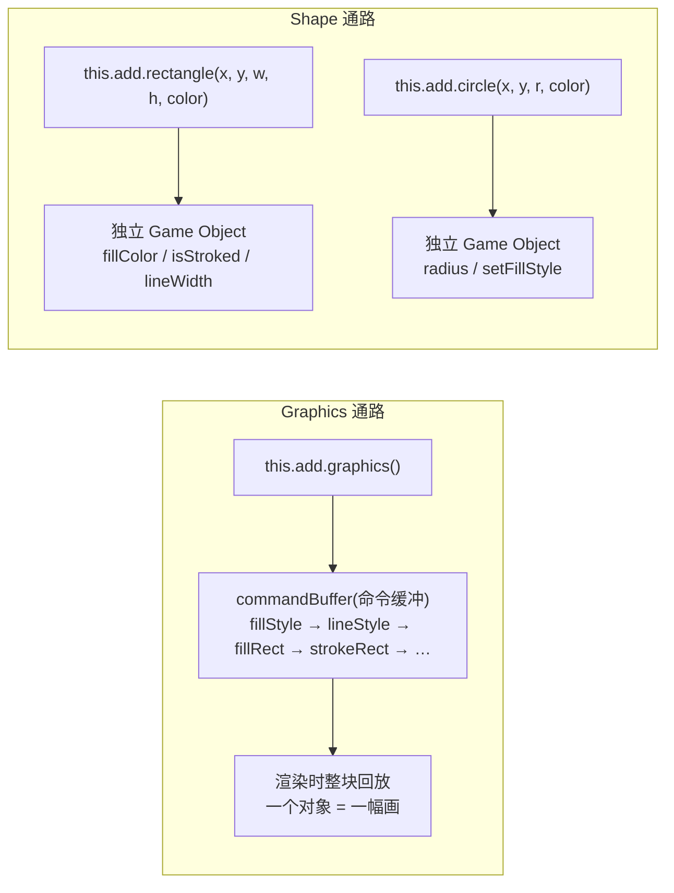

import { Canvas, Controls, Meta } from '@storybook/addon-docs/blocks';
import * as Graphics from './graphics.stories';

<Meta of={Graphics} name="Docs" />

# 图形绘制

Phaser 画几何图形有两条通路:**Graphics** 是一支「画笔」——一个游戏对象记下一串绘制命令,整块回放渲染;**Shape** 是 `add.rectangle` 这样的形状工厂——每个矩形、圆、星形各自成为一个独立游戏对象。同一条矩形可以由两条通路画出,但更新方式、交互能力与适用场景完全不同:Graphics 适合调试线框、复合静态图和烘焙纹理,Shape 适合需要单独改属性、补间或交互的实体与 UI。本课讲清两套体系的绘制 API、样式模型与取舍,并讲透 `generateTexture` 把画好的图形烘焙成纹理的栅格化语义。



关键默认值与易混点回查(细节见正文对应小节):

| 输入 / 成员 | 默认值 | 说明 |
| --- | --- | --- |
| Graphics 的 `defaultFillColor` / `defaultStrokeColor` | `-1`(未设置) | 设过 `setDefaultStyles` 后 `clear()` 会自动恢复;否则 clear 后须重新设样式 |
| `fillStyle` / `lineStyle` 的 `alpha` | `1` | 样式是状态:影响其后所有绘制,直到再次设置 |
| 未设置样式就 `fillRect` | 黑色填充 | 初始 tint 为 `0`;先样式后绘制 |
| `fillEllipse` 的 `width` / `height` | 直径 | 不是半径;`smoothness` 默认 `32` |
| `fillRoundedRect` 的 `radius` | `20` | 数字或 `{ tl, tr, br, bl }` 四角对象 |
| `graphics.arc` / `slice` 的角度 | 弧度 | Shape 的 Arc `startAngle` / `endAngle` 却是**角度** |
| `add.rectangle` 的宽高 | `128 × 128` | 不传 `fillColor` 则 `isFilled` 为 `false` |
| `add.star` 的 `points` / `innerRadius` / `outerRadius` | `5` / `32` / `64` | `points` 为 4 时渲染为菱形 |
| `add.line` 的线宽 | `1` | 不传 `strokeColor` 则完全不可见 |
| Shape 的 `fillColor` / `lineWidth` | `0xffffff` / `1` | 是否生效由 `isFilled` / `isStroked` 开关决定 |
| `generateTexture` 的宽高 | 游戏画布尺寸 | 烘焙是快照,之后改 Graphics 不影响纹理 |

## 快速上手

同一个「三块彩色方块」,两条通路各画一遍——这就是本课的最小闭环:

```ts
// 通路一:Graphics——一支画笔连画三块,全部记在一个对象的命令缓冲里
const g = this.add.graphics();
g.fillStyle(0x2dd4bf, 1);
g.lineStyle(3, 0xe2e8f0, 1);
for (let i = 0; i < 3; i++) {
  g.fillRect(60 + i * 80, 60, 64, 64);   // x, y 是左上角
  g.strokeRect(60 + i * 80, 60, 64, 64);
}

// 通路二:Shape——每块方块是一个独立游戏对象,x, y 是中心
for (let i = 0; i < 3; i++) {
  this.add.rectangle(92 + i * 80, 92, 64, 64, 0x2dd4bf)
    .setStrokeStyle(3, 0xe2e8f0);
}
```

注意坐标语义已经不同:`fillRect` 的 `(x, y)` 是矩形**左上角**,`add.rectangle` 的 `(x, y)` 是**中心**(Shape 默认 origin 0.5)。下面的实例用同一组参数同时驱动两条通路,拖动任何控件对比两行的结果与 readout 差异。

<Canvas of={Graphics.GraphicsVsShape} />
<Controls of={Graphics.GraphicsVsShape} />

| 读者操作 | 可观察证据 |
| --- | --- |
| 拖动「尺寸」 | 两排方块同步变大;「命令缓冲长度」不变(命令数只随绘制调用数变化,不随参数值变化) |
| 拖「描边宽」到 0 | 两排描边变细直至不可见;Shape 侧「isStroked」仍为 `true`——线宽是 0,开关没关 |
| 切换「填充色」 | 两排颜色同步;「Graphics 重画次数」每次 +1,「Shape 重画次数」恒为 0——Shape 只改属性,不需要重画 |
| 查看「游戏对象数」 | 上排 `1`(一支画笔画三块),下排 `3`(每块一个对象) |
| 打开 Show code | 看到该 Canvas 实际执行的 `graphics-vs-shape.ts` 全文 |

实例滚出视口或页面切到后台时会整体休眠以省资源,回到视口自动恢复。

## Graphics 命令绘制

Graphics 的本体是 `commandBuffer`(命令缓冲):你调用的每个方法都只是往数组里追加一条命令,**渲染时才整块回放**。命令分两类:

- **样式命令**——`fillStyle(color, alpha)`、`lineStyle(lineWidth, color, alpha)`:改变画笔的当前状态。它们不是「设置某个形状的颜色」,而是**影响其后所有绘制命令,直到再次设置**。
- **绘制命令**——`fillRect`、`fillCircle`、`arc`、`lineTo` 等:用当前状态画形状。

一个 Graphics 里可以混用多种颜色:设样式 → 画 → 换样式 → 再画,像手动控制画笔蘸料。也正因如此,事后想改其中某一个矩形的颜色是做不到的——命令不可寻址,只能 `clear()` 后整块重画(见「重画与清理」)。

渲染上,WebGL 用 Graphics 自己的 shader 批量回放命令,Canvas 则逐条转成 2D context 调用;复杂形状在两种渲染器下都要拆解成多边形,开销不小,官方因此建议把不常变化的 Graphics 用 `generateTexture` 烘焙成纹理(见对应小节)。

### 样式状态

```ts
const g = this.add.graphics();
// 也可以在创建时给默认样式(之后 clear 会自动恢复)
const g2 = this.add.graphics({
  fillStyle: { color: 0x2dd4bf, alpha: 1 },
  lineStyle: { width: 3, color: 0xe2e8f0, alpha: 1 },
});

g.fillStyle(0x2dd4bf, 1);        // 填充色 + 填充透明度(alpha 默认 1)
g.lineStyle(3, 0xe2e8f0, 1);     // 线宽 + 描边色 + 描边透明度
g.fillRect(0, 0, 100, 100);      // 用上面两套状态:填 + 描要分别调用
g.strokeRect(0, 0, 100, 100);
```

两条纪律:

- **先样式,后绘制。** 没调用过 `fillStyle` 就 `fillRect`,得到的是黑色——渲染器初始 tint 为 `0`,不是白色也不是不画。描边同理。
- **fill 与 stroke 是两次独立绘制。** 想要「填充 + 描边」的形状,把 `fillRect` 与 `strokeRect` 成对调用;只描不填就只调 stroke 族。

样式状态可读:`defaultFillColor`、`defaultFillAlpha`、`defaultStrokeWidth`、`defaultStrokeColor`、`defaultStrokeAlpha` 是只读属性,由 `setDefaultStyles(options)` 设置;构造参数里的 `fillStyle` / `lineStyle` 正是走这条通路。`clear()` 后如果这些默认值有效(大于 -1)会自动恢复,否则清空后必须重新设样式再画。

WebGL 专属的 `fillGradientStyle(四角色)` / `lineGradientStyle(lineWidth, 四角色)` 提供四角渐变,官方注明只适合矩形与三角形,且 `generateTexture` 烘焙时不可用(走 Canvas 2D)。

### 基本形状

常用形状都有 fill / stroke 两个孪生方法,坐标语义随形状走:

| 方法 | 坐标语义 | 关键参数 |
| --- | --- | --- |
| `fillRect` / `strokeRect(x, y, w, h)` | `(x, y)` 是**左上角** | 宽、高 |
| `fillRoundedRect` / `strokeRoundedRect(x, y, w, h, radius)` | 左上角 | `radius` 默认 `20`,可传 `{ tl, tr, br, bl }` 分角设置(负值画凹角) |
| `fillCircle` / `strokeCircle(x, y, radius)` | `(x, y)` 是**圆心** | 半径(不是直径) |
| `fillEllipse` / `strokeEllipse(x, y, width, height, smoothness)` | 圆心 | `width` / `height` 是**直径**;`smoothness` 默认 `32`,越大越圆 |
| `fillTriangle` / `strokeTriangle(x0, y0, x1, y1, x2, y2)` | 三个顶点 | 自动闭合 |
| `lineBetween(x1, y1, x2, y2)` | 两点 | 只描线,受 `lineStyle` 控制 |
| `fillPoint(x, y, size)` | 一个点 | 画边长 `size`(默认 1)的小方块 |

每个 `fillXxx` 还有接受几何对象的变体 `fillXxxShape`(如 `fillRectShape(rect)`),传入 `Phaser.Geom.Rectangle` 等实例,适合与几何库联动。

```ts
const g = this.add.graphics();
g.fillStyle(0x2dd4bf, 1);
g.lineStyle(3, 0xe2e8f0, 1);
g.fillRoundedRect(40, 40, 160, 90, 12);    // 圆角矩形:UI 面板底板
g.strokeRoundedRect(40, 40, 160, 90, 12);
g.fillEllipse(120, 220, 180, 90);          // 横椭圆:180×90 是直径
g.fillTriangle(120, 270, 60, 360, 180, 360);
g.lineBetween(40, 380, 200, 380);          // 直线:只有 stroke 语义
```

下面的实例用同一个 Graphics 依次演示这些形状(外加路径与弧扇),切换形状观察 readout 的命令缓冲变化。

<Canvas of={Graphics.GraphicsCommands} />
<Controls of={Graphics.GraphicsCommands} />

| 读者操作 | 可观察证据 |
| --- | --- |
| 切换「形状」 | 同一对象整块重画为对应形状;「绘制笔数」只统计你调用的方法,「命令缓冲长度」是展开后的真实命令数——圆角矩形一笔 `fillRoundedRect` 在缓冲里展开为 `beginPath + moveTo + 4×(lineTo + arc) + closePath + fillPath` 一长串,比五边形路径还长 |
| 切到「椭圆 ellipse」 | 宽高比约 3:2 的横椭圆;`smoothness` 用默认 32,边缘即多边形近似 |
| 切到「圆角矩形 rounded」 | 四角圆角;圆角半径固定 16,对比 `fillRect` 的直角 |
| 切到「路径多边形 path」 | 五边形由 `beginPath → moveTo → lineTo×4 → closePath` 画出——Graphics 没有专门的多边形命令,路径就是多边形 |
| 切到「弧 arc」或「扇形 slice」后拖「扫过角度」 | 弧随角度增长;同一角度下 arc 填充按弦闭合(弓形),slice 从圆心出发(饼图切片)——两者的区分证据 |
| 打开 Show code | 看到该 Canvas 实际执行的 `graphics-commands.ts` 全文 |

### 路径

路径(path)是 Canvas 2D 风格的自由绘制,用来画形状族没有的东西——任意多边形、折线、开放曲线:

```ts
const g = this.add.graphics();
g.fillStyle(0xfacc15, 1);
g.lineStyle(3, 0xe2e8f0, 1);

g.beginPath();          // 开始一条新路径(清掉之前的路径点)
g.moveTo(100, 40);      // 落笔到起点
g.lineTo(160, 130);     // 连线到各顶点
g.lineTo(40, 130);
g.closePath();          // 闭合:末点连回起点
g.fillPath();           // 填充当前路径
g.strokePath();         // 描边当前路径
```

- `beginPath` 之后路径才会重置;不调它,新 moveTo 之前的路径点仍在路径里。
- `closePath` 连回起点;不闭合就 fill,填充会按「末点直连首点」处理,描边则留开口。
- `fill()` / `stroke()` 是 `fillPath()` / `strokePath()` 的别名,与 Canvas 2D API 对齐。
- 已有一组顶点时可以跳过逐点连线:`fillPoints(points, closeShape, closePath)` / `strokePoints(...)`,`points` 是 `Phaser.Math.Vector2[]`,两个布尔参数分别控制「形状闭合」与「路径闭合」。

 Graphics 没有专门的多边形、星形命令——它们要么用路径拼,要么用下一节的 Shape 工厂一行创建。

### 弧与扇形

`arc` 把一段弧**追加到当前路径**,`slice` 直接画出饼图切片,两者角度单位都是**弧度**:

```ts
const g = this.add.graphics();
g.fillStyle(0x818cf8, 1);
g.lineStyle(3, 0xe2e8f0, 1);

// 弧:追加进当前路径,官方要求先 beginPath;fill 时按弦闭合(弓形)
g.beginPath();
g.arc(120, 120, 80, 0, Phaser.Math.DegToRad(270));  // 顺时针扫 270°
g.closePath();
g.fillPath();
g.strokePath();

// 扇形:自带 beginPath 与 closePath,从圆心出发的饼图切片
g.slice(320, 120, 80, 0, Phaser.Math.DegToRad(270)); // anticlockwise 默认 false
g.fillPath();
g.strokePath();
```

- `arc(x, y, radius, startAngle, endAngle, anticlockwise = false, overshoot = 0)`:角度 0 在 3 点钟方向,顺时针增长(屏幕坐标系 y 向下)。不调 `beginPath`,弧会在填充或描边时自动闭合。
- `slice(x, y, radius, startAngle, endAngle, anticlockwise = false, overshoot = 0)`:`anticlockwise: true` 得到「吃豆人」开口造型,`false` 是实心饼片。
- `overshoot` 让弧略微扫过头,弥合粗描边的接缝;官方建议从小值(如 `0.01`)试起。
- 习惯用角度时,`Phaser.Math.DegToRad()` 负责换算;直接把 `270` 当弧度传,画出的形状会完全不符预期。

### 重画与清理

```ts
g.clear();   // 清空 commandBuffer,样式恢复默认(若设过 setDefaultStyles)
```

`clear()` 是 Graphics 更新的唯一途径:**命令写进缓冲后不可寻址、不可修改**,想改任何一笔(挪一个矩形、换一个颜色)都要 `clear()` 后把整幅画重来。快速上手实例里「Graphics 重画次数」随每次参数变化 +1,就是这条机制的读数。这不是缺陷而是模型使然——代价换来了「一个对象一次渲染整块回放」的简单性。

配套的状态管理命令:

- `save()` / `restore()`:把当前样式压栈 / 弹栈,画复杂图时暂存状态。
- `translateCanvas(x, y)` / `scaleCanvas(x, y)` / `rotateCanvas(radians)`:平移、缩放、旋转**其后**的绘制命令;注意它们改变的是画笔落点,不是 Graphics 对象本身的 `x` / `y` / `rotation`——对象级变换用 `setPosition` / `setAngle` 等常规方法,两套变换互相独立。

 Graphics 没有 `setOrigin`(无 Origin 组件),整个对象的锚点就是命令坐标本身;`displayOriginX/Y` 只是只读的显示原点读数。

## Shape 游戏对象

`this.add.rectangle` 这族工厂创建的是标准 **Game Object**:每个形状有自己的几何与样式属性,进场景的显示列表,拥有 Origin(默认中心 0.5)、边界、深度、alpha、tint、补间、容器与分组等全部常规能力(位置、原点、翻转等通用操作与 Sprite 完全一致,见 [2.2.1 精灵与图像](?path=/docs/sprites--docs);深度与 tint 见 [2.2.5 深度与视觉状态](?path=/docs/depth--docs))。渲染层面官方注明 Shape 在 WebGL 下「fully batched」——与普通精灵同路的批量渲染,不额外打断批次。

与 Graphics 最大的行为差异:**改属性即可,不需要重画**。形状几何由属性派生,`setRadius`、`setSize` 这类 setter 改完即生效。

### 填充与描边

所有 Shape 共用一套样式模型——两个开关加两组参数:

```ts
const rect = this.add.rectangle(400, 300, 200, 120);   // 不传颜色:isFilled = false,透明

rect.setFillStyle(0x2dd4bf, 1);        // 开填充:色 + alpha(默认 1)
rect.setFillStyle();                   // 不传参数:关填充(isFilled = false)
rect.setStrokeStyle(4, 0xe2e8f0, 1);   // 开描边:线宽 + 色 + alpha
rect.setStrokeStyle();                 // 不传参数:关描边(isStroked = false)
```

- `isFilled` / `isStroked` 决定 `fillColor` / `fillAlpha` / `strokeColor` / `strokeAlpha` / `lineWidth` 是否生效;`setFillStyle()` / `setStrokeStyle()` 不带参数就是关掉对应开关。
- 工厂参数里的 `fillColor` / `fillAlpha` 只是**填充**的快捷方式——`add.rectangle(x, y, w, h, 0xff0000)` 看不到边框是正常的,描边必须 `setStrokeStyle`。
- 整体透明度另有 `setAlpha`(作用于整个对象),与 `fillAlpha` 相乘生效。
- 家族例外:`Line` 的渲染只有描边一组——线没有可填的面,`setFillStyle` 置起 `isFilled` 也不会有画面。

下面的实例把七个成员放在同一位置切换,统一暴露填充 / 描边开关与样式参数。

<Canvas of={Graphics.ShapeGallery} />
<Controls of={Graphics.ShapeGallery} />

| 读者操作 | 可观察证据 |
| --- | --- |
| 切换「形状」 | 七种形状在同一中心切换;readout 的「原生尺寸」随之变化(`width` / `height` 由几何派生) |
| 关掉「填充」 | 形状只剩描边轮廓;「isFilled」变 `false`——工厂色没了不影响描边 |
| 关掉「描边」并关掉「填充」 | 对象完全不可见但仍存在(「对象存在」恒为 `true`);样式开关各管各的证据 |
| 切到「线段 line」再开关「填充」 | 画面没有任何变化:Line 渲染只走描边;readout 的 `isFilled` 仍会翻转——标志置起了,但线没有可填的面 |
| 拖「尺寸」 | 各形状按**各自的专有 setter** 缩放:矩形 `setSize`、圆 `setRadius`、星形 `setInnerRadius` + `setOuterRadius`、三角形与多边形 `setTo` 重给顶点 |
| 拖「描边宽」到 0 | 描边消失但「isStroked」仍为 `true`——开关与线宽是两回事 |
| 打开 Show code | 看到该 Canvas 实际执行的 `shape-gallery.ts` 全文 |

### 形状家族

七个常用工厂(`this.add.` 前缀省略),签名与专有 setter 速查:

| 工厂 | 关键参数(默认值) | 专有 setter / 属性 | 注意点 |
| --- | --- | --- | --- |
| `rectangle(x, y, w, h, fillColor?, fillAlpha?)` | 宽高 `128 × 128` | `setSize(w, h)`;`setRounded(radius = 16)` 设圆角 | `setRounded` 设非零半径后变圆角矩形,`0` 关闭;改 `width` 属性**不会**更新渲染,必须 `setSize` |
| `circle(x, y, radius, …)` | 半径 `128` | `setRadius`;`setStartAngle` / `setEndAngle`(单位**度**) | 返回类型是 `Arc`;`add.arc(...)` 是同一族的弧构造器,支持部分圆 |
| `ellipse(x, y, width, height, …)` | 无 | `setSize(w, h)`;`smoothness`(默认 `64`)/ `setSmoothness` | 宽高是直径;smoothness 是渲染采样点数 |
| `triangle(x, y, x1..y3, …)` | 三顶点 | `setTo(x1, y1, x2, y2, x3, y3)` | 永远闭合;要开放三角用多边形 |
| `polygon(x, y, points, …)` | 顶点列表 | `setTo(points)` | `points` 四种格式:`Vector2[]`、`{x,y}[]`、扁平数字 `[x1,y1, x2,y2,…]`、`[[x,y],…]`;顶点坐标相对 `(x, y)`,实际包围盒取决于点 |
| `star(x, y, points, inner, outer, …)` | `5 / 32 / 64` | `setPoints(n)`、`setInnerRadius` / `setOuterRadius` | `points = 4` 是菱形;内外半径差越大星芒越尖 |
| `line(x, y, x1, y1, x2, y2, strokeColor?, strokeAlpha?)` | 线宽 `1` | `setTo(x1, y1, x2, y2)`;`setLineWidth(start, end?)` | 两端点**相对** `(x, y)`;WebGL 下起止线宽可不同(Canvas 只用 start);不传 `strokeColor` 不可见 |

几个横向事实:

- 所有成员都有 `setFillStyle` / `setStrokeStyle` 与 `isFilled` / `isStroked` 开关(Line 的填充开关无效)。
- 需要动态改尺寸时用各成员的专有 setter;直接赋值 `width` / `height` 只改报告值,不触发几何重算。
- 工厂还有更冷门的 `grid`(网格)、`isobox` / `isotriangle`(伪 3D)成员,用法查 [官方文档](https://docs.phaser.io/),本课不展开。
- Shape 是独立游戏对象,因此可以单独 `setInteractive` 响应点击与拖拽、单独补间——这是 Graphics 做不到的核心优势,交互做法见 [2.4.2 指针与交互](?path=/docs/pointer-input--docs)。

## Graphics 与 Shape 的取舍

| | Graphics | Shape |
| --- | --- | --- |
| 模型 | 1 个对象携带命令缓冲,渲染时整块回放 | 每形状 1 个独立游戏对象 |
| 更新 | `clear()` 后整幅重画,命令不可寻址 | 改属性即生效,几何自动重算 |
| 单独交互 / 补间 / 深度 | 做不到(命令不是对象) | 可以,与精灵同待遇(交互见 [2.4.2](?path=/docs/pointer-input--docs),深度 / tint 见 [2.2.5](?path=/docs/depth--docs)) |
| 坐标语义 | 命令坐标原点即对象位置,无 `setOrigin` | `(x, y)` 是中心,`setOrigin` 可调 |
| 形状能力 | 任意路径、弧、扇形、渐变(WebGL) | 固定七种 + 圆角等变体,无自由路径 |
| 批渲染 | WebGL 下用自己的 shader 批量回放;官方建议多个 Graphics 相邻排布以合批 | WebGL 下与精灵同路批量(官方注明 fully batched) |
| 典型用途 | 调试线框、遮罩形状、一次性复合静态图、`generateTexture` 烘焙素材 | 可交互按钮底板、血条、可补间的实体与 UI 元件 |

选型判断可以压缩成一句:**图形要作为「一幅画」整体使用就用 Graphics,要作为「一个东西」单独管理就用 Shape。** 快速上手的实例就是这条判断的证据:同一组参数下,上排(Graphics)每次变化都要重画整个命令缓冲,下排(Shape)只改各自属性,「重画次数」一栏 0 对 N。

两者渲染开销的深入对比(矢量拆解成本、批处理与纹理化策略)留给 [6.1.1 性能优化](?path=/docs/performance--docs),本课只需记住:两种都是无纹理的矢量绘制,数量大或形状复杂时都有成本。

## generateTexture 栅格化

`generateTexture(key, width?, height?)` 把 Graphics 的命令**栅格化**(rasterize)成一张普通纹理:内部走 Canvas 2D 把命令回放进一张新建的 canvas,注册进 Texture Manager(`textures.createCanvas`),再 `refresh()` 上传 GPU。语义上有四点要讲清:

- **烘焙是快照。** 纹理生成那一刻命令被定格;之后再改 Graphics(改色、重画)不影响已生成的纹理。要更新只能重新烘焙,而频繁重烘焙会不断产生新纹理消耗内存——官方明确建议只烘焙「不常变化」的 Graphics。
- **宽高缺省是整个游戏画布**,不是图形的包围盒;烘焙时用一个内部相机以 Graphics 的 `(x, y)` 为原点回放命令,所以**命令坐标 = 纹理内坐标**,纹理左上角对应命令坐标 `(0, 0)`。
- **走 Canvas 2D,WebGL 专属特性不出现**:`fillGradientStyle` / `lineGradientStyle` 烘焙后是纯色。
- **key 已存在且是 canvas 纹理时,新命令直接画在旧画布上(叠加)**;要干净重烘焙,先 `this.textures.remove(key)` 再生成。

```ts
const g = this.add.graphics();
g.fillStyle(0x2dd4bf, 1);
g.fillRoundedRect(0, 0, 96, 32, 8);      // 坐标从 (0, 0) 画起,进纹理不裁边
g.generateTexture('button', 96, 32);     // 注册为普通纹理,宽 96 高 32
g.destroy();                             // 画笔使命完成,可以释放

this.add.image(200, 100, 'button');      // 之后与加载的图片纹理用法完全一致
```

[1.5 第一个小游戏](?path=/docs/first-game--docs)已经用这个流程自包含地生成挡板与得分物纹理;本课实例补上「快照语义」的直接证据。

<Canvas of={Graphics.BakeTexture} />
<Controls of={Graphics.BakeTexture} />

| 读者操作 | 可观察证据 |
| --- | --- |
| 切换「画笔颜色」 | 左侧 Graphics 徽章立即变色;右侧使用烘焙纹理的精灵**纹丝不动**——烘焙是快照 |
| 拖动「重新烘焙」加一 | 右侧精灵同步成新颜色;「烘焙次数」+1,纹理 key 被移除后重建 |
| 查看「纹理源类型」 | `HTMLCanvasElement`——栅格化落地为 canvas 纹理,不是矢量 |
| 打开 Show code | 看到该 Canvas 实际执行的 `bake-texture.ts` 全文 |

## 最佳实践

- **按用途选通路。** 调试图框、射线、遮罩形状、一次性复合静态图(棋盘、背景图案)用 Graphics;要单独交互、补间、排序、成组管理的图形用 Shape。混用没问题:两者都在同一显示列表按 depth 排序。
- **Graphics 重画走「完整重建」函数。** 把整幅绘制封装成 `redraw(params) { g.clear(); 设样式; 逐笔画; }`,参数变化只调这一个入口;不要试图「增量修改」命令缓冲——没有这个接口。
- **样式纪律:先样式后绘制,fill 与 stroke 成对。** 每段绘制前明确 `fillStyle` / `lineStyle` 是否已设;`clear()` 之后若没设过 `setDefaultStyles`,必须重新设置,否则画出黑色。
- **静态图烘焙,动态图不烘焙。** 不变的 Graphics 尽早 `generateTexture` 并 `destroy()` 画笔;频繁变化的 Graphics 保持矢量渲染,不要反复烘焙。
- **Shape 尺寸用专有 setter。** `setSize` / `setRadius` / `setTo` / `setInnerRadius` 触发几何重算;直接改 `width` / `height` 属性只改报告值,画面不动。
- **同一批 Graphics 相邻排布。** 官方建议把多个 Graphics 集中放置、避免与其他对象类型交错,减少 WebGL 批次切换;量化影响见 [6.1.1 性能优化](?path=/docs/performance--docs)。

## 常见问题

- **`fillRect` 画出来是黑色。** 没有先 `fillStyle`(或 `clear()` 后丢了样式)。渲染器的初始 tint 是 `0`(黑),不是白色也不是跳过不画;同理描边前要 `lineStyle`。
- **想只改 Graphics 里某一个矩形的颜色,找不到接口。** 命令缓冲不可寻址,这是模型使然:`clear()` 后整幅重画。确实需要逐个修改时,那批图形应该用 Shape 对象而不是一支画笔。
- **`add.rectangle(x, y, w, h, 0xff0000)` 有填充但没有边框。** 工厂参数只设置填充;描边要 `setStrokeStyle(lineWidth, color)` 打开 `isStroked`。
- **`add.line(...)` 创建后什么都看不见。** Line 没有填充,只有描边;工厂不传 `strokeColor` 时 `isStroked` 为 `false`,调用 `setStrokeStyle(线宽, 颜色)` 或 `setLineWidth(...)` 后才可见。
- **`graphics.arc` 传 `90` 想画四分之一圆,结果形状不对。** `arc` / `slice` 的角度单位是**弧度**,`90` 弧度约 14 圈;用 `Phaser.Math.DegToRad(90)`。反过来 Shape(Arc)的 `startAngle` / `endAngle` 是**度**,两套体系单位相反。
- **改了 Shape 的 `width` 属性,画面没变。** Shape 的 `width` / `height` 只是报告值,渲染几何由专有 setter 维护;用 `setSize` / `setRadius` / `setTo` 等。
- **`generateTexture` 后改了 Graphics,精灵纹理没更新。** 烘焙是快照;重烘焙前还要 `this.textures.remove(key)`,否则新命令叠加画在旧 canvas 上。另一个方向:`generateTexture` 不消费 Graphics,画笔还在显示列表里,不需要时要 `destroy()`。

## 总结回顾

摘要:

Phaser 画几何图形有两条通路。Graphics 是一支画笔:样式命令(`fillStyle` / `lineStyle`)与绘制命令(`fillRect` / `fillCircle` / `arc` / 路径族)依次记入 `commandBuffer`,渲染时整块回放;样式是状态,先设置后绘制,未设置得到黑色;命令不可寻址,任何修改都要 `clear()` 后整幅重画;它没有原点组件,但支持任意路径、弧扇与 WebGL 渐变。Shape 是形状工厂族:`add.rectangle` / `circle` / `ellipse` / `triangle` / `polygon` / `star` / `line` 各建一个独立游戏对象,`isFilled` / `isStroked` 开关控制 `setFillStyle` / `setStrokeStyle` 的效果,尺寸变更走各自的专有 setter,并享有交互、补间、深度等全部对象能力。`generateTexture` 把 Graphics 命令经 Canvas 2D 栅格化成快照纹理,宽高缺省为游戏画布,烘焙后改画笔不影响纹理,重烘焙前须先移除旧 key。选型一句话:整体当一幅画用 Graphics,单独当一个东西管用 Shape。

一句话:

> Graphics 是「一幅画」——改一笔就得整幅重画;Shape 是「一个东西」——改属性即生效,还能单独交互与补间。

知识要点:

- `fillStyle` / `lineStyle` 的状态语义是什么?为什么必须先样式后绘制?
- `fillRect`、`fillCircle`、`fillEllipse` 三者的坐标语义分别是什么?
- 任意多边形在 Graphics 里怎么画?`closePath` 与不闭合的 fill 各得到什么?
- `arc` 与 `slice` 的差别是什么?角度单位是什么,和 Shape 的 Arc 差在哪?
- 为什么 Graphics 改任何一笔都要 `clear()` 重画?哪些场景该为此改用 Shape?
- `isFilled` / `isStroked` 与 `setFillStyle()` / `setStrokeStyle()` 无参调用是什么关系?
- 七个 Shape 工厂各自的专有 setter 是什么?为什么直接改 `width` 不生效?
- `generateTexture` 的快照语义、宽高缺省值与重烘焙前的必要步骤分别是什么?

## 参考资料

- [Phaser 官方文档:Graphics](https://docs.phaser.io/)
- [Phaser 官方文档:Shape 游戏对象族](https://docs.phaser.io/)
- [官方示例库:Graphics 分类](https://phaser.io/examples/)
- [官方示例库:Game Object 工厂(Shape 分类)](https://phaser.io/examples/)
- [Phaser 4 Labs 示例浏览器](https://labs.phaser.io/phaser4-index.html)
