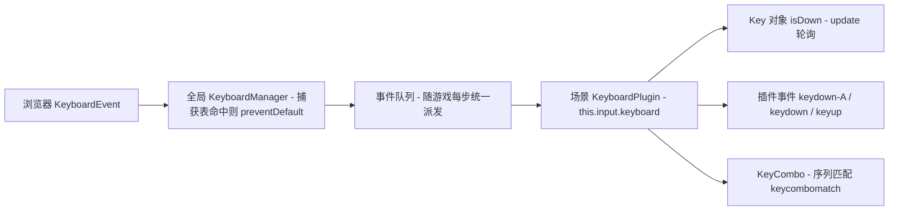

import { Canvas, Controls, Meta } from '@storybook/addon-docs/blocks';
import * as KeyboardInput from './keyboard-input.stories';

<Meta of={KeyboardInput} name="Docs" />

# 键盘

Phaser 的键盘输入集中在一个场景级插件上:`this.input.keyboard`(`KeyboardPlugin`,类型为 `KeyboardPlugin | null`,TS 里注意判空)。消费按键输入有两条主通路——**创建 Key 对象、在 `update` 里轮询 `isDown`**,适合驱动持续行为(按住移动);**监听键盘事件**(`keydown-A` 点分事件、全局 `keydown` / `keyup`),适合响应单次动作(跳跃、确认、暂停)。围绕两条通路还有三件事:用**按键捕获**(capture)拦掉浏览器默认行为(方向键滚页、空格提交);用 `enabled` / `resetKeys` 管理**开关与卡键**;用 **KeyCombo** 识别按键序列。本课按「状态轮询 → 事件 → 捕获与开关 → 序列」的顺序展开。指针与拖拽属于 [2.4.2 指针与交互](?path=/docs/pointer-input--docs),手柄属于 [2.4.3 游戏手柄](?path=/docs/gamepad-input--docs);用 `setVelocityX` 配合物理体移动已在 [1.5 第一个小游戏](?path=/docs/first-game--docs) 出现,本课范例直接改坐标,物理细节见 [3.1 Arcade 物理](?path=/docs/arcade-physics--docs)。

**操作前提:键盘事件默认挂在 `window` 上,且页面必须拥有焦点。**本页 Storybook Canvas 是 iframe,进入范例前先点击一下画布,按键才会到达游戏(排查细节见「常见问题」)。

原生按键事件先经过全局 KeyboardManager,再进入随游戏主循环派发的队列,最后由场景插件分流到三处消费点:



关键 API 的默认值(以下经 phaser@4.2.1 类型与源码核实):

| API / 属性 | 默认值 | 回查要点 |
| --- | --- | --- |
| `this.input.keyboard` | `KeyboardPlugin \| null` | 场景级插件;`input.keyboard: false` 可在 config 整体关闭 |
| `addKey(key, enableCapture, emitOnRepeat)` | `true` / `false` | 接受 Key 对象、键名串(如 `'W'`)或 keyCode;同键码重复调用返回同一实例 |
| `addKeys('W,A,S,D')` | 同上 | 返回以键名为属性的对象;对象入参可自定义属性名 |
| `createCursorKeys()` | — | 返回 `up / down / left / right / space / shift` 六个 Key |
| `Key.isDown` / `isUp` | `false` / `true` | 互斥;抬起后 `isDown` 立即为 `false` |
| `Key.duration` / `getDuration()` | `0` | 前者定格上一轮按住时长,后者按住期间实时增长 |
| `JustDown(key)` / `JustUp(key)` | — | 标志位一次性消费:检查到 `true` 即清零,直到下次按下 / 抬起 |
| `checkDown(key, duration)` | `0` | 按住期间每 `duration` ms 至多返回一次 `true` |
| 事件 `keydown-<KEY>` | — | 点分写法,KEY 用 KeyCodes 大写名(`UP`、`SPACE`);参数只有原生 event |
| 事件 `keydown` / `keyup` | — | 全局任意键;参数同为原生 event |
| `addCapture('UP,DOWN,SPACE')` | 空捕获表 | 全局生效;按住 Shift / Ctrl / Alt / Meta 的组合不拦截 |
| `KeyComboConfig` | `true / 0 / false / false` | 依次为 `resetOnWrongKey / maxKeyDelay / resetOnMatch / deleteOnMatch` |

## 快速上手

最小闭环:创建光标键组,在 `update` 里轮询并直接改坐标。

```ts
class Demo extends Phaser.Scene {
  private cursors?: Phaser.Types.Input.Keyboard.CursorKeys;
  private player?: Phaser.GameObjects.Image;

  create() {
    this.player = this.add.image(360, 200, 'player');
    this.cursors = this.input.keyboard?.createCursorKeys();
  }

  override update(_time: number, delta: number) {
    const { player, cursors } = this;
    if (!player || !cursors) {
      return;
    }
    const speed = 240 * (delta / 1000); // px/s 换算成本帧位移,帧率无关
    if (cursors.left.isDown) {
      player.x -= speed;
    }
    if (cursors.right.isDown) {
      player.x += speed;
    }
  }
}
```

`createCursorKeys` 默认顺带把方向键、空格、Shift 加入捕获表,按方向键不会滚动页面。要 WASD,把 `createCursorKeys` 换成 `addKeys('W,A,S,D')`(见下节)。[1.5 第一个小游戏](?path=/docs/first-game--docs) 用的是 `setVelocityX` 物理驱动——轮询代码完全相同,只是把「改坐标」换成「设速度」。

## 按键状态:Key 对象与轮询

Key 对象是 Phaser 给「一个物理键」建立的状态档案:`KeyboardPlugin.keys` 以 keyCode 为下标保存它们,插件每次处理事件队列时同步更新状态,你的 `update` 每帧读快照。同一个 keyCode 重复 `addKey` 不会创建新实例,而是返回已存在的那个——场景内一处创建、处处复用。

### 创建 Key:addKey、addKeys 与 createCursorKeys

三种创建入口,选择只看「你要哪几个键、想怎么命名」:

```ts
const keyboard = this.input.keyboard!;

// 单键:keyCode 常量、键名字符串或数字皆可
const space = keyboard.addKey(Phaser.Input.Keyboard.KeyCodes.SPACE);
const w = keyboard.addKey('W');

// 多键一:逗号分隔字符串 → 返回以键名为属性的对象
const wasd = keyboard.addKeys('W,A,S,D') as Record<'W' | 'A' | 'S' | 'D', Phaser.Input.Keyboard.Key>;

// 多键二:对象入参 → 自定义属性名(语义化)
const move = keyboard.addKeys({
  up: Phaser.Input.Keyboard.KeyCodes.W,
  down: Phaser.Input.Keyboard.KeyCodes.S,
});

// 快捷方式:up / down / left / right / space / shift 六键
const cursors = keyboard.createCursorKeys();
```

要点:

- `addKeys` 的 TS 返回类型是宽泛的 `object`,取属性前需要断言(上面 `as Record<...>`);`createCursorKeys` 有完整的 `CursorKeys` 类型,`cursors.left.isDown` 直接可用。
- 键名字符串不区分大小写(`'w'` 与 `'W'` 等价),内部先 `toUpperCase()` 再查 `KeyCodes`;非字母键用 `'UP'`、`'SPACE'`、`'ESC'` 这类 KeyCodes 名称。
- 两个可选参数(三种入口通用):`enableCapture`(默认 `true`,顺带把该键加入全局捕获表,详见「按键捕获与默认行为」)和 `emitOnRepeat`(默认 `false`,按住时 Key 自身 `down` 事件是否随系统重复触发,详见「键盘事件」)。
- 清理:`removeKey(key)`、`removeAllKeys()`;不销毁 Key 只复位状态用 `resetKeys()`(见「开关与作用域」)。

### 状态读数:isDown、duration 与 getDuration()

| 读数 | 含义 | 更新时机 |
| --- | --- | --- |
| `isDown` / `isUp` | 按下 / 抬起,始终互斥 | 每次事件队列处理时 |
| `timeDown` / `timeUp` | 最近按下 / 抬起的时间戳(原生 `event.timeStamp`) | 状态切换那一刻 |
| `getDuration()` | **当前**这次已按住多久,ms;未按下时为 0 | 每次调用实时计算(`loop.time - timeDown`) |
| `duration` | **上一轮**完整按住的时长,ms | 按下时清 0,抬起时定格为 `timeUp - timeDown` |
| `repeats` | 本轮按下里系统自动重复的次数 | 按下期间递增,抬起清 0 |
| `altKey` / `ctrlKey` / `shiftKey` / `metaKey` / `location` | 触发那一下的修饰键状态 | 每次事件刷新 |

最容易混的是 `duration` 与 `getDuration()`:按住期间读 `getDuration()` 看实时增长,松手后它归 0,想留住「刚才按了多久」读 `duration`。`emitOnRepeat: true` 时 `repeats` 可用来区分「真按了很多次」和「按住不放」。

修饰键四个属性挂在**每个** Key 上,记录的是该键触发那一刻的组合状态——`W` 键的 `ctrlKey` 为 `true` 意味着刚才按下的是 Ctrl+W,适合做快捷键判定。

### 单次触发:JustDown、JustUp 与 checkDown

轮询 `isDown` 回答「现在按着吗」,跳跃、开火这类「每次按下只算一次」的动作要换工具。`Phaser.Input.Keyboard.JustDown(key)` 是**标志位消费制**:按下时插件把内部标志置位,你第一次检查返回 `true` 并同时清零,之后再查都是 `false`,直到松开重按。

```ts
override update() {
  // 每帧检查一次:等价于「本帧是按下后的第一次被查」
  if (Phaser.Input.Keyboard.JustDown(this.space)) {
    this.jump(); // 按住空格只会跳一次;松开再按才会再跳
  }
}
```

两个必须知道的边界:

- **它不是「只有按下后那一帧为真」。**你不检查,标志就一直保持 `true`,三秒后补查仍会返回一次 `true`。所以规范用法是在 `update` 里每帧查一次;漏查几帧不会丢动作,但同一次按下不会被统计两次。
- `JustUp(key)` 同理,作用于抬起瞬间(每次释放只返回一次 `true`)。

需要「按住时以固定节奏触发」(如按住开火每 150ms 一发)用 `this.input.keyboard.checkDown(key, duration)`:按住期间每 `duration` 毫秒至多返回一次 `true`,松手后节奏计时随之复位,比自己在 `update` 里维护计时器省事。

下面是键盘实验台:方块用光标键 / WASD 移动(坐标驱动,`speed` Controls 参数即时生效),readout 汇总本课三条线的证据——各键 `isDown`、事件计数、`JustDown` 与两个 duration 的派生状态。**先点击画布获得焦点**再按键;K 键故意**没有**注册 Key 对象,用来对比事件重复派发行为(见下节)。

<Canvas of={KeyboardInput.KeyboardLab} />
<Controls of={KeyboardInput.KeyboardLab} />

| 读者操作 | 可观察证据 |
| --- | --- |
| 点击画布后按 ←/→/↑/↓ | 对应光标键 `isDown` 变 1,其余为 0;方块按方向移动,坐标读数同步 |
| 按 W A S D | `W A S D isDown` 对应位变 1;光标键读数不动——两组是独立的 Key 对象 |
| 同时按 W + A | 两组读数同时为 1,方块走斜向且速度不变(范例里做了归一化) |
| 调「移动速度」 | 同样按住时长内位移变大/变小;速度乘的是帧间隔,与帧率无关 |
| 按住 W 不放 | `getDuration()` 持续增长;`keydown-W` 计数停在本次按下 +1 不再增加 |
| 松开 W | `getDuration()` 归 0,`duration` 定格为刚才那轮的毫秒数;`keyup` 计数 +1,最近 `keyup` 变为 W |
| 快速连按 W 数次 | `JustDown(W)` 触发数与按下次数一致,每次恰好 +1;按住期间不增 |
| 按住未注册的 K 键 | 全局 `keydown` 计数持续 +1(系统重复每次都派发),`event.repeat` 变为 `true` |
| 打开「W 键 emitOnRepeat」 | 按住 W 时 `Key down(W)` 计数随系统重复持续 +1;`keydown-W` 计数依旧停着——两套重按语义不同 |
| 关闭「keyboard.enabled」 | 所有按键、事件计数、duration 全部冻结;重新打开后恢复(期间按的键会被积压补发) |
| 打开 Show code | 看到该 Canvas 实际执行的 `keyboard-lab.ts` 全文 |

实例滚出视口或页面切到后台时会整体休眠以省资源,回到视口自动恢复;休眠期间按的键会滞留队列,唤醒后一并派发,readout 可能瞬时跳变。

## 键盘事件:keydown 与 keyup

事件适合「按下这一下要触发什么」的逻辑:不用每帧轮询,回调里拿到完整的原生事件。四类入口:

| 监听写法 | 触发条件 | 回调参数 |
| --- | --- | --- |
| `keyboard.on('keydown-A', fn)` | 指定键按下;`-` 后接 KeyCodes 大写名(`'keydown-UP'`、`'keydown-SPACE'`) | `(event)` |
| `keyboard.on('keydown', fn)` | 任意键按下(ANY_KEY) | `(event)` |
| `keyboard.on('keyup-A', fn)` / `keyboard.on('keyup', fn)` | 对应抬起 | `(event)` |
| `key.on('down', fn)` / `key.on('up', fn)` | Key 对象自身状态切换 | `(key, event)` |

参数里的 `event` 是**原生 DOM `KeyboardEvent`**,直接用它的属性:`keyCode`(与 KeyCodes 常量对应)、`key`(字符名)、`repeat`(是否系统自动重复)、`timeStamp`、`altKey` / `ctrlKey` / `shiftKey` / `metaKey`。Key 对象的 `down` / `up` 事件多送一个 `key` 参数,读状态更方便。

**重按语义是本课最细的坑,分三层**(上面实验台可逐一验证):

- 浏览器对按住的键持续派发带 `repeat: true` 的原生事件,间隔由系统重复率决定;
- 插件层分发时,**该键已注册 Key 且 `isDown` 为真 → `keydown-<KEY>` 与全局 `keydown` 都不重发**(每次按下只各派发一次);**未注册 Key 的键则每次重复都派发**——所以按住 K 时全局计数会持续增长、按住 W 时不会;
- Key 对象自身的 `down` 事件默认也被重复抑制,要「按住也算」传 `emitOnRepeat: true`(或 `key.setEmitOnRepeat(true)`)。

事件不是在 DOM 回调里同步触发的:原生事件先进入全局队列,游戏每步在 `update` 之前统一派发。因此回调与游戏帧天然对齐;主循环休眠(离屏、后台)期间事件积压,唤醒后一并补发,完全相同的重复事件会被去重跳过。

## 按键捕获与默认行为

浏览器对部分按键有默认行为:方向键与空格滚动页面、退格导航历史。游戏接管这些键时要调 `preventDefault`,Phaser 用「全局捕获表」集中管理:

```ts
const keyboard = this.input.keyboard!;

// 键名串 / 单个 keyCode / 数组(可混用字符串与数字)皆可
keyboard.addCapture('UP,DOWN,LEFT,RIGHT,SPACE');
keyboard.addCapture('W,S,A,D');
keyboard.addCapture(62);

keyboard.removeCapture('SPACE'); // 移除;clearCaptures() 清空全部
keyboard.getCaptures();          // 当前捕获的 keyCode 数组
```

行为要点(已按 4.2.1 源码核实):

- **捕获是全局的,不属于场景。**在任何一个场景里 `addCapture`,全部场景一起生效;`removeCapture` / `clearCaptures` 同理。
- **带修饰键的组合不拦截。**按住 Shift / Ctrl / Alt / Meta 时不调 `preventDefault`,浏览器快捷键(Ctrl+W、Cmd+R)不受影响;只有「裸按」捕获表里的键才拦截。
- `addKey` / `addKeys` / `createCursorKeys` 默认 `enableCapture: true`——**创建 Key 就等于捕获了它**,所以快速上手的范例按方向键不会滚页;传 `false` 可关掉这层自动捕获。
- 总开关:`enableGlobalCapture()` / `disableGlobalCapture()`(即 `manager.preventDefault` 布尔)暂停 / 恢复全部捕获而不动捕获表,适合切到 DOM 输入框时临时放行。
- 也可以在 Game config 预设:`input: { keyboard: { capture: [37, 38, 39, 40] } }`;`input.keyboard.target` 可把监听目标从默认的 `window` 换成指定 DOM 元素。

## 开关与作用域

三个层级的 `enabled`,从大到小:

| 开关 | 作用范围 | 行为 |
| --- | --- | --- |
| config `input.keyboard: false` 或 `manager.enabled` | 整个游戏 | 键盘监听整体停摆 |
| `this.input.keyboard.enabled` | 当前场景的 KeyboardPlugin | 该场景不再消费事件队列;`isActive()` 返回 `false`,`checkDown` 恒 `false` |
| `key.enabled` | 单个 Key 对象 | 该键状态不再更新、自身 `down` / `up` 事件不触发 |

场景级 `enabled = false` 有一个必须知道的细节:**事件不会被丢弃,而是滞留在全局队列里**,重新启用后会在下一帧一并派发(实验台里关掉再打开,能看到计数跳变补账)。要的是「干净的暂停」时,恢复后调 `resetKeys()` 把按键状态清零。

多场景并行时,**每个活动场景的 KeyboardPlugin 都会处理同一条事件队列**,即一个按键会广播给所有场景;回调里可用 `event.stopPropagation()`(不再传给后续场景)或 `event.stopImmediatePropagation()`(连本场景后续监听也不传)截断。最省心的做法仍是让不接键盘的场景 `enabled = false`。

复位工具:`resetKeys()` 把本插件创建的全部 Key 恢复成未按下状态(`isUp = true`、`duration = 0`、`repeats = 0` 等,不动 `enabled` 与捕获);单个键用 `key.reset()`。场景 shutdown 时插件会自动 `resetKeys`。窗口失焦等情况下丢掉 `keyup` 导致方向键「卡在按下」时,回到游戏先 `resetKeys()` 是标准处理。

## 按键序列:KeyCombo

识别「依序按下的一串键」(秘籍、密码)用 `createCombo`,序列可以是字符串(`'PHASER'`,逐字符)或 keyCode 数组;匹配成功时插件派发 `keycombomatch`,参数为 `(combo, event)`:

```ts
const keyboard = this.input.keyboard!;

keyboard.createCombo([Phaser.Input.Keyboard.KeyCodes.UP, Phaser.Input.Keyboard.KeyCodes.UP, Phaser.Input.Keyboard.KeyCodes.DOWN]);
keyboard.createCombo('PHASER');

keyboard.on('keycombomatch', (combo: Phaser.Input.Keyboard.KeyCombo, event: KeyboardEvent) => {
  // combo.matched 已置 true;之后的行为由 resetOnMatch / deleteOnMatch 决定
});
```

配置项与默认值:

| 配置 | 默认值 | 含义 |
| --- | --- | --- |
| `resetOnWrongKey` | `true` | 按到序列外的键,进度归零重来 |
| `maxKeyDelay` | `0` | 相邻两键的最大间隔 ms,超过复位;`0` 不限 |
| `resetOnMatch` | `false` | 匹配后立即归零进度、允许再次匹配 |
| `deleteOnMatch` | `false` | 匹配后 combo 自毁 |

读数:`combo.progress`(0–1 完成度)、`index`(正等待第几个,0 起)、`size`、`matched` / `timeMatched`。**默认配置下 combo 是一次性的**:`matched` 置 `true` 后不再响应任何按键,`progress` 停在 100%;要能反复匹配给 `resetOnMatch: true`(匹配即归零重来),要自动清理给 `deleteOnMatch: true`。下面是最小实验:输入科乐美密码 ↑↑↓↓←→←→BA,格子逐格点亮;调整 `maxKeyDelay` 后放慢输入可以看到超时复位。**先点击画布获得焦点。**

<Canvas of={KeyboardInput.ComboProbe} />
<Controls of={KeyboardInput.ComboProbe} />

| 读者操作 | 可观察证据 |
| --- | --- |
| 依次按 ↑ ↑ ↓ ↓ | 格子逐格点亮,`index` 递增,`progress` 走到 40% |
| 中途按一个序列外的键(如 K) | `resetOnWrongKey` 为 true 时进度立即归零;关闭后进度保持 |
| 「相邻键最大间隔」设 500 后放慢输入 | 相邻两键隔超过 500ms,进度复位;`0` 时无论多慢都不复位 |
| 完整输入序列 | `keycombomatch` 次数 +1,画布显示提示,`progress` 保持 100% |
| 匹配后再输入整段序列 | 次数不再增加——默认一次即止;要反复触发需代码里 `resetOnMatch: true`(本实验台固定用默认值) |
| 打开 Show code | 看到该 Canvas 实际执行的 `key-combo.ts` 全文 |

## 最佳实践

- **按行为类型选通路:**持续状态(移动、推进)轮询 `isDown`;单次动作(跳跃、确认)用 `keydown-<KEY>` 事件或 `JustDown`;按住节奏触发用 `checkDown(key, 150)`。不要用 `isDown` 做单次动作——帧率越高触发越密。
- **移动位移乘 `delta`:**`update(time, delta)` 里用 `speed * delta / 1000`,与帧率解耦;物理体则改设速度,细节见 [3.1 Arcade 物理](?path=/docs/arcade-physics--docs)。
- **捕获保持最小集:**只捕获游戏实际接管的键;依赖 `addKey` 的默认捕获即可,避免整页 `preventDefault` 影响无障碍与滚动。需要临时放行(弹出 DOM 输入框)用 `disableGlobalCapture()`,关闭后恢复。
- **多场景只留一个键盘主人:**并行场景里让非活动场景 `this.input.keyboard.enabled = false`,比在每个回调里判场景干净,也省掉跨场景广播。
- **失焦恢复先复位:**窗口失焦可能吃掉 `keyup`,回到游戏调 `resetKeys()` 清掉卡住的键,再按需重捕获焦点。

## 常见问题

- **按键没反应,代码看起来完全正确。**
  先确认页面焦点:Phaser 默认在 `window` 上监听键盘,页面(或嵌入游戏的 iframe)必须有焦点。点击一下游戏画布再试;本页 Storybook Canvas 是 iframe,每个范例都要先点画布。仍无效时按链路排查:config 是否设了 `input.keyboard: false`;场景是否 `this.input.keyboard.enabled = false`;个别键是否 `key.enabled = false` 或被浏览器扩展接管(见下条)。
- **个别键永远收不到(比如 D 或反引号)。**
  检查浏览器扩展:vimium 会接管 D 键、EverNote 接管反引号,密码管理器也常吃按键;用无痕窗口或换浏览器对照。另外部分键盘硬件有按键冲突(ghosting),某些组合无法同时按下,可换键盘或改键位验证。
- **按住方向键或空格时页面跟着滚动。**
  这些键未进捕获表。给它们 `addCapture('UP,DOWN,LEFT,RIGHT,SPACE')`;若用的是 `addKey(..., false)` 显式关了自动捕获,这里要自己补。按住 Ctrl/Cmd 的组合默认不拦截,浏览器快捷键不受影响。
- **`keydown` 回调在按住时只触发一次,想要「按住持续触发」。**
  这是插件层的重复抑制(该键注册了 Key 后,按住不再重发)。三个选择:改用 `isDown` 轮询(持续行为首选);给该 Key `emitOnRepeat: true` 让 Key 自身 `down` 事件随系统重复触发;用 `checkDown(key, ms)` 按固定节奏消费按住。
- **恢复窗口 / 切回标签页后,角色自己一直走(或事件突然连环补发)。**
  失焦期间丢掉 `keyup` 导致 Key 卡在 `isDown`,滞留队列的事件在恢复后一并派发。回到游戏先 `resetKeys()` 复位按键状态;需要在失焦时自动处理,可监听窗口 `blur` 事件调用它。
- **`addKeys('W,A,S,D')` 取属性报 TS 错误。**
  返回类型是宽泛的 `object`,需要断言:`as Record<'W' | 'A' | 'S' | 'D', Phaser.Input.Keyboard.Key>`;或改用对象入参自定义属性名。

## 总结回顾

摘要:

Phaser 键盘输入经由「window 监听 → 全局捕获判断 → 事件队列 → 场景 KeyboardPlugin 派发」的固定链路,再分三条消费支线。持续行为轮询 Key 对象:`createCursorKeys` / `addKeys('W,A,S,D')` 创建,`isDown` 每帧读,`getDuration()` 看实时按住时长、`duration` 定格上一轮;单次动作用 `JustDown` 的标志位消费语义或 `keydown-<KEY>` / `keydown` 事件,`checkDown` 提供按住节流。重按行为分三层:系统重复事件 `event.repeat`、插件层对已注册 Key 的按住抑制、Key 自身的 `emitOnRepeat`。捕获表全局生效且默认覆盖 `addKey` 创建的键,带修饰键的组合不拦截;`enabled` 分游戏 / 场景 / 单键三级,场景级关闭会让事件积压补发,失焦卡键用 `resetKeys()` 复位。序列输入用 `createCombo` + `keycombomatch`。移动逻辑本课直接改坐标并乘 `delta`,物理驱动见 3.1。

一句话:

> 键盘输入先分清「按住的状态」还是「按下的一下」——前者轮询 `isDown`,后者用 `JustDown` 或 `keydown-<KEY>` 事件,其余都是这条链路上的管理细节。

知识要点:

- `addKey` / `addKeys` / `createCursorKeys` 各返回什么,默认参数是什么?
- `duration` 与 `getDuration()` 各在什么时候有值?
- `JustDown` 的「一次消费」语义与 `keydown-<KEY>` 事件如何取舍?
- 按住一个键时,插件事件、全局事件、Key 自身事件各自触发几次?由什么控制?
- 怎么阻止方向键滚动页面?修饰键组合为何不受影响?
- 场景级 `enabled = false` 期间按键去了哪里?恢复时会发生什么?
- `KeyCombo` 的四个配置项默认值分别是什么?

## 参考资料

- [@官方@Phaser 官方文档](https://docs.phaser.io/) — KeyboardPlugin / Key / KeyCombo 的 API 页与键盘输入指南
- [@官方@官方示例库](https://phaser.io/examples/) — keyboard 分类下的可运行示例
- [@官方@Phaser 4 Labs 示例浏览器](https://labs.phaser.io/phaser4-index.html) — Phaser 4 专用示例,含输入部分
