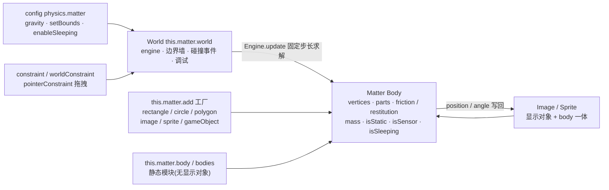

import { Canvas, Controls, Meta } from '@storybook/addon-docs/blocks';
import * as MatterPhysics from './matter-physics.stories';

<Meta of={MatterPhysics} name="Docs" />

# Matter 物理

Matter 是 Phaser 内置的**完整刚体物理引擎**:刚体可以是任意凸多边形、圆或多个零件组成的复合体,带真实的**旋转、质量、摩擦与动量交换**,还能用**约束**把两个刚体或刚体与世界连起来(摆锤、吊桥、布娃娃),用**鼠标拖拽**直接抓起任何刚体。它与 [3.1 Arcade 物理](?path=/docs/arcade-physics--docs)解决的不是同一类问题:Arcade 每步把「速度 += 力 × delta」积分到轴对齐的矩形盒上,快而便宜;Matter 则对多边形顶点做完整的碰撞求解,能堆叠、能翻滚、能绕销转动。

理解 Matter 只需三层:**config 启用** `physics: { default: 'matter' }` 之后,场景获得 `this.matter` 入口;它既是**工厂**(`this.matter.add.*`,创建刚体、约束并自动入世界),也是 Matter.js 静态模块的别名集合(`this.matter.body` / `bodies` / `composite` 等);所有刚体、约束与事件归 **World**(`this.matter.world`)管,它内部包着真正的 Matter 引擎(`world.engine`)。本课按「启用与工厂 → 形状与复合体 → 物理属性 → 约束 → 拖拽 → 碰撞事件与传感器 → 休眠」展开,用一个堆叠实验台串起全部证据,最后给出与 Arcade 的取舍表。



关键 API 的默认值(以下经 phaser@4.2.1 类型与源码核实):

| API / 属性 | 默认值 | 回查要点 |
| --- | --- | --- |
| `physics: { default: 'matter' }` | 不启用 | 不配置则 `this.matter` 为 `undefined` |
| `matter.gravity` | `{ x: 0, y: 1, scale: 0.001 }` | **比例量**,不是 Arcade 的 px/s²;改用 `world.setGravity(x?, y?, scale?)` |
| `matter.enableSleeping` | `false` | 引擎级休眠开关,详见「休眠」 |
| `positionIterations` / `velocityIterations` / `constraintIterations` | `6 / 4 / 2` | 求解精度:越大越稳越贵;堆叠抖动时先调它 |
| `matter.runner` / `autoUpdate` | `{ delta ≈ 16.666 ms }` / `true` | 固定步长累加器,掉帧会补步;`autoUpdate: false` 后自己调 `world.step(delta)` |
| `matter.setBounds` | 不启用 | `true` = 按画布四边建静态墙,否则刚体会掉出世界 |
| `body.friction` / `frictionStatic` / `frictionAir` | `0.1 / 0.5 / 0.01` | 表面滑动 / 静摩擦 / 每步空气阻力(比例衰减) |
| `body.restitution` | `0` | 反弹;成对取 `Math.max(bodyA, bodyB)`,非乘法 |
| `body.density` | `0.001` | 质量 = 密度 × 面积;`setMass` 会反推密度 |
| `body.isSensor` / `isStatic` / `isSleeping` | 均 `false` | 只检测不分离 / 退出积分 / 退出模拟 |
| `body.sleepThreshold` | `60` | 连续近零速度的步数,达到即休眠 |
| `constraint.stiffness` / `damping` | `1`(length 为 0 时 `0.7`)/ `0` | 1 = 刚性;`< 1` = 弹簧;damping 抑制振荡 |
| `constraint.length` | 按两锚点初始距离自动算 | 销接:`length: 0` + `stiffness ≥ 0.7` |
| `pointerConstraint` 拖拽约束 | `{ stiffness: 0.1, length: 0.01 }` | 橡皮筋手感;参数在创建 options 里改 |

## 快速上手

「启用 → 造地面 → 点击生成刚体 → 能拖拽」的最小闭环,就是本课实验台的骨架:

```ts
// 1. game config 启用 Matter(全局一次)
new Phaser.Game({
  // ...尺寸、场景等
  physics: {
    default: 'matter',
    matter: { gravity: { x: 0, y: 1 }, enableSleeping: false },
  },
});

// 2. 场景里造一面静态地板,再开鼠标拖拽
create() {
  // 纯刚体(无显示对象):isStatic = 永不移动的关卡几何
  this.matter.add.rectangle(360, 390, 720, 20, { isStatic: true });

  // 点击空白处生成一个会下落、翻滚、堆叠的矩形刚体
  this.input.on('pointerdown', (p) => {
    this.matter.add.rectangle(p.worldX, p.worldY, 44, 30);
  });

  // 一行开启鼠标拖拽:此后按住任意刚体即可拖动
  this.matter.add.pointerConstraint();
}
```

跑起来就是一个可点击、可拖拽的物理沙盒。形状怎么换、复合体怎么拼、摩擦反弹质量怎么调、刚体之间怎么连,依次见下文;把本课实验台(见「工厂」一节的 Canvas)全部控件玩一遍,这些问题的答案都有直接证据。

## 启用与工厂

物理在 game config 里启用,`matter` 子对象是物理世界的初始配置(也可写在 Scene config 里):

```ts
new Phaser.Game({
  physics: {
    default: 'matter',
    matter: {
      gravity: { x: 0, y: 1 }, // 引擎默认;比例量,见下
      setBounds: true,          // 按画布四边建静态墙(也可 setBounds: { thickness: 64, top: false })
      enableSleeping: false,    // 休眠开关(默认 false)
      positionIterations: 6,    // 位置求解迭代(默认 6)
      velocityIterations: 4,    // 速度求解迭代(默认 4)
      constraintIterations: 2,  // 约束求解迭代(默认 2)
      debug: false,             // true 或调试配置对象
    },
  },
});
```

配置之后**每个场景**都注入 `this.matter`。它与 Arcade 的两点结构差异要记住:

- **重力不是 px/s²。** Matter 的重力是 `engine.gravity = { x: 0, y: 1, scale: 0.001 }` 的比例量,每步给刚体加 `mass × gravity × scale` 的力——改手感用 `this.matter.world.setGravity(0, 2)`(加速一倍)、`setGravity(0, 0)`(失重)。Phaser 3 的 `world.gravity` 属性在 Phaser 4 已移除,读值看 `world.localWorld.gravity`。
- **世界默认没有边界。** 不配 `setBounds`、不造静态地面,刚体会一路掉出画布外永不回来(它们还在模拟,只是看不见)。

`this.matter` 上除了工厂和 `world`,还挂了一组 Matter.js 原生模块的别名,直接当静态 API 用:

| 入口 | 对应 Matter 模块 | 用来做什么 |
| --- | --- | --- |
| `this.matter.add` | Phaser 工厂 | 创建刚体 / 约束 / 显示对象并自动入世界 |
| `this.matter.world` | Phaser 包装的 World | 边界、事件、暂停、调试、增删对象 |
| `this.matter.body` / `bodies` | Matter.Body / Bodies | 刚体静态操作与纯刚体工厂(无显示对象) |
| `this.matter.composite` / `composites` | Composite / Composites | 世界树操作;stack / chain / car 等组合体 |
| `this.matter.constraint` | Constraint.create | 手写约束配置时用 |
| `this.matter.query` / `vector` / `vertices` | Query 等 | 点选、射线、几何计算 |

### 工厂:this.matter.add

`this.matter.add` 分三组,按「要不要显示对象」选:

| 工厂方法 | 产物 | 用途 |
| --- | --- | --- |
| `rectangle(x, y, w, h, options?)` | 纯刚体 | 不需要贴图的箱子、几何;`isStatic: true` 造地面 / 墙 |
| `circle(x, y, r, options?, maxSides?)` | 纯刚体(正多边形逼近圆) | 球、滚轮;`maxSides` 默认 25 |
| `polygon(x, y, sides, r, options?)` | 纯刚体 | 正三 / 五 / 六边形骰子等 |
| `trapezoid(x, y, w, h, slope, options?)` | 纯刚体 | 梯形;`slope` 0 = 矩形、1 = 三角 |
| `fromVertices(x, y, vertexSets, options?)` | 纯刚体 / 复合体 | 任意顶点(自动凸分解) |
| `image(x, y, key, frame?, options?)` | `Matter.Image` | **显示与 body 一体**:贴图 + 物理 |
| `sprite(x, y, key, frame?, options?)` | `Matter.Sprite` | 同上,再多帧动画能力 |
| `gameObject(obj, options?, addToWorld?)` | 原对象 + body | 给已有对象补物理;`options` 也可以直接传一个现成 Body |
| `stack / pyramid / chain / mesh / newtonsCradle / car / softBody(...)` | Composite | 一行生成一摞 / 一串 / 一辆车 |

两组容易混淆的边界:

- **纯刚体没有显示对象。** `this.matter.add.rectangle` 返回的是 Matter Body,屏幕上什么都看不见,要么开 debug 绘制、要么自己按 `body.vertices` 画(本课实验台就是自绘),要看见贴图就用 `image` / `sprite`。反过来,`Matter.Image` / `Matter.Sprite` 的 `obj.body` 就是普通 Matter Body,所有静态模块函数都能对它用。
- **`isStatic: true` 造关卡几何。** 静态体退出积分(无速度、无重力),被撞不动;地面、墙、斜坡都用它。注意 `setStatic(true)` 会把 `restitution` 置 0、`friction` 置 1(详见「常见问题」)。

下面是本课主范例:**堆叠实验台**。点击空白处按 Controls 当前形状生成刚体落下堆叠;按住任意刚体(含左上摆锤)可直接拖拽;右下绿框是 `isSensor` 拾取区。Controls 六个参数实时生效,readout 给出刚体数、活动 / 休眠数、约束数、接触对与最近碰撞等派生证据;彩色线框是范例按 `body.vertices` 自绘的(复合体会逐 part 画出),半透明表示已休眠。

<Canvas of={MatterPhysics.StackingLab} />
<Controls of={MatterPhysics.StackingLab} />

| 读者操作 | 可观察证据 |
| --- | --- |
| 初始加载 | 六个预置刚体(3 矩形 + 2 圆 + 1 五边形)落下堆叠;矩形会因碰撞翻滚转向——多边形旋转是 Arcade 没有的行为 |
| 点击空白处 | 按当前形状生成刚体,`动态刚体总数` +1;总数超 60 后最早的被移除(`world.remove`) |
| 「生成形状」切到 `compound` 再点击 | 一个「横条 + 圆帽」刚体落下:自绘线框是**两个 part**,但整体一起旋转——复合体多零件一个刚体 |
| 按住任意刚体拖拽 | 刚体跟着指针走,松手带着惯性飞出;readout「正在拖拽」显示它的 label |
| 拖拽摆锤锤体 | 整个摆锤绕锚点被拉起,松手回摆——拖拽约束与摆锤约束互不冲突 |
| 把「重力 y」调到 0 | 全场漂浮,摆锤停止回摆(`setGravity(0, 0)` = 失重) |
| 把「frictionAir」调大 | 下落明显变慢、弹跳迅速止息;调回 0 刚体几乎不停弹 |
| 打开「enableSleeping」 | 堆稳定后「活动 / 休眠」变为 `0 活动 · N 休眠`,线框转半透明,「本步接触对」归 0——休眠体退出碰撞检测 |
| 拖拽一个已休眠的刚体 | 立即唤醒:线框恢复实色,活动数 +1(拖拽会强制唤醒) |
| 把「摆锤约束 stiffness」调低 | 摆杆变成橡皮筋:锤体被拖离后弹回并过冲振荡 |
| 把刚体丢进右下绿框 | 「传感器命中」累计 +1,刚体径直穿过不停下——`isSensor` 只报碰撞不分离 |
| readout「约束数」 | 恒为 2:摆锤的 `worldConstraint` + `pointerConstraint` 注入的拖拽约束 |
| 打开「debug 调试绘制」 | 官方线框与自绘线框重合,静态体(地面 / 墙 / 传感器)另用绿色描出 |
| 打开 Show code | 看到该 Canvas 实际执行的 `stacking-lab.ts` 全文 |

实例滚出视口或页面切到后台时会整体休眠以省资源,回到视口自动恢复;readout 冻结只说明循环暂停,不代表物理状态变化。

## 形状与复合体

给显示对象换形状有两条路:**创建时**在 `options.shape` 里写形状配置,**创建后**用 `setBody` / `setCircle` 一族重铸。不给 shape 时默认是**跟随贴图尺寸的矩形**(`setRectangle(width, height)`)。

```ts
// 创建时:options.shape 直接指定(推荐)
const ball = this.matter.add.image(100, 100, 'ball', undefined, {
  shape: { type: 'circle', radius: 24 },  // 省略 width/height 时取贴图尺寸
});
const gem = this.matter.add.sprite(200, 100, 'gem', undefined, {
  shape: { type: 'polygon', sides: 6, radius: 22 },
});

// 创建后:重铸(会重置属性,见下)
ball.setCircle(18);
gem.setPolygon(24, 5);                       // (radius, sides)
crate.setTrapezoid(44, 30, 0.5, options?);   // slope 0=矩形 1=三角
gem.setBody({ type: 'fromVerts', verts: '0 0 40 0 20 40' });  // 顶点路径
ball.setBody('circle');                      // 字符串简写,其余用默认
```

`shape` / `setBody` 配置对象的 `type` 取值与各自的回退默认:`rectangle`(宽高取贴图)、`circle`(`radius = max(w, h) / 2`,`maxSides = 25`)、`trapezoid`(`slope = 0.5`)、`polygon`(`sides = 5`)、`fromVerts` / `fromVertices`(顶点字符串或数组,自动凸分解,`removeCollinear = 0.01`、`minimumArea = 10`)、`fromPhysicsEditor`(PhysicsEditor 导出数据)。

必须记住的行为边界:**`setBody` / `setCircle` / `setPolygon` / `setTrapezoid` 重置该 body 此前的全部属性**——质量、摩擦、碰撞过滤统统回到默认,设过这些的话要重设一遍。只想换形状保留属性,先用变量存下再重新应用。

### 复合体:parts

复合体把多个凸多边形零件拼成**一个刚体**:`parts` 数组里的零件共享整体的质量、惯性与运动,一起平移旋转。这是做 L 形挡板、哑铃、不规则地形的标准做法:

```ts
// 零件用 this.matter.bodies 造(围绕原点拼),再 body.create 组合
const bar = this.matter.bodies.rectangle(0, -13, 58, 13);
const cap = this.matter.bodies.circle(0, 13, 13);
const body = this.matter.body.create({ parts: [bar, cap] });

// 质心在零件合成的位置,setPosition 把整体搬到目标点
this.matter.body.setPosition(body, { x: 360, y: 100 });
this.matter.world.add(body);
```

三条结构规则:

- `body.parts[0]` 是**父体自身**,其余才是零件;单形状刚体 `parts.length === 1`。遍历零件画线框 / 判定时从 `parts[1]` 开始(`length > 1` 时)。
- **约束要挂父体,不能挂零件**(工厂文档明示);碰撞事件的 `bodyA` / `bodyB` 也是父体,精确到零件要读 `pair.collision.parentA` 的子结构或 `body.parts`。
- 顶点必须是**凸多边形**;凹形先用 `fromVerts` 让 Matter 自动凸分解成复合体,或用 PhysicsEditor 导出。

另有 `chamfer`(顶点倒圆角,减少尖角卡住)与 `vertices`(直接给顶点数组)两个常用 `options`:`this.matter.add.rectangle(x, y, 44, 30, { chamfer: { radius: 4 } })`。批量拼装成串、成网、成车用 `this.matter.composites.stack / chain / newtonsCradle / car / softBody`,它们返回 Composite(内含刚体和约束),`world.add(composite)` 一次入世界。

## 物理属性:两个入口

同一批物理属性有两个设置入口,选哪个取决于手里是什么:

| 你拿着 | 入口 | 例子 |
| --- | --- | --- |
| `Matter.Image` / `Matter.Sprite` | 游戏对象组件方法 | `obj.setFriction(0.4)`、`obj.setBounce(0.6)` |
| 纯刚体、复合体零件、批处理 | `Matter.Body` 静态 API(`this.matter.body`)或直接改属性 | `this.matter.body.setMass(body, 5)`、`body.frictionAir = 0.02` |

游戏对象侧的常用方法(`Phaser.Physics.Matter.Image` / `Sprite` 自带):

```ts
const crate = this.matter.add.image(200, 100, 'crate');

crate.setFriction(0.4);                 // 表面滑动摩擦(默认 0.1)
crate.setFrictionStatic(0.8);           // 静摩擦:从静止被推动的难度(默认 0.5)
crate.setFrictionAir(0.02);             // 空气阻力:每步按比例衰减速度(默认 0.01)
crate.setBounce(0.6);                   // restitution(默认 0);成对取 max,不是乘法
crate.setMass(5);                       // 质量(默认 = 密度 0.001 × 面积)
crate.setVelocity(120, -40);            // 立即速度,px/s
crate.setAngularVelocity(0.05);         // 角速度,rad/s
crate.setFixedRotation();               // 惯性无穷大:永不翻转(平台角色的箱子常用)
crate.setIgnoreGravity(true);           // 局部失重(世界重力照常影响别人)
crate.applyForce(new Phaser.Math.Vector2(0, -0.05)); // 施力(注意量级,见下)
crate.thrust(0.02);                     // 沿朝向推进(飞船;force 家族另有 4 个方向)
```

静态 API 侧是同一批语义(`this.matter.body` = Matter.Body 模块):`setMass` / `setDensity` / `setVelocity` / `setAngularVelocity` / `setPosition`(瞬移,清速度)/ `setAngle` / `rotate` / `scale` / `applyForce(body, position, force)`,以及万能的 `set(body, { friction: 0.2, isSleeping: false })`。本课实验台全是纯刚体,用的就是这一侧。

三个容易栽的语义差异(与 Arcade 对照着记):

- **`force` 只在当前步生效。** `applyForce` 加的力下一步就被清零,持续推力(火箭、风)要在 `update` 里每步施加;量级也很小——一个 44×30 的箱子质量约 0.6,`y: -0.05` 的力已经很明显。瞬时改变运动用 `setVelocity`,持续影响用每步 `applyForce`。
- **反弹是「取最大」不是「相乘」。** 一对刚体的有效 restitution 是 `Math.max(bodyA.restitution, bodyB.restitution)`:一边 0 就全靠另一边,一边 1 就全弹。要「墙不弹、球自弹」就把墙设 0、球自定。
- **摩擦是三种。** `friction` 管接触面滑动(冰面 0.005、橡胶 1),`frictionStatic` 管从静止被推动(默认 0.5,越大越难推动),`frictionAir` 管空中每步的比例衰减(羽毛 0.1、炮弹 0)。调「手感滑不滑」先分清改的是哪一个。

## 约束与关节

约束(constraint)强制维持两个点之间的距离:`constraint` 连**两个刚体**,`worldConstraint` 把**刚体连到世界固定点**(摆锤、吊桥的锚)。工厂返回 Matter 约束并自动入世界:

```ts
// 双体约束:吊桥的两块板(bodyA、bodyB 也接受游戏对象)
this.matter.add.constraint(plankA.body, plankB.body, 40, 0.9, {
  pointA: { x: 20, y: 0 },  // 相对 bodyA 中心的锚点偏移(不写 = 中心)
  pointB: { x: -20, y: 0 },
});

// 世界锚点:摆锤(本课实验台左上就是它)
this.matter.add.worldConstraint(bob, 104, 1, {
  pointA: { x: 104, y: 18 },   // 世界坐标锚点
});
```

三个参数决定约束「是什么关节」:

- **`length`**(不传按两锚点初始距离自动算):目标静止长度。**`length: 0` + `stiffness ≥ 0.7` = 销接 / 转轴**(revolute,绕锚点自由旋转);非零长度则是「等距杆」或弹簧。
- **`stiffness`**(默认 1):1 = 刚性,每步硬拉回目标长度;`0.1 ~ 0.2` = 软弹簧,可拉伸过冲;过低约束会疲软、堆叠会塌。实验台把摆锤 stiffness 调低就能看到杆变橡皮筋。
- **`damping`**(默认 0):约束振荡的阻尼。弹簧刚度低导致来回弹时,给 `damping: 0.05 ~ 0.1` 让它快速收敛;0 = 永不衰减。

两条判断依据:

- **约束按质量倒数分配位移**(`inverseMass`):静态体、`setFixedRotation` 后的特定方向都是「拉不动的一端」,约束把形变全部推给可动的一端。两端都静态的约束没有意义。
- **约束不稳(抖动、爆炸)时**,按官方建议降 `stiffness`、升 config 的 `constraintIterations`(默认 2),或拆成多个弱约束;`this.matter.getConstraintLength(constraint)` 可查当前实际长度。

增删与别名:工厂创建即自动 `world.add`;自己 `this.matter.constraint.create(options)` 造的(或拿到引用的)用 `world.add(constraint)` 入世界——Phaser 3 的 `world.addConstraint` 在 Phaser 4 已并入通用 `world.add`(按对象 `type` 分发),移除统一用 `world.removeConstraint(constraint)`。`joint` / `spring` 是 `constraint` 的别名;成串、成网的批量约束直接用 `this.matter.composites.chain / mesh`。

## 鼠标拖拽

鼠标拖拽是 Matter 最讨喜的交互:一行开启,任何刚体都能被指针抓住拖着走——原理是指针背后挂着一个**世界锚点约束**,按住时对命中的刚体施加拉力,不是直接改坐标,所以拖着撞别的刚体、甩出去的惯性全都真实。

```ts
// 一行开启(可省略 options;stiffness 越小橡皮筋感越强)
const pointer = this.matter.add.pointerConstraint({ stiffness: 0.1 });

// 世界级拖拽事件:dragstart (body, part, constraint) / drag / dragend
this.matter.world.on('dragstart', (body) => {
  console.log('抓住', body.label);
});

// 读状态:pointer.body 是正在拖的刚体(无则 null);松手可强制 stopDrag()
```

三个行为边界(实现核实):

- **命中条件**:指针按下时对世界全部活动刚体做顶点命中测试,要求 `body.ignorePointer !== true` 且刚体的 `collisionFilter` 与拖拽约束兼容;命中后锚在点击位置(`constraint.pointB` 记录相对偏移),所以拖边角会让刚体旋转。
- **拖拽会唤醒休眠刚体**(实现里显式 `Sleeping.set(body, false)`),所以休眠开关打开也不妨碍抓起静止的箱子;不想某个刚体被抓,创建时 `ignorePointer: true`。
- **命名与类型**:Phaser 3 的 `mouseConstraint` 在 Phaser 4 更名为 **`pointerConstraint`**(`mouseSpring` 是别名),返回 `Phaser.Physics.Matter.PointerConstraint` 实例(`.constraint` 是底层约束、`.body` / `.part` 是当前拖拽目标、`.active` 可整体开关、`.stopDrag()` 强制松手)。d.ts 把工厂返回值标成 `MatterJS.ConstraintType`,要访问这些成员需按实际类型断言(实验台源码里有示例)。

## 碰撞事件与传感器

Matter 没有 Arcade 那种 `collider` / `overlap` 注册表——**碰撞由引擎自动求解**(分离、摩擦、动量交换全管),你只是订阅事件知道「谁碰了谁」。三种 World 级事件:

```ts
const world = this.matter.world;

// 开始接触 / 持续接触 / 分离离开,同一帧可多对同时发生
world.on('collisionstart', (event, bodyA, bodyB) => { /* 落地音效、生成特效 */ });
world.on('collisionactive', (event) => { /* 持续接触逻辑(每步触发) */ });
world.on('collisionend',   (event) => { /* 离开地面、脱离触发区 */ });
```

**必须理解的回调签名**:`(event, bodyA, bodyB)` 里 `event.pairs` 是本步**全部**碰撞对,而 `bodyA` / `bodyB` 只是**最后一对**的两个刚体——同一帧多对碰撞时(刚体落地瞬间碰了地面和邻居)只看这两个参数会漏掉其余碰撞。正确姿势是遍历 `event.pairs`:

```ts
world.on('collisionstart', (event: Phaser.Physics.Matter.Events.CollisionStartEvent) => {
  for (const pair of event.pairs) {
    const a = pair.bodyA;        // 永远是父体(复合体不拆到零件)
    const b = pair.bodyB;
    if (a.label === 'pickup-zone' || b.label === 'pickup-zone') { /* ... */ }
  }
});
```

每个 pair(`MatterCollisionPair`)的可读字段:`bodyA` / `bodyB`(碰撞双方)、`collision`(细节:`normal` 碰撞法线、`tangent` 切线、`depth` / `penetration` 穿透深度、`supports` 接触点、`parentA` / `parentB` 复合体零件的父体)、`contacts` 接触点数组、`separation` 分离量、`isSensor`(本对是否含传感器)、`isActive`。

只关心一个对象时,订阅可以下沉到对象级,不必过滤世界事件:

```ts
player.setOnCollide((pair) => {          // 回调参数是 pair(不是 event)
  if (pair.bodyB.label === 'spike') kill();
});
player.setOnCollideWith(spike.body, (other, pair) => kill());  // 只盯一个目标
// 另有 setOnCollideActive / setOnCollideEnd;gameObject.on('collide', cb) 同义
```

### 传感器与碰撞过滤

**`isSensor: true` 的刚体只参与碰撞检测、不参与分离与求解**——别的刚体径直穿过,但 `collisionstart` / `collisionend` 照发(此时 `pair.isSensor` 为 true)。拾取区、触发区、视线检测都用它,对应 Arcade 里 `overlap` 的角色(实验台右下绿框就是静态传感器,命中数在 readout 累计而刚体不停留):

```ts
this.matter.add.rectangle(636, 361, 96, 56, {
  isStatic: true,     // 触发区通常不动
  isSensor: true,     // 只检测不分离
  label: 'pickup-zone',
});
```

要「谁和谁根本不碰撞」则用 **`collisionFilter`**(三个字段,对不上就不进求解):

- `category`(默认 `0x0001`):32 个位里给自己占一个;`this.matter.world.nextCategory()` 发号。
- `mask`(默认 `0xFFFFFFFF`):我接受哪些 category;`a.mask & b.category` 与 `b.mask & a.category` 都非 0 才碰。
- `group`(默认 `0`):**同正同组必碰,同负同组必不碰**,优先级高于 category / mask;`this.matter.world.nextGroup(true)` 取一个「互不碰撞」的负组。多肢体布娃娃自不打结、队友互相穿过,都靠它。

```ts
// 快捷工具(在 this.matter 上,对 body 或游戏对象都可用)
this.matter.setCollisionCategory(enemy.body, catEnemy);
this.matter.setCollidesWith(bullet.body, [catEnemy, catWall]);
this.matter.setCollisionGroup(armL.body, this.matter.world.nextGroup(true));
```

## 休眠

休眠是 Matter 的性能机制:刚体**连续 `sleepThreshold` 步(默认 60)速度近零**后进入休眠,彻底退出积分与碰撞检测,不再消耗求解开销;被活动刚体撞到、被拖拽、被施力都会自动唤醒。注意它是**引擎级开关**,默认关闭:

```ts
// config 全局开启
physics: { default: 'matter', matter: { enableSleeping: true } }

// 或运行时切换(立即生效;对已休眠刚体见下)
this.matter.world.engine.enableSleeping = true;
```

三个实操判断:

- **读状态用 `body.isSleeping`**(不是 `velocity === 0`——顶点速度为 0 也可能只是瞬间静止);实验台开启休眠后,readout 的「活动 / 休眠」与线框透明度直接展示这一位。被撞唤醒、拖拽唤醒都自动发生,通常不需要手动干预。
- **事件要显式开**:`obj.setSleepEvents(true, true)` 后,World 才发 `sleepstart` / `sleepend`(参数是 `(event)`,刚体在事件对象里);配套的对象方法还有 `setToSleep()`(强制入睡)、`setAwake()`(强制唤醒)、`setSleepThreshold(n)`。
- **关掉 `enableSleeping` 不会唤醒已睡着的刚体**——它们带着 `isSleeping: true` 冻在原地。切回时要自己唤醒:`this.matter.body.set(body, { isSleeping: false })` 或游戏对象 `obj.setAwake()`(实验台切开关时替你做了这一步)。

休眠换性能也换行为:睡着的刚体不参与碰撞检测,新落下的刚体可能穿过它(落下一方是活动的,碰撞会把睡眠方唤醒,但同帧穿透极端情况仍可能发生);对「堆着不动」的箱堆它是纯赚。大量刚体的进一步优化(对象池、渲染预算)见 [6.1.1 性能优化](?path=/docs/performance--docs)。

## Matter 与 Arcade 取舍

两套引擎解决不同的问题,先按玩法选型,再谈调参:

| 维度 | Arcade(3.1 / 3.2) | Matter(本课) |
| --- | --- | --- |
| 碰撞形状 | 轴对齐矩形(可改圆形) | 凸多边形 / 圆 / 顶点分解 / 复合体 |
| 旋转 | 仅视觉角度,不参与碰撞 | 完整刚体旋转、翻转、滚动 |
| 堆叠 / 杠杆 | 无(分离只做推开) | 真实堆叠、受力、倒塌 |
| 约束 / 关节 | 无 | constraint / 销 / 弹簧 / 软体 |
| 碰撞检测 | 手动注册 collider / overlap | 引擎自动求解,订阅事件即可 |
| 重力 | `gravity.y`,px/s² | 比例量 `{ x, y, scale }` |
| 性能 | 便宜,数百刚体轻松 | 求解贵,堆叠多时开休眠、控迭代 |
| 典型玩法 | 平台跳跃、弹幕、接物 | 愤怒的小鸟、消除堆叠、布娃娃、沙盒 |

取舍一句话:回答「谁撞了谁、往哪弹」用 Arcade([3.1](?path=/docs/arcade-physics--docs) 运动与重力、[3.2](?path=/docs/arcade-collision--docs) collider / overlap);需要刚体「真的转起来、堆起来、连起来」就换 Matter。两者也可共存于同一游戏的不同层(弹幕用 Arcade、掉落物用 Matter),但同一对象只能挂一套物理体。

## 最佳实践

- **关卡几何用纯静态刚体,不造显示对象。** 地面、墙、斜坡用 `this.matter.add.rectangle(..., { isStatic: true })`,只在需要玩家看见的地方贴图(`image` / `sprite`);纯刚体零渲染开销,debug 线框足够开发期对位。
- **世界边界只兜底,关卡用 `setBounds` + 静态体。** `setBounds: true` 四面墙防漏;真正的地面、斜台还是显式静态体,可控摩擦与反弹。掉出边界的刚体记得 `world.remove` 回收,否则它们永远在模拟。
- **约束从刚性往软调。** 先用默认 `stiffness: 1` 验证结构,再按手感降刚度、加 `damping`;抖动先升 `constraintIterations` 而不是硬压刚度。销接认准 `length: 0` + `stiffness ≥ 0.7`。
- **箱堆、颗粒类场景开 `enableSleeping`。** 稳定后整堆休眠,求解开销断崖下降;交互(点击 / 碰撞 / 拖拽)自动唤醒,不需要额外逻辑。
- **改手感先对表再动手。** 弹跳调 `restitution`(成对取 max)、滑动调 `friction`、推不动调 `frictionStatic`、下落粘滞调 `frictionAir`——三个摩擦管的现象完全不同,混着调会互相掩盖。

## 常见问题

- **`this.matter` 是 `undefined`。**
  game config 没配 `physics: { default: 'matter' }`。补上配置;场景里同时只能有一个默认物理系统,Arcade 与 Matter 不能都做 `default`(多引擎按 Scene config 分别指定)。
- **`collisionstart` 明明发生了,回调里 bodyA / bodyB 却「不对」。**
  回调参数的 `bodyA` / `bodyB` 只是本步**最后一对**,同帧多对碰撞时其余的都在 `event.pairs` 里。遍历 `event.pairs` 再按 `label` 或 `gameObject` 过滤。
- **刚体拖不动。**
  依次排查:`isStatic`(静态体 `inverseMass` 为 0,约束拉不动)、创建时给了 `ignorePointer: true`、`collisionFilter.mask` 没包含拖拽约束的 category。摄像机有滚动时,命中测试用的是世界坐标,确认传的是 `pointer.worldX / worldY`。
- **快速移动的子弹穿过了薄墙。**
  Matter 没有 CCD(连续碰撞检测),一步位移大于目标厚度就会隧穿。降低弹速、加厚墙体、提高 `positionIterations`,或把「子弹 vs 薄物」改用 Arcade / 射线查询(`this.matter.intersectRay`)。
- **`setCircle` / `setBody` 之后,之前设的质量、摩擦全变了。**
  `set*` 形状族会**重置 body 的全部属性**到默认。换形状后把 `setMass` / `setFriction` / 碰撞过滤重新应用一遍。
- **刚体 `setStatic(true)` 之后再切回动态,属性和预期不符。**
  转静态时引擎会把 `restitution` 置 0、`friction` 置 1、`mass` / `inertia` / `density` 变 `Infinity`,并把这些原值存进内部 `_original`;`setStatic(false)` 恢复的是**转静态那一刻**的值——静态期间手动改过的属性会被覆盖。切回动态后把关键属性重新设置一遍。
- **关掉 `enableSleeping` 后一部分刚体冻住不动。**
  已休眠的刚体不会因开关关闭而自动醒。逐个 `this.matter.body.set(body, { isSleeping: false })`(游戏对象用 `setAwake()`)。
- **`this.matter.world.gravity` 读不到值。**
  Phaser 4 移除了该属性:写用 `world.setGravity(x, y, scale)`,读用 `world.localWorld.gravity`(`{ x, y, scale }`)。
- **复合体上的约束没反应 / 位置怪异。**
  约束必须挂在**父体**(`body.parts[0]` 即 body 本身),挂在零件上无效;组装零件时围绕 `(0, 0)` 拼装再 `setPosition` 搬运,直接在世界坐标拼会让质心偏离预期。
- **堆叠的箱子轻微抖动或缓慢滑动。**
  默认 `friction: 0.1` 偏滑:给箱子和地面都提高 `friction`(0.5+)与 `frictionStatic`;仍抖就升 `positionIterations` / `velocityIterations`,或开 `enableSleeping` 让静堆退出模拟。

## 总结回顾

摘要:

Matter 物理由 config 启用,场景获得 `this.matter`:工厂 `add` 创建纯刚体(rectangle / circle / polygon / fromVertices)、显示一体的 `image` / `sprite`(或 `gameObject` 给现有对象补体),以及组合体;`body` / `bodies` / `composite` 等别名直通 Matter 静态模块。形状可经 `shape` 配置或 `setBody` 族重铸(会重置属性),复合体用 `parts` 拼装、约束挂父体。物理属性有游戏对象组件(`setFriction` / `setBounce` / `setMass` / `applyForce` / `thrust` …)与 `Matter.Body` 静态 API 两个入口:反弹成对取 max,摩擦分表面 / 静 / 空气三种,force 每步清零需持续施加。约束维持两点距离,`length: 0` + 高刚度是销接,低刚度是弹簧,`damping` 抑振;`worldConstraint` 锚到世界点。碰撞由引擎自动求解,`collisionstart` / `collisionactive` / `collisionend` 订阅,`event.pairs` 才是全量;对象级 `setOnCollide` 更轻。`isSensor` 只检测不分离,`collisionFilter` 的 category / mask / group 决定谁碰谁。`enableSleeping` 让近零速度的刚体退出模拟换性能,碰撞、拖拽、施力自动唤醒;`pointerConstraint` 一行开启鼠标拖拽(Phaser 4 更名自 `mouseConstraint`)。与 Arcade 的取舍:轻量 AABB 快而简单,真实旋转、堆叠、约束选 Matter。

一句话:

> Matter 把「形状、质量、旋转、约束」交给引擎整体求解——你创建带属性的刚体、把它们连起来、订阅碰撞事件,剩下的物理真实性是引擎给你的红利,代价是求解开销与调参复杂度。

知识要点:

- 启用 Matter 要配什么?`this.matter` 上有哪些入口,各自对应什么?
- 纯刚体与 `image` / `sprite` 两条创建路线怎么选?`isStatic` 改变什么?
- `setBody` 配置对象支持哪些 `type`?换形状的副作用是什么?
- 复合体怎么拼装?`parts[0]` 是什么?约束应挂在哪?
- 摩擦三件套、restitution、质量密度、force 各自的语义与量级?两个设置入口分别适用什么场景?
- `length` / `stiffness` / `damping` 如何组合出销接与弹簧?约束不稳时调什么?
- 碰撞事件回调参数的结构是什么?为什么必须遍历 `event.pairs`?
- `isSensor` 与 `collisionFilter`(category / mask / group)分别解决什么问题?
- 休眠的触发条件、自动唤醒的途径、关闭开关后的坑各是什么?
- `pointerConstraint` 怎么用?与 Arcade 相比 Matter 的适用边界在哪?

## 参考资料

- [@官方@Phaser 官方文档](https://docs.phaser.io/) — Matter Physics 指南与 MatterPhysics / Factory / World / PointerConstraint 的 API 页
- [@官方@官方示例库](https://phaser.io/examples/) — matter physics 分类下的可运行示例(约束、复合体、传感器、拖拽)
- [@官方@Phaser 4 Labs 示例浏览器](https://labs.phaser.io/phaser4-index.html) — Phaser 4 专用示例,含 Matter 物理部分
- [Matter.js 官网](https://brm.io/matter-js/) — Phaser 类型文档引用的引擎上游文档,约束与刚体属性的一手说明
