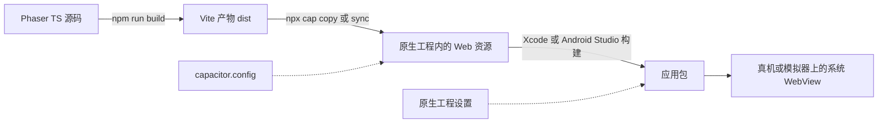

import { Meta } from '@storybook/addon-docs/blocks';

<Meta id="native-packaging" title="进阶/原生打包" name="Docs" />

# 原生打包

Phaser 游戏本质是一个网页:Vite 把它构建成 `dist/` 里的一组静态文件。原生打包不会把游戏"编译成原生代码",而是给它套一个原生应用壳——Capacitor 把构建产物复制进一个真实的 iOS/Android 工程,应用启动后由系统 WebView 加载并渲染它。本课讲清这条链路的每一环(`cap init` → `cap add` → `cap sync` → `cap open`/`run`)、`capacitor.config` 的核心字段,以及 Phaser 跑进 WebView 后真正要重新核对的几件事:资源本地化、音频解锁、safe-area、横竖屏与性能;开发期的 live reload、桌面端方案与商店发布各给最短路径。

| 项 | 常用值 / 命令 | 回查要点 |
| --- | --- | --- |
| `webDir` | Vite 默认 `dist` | `cap copy` 的来源目录,必须与 Vite `build.outDir` 一致 |
| `appId` | 如 `com.example.game` | 反向域名,成为 iOS Bundle ID 与 Android applicationId |
| `appName` | 如 `My Game` | 装到主屏后显示的应用名 |
| `npx cap add ios` / `android` | 生成原生工程 | 一次性动作;产物 `ios/`、`android/` 是可手改的持久工程 |
| `npx cap sync` | `copy` + `update` | 网页产物或原生插件变化后执行 |
| `npx cap copy` | 仅复制产物 | 只改了网页代码时的最小同步 |
| `npx cap open ios` / `android` | 打开原生工程 | 分别调起 Xcode / Android Studio |
| `npx cap run ios` / `android` | 构建 + 部署 | 跑到模拟器或连接的真机 |
| `server.url` | `http://<局域网 IP>:5173` | 仅开发期 live reload 用,发布前必须移除 |

## 快速上手

前置:一个能 `npm run build` 出 `dist/` 的 Phaser + Vite 项目(工程搭建见[1.1 安装](?path=/docs/installation--docs),构建优化见[6.1.2 生产构建](?path=/docs/production-build--docs));本机装好 Xcode(含 iOS 模拟器)或 Android Studio。

```bash
# 在游戏项目根目录执行
npm i @capacitor/core @capacitor/cli
npx cap init                 # 交互式询问应用名、appId、webDir;webDir 填 dist
npx cap add ios              # 生成 ios/ 原生工程;Android 用 npx cap add android

npm run build                # 产出 dist/
npx cap sync                 # 复制 dist/ 进原生工程并同步原生依赖

npx cap open ios             # 用 Xcode 打开工程,选模拟器点运行
# 或命令行直跑:npx cap run ios
```

模拟器或真机上出现原生应用图标,点开就是 WebView 里的游戏——这个最小闭环跑通后,后面所有小节都只是在这条链路的某一环上展开。日常改动只需重复最后三步:`build` → `sync` → `run`。

## 打包链路

Capacitor 不转换代码。游戏仍然是纯网页,由系统 WebView(iOS 的 WKWebView、Android 的 WebView)渲染;Capacitor 提供的是三样东西——一个可构建的原生工程、把 `webDir` 产物复制进工程的机制、JS 与原生能力之间的插件桥。由此得出整条链路的分工:**游戏内容的变化都发生在网页侧,应用行为(图标、权限、横竖屏、启动图)都发生在原生侧。**



每个环节的职责与触发时机:

| 环节 | 命令 / 位置 | 什么时候要动它 |
| --- | --- | --- |
| 网页构建 | `npm run build` | 任何游戏代码与资源变化 |
| 复制产物 | `npx cap copy` | 每次网页构建之后 |
| 同步产物与插件 | `npx cap sync`(= `copy` + `update`) | 增删 Capacitor 插件、升级依赖后 |
| 打开原生工程 | `npx cap open ios` / `android` | 改原生设置、签名、真机调试 |
| 部署运行 | `npx cap run ios` / `android` | 验证一轮改动 |

两个关键认识:

- **原生工程是持久产物。** `ios/`、`android/` 连同你的手动修改一起进版本库;`sync` 只往里复制与更新 Web 资源和插件依赖,不会覆盖你改过的原生设置。横竖屏、权限、图标、签名都在这两个目录里改。
- **`dist/` 和原生工程里的副本是两份文件。** 忘记 `build` 或 `copy`,真机上跑的就还是旧游戏——这是本课最高频的"改了没生效"来源(见常见问题)。

链路的终点是商店,一句带过:真机验证后,iOS 从 Xcode 归档上传 App Store Connect,Android 出 App Bundle 上传 Play Console,流程以各平台官方文档为准。

## capacitor.config

`cap init` 生成的配置文件放在项目根目录,`capacitor.config.ts`(也有 json 变体)是整条链路的控制面板:

```ts
// capacitor.config.ts —— 项目根目录
import type { CapacitorConfig } from '@capacitor/cli';

const config: CapacitorConfig = {
  appId: 'com.example.game', // 反向域名,两端共用的应用标识
  appName: 'My Game',        // 装到主屏后显示的应用名
  webDir: 'dist',            // Vite 构建产物目录,`cap copy` 的输入
};

export default config;
```

| 字段 | 必填 | 说明 |
| --- | --- | --- |
| `appId` | 是 | iOS Bundle ID 与 Android applicationId 的来源;两端开发者账号注册也以它为准,一旦上架不可随意改 |
| `appName` | 是 | 应用显示名,与商店里的名称可不同 |
| `webDir` | 是 | `cap copy` 读取的目录;Vite 没改 `build.outDir` 时就是 `dist`,改过则两处必须一致 |

工程期还会用到 `server` 子对象:`server.url`(开发期 live reload,见[开发迭代](#开发迭代))和 `server.cleartext`(允许明文 http,Android 调试时配合 `server.url`)。其余字段(启动图、scheme、各平台专属项)随版本有增减,用到时以 [Capacitor 官方文档](https://capacitorjs.com/docs)为准,本文只写长期稳定的核心项。

## WebView 运行要点

### 资源本地化

`cap copy` 把 `webDir` 整个目录搬进应用包,应用通过自定义 scheme(iOS 默认 `capacitor://localhost`、Android 默认 `https://localhost`)把它当本地站点加载。所以**首帧所需的一切都应该已经在 `dist/` 里**,启动路径上不依赖任何网络请求:

- 图片、图集、音频、字体全部经 Vite 打包(静态导入或放 `public/`)进产物;`this.load.image('bg', 'assets/bg.png')` 这类相对路径由 Loader 按文档地址解析,最终落到包内文件。
- CDN 运行时下载(远程图集、热更资源)不是不能做,但那是明确的网络依赖:弱网首屏变慢,离线直接黑屏,iOS 的 ATS 还限制明文 http。原则是**首帧前只用包内资源,远程内容放到首帧之后**按需拉。
- Vite 的 `base` 保持默认时产物内引用是绝对路径(`/assets/...`),在 Capacitor 从 scheme 根路径加载的方式下可用;只有当你在更复杂的宿主(嵌到别的页面)里遇到路径问题时才需要回头核对 `base`,构建侧细节见[6.1.2 生产构建](?path=/docs/production-build--docs)。

### 音频解锁与手势

WebView 遵守与浏览器同一套 autoplay 政策:首次用户手势前 AudioContext 处于挂起状态,出不了声。好消息是 Phaser 已经替你处理——Sound Manager 发现 context 挂起时会在 `document.body` 上挂一次性手势监听(`touchstart`/`mousedown`/`keydown` 等),手势一到就 `resume`,随后发 `unlocked` 事件。这套机制在 WebView 里**原样生效**:手势就发生在游戏所在的同一文档内,不存在 iframe 那种跨文档解锁不了的坑。

开发者要做的只有两件:保留一个"点击开始"的标题屏,把解锁、远程资源预载、加载进度展示合并成一次手势;以及知道"锁定期间 `play()` 不报错、context 恢复后自动出声",别把首屏无声误判成打包问题。完整机制见[4.1 音频](?path=/docs/audio--docs)。

### 分辨率与 safe-area

- **缩放模式首选 `Phaser.Scale.FIT` + `autoCenter`:** 一套逻辑分辨率等比缩放进各种屏幕,是移动端最省心的组合;`RESIZE` 全屏铺满意味着要处理所有宽高比,慎选。各模式的行为与默认值见[1.2 创建游戏](?path=/docs/game-config--docs)。
- **刘海屏/灵动岛:** 在 `index.html` 的 viewport meta 里加 `viewport-fit=cover`,页面才会延伸到全面屏边缘;再用 CSS 环境变量 `env(safe-area-inset-top)`(还有 `-left`/`-right`/`-bottom`)拿到安全区边界,给关键 UI 留边。游戏画布通常铺满全屏,真正需要避开安全区的是按钮和文字所在的 UI 层。
- **高分屏清晰度:** WebView 的 `window.devicePixelRatio` 与浏览器一致;画布放大后清不清晰取决于游戏分辨率与显示尺寸的关系(绘制缓冲 vs CSS 尺寸),这套账在 6.1.1「分辨率与缩放」里算过,结论照用:小画布 + 整数放大是像素风最便宜的方案。

### 横竖屏锁定

Phaser 能**检测**方向:Scale Manager 提供 `ORIENTATION_CHANGE` 事件和 `Phaser.Scale.LANDSCAPE` / `PORTRAIT` 常量,常用来弹"请旋转设备"提示。但**锁定**方向是应用级设置,JS 做不到,要在原生工程里改:

- Android:`AndroidManifest.xml` 中 Activity 的 `android:screenOrientation="portrait"`(或 `landscape` / `sensorLandscape`)。
- iOS:Xcode 目标设置的 General → Deployment Info 勾选允许的方向(写入 Info.plist 的 `UISupportedInterfaceOrientations`)。

改原生工程不需要 `cap sync`——同步只在网页产物或插件变化时才需要。

### WebView 内核与渲染器

WebView 就是浏览器,但版本不归你控制:Android 的 System WebView 可由用户独立更新,iOS 的 WKWebView 随系统版本走。所以"最低支持的 WebGL 特性"实际由目标用户的设备分布决定,而不是你的测试机。Phaser 默认的 `type: Phaser.AUTO` 会检测 WebGL、不可用时退回 Canvas 渲染器,这条保险在 WebView 里同样有效,老设备上至少能跑。硬件加速不用你操心:WKWebView 与现代 Android WebView 默认启用 GPU 加速,Phaser 启动时拿到的就是正常的 WebGL 上下文,不需要任何"开启硬件加速"的配置。

## 移动端性能要点

性能是 6.1.1 的主题,这里只说打包进真机前必须带上的三件事,机制与读数都在[6.1.1 性能优化](?path=/docs/performance--docs):

- **批处理在移动端自动退化。** `render.autoMobileTextures` 默认 `true`:检测到 iOS/Android 时每批只并行绑定 1 张纹理,桌面浏览器上"多纹理不断批"的经验在手机上不成立。图集因此从优化项变成基本要求——同一图集的对象永远命中"纹理已在批内"。
- **纹理预算按设备内存算。** 中低端手机的可用内存与桌面不在一个量级;超预算的表现常常是纹理丢失、整块黑彩而非报错,回查时先对纹理总账(见 6.1.1「纹理预算」)。
- **真机才是真数据。** 桌面浏览器 + 设备模拟可以过功能,帧率、内存和发热必须上真机量(FPS 与分段耗时的测量方法见 6.1.1「测量」);模拟器 GPU 与真机不同,数据只当参考。

## 开发迭代

两类改动走两条路径:

| 改动类型 | 流程 |
| --- | --- |
| 网页代码 / 资源 | `npm run build` → `npx cap copy` → 重新 `run`(或 Xcode/Studio 里直接再跑,产物已更新) |
| 原生设置 / 插件 | 直接改 `ios/`、`android/`;增删插件或升依赖后加跑 `npx cap sync` |

每轮改动都 build + copy 很笨重,live reload 的思路是让 WebView 直接加载开发机上的 Vite dev server,绕过复制环节:

```ts
// capacitor.config.ts —— 仅开发期追加
server: {
  url: 'http://192.168.1.10:5173', // 开发机的局域网 IP;写 localhost 指向手机自己,必然连不上
  cleartext: true,                  // 允许明文 http;Android 需要,iOS 可能还要 Info.plist 的 ATS 例外,见官方指南
},
```

手机与开发机在同一网络时,改代码即时热更,接近浏览器开发体验;原生插件在这条通路下照常可用。代价与纪律只有一条:**`server.url` 生效时包里的 `dist/` 完全不被使用**——发布前必须删掉这段配置并重新 `sync`,否则商店包离开你的局域网就是白屏(真实高频事故,见常见问题)。

## 桌面端方案

思路与 Capacitor 完全同构:同一份 Vite `dist/` 交给桌面壳加载,Phaser 侧不需要任何改动。Electron 随包自带 Chromium,窗口里 `loadFile('dist/index.html')` 加载产物,渲染环境各机器一致但安装包大;Tauri 复用系统 WebView(Windows 的 WebView2、macOS 的 WKWebView),包体小,但渲染内核随用户系统走——上一节"WebView 内核决定特性下限"的结论同样适用。Tauri 的前端产物目录配置键随版本变化,以官方文档为准。

## 最佳实践

- **网页改动固定走 build → copy → run,插件/依赖变更升级为 sync。** `copy` 只搬产物,`sync` 还会更新原生依赖;分不清时跑 `sync` 总是安全,只是慢一点。
- **首帧资源全部进包,远程内容后置。** 把"点击开始"做成标题屏:一次手势同时完成音频解锁、远程关卡预载和进度展示。
- **横竖屏尽早锁定,游戏内只做检测。** 原生工程里锁方向比在游戏里处理任意旋转便宜得多;动作游戏锁 `landscape`、解谜锁 `portrait` 是多数选择。
- **开发期配置与发布配置隔离。** 用 `capacitor.config.ts` 按环境变量决定是否注入 `server.url`,避免手工增删;至少把"确认已删除 `server.url`"写进发布检查清单。
- **`ios/`、`android/` 进版本库。** 原生工程是持久产物而非可再生的中间物,签名、权限、横竖屏等修改都应可追溯。

## 常见问题

- **真机上还是旧版本,改动没生效。**
  原生工程加载的是 `cap copy` 复制过去的副本,`dist/` 更新不会自动同步。重新 `npm run build && npx cap copy`(或 `npx cap sync`)后再 `run`。
- **启动白屏,同一份代码在桌面浏览器正常。**
  先查 `capacitor.config` 的 `server.url` 是否忘了删——它让应用直连开发机,离开开发网络就白屏;再查 `webDir` 是否与实际构建输出一致(改过 Vite `build.outDir` 却没改 `webDir`,`copy` 复制的是空目录或旧产物)。
- **资源加载失败,卡在加载进度条。**
  启动路径引用了外网地址或包里不存在的文件:核对资源是否都进了 `dist/`、引用是否相对路径;远程资源必须 https(iOS ATS 限制明文 http)。
- **刘海或灵动岛挡住关键 UI。**
  viewport meta 加 `viewport-fit=cover` 页面才延伸到全面屏边缘,然后用 `env(safe-area-inset-*)` 给 UI 留边;只加后者不生效。
- **首次交互前没有声音。**
  这是 autoplay 政策的正常表现,不是打包问题:Phaser 的手势解锁在 WebView 里同样生效,安排一次"点击开始"即可,机制见[4.1 音频](?path=/docs/audio--docs)。
- **`npx cap run` 报找不到设备或模拟器。**
  `run` 只是调起 Xcode / Android Studio 的构建部署:先在 Xcode 里确认模拟器已下载、在 Android Studio 里确认 SDK 与模拟器就绪;真机要开开发者模式并信任计算机。

## 总结回顾

摘要:

Phaser 游戏是网页,原生打包是用 Capacitor 套壳:`webDir` 指向 Vite 产物,`cap add` 生成可手改的 iOS/Android 工程,`cap sync`/`copy` 把产物搬进工程,`cap open`/`run` 走原生构建部署到真机——游戏内容变在网页侧,应用行为变在原生侧。WebView 里首帧资源全部本地化、不依赖网络;音频解锁由 Phaser 的手势机制照常完成;刘海屏用 `viewport-fit=cover` + safe-area,横竖屏在原生工程锁定、游戏内只检测;移动端批处理退化为每批单纹理,图集与真机测量是基本要求。开发期用 `server.url` 指向局域网 dev server 做 live reload,发布前必须移除;桌面端 Electron/Tauri 消费同一份 `dist/`。

一句话:

> Capacitor 不编译游戏,它把 Vite 产物装进原生工程再由系统 WebView 加载——改游戏走 build + sync,改应用行为进原生工程,发布前删掉一切开发期 server 配置。

知识要点:

- `webDir`、`appId`、`appName` 各自决定什么?
- 网页改动、原生改动、插件变更分别要执行哪条命令?
- `cap copy` 与 `cap sync` 差在哪,分不清时跑哪个?
- 首帧资源为什么要本地化,远程内容应在什么时候加载?
- 音频解锁在 WebView 里由谁完成,开发者要做什么?
- 刘海屏与横竖屏分别在哪一层解决,Phaser 能做到哪一步?
- 移动端批处理为什么退化,图集为什么从优化项变成基本要求?
- live reload 怎么配,发布前必须删掉什么?

## 参考资料

- [Capacitor 官方文档](https://capacitorjs.com/docs)
- [Phaser 官方文档](https://docs.phaser.io/)
- [Electron 官方网站](https://www.electronjs.org/)
- [Tauri 官方网站](https://tauri.app/)
