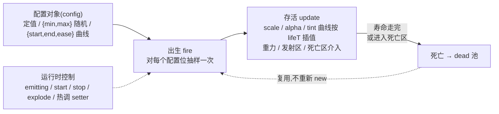

import { Canvas, Controls, Meta } from '@storybook/addon-docs/blocks';
import * as Particles from './particles.stories';

<Meta of={Particles} name="Docs" />

# 粒子

Phaser 的粒子系统从 3.60 起整个重写、Phaser 4 延续同一模型(存量 3.x 教程里的 `ParticleEmitterManager` 已删除,老写法不可参考):**`this.add.particles(x, y, texture, config)` 返回一个 `ParticleEmitter`,它本身是一个普通游戏对象**——可以 `setDepth`、放进 Container、被摄像机滚动裁剪——内部维护一个粒子池,按配置把池里的 `Particle` 实例不断「出生 → 更新 → 死亡回池」。理解它只需三句话:**配置是数据,不是属性赋值**——同一配置位接受定值、随机区间或 `{start, end, ease}` 曲线,发射器在粒子出生与存活期间对配置「抽样」和「插值」;**发射与移动自成一体**——粒子用发射器自己的速度 / 重力 / 区域逻辑运动,与物理引擎无关;**一切配置都在出生时定型**——`angle`、`speed`、`lifespan` 这类 emit-only 配置只影响之后出生的粒子,`scale` / `alpha` / `tint` 曲线则随寿命实时插值。本课按「发射器模型 → 发射配置 → 运行时控制」展开,配一个三发射器实验台(喷泉 / 尾迹跟随 / 点击爆发)。



关键配置与属性默认值(以下经 phaser@4.2.1 类型与源码核实):

| 配置 / 属性 | 默认值 | 回查要点 |
| --- | --- | --- |
| `frequency` | `0` | 流动模式两批间隔(ms);`0` = 每逻辑帧一批;`-1` = 爆发模式 |
| `quantity` | `1` | 每批粒子数;`explode(count)` 缺省也取自它 |
| `lifespan` | `1000` | 寿命 ms,曲线插值自变量;emit-only |
| `angle` | `{ min: 0, max: 360 }` | 度数,radial 模式的方向;emit-only |
| `speed` | `0` | radial 初速(px/s);写 `speedX` / `speedY` 会关掉 radial |
| `scale` / `alpha` | `1` / `1` | 支持 `{start, end, ease}` 随寿命插值 |
| `rotate` | `0` | 粒子旋转角,支持曲线(度) |
| `tint` | `0xffffff` | 单值 / 随机数组 / `color` 渐变;**仅 WebGL** |
| `gravityX` / `gravityY` | `0 / 0` | 发射器自带的加速度,与物理引擎无关 |
| `maxParticles` | `0`(不限) | 池内粒子实例**总数**硬上限 |
| `maxAliveParticles` | `0`(不限) | **同时存活**数上限,满了要等粒子死亡才继续发 |
| `emitting` | `true` | 流动模式是否持续发射;`stop()` 置 false,`start()` 置 true |
| `blendMode` | `NORMAL` | 设 `Phaser.BlendModes.ADD` 做发光叠加 |
| 发射器事件 | 挂在发射器上 | `'start'` / `'stop'` / `'complete'` / `'explode'` / `'deathzone'` |

## 快速上手

两个最高频的闭环:受击 / 爆炸一次喷发;角色尾迹持续跟随。

```ts
// 爆炸:爆发模式的独立发射器,点一下喷一次(点击处)
const burst = this.add.particles(0, 0, 'spark', {
  speed: { min: 80, max: 300 },   // 随机区间:每颗初速不同
  angle: { min: 0, max: 360 },    // 全向
  scale: { start: 1, end: 0 },    // 出生大、死亡小,随寿命插值
  lifespan: 800,
  frequency: -1,                  // 爆发模式:不自动发射
  emitting: false,
});
burst.explode(60, x, y);          // 在 (x, y) 一次喷 60 颗

// 尾迹:流动模式 + follow 目标,每 12ms 从角色身上发 1 颗
const trail = this.add.particles(0, 0, 'dot', {
  follow: this.player,            // 发射原点每次发射取 follow 目标的 x/y
  speed: 20,
  scale: { start: 0.7, end: 0 },
  alpha: { start: 0.8, end: 0 },
  frequency: 12,
  quantity: 1,
  lifespan: 600,
});
```

纹理用白色小图(圆点 / 星形)最灵活——颜色交给 `tint`,一张纹理做出所有配色。要点都在注释里;参数与机制的细节见下文。

## 发射器模型

**发射器是单一游戏对象。**`this.add.particles(x, y, texture, config)` 一步完成创建 + 配置;返回的 `ParticleEmitter` 实现了 Depth / Alpha / BlendMode / ScrollFactor / Visible / Transform 等组件——`setDepth` 决定整批粒子的层级,放进 Container 随容器变换,摄像机照常滚动裁剪(粒子与 depth / 摄像机的关系见 [2.2.5 深度与视觉状态](?path=/docs/depth--docs)与 [2.5.1 摄像机控制](?path=/docs/camera-control--docs))。粒子本身**不是**游戏对象:它们是发射器池里的 `Particle` 实例,没有自己的 depth / 摄像机归属,批量跟随发射器渲染。

**每帧发生什么。**发射器在 `preUpdate` 里:先推进所有存活粒子(寿命、曲线插值、重力、区域判定),死亡的搬回 dead 池;若 `emitting` 为 true 且处于流动模式(`frequency >= 0`),按 `frequency` 节奏调 `emitParticle()`——从 dead 池取实例(没有才 `new`),对它执行出生抽样,推入 alive 列表。

**事件挂在发射器上。**`'start'`(开始发射)、`'stop'`(`stop()` 后)、`'complete'`(停止发射且最后一颗粒子死亡)、`'explode'`(每次 `explode()`)、`'deathzone'`(粒子被死亡区击杀)。常量可从 `Phaser.GameObjects.Particles.Events` 取。

### 配置值的三种写法

发射器把每个配置位包成一个 EmitterOp,同一位置接受三种值,这是整个配置系统的核心语法:

| 写法 | 例 | 语义 | 适用 |
| --- | --- | --- | --- |
| 定值 | `speed: 150` | 每颗粒子同值 | 所有配置位 |
| 随机 | `speed: { min: 80, max: 300 }`、`tint: [0xff0000, 0x00ff00]` | 出生时抽一次;数组形式等价「列表随机」 | 所有配置位 |
| 曲线 | `scale: { start: 1.4, end: 0, ease: 'Cubic.out' }` | 随寿命进度 t(0→1)从 start 插到 end | 仅 onUpdate 型配置位 |

**emit-only 与 onUpdate 的分界是高频坑点。**`angle`、`speed` / `speedX` / `speedY`、`lifespan`、`quantity`、`delay` 只在出生时抽样一次,出生后不再变;`scale` / `scaleX` / `scaleY`、`alpha`、`rotate`、`tint` 既可出生抽样、也可作为曲线每帧插值(粒子上的 `lifeT` 就是插值自变量)。曲线还接受 `random: true`(start 从区间随机起跳)、`values: [...] + interpolation: 'linear' | 'bezier' | 'catmull'`(沿数据集插值)与 `steps`(阶梯)。两种写法都能换成回调:`onEmit(particle, key, value)` 与 `onUpdate(particle, key, t, value)`,返回新值。

### 流动与爆发

`frequency` 决定发射器的模式,这是比「连续 / 单次」更准确的表述:

- **流动模式(`frequency >= 0`,默认 0):**每 `frequency` 毫秒发一批 `quantity` 颗。`frequency: 0` 是每逻辑帧一批(60fps 下每秒 60 批);`100` 即每秒 10 批。发射率 ≈ `1000 / frequency × quantity` 颗 / 秒。
- **爆发模式(`frequency = -1`):**`preUpdate` 不再自动发射,只在 `explode(count, x, y)` 被调用时一次喷发。**`explode()` 会把 `frequency` 置为 -1**——对流动中的发射器调 `explode()` 会顺带掐断它的持续发射,要恢复须 `start()` 或 `flow()`。爆炸请用独立发射器,别和尾迹混用。
- **限量停止:**`stopAfter: n` 发满 n 颗后自动停(触发 `'stop'`),`duration: ms` 发满时长后停;`start()` 会重置这两个计数器。想「喷一下就停、粒子飞完再收尾」,配 `'complete'` 事件即可。

### 粒子池与容量

粒子实例在 alive / dead 两个池间循环,**死亡不是销毁**——回 dead 池等下次复用,所以流动发射器稳定运行后不再分配新对象。读数与上限:

- `getAliveParticleCount()` 当前存活;`getDeadParticleCount()` 池中可用;`getParticleCount()` 两者之和,即已创建的实例总数(池随历史峰值需求增长,不随当帧存活回落)。
- `maxParticles` 限制**池总量**(创建过的实例数),`maxAliveParticles` 限制**同时存活数**——到上限后发射被跳过,等粒子死亡才补发;`atLimit()` 查询是否已满。
- `reserve(n)` 预先创建 n 颗入池,避免开局爆炸时的集中分配;`killAll()` 把存活粒子立即清回 dead 池(emitting 不变);`overlap(rect)` 拿矩形(或 Arcade 刚体)与存活粒子做相交检测,是「粒子打到谁」的廉价判定。

## 发射配置

### 速度与方向

粒子运动学只有「初速 + 加速度 + 寿命」三件套,与物理引擎完全无关:

- **radial 模式(默认):**`angle`(度,右旋坐标系,0° 朝右)+ `speed` 决定初速方向与大小;`speed` 配置内部进 speedX 运算符。向上喷泉就是 `angle: { min: -108, max: -72 }, speed: 160, gravityY: 220`。
- **point 模式:**配置里出现 `speedX` / `speedY`(或 `moveToX` / `moveToY`)时 `radial` 自动置 false,初速按分量直给;`setParticleSpeed(x, y)` 则显式切回 radial。横向风、传送带式飘落用它。
- **`moveToX` / `moveToY`:**初速按「寿命内恰好到达目标点」反推,`angle` 与 `speed` 全部失效;做定向汇聚 / 飞向 UI 的引导线。
- **`gravityX` / `gravityY`:**全发射器统一的加速度(px/s²),喷泉回落、火焰上飘、风向都靠它;`accelerationX` / `accelerationY` 是逐粒子随机加速度,配 `maxVelocityX` / `maxVelocityY` 封顶,做「越飞越快但有极限」。

### 寿命与节奏

- **`lifespan`(默认 1000ms)**是粒子一切曲线的时间轴;支持 `{ min, max }` 让每颗寿命不同——爆炸配随机寿命才不会「整团一起消失」。emit-only:热调只影响之后出生的粒子,空中的不变。
- **`frequency` + `quantity`** 决定流动节奏(见「流动与爆发」);`delay` / `hold` 在爆炸时让部分粒子延迟出生 / 出生后悬停一会儿再飞,能把一次 explode 拆成连爆的层次感。
- **`timeScale`**(默认 1)给整个发射器的时间流变速:发射节奏与粒子寿命、运动、曲线一起快放慢放,`0` 相当于冻结;与 `pause()` 的区别是它不改变发射开关,只是时间变慢或变快。

### 外观:scale、alpha、rotate、tint

- **`scale` / `alpha` / `rotate` 都吃 `{start, end, ease}` 曲线**,随 `lifeT`(寿命进度 0→1)每帧插值,是粒子「淡出、收缩、旋转飞散」的标准写法;`ease` 用 EaseMap 里的名字(如 `'Cubic.out'`、`'Bounce.out'`,与 2.3.3 缓动同源)。热调曲线**立即作用于空中粒子**,因为它每帧都在算。
- **`tint` 上色:**单值定色、数组随机取色、`{ onEmit }` 回调皆可;`color: [0xff0000, 0xffcc00, 0xffff00] + colorEase` 则沿色带随寿命渐变(设置后覆盖 `tint`)。tint 是**仅 WebGL** 的能力,Canvas 渲染器下不生效。Phaser 4 另有 `tintMode`(默认 `MULTIPLY`,可选 `FILL` / `ADD` 等)控制 tint 与纹理的混合方式——白色柔边纹理 + MULTIPLY 是最通用的组合。
- **`blendMode: Phaser.BlendModes.ADD`** 让重叠粒子互相增亮,白色柔边小纹理 + ADD 即「光晕 / 火花」;渲染机制与取舍见 [2.2.5 深度与视觉状态](?path=/docs/depth--docs)。ADD 会叠加过曝,粒子密集时把 `alpha` 曲线压低或换暗色 tint。
- **纹理与帧:**发射器一个纹理,`frame: [ ... ]` 让粒子随机(或按 `cycle` 顺序)取不同帧,一张图集做出五彩碎屑;每颗粒子也可播动画(`anim` 配置)。

### 发射区与死亡区

默认粒子从发射器位置(或 follow 目标)的一个点出生;两个「区」把它扩展成空间:

- **`emitZone`(发射区):**决定**出生位置**。`type: 'random'` 配 `source: Rectangle/Circle`(区域内随机点域);`type: 'edge'` 配 `source: 任何带 getPoints 的几何体 + quantity`,沿边线均匀取样(圆环边线 = 从光环出生,`yoyo: true` 来回扫描)。多个 zone 可叠加,发射时随机选一个。范例里开启「edge 发射区」后,喷泉的出生点从中心点变成圆环。
- **`deathZone`(死亡区):**决定**提前死亡**。`source` 是任何带 `contains(x, y)` 的形状,`type: 'onEnter'`(进入即死)/ `'onLeave'`(离开即死)。地面接住喷洒、火圈边界烧掉粒子都靠它;被击杀的粒子触发 `'deathzone'` 事件。死亡区与 lifespan 是「或」关系——先到者生效。

```ts
// 从圆环边线出生,落到地面矩形即死
emitter.addEmitZone({
  type: 'edge',
  source: new Phaser.Geom.Circle(360, 300, 80),
  quantity: 48,
});
emitter.addDeathZone({
  source: new Phaser.Geom.Rectangle(0, 342, 720, 63),
  type: 'onEnter',
});
```

## 运行时控制

**开关与启停。**`emitting` 属性(或 `stop()` / `start()`)控制「还发不发」:`stop()` 存量粒子活完寿命,`stop(true)` 连存量一起杀;`start()` 重置计数器并恢复流动。`pause()` / `resume()` 是更彻底的 `active` 开关(整个发射器不更新)。`'stop'` 在停发时触发,`'complete'` 在最后一颗死亡时触发——「爆炸飞完再回收发射器」就监听它。`killAll()` 立即清场。

**一次喷发。**`explode(count, x, y)` 在任意位置一次喷 count 颗(切爆发模式);`emitParticleAt(x, y, count)` 同样按位置喷发但**不切换模式**——想给流动发射器临时「加塞」几颗用它。

**热调配置。**发射器为高频位提供 setter:`setFrequency(f, q)`、`setQuantity(n)`、`setParticleSpeed(x, y?)`、`setParticleLifespan(v)`、`setEmitterAngle(v)`、`setParticleScale(x, y?)`、`setParticleAlpha(v)`、`setParticleTint(v)`、`setParticleGravity(x, y)`。整份重配用 `setConfig(config)`(按新配置重置)或 `updateConfig(config)`(合并进现有配置再重置);两者都会重置计数器并可能触发 `'start'`。

**跟随目标。**`follow`(配置项)或 `startFollow(target, offsetX?, offsetY?, trackVisible?)` 让发射原点每次发射取目标当前位置(+`followOffset`);`stopFollow()` 解除。范例右侧的尾迹就是 `follow` 巡航方块。注意:follow 只影响**新发射**粒子的出生点,已飞出的粒子不动。

下面是本课主范例:三发射器实验台。喷泉(连续发射)的全部节奏、寿命、曲线、重力、tint 与 blendMode 由 Controls 热调;右区方块巡航,尾迹发射器 `follow` 它;点击画布空白处在点击位置 `explode` 爆发,数量可调;两个开关分别启用 edge 发射区与地面死亡区。readout 给出各发射器的存活数 / 池大小、喷泉累计发射数、`emitting` 状态与最近粒子事件。

<Canvas of={Particles.EmitterLab} />
<Controls of={Particles.EmitterLab} />

| 读者操作 | 可观察证据 |
| --- | --- |
| 把「发射间隔」调到 0、「每批数量」调到 8 | 喷泉瞬间变密;存活数上涨到新的平衡位——发射率 ≈ 60 批/s × 8 颗,死亡速率追平后稳定 |
| 把「寿命」从 1500 调到 4000 | 存活平衡数明显上涨;**空中已有的粒子寿命不变**(emit-only),只有之后出生的活得更久 |
| 把「初速」从 160 调到 400 | 粒子飞得更高更远;配「重力」调大后重新回落成喷泉弧线 |
| 把 scale 曲线 end 从 0 调到 0.5、start 调到 3 | 粒子整体变大;**空中粒子的缩放立即跟随新曲线**(onUpdate 型每帧插值) |
| 切换「scale 缓动」到 Bounce.out | 收缩节奏出现弹跳感——ease 改的是同一条 start→end 曲线的进度分布 |
| 「tint 模式」切 solid 并换颜色 | 三色随机变成统一色;tint 乘在白色柔边纹理上,颜色即粒子色 |
| 关闭「ADD 发光」 | 粒子从叠加光晕变成普通实心绘制,重叠处不再增亮 |
| 打开「edge 发射区(圆环边线)」 | 出生点从喷泉中心散开成圆环;关闭后回到中心点 |
| 打开「地面死亡区」并把寿命调到 4000 | 粒子落到地面线即消失——lifespan 没走完也被截断;「最近粒子事件」出现 `deathzone` |
| 点击画布空白处 | 点击位置一次爆发;「爆发(explode)」读数的存活数跳起后随寿命衰减;事件显示 `explode(burst)` |
| 把「爆发数量」调到 200 再点 | 同一位置密度明显变大;连续快速点击会在上一批未死时叠加 |
| 点击 STOP | 喷泉停止发射(`emitting: false`),存量粒子继续衰减;归零后「最近粒子事件」变为 `complete`——stop 与 complete 是两个时机 |
| 点击 START | 恢复流动发射,`emitting` 回到 true |
| 点击 KILL ALL | 存活数立即归零,但 `emitting` 仍为 true——killAll 只清存量、不停发射 |

实例滚出视口或页面切到后台时会整体休眠以省资源,回到视口自动恢复。

## 最佳实践

- **按用途分发射器,一器一职责:**爆炸 / 尾迹 / 环境尘各用独立发射器,而不是一个发射器改配置兼演多角——`explode()` 会切模式、`setConfig` 会重置计数,复用同一个发射器容易互相打断;独立发射器还共享同一纹理,成本远低于想象。
- **节奏参数从保守起步:**尾迹类 `frequency` 10–30ms + `quantity` 1–2 已经够密;`frequency: 0` 是每帧一组的上限档,只在短促高密效果里用。同屏粒子预算参考 6.1.1(性能优化)。
- **给流动发射器设 `maxAliveParticles`:**它把存活数钉在上限,滑回视口 / 参数调猛时发射器自动节流(满了就跳过发射),比事后 killAll 干净;需要精确总量的再配 `reserve` 预热。
- **发光三件套:**白色柔边小纹理(多层同心圆烘焙)+ `tint` 上色 + `blendMode: ADD`;要更亮调 alpha 曲线而不是堆数量。
- **爆炸的层次感来自随机区间:**`speed`、`lifespan` 都给 `{min, max}`,再配 `rotate` 曲线与随机 tint,一次 explode 才不会像「一团同时消失的面片」。

## 常见问题

- **改了 `lifespan` / `angle` / `speed`,已经在飞的粒子没反应。**
  这三个是 emit-only 配置,只在粒子出生时抽样一次;热调只影响之后出生的粒子。要让存量粒子也变,只能 `killAll()` 重发,或改用 onUpdate 型属性(scale / alpha / rotate / tint 曲线)。
- **对一个正常喷着的发射器调了 `explode()`,之后它再也不持续发射了。**
  `explode()` 会把 `frequency` 置为 -1(爆发模式),`preUpdate` 从此不再自动发射。调 `start()`(或 `flow(frequency, quantity)`)切回流动模式;爆炸与连续效果请拆成两个发射器。
- **点击 / 按钮触发的爆炸没有任何粒子出现。**
  依次查:发射器是否 `emitting: false` 且从未被 `explode()` 调用(爆发模式靠 explode 触发,`start()` 对爆发模式无效);是否撞上 `maxParticles` / `maxAliveParticles` 上限(`atLimit()` 为 true 时 explode 静默不发);纹理 key 是否拼写正确。
- **粒子被背景盖住,或盖住了本该在上层的对象。**
  粒子没有独立 depth,整批跟随发射器的 depth 参与场景排序:给发射器 `setDepth`,数值高于背景、低于 UI 层即可;要彻底隔离 UI,用 2.5.2 的多摄像机方案。
- **tint 配了但颜色不变 / 全是白色。**
  tint 仅 WebGL 渲染器生效(Canvas 下被忽略);另外确认纹理本身偏白(深色纹理乘 tint 后仍偏暗),以及没有同时设置 `color`(渐变带会覆盖 tint)。
- **`follow` 之后粒子仍从老位置出生。**
  follow 只影响新发射粒子的出生点,已发射的粒子位置不回改;确认目标传入的是有 `x` / `y` 的对象,偏移用 `followOffset`(或 `startFollow(target, ox, oy)`),它加在目标坐标上而不是替换。
- **发射器销毁后再用,或场景重启后粒子残留。**
  发射器随场景正常销毁,但自己缓存的发射器引用跨场景复用会指向已销毁对象;场景重启时在 `shutdown` 里清引用,或每次 `create` 重新创建发射器。

## 总结回顾

摘要:

Phaser 4 的粒子系统是单一 `ParticleEmitter` 游戏对象(3.60 重写、Manager 已删除):内部 alive / dead 双池复用 `Particle` 实例,按配置出生抽样、随寿命插值、死亡回池。配置值有三种写法——定值、`{min, max}` 随机、`{start, end, ease}` 曲线;angle / speed / lifespan / quantity 是 emit-only(只影响之后出生的粒子),scale / alpha / rotate / tint 可随 lifeT 每帧插值(热调立即生效于空中粒子)。`frequency >= 0` 是流动模式(发射率 ≈ 1000 / frequency × quantity),`-1` 是爆发模式;`explode()` 会切到爆发模式,所以爆炸与连续效果要用独立发射器。运动学 = 初速(angle + speed,或 speedX / speedY、moveTo)+ gravityX / gravityY,与物理引擎无关。空间由 emitZone(random 点域 / edge 边线域)定出生、deathZone(onEnter / onLeave)定提前死亡。运行时:emitting / start / stop / pause 控开关,explode / emitParticleAt 做点喷,一族 set* setter 与 updateConfig 热调,`follow` 跟随目标,`maxParticles` 限池总量、`maxAliveParticles` 限存活数。事件 start / stop / complete / explode / deathzone 挂在发射器上,complete 才是「最后一颗也死了」的时机。

一句话:

> 发射器是「配置驱动的粒子池」:出生时抽样、寿命内插值、死亡后回池;爆炸用独立发射器,热调先分清 emit-only 与 onUpdate。

知识要点:

- `this.add.particles` 返回什么?它与 3.x 教程里的 ParticleEmitterManager 是什么关系?
- 配置值的三种写法分别是什么?哪些配置位支持曲线插值,哪些是 emit-only?
- `frequency` 的三个取值区间分别对应什么行为?`explode()` 对 frequency 做了什么?
- 发射率怎么估算?`maxParticles` 与 `maxAliveParticles` 各限制什么?
- radial 与 point 模式怎么切换?`moveToX` / `moveToY` 设置后哪些配置失效?
- emitZone 的 random 与 edge 有什么差别?deathZone 的 onEnter / onLeave 呢?
- `stop()`、`stop(true)`、`killAll()`、`pause()` 分别停掉什么?
- start / stop / complete / explode / deathzone 事件分别在什么时机触发、挂在哪个对象上?
- follow 影响哪些粒子的什么属性?followOffset 怎么用?
- 做发光粒子的推荐纹理 + tint + blendMode 组合是什么?

## 参考资料

- [@官方@Phaser 官方文档](https://docs.phaser.io/) — ParticleEmitter 的配置项、EmitterOp 与 emitZone / deathZone 的 API 页
- [@官方@官方示例库](https://phaser.io/examples/) — particle effects 分类下的可运行示例(注意其中 3.60 前的示例已按新 API 重写)
- [@官方@Phaser 4 Labs 示例浏览器](https://labs.phaser.io/phaser4-index.html) — Phaser 4 专用示例,含粒子部分
