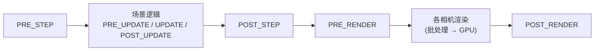

import { Canvas, Controls, Meta } from '@storybook/addon-docs/blocks';
import * as Performance from './performance.stories';

<Meta of={Performance} name="Docs" />

# 性能优化

性能问题的第一原则:**先测量,再动手**。帧率掉了、画面卡了,原因可能落在四个不同的地方——游戏逻辑步太重、渲染太重、GC(垃圾回收)停顿、纹理与内存预算超限——对应的优化手段完全不同,凭感觉优化常常改错地方。本课建立一条「测量 → 定位 → 手段」的工作流:先从 `game.loop` 读出帧率与帧耗时,用事件挂点把逻辑步和渲染分开计时,再按定位结果选择手段——对象池、消除每帧分配、纹理预算与批处理、控制渲染像素量、粒子与物理预算、手动剔除、及时销毁清理。每一环都能在读数上验证效果。

先把本课反复用到的读数入口集中列出,回查时从这张表起步:

| 读数 | 从哪读 | 说明 |
| --- | --- | --- |
| FPS | `game.loop.actualFps` | 指数移动平均,每秒更新一次,反应比瞬时帧率慢 |
| 帧间隔(平滑) | `game.loop.delta` | 已平滑、钳制的均值,update 参数用它 |
| 帧间隔(真实) | `game.loop.rawDelta` | 未平滑的真实间隔,测卡顿尖峰看它 |
| 本秒帧计数 | `game.loop.framesThisSecond` | `actualFps` 的原始计数 |
| delta 历史 | `game.loop.deltaHistory` | 最近 `deltaHistory`(默认 10)帧的原始值 |
| 逻辑步耗时 | `PRE_STEP` → `POST_STEP` 事件间 `performance.now()` 差 | 含全部场景的 update |
| 渲染耗时 | `PRE_RENDER` → `POST_RENDER` 事件间取差 | 含全部相机渲染 |
| draw 调用数 | Canvas:`renderer.drawCount`;WebGL:包装 `renderer.drawElements` / `renderer.drawInstancedArrays` 计数 | WebGL 渲染器没有内置统计入口 |
| 渲染像素量 | `game.scale.displaySize` vs `gameSize` / `baseSize` | 实际填充的像素数由绘制缓冲尺寸决定 |
| 存活 GL 纹理数 | `renderer.glTextureWrappers.length`(WebGL) | 纹理创建时入列、销毁时出列,可实时数 |
| 物理追帧步数 | `this.physics.world.stepsLastFrame`(Arcade) | 掉帧时物理用多步追帧,步数越多说明越吃紧 |


## 测量

一切从 `game.loop` 开始:它是驱动整个游戏的 `Phaser.Core.TimeStep`,每帧由 requestAnimationFrame 触发一次,所有读数都挂在它身上。

### FPS 与 delta

两个最常用的读数要分清:

- **`game.loop.actualFps`——平滑后的帧率。**它不是把 1000 除以本帧间隔,而是每秒统计一次帧数、再做指数加权移动平均(权重系数 0.25,越近的秒影响越大)。代价是**滞后**:帧率突降后它要一两秒才反映出来,瞬时尖峰几乎被抹平。判断"稳态是否达标"用它,判断"哪一帧卡了"不要用它。
- **`delta` 与 `rawDelta`——平滑间隔与真实间隔。**`update(time, delta)` 收到的 `delta` 是经过平滑与钳制的均值(默认保留最近 10 帧历史,`fps.deltaHistory`),适合做速度换算;`rawDelta` 才是上一帧到本帧的真实毫秒数,**卡顿尖峰只在这里可见**——同一时刻 `delta` 可能仍是 16.7,`rawDelta` 已经飙到 200。

```ts
create() {
  // 每帧读一次:平滑帧率 + 真实间隔
  this.time.addEvent({ delay: 500, loop: true, callback: () => {
    console.log(
      `fps=${this.game.loop.actualFps.toFixed(0)}`,
      `delta=${this.game.loop.delta.toFixed(1)}`,
      `raw=${this.game.loop.rawDelta.toFixed(1)}`,
    );
  }});
}
```

游戏循环的行为由 config 的 `fps` 字段控制,关键项与默认值:

| 字段 | 默认 | 作用 |
| --- | --- | --- |
| `target` | 60 | 告诉引擎"什么算正常",不强制浏览器按此运行 |
| `min` | 5 | 低于它时引擎判定失控,极端 delta 会被钳制 |
| `limit` | 0(不限) | 强制限帧:低强度应用可设 30 省电;运行时用 `game.loop.setFPSLimit(n)` |
| `smoothStep` | `true` | 是否平滑 delta;要自己处理时序时可关 |
| `deltaHistory` | 10 | 参与平滑的帧数 |
| `panicMax` | 120 | 切后台回来后的冷却帧数,期间不信任 delta(见常见问题) |

两个读数陷阱提前记住:浏览器对隐藏页面会把 rAF 节流到接近 1fps,切后台再回来时的读数没有分析价值;`forceSetTimeOut: true` 会改用 setTimeout 驱动循环,只在特殊环境(部分 WebView)需要。

### 分段耗时与 draw call

FPS 只告诉你"慢",不告诉你"慢在哪"。一帧在 Phaser 里的完整顺序是:



把 `performance.now()` 差值挂在这些事件上,一帧就被切成「逻辑步」与「渲染」两段,瓶颈在哪一段一目了然:

```ts
const t = { step: 0, render: 0 };
let stepMs = 0;
let renderMs = 0;
game.events.on(Phaser.Core.Events.PRE_STEP, () => (t.step = performance.now()));
game.events.on(Phaser.Core.Events.POST_STEP, () => {
  stepMs = performance.now() - t.step;
});
game.events.on(Phaser.Core.Events.PRE_RENDER, () => (t.render = performance.now()));
game.events.on(Phaser.Core.Events.POST_RENDER, () => {
  renderMs = performance.now() - t.render;
});
```

- 事件都挂在 `game.events` 上,覆盖全部场景;场景级对应物见 [1.3 场景生命周期](?path=/docs/scene-lifecycle--docs)。
- 单个值没有意义,**取最近几十帧的滚动均值与峰值**才有判断力(本课实验台取 90 帧窗口)。
- 逻辑步高 → 看对象数量、update 里的分配、物理追帧;渲染高 → 看 draw 调用、填充像素、离屏对象;两段都不高但 FPS 仍低 → 嫌疑转向 GC 停顿(见[每帧分配与 GC](#每帧分配与-gc))。

**draw 调用数**回答"渲染这帧提交了几次绘制"。两个渲染器的读法不同:

- **Canvas 渲染器**有现成入口:`renderer.drawCount`,每帧重置,含义是"本帧渲染了多少个 Game Object"。
- **WebGL 渲染器没有内置统计属性**(Phaser 4 未暴露 draw 计数)。可行的测量法:Phaser 4 的全部 GL 绘制都经过 `renderer.drawElements` / `renderer.drawInstancedArrays` 两个方法,在 `PRE_RENDER` 清零、包装它们自增、`POST_RENDER` 读取,即可得到每帧 draw 数——本课实验台就是这么做的。要逐次调用级分析,用浏览器扩展 Spector.js,或 debug 版 Phaser 内嵌的 `renderer.captureNextFrame()`(仅 debug 构建可用)。

draw 数的意义在下一节:它不随对象数线性增长——批处理把成百上千个同纹理精灵合并成个位数提交,这正是纹理预算一节要展开的机制。

## 压力实验台

下面是本课的核心范例:一个可测量的压力实验现场。世界是视口的 4 倍大(1440×810),摄像机每 16 秒来回巡视,一批发光圆点在世界内弹走;每 150ms 有 2 个对象"退役"并补充,补充路径由「对象来源」决定——**池复用**走 `killAndHide` 归还 + `group.get` 取回,**每次新建**走 `destroy` + 全新创建。readout 里的 FPS、delta、分段耗时、draw 数、池计数全部来自真实引擎状态。

<Canvas of={Performance.StressLab} />
<Controls of={Performance.StressLab} />

操作与可观察证据的对照(建议按顺序做,每步等十几秒让读数稳定):

| 读者操作 | 可观察证据 |
| --- | --- |
| 初始加载(500 个 · 池复用 · 复用对象 · 不剔除) | FPS 接近显示器刷新率;「池复用」计数随退役节拍稳定攀升,「新建」停在初始 500,「销毁」恒为 0——对象只造一次、终身复用 |
| 「对象数量」调到 2000 | 逻辑步耗时明显上升(每帧要更新 2000 个对象);draw 数几乎不变——同纹理精灵被批处理合并,FPS 是否下降取决于设备 CPU |
| 「对象来源」切到「每次新建」 | 整场重建;此后「新建」与「销毁」同步攀升(每 150ms 各 +2),FPS 与峰值 delta 通常比池模式更差——反复 destroy/create 的分配与重建开销 |
| 切回「池复用」 | 「销毁」归零不再增长,补充全走「池复用」计数——两种来源的稳态差异就是池的收益 |
| 「更新逻辑」切到「每帧分配」 | 「峰值 delta」开始出现几十到几百 ms 的尖峰,JS 堆用量(Chrome 可见)锯齿状上涨后回落——每次回落就是一次 GC 停顿 |
| 「剔除」切到「手动判活」 | 巡视到世界两端时「可见数」约掉一半(存活数不变),渲染耗时回落;逻辑步耗时基本不变——剔除省的是渲染,不省更新 |
| 「剔除」保持「不剔除」,观察巡视全程 | 「可见数」始终等于存活数——对象出了视口也不被隐藏,**出了视口的精灵照样进批处理**,Phaser 不会自动剔除精灵 |
| 「对象数量」从 2000 调回 500(池复用档) | 「存活」回落到 500,「成员」仍是 2000——退役成员 killAndHide 后留在池里,这就是"池从不销毁" |
| 打开 Show code | 看到该 Canvas 实际执行的 `stress-lab.ts` 全文:计时挂点、draw 计数包装、池循环、手动剔除的最小实现 |

读数解读的两个提醒:`game.loop.actualFps` 是平滑均值,切档后要等一两秒才反映新工况;实例滚出视口会整体休眠(避免多个 Phaser 实例互相抢帧率),readout 冻结只说明循环暂停。

## 分配与复用

逻辑步变重的头号常见原因是**运行时反复分配**:`new` 一个对象、建一个数组、拼一个字符串,都要向堆申请内存;内存不会立刻释放,要等 GC 回收,而 GC 停顿会直接冻结游戏几毫秒到几百毫秒。两条防线:高频生灭的对象走**对象池**(复用整个对象),常驻路径消除**每帧分配**(复用工作对象)。

### 对象池闭环

池的判断标准很简单:**同类的短命对象反复生灭**(子弹、粒子、伤害数字、敌人),就值得池化。Phaser 的池内建在 Group 上,闭环只有三个动作——`get()` 取、用完 `killAndHide()` 还、`setActive(true).setVisible(true)` 再激活:

```ts
const bullets = this.add.group({
  classType: Phaser.GameObjects.Image,
  defaultKey: 'bullet',
  maxSize: 256, // 池上限:这就是你的"对象预算"
});

// 取:优先取回第一个 inactive 成员并赋新坐标;没有才 create 新建(满员返回 null)
const b = bullets.get(x, y) as Phaser.GameObjects.Image | null;
if (b) {
  b.setActive(true).setVisible(true); // get 不会自动激活,这两行必须跟
  b.setPosition(x, y);
}

// 还:失活 + 隐藏,对象保留在池里,下次 get() 直接复用
bullets.killAndHide(b);
```

关键事实(证据见实验台「对象来源」两档):

- `get()` 取回的是 `active === false` 的成员,**只改坐标、不改状态**——忘了 `setActive(true).setVisible(true)`,对象"取出来了"但既不更新也不渲染。
- 池成员**从不销毁**:`children` 总数爬到 `maxSize` 后终身复用;判断"还能不能造新的"用 `isFull()`(总成员口径),"还有多少在闲"用 `getTotalFree()`(active 口径)。
- 运行中反复 `create` / `destroy` 是最常见的卡顿来源之一:destroy 要拆事件、移出显示列表、释放纹理引用,重建再把这些反过来做一遍——实验台「每次新建」档的销毁计数就是这笔开销的现场。

池的完整用法(工厂、批量生成、检索、`runChildUpdate`)在 [2.2.4 容器与分组](?path=/docs/containers-groups--docs) 的 PoolLab 已讲清,本课只聚焦它的性能语义:**用 active 翻转代替生灭,把分配从"每帧"降到"一次性"**。

### 每帧分配与 GC

池管不住的另一半:不生灭对象、但**每帧在 update 里制造垃圾**的代码。典型元凶与等价改法:

| 元凶(每帧跑 N 次) | 为什么慢 | 改法 |
| --- | --- | --- |
| `new Phaser.Math.Vector2(x, y)` 做临时计算 | 每次一个堆对象,算完即弃 | 预分配 `scratch` 向量,`scratch.set(x, y)` 反复改写 |
| `const arr = []; arr.push(...)` 收集结果 | 数组与增长都是分配 | 预分配定长数组,或用计数器复用 |
| 对象字面量传参 `{ x, y }` / 闭包回调 | 字面量即匿名分配 | 复用参数对象;回调定义在 create 里,不写在 update 里 |
| 字符串拼接 `'hp:' + n` 更新 UI | 每次新字符串 | 只在值变化时 `setText`(见下) |

```ts
// 反面:update 里每帧、每个对象各 new 一个 Vector2、一个字面量、一个字符串
for (const e of enemies) {
  const p = new Phaser.Math.Vector2(e.x, e.y).scale(0.5);
  this.sink.push({ p, tag: 'sim-' + Math.floor(p.x) });
}

// 正面:预分配的工作对象,零分配跑完同一件事
private scratch = new Phaser.Math.Vector2();
for (const e of enemies) {
  this.scratch.set(e.x, e.y).scale(0.5);
}
```

两条配套纪律:**遍历集合别每帧 `getChildren()`**(它返回数组快照,本身就是一次分配——缓存它,成员增删时再刷新);**Text 只在内容变化时 `setText`**(每次 setText 都重绘内部 canvas 并重新上传纹理,实验台的 HUD 读数就是这么做的)。怎么确认改对了?实验台「更新逻辑」两档直接对照:每帧分配档的峰值 delta 会出现 GC 尖峰、堆用量锯齿上涨,复用档两者都平。浏览器 DevTools 的 Performance 面板里,GC 停顿显示为锯齿状的内存回落点。

## 纹理预算

纹理是显存与渲染开销的大头。两件事分开管:**内存预算**(多少张、每张多大)与**切换开销**(渲染时纹理怎么被使用)。

### 纹理内存与尺寸上限

未压缩纹理的显存占用可以直接估算:**宽 × 高 × 4 字节**(RGBA,每个通道 8 位),与文件大小无关——一张 200KB 的 PNG 解码后照样按像素占显存。速算:每 100 万像素约 4MB;2048×2048 = 16MB;一页 4096×4096 的图集 = 64MB,对低端手机已经是重负担。

```ts
const renderer = this.game.renderer;
if (renderer instanceof Phaser.Renderer.WebGL.WebGLRenderer) {
  renderer.getMaxTextureSize();                  // 硬件支持的最大边长,常见 8192/16384
  renderer.glTextureWrappers.length;             // 当前存活的 GL 纹理数(创建入列/销毁出列)
}
Object.keys(this.game.textures.list).length;    // 或 textures.getTextureKeys() 数逻辑纹理
```

- **`getMaxTextureSize()`** 返回硬件/驱动支持的最大单边尺寸(实际设备普遍不低于 2048,现代设备多为 4096–16384)。**超过它纹理无法创建**;贴着上限的大图在低端设备上风险高,主流做法是把图集控制在 2048 以内。
- 纹理**数量**同样计入:每张纹理都有上传、包装对象与采样状态的开销,`glTextureWrappers.length` 是运行时最直接的活纹理读数(实验台 readout 常驻这项)。
- 预算纪律:入场即知总量——把「所有图集像素总和 × 4」控制在目标设备可承受范围内(手机上几百 MB 就该警惕),大背景图优先拆分、压缩或降分辨率,而不是整张 4K。

### 纹理切换与批处理

批处理(batching)是把多个对象的顶点攒进同一个缓冲、一次提交给 GPU 的机制;**纹理切换是打断批处理的主因**。Phaser 4 新渲染器的具体行为(可在源码 `BatchHandler` 中核对):

- 多纹理模式下,批处理器把纹理绑定到一批**并行纹理单元**,每批可共存的不同纹理数由 `maxParallelTextureUnits` 决定——桌面通常等于 `renderer.maxTextures`,移动端 `autoMobileTextures` 生效时退化为 1。对象换纹理时,若新纹理已在批内,顶点直接继续攒,**不切换**。
- 批内的纹理单元用满后,提交当前"子批"另开一个;每个子批 flush 时一次 `drawElements`。单纹理模式(移动端 `autoMobileTextures` 或纹理单元耗尽时)则是纹理一变就切。
- 单批的顶点容量由 `batchSize`(默认 16384 个 quad)决定,这是 16 位索引 65536 顶点的上限换算,一般不需要动。

对应到 config:

| 字段 | 默认 | 说明 |
| --- | --- | --- |
| `render.batchSize` | 16384 | 单批最多 quad 数,16 位索引上限换算 |
| `render.maxTextures` | -1(用满可用单元) | 每批并行绑定的纹理单元数;WebGL1 规范保底 8,生效值可读 `renderer.maxTextures` |
| `render.autoMobileTextures` | `true` | 检测到 iOS/Android 时每批退化为 1 张纹理(批内并行数读 `renderNodes` 管理器的 `maxParallelTextureUnits`);部分设备上更稳,桌面不受影响 |

由此得到图集的真正收益:**图集把几百个小纹理合成一张大纹理,同图集的对象渲染时用的是同一张 GL 纹理,永远命中"已在批内"——不切换、不断批**。注意它**不省显存**(总像素不变,甚至因留白略增),省的是切换开销、加载数量与 WebGL 纹理对象数;实验台里几千个同纹理精灵只有个位数 draw 数,就是这个机制的直接证据。图集的制作与加载见 [2.1.2 纹理图集](?path=/docs/texture-atlas--docs),渲染管线与 RenderNode 的完整机制见 [6.3.1 渲染管线](?path=/docs/render-pipelines--docs)。此外,渲染顺序也会影响断批:同纹理的对象在显示列表里穿插排布时,中间插进别的纹理会迫使切换——把同类对象连续摆放(depth 或添加顺序)能减少断点。

## 分辨率与缩放

渲染开销的第二半是**填充像素量**:GPU 每帧要涂满多少像素,由 canvas 的绘制缓冲尺寸决定,而不是 CSS 显示尺寸。三组尺寸在 Scale Manager 上的分工(Scale 模式详见 [1.2 创建游戏](?path=/docs/game-config--docs)):

| 尺寸 | 从哪读 | 含义 |
| --- | --- | --- |
| `game.scale.baseSize` | 配置的 `width` / `height` | 游戏逻辑分辨率,你按它设计坐标 |
| `game.scale.gameSize` | 同上(受 `setGameSize` 影响) | 当前游戏尺寸 |
| `game.scale.displaySize` | CSS 显示尺寸 | 画布在页面上被显示成多大 |

性能相关的三个事实:

- **`zoom` / CSS 放大是免费的(相对而言)。**`zoom: 2` 或 FIT 模式把画布显示放大,绘制缓冲仍是 720×405——GPU 填充量不变,靠浏览器缩放显示。像素风游戏用小画布 + 整数放大,是最便宜的"高清"方案(配合 `pixelArt: true`)。
- 反过来,**RESIZE / FIT 到大屏会真正增加渲染像素**:RESIZE 模式下画布随父容器变化,4K 屏上渲染像素是 720p 的 9 倍,填充率压力直接上来了。大半透明粒子、全屏 glow、多层叠加都按像素数收费——这是移动端"明明对象不多还是卡"的常见原因(填充率瓶颈,读数特征:逻辑步不高、渲染耗时高)。
- **Text 的 `resolution` 默认按 1 渲染**(`style.resolution = 0` 时按 1 处理)。设成 2 会让内部 canvas 按 2 倍边长(4 倍像素)渲染,文字更清晰,但每次重绘的内存与耗时也翻 4 倍——高分屏上给关键 UI 文本用,动态刷新的计分板慎用。

判断当前实际渲染像素量,直接看 canvas:`game.canvas.width * game.canvas.height`(注意这是绘制缓冲,不是 `canvas.clientWidth`)。

## 粒子与物理预算

粒子与物理是两个"预算必须显式声明"的子系统——不设上限时,它们会随场面自然膨胀,直到帧率崩掉。

**粒子**:发射器本身很轻,重的是**存活粒子数**——每个存活粒子每帧都要更新与渲染。稳态存活数由 `frequency`(发射间隔)、`quantity`(每次个数)、`lifespan`(存活时长)共同决定:`存活 ≈ (1000 / frequency) × quantity × lifespan / 1000`。两个硬上限做保险(完整用法见 [4.2 粒子](?path=/docs/particles--docs)):

```ts
this.add.particles(0, 0, 'spark', {
  frequency: 24,          // 每 24ms 发射一次
  quantity: 2,            // 每次 2 个
  lifespan: 1500,         // 每个活 1.5s → 稳态存活约 125 个
  maxAliveParticles: 200, // 存活硬上限:到顶后新发射被抑制
  maxParticles: 0,        // 总量硬上限(累计,含已死),0 = 不限
});
```

**物理**:Arcade 世界默认**固定步长**模拟——`fps: 60`(每秒 60 个物理步)、`fixedStep: true`。帧率掉到 30 时,物理会用**每帧 2 步追帧**补满 60 步/秒,也就是说:渲染越慢,物理越忙,雪上加霜。诊断读数是 `world.stepsLastFrame`(实验台参考表里的入口),持续大于 1 说明渲染已经喂不动物理了。处理选项:

```ts
physics: {
  default: 'arcade',
  arcade: {
    fps: 30,        // 物理步频降到 30:碰撞精度略降,CPU 减半(运行时 world.setFPS(n))
    fixedStep: true, // false = 物理同步渲染帧率,不追帧(时序行为改变,慎用)
  },
},
```

配套的降载手段:`timeScale` 整体放慢物理(慢动作时物理开销同步下降);让视口外的 body 睡眠或直接 `body.enable = false`(配合下一节的剔除);Matter 物理的引擎开销更大,预算思路相同(见 [3.3 Matter 物理](?path=/docs/matter-physics--docs),Arcade 基础见 [3.1](?path=/docs/arcade-physics--docs))。

## 剔除

剔除(culling)的回答是:**不在视口里的对象,要不要为它付渲染成本?**Phaser 的默认答案分两类:

- **瓦片图层自动剔除。**TilemapLayer 每帧按相机视口只渲染可见瓦片,视口外的整片跳过;`cullPaddingX` / `cullPaddingY`(瓦片单位,默认 1)给边缘留缓冲防"闪现",`skipCull: true` 可关掉剔除,`cullCallback` 可换自定义剔除逻辑。详见 [5.1 瓦片地图](?path=/docs/tilemap--docs)。
- **精灵与普通显示对象没有自动剔除。**实验台「不剔除」档是直接证据:摄像机巡视到世界一端,另一端几百个对象完全在视口外,「可见数」纹丝不动——它们的顶点照样被攒进批处理。好在批处理把这笔开销摊得很薄(几千个离屏精灵往往只多占逻辑步时间),所以**先测量再决定要不要手动剔除**。

手动剔除的最小实现:每帧拿 `camera.worldView`(相机视口的世界坐标矩形,每帧随滚动更新),与对象位置做相交测试,出界的隐藏:

```ts
override update() {
  const view = this.cameras.main.worldView;
  const margin = 20; // 留一点缓冲,防高速对象在边缘闪现
  for (const dot of this.dots) {
    dot.setVisible(
      dot.x > view.x - margin && dot.x < view.right + margin &&
      dot.y > view.y - margin && dot.y < view.bottom + margin,
    );
  }
}
```

三个边界:剔除只省**渲染**不省**更新**(实验台里手动剔除后逻辑步耗时基本不变——你的 update 循环还在跑全部对象,要省逻辑步得配合 `active` 跳过);隐藏用 `setVisible`,`killAndHide` 那种失活是池语义,别混用;每帧全量判活本身是 O(N) 的 CPU 支出,对象几千个时可隔帧判或按网格分区。

## 销毁与清理

内存只涨不降的游戏,问题几乎都出在**该销毁的没销毁、销毁的不彻底**。两条链要分清:

**对象销毁链。**`game.destroy(true)`(销毁游戏并移除 canvas)→ 各场景 destroy → 场景内对象 destroy。单个对象 `sprite.destroy()` 会自动从所在 Group / Container / 显示列表移除并解绑事件——**不需要也不应该先 `group.remove` 再 destroy**(一次就够)。场景切换时,`shutdown`(停止运行但保留对象与数据,可重启)和 `destroy`(彻底释放)的资源语义不同,选择依据见 [1.3 场景生命周期](?path=/docs/scene-lifecycle--docs)。高频生灭的对象回到对象池,不要走 destroy。

**纹理清理。**`textures.remove(key)` 把纹理从管理器移除并释放 GL 纹理——实验台参考表的 `glTextureWrappers.length` 会立刻减 1,这是验证清理生效的最直接读数。时机与坑:

```ts
// 正确时机:确认没有任何对象还在用这张纹理
for (const e of enemies) e.destroy();     // 先销毁引用者
this.textures.remove('level-1-atlas');   // 再释放纹理

// 重复加载防护:重进场景时 preload 里防重复
preload() {
  if (!this.textures.exists('level-1-atlas')) {
    this.load.atlas('level-1-atlas', 'level1.png', 'level1.json');
  }
}
```

- **正在被引用的纹理被移除后,引用它的对象渲染会异常**(空白或缺失占位)——先销毁对象、再移除纹理,顺序不能反。
- `textures.remove` 释放的是引擎侧资源;**切场景后不再回来的关卡纹理**是它的主战场,常驻纹理不必折腾。
- 容易漏的持有者:DynamicTexture / RenderTexture(它们本身占一张 GL 纹理,不用时也要 destroy)、长时间缓存却只出现一次的过场素材。

发布体积与首屏加载的优化(按需加载、压缩、代码分割)属于另一条战线,见 [6.1.2 生产构建](?path=/docs/production-build--docs)。

## 最佳实践

- **按定位结果选手段,不按"看起来该优化什么"。**逻辑步高 → 查对象数、每帧分配、物理追帧;渲染耗时高 → 查填充像素、离屏对象、纹理切换;两段都低但 FPS 低 → GC 停顿(实验台「更新逻辑」档复现)。同一段内的手段才有可比性,跨段的优化常常白做。
- **把预算写成配置,不靠运行时自觉。**池的 `maxSize` 就是对象预算,粒子的 `maxAliveParticles` 就是粒子预算,物理的 `fps` 就是模拟预算——在目标设备的最低档上标定这些数字,超限时宁可降表现(少发射、降分辨率)不要降帧率。
- **纹理三件套:图集化、控单张、控总量。**常同屏出现的素材进同一图集(省切换);单边不超过 2048 兼顾低端设备;入场前把「像素总和 × 4 字节」心算一遍,超预算先砍大图。图集制作见 [2.1.2](?path=/docs/texture-atlas--docs)。
- **像素风游戏用小画布 + 放大显示,别用大画布缩小。**720×405 的绘制缓冲 + `zoom` / CSS 放大,GPU 填充量只有 1440×810 的四分之一;配合 `pixelArt: true` 还能锁住采样质量。
- **更新逻辑按距离降频,而不是全量同频。**远处敌人隔帧决策、视口外对象跳过 AI,是开放式场景的常规做法——Phaser 没有内置 LOD,自己按 `camera.worldView` 距离分档即可(判活的最小实现见上文)。
- **销毁要走到链的尽头。**场景切换时决定 shutdown 还是 destroy;不再回来的纹理 `textures.remove`;DynamicTexture 用完即毁;验证读数就是 `glTextureWrappers.length` 只降不升(除新增外)。

## 常见问题

- **`actualFps` 和 DevTools 里看到的帧率对不上,变化还很慢。**
  它是每秒更新一次的指数移动平均(权重 0.25),天然滞后且抹平尖峰;判断稳态用它,判断瞬时卡顿用 `game.loop.rawDelta`(未平滑的真实帧间隔)。
- **FPS 时高时低,`delta` 看着正常,画面却顿一下。**
  典型的 GC 停顿:暂停期间既不进逻辑步也不进渲染,恢复后 `delta` 被平滑掩盖。看 `rawDelta` 峰值与 DevTools Performance 面板的内存锯齿;治理方向是消除每帧分配(见[每帧分配与 GC](#每帧分配与-gc))。
- **切后台再回来,FPS 猛掉、对象瞬移一大截。**
  浏览器对隐藏页面把 rAF 节流到接近 1fps,回来后引擎进入 `panicMax`(默认 120 帧)冷却期,期间不信任 delta 并重置历史(`resetDelta`)。这是设计行为,不是你的 bug;对时序敏感的玩法在 `Phaser.Core.Events.PAUSE` / `RESUME` 里自己处理。
- **对象几千个,draw 调用数却是个位数,是不是读错了?**
  没有,这正是批处理在工作:同纹理精灵被合并成极少的提交,draw 数不随对象数线性增长。draw 数真正涨起来的时候,是纹理切换、混合模式或深度打断把批切碎的时候(见[纹理切换与批处理](#纹理切换与批处理))。
- **删了纹理,画面上出现空白 / 缺失占位块。**
  纹理被 `textures.remove` 时仍有对象引用着它的帧。顺序必须是:先销毁(或改纹理)引用者,再移除纹理;重建纹理 key 也能救回画面,但正确做法是修顺序。
- **`group.get()` 偶尔返回 null,池"没弹了"。**
  池内没有 inactive 成员且成员总数已达 `maxSize`(`isFull()` 为 true)——多半是忘了 `killAndHide` 归还,或 `maxSize` 设小于了实际峰值需求。调用处判空 + 检查归还路径。
- **手动剔除开了,帧率没变化。**
  两种可能:瓶颈本来就不在渲染(剔除只省渲染,先看分段耗时);或者对象离屏比例太低,省下的渲染抵不过每帧判活的 CPU。剔不剔除,让实验台两档的读数说话。
- **帧率 60 但手机发热严重。**
  帧率达标不代表功耗达标:GPU 填充量(画布尺寸 × 叠加层数)、持续满帧的物理与粒子都在耗电。降 `fps.limit`、降渲染分辨率、减粒子稳态数是手机上的常规降压手段。

## 总结回顾

摘要:

性能工作流是「测量 → 定位 → 手段」:从 `game.loop` 读 `actualFps`(平滑、滞后的均值)、`delta`(平滑间隔)与 `rawDelta`(真实间隔),用 `PRE_STEP→POST_STEP` / `PRE_RENDER→POST_RENDER` 事件把一帧切成逻辑步与渲染两段计时;draw 调用数在 Canvas 渲染器读 `renderer.drawCount`,WebGL 渲染器没有内置入口,包装 `renderer.drawElements` / `renderer.drawInstancedArrays` 计数。定位后按段选手段:高频生灭对象走 Group 池(`get` 取、`killAndHide` 还、`setActive(true).setVisible(true)` 激活,`maxSize` 即预算);update 里消除每帧分配(预分配工作对象、缓存 `getChildren()` 快照、Text 只在变化时 `setText`);纹理按「宽×高×4 字节」估显存、单边不超 `getMaxTextureSize()`、图集省的是切换而非内存(批内并行纹理单元内换纹理不断批,移动端 `autoMobileTextures` 每批退化 1 张);渲染像素量由绘制缓冲而非 CSS 尺寸决定,小画布放大显示最省填充;粒子用 `maxAliveParticles`、物理用 `fps` / `fixedStep` / `stepsLastFrame` 显式声明预算;瓦片层自动剔除而精灵没有,手动判活用 `camera.worldView` 相交测试;销毁链是对象 `destroy`(自动移出组与列表)→ 场景 shutdown / destroy → `textures.remove`(先销毁引用者),`glTextureWrappers.length` 是清理生效的活读数。

一句话:

> 先用 `rawDelta` 与分段计时定位卡在哪一段,再按段出手:逻辑步查分配与对象数,渲染查像素与纹理切换,内存查池与销毁链——每一步都要在读数上看到效果。

知识要点:

- `actualFps`、`delta`、`rawDelta` 三个读数分别是什么口径?判断瞬时卡顿该看哪个?
- 逻辑步耗时与渲染耗时分别怎么测?事件挂在哪个对象上?
- WebGL 下 draw 调用数怎么读?为什么几千个同纹理精灵只有个位数 draw?
- 对象池闭环的三个动作是什么?`get()` 取回的成员处于什么状态?
- `isFull()` 与 `getTotalFree()` 的统计口径差在哪?`maxSize` 的性能含义是什么?
- 每帧分配的典型元凶有哪些?`getChildren()` 为什么不能每帧调用?
- 纹理显存怎么估算?`getMaxTextureSize()` 与 `glTextureWrappers.length` 各回答什么问题?
- 图集在内存与批处理上分别是什么收益?批内并行纹理数由什么决定?
- 绘制缓冲尺寸与 CSS 显示尺寸哪个决定 GPU 填充量?Text `resolution: 2` 的代价是什么?
- 粒子稳态存活数由哪些参数决定?两个硬上限分别限什么?
- Arcade 物理 `fixedStep: true` 时掉帧会发生什么?`stepsLastFrame` 说明什么?
- 瓦片层与精灵的剔除默认行为差在哪?手动判活的最小实现怎么做、省什么不省什么?
- 删除纹理的正确时机是什么?验证清理生效的读数是哪个?

## 参考资料

- [Phaser 官方文档](https://docs.phaser.io/):`Phaser.Core.TimeStep`、`Phaser.Core.FPSConfig`、`Phaser.Types.Core.RenderConfig`、`Phaser.GameObjects.Group`、`Phaser.Textures.TextureManager`、`Phaser.Physics.Arcade.World` 的 API 核对。
- [官方示例库](https://phaser.io/examples/):性能与批处理相关可运行示例,Group 对象池示例见 Game Object 类目。
- [Phaser 4 Labs 示例浏览器](https://labs.phaser.io/phaser4-index.html):Phaser 4 专用示例,按主题检索渲染器与新特性。
- [phaserjs/phaser 仓库](https://github.com/phaserjs/phaser):`BatchHandler` 的多纹理批处理与 `Group.getHandler` 行为核对源码与版本变更。
