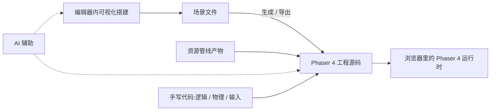

import { Meta } from '@storybook/addon-docs/blocks';

<Meta id="phaser-editor" title="进阶/Phaser Editor" name="Docs" />

# Phaser Editor

Phaser Editor(当前主版本 v5)是 Phaser 官方出品的**订阅制可视化编辑器**:在桌面应用里拖放搭建场景、管理资源管线、用 AI 辅助内容生产,产物落入标准 Phaser 4 工程,运行时不依赖编辑器。它面向团队与严肃项目——内容量大、迭代频繁时,可视化生产的回报最大。本课是一份产品介绍与选型地图:它是什么、与免费入门应用 Phaser Launcher 及瓦片地图编辑器 Tiled 的边界、可视化场景如何与手写代码共存、资源管线与 AI 的能力形态,以及订阅与试用怎么获取。界面与功能细节以应用内实际界面与官方文档为准。

| 项 | 内容 | 回查要点 |
| --- | --- | --- |
| 产品形态 | 订阅制桌面应用 | Windows / macOS / Linux 三平台 |
| 版本支持 | v5 完整支持 Phaser 4 | 与本手册边界(Phaser 4,当前 v4.2.x)一致 |
| 核心能力 | 可视化场景编辑、资源管线、AI 集成 | 分别见对应小节 |
| 官方产品页 | `phaser.io/editor` | 订阅方案、下载与功能介绍的总入口 |
| 官方文档 | `docs.phaser.io/phaser-editor` | 操作细节与版本演进的真源 |
| 起手模板 | `github.com/phaserjs/phaser-editor-v5-starter-templates` | 官方 starter 模板仓库 |
| 与 Launcher | Launcher 免费、面向入门 | 选型见「与 Phaser Launcher 的取舍」 |
| 与 Tiled | Tiled 编辑地图数据 | Editor 编辑场景与资源管线,两者配合 |

## 快速上手

最小闭环是"拿到编辑器并跑起第一个工程"。访问 [phaser.io/editor](https://phaser.io/editor) 了解当前订阅方案并完成订阅或开通试用;按平台(Windows / macOS / Linux)下载安装;新建工程时从模板起步——官方在 [phaserjs/phaser-editor-v5-starter-templates](https://github.com/phaserjs/phaser-editor-v5-starter-templates) 维护 v5 starter 模板,可先浏览它了解典型工程长什么样;最后在编辑器里打开一个场景并运行工程,确认可视化搭建的产物能在浏览器里跑起来。安装与新建工程的具体界面步骤以应用内实际界面为准。跑通这一环后,后面的小节分别展开这条链路:场景怎么变成代码、资源怎么进管线、AI 在哪里介入。

## 定位与辨析

Phaser 本体是代码框架:场景、精灵、物理全部用 TypeScript 写。Phaser Editor 补上"可视化"这一块——把关卡搭建、资源整理这类高重复劳动从代码移进编辑器。三个名字最容易混,一张表先划清边界:

| 工具 | 定位 | 编辑什么 | 付费模式 |
| --- | --- | --- | --- |
| Phaser Launcher | 免费入门应用 | 不编辑游戏内容;管项目创建、模板与素材浏览 | 免费 |
| Phaser Editor | 可视化编辑器 | 场景内容与资源管线 | 订阅制 |
| Tiled | 瓦片地图编辑器 | 地图数据,导出 Phaser 可加载的地图文件 | 独立工具(5.1 的配套工具) |

与 Tiled 的关系一句话说清:Tiled 编辑的是**地图数据**(图块层、对象层,产物由 Phaser Tilemap 加载渲染,见[5.1 瓦片地图](?path=/docs/tilemap--docs));Editor 编辑的是**场景与资源管线**。Tiled 做出的地图可以作为资源进入 Phaser 工程,与 Editor 是配合而非替代。

### 与 Phaser Launcher 的取舍

这是本课的核心辨析点,两个都是官方应用,差别在解决的不同问题:

| 维度 | Phaser Launcher(6.2.1) | Phaser Editor(本课) |
| --- | --- | --- |
| 解决的问题 | "从零开始":创建项目、装好环境、浏览素材 | "内容生产效率":可视化搭场景、管资源、AI 辅助 |
| 是否可视化编辑场景 | 否(代码编辑器 + 媒体浏览器) | 是(核心能力) |
| 付费模式 | 免费 | 订阅制 |
| 适用阶段 | 入门、个人学习、原型 | 团队协作、严肃项目、大量内容迭代 |

判断顺序很直接:个人学习、验证 API、小项目——Launcher 或纯代码工程完全够用(见[6.2.1 Phaser Launcher](?path=/docs/phaser-launcher--docs));多人协作、关卡与资源量大到重复劳动明显、预算允许订阅——Editor 开始有回报。两者不冲突:先用 Launcher 或纯代码把 Phaser 本身学会(本手册第 1、2 章),再让 Editor 加速内容生产;反过来,先学编辑器再学代码,会把"工具用法"和"引擎机制"混在一起,排查问题时两头都不落地。

## 场景搭建与代码共存

可视化搭建最关键的问题是:**拖出来的东西怎么和手写代码共存?** 通用模型只有两种取向——编辑器把搭建结果存为**场景文件**(结构化数据,工程加载它来构建场景),或**生成/导出代码**(把场景编译成工程里的 Phaser 源码)。Phaser Editor 围绕场景文件组织工程:在编辑器内可视化搭建,编辑器负责让场景进入 Phaser 工程可运行(生成与导出的具体取向、格式与配置以[官方文档](https://docs.phaser.io/phaser-editor)为准)。

无论哪种取向,三个事实不变:

- **分工线:编辑器管内容,代码管逻辑。** 场景里有什么对象、摆在哪、什么属性,进编辑器;对象怎么动、怎么响应输入、物理与游戏规则,留在手写代码。
- **衔接点在 Scene 结构上。** 编辑器产出的场景,对应手写工程里 `preload` / `create` 做的事(结构见[1.3 场景生命周期](?path=/docs/scene-lifecycle--docs));看懂 Scene 就能读懂编辑器产物的骨架。
- **引擎 API 不因编辑器改变。** Sprite、Tween、物理、输入仍是同一套 API,本手册第 1~5 章的内容在 Editor 工程里照用;反过来,Editor 也不替代其中任何一课的机制知识。

## 资源管线

资源管线是 Editor 的第二大块:图片、图集、音频等资源如何被组织进工程并在编辑器内管理。对本手册读者,两件事值得先建立预期:

- **图集是重点对象。** 图集(多张小图合成一张纹理 + 帧映射)本来就是 Phaser 的性能基本要求:减少 draw call、让同批对象不断批,移动端尤其如此(见[2.1.2 纹理图集](?path=/docs/texture-atlas--docs)与[6.1.1 性能优化](?path=/docs/performance--docs))。散图打包为图集、维护帧映射正是重复劳动,编辑器的资源管线围绕这一类工作展开;具体打包与预览能力以官方文档为准。
- **加载侧不变。** 资源无论怎么进工程,运行时仍是 Phaser Loader 按 key 加载、从缓存读取(见[2.1.1 资源加载器](?path=/docs/asset-loader--docs))。Editor 改变的是资源**怎么被组织与产出**,不改变资源**怎么被加载与使用**——出加载问题时,排查思路仍落在 2.1.1 的那套结论上。

## AI 集成

Phaser Editor v5 提供 AI 集成系统:把 AI 辅助纳入编辑器工作流,加速内容与代码的生产;具体能生成什么、如何配置与使用,以[官方产品页](https://phaser.io/editor)与应用内实际界面为准。

对本手册读者,AI 集成的正确预期是:AI 产出的内容最终仍落在 Phaser API 与工程产物上——先懂引擎(第 1~5 章的机制),再让 AI 加速,才有能力判断与修正生成结果;跳过引擎直接依赖 AI 生成,排查问题时没有落点。这与上一节的分工线一致:AI 可以加速"内容"与样板代码,不替代"机制"的理解。

## 获取与订阅

汇总获取路径与事实(方案与价格随时间演进,以产品页当前信息为准):

- **订阅与试用:** 经 [phaser.io/editor](https://phaser.io/editor) 订阅;是否提供试用及试用条件以产品页当前说明为准。
- **平台:** Windows、macOS、Linux 三平台桌面应用。
- **起手模板:** [phaserjs/phaser-editor-v5-starter-templates](https://github.com/phaserjs/phaser-editor-v5-starter-templates),官方维护的 v5 starter 模板仓库。
- **文档:** [docs.phaser.io/phaser-editor](https://docs.phaser.io/phaser-editor),操作细节、更新与迁移说明的真源。
- **免费的替代入口:** 不打算订阅时,[Phaser Launcher](https://phaser.io/download) 或纯代码工程(见[1.1 安装](?path=/docs/installation--docs))覆盖入门与个人项目需要。

## 最佳实践

- **先引擎后编辑器。** 先用 Launcher 或纯代码工程掌握 Phaser API,再引入 Editor 提速内容生产;可视化工具的回报随内容规模增长,学习期项目先不订阅。
- **内容进编辑器,逻辑留在代码。** 场景搭建、关卡摆放、资源组织交给编辑器与资源管线;游戏机制、物理、输入与状态保持手写,两侧通过 Scene 结构衔接。
- **选型三问:协作、内容量、预算。** 是否多人协作?关卡与资源是否多到重复劳动明显?是否接受持续订阅?三个都是"否"时纯代码工程完全成立,不必为工具付费。
- **以官方文档为真源。** 订阅方案、场景导出细节与 AI 能力随版本演进;本课只锁定稳定事实,具体操作引用 docs.phaser.io/phaser-editor 的当前内容。

## 常见问题

- **不用 Phaser Editor 能开发 Phaser 吗?**
  能,而且这是完全主流的方式。Phaser 是纯代码框架,Editor 是可选的生产工具;本手册第 1~5 章的全部内容不依赖它。
- **Phaser Editor 是免费的吗?**
  不是,它是订阅制产品;免费的是 Phaser Launcher(项目创建、模板与素材浏览)。两者定位差别见「与 Phaser Launcher 的取舍」。
- **在编辑器里搭的场景,离开编辑器还能跑吗?**
  产物落在标准 Phaser 4 工程上,游戏运行时不依赖编辑器——浏览器跑的是 Phaser 本体;订阅到期影响的是回到编辑器继续可视化编辑,工程与产物的处置细节以官方文档说明为准。
- **Phaser 3 项目能用 v5 吗?**
  v5 完整支持的是 Phaser 4;Phaser 3 项目不在本手册版本边界内,迁移与兼容问题以官方文档为准。

## 总结回顾

摘要:

Phaser Editor v5 是官方订阅制可视化编辑器(Windows/macOS/Linux),完整支持 Phaser 4,核心能力是可视化场景编辑、资源管线与 AI 集成,面向团队与严肃项目。它与免费的 Phaser Launcher 分工不同:Launcher 解决"从零开始",Editor 解决"内容生产效率";与 Tiled 是配合关系——Tiled 编辑地图数据,Editor 编辑场景与资源管线。工作流上,编辑器管内容、代码管逻辑,可视化搭建经场景文件落入标准 Phaser 4 工程,引擎 API 不变;资源被组织与产出,但运行时加载仍是同一套 Loader。获取经 phaser.io/editor 订阅,起手参考官方 starter 模板仓库,操作细节以 docs.phaser.io/phaser-editor 为真源。

一句话:

> Phaser Editor 不改变 Phaser 的任何机制,它把"场景搭建与资源整理"这类高重复内容生产移进可视化编辑器——先懂引擎再用编辑器,产物仍是标准 Phaser 4 工程。

知识要点:

- Phaser Editor 的产品形态、付费模式与支持的平台分别是什么?
- 它与 Phaser Launcher、Tiled 各自的边界怎么划?
- 可视化搭建的结果有哪两种落进工程的取向?分工线是什么?
- 编辑器改变了资源工作的哪一端,不改变哪一端?
- AI 集成的正确预期是什么?
- 订阅、试用、起手模板分别去哪里找?
- 什么时候应该用 Editor,什么时候纯代码工程更合适?

## 参考资料

- [Phaser Editor 官方产品页](https://phaser.io/editor)
- [Phaser Editor 官方文档](https://docs.phaser.io/phaser-editor)
- [phaser-editor-v5-starter-templates 官方模板仓库](https://github.com/phaserjs/phaser-editor-v5-starter-templates)
- [Phaser 官方文档](https://docs.phaser.io/)
- [Phaser Launcher 下载页](https://phaser.io/download)
