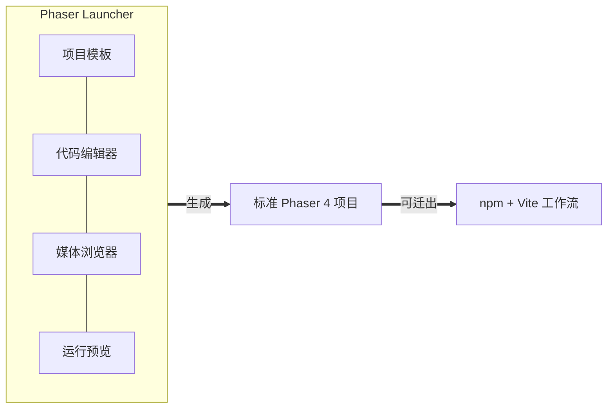

import { Meta } from '@storybook/addon-docs/blocks';

<Meta id="phaser-launcher" title="进阶/Phaser Launcher" name="Docs" />

# Phaser Launcher

Phaser Launcher 是官方免费的桌面应用,把「建项目、写代码、找素材、跑游戏」装进一个程序:装好它,不碰命令行就能开工一个 Phaser 4 项目。本课是一份能力地图,讲清四件事:它解决什么问题(零配置上手)、四个内置能力(项目模板、代码编辑器、媒体浏览器、运行预览)各替代手动路线的哪一步、它生成的项目与标准 Phaser 工程是什么关系(同一引擎,随时可迁出到 npm + Vite),以及它与名字很像的另一个产品 Phaser Editor 的边界——两者不是免费版和付费版,是两种工具。安装途径的横向对比在 [1.1 安装](?path=/docs/installation--docs)已有入口,本课不重复。

Launcher 未随本手册工作区安装,课程级参考是官方下载页与官方教程(见参考资料);应用内的具体界面与按钮措辞以实际版本为准。

| 项 | 值 / 入口 | 回查要点 |
| --- | --- | --- |
| 定价 | 免费 | 官方免费应用,无订阅 |
| 平台 | Windows、macOS | 下载页 [phaser.io/download](https://phaser.io/download) |
| 内置能力 | 项目模板、代码编辑器、媒体浏览器、运行预览 | 逐项展开见「能力地图」 |
| 生成的项目 | 标准 Phaser 4 工程 | 同一 `phaser` 引擎与 API,可迁出 npm 工程,见「项目结构与迁移」 |
| 与 Phaser Editor 的关系 | 不同产品 | Editor 是订阅制可视化编辑器,见「与 Phaser Editor 的区别」 |
| 引擎版本核对 | `Phaser.VERSION` | 输出以 `4` 开头,与手册锁定的 4.x 边界一致 |

## 快速上手

最小闭环:下载 → 新建项目 → 运行 → 改一行代码再运行。

1. 打开 [phaser.io/download](https://phaser.io/download),按系统(Windows / macOS)下载 Phaser Launcher 并安装。
2. 启动应用,新建项目:选一个项目模板,给项目命名并确认保存位置。
3. 在应用内点运行,预览窗口出现模板游戏——一个真实的 Phaser 4 游戏已经在跑。
4. 在内置代码编辑器里改一处文本或坐标,保存后再运行,看到画面随之变化。

可观察结果:全程没有打开终端,游戏跑起来了,并且随你的编辑改变。到这一步 Launcher 的核心循环已经用完;四个能力各自怎么用好,见下一节。具体按钮与菜单措辞以应用内实际界面为准。

## 能力地图

[1.1 安装](?path=/docs/installation--docs)的 npm 路线是「装 Node → 建工程 → 装依赖 → 起服务」,每一步都可能卡住初学者。Launcher 的答案是把整条工具链内置:装好应用,编辑器、模板、素材入口和运行环境就都有了。这就是它解决的核心问题——**零配置上手**,代价是工具链交给应用托管。

两条路线逐步对照:

| 开发环节 | 手动路线(1.1) | Launcher |
| --- | --- | --- |
| 前置安装 | Node.js + npm | 仅 Launcher 本体 |
| 创建项目 | `npm create` 创建器或手动 Vite | 应用内从模板新建 |
| 写代码 | 自选编辑器(如 VS Code) | 内置代码编辑器 |
| 找素材 | 自备文件,自己组织目录 | 媒体浏览器浏览并获取 |
| 本地运行 | `npm run dev` | 应用内点运行 |
| 引擎 | `phaser` npm 包 | **同一个 Phaser 4 引擎** |

最后一行是理解本课的关键:两条路线的分叉只发生在工具链层,引擎与 API 层从未分叉——Launcher 里写的 `new Phaser.Game(...)`、Scene、Loader 与手册所有课程是同一套东西。

下面按四个能力逐个展开:各是什么、怎么用、边界在哪。

### 项目模板

新建项目时从模板起步:模板预置了可运行的场景结构、依赖与示例内容,项目一落地就能跑,改造一个能跑的东西比从空白文件快得多。用法就是快速上手里的第 2 步——新建项目时挑一个贴近目标玩法的模板,命名,开始改。

- 模板是起点不是框架:进去之后改哪些文件、往哪个方向做,模板不构成约束。
- 模板清单与内容随版本更新,以应用内实际列表为准;想完全按自己的结构从零搭,走 [1.1 安装](?path=/docs/installation--docs)的手动路线。
- 判断选哪个模板:看它离你的目标玩法有多近,而不是看它演示的技术多花哨——要替换的示例内容越少越好。

### 代码编辑器

Launcher 内置代码编辑器,新建项目后直接在里面改代码、保存、再运行,形成快速上手里的那个循环,不需要先装 VS Code 一类的外部编辑器。

- 它是「够用的默认值」,不是「唯一选择」:生成的项目是磁盘上的标准工程文件(见「项目结构与迁移」),想换外部编辑器打开同一目录继续写,工作流不受影响。
- 编辑体验的取舍判断:项目小、改完就跑的阶段,内置编辑器最顺手;项目变大、需要重构与全局搜索时,专业编辑器更合适——但因为改的是同一份文件,切换没有迁移成本。
- 编辑器的具体功能(补全、高亮等)以应用内实际表现为准。

### 媒体浏览器

媒体浏览器(Media Browser)解决的是「素材从哪来」:在应用内浏览素材,把选中的素材获取进项目,省掉开工前满网找图找音的环节。对没有素材库的个人开发者,这是四个能力里最省时间的一个。

素材进项目后,就回到 Phaser 的普通世界:它们是项目里的资源文件,用 [2.1.1 资源加载器](?path=/docs/asset-loader--docs)的同一套 `this.load.*` 与缓存知识处理,没有 Launcher 专属的素材 API。

两条边界:

- 浏览器里有什么、素材清单与分类如何组织,以应用内实际内容为准。
- 素材授权各不相同,商用前逐份核对许可,不要默认「在官方应用里看到 = 可商用」。

### 运行与预览

应用内点运行即本地预览,替代 `npm run dev` 起服务的环节。运行的是真实的 Phaser 4 游戏:同一渲染管线、同一浏览器级环境,不是降级模拟,所以画面表现、控制台报错这些调试信号与浏览器开发一致。

边界:运行预览服务的是**开发期**,「怎么把游戏交出去」不归它管——生产构建属 [6.1.2 生产构建](?path=/docs/production-build--docs),打包成原生应用属 [6.1.3 原生打包](?path=/docs/native-packaging--docs)。需要这两件事的那天,就是按下一节把项目迁出到 npm 工程的典型时机。

## 项目结构与迁移

Launcher 生成的项目不是私有格式,而是**标准 Phaser 4 工程**:同样的 `new Phaser.Game(...)` 入口、Scene 类、Loader API;引擎就是同一个 `phaser` npm 包(本工作区实测 `phaser@4.2.1`:包内 `exports` 把 `import` 指向 `dist/phaser.esm.js`,TypeScript 类型内置在 `types/phaser.d.ts`)。在 Launcher 项目里 `console.log(Phaser.VERSION)`,输出同样以 `4` 开头。

由此得出迁移的真实含义——**不是「导出」或「转换」,而是给同一份代码换一套工具链**:

1. 项目目录本身就是工程文件,直接在其中接管 npm 工作流:`npm install` 装好依赖、`npm run dev` 起服务,与 [1.1 安装](?path=/docs/installation--docs)的手动路线从此汇合。
2. 汇合之后,手册的进阶课程原样适用:[6.1.2 生产构建](?path=/docs/production-build--docs)的 `vite build`、[6.1.3 原生打包](?path=/docs/native-packaging--docs)的 Capacitor 链路,操作的都是这种标准工程。
3. 概念与代码在迁移前后不变:1.x–5.x 学的 Scene、输入、物理、瓦片地图就是项目里正在跑的代码;官方示例库的代码在 Launcher 项目里同样能跑([Labs 示例浏览器](https://labs.phaser.io/phaser4-index.html)按主题检索)。

反向不成立也不必成立:已经在 npm 路线上的工程没有「迁入」Launcher 的需要——两条路是同一引擎的两种工作方式,按需各取。

## 与 Phaser Editor 的区别

两个名字都带 Phaser,却是两个独立产品,也是本课最容易被混淆的辨析点:

| | Phaser Launcher(本课) | Phaser Editor(6.2.2) |
| --- | --- | --- |
| 定位 | 一体化入门应用 | 专业可视化工具链 |
| 收费 | 免费 | 订阅制 |
| 核心能力 | 模板建项目、写代码、找素材、运行 | 可视化场景编辑、资源管线、AI 辅助工作流 |
| 主要工作方式 | 仍然是写代码 | 在画布上拖拽编辑场景 |

判断分水岭就一条:**要不要「不写代码地在画布上摆场景」**。要,看 [6.2.2 Phaser Editor](?path=/docs/phaser-editor--docs);不要,Launcher 免费覆盖了起步阶段的全部需要。两者也可以先后使用——按下一节把 Launcher 项目迁出为标准工程后,再评估是否引入 Editor。

一个防混淆的落点:看到「Phaser 的官方编辑器要订阅」时,说的是 Editor;Launcher 本身免费,下载页见 [phaser.io/download](https://phaser.io/download)。

## 最佳实践

- **路线选择按「谁维护工具链」判断**:让应用托管、专注学游戏本身,选 Launcher;团队协作、版本控制、CI、构建定制这些需要自己掌握工具链的场景,选 npm + Vite([1.1 安装](?path=/docs/installation--docs));一次性试验用 CDN。判断依据不是水平高低——API 层两条路完全相同。
- **迁移宜早不宜晚**:需要 Launcher 之外的能力(生产构建、原生打包、CI)那天就迁出到 npm 工程。因为 API 层从未分叉,迁移成本只随「依赖了多少应用内便利功能」增长,不随项目大小增长;素材与代码从第一天起就是标准形态。
- **两条路线不是阵营**:初学用 Launcher 起步、项目成型后迁到 npm 工程、需要可视化编辑再上 Editor,是同一份标准工程上的自然演进,不需要一次性选死。
- **版本意识照旧**:Launcher 项目里同样用 `Phaser.VERSION` 核对版本以 `4` 开头;升级引擎的影响与 1.1 的版本纪律一致,先看 CHANGELOG 再动。

## 常见问题

- 电脑上没装 Node.js,能用 Phaser 开发吗?
  能。Launcher 的定位就是把运行环境内置,新建项目到运行预览全程不需要 Node 和命令行;只有按「项目结构与迁移」迁出到 npm 工程时才需要安装 Node(见 [1.1 安装](?path=/docs/installation--docs))。
- 在 Launcher 里能跟着本手册的课练习吗?
  1.x–5.x 的绝大部分能:引擎与 API 相同,课程代码原样适用。例外是讲构建工具链的部分——6.1.2 生产构建、6.1.3 原生打包操作的是 npm 工程,先按「项目结构与迁移」迁出再继续。
- Phaser Launcher 是 Phaser Editor 的免费版吗?
  不是,两者是不同产品:Launcher 是免费的一体化入门应用,Editor 是订阅制的可视化编辑器。别把「要不要付费」当成选型依据,用「要不要可视化场景编辑」来判断,见「与 Phaser Editor 的区别」。
- Launcher 项目能放进 git 与团队协作吗?
  能——项目是磁盘上的标准工程文件,版本控制按普通工程对待。但协作者若没有 Launcher,就在 npm 工作流里开发同一目录(见「项目结构与迁移」);需要全员统一工具链时,迁出时机越早越省事。

## 总结回顾

摘要:

Phaser Launcher 是官方免费桌面应用(Windows / macOS,下载页 phaser.io/download),把建项目、写代码、找素材、运行预览内置到一个程序里,用零配置上手换掉了 1.1 手动路线的全部工具链步骤。四个能力各替代一步:项目模板替代工程创建,内置编辑器替代自选编辑器,媒体浏览器替代自备素材,运行预览替代 `npm run dev`。它与手动路线的分叉只在工具链层——生成的项目就是标准 Phaser 4 工程(同一个 `phaser` 包、同一套 API),因此「迁移」不是格式转换,而是给同一份代码接管 npm 工作流,之后 6.1.x 的构建与打包课程原样适用。它与 Phaser Editor 是两个产品:免费的入门应用 vs 订阅制的可视化场景编辑器,分水岭是要不要在画布上拖拽编辑。

一句话:

> Launcher 换掉的是工具链步骤,不是引擎——项目从第一天起就是标准 Phaser 4 工程,随时可迁回 npm 路线。

知识要点:

- Phaser Launcher 解决的核心问题是什么?收费与支持平台?
- 四个内置能力分别是什么,各自替代手动路线的哪一步?
- Launcher 生成的项目是什么形态?「迁移到 npm 工程」实际要做什么?
- 用什么信号确认 Launcher 项目跑的是 Phaser 4?
- Launcher 与 Phaser Editor 在定位、收费、核心能力上的差异是什么?选型分水岭是哪条?
- 没装 Node 的机器能开发吗?什么时候才需要装?

## 参考资料

- [Phaser Launcher 下载页](https://phaser.io/download):免费应用的下载入口与平台版本,本课的课程级官方参考。
- [Phaser Launcher 官方教程(phaser.io/learn)](https://phaser.io/learn):应用内功能(模板、媒体浏览器等)的官方教程;界面细节以应用与教程为准。
- [Phaser 官方文档](https://docs.phaser.io/):Launcher 项目中使用的 Phaser 4 API 核对(`Game`、`VERSION` 等)。
- [Phaser 4 Labs 示例浏览器](https://labs.phaser.io/phaser4-index.html):验证「示例代码在 Launcher 项目中同样可跑」的引擎一致性。
