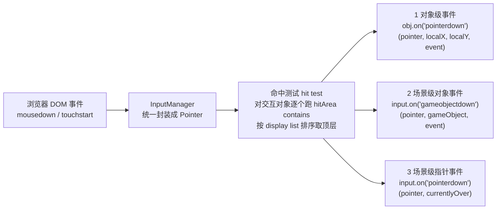

import { Canvas, Controls, Meta } from '@storybook/addon-docs/blocks';
import * as PointerInput from './pointer-input.stories';

<Meta of={PointerInput} name="Docs" />

# 指针与交互

Phaser 把鼠标、触摸统一成一个抽象:**Pointer 对象**(`Phaser.Input.Pointer`)。消费指针输入有两条主通路——**场景级事件**(`this.input.on('pointerdown', ...)`,画布任意处按下、移动都派发,适合读坐标、拖视角、空点确认);**对象级交互**(对 Game Object 调 `setInteractive()` 后,它拥有命中区 hitArea,命中时派发 `obj.on('pointerdown')` 等事件,适合按钮、卡牌、可拾取物)。两条通路不是并列选项,而是同一条派发链的上下游:命中测试先跑,对象级事件先发,场景级事件后发。在此之上再叠两块能力:**拖拽**(`draggable` + `dragstart/drag/dragend`)与**拖放目标**(DropZone 的 `dragenter/dragleave/drop`)。本课按「指针状态 → 场景级事件 → 对象交互 → 拖拽与拖放」的顺序展开。键盘属于 [2.4.1 键盘](?path=/docs/keyboard-input--docs),手柄属于 [2.4.3 游戏手柄](?path=/docs/gamepad-input--docs);摄像机滚动的完整机制属 [2.5.1 摄像机控制](?path=/docs/camera-control--docs),本课只为讲清 `worldX` 做最小演示。

一次按下在 Phaser 内部的流转与派发顺序(同一次交互按 1 → 2 → 3 依次派发,上层可 `stopPropagation` 截断):



关键 API 的默认值(以下经 phaser@4.2.1 类型与源码核实):

| API / 属性 | 默认值 | 回查要点 |
| --- | --- | --- |
| `setInteractive()` 无参调用 | 纹理帧矩形 | 用 `Rectangle.Contains` 做 contains;无纹理帧时按对象宽高推断,宽高为 0 的对象(Graphics 等)静默失败 |
| `InputConfiguration` | 全 `false` | `draggable` / `dropZone` / `useHandCursor` / `pixelPerfect` 默认都关;`pixelPerfect` 配 `alphaTolerance`(默认 1) |
| `input.topOnly` | `true` | 只对最顶层交互对象派发事件;`setTopOnly(false)` 后重叠对象全部命中 |
| `input.dragDistanceThreshold` | `0` | 按住后移动超过该像素才算拖拽;0 即立即判定 |
| `input.dragTimeThreshold` | `0` | 按住超过该毫秒才算拖拽;0 即立即判定 |
| `input.pollRate` | `-1` | 只在指针移动时轮询命中;对象自转而指针不动时 over/out 不刷新,需 `setPollAlways()` |
| `input.activePointers`(Game config) | `1` | 触摸指针数量;加上 `mousePointer` 共 2 个 Pointer,`addPointer` 上限 10 |
| `Pointer.smoothFactor` | `0` | 不平滑;设小值(如 0.2)平滑指针位置 |
| `pointer.worldX` 更新时机 | 事件内有效 | 事件外读取前先 `pointer.updateWorldPoint(camera)` |

## 快速上手

最小闭环:一张图片设为可交互,点击时响应——三行核心代码就能跑。

```ts
class Demo extends Phaser.Scene {
  create() {
    const button = this.add.image(360, 200, 'button');
    button.setInteractive({ useHandCursor: true }); // 建立命中区(默认纹理矩形),悬停变手型
    button.on('pointerdown', (pointer: Phaser.Input.Pointer) => {
      // 对象级事件:只有点击落在命中区内才触发;pointer 是完整指针状态
      button.setTint(0x4ade80); // 点击反馈
    });
  }
}
```

`setInteractive()` 一次调用做三件事:创建命中区(默认按纹理帧生成矩形)、把对象加入场景的输入列表、让它有资格收到对象级事件。没有它,对象在指针眼里就是「不存在」——场景级 `pointerdown` 照样触发,但不会有任何对象事件。下文先讲怎么读指针本身,再回到事件与命中区的细节。

## 指针状态:Pointer 对象

Pointer 是鼠标与触摸的统一状态档案:鼠标移动、按下、触摸点变化都会更新它。场景里通过 `this.input` 取用——`this.input.activePointer` 永远指向最近一次交互的指针,是通用入口;每个事件回调的第一个参数也是它。它同时携带位置、按键、速度三类读数,取用前先分清两套坐标系。

### 屏幕坐标与世界坐标

| 读数 | 空间 | 换算关系 |
| --- | --- | --- |
| `pointer.x` / `pointer.y` | 画布坐标(游戏坐标系,不含摄像机滚动) | 由 DOM 事件位置换算,已考虑画布缩放 |
| `pointer.worldX` / `pointer.worldY` | 摄像机世界坐标 | `camera.getWorldPoint(x, y)` 的结果;zoom 为 1 时约等于 `x + scrollX` / `y + scrollY` |

判断口诀:**对象放在世界里,就用 `worldX`;只把指针当屏幕指示,用 `x`。**摄像机不动时两者相等——很多小游戏因此没踩到坑,一旦摄像机滚动(跟随角色、拖动地图),用 `x` 移动对象就会「指针在东、对象在西」,差值恰好是 `scrollX` / `scrollY`。两个注意点:

- `worldX` 在指针事件处理期间是新鲜的;在 `update` 等事件外读取前,先调 `pointer.updateWorldPoint(camera)` 用指定摄像机重算一次(多摄像机时这也是选择摄像机的唯一正确方式)。
- 画布被页面 CSS 缩放时,`x` / `y` 已换算回游戏坐标,直接与对象坐标比较即可,不需要自己除以缩放比。

本课实验台用「摄像机 scrollX」Controls 做最小演示:`scrollX` 为 0 时两套读数相等,拉大后 `x` 不变而 `worldX` 随之偏移(见「顶层命中:topOnly」的范例)。

### 按键与按下状态

| 读数 | 含义 | 备注 |
| --- | --- | --- |
| `isDown` | 任意键是否按住 | 触摸按下同样为 `true` |
| `primaryDown` | 主键(左键 / 触摸)是否按住 | 拖拽判定用的就是它 |
| `leftButtonDown()` / `rightButtonDown()` / `middleButtonDown()` | 指定按键是否按住(方法) | 触摸设备上 `button` 恒为 0,等同左键 |
| `buttons` | 按位掩码:1 左、2 右、4 中、8 后退、16 前进 | 组合按键时按位或,如左+右为 3 |
| `button` | 最近一次 down/up 事件的按键编号 | 只在事件瞬间的回调里有意义 |
| `wasTouch` | 最近一次事件来自触摸(`true`)还是鼠标(`false`) | 触屏笔电上区分输入来源 |
| `downX` / `downY` / `downTime` | 按下瞬间的位置与时间戳 | `getDistance()` / `getDuration()` 基于它们派生 |
| `getDistance()` / `getDuration()` | 按住后已移动的像素 / 已持续的毫秒 | 松开后定格为最后一轮的值 |

`isDown` 与 `leftButtonDown()` 的区别在多键场景:右键按住时 `isDown` 为 `true` 而 `leftButtonDown()` 为 `false`。判定「点击」用左键或 `primaryDown`,判定「按住任意键」才用 `isDown`。还有一组 `leftButtonReleased()` 等方法表示「最近一次动作是松开该键」,用于在 `pointerup` 回调里区分松开的是哪个键。

### 多指针:addPointer 与 activePointer

Phaser 默认创建 2 个 Pointer:`mousePointer`(鼠标专属)与 `pointer1`(第一个触摸点),对应 Game config 的 `input.activePointers: 1`(触摸指针数)。多点触控需要更多时,运行时 `this.input.addPointer(2)` 补到 `pointer2`、`pointer3`(总数上限 10),或在 config 里直接配 `input: { activePointers: 3 }`。

- **桌面专用游戏**可以直接用 `this.input.mousePointer`;**要兼容触摸**一律用 `this.input.activePointer`——它总是映射最近交互的那个指针,鼠标与触摸通吃。
- 多点触控逻辑(双指缩放)分别在两个 `pointermove` 回调里对比 `pointer1` / `pointer2` 的坐标,回调参数里的 `pointer.id` 可区分是哪个触摸点。
- `this.input.x` / `this.input.y` 是「活动指针坐标」的快捷方式,基于摄像机列表第一个摄像机,仅单摄像机、无多触摸时安全。顺带核实:常被问到的 `getPointerPosition` 在 phaser@4.2.1 中不存在,取坐标就用 `activePointer` 或事件回调参数。

## 场景级事件:this.input.on

场景级事件注册在 `this.input`(`InputPlugin`)上,指针在画布任意处移动、按下、抬起都派发,不要求命中任何对象——「空点」也有效。这一组是读坐标、实现自定义光标逻辑、处理「点到空白处取消选择」的主力:

```ts
// 回调参数:(pointer, currentlyOver)
// currentlyOver:本次命中测试命中的交互对象数组,topOnly 默认下至多 1 个元素
this.input.on('pointerdown', (pointer, currentlyOver) => {
  console.log(pointer.worldX, pointer.worldY, currentlyOver.length);
});
this.input.on('pointermove', (pointer, currentlyOver) => { /* 同签名 */ });
this.input.on('pointerup', (pointer, currentlyOver) => { /* 同签名 */ });
```

事件清单与各自签名:

| 事件 | 触发条件 | 回调参数 |
| --- | --- | --- |
| `pointerdown` / `pointerup` | 画布内按下 / 抬起(无论是否命中对象) | `(pointer, currentlyOver)` |
| `pointermove` | 指针移动(任意位置) | `(pointer, currentlyOver)` |
| `pointerover` / `pointerout` | 指针进入 / 离开**某个交互对象** | `(pointer, justOver / justOut)`——本次新进入 / 刚离开的对象数组 |
| `pointerdownoutside` / `pointerupoutside` | 按下 / 抬起发生在画布外 | `(pointer)` |
| `wheel` | 滚轮滚动 | `(pointer, currentlyOver, dx, dy, dz)` |
| `gameover` / `gameout` | 指针进入 / 离开画布本身 | `(timeStamp, event)`;等价状态量 `this.input.isOver` |
| `gameobjectdown` / `gameobjectup` / `gameobjectmove` / `gameobjectover` / `gameobjectout` | 命中交互对象时的场景级转发 | `(pointer, gameObject, event)` |

两个关键区分:

- **`pointerover` / `pointerout` 不是「进入 / 离开画布」。**它们必须命中交互对象才触发,且第二个参数是「这一步新进入 / 刚离开」的对象数组;指针悬停静止时两者都不发。要感知进出画布,用 `gameover` / `gameout` 或读 `this.input.isOver`。
- **`pointerdown` 与 `gameobjectdown` 的差别只在「是否命中对象」。**`pointerdown` 空点也触发;`gameobjectdown` 只有命中交互对象才触发,并把具体对象作为第二个参数给你——它是「场景级写法里最接近对象事件的一个」,适合统一处理一批同类对象而不用逐个 `on`。

与对象级注册的差异汇总:

| 注册方式 | 写法 | 适用 |
| --- | --- | --- |
| 场景级指针事件 | `this.input.on('pointerdown', fn)` | 任意位置的位置读取、拖视角、空点处理 |
| 场景级对象转发 | `this.input.on('gameobjectdown', fn)` | 统一处理一批对象;场景 `shutdown` 时随场景自动清理 |
| 对象级事件 | `obj.on('pointerdown', fn)` | 单个对象的专属逻辑;参数含 `localX` / `localY`(命中点相对对象左上角) |

三处注册对同一次点击**都会**触发(派发链 1 → 2 → 3 依次跑),不是三选一;要截断时在回调里调 `this.input.stopPropagation()`(对象级回调的最后一个 `event` 参数上也有同名方法),它会取消本次事件的剩余派发——链条上还没发的事件与本列表后面的场景都不再收到。对象级事件的完整清单见下一节。

## 对象交互:setInteractive 与命中区

对象交互的前提是 `setInteractive()`:它给对象挂一个 Interactive Object(`obj.input`,类型 `Phaser.Types.Input.InteractiveObject`),内含命中区、拖拽状态、光标配置。此后对象进入场景的命中测试列表,指针每步移动都会对列表里的对象跑一次 `hitAreaCallback(hitArea, localX, localY)`,命中才派发对象事件。对象级事件与场景级同名但签名不同:

```ts
obj.on('pointerdown', (pointer, localX, localY, event) => {});
obj.on('pointerover', (pointer, localX, localY, event) => {});
obj.on('pointerout', (pointer, event) => {});
obj.on('pointerup', (pointer, localX, localY, event) => {});
obj.on('pointermove', (pointer, localX, localY, event) => {}); // 仅命中时派发
obj.on('wheel', (pointer, dx, dy, dz, event) => {});
```

`localX` / `localY` 是命中点相对对象左上角的本地坐标(考虑原点与缩放后),做「点在对象哪个部位」的判断用它,不必自己减 `obj.x`。最后一个参数是原生 DOM 事件,需要 `preventDefault` 时可用。注意 `pointermove` 在对象级只在**命中期间**派发——它更像「悬停中持续移动」,与场景级「任意移动」语义不同。

### 命中区:hitArea 与 hitAreaCallback

命中区是一个几何形状加一个 `contains` 判定函数,共同决定「指针在对象身上吗」。四种给法:

```ts
// 1. 无参:按纹理帧生成矩形(最常用,Image/Sprite 直接可用)
sprite.setInteractive();

// 2. 形状 + 判定函数:形状坐标系以对象左上角为原点(不含对象位置)
sprite.setInteractive(new Phaser.Geom.Circle(36, 36, 36), Phaser.Geom.Circle.Contains);
sprite.setInteractive(new Phaser.Geom.Ellipse(36, 24, 72, 48), Phaser.Geom.Ellipse.Contains);
sprite.setInteractive(new Phaser.Geom.Rectangle(0, 0, 72, 72), Phaser.Geom.Rectangle.Contains);
sprite.setInteractive(new Phaser.Geom.Polygon([0, 24, 36, 0, 72, 24, 36, 48]),
  Phaser.Geom.Polygon.Contains);

// 3. 配置对象:一次带上拖拽、光标等开关
sprite.setInteractive({ hitArea: new Phaser.Geom.Circle(36, 36, 36),
  hitAreaCallback: Phaser.Geom.Circle.Contains, useHandCursor: true });

// 4. 插件级批量设置,生成规则同上
this.input.setHitAreaCircle(objects, 36, 36, 36); // 还有 Rectangle / Ellipse / Triangle / FromTexture 变体
```

边界与陷阱:

- **形状坐标是本地的。**`Circle(36, 36, 36)` 表示「直径 72 的圆形命中区,圆心在对象中心」,不要写世界坐标。
- **无尺寸可推断的对象必须显式给形状。**无参调用按「纹理帧,否则对象自身宽高」建矩形:`Graphics`、`BitmapText` 宽高为 0,会**静默失败**(不入命中列表);`Text`、`Rectangle` 等自带尺寸的按宽高推断成功;`Container` 须先 `setSize(w, h)`,否则控制台警告。
- **默认矩形按纹理帧算,与可见像素无关。**圆形贴图带透明四角时,点四角也算命中——要贴合可见图形就换成 Circle/Ellipse 命中区。
- **命中区随对象的缩放 / 旋转自动变换**(命中测试把指针换算到对象本地坐标),但**换形状不能靠再调一次 `setInteractive(shape)`**:对象已有 InteractiveObject 时它只是把旧对象重新 enable,形状不变。要换形状直接改属性:`sprite.input.hitArea = new Phaser.Geom.Circle(...)`(矩形可 `hitArea.setSize(w, h)`),监听器全部保留。
- **像素级命中**存在但代价高:`setInteractive({ pixelPerfect: true, alphaTolerance: 1 })`(等价 `this.input.makePixelPerfect(alphaTolerance)` 作 callback),仅对纹理对象有效,每次命中都读像素,按需少量使用;本课不展开。

### 光标与开关

```ts
sprite.setInteractive({ useHandCursor: true }); // 悬停变手型,等价 cursor: 'pointer'
sprite.setInteractive({ cursor: 'grab' });      // 任意 CSS cursor 值
this.input.setDefaultCursor('crosshair');       // 画布默认光标

sprite.disableInteractive();  // 临时关闭:保留命中区配置,可再 setInteractive() 恢复
sprite.removeInteractive();   // 彻底移除:销毁 Interactive Object,恢复须重建
this.input.enabled = false;   // 场景级总开关:整个场景的指针处理全停
```

`disableInteractive` 与 `removeInteractive` 的取舍:回合冷却、动画中禁点用前者(状态可逆);对象即将变形、命中区作废用后者。场景暂停接收输入用 `this.input.enabled = false`,注意它同时冻结所有指针事件与状态更新。

### 顶层命中:topOnly

多个交互对象重叠时,`input.topOnly`(默认 `true`)模拟 DOM 事件语义:**只有 display list 最顶层(后渲染、depth 更高)的那个对象收到事件**。`this.input.setTopOnly(false)` 关闭后,指针下方所有交互对象全部命中——场景级回调的 `currentlyOver` 变成多元素数组,每个对象各自派发 `over` / `down`。两种模式各有用途:UI 按钮叠放必须 `topOnly`(点到下层就乱套);「框选多个单位」「穿透点击」类玩法需要 `false`。

下面是本课的交互实验台:四个圆形对象(A、B 部分重叠,A 在上层),可悬停、点击、观察命中区差异;「摄像机 scrollX」把画布向右滚动,演示 `x` 与 `worldX` 的分离。

<Canvas of={PointerInput.PointerLab} />
<Controls of={PointerInput.PointerLab} />

| 读者操作 | 可观察证据 |
| --- | --- |
| 在画布内移动指针 | `pointer.x/y` 实时变化;`pointermove` 计数累加(高频,readout 节流显示) |
| 悬停到对象圆心 | 「悬停对象」显示对象名,对象描边高亮;`pointerover` +1 |
| 悬停到圆形贴图的四角 | 矩形命中区(默认)下仍显示对象名;切「圆形命中区」后四角不再命中,移回圆心才命中——命中区形状可切换 |
| 悬停到 A、B 重叠区 | `topOnly` 开启时只显示 A;关闭后显示 `A + B`,`pointerover` 一次 +2 |
| 点击对象 | 对象闪色,「最近点击」更新;`pointerdown`、对象级 `pointerdown`、`gameobjectdown` 三个计数同步 +1——三条注册通路对同一次点击都派发 |
| 点击空白处 | `pointerdown` 计数 +1,但对象级与 `gameobjectdown` 计数不动——场景级指针事件不要求命中对象 |
| 按住左键拖过对象 | `isDown` / `leftButtonDown` 读数变 1;移出后归 0 |
| 拉大「摄像机 scrollX」 | 画布内容左移、刻度尺滚动;指针不动时 `x` 读数不变而 `worldX` 随 scrollX 增长——两个坐标系分离 |
| scrollX > 0 后点击对象 | `worldX` 与对象世界坐标一致,命中判定不受滚动影响(hit test 按 `pointer.camera` 换算) |
| 打开 Show code | 看到该 Canvas 实际执行的 `pointer-lab.ts` 全文 |

实例滚出视口或页面切到后台时会整体休眠以省资源,回到视口自动恢复;休眠期间的指针事件不积压,readout 冻结只说明循环暂停。

## 拖拽:draggable 与 drag 事件

拖拽是对象交互的延伸:命中区决定「抓得到」,`draggable` 标志决定「抓得住」。开启方式两种——配置对象一步到位,或先 `setInteractive` 再补标志(适合批量、运行时切换):

```ts
// 方式一:配置对象
token.setInteractive({ draggable: true, useHandCursor: true });

// 方式二:插件方法,可传单个对象或数组;value=false 随时关掉
this.input.setDraggable(token);
this.input.setDraggable([a, b, c], false);
```

拖拽生命周期三个事件,场景级与对象级都派发:

| 事件 | 场景级签名 `this.input.on(...)` | 对象级签名 `token.on(...)` | 触发时机 |
| --- | --- | --- | --- |
| `dragstart` | `(pointer, gameObject)` | `(pointer, dragX, dragY)` | 拖拽判定成立那一刻 |
| `drag` | `(pointer, gameObject, dragX, dragY)` | `(pointer, dragX, dragY)` | 拖拽中每步移动 |
| `dragend` | `(pointer, gameObject, dropped)` | `(pointer, dragX, dragY, dropped)` | 松开;`dropped` 表示是否落在了 DropZone 上 |

**Phaser 不会自动移动对象。**`drag` 事件只是把「按当前指针位置算出的目标坐标」作为 `dragX` / `dragY` 告诉你,写不写回由你决定——最常见的一行:

```ts
this.input.on('drag', (pointer, gameObject, dragX, dragY) => {
  gameObject.x = dragX; // dragX/dragY 已把「抓取时的偏移」算进去,
  gameObject.y = dragY; // 抓圆心和抓边缘,对象不会跳位
});
```

`dragX` / `dragY` 的语义是「保持抓取点相对位置不变时对象应在的世界坐标」:从对象边缘抓起,拖动中对象中心始终偏移你抓的那段距离,所以不要用 `pointer.x` 直接赋值(会跳到指针点)。`dragstart` 里通常把对象 `setDepth` 提到最上层,`dragend` 里按需恢复。

判定阈值(挂在 `this.input` 上,对整个场景生效):`dragDistanceThreshold = 8` 要求按住后移动超过 8px 才算拖拽——「点击」和「拖动」并用时必备,否则手一抖点击就变拖拽;`dragTimeThreshold = 250` 要求按住超过 250ms,配合 `setPollAlways()` 才能在指针静止时按时触发。两者都设时**满足其一**即判定成立,默认都为 0(立即拖拽)。一个指针同一时刻只能拖一个对象;同一对象可以同时收到多个指针的 `drag` 事件(多指捏合旋转的实现基础)。

### DropZone:dragenter、dragleave 与 drop

DropZone 是拖拽的「落点」:一个被标记为 `dropZone` 的交互对象,拖动中的对象进入 / 离开 / 松手在它上面时派发三个事件。两种创建方式:

```ts
// 方式一:普通对象直接标记(setInteractive 第三个参数同名)
this.add.rectangle(180, 300, 240, 130, 0x233049)
  .setInteractive({ dropZone: true }); // Rectangle 等自带尺寸的对象按自身宽高推断矩形命中区

// 方式二:专用 Zone 对象:无渲染的矩形区域,setDropZone 默认按尺寸给矩形命中区
const zone = this.add.zone(540, 300, 240, 130).setDropZone();
```

拖放事件(场景级与对象级签名一致地错开一位):

| 事件 | 场景级签名 | 对象级签名(挂在被拖对象上) | 触发时机 |
| --- | --- | --- | --- |
| `dragenter` | `(pointer, gameObject, target)` | `(pointer, target)` | 被拖对象进入某个 DropZone |
| `dragover` | `(pointer, gameObject, target)` | `(pointer, target)` | 在 DropZone 内继续移动(首次进入发 `dragenter`,之后发 `dragover`) |
| `dragleave` | `(pointer, gameObject, target)` | `(pointer, target)` | 离开该 DropZone |
| `drop` | `(pointer, gameObject, target)` | `(pointer, target)` | 在 DropZone 上松手;`dragend` 紧随其后且 `dropped = true` |

`gameObject` 是被拖的对象,`target` 是命中的 DropZone。与拖拽一样,**落点吸附要自己做**——`drop` 回调里把 `gameObject.x = target.x` 之类写回,Phaser 只负责告诉你「落在哪」。命中区方面,`Rectangle` 这类自带尺寸的 Shape 与 `Zone` 一样按宽高推断矩形,`Graphics` 等无尺寸对象仍须显式给形状;`Zone` 的 `setRectangleDropZone(w, h)` / `setCircleDropZone(r)` 是按尺寸建命中区的快捷方式。

下面是拖拽与拖放实验台:一个可拖动的令牌,左右两个托盘(DropZone)。把令牌拖进托盘松手即「收纳」,拖到空地松手留在原地。

<Canvas of={PointerInput.DragLab} />
<Controls of={PointerInput.DragLab} />

| 读者操作 | 可观察证据 |
| --- | --- |
| 按住令牌拖动 | `getDragState` 变 4(判定成立、拖拽中);`dragX/dragY` 随指针同步;令牌跟随且抓取偏移保持——抓边缘拖动对象不跳位 |
| 从令牌中心抓 vs 边缘抓 | `dragstart` 时 `dragStartX/Y` 与令牌坐标相同;两种抓法拖动后令牌与指针的相对位置都稳定 |
| 拖入左 / 右托盘 | 托盘描边高亮,`dragenter` +1,「拖拽目标」显示托盘名;在盘内继续移动 `drag` 计数增长而 `dragenter` 不再增 |
| 盘内来回移动后移出 | 高亮消失,`dragleave` +1,「拖拽目标」回到 `—` |
| 在托盘上松手 | `drop` +1,该托盘「收纳数」+1,令牌吸附到托盘中心;`dragend` +1 且 `dropped` 为 `true` |
| 在空地松手 | 无 `drop`,`dragend` 的 `dropped` 为 `false`,令牌停在松手处——落点吸附是回调里手动做的 |
| 调大「拖拽判定距离」到 16 | 按住后小幅晃动不触发拖拽(`getDragState` 停在 2),移动超过阈值才变 4——点击与拖拽可区分 |
| 关闭「draggable」 | 按住令牌拖动无任何 drag 事件,`getDragState` 保持 0;`pointerdown` 类事件照常——`draggable` 只关拖拽,不关交互 |
| 打开 Show code | 看到该 Canvas 实际执行的 `drag-lab.ts` 全文 |

## 最佳实践

- **按消费方式选注册层。**读位置、拖视角、空点取消用场景级 `pointerdown` / `pointermove`;单个对象的点击反馈用对象级 `obj.on('pointerdown')`;一批同类对象统一处理用场景级 `gameobjectdown` 遍历,不必逐个挂监听。
- **命中区贴合可见图形。**圆形、菱形贴图默认矩形命中区会在透明角落误触,按视觉形状给 `Circle` / `Ellipse` / `Polygon` 命中区; UI 按钮则可以反过来放大命中区(矩形比图更大)提升触屏可点性。
- **点击与拖拽并存时设 `dragDistanceThreshold`。**8~12px 的阈值把「手抖」从拖拽里排除;不设(默认 0)时按下即进入拖拽判定,点击逻辑容易被误触。
- **拖拽坐标只用 `dragX` / `dragY`。**它们自带抓取偏移与世界坐标换算;直接用 `pointer.x` 赋值既丢偏移又在摄像机滚动后错位。
- **兼容触摸用 `activePointer`,别碰 `mousePointer`。**触屏上 `mousePointer` 不更新,事件回调参数或 `activePointer` 才是通用入口;多点触控在 config 或 `addPointer` 里先补够指针数量。

## 常见问题

- **`setInteractive()` 调了,对象还是收不到任何事件。**
  先看对象类型:Graphics、BitmapText 宽高为 0,无参调用建不出命中区(静默失败),必须显式给形状,如 `graphics.setInteractive(new Phaser.Geom.Rectangle(0, 0, w, h), Phaser.Geom.Rectangle.Contains)`;Container 先 `setSize(w, h)` 后无参调用,否则控制台会警告。其次确认回调里没有把 `pointer.x` 当世界坐标用而判定错位。
- **对象在动,`pointerover` / `pointerout` 不刷新。**
  `pollRate` 默认 `-1`:指针不动就不重跑命中测试,对象自己移到指针下不会触发 over。调 `this.input.setPollAlways()`(每步轮询)或 `setPollRate(ms)`;交互对象多时注意每帧命中测试的开销。
- **拖拽完全没反应。**
  依次核对三件事:对象 `setInteractive` 过(有命中区);`draggable` 开了(`setInteractive({ draggable: true })` 或 `setDraggable`)——只交互不可拖时 `drag` 一个都不会发;`drag` 回调里把 `dragX` / `dragY` 写回对象——Phaser 不自动移动对象。运行时关过 `setDraggable(obj, false)` 也要排除。
- **点一个对象,重叠在下层的对象也收到了事件。**
  场景被设过 `setTopOnly(false)`(或个别代码改了 `input.topOnly`),此时指针下方所有交互对象都派发。UI 场景保持默认 `true`;确实需要穿透多选时,在 `currentlyOver` 数组里显式处理全部命中对象。
- **摄像机滚动后,点击/拖拽位置对不上对象。**
  用了 `pointer.x` / `pointer.y`(画布坐标)去和世界里的对象比较。换成 `worldX` / `worldY`(事件回调内直接可用;事件外先 `pointer.updateWorldPoint(camera)`),hit test 与 `dragX` / `dragY` 内部都按 `pointer.camera` 换算过了,正确坐标系下不会错位。
- **对象刚拖到一半,pointerup 后它「卡」在半路或跳回。**
  检查 `dragend` 回调有没有把对象位置写回旧值(常见于恢复 depth 时顺手重置坐标)。`dragend` 的 `dragX` / `dragY` 是松手瞬间的目标坐标,需要「留在松手处」时写它们,需要「落点吸附」在 `drop` 里写 `target` 位置。
- **触屏上双指只识别到一根。**
  默认只有 `pointer1` 一个触摸指针,第二根手指没有 Pointer 对象承接。`this.input.addPointer(1)`(或 config `input.activePointers`)补足后,两路事件分别带各自的 `pointer` 进回调,用 `pointer.id` 区分。

## 总结回顾

摘要:

鼠标与触摸统一为 Pointer 对象,位置读数分两套空间:`x` / `y` 是画布坐标,`worldX` / `worldY` 是经 `pointer.camera` 换算的世界坐标,摄像机滚动时两者分离,操作世界里的对象一律用后者。事件分两层注册:场景级 `this.input.on('pointerdown', (pointer, currentlyOver))` 不要求命中对象,其中 `gameobjectdown` 转发命中对象;对象级 `obj.on('pointerdown', (pointer, localX, localY))` 要求先 `setInteractive()` 建命中区——默认按纹理帧生成矩形,圆形等图形可换 `Circle` / `Ellipse` / `Polygon` 命中区,非纹理对象必须显式给形状。重叠命中由 `topOnly`(默认开)限定在最顶层对象。拖拽在交互之上加 `draggable` 标志,`dragstart` / `drag` / `dragend` 派发带抓取偏移的 `dragX` / `dragY`,位置写回与落点吸附都由回调手动完成;DropZone 用 `dragenter` / `dragleave` / `drop` 报告被拖对象与目标的关系。多指针靠 `addPointer` 补足,通用入口是 `activePointer`。

一句话:

> 命中区决定「能不能被抓到」,事件层级决定「谁先知道」,坐标空间决定「算得对不对」——指针交互的三件事各自独立配置。

知识要点:

- `pointer.x/y` 与 `worldX/worldY` 分别是什么空间?事件外读 `worldX` 前要做什么?
- 场景级 `pointerdown`、场景级 `gameobjectdown`、对象级 `pointerdown` 三者的触发条件、回调签名与差别是什么?
- `setInteractive()` 无参调用的默认命中区是什么?哪些对象必须显式给形状,为什么?
- `topOnly` 默认值是什么?关闭后 `currentlyOver` 与对象事件如何变化?
- 开启拖拽有哪两种方式?`dragX` / `dragY` 的语义是什么,为什么不直接用 `pointer.x` 赋值?
- `dragenter` / `dragleave` / `drop` 的回调参数里 `gameObject` 与 `target` 各指谁?落点吸附由谁完成?
- 触摸第二根手指收不到事件的默认配置原因与补法是什么?

## 参考资料

- [Phaser 官方文档](https://docs.phaser.io/):`Phaser.Input.Pointer`、`InputPlugin`、`Phaser.Types.Input.InteractiveObject` / `InputConfiguration` 等 API 核对。
- [官方示例库](https://phaser.io/examples/):Input / Drag 类目下的可运行示例(拖拽、DropZone、命中区形状)。
- [Phaser 4 Labs 示例浏览器](https://labs.phaser.io/phaser4-index.html):Phaser 4 专用示例,按 Input 主题检索指针与拖拽行为。
- [官方教程集](https://phaser.io/tutorials/):官方输入专题教程的走法与最佳实践。
