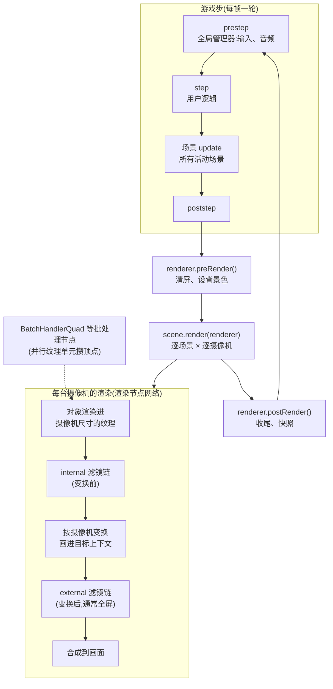

import { Canvas, Controls, Meta } from '@storybook/addon-docs/blocks';
import * as RenderPipelines from './render-pipelines.stories';

<Meta of={RenderPipelines} name="Docs" />

# 渲染管线

Phaser 4 的 WebGL 渲染器是**全面重写**,不是 Phaser 3 渲染器的升级版。三句话建立本课的知识模型:**「管线」不再存在**——Phaser 3 的 `Pipeline` / `PipelineManager` 体系在 4.0 中没有对应物,替代它的是渲染节点(RenderNode)网络与绘图上下文(DrawingContext),官方把它描述为「封装的绘制操作」;**特效从 FX 改名 Filters**——挂在 `camera.filters` 与 `gameObject.enableFilters()` 之后的 `filters` 上,分 `internal`(变换前)与 `external`(变换后)两个列表,仅 WebGL 可用;**自定义 shader 有两个官方入口**——`Shader` 游戏对象(独立四边形,一次 draw call)与自定义滤镜(Controller + BaseFilterShader,进滤镜栈)。本课按「一帧的顺序 → 渲染节点 → 内置特效 → 自定义着色器」展开,每个机制都配「操作 → 证据」的实验台。



关键 API 的默认值与回查要点(以下经 phaser@4.2.1 类型、源码与官方指南核实):

| API / 属性 | 默认值 | 回查要点 |
| --- | --- | --- |
| config `type` | `Phaser.AUTO` | 优先 WebGL,失败退 Canvas;`game.renderer` 拿到 `WebGLRenderer` 或 `CanvasRenderer`(详见 1.2 创建游戏) |
| `addGlow(color?, outerStrength?, innerStrength?, scale?, knockout?, quality?, distance?)` | `0xffffff / 4 / 0 / 1 / false / config.glowQuality=10 / config.glowDistance=10` | quality/distance 全局配置在 `filters.glow.*` |
| `addBlur(quality?, x?, y?, strength?, color?, steps?)` | `0 / 2 / 2 / 1 / 白 / 4` | 模糊可能需要画布扩边(padding),列表自动处理 |
| `addShadow(x?, y?, decay?, power?, color?, samples?, intensity?)` | `0 / 0 / 0.1 / 1 / 0x000000 / 6 / 1` | x/y 是阴影偏移;samples 越大越贵 |
| `gameObject.enableFilters()` | — | 之后才有 `filters`(此前为 `null`);滤镜仅 WebGL |
| `gameObject.filters` / `camera.filters` | `{ internal, external }` | 两列表按序应用,可叠多个滤镜 |
| `willRenderFilters()` | — | 判断滤镜是否真的会渲染(比「列表非空」更准) |
| `scene.add.shader(config, x, y, width, height, textures?)` | 尺寸 `128 / 128` | `config.name` 必填;`fragmentSource` 内联或 `fragmentKey` 取缓存 |
| Shader `setupUniforms` | — | 每次渲染执行,`setUniform(name, value)` 写 uniform |
| 滤镜纹理 `iChannel0`–`iChannel3` | — | Shader 构造参数 `textures` 最多 4 张,按序占纹理单元 0–3 |
| config `renderNodes: { 名称: 构造函数 }` | `{}` | 启动时 `addNodeConstructor` 注册;首次 `getNode` 才实例化 |

## 快速上手

两个最高频的闭环:一行给全画面加辉光;一段最小自定义 shader。

```ts
// 1. 内置特效:摄像机 internal 列表加 glow(参数即滤镜实例属性,热调)
const glow = this.cameras.main.filters.internal.addGlow(0x66e2ff, 4);
glow.outerStrength = 8; // 立即生效,无需重建

// 2. 自定义 shader:Shader 游戏对象 + 内联 fragment
const frag = `
precision mediump float;
uniform float time;
varying vec2 outTexCoord;
void main () {
  gl_FragColor = vec4(0.5 + 0.5 * cos(time + outTexCoord.xyx * 6.0), 1.0);
}`;
this.add.shader(
  {
    name: 'myShader',
    fragmentSource: frag,
    setupUniforms: (setUniform: (n: string, v: unknown) => void) =>
      setUniform('time', this.time.now / 1000),
  },
  360, 202, 320, 270,
);
```

要点在注释里:滤镜实例是参数面板;Shader 只需要 `name` + `fragmentSource`,`setupUniforms` 每次渲染执行、负责喂 uniform。机制与边界见下文。

## 渲染器与一帧的顺序

两台渲染器实现同一套接口:`Phaser.Renderer.WebGL.WebGLRenderer` 与 `Phaser.Renderer.Canvas.CanvasRenderer`,都继承 `EventEmitter`,挂在 `game.renderer` 上。选择由 config 的 `type` 决定(`AUTO` / `WEBGL` / `CANVAS` / `HEADLESS`,见 [1.2 创建游戏](?path=/docs/game-config--docs))。本课的滤镜与自定义 shader 都是 WebGL 专属;Canvas 渲染器上滤镜列表为空、`Shader` 对象退化为占位实现,判断运行环境读 `game.renderer.type === Phaser.WEBGL`。

**一帧的顺序(源码 `Game.js` 核实)。**每个浏览器帧(通常 `requestAnimationFrame` 驱动)按固定顺序走一轮:

```text
prestep   →  全局管理器更新(输入、音频)
step      →  用户逻辑挂点(插件)
场景 update(SceneManager 逐个更新活动场景)
poststep  →  渲染前最后挂点
renderer.preRender()   →  清屏、设背景色(内部发 prerenderclear、prerender)
prerender →  game 级事件
scene.render(renderer) →  逐场景 × 逐摄像机渲染(每台摄像机发一次 render)
renderer.postRender()  →  收尾、处理快照(内部发 postrender)
postrender →  本帧结束前最后挂点
```

两类事件别混:**game 级**事件(`game.events`:`'prestep'`、`'step'`、`'poststep'`、`'prerender'`、`'postrender'`)一帧各一次,适合放全局逻辑;**renderer 级**事件直接挂在渲染器上(`'prerenderclear'`、`'prerender'`、`'render'`、`'postrender'`),其中 `'render'` 的参数是 `(scene, camera)`——**每渲染一台摄像机触发一次**,多摄像机场景里它是逐镜头的挂点。常量可从 `Phaser.Core.Events` 与 `Phaser.Renderer.Events` 取。

下面的实验台把一帧拆成可数的阶段:计数器分别挂在 game 级五个事件与 renderer 级三个事件上。开第二台摄像机后,`game:prerender` 的增速不变,`renderer:render` 翻倍——事件计数直接验证「render 每台摄像机一次」。

<Canvas of={RenderPipelines.RenderEventsLab} />

<Controls of={RenderPipelines.RenderEventsLab} />

**上下文丢失(回查)。**浏览器可能随时丢失 WebGL 上下文(常见于 GPU 重置、标签页资源回收)。Phaser 4 用包装对象(`WebGLTextureWrapper` 等)记录全部 GL 资源,上下文恢复时自动重建;`renderer.contextLost` 是当前状态,`game.events` 上的 `'contextlost'` 与渲染器的 `'losewebgl'` / `'restorewebgl'` 是挂点。官方指南特别提醒:**DynamicTexture(RenderTexture 所用)恢复后是空白的**,需要重画;其余纹理自动重建。除非必要不要直接碰 `renderer.gl`——绕过包装对象改 GL 状态,恢复机制会失效。

## 渲染节点

Phaser 3 时代「换管线」(`setPipeline`、`config.pipeline` 注册 `PostFXPipeline` / `Light2D` 管线族)的心智模型在 Phaser 4 **整体失效**:4.2.1 的类型与源码里没有任何 `Pipeline` / `PipelineManager` 类。替代物是**渲染节点(RenderNode)网络**:每个节点干一件事,节点调用节点构成「渲染树」,一次渲染就是这棵树的一次执行。

**管理器与注册。**所有节点登记在 `game.renderer.renderNodes`(`RenderNodeManager`):

- `getNode(name)` 取节点——没有实例但有构造函数时**此时才实例化**(懒构造,每名一个单例);
- `addNodeConstructor(name, ctor)` 注册构造函数(自定义滤镜走这个,见下文);
- `addNode(name, node)` 注册已构造的实例;
- `hasNode(name)` 查询是否已注册(含已注册未实例化的构造函数);
- `setCurrentBatchNode` / `finishBatch` 管理批处理状态。

**内置节点按职责分四类(回查表,`Phaser.Renderer.WebGL.RenderNodes` 命名空间下)**:

| 类别 | 代表节点 | 职责 |
| --- | --- | --- |
| Submitter | `SubmitterQuad`、`SubmitterTile`、`SubmitterTileSprite`、`SubmitterMeshToQuad` | 决定「怎么提交一个对象」:算顶点、发给批处理器 |
| BatchHandler | `BatchHandlerQuad`(大多数四边形对象)、`BatchHandlerTileSprite`、`BatchHandlerStrip`、`BatchHandlerTri`、`BatchHandlerPointLight` | 攒顶点进共享缓冲,条件满足时一次 draw call 提交 |
| Transformer / Texturer | `TransformerImage`、`TransformerStamp`、`TexturerImage`、`TexturerTileSprite` | 处理对象变换 / 纹理与 UV 的通用步骤 |
| 其他 | `Camera`(逐摄像机渲染入口)、`FillPath` / `FillRect` / `StrokePath` / `DrawLine`(矢量)、`ShaderQuad`(Shader 游戏对象)、`Filter*` 一族(滤镜)、`ListCompositor`、`RebindContext`、`YieldContext` | 渲染树里的专门工位 |

**对象用「角色」引用节点。**每个游戏对象维护角色到节点名的映射:Image 的默认角色是 `Submitter → SubmitterQuad`、`BatchHandler → BatchHandlerQuad`、`Transformer → TransformerImage`、`Texturer → TexturerImage`(源码 `DefaultImageNodes`)。运行时换节点不改类:

```ts
// 把这个对象的批处理角色换成别的已注册节点(换回默认传同名节点即可)
image.setRenderNodeRole('BatchHandler', 'BatchHandlerQuad');
```

这正是「同类型对象共享批处理」的实现:同一 `BatchHandlerQuad` 节点按序收顶点,纹理切换靠**并行纹理单元**不断批——纹理单元用尽或换 shader 才 flush,细节与性能结论见 [6.1.1 性能优化](?path=/docs/performance--docs)。

**DrawingContext:渲染目标。**v4 没有 `RenderTarget` 类;「画到哪」由 `DrawingContext` 描述——它持有一组 GL 状态与可选的 framebuffer(附纹理),可嵌套(`getClone()` 克隆一份用完即还,`use()` / `release()` 成对调用)。滤镜栈、多摄像机、RenderTexture 的「先画进纹理再合成」都建立在这上面;渲染器维护一个 `DrawingContextPool` 循环利用临时上下文。直接操作 DrawingContext 属于渲染器内部接口,官方指南明确它「只与渲染器内部工作相关」——应用层几乎总该用滤镜或 Shader 对象表达同类需求。

想看自己的渲染树长什么样,有两个调试入口(回查):`game.renderer.renderNodes.setDebug(true)` 捕获一帧,`debugToString()` 输出这一帧执行过的全部节点。

## 内置特效

Phaser 3 的 `preFX` / `postFX` 在 4.0 改名为 **Filters(滤镜)**,统一挂在 `FilterList` 列表上,内置二十余种。两个共同模型先讲清:

**滤镜是栈,不是开关。**`filters.internal` 与 `filters.external` 各是一个列表,按加入顺序依次应用,后一个滤镜的输入是前一个的输出(技术上:每个滤镜画进一个新的 DrawingContext,作为纹理传给下一个)。`list.add(controller)` / `list.remove(controller)` / `list.clear()` 直接管理栈序。

**internal 在变换前,external 在变换后。**官方指南的例子:对象旋转 45° 后加水平模糊——`internal` 的模糊发生在对象局部空间,看起来是斜的;`external` 发生在对象(或摄像机)变换之后,模糊保持水平。internal 只处理对象/摄像机覆盖的区域,**能用 internal 就用 internal**;external 通常是全屏,更贵。

### 摄像机特效

摄像机默认就有 `camera.filters`,不用启用。每台摄像机的渲染完整走五步(源码 `FilterList` 文档核实,也是理解整个合成链的钥匙):

1. 对象渲染进一张摄像机尺寸的纹理;
2. `internal` 滤镜链依次处理这张纹理;
3. 结果按摄像机自身变换(scroll / zoom / rotate)画进目标上下文;
4. `external` 滤镜链依次处理;
5. 最终纹理画到画面上。

```ts
// 全屏辉光:internal 便宜,跟画面一起变换
const glow = camera.filters.internal.addGlow(0x66e2ff, 4);
// 过场做旧:external 在合成后全屏处理
const vig = camera.filters.external.addVignette(0.5, 0.5, 0.7, 0.6);
// 滤镜实例即参数面板,热调立即生效
vig.radius = 0.9;
```

注意与 [2.5.2 摄像机效果](?path=/docs/camera-effects--docs) 的分工:那一课的 shake / flash / fade 是**过程型镜头效果**(有进度、会结束,本质是矩阵偏移与视口颜色层);本课的滤镜是**像素级 shader 处理**,持续存在、按帧计价。两者可以叠加。

### 对象特效

游戏对象的 `filters` 属性初始为 `null`,先 `enableFilters()` 才有:

```ts
const fx = sprite.enableFilters().filters.internal.addGlow(0xff8844, 6);
sprite.willRenderFilters(); // true:有激活滤镜会渲染
sprite.renderFilters = false; // 关掉滤镜渲染但保留列表(整组开关)
```

配套状态:`filterCamera`(对象专用的滤镜摄像机,自动对焦对象,`filtersAutoFocus` 控制跟随)、`renderFilters`(总开关)、`willRenderFilters()`(是否真的会渲染)。两个限制必须知道:**滤镜仅 WebGL**——Canvas 渲染器下列表操作不报错但无效果;**每个开了滤镜的对象多一次 draw call,再加每个激活滤镜各一次**——源码注释原话是「This can be expensive. Use sparingly」,全场景几十个对象各挂滤镜是常见的性能事故。

下面的实验台覆盖两个维度的证据:挂载目标(camera 整画面 vs 单对象)与列表(internal vs external)。操作与证据的对应:

| 操作 | 可观察证据 |
| --- | --- |
| `target` 切到 `camera` | 四角参照物与背景一起被 glow 笼罩;切回 `object` 只有中间演示对象有辉光 |
| `effect` 切到 `shadow` 再拖 `strength` | readout 的「实际生效参数」显示 `Shadow.intensity` 实时变化,画面阴影同步加深,滤镜实例不重建 |
| 开 `rotate` + `effect=blur` | `scope=internal`:模糊方向随对象转 45°;`scope=external`:模糊保持水平 |
| readout「对象 filters」行 | `effect=off` 且从未选过 `object` 时显示「未启用」——`enableFilters()` 之前属性是 `null` 的直接证据 |

<Canvas of={RenderPipelines.FxLab} />

<Controls of={RenderPipelines.FxLab} />

### 滤镜目录

内置滤镜全表——4.2.1 的 `FilterList` 上恰好 24 个 add 方法,下面按用途分组(`camera.filters.internal` / `.external` 与对象滤镜列表共用;参数即 Controller 属性,全部热调):

| add 方法 | 用途 | 关键参数(默认值) |
| --- | --- | --- |
| `addGlow` | 辉光 | color(0xffffff)、outerStrength(4)、innerStrength(0)、quality(10)、distance(10) |
| `addBlur` | 模糊 | quality(0)、x / y(2)、strength(1)、steps(4) |
| `addShadow` | 投影 | x / y(0)、decay(0.1)、power(1)、color(0x000000)、samples(6)、intensity(1) |
| `addBokeh` / `addTiltShift` | 景深 / 斜移模糊 | radius、amount、contrast、blurX / blurY、strength |
| `addVignette` | 暗角 | x / y(0.5)、radius(0.5)、strength(0.5) |
| `addPixelate` / `addBlocky` / `addQuantize` | 像素化 / 色块 / 色阶量化 | amount 等 |
| `addBarrel` | 桶形畸变 | amount(1,±1 内) |
| `addDisplacement` | 位移贴图扭曲 | texture、x / y |
| `addColorMatrix` / `addCombineColorMatrix` / `addGradientMap` / `addThreshold` | 调色与阈值 | ColorMatrix 支持链式调色;与 2.2.5 的 tint(改顶点色)机制不同 |
| `addBlend` / `addKey` | 纹理混合 / 按色抠像 | texture、blendMode、amount / color |
| `addWipe` | 擦除 / 揭示转场 | wipeWidth(0.1)、direction、axis、reveal(0=擦除,1=揭示) |
| `addMask` / `addSampler` / `addParallelFilters` / `addImageLight` / `addPanoramaBlur` / `addNormalTools` | 掩膜、重采样、并行滤镜、光照、全景模糊、法线工具 | 多为滤镜栈组织工具,进阶位 |

**未核实项:Phaser 3 的 `addBloom` 在 4.2.1 不存在。**需要泛光效果时,用 `addGlow`(提亮边缘)+ `addBlur`(光晕扩散)组合逼近,或自己写自定义滤镜(见下节)。

## 自定义着色器

两个官方入口,取舍一句话:**`Shader` 游戏对象**是「画一块自发光的四边形」——独立渲染(Stand Alone Render),打断当前批、每个对象一次 draw call,适合背景、过场、遮罩层;**自定义滤镜**是「加工已有画面」——进滤镜栈,与内置滤镜同一套机制,适合全屏调色、扭曲、转场。官方指南的提醒:要「可批处理的自定义 shader」需要写自定义 RenderNode,门槛更高,先用这两个入口覆盖绝大多数需求。

### Shader 游戏对象

`Shader` 是普通游戏对象(有位置、原点、尺寸、scrollFactor),但渲染的内容完全由你的 fragment shader 决定。最小闭环:

```ts
const frag = `
precision mediump float;
uniform float time;
varying vec2 outTexCoord;   // 默认顶点着色器提供:四边形内 0–1 坐标
void main () {
  gl_FragColor = vec4(outTexCoord.xyx * 0.5 + 0.5, 1.0);
}`;

const shader = this.add.shader(
  { name: 'myShader', fragmentSource: frag,
    setupUniforms: (setUniform) => setUniform('time', this.time.now / 1000) },
  400, 300, 320, 270,          // x, y, width, height(默认 128×128)
);
```

配置对象(`ShaderQuadConfig`)的要点(官方指南核实):

- **`name` 必填**,是内部 `ShaderQuad` 渲染节点的名字,只用于调试,不必全局唯一;
- **`fragmentSource` 内联**或 **`fragmentKey`** 取 `this.load.glsl(key, url)` 装进 shader 缓存的文件——两种方式能力完全一致;默认 fragment 会画 UV 渐变(证明对象在工作);
- **顶点着色器不用写**。默认顶点给 fragment 一个 varying `outTexCoord`;注意 v4 纹理坐标原点在**左下角**;
- **`setupUniforms` 每次渲染执行**,`setUniform(name, value)` 写 uniform,动画数据从这里喂;
- **纹理走 `iChannel0`–`iChannel3`**:构造参数 `textures` 最多传 4 张,按序占纹理单元 0–3,`initialUniforms: { iChannel0: 0 }` 把 sampler 绑到单元 0——这是 Shadertoy 风格的约定。

实验台两个预设对照:plasma 是「纯程序化」(只靠 time 与 UV),texmix 是「纹理采样」(iChannel0 扭曲采样)。拖 speed 观察 time 的推进如何驱动动画——`setupUniforms` 每帧都在跑的直接证据。

<Canvas of={RenderPipelines.ShaderLab} />

<Controls of={RenderPipelines.ShaderLab} />

`shader.setRenderToTexture(key)` 可把结果画进一张纹理供其他对象复用;`shader.setUniform()` 也能在对象上直接改值。

### 自定义滤镜

自定义滤镜 = **两个类 + 一次注册**。Controller 是参数载体(用户 API),BaseFilterShader 是渲染节点(GLSL 部分):

```ts
// 1. Controller:构造时用名字与渲染节点配对,自定义属性即滤镜参数
class Scanlines extends Phaser.Filters.Controller {
  intensity: number;
  constructor(camera: Phaser.Cameras.Scene2D.Camera, intensity = 0.6) {
    super(camera, 'FilterScanlines');
    this.intensity = intensity;
  }
}

// 2. 渲染节点:fragment 契约是 uMainSampler(上一步的输出)+ 内置 varying
const FRAG = `
precision mediump float;
uniform sampler2D uMainSampler;
uniform float intensity;
varying vec2 outFragCoord;
void main () {
  vec4 pixel = texture2D(uMainSampler, outFragCoord);
  gl_FragColor = pixel;
}`;

class ScanlinesShader extends Phaser.Renderer.WebGL.RenderNodes.BaseFilterShader {
  constructor(manager: Phaser.Renderer.WebGL.RenderNodes.RenderNodeManager) {
    super('FilterScanlines', manager, undefined, FRAG);
  }
  setupUniforms(controller: Scanlines, ctx: Phaser.Renderer.WebGL.DrawingContext) {
    this.programManager.setUniform('intensity', controller.intensity);
  }
}

// 3. 场景 create 里(renderer 已启动):注册 + 应用
if (!this.game.renderer.renderNodes.hasNode('FilterScanlines')) {
  this.game.renderer.renderNodes.addNodeConstructor('FilterScanlines', ScanlinesShader);
}
const fx = image.enableFilters().filters.internal.add(new Scanlines(image.filterCamera));
```

四条契约别踩空(全部源码/指南核实):

- **滤镜只写 fragment**,顶点由引擎的 `SimpleTexture-vert` 合成,提供 `outTexCoord` 与 `outFragCoord`(归一化屏幕坐标)两个 varying;
- **`uMainSampler` 是输入**:滤镜链上一步的输出纹理,BaseFilterShader 已绑到纹理单元 0;要加自己的纹理,在 `setupTextures` 里放 `textures[1]` 起;
- **对象滤镜的 Controller 传 `image.filterCamera`**,摄像机滤镜传摄像机自身——滤镜要靠这台内部摄像机取景;
- **`super` 的参数顺序**是 `(name, manager, fragmentShaderKey, fragmentShaderSource, shaderAdditions)`,内联源码走第 4 参。

下面是最小可运行示例:扫描线滤镜,`intensity` / `lineDensity` 两个参数全部热调。操作与证据:

| 操作 | 可观察证据 |
| --- | --- |
| 切 `target` | object:只有中间演示对象出现扫描线;camera:全画面(含参照物)出现扫描线 |
| 关 `on` 再开 | readout「列表长度」1 → 0 → 1,画面扫描线消失再恢复;`hasNode` 始终 true——注册与挂载是两回事 |
| 拖 `lineDensity` | readout 的 uniform 值实时变,画面线密度同步变化——`setupUniforms` 每帧读 Controller,无需重建 |

<Canvas of={RenderPipelines.CustomFilterLab} />

<Controls of={RenderPipelines.CustomFilterLab} />

### 注册入口与角色

把散落的注册机制收进一张回查表(两个自定义入口之外的部分):

| 入口 | 写法 | 时机与用途 |
| --- | --- | --- |
| config `renderNodes` | `new Phaser.Game({ renderNodes: { MyNode: MyNodeClass } })` | 启动时注册构造函数;值是**构造函数本身**(`getNode` 首次调用才实例化) |
| 运行时注册 | `renderer.renderNodes.addNodeConstructor(name, ctor)` / `addNode(name, instance)` | 场景 create 及之后;先 `hasNode(name)` 防重复(重复注册抛错) |
| 对象换节点 | `gameObject.setRenderNodeRole('BatchHandler', '节点名')` | 把该对象的某角色指到其他已注册节点;`renderNodeData` 存节点私有数据 |
| 内置 shader 复用 | `Phaser.Renderer.WebGL.Shaders`(如 `MultiFrag`)+ `ShaderAdditionMakers` | 拿内置 GLSL 做 additions 拼装,或做自定义节点的起点 |

**未核实项:Phaser 3 的 Light2D / Rope / PostFX「管线族」在 4.2.1 没有同名管线对应物。**光源渲染现在由 `BatchHandlerPointLight` 节点、`Light` 游戏对象与 `ImageLight` 滤镜承担;Rope 是独立游戏对象(`BatchHandlerStrip`);PostFX 的角色整体并入滤镜体系。存量 3.x「自定义管线」教程的写法在 4 里没有落点,迁移时按本课的 RenderNode / Filters 两条线重找入口。

## 最佳实践

- **滤镜默认走 camera + internal,确有单对象需求才 `enableFilters()`。**camera 滤镜一次覆盖全画面(对象数量无关);对象滤镜每个对象多一次 draw call 再加每个滤镜一次。同一画面要给 N 个对象加同款特效时,问自己是不是真的不能「整画面 + 特效分层(多摄像机)」。
- **特效参数热调,不重建滤镜。**add 方法返回的 Controller 就是参数面板(`glow.outerStrength = 8`),重建滤镜意味着重新走一遍栈与纹理分配;调参永远改属性。
- **自定义 shader 先选入口再写代码**:输出型(背景、转场、全屏动画)→ Shader 游戏对象;加工型(调色、扭曲、既有画面的处理)→ 自定义滤镜;两者都覆盖不了、且确需参与批处理,才研究自定义 RenderNode。
- **Shader 对象要少。**每个都是 Stand Alone Render:打断当前批 + 一次 draw call。全屏背景一个没问题,列表里几十个就要重新设计(合并成一个更大的 shader,或画进 RenderTexture 复用)。
- **渲染事件挂点按粒度选**:全局每帧逻辑用 game 级 `'prerender'` / `'postrender'`;逐镜头的后处理钩子用 renderer 级 `'render'`(每台摄像机一次)。别在 `'step'` 里改渲染状态——它在场景 update 之前。

## 常见问题

- **滤镜完全不生效,也没报错。**
  先确认 `game.renderer.type === Phaser.WEBGL`——滤镜是 WebGL 专属,Canvas 渲染器下列表操作静默无效;再确认对象 `filters` 不是 `null`(`enableFilters()` 之前访问 `filters.internal` 直接抛错);最后看 `renderFilters` 是否被设成了 `false`。
- **`setRenderNodeRole` 后对象消失或渲染错乱。**
  角色指向的节点必须已注册(`hasNode` 查)且**类型匹配**——`BatchHandler` 角色要指 `BatchHandler*` 族节点,指到 `FillRect` 这类节点没有对应的顶点契约。换回默认节点名(如 Image 的 `BatchHandlerQuad`)即可恢复。
- **对象加了 `external` 滤镜,效果却裁掉了一部分。**
  external 在对象变换之后、按外层上下文(通常是全屏)处理,但滤镜 framebuffer 仍以对象包围盒为基础;模糊、辉光这类会「外扩」的效果需要 padding:`controller.setPaddingOverride(null)` 交给滤镜自动扩,或传四个数手动指定。
- **`addNodeConstructor` 抛「already exists」。**
  注册不幂等:场景重进一次 create 就会撞名。注册前先 `hasNode(name, true)`(要求已构造)或 `hasNode(name)` 判断,存在就跳过——本课范例的写法。
- **Shader 对象是白的 / 一片纯色。**
  大概率 fragment 没写对:默认 fragment 画的是 UV 渐变,如果连渐变都没有,检查 `name` 是否缺失(必填);如果渐变正常但自定义代码不生效,检查 uniform 名字拼写与 `precision` 声明,以及纹理 sampler 是否漏了 `initialUniforms: { iChannel0: 0 }`。
- **Phaser 3 的管线教程照抄报「Pipeline is not defined / 没有 setPipeline」。**
  正常——v4 没有 Pipeline 体系。对照本课映射:自定义 PostFX 管线 → 滤镜;特殊 batch 管线 → 自定义 RenderNode;`sprite.preFX` → `enableFilters()`。

## 总结回顾

摘要:

Phaser 4 重写了 WebGL 渲染器:一帧按「游戏步事件 → preRender → 逐场景逐摄像机 → postRender」推进,game 级事件一帧一次、renderer 级 `'render'` 每台摄像机一次。渲染体系由 RenderNode 网络构成——对象按角色(Submitter / BatchHandler / Transformer / Texturer)引用节点,`RenderNodeManager` 懒注册懒构造,DrawingContext 承担「画到哪」的可嵌套渲染目标。内置特效以 Filters 形式挂在 `camera.filters` 与 `gameObject.enableFilters()` 后的列表上,internal 在变换前、external 在变换后,滤镜是按序应用的栈,仅 WebGL 可用且按 draw call 计价。自定义 shader 两个入口:Shader 游戏对象(独立四边形、setupUniforms 喂参数、iChannel0–3 采样)与自定义滤镜(Controller + BaseFilterShader + addNodeConstructor,契约是 uMainSampler 输入与内置 varying)。Phaser 3 的 Pipeline 体系、preFX/postFX 命名与 Light2D 等「管线族」在 4.2.1 均无同名对应物。

一句话:

> 在 Phaser 4 里谈渲染,要谈的是「角色到 RenderNode 的映射 + DrawingContext 上的滤镜栈」——不是管线;特效找 Filters,自定义找 Shader 对象或自定义滤镜。

知识要点:

- 一帧的固定顺序是什么,game 级与 renderer 级渲染事件分别挂哪、什么频率?
- `WebGLRenderer` 与 `CanvasRenderer` 如何选择,`game.renderer` 上能读到什么?
- RenderNode 分哪几类,Image 的四个默认角色各指向哪个节点?
- `setRenderNodeRole`、`renderNodes.addNodeConstructor`、config `renderNodes` 各在什么时机用?
- DrawingContext 是什么,为什么说滤镜栈建立在它上面?
- `camera.filters` 与 `gameObject.enableFilters()` 的滤镜各覆盖什么范围,代价怎么算?
- internal 与 external 的差别,用什么操作可以直接看到证据?
- 4.2.1 的 FilterList 上有哪些 add 方法,addBloom 是否存在?
- Shader 游戏对象的配置对象哪些字段必填,纹理与 uniform 怎么喂?
- 自定义滤镜的两个类各承担什么,Controller 的 camera 参数对象与摄像机分别传什么?
- Phaser 3 的哪些渲染概念在 4 里没有对应物,迁移时按什么线索重找入口?

## 参考资料

- [Phaser 官方文档](https://docs.phaser.io/)
  本课 API 与默认值以 phaser@4.2.1 的类型与源码核实;随包官方指南《Phaser 4 Shader Guide》《Phaser 4 Rendering Concepts》见 `node_modules/phaser/docs/`,是自定义 shader 与渲染概念的权威出处。
- [官方示例库](https://phaser.io/examples/)
- [Phaser 4 Labs 示例浏览器](https://labs.phaser.io/phaser4-index.html)
- [phaserjs/phaser 仓库](https://github.com/phaserjs/phaser)
  渲染节点、滤镜与游戏步顺序均可在 `src/renderer/`、`src/filters/`、`src/core/Game.js` 对照源码。
