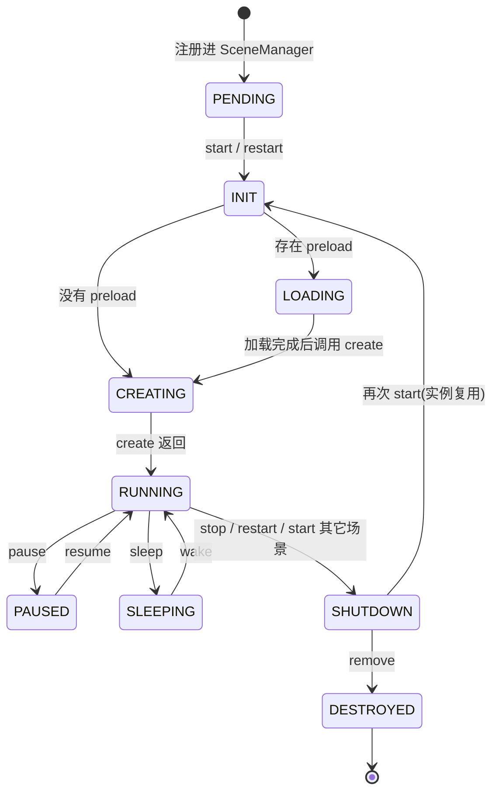

import { Canvas, Controls, Meta } from '@storybook/addon-docs/blocks';
import * as SceneLifecycle from './scene-lifecycle.stories';

<Meta of={SceneLifecycle} name="Docs" />

# 场景生命周期

`Phaser.Game` 只负责画布、渲染器和主循环,游戏内容全部组织在 `Phaser.Scene` 里:每个场景有自己的显示列表、摄像机、输入、加载器和 update 循环。本课编写 Scene 子类,讲清 `init`、`preload`、`create`、`update` 四个生命周期方法的职责与执行顺序,再掌握场景的启动、切换、暂停与销毁——它们共同构成一台可核对的状态机:当前处于哪个状态,决定这一帧 update 是否执行、画面是否渲染。



状态值可随时用 `this.scene.getStatus(key)` 或 `scene.sys.settings.status` 读出,对照常量表 `Phaser.Scenes.PENDING`(0)、`INIT`(1)、`START`(2)、`LOADING`(3)、`CREATING`(4)、`RUNNING`(5)、`PAUSED`(6)、`SLEEPING`(7)、`SHUTDOWN`(8)、`DESTROYED`(9)。

| 生命周期方法 | 何时调用 | 职责 | 能否省略 |
| --- | --- | --- | --- |
| `init(data)` | 每次场景启动时最先执行 | 用传入的 `data` 初始化实例状态 | 可省略 |
| `preload()` | `init` 之后、`create` 之前,仅排加载队列 | 只调 `this.load.*` 声明资源 | 可省略,无队列则跳过等待 |
| `create(data)` | `init`/加载完成之后,仅一次 | 创建对象、注册输入、搭建本场景内容 | 可省略 |
| `update(time, delta)` | `RUNNING` 状态下每帧一次 | 逐帧逻辑:移动、碰撞、读输入 | 可省略 |

注意:`Phaser.Scene` 基类上真正声明的方法只有 `update`;`init`、`preload`、`create` 是场景类上的可选方法,存在时才会被 SceneManager 调用。Phaser 没有 `shutdown()` / `destroy()` 覆写钩子,清理逻辑通过场景事件 `this.events.on('shutdown', ...)` 与 `this.events.on('destroy', ...)` 注册。

## 快速上手

一个最小的可运行闭环:定义 Scene 子类,在 Game config 的 `scene` 字段注册,浏览器里就会出现每帧自增的帧号。

```ts
import Phaser from 'phaser';

class MainScene extends Phaser.Scene {
  private frameText!: Phaser.GameObjects.Text;
  private frame = 0;

  constructor() {
    super({ key: 'Main' }); // 场景唯一 key,供 start/launch 等操作引用
  }

  create() {
    this.frameText = this.add.text(16, 16, '帧号 0', { color: '#e2e8f0' });
  }

  update() {
    this.frameText.setText(`帧号 ${++this.frame}`);
  }
}

new Phaser.Game({
  type: Phaser.AUTO,
  width: 720,
  height: 360,
  backgroundColor: '#141a26',
  scene: [MainScene], // 注册即启动第一个场景
});
```

`scene` 字段接受单个场景或数组。数组中第一个场景自动启动,其余场景只注册不启动,等 `this.scene.start(key)` 或 `launch(key)` 唤起;想让首个场景也不启动,可在它的 config 里显式写 `active: false`。

## 生命周期方法

场景启动时,SceneManager 按固定顺序调用你的方法,每一步都能在状态机上定位:

1. `init(data)`——状态 `INIT`。每次启动(含 restart、再次 start)都会先经过这里,适合接收其他场景传来的 `data`、把实例字段重置为本场景的初始值。
2. `preload()`——状态 `LOADING`。这里只声明资源(`this.load.image(key, url)` 等),不等待下载完成;方法返回后加载器才启动,因此"排完队列就返回"。
3. `create(data)`——状态 `CREATING`,返回后进入 `RUNNING`。资源已就绪,在这里创建显示对象、注册输入监听、启动补间。
4. `update(time, delta)`——状态 `RUNNING` 下每帧调用一次。`time` 是 RAF 时间戳(毫秒),`delta` 是上一帧以来的平滑毫秒差,直接用于按时间的运动(`x += speed * delta / 1000`)。

`data` 的流转:`this.scene.start('Game', { level: 3 })` 传入的对象会成为 `settings.data`,同一份对象先后交给 `init(data)` 与 `create(data)`;之后仍可用 `this.sys.getData()` 取回。

下面的实例用一个场景把这条时间线变成可核对读数:场景自己记录 `init → preload → create` 的调用顺序与各自次数,`update` 帧号持续自增;把「场景重启次数」加一,会触发 `this.scene.restart()`,你能看到阶段顺序重新走一遍、update 帧号归零,而实例字段 `visits`(在 `create` 里累加、从不手动清零)继续保留——这是「Scene 实例被复用,shutdown 只清显示列表」的直接证据。

<Canvas of={SceneLifecycle.LifecycleOrder} />
<Controls of={SceneLifecycle.LifecycleOrder} />

| 读者操作 | 可观察证据 |
| --- | --- |
| 初始加载 | 阶段顺序为 `init → preload → create`,update 帧号持续增长,`visits` 为 1 |
| 「场景重启次数」加一 | 三个阶段计数各加一、阶段顺序重新完整出现,update 帧号归零后重新增长,`visits` 变为 2(实例未被销毁) |
| 连续多次加一 | `visits` 持续累加;画面上方块位置从头开始(显示列表被清空重建) |

### preload 与 create 的衔接

`preload` 与 `create` 的关系由加载队列决定,规则只有三条:

- `preload` 不存在,或其中没有排入任何文件时,`create` 在同一轮启动流程中立即执行。
- 队列非空时,加载器自动启动,`create` 推迟到 `Phaser.Loader.Events.COMPLETE` 之后才执行——所以 `create` 里可以放心使用刚加载的纹理。
- 在 `preload` 之外调用 `this.load.*` 不会自动启动加载器,需要手动 `this.load.start()`(资源加载细节属于「资源加载器」一课)。

一个推论:preload 里写的代码"很快返回"不代表资源已可用。任何依赖资源就绪的逻辑(创建精灵、计算帧尺寸)都属于 `create` 或加载完成回调,不要放进 `preload`。

## 运行状态

`RUNNING` 之后,场景沿两根独立的轴运转:`active` 决定每帧是否执行 update 一侧的逻辑,`visible` 决定是否渲染。`pause` 与 `sleep` 的区别就在这两根轴上:

| 操作 | update | 渲染 | 状态变为 | 恢复操作 | 内存与内容 |
| --- | --- | --- | --- | --- | --- |
| `pause()` | 停止 | 继续,画面定格 | `PAUSED` | `resume()` | 全部保留 |
| `sleep()` | 停止 | 停止,画面消失 | `SLEEPING` | `wake()` | 全部保留,可从中断处继续 |
| `stop()` | 停止 | 停止 | `SHUTDOWN` | 再次 `start(key)` | 显示列表与定时器清空,实例字段保留 |

`resume` 只把 `active` 拉回 `true`(状态回到 `RUNNING`);`wake` 同时恢复 `active` 与 `visible`。注意 `resume` 不检查场景当前处于哪种状态、也不会碰 `visible`:对睡眠场景误调 `resume` 会让 update 恢复执行、画面却仍然隐藏——恢复渲染必须用 `wake`。睡眠场景常用于"暂停整层 HUD"或 `switch` 切走后保留现场,暂停则适合"游戏进行中弹窗"——画面仍可见,只是不更新。

下面的实例用一个匀速移动、帧号自增的场景对照这四种操作。关键观察点:update 帧号是否继续增长证明 update 是否在跑;方块是否可见证明是否仍在渲染。

<Canvas of={SceneLifecycle.RunStates} />
<Controls of={SceneLifecycle.RunStates} />

| 读者操作 | 可观察证据 |
| --- | --- |
| 选「暂停 pause」 | 方块停住但完整可见(仍渲染),update 帧号冻结,状态读数变为 `PAUSED (6)` |
| 暂停后选「恢复 resume」 | 方块从停住的位置继续移动,帧号接着涨,状态回到 `RUNNING (5)` |
| 选「休眠 sleep」 | 整个画面消失(不再渲染),帧号冻结,状态变为 `SLEEPING (7)` |
| 休眠后选「唤醒 wake」 | 画面原样恢复,方块从原位置继续,帧号继续累加 |
| 休眠后选「恢复 resume」 | update 帧号恢复增长、`active` 变 true,但画面仍消失(`visible` 仍为 false)——`resume` 不恢复渲染,唤醒必须用 `wake` |

三个范例的 Phaser 实例在滚出视口或页面切到后台时会整体休眠以省资源(等效于对本范例调用 `game.loop.sleep()`),回到视口自动恢复;这不影响任何状态读数,读数冻结只可能来自上面表格中的场景操作。

## 启动与切换

所有场景操作都走场景内的 ScenePlugin,即 `this.scene`。对其他场景的每项操作都接受 key(构造时 `super({ key: ... })` 设定的名字)。核心三兄弟:

| 方法 | 对当前场景 | 对目标场景 | 典型用途 |
| --- | --- | --- | --- |
| `this.scene.start(key, data)` | shutdown(内容清空) | 启动,走完整 init→create | 关卡切换、菜单 → 游戏 |
| `this.scene.launch(key, data)` | 不受影响 | 并行启动 | 叠加 HUD、弹窗层 |
| `this.scene.switch(key)` | sleep(现场保留) | 启动或唤醒 | 暂离游戏去设置页,回来续玩 |

配套方法:`restart(data)` 对自己执行 stop + start;`run(key)` 让目标"无论处于何种状态都跑起来"(未启动则启动、暂停则恢复、睡眠则唤醒);`pause(key)` / `resume(key)` / `sleep(key)` / `wake(key)` / `stop(key)` 可以操纵其他场景,不传 key 时作用于当前场景。

两个容易忽略的执行细节:

- **排队生效。** ScenePlugin 的这些操作都排进队列,等下一次 SceneManager update 才执行。因此在 `create` 里调用 `this.scene.start(...)` 不会打断当前帧,随后的代码照常执行完。
- **同帧顺序。** 多场景并行时,SceneManager 从数组末尾往前 step、从头往后 render;`bringToTop(key)` / `moveAbove(a, b)` 等方法调整的就是这个数组,决定谁画在上面。

需要在切换时叠加视觉过渡(fade、slide 等),用 `this.scene.transition({ target, duration, onUpdate })`——它本质是带每帧回调的 `sleep/stop + start` 组合,细节见 ScenePlugin 文档与「摄像机效果」一课的镜头过渡。

下面的实例注册了两个场景:静态的 `MenuScene`(仅 create,演示"场景可以没有 update")和运动的 `GameScene`(方块 + 帧号)。用「场景操作」下拉执行各操作,读数给出两个场景各自的 update 帧号与状态,画面直接反映可见性。

<Canvas of={SceneLifecycle.SceneSwitch} />
<Controls of={SceneLifecycle.SceneSwitch} />

| 读者操作 | 可观察证据 |
| --- | --- |
| 初始加载 | 只有 `Menu` 在运行(菜单画面),`Game` 帧号为 0、状态 `PENDING (0)`(注册未启动);`Menu` 帧号恒为 0——没有 update 方法的场景同样完整运行 |
| 选「start 启动 Game」 | 菜单画面整个被清空换成运动方块:`Menu` 状态变 `SHUTDOWN (8)`;`Game` 从 0 开始走完整启动 |
| 选「launch 并行启动 Game」 | 菜单保留,方块叠加在菜单之上,`Game` 帧号开始增长 |
| 选「switch 切到 Game」 | 与 `start` 的区别在 `Menu`:状态是 `SLEEPING (7)` 而非 `SHUTDOWN`,现场保留 |
| 选「stop 停止 Game」 | 方块消失,`Game` 状态 `SHUTDOWN (8)`;随后再「start 启动 Game」又能从头启动(实例可复用) |
| 选「remove 移除 Game」 | 与 stop 的画面相同,但此后任何「start 启动 Game」都无效:`Game` 已 `DESTROYED (9)`,实例从管理器移除 |

## 停止与销毁

停止与销毁是三个递进的层级,清理力度依次增大:

- **`stop(key)` — shutdown。** 清空显示列表、销毁场景内的定时器与补间、重置输入与摄像机,但场景实例和你在实例上声明的字段都保留;下次 `start(key)` 重新走 `init → preload → create`。这就是"实例复用":上面 LifecycleOrder 范例里 `visits` 跨 restart 累加,靠的就是这一机制。
- **`remove(key)` — destroy。** 调用 `Scene.Systems.destroy`:实例从 SceneManager 移除、事件监听全部清空、`status` 置为 `DESTROYED`,此后 `start(key)` 静默无效,无法恢复。
- **`game.destroy(true)` — 整个游戏。** 所有场景销毁、渲染器释放,`removeCanvas` 传 `true` 时连 canvas 元素一并从 DOM 移除。这是 Storybook 实例卸载时的清理方式,也是单页应用里"离开游戏页"的正确收尾。

清理自己的东西要挂场景事件,而不是指望方法覆写:

```ts
create() {
  this.onResize = () => this.scale.refresh();
  window.addEventListener('resize', this.onResize);
  // shutdown 时移除自己注册的外部监听;destroy 时再兜底一次
  this.events.once('shutdown', () => {
    window.removeEventListener('resize', this.onResize);
  });
}
```

场景的 `this.events` 在 shutdown 时会保留监听器(场景可能再次启动),destroy 时才全部清空。因此外部监听( window、document、DOM 元素)与自有定时句柄要挂 `shutdown` 事件清理;场景内部的显示对象、输入监听、tween 则无需手动清理,shutdown 流程会一并处理。

`Phaser.Scenes.Events` 里与本课直接相关的事件:`start`(各插件就绪)、`ready`(适合业务代码)、`create`(create 方法之后)、`update` / `preupdate` / `postupdate`(每帧,与 update 方法同层)、`pause` / `resume` / `sleep` / `wake`、`shutdown` / `destroy`。事件系统本身属于「事件与场景通信」一课。

## 最佳实践

- **按职责放置代码。** 资源声明只在 `preload`;对象创建与输入注册只在 `create`;每帧逻辑只在 `update`。把创建塞进 `update` 会每帧叠加对象,把逻辑塞进 `create` 则只执行一次——位置错了不会报错,只会表现为"行为不对"。
- **`update` 内避免分配。** 每帧执行,`new` 出来的数组/对象与闭包会加重 GC。用 `create` 时创建好的字段复用;高频文字更新用 `setText` 而不是重建 Text。
- **实例状态在 `init` 重置,不要依赖 shutdown。** 场景实例会被复用,shutdown 不清实例字段;凡"每轮启动应为初始值"的字段(init 计数、进度、开关)都在 `init` 里显式赋值,constructor 只放跨轮保留的常量。
- **暂停场景选型:** 需要画面继续显示用 `pause`;需要整层消失但保留现场用 `sleep`;确定不再回来才 `stop`。HUD、弹窗这类常驻层优先 `launch` 并行而非来回 `start`。
- **跨场景传值走 `start(key, data)`,回传或全局共享用 `this.registry`。** 前者随生命周期走 init,后者适合分数、设置这类全局状态(细节见「事件与场景通信」一课)。
- **外部资源挂 `shutdown` 事件清理。** 场景自己的显示对象、tween、输入监听会随 shutdown 自动处理;`window`/`document` 监听、WebSocket、自建 worker 不会,必须手动摘除。

## 常见问题

- **`pause` 之后画面还停留在屏幕上,是不是没生效?**
  正常行为。`pause` 只停 update(`active = false`),渲染照常,所以画面定格而非消失;靠"画面是否消失"判断会误判,看 `this.scene.isPaused(key)` 或状态读数。
- **`restart` / `stop` 后再启动,上次的分数、开关等字段还在(或表现"脏")。**
  shutdown 只清显示列表与场景内系统,不清你的实例字段。在 `init` 里把所有应重置的字段显式赋回初始值,`create` 只做创建。
- **`remove` 过的场景 `start` 不再生效。**
  场景已 `DESTROYED` 并从 SceneManager 移除,该 key 无法再启动;需要重新引入时用 `this.scene.add(key, SceneClass)` 再注册。
- **在 `create` 里调用 `this.scene.start('Next')`,后面的代码还是执行了,两个场景同帧并存?**
  ScenePlugin 的操作排队到下一次 SceneManager update 才生效,`create` 剩余语句照常运行。把启动切换放在 create 的最后一行,或放进输入回调。
- **`launch` 的场景没有显示,但 `isActive` 是 true。**
  并行场景都渲染时按注册顺序叠放,后画的在上面;确认不是被上层盖住(用 `bringToTop`),或目标场景 config 里 `visible: false` / 被 `setVisible(false)` 隐藏过。
- **`preload` 里 `this.add.image(..., 'hero')` 报纹理不存在。**
  `preload` 只排队列,纹理此刻还没加载。创建对象的代码属于 `create`(或加载完成回调),那里才有已就绪的纹理。

## 总结回顾

摘要:

场景是 Phaser 的组织单元,由 SceneManager 驱动一台状态机:启动时按 `init → preload → create` 顺序调用你的方法,`preload` 只是排队、`create` 等加载完成,`RUNNING` 后每帧执行 `update(time, delta)`。`pause`/`sleep` 分别沿 active、visible 两根轴停用场景,resume/wake 对应恢复;`start`/`launch`/`switch` 覆盖清场切换、并行叠加、保留现场三种切换语义;`stop` 清空内容但复用实例、`remove` 彻底销毁,清理自有资源挂 `shutdown`/`destroy` 场景事件。

一句话:

> 场景方法回答"代码放在哪",场景状态回答"这帧做什么"——先看 `status`,再写生命周期。

知识要点:

- `init`、`preload`、`create`、`update` 各自的职责与执行顺序是什么?
- `preload` 队列为空与非空时,`create` 的执行时机有何不同?
- `pause` 与 `sleep` 在 update、渲染两根轴上分别停了什么?用什么恢复?
- `start`、`launch`、`switch` 对当前场景分别做什么?
- `stop` 之后实例字段为何保留,`remove` 之后为何无法再启动?
- 自注册的外部监听应该挂在哪个场景事件里清理?

## 参考资料

- [Phaser 官方文档:Scenes 概念](https://docs.phaser.io/phaser/concepts/scenes)
- [Phaser 4 API:Phaser.Scene](https://docs.phaser.io/api-documentation/class/scene)
- [Phaser 4 API:Phaser.Scenes.Systems(状态与生命周期驱动)](https://docs.phaser.io/api-documentation/class/scenes-systems)
- [Phaser 4 API:Phaser.Scenes.ScenePlugin(this.scene 全部操作)](https://docs.phaser.io/api-documentation/class/scenes-sceneplugin)
- [官方示例库:scene 类目(启动、暂停、切换与并行运行的可运行示例)](https://phaser.io/examples)
- [Phaser 4 Labs 示例浏览器](https://labs.phaser.io/phaser4-index.html)
