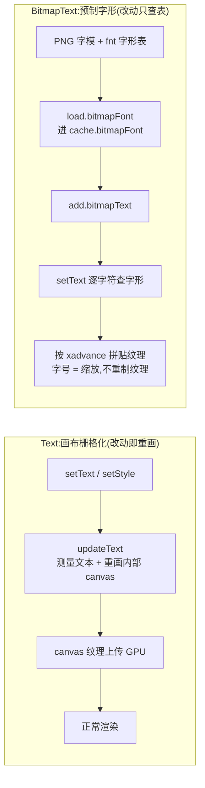

import { Canvas, Controls, Meta } from '@storybook/addon-docs/blocks';
import * as Text from './text.stories';

<Meta of={Text} name="Docs" />

# 文本

Phaser 有两条文本渲染路径:**Text** 把字符串栅格化到一块内部 canvas,系统字体、任意样式、随时改;**BitmapText** 用预先做好的字形图拼贴,改字只查表不重画。本课讲清 Text 的样式模型(TextStyle)、尺寸测量与动态更新成本,BitmapText 的加载、缩放与字形覆盖,最后给出两者的选型判断。字体的加载器层面(`load.bitmapFont` 的排队与缓存)已在 [2.1.1 资源加载器](?path=/docs/asset-loader--docs)讲过,本课直接使用;tint 等视觉状态属 2.2.5 深度与视觉状态,文本补间动画属 2.3.2 补间,这里不展开。



| TextStyle 属性 | 默认值 | 回查要点 |
| --- | --- | --- |
| `fontFamily` | `'Courier'` | 合法 CSS font-family;带空格的名字用单引号包裹 |
| `fontSize` | `'16px'` | CSS 尺寸串或数字(数字自动补 px) |
| `fontStyle` | `''` | `'bold'`、`'italic'`、`'bold italic'` |
| `color` | `'#fff'` | 填充色;支持 CSS 串、`CanvasGradient`、`CanvasPattern` |
| `backgroundColor` | `null` | 文字底色,填满整个内部画布,不只包住字形 |
| `stroke` / `strokeThickness` | `'#fff'` / `0` | 厚度 0 关闭;厚度同时计入行高与行宽 |
| `shadow` | 全关(offset 0 / fill false / stroke false) | 配了 offset 不等于开阴影,见常见问题 |
| `align` | `'left'` | 只影响多行;`left / center / right / justify` |
| `maxLines` | `0` | 0 = 不限;超出的行直接不绘制 |
| `fixedWidth` / `fixedHeight` | `0` / `0` | 0 = 尺寸随内容;非 0 固定画布尺寸,配合 align 用 |
| `wordWrap` | `null` | `{ width, useAdvancedWrap, callback }`;直接改属性不会自动重排 |
| `padding` | 四边 `0` | 加在文本四周并计入 `width` / `height` |
| `resolution` | 样式缺省 `0`,构造时强制为 `1` | 内部画布 = 对象尺寸 × resolution |
| `lineSpacing` / `letterSpacing` | `0` / `0` | 挂在 Text 对象上,不在 style 里 |

## 快速上手

两条路径各一个最小闭环:Text 创建即用,BitmapText 先加载字体再引用。

```ts
class Demo extends Phaser.Scene {
  preload() {
    // 位图字体:一张 PNG 字模 + 一份 XML 字形表(fnt),加载层见 2.1.1
    this.load.bitmapFont('arcade', 'arcade.png', 'arcade.fnt');
  }

  create() {
    // Text:直接创建,样式随传随改(改一次 = 内部 canvas 重画一次)
    const label = this.add.text(40, 40, '得分 SCORE', {
      fontFamily: 'sans-serif',
      fontSize: '24px',
      color: '#ffffff',
      stroke: '#000000',
      strokeThickness: 4,
    });
    label.setText('得分 SCORE:1024'); // 动态改内容

    // BitmapText:用 preload 里加载的字体 key,改动只查表、不重画
    const score = this.add.bitmapText(40, 90, 'arcade', '1024');
    score.setFontSize(32); // 字号是"缩放",纹理不变
  }
}
```

两者都是显示对象:位置、原点、深度、tint 这些通用能力与 Image 一致,见 [2.2.1 精灵与图像](?path=/docs/sprites--docs);差异全部集中在"文字怎么变成像素"这一层。

## Text:画布栅格化文本

`this.add.text(x, y, content, style?)` 创建一个 Text,它内部持有一块专属 canvas:创建时按样式把字符串画上去,再把这块 canvas 注册成纹理交给渲染器。推论是**任何内容或样式变化都要重画整块画布**——`setText`、`setColor`、`setFontSize`……每个 setter 内部都调 `updateText` 重新测量、重设画布尺寸、逐行重画,WebGL 下还要重新上传纹理。这既是 Text 灵活性的来源(系统字体、渐变、描边、阴影全都能用),也是它的成本来源,后面的「动态更新与重栅格化」专门量化这件事。

样式写在两处:创建时传 style 对象(上表全部属性),创建后用链式 setter(`setFontSize` / `setColor` / `setStroke` / `setShadow` / `setAlign` / `setPadding` / `setMaxLines` / `setResolution` / `setLetterSpacing` / `setLineSpacing`,全部返回 this)或 `setStyle({ ... })` 批量改。描边用 `setStroke(color, thickness)`;阴影用 `setShadow(x, y, color, blur, shadowStroke, shadowFill)`,注意它只把画布的 shadow 参数同步给 context,**开关由最后两个布尔参数决定**;`padding` 是文本四周的留白,会计入 `width` / `height`,常用来给描边和阴影留出不裁切的边距。

下面的实验台把整套样式模型变成可核对读数:同一个 Text 对象,九个控件哪个动了才调哪个 setter,红框始终贴着 `text.width × text.height`。

<Canvas of={Text.TextStyleLab} />
<Controls of={Text.TextStyleLab} />

| 读者操作 | 可观察证据 |
| --- | --- |
| 调「字号」 | 画面字号即时变化,`width × height` 随之增大;「重栅格化计数」每次调节 +1 |
| 调「颜色」 | 文字颜色变化,`updateText` 同样 +1——改颜色也要重画画布 |
| 「描边厚度」调到 4 | 文字出现黑边;「行高」读数变为 `字高 + 4`,height 相应变大:厚度计入行高 |
| 开「阴影」 | 文字出现向下投影;关闭时是把偏移、模糊与两个开关全部复位,而不是只把偏移设 0 |
| 切「对齐」为居中/右对齐 | 三行文本相对最宽一行居中/右移(单行文本看不出差异) |
| 「换行宽度」从 0 调到 200 | 超宽的行折成多行,`行数` 读数上升,height 变大 |
| 开「高级换行」 | 折行处空格被收敛、长词被拆开;基础换行只按空格断词,长词整词溢出 |
| 「最大行数」调到 2 | 第三行整行消失,`行数` 读数回到 2(超出不绘制,不省略号) |
| 调「分辨率」到 2 | 画面更细腻;`内部画布` 读数 = 对象尺寸 × 2:清晰度靠更大的画布换 |
| 反复调节 | 「重栅格化计数」单调累加:每个样式 setter 都是一次完整的重画 |

### 对齐与换行

`align` 回答"行与行怎么排",`wordWrap` 回答"一行放不下怎么办",两者都只在内容或样式变化时计算一次。

- **`align` 只影响多行文本**,取值 `left / center / right / justify`;参照系是最宽一行的宽度(设了 `fixedWidth` 则是固定宽)。单行文本上切 align 没有任何视觉差异——这是"调了没反应"的高频误判点。
- **`wordWrap: { width }`** 开启自动换行。`useAdvancedWrap: false`(默认)是基础换行:只按空格断词,超过宽度的连续长词整词溢出,原样画出;`true` 是高级换行:折叠多余空格、修剪行首尾空白,并把放不下的长词按字符拆断。中文这类没有空格的文本,基础换行整段不折行,要开高级换行才会按字符拆。
- 改这两个属性的入口是 `setWordWrapWidth(width, useAdvancedWrap?)` 与 `setAlign(align)`;直接赋值 `style.wordWrapWidth` 不会触发重排,必须再调 `updateText`。
- `maxLines` 限制最多绘制的行数(0 不限),超出的行整行丢弃;`fixedWidth` / `fixedHeight`(或 `setFixedSize(w, h)`)把画布尺寸钉死,内容不再撑开对象,常配合 `align: 'center'` 做固定宽度的标签。
- `wordWrap` 还支持 `callback`:完全自定义断行逻辑,回调收到原文本、返回行数组或带 `\n` 的字符串,适合中文按标点断句这类特殊需求。

## 尺寸与测量

Text 的 `width` / `height` 是**量出来的**,不是设置的:`updateText` 先用 canvas 的 `measureText` 量出每行宽度,再按行数累加行高。两个公式回查够用:

- 宽 = 最宽一行宽度 + `strokeThickness` + 左右 `padding`(`fixedWidth` 非 0 时就是 fixedWidth)。
- 高 = 行数 × 行高 + 上下 `padding`,其中**行高 = 字体实际高度 + `strokeThickness`**,行间再叠加 `lineSpacing`。

注意"字体实际高度"不是 `fontSize`:引擎用 `testString`(默认 `'|MÉqgy'`)实际测出的 ascent + descent,通常比字号大一点(16px Courier 约 18px)。这就是"字号 16、height 却不是 16"的原因,详见常见问题。行数没有公开 API 直接给,回查时用 `height ÷ 行高` 推导即可(实验台的 `行数` 读数就是这么算的);测量结果在 `style.getTextMetrics()` 里,`fontSize / ascent / descent` 可查。

BitmapText 一侧的测量入口是 `getTextBounds()`:返回 `{ local, global, lines, characters }`,`local.width / local.height` 是未计缩放的文本尺寸,`characters` 逐字给出坐标与字形数据,可用来做逐字点击判定(`getCharacterAt`)。它的 `width` / `height` 属性由引擎在渲染时按字形表算好,直接读即可。

## 动态更新与重栅格化

内容更新只有一个入口:`setText(value)`——传数组时按 `\n` 拼成多行;`appendText(value)` 追加。一个值得知道的细节:`setText` 先比较字符串,**内容没变就不重画**,所以每帧 `setText(同一内容)` 并不会累计成本(分数没变就别调它仍是好习惯)。样式更新走各 setter 或 `setStyle(style)`。

"重栅格化"指 `updateText` 的完整流程:重测字体 → 重设画布尺寸(canvas 尺寸变化会清空内容,引擎会重新同步字体)→ 逐行重画 → WebGL 重新上传纹理。单次成本在几毫秒级,静态 UI 上完全无感;坑在高频场景——每帧改分数、大量 Text 同时刷——GPU 纹理上传会成为热点。判断标准很简单:**文本多久改一次?**秒级变化的分数、称号、对话,用 Text 随便改;每帧变的连击数、倒计时毫秒,要么合并更新频率,要么换 BitmapText(见下面)。

## BitmapText:位图字体

BitmapText 不碰系统字体:字体在离线工具里预先做成**一张 PNG 字模图 + 一份 fnt 字形表**(Phaser 4 只认 XML 格式的 fnt),`load.bitmapFont(key, pngUrl, fntUrl)` 加载后字形数据进 `cache.bitmapFont`、纹理进纹理管理器(见 [2.1.1 资源加载器](?path=/docs/asset-loader--docs))。渲染时逐字符按 `charCodeAt` 查字形表,按每个字形的 `xadvance` 推进笔位,把对应纹理区域贴出来——**没有栅格化这回事**,所以改字、改字号都不重制纹理。

```ts
// fnt 里的字形条目(本课范例字体,截取):
// <char id="48" x="83" y="2" width="10" height="14" xoffset="0" yoffset="0" xadvance="16" .../>
//             ↑ '0' 在字模图上的位置       ↑ 字形尺寸              ↑ 笔位前进量

const score = this.add.bitmapText(40, 90, 'arcade', 'SCORE 1024');
score.setFontSize(48);        // 缩放 = 48 / 字体基准字号(fnt 的 size),纹理不变
score.setLetterSpacing(2);    // 每字之后额外 +2px(可负)
score.setLineSpacing(4);      // 多行时行距加 4px
score.setCenterAlign();       // 多行对齐:setLeftAlign / setCenterAlign / setRightAlign
```

四个高频行为:

- **`setFontSize` 是缩放不是重制**:实际渲染缩放 = `fontSize / fnt 的 size`。放大到 2 倍就是 2 倍采样,像素风字体会出现清晰的"大像素"——这常是想要的效果;但把高清字体放大过多会糊,要更大字号应该在字体工具里导出更大基准的字体。
- **查不到的字形被静默跳过**:小写、中文等不在 fnt 里的字符不绘制、不前进、不报错——表现为"整段文字少了一截"。字体覆盖范围在制作阶段就要定好。
- **多行用 `\n` 或传字符串数组**,对齐用 `setLeftAlign / setCenterAlign / setRightAlign`(数值 0 / 1 / 2),对齐参照最宽一行,与 Text 的 align 同思路。
- `setFont(key)` 运行时换字体;`setDropShadow(x, y, color, alpha)` 是 WebGL 下的投影(与 Text 的 shadow 是两套实现);逐字染色 `setCharacterTint / setWordTint` 属于 tint 话题,见 2.2.5。

下面的对比实例把两条路径并排放:同一内容、同一字号、同一字间距,分别写进 Text 与自制的 'arcade' 像素字体(本目录 `arcade.png` + `arcade.fnt`,128×108 字模,42 个字形:空格、`% + - . :`、数字、大写)。

<Canvas of={Text.TextVsBitmap} />
<Controls of={Text.TextVsBitmap} />

| 读者操作 | 可观察证据 |
| --- | --- |
| 初始加载 | 同一段 `SCORE 1024`:上排是系统字体的平滑笔画,下排是像素字形;两框分别是两者的 `width × height` |
| 「字号」从 8 调到 48 | 两者都变大;Text 每档都重栅格化(计数累加),BitmapText 只改缩放比(读数显示 `字号 / 基准 16`) |
| 选「score 1024 small(小写缺失)」 | Text 完整显示;BitmapText 只画出 `1024` 与空格命中部分,`位图字体缺失字形` 列出全部小写字母 |
| 选「得分:1024(中文缺失)」 | 中文两个字在 BitmapText 上消失,冒号与数字保留——缺失是逐字符判定的 |
| 调「字间距」 | 两者都变宽;Text 的字间距参与重测量,readout 尺寸随之变化 |
| 反复切内容 | Text `updateText` 计数持续累加;BitmapText 读数始终是"无内部画布":setText 只更新字形串 |

## Text 与 BitmapText 的取舍

| 判断维度 | Text | BitmapText |
| --- | --- | --- |
| 字体来源 | 系统字体 / webfont,任意中文 | 离线预制,字形范围做多少有多少 |
| 样式能力 | 颜色、渐变、描边、阴影、对齐、换行全支持 | 缩放、字间距、行距、对齐;描边阴影仅 WebGL 简化版 |
| 改动成本 | 每次改动重画内部 canvas + 上传纹理 | 查表拼贴,接近改 sprite 的量级 |
| 高频更新 | 每帧改文本会累积栅格化开销 | 计分板、连击数的主力方案 |
| 视觉风格 | 与网页一致,抗锯齿平滑 | 像素风、美术字、发光数字等定制风格 |

经验法则:**默认用 Text**(省掉字体制作管线,样式自由),**两种情况换 BitmapText**——文本每秒改很多次(分数滚动、倒计时),或要特定美术风格的字体。混用也常见:静态说明用 Text,动效分数用 BitmapText。中文游戏要特别注意:BitmapFont 覆盖几千常用汉字的字模图体积可观,常见做法是中文继续用 Text(或 webfont + Text),数字与英文术语用 BitmapText。

## 最佳实践

- **按"改动频率"选类型,按"是否定制风格"做例外。** 秒级以上才变的文本一律 Text;每帧/每 tick 变的计数交给 BitmapText;只有像素风等美术需求才反过来让静态文本也用 BitmapText。
- **样式集中一次传入,动态更新只动内容。** 创建时把 fontFamily、颜色、描边配齐,运行期只 `setText`:样式 setter 与内容 setter 触发的是同一次重栅格化,分开调只是多画几遍。
- **换行宽度用 `wordWrap.width` 表达,不要靠手动插 `\n`。** 手动断行在改字号或本地化时全部失效;`useAdvancedWrap: true` 是中文文本的默认选择(按字符拆断)。
- **描边、阴影配 padding。** 描边厚度和阴影偏移画在字形外围,默认 padding 0 时贴近画布边缘的部分会被裁掉;给四周留出"厚度 / 偏移 + 模糊半径"量级的 padding。
- **高 DPI 画面上调 `resolution`。** 渲染分辨率高的页面(移动端 devicePixelRatio > 1)上 1 倍画布会糊,`setResolution(devicePixelRatio)` 换清晰度,代价是画布内存按平方增长,只给关键大字用。
- **位图字体基准字号按最大使用场景导出。** `setFontSize` 放大是采样不是重制,缩小可以、放大要克制;需要在两档字号间频繁跳变的 HUD,直接导出大基准字体。

## 常见问题

- **字号 16px,`text.height` 却不是 16。**
  行高用的是引擎用 testString 实测的"字体高度"(ascent + descent),通常比字号大 1~3px,再叠加描边厚度与 padding。回查尺寸公式见「尺寸与测量」;要精确控制行高,固定行数后用 `lineSpacing` 微调。
- **style 里配了 `shadow: { offsetX, offsetY }`,画面上没有阴影。**
  阴影的开关是 `shadow.fill` / `shadow.stroke`(默认都 false),offset 只是偏移量。配置里加 `fill: true`,或直接调 `setShadow(x, y, color, blur)`——方法默认打开 fill。关闭时要把 stroke / fill 都传 false,只把偏移归零不会关阴影。
- **直接改 `text.style.fontSize = '32px'`(或 wordWrapWidth 等属性),画面不变。**
  直接赋值绕过了触发重栅格化的路径,需要再调一次 `text.updateText()`。改用 `setFontSize` 等链式 setter 即可,它们自带重画。
- **`setAlign('center')` 看起来没效果。**
  align 排的是"多行之间的相对位置",参照最宽行;单行文本没有可对齐的对象。要么内容含换行,要么配 `fixedWidth` 把参照系钉死。
- **基础换行(wordWrap 默认)下中文整段不折行。**
  基础换行只按空格断词,中文没有空格。开 `useAdvancedWrap: true`(按字符拆断)或提供 `wordWrap.callback` 自定义断行。
- **BitmapText 上小写字母 / 部分标点 / 中文不显示,也不报错。**
  fnt 字形表里没有的字形被静默跳过。检查字体覆盖范围(范例二的"缺失字形"读数就是逐字符查 `fontData.chars` 的结果),或换覆盖完整的字体。
- **`load.bitmapFont` 后创建 BitmapText,画面空白并报找不到字体。**
  fnt 只支持 XML 格式;文本格式(空格分隔的那种)fnt 解析不出字形表。用 BMFont 等工具导出 XML 格式,并确认 `<common>` 的 `scaleW/scaleH` 与 PNG 实际尺寸一致。
- **改了 fnt 里的字形坐标,画面没变化。**
  同名 key 已在 `cache.bitmapFont` 里,重新加载被静默跳过(加载器行为,见 2.1.1)。先 `cache.bitmapFont.remove(key)` 再加载,或换 key。

## 总结回顾

摘要:

Text 把字符串栅格化到专属内部 canvas:创建与每次内容/样式变化都走 `updateText` 重测量、重设画布、逐行重画再上传纹理,换来系统字体与完整的样式能力(颜色、描边、阴影、对齐、换行、padding、resolution)。它的 `width` / `height` 是量出来的——行数 × (实测字高 + 描边厚度) + padding,行数可按行高推导。BitmapText 走预制路线:PNG 字模 + XML fnt 加载进缓存,渲染逐字符查字形表按 `xadvance` 拼贴,`setFontSize` 只是缩放,查不到的字形静默跳过。选型按改动频率:低频用 Text,高频计数与像素风用 BitmapText,中文常用混合方案。

一句话:

> Text 改一个字就重画一块画布,BitmapText 改一个字只是换一张贴图——按"文本多久改一次"选路径。

知识要点:

- Text 与 BitmapText 各自的渲染路径是什么?改动成本差在哪一步?
- TextStyle 的核心属性与默认值:字体、字号、颜色、描边、阴影、对齐、换行、padding、resolution。
- `width` / `height` 是怎么算出来的?行高为什么不是 fontSize?行数怎么推导?
- 基础换行与高级换行(`useAdvancedWrap`)的差异?中文要开哪个?
- 阴影配了 offset 却不显示,缺了什么?
- 直接给 `style.fontSize` 赋值为什么不生效?正确入口是什么?
- BitmapText 的 `setFontSize` 与 Text 的 `setFontSize` 机制差异?缩放比例怎么算?
- 位图字体里没有的字形会发生什么?怎么排查?
- 什么时候该把 Text 换成 BitmapText?

## 参考资料

- [Phaser 官方文档(Phaser 4 API 与指南总入口)](https://docs.phaser.io/)
- [Phaser 4 API:Phaser.GameObjects.Text(this.add.text 与文本更新方法)](https://docs.phaser.io/api-documentation/class/gameobjects-text)
- [Phaser 4 API:Phaser.GameObjects.TextStyle(TextStyle 全部属性与 setter)](https://docs.phaser.io/api-documentation/class/gameobjects-textstyle)
- [Phaser 4 API:Phaser.GameObjects.BitmapText(add.bitmapText 与字形渲染)](https://docs.phaser.io/api-documentation/class/gameobjects-bitmaptext)
- [官方示例库(game objects 类目:Text 与 Bitmap Text 的可运行示例)](https://phaser.io/examples)
- [Phaser 4 Labs 示例浏览器](https://labs.phaser.io/phaser4-index.html)
